User Manual
===========

Bluetooth Universal Module Frame Generator User Guide
-----------------------------------------------------

This article focuses on how to use the application UNVs_Caculate_Mac. Generate the corresponding complete protocol frame instructions based on the device MAC address. If you want to learn more about the complete protocol frame structure, please refer to the Bluetooth Universal Module Serial Communication Protocol.docx.

This document mainly explains how to generate instructions with the UNVs_Caculate_Mac program

Open the UNVs_Caculate_Mac application
~~~~~~~~~~~~~~~~~~~~~~~~~~~~~~~~~~~~~~

.. image:: ../../../image/MYZR-IoT系列/MYZR-MOD-BT7L/用户手册1.png
   :alt: 用户手册1.png
   :width: 100%

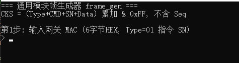

Get Gateway MAC: Make sure the gateway is powered on
~~~~~~~~~~~~~~~~~~~~~~~~~~~~~~~~~~~~~~~~~~~~~~~~~~~~

Receive and view the data output by the gateway TX through any serial port tool such as the serial port assistant. The baud rate defaults to 115200, which is sent in HEX mode and received in HEX mode. Here is an example of the gateway MAC = 8D C6 7F 38 C1 A4

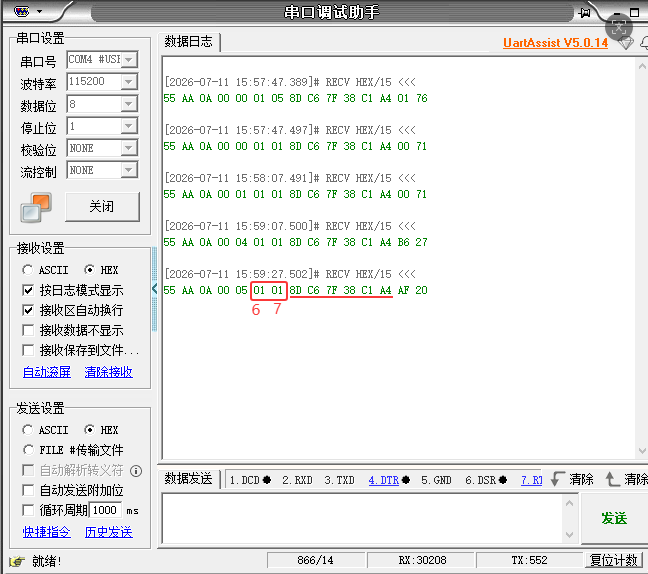

Description :

6th is Type, 01: Gateway, 02: Sub-device

Bit 7 is the CMD field, here 01: heartbeat

The last 6 bits of the 7th bit is the MAC address, fixed 6 bytes in length, and the last three bits are fixed: 38 C1 A4 So when getting the gateway MAC address here: 1. Must be Xx Xx Xx 38 C1 A4, 2. Must be 01 01 followed by 6 consecutive digits. is 6 bits after the beginning of the 8th byte.

Then enter the gateway MAC and return.

.. image:: ../../../image/MYZR-IoT系列/MYZR-MOD-BT7L/用户手册4.png
   :alt: 用户手册4.png
   :width: 100%

.. image:: ../../../image/MYZR-IoT系列/MYZR-MOD-BT7L/用户手册5.png
   :alt: 用户手册5.png
   :width: 100%

**Description**:

Enter the relevant commands after Gateway/Node/All in Step 2 to generate commands. If you need to enter the node MAC address, you can only obtain it during the network provisioning phase. Here, you only need to send after the Gateway: Enter/gw/11 0/1... to familiarize yourself with how the UNVS_Calculate_MAC program generates commands. For methods to obtain the node MAC address, refer to "Bluetooth Universal Module Distribution Network Quick Start.docx"

**Gateway**: Generates commands that only require filling in the Gateway MAC address. Typically used for commands that interact exclusively with the gateway, such as restarting the gateway, restoring the gateway to factory settings, or enabling gateway scanning.

**Node**: Generates commands that require filling in the Node MAC address. Used for commands related to gateway-node communication, like allowing node pairing, restarting nodes, resetting nodes to factory settings, or removing sub-devices. Network configuration is required to obtain the node MAC address. Refer to the 32-pin Universal Module User Manual.docx for network provisioning steps.

**All**: Input sys to execute commands across the entire range from Gateway MAC to Node MAC.

Bluetooth Universal Module Distribution Network Quick Start
-----------------------------------------------------------

Networking Steps
~~~~~~~~~~~~~~~~

To send other commands after successful network distribution or to understand the meaning of all bare data, please refer to the Bluetooth Universal Module Serial Communication Protocol.docx, which only describes the steps of network distribution.

Step 1. Power on the gateway wiring
^^^^^^^^^^^^^^^^^^^^^^^^^^^^^^^^^^^

*  To ensure that the module is connected to the network, strictly follow the steps below

*  The gateway node is connected to 3V3, GND, and the gateway needs to connect to the serial port pin: TX = PB1, RX = PA0, you can use any serial port assistant to send instructions, and TTL is connected to the serial port pin.

Step 2. Get the gateway MAC: Make sure the gateway is powered on
^^^^^^^^^^^^^^^^^^^^^^^^^^^^^^^^^^^^^^^^^^^^^^^^^^^^^^^^^^^^^^^^

First, ensure that the gateway has correctly connected to the power supply 3.3V, and then capture the instructions reported by the gateway TX pin through the serial tool RX pin (HEX mode). At the baud rate of 115200, the serial tool TX pin (HEX mode) issues the command to the gateway RX pin. If the gateway MAC = 8D C6 7F 38 C1 A4, the power-up cycle of the gateway sends a heartbeat command.

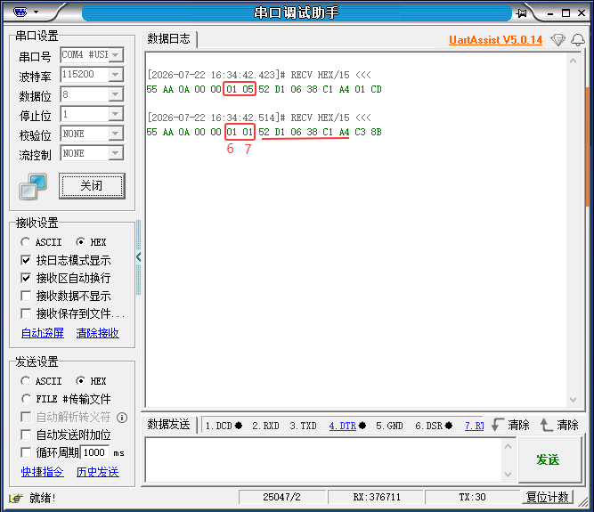

Description :

*  The 6th digit fixed is Type, 01: Gateway, 02: Sub-device.

*  The 7th bit fixed is the CMD field, where 05: power on /重连上报, 01: heartbeat.

*  The 7th digit followed by 6 consecutive digits is the MAC address, fixed 6 bytes in length, and the last three digits are fixed: 38 C1 A4, so when obtaining the MAC address: 1. Format must be Xx Xx Xx 38 C1 A4, 2. Must be 6 digits after 01 01 (must be 01 01). It is 6 consecutive bits after the start of the 8th byte where MAC address = 52 D1 06 38 C1 A4.

crucial point :

*  CMD is used to determine the type of instruction, where 01 is the heartbeat, indicating that it is a heartbeat instruction. The heartbeat format you see next is 55 AA 00 05 030201Xx Xx Xx 38 C1 A447 36.

*  TYPE is used to determine the device type. Here, 01 is the gateway, indicating that it is a command sent by the gateway itself, and CMD is used to indicate that this command is a heartbeat report of the gateway.

*  If you see TYPE = 02, CMD = 01, the following Xx Xx Xx 38 C1 A4 is the sub-device MAC address, that is, the MAC address of the connecting node, the gateway MAC is not the same as the first three bits of the sub-device MAC.

*  Then 05 indicates that the gateway is powered up. Seeing CMD = 05 indicates that the gateway is powered up normally. The CMD = 05 command can also obtain MAC only once, so it is best to obtain MAC from the gateway heartbeat command.

*  If you do not see the gateway heartbeat, check whether the gateway serial port is connected properly, the baud rate, and the HEX reception mode to ensure that the gateway powers up normally, and the gateway powers up and outputs a heartbeat signal.

Step 3. Obtain the network distribution instructions
^^^^^^^^^^^^^^^^^^^^^^^^^^^^^^^^^^^^^^^^^^^^^^^^^^^^

Double-click to run the generic module frame generator UNVS_Caculate_Mac and enter the address of the gateway MAC you just obtained, then enter the car directly

.. image:: ../../../image/MYZR-IoT系列/MYZR-MOD-BT7L/用户手册7.png
   :alt: 用户手册7.png
   :width: 100%

Enter the gateway MAC and enter

.. image:: ../../../image/MYZR-IoT系列/MYZR-MOD-BT7L/用户手册8.png
   :alt: 用户手册8.png
   :width: 100%

and then get back in the car.

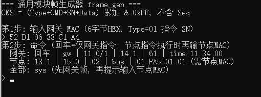

After entering the vehicle, you will see the following command:

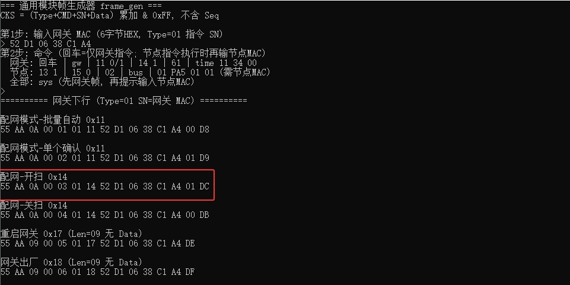

Here the gateway sends an open scan command (power-on defaults to distribution mode - single confirmation)

**Description**: There are two ways to set up the network

*  Send the network distribution mode command first and then start the scanning (no demonstration here, see below - Network Distribution Extension).

*  Send the on-scan directly (demonstrated in this article). This method is conditional on the fact that "batch automatic" has never been sent, and the distribution mode can be switched back.

Step 4. Send the On Scan command
^^^^^^^^^^^^^^^^^^^^^^^^^^^^^^^^

The gateway turns on the network distribution signal broadcast by the scanning node. Note: If the shutdown scanning command is not sent manually, the system will automatically shut down the scanning after 5 minutes to save resources. Can be turned on repeatedly.

.. image:: ../../../image/MYZR-IoT系列/MYZR-MOD-BT7L/用户手册11.png
   :alt: 用户手册11.png
   :width: 100%

Description :

*  There are two MAC addresses, look at the first (yellow label), because the Type field (6th bit) = 01, so this is the MAC address of the gateway. The second (yellow label) instruction has Type = 02, so 88 F1 A2 38 C1 A4 is the MAC address that the gateway scans to the node.

*  If you do not see the node heartbeat, check whether the node power is connected properly to ensure that the gateway nodes are powered on properly. It is best to collectively. If you see an instruction display, and it is an instruction sent in the "single confirmation" mode, you must find it in the instruction in the 7th field CMD = 14. If you first send the batch automatic mode and then start the scanning, the node will enter the network by itself, and there is no need to distribute the network. The node will automatically send the heartbeat to the gateway. Then to obtain the node MAC address, you will find it from the node heartbeat.

Step 5. Generate Incoming Instructions
^^^^^^^^^^^^^^^^^^^^^^^^^^^^^^^^^^^^^^

Reopen the UNVs_Caculate_Mac application to generate the node incoming instructions, enter 13 1 (note the spaces in the middle). CMD = 13 (Internet access allowed), then enter.

.. image:: ../../../image/MYZR-IoT系列/MYZR-MOD-BT7L/用户手册12.png
   :alt: 用户手册12.png
   :width: 100%

and then enter the car.

Input node MAC, enter to generate instructions

.. image:: ../../../image/MYZR-IoT系列/MYZR-MOD-BT7L/用户手册13.png
   :alt: 用户手册13.png
   :width: 100%

Enter again

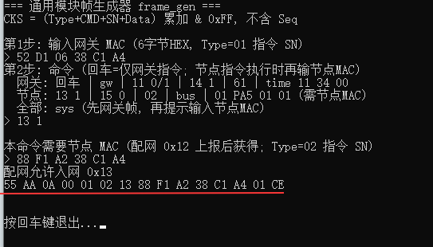

**Note**: The distribution mode must be "single confirmation" for the allow/deny node joining command (0x13) to take effect. If it is a batch mode node, it will automatically enter the network. The first time the gateway directly starts scanning, it will default to a single node entering the network mode. If the first instruction you send is "Batch Auto" in step 3, and then the scan node is turned on, it will be automatically connected to the network.

Step 6. Send the instruction: Send the instruction to allow the child device to enter the network
^^^^^^^^^^^^^^^^^^^^^^^^^^^^^^^^^^^^^^^^^^^^^^^^^^^^^^^^^^^^^^^^^^^^^^^^^^^^^^^^^^^^^^^^^^^^^^^^^

.. image:: ../../../image/MYZR-IoT系列/MYZR-MOD-BT7L/用户手册15.png
   :alt: 用户手册15.png
   :width: 100%

If no node heartbeat is detected, check whether the node power supply is connected properly.
Ensure both the gateway and nodes are powered on normally. Common grounding is recommended.
Power-cycle the node, then retransmit the gateway scan-enable response packet.

Brief description below (see *Bluetooth General Module Serial Communication Protocol.docx* for detailed field explanations):

1: 55 AA 0A 00 01020688 F1 A2 38 C1 A401C1

   Type=02 (Sub-device), CMD=06 (Network Access Report).
   The penultimate byte ``01`` means processing result - Success.
   This frame is the sub-device network access report, indicating the node has joined the network successfully.

2: 55 AA 0A 00 08020188 F1 A2 38 C1 A4F0 AB

   This is the node heartbeat packet. Type=02, CMD=01 (Heartbeat).
   Receiving heartbeat confirms the node is online and successfully joined the network.

Distribution network expansion
~~~~~~~~~~~~~~~~~~~~~~~~~~~~~~

If you need to connect to the network in batches, let a large number of nodes quickly connect to the network instead of screening a single node, as described below, here is an example of the gateway MAC = 8D C6 7F 38 C1 A4.

Send batch network access mode, switch the distribution mode to batch automatic mode

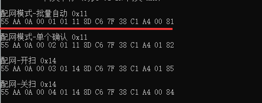

The distribution mode is switched to automatic network access in batches.

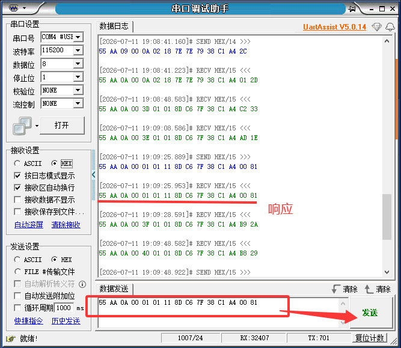

Send again to start scanning

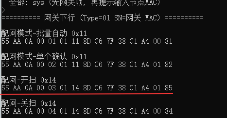

Send to enable gateway scanning, this time in batch form. Automatic access to the network, there is no need to allow /reject network access。

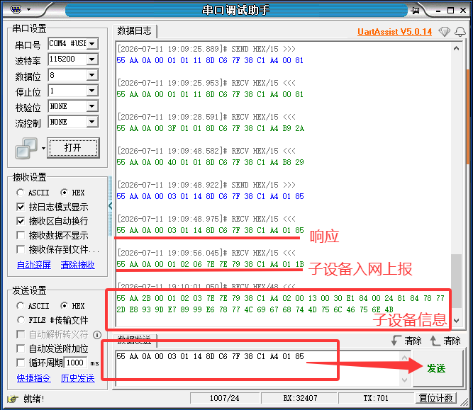

If you have many nodes, you will report many sub-devices to report instructions online. In the following figure, I pasted the "Sub-device Online Report", in order to explain the multi-node situation:

CMD fixed 0x06, indicating online reporting, but the real situation of MAC is that there are as many kinds of MAC as there are nodes. Here, I pasted it and saw the same.

.. image:: ../../../image/MYZR-IoT系列/MYZR-MOD-BT7L/用户手册20.png
   :alt: 用户手册20.png
   :width: 100%

Bluetooth Universal Module Serial Port Communication Protocol
-------------------------------------------------------------

1. Introduction
~~~~~~~~~~~~~~~

Mingyuan Smart Bluetooth Mesh communication protocol is used for serial port to send Bluetooth instructions to the gateway. The protocol is mainly used for communication between the gateway and the node module.

1.1 Architecture Block Diagram
^^^^^^^^^^^^^^^^^^^^^^^^^^^^^^

.. image:: ../../../image/MYZR-IoT系列/MYZR-MOD-BT7L/用户手册21.png
   :alt: 用户手册21.png
   :width: 100%

1.2 Terms and Definitions
^^^^^^^^^^^^^^^^^^^^^^^^^

*  APP: Mobile control software.

*  TTL: Serial Port Tool

*  GW (Gateway): Bluetooth gateway, responsible for protocol conversion and data transparent transmission.

*  Node: BLE Mesh sub-device (such as switches, lamps, etc.).

*  GATT: The communication channel between APP and the gateway.

*  Mesh: The communication channel between the gateway and the node.

1.3 Serial communication specifications
^^^^^^^^^^^^^^^^^^^^^^^^^^^^^^^^^^^^^^^

*  Baud rate: 115200

*  Data bits: 8

*  Parity: None

*  Stop bits: 1

*  Data flow control: None

*  Byte Order: Small End Mode

2. Message format description
~~~~~~~~~~~~~~~~~~~~~~~~~~~~~

2.1 Complete Protocol Frame Fields
^^^^^^^^^^^^^^^^^^^^^^^^^^^^^^^^^^

[HEAD_0][HEAD_1][Length(2)][Seq][Type][CMD][SN(6)][Data][Checksum]

Table 2-1 Protocol Frame Field Descriptions
"""""""""""""""""""""""""""""""""""""""""""

.. raw:: html

   

+-------------+---------------+------+--------------------------------------------------------------------------+
|     ACF     | The field id. | LENG |                               Descriptions                               |
|             |               | TH   |                                                                          |
+=============+===============+======+==========================================================================+
| Protocol    | Head0 + Head1 | 2    | Fixed 0x55 0xAA, fixed value.                                            |
| Flags       |               |      |                                                                          |
+-------------+---------------+------+--------------------------------------------------------------------------+
| Data Length | Length        | 2    | Small end; value = Seq (1) + Type (1) + CMD (1) + SN (6) + Data (N) = 9  |
|             |               |      | + N, excluding Head, Len gth itself, Checksum.                           |
+-------------+---------------+------+--------------------------------------------------------------------------+
| Message-ID  | Seq           | 1    | Request/Response matching; does not participate in checksum.             |
+-------------+---------------+------+--------------------------------------------------------------------------+
| Target      | Type          | 1    | 0x01 = Gateway, 0x02 = Sub-device                                        |
| Device Type |               |      |                                                                          |
+-------------+---------------+------+--------------------------------------------------------------------------+
| CMD Type    | CMD           | 1    | Command type, such as 0x14 remove sub-device, 0x14 start scan, etc. See  |
|             |               |      | Table 3-2 and Table 3-3                                                  |
+-------------+---------------+------+--------------------------------------------------------------------------+
| MAC address | SN            | 6    | Gateway/Sub-device MAC.                                                  |
+-------------+---------------+------+--------------------------------------------------------------------------+
| Datafields  | Data          | 0~96 | Business/System function specific implementation.                        |
+-------------+---------------+------+--------------------------------------------------------------------------+
| Protocol    | Checksum      | 1    | sum = Type + CMD + SN [0.. 5] + Data [0.. N-1], take sum & 0xFF (no Seq, |
| Validation  |               |      | no Head, no Length).                                                     |
+-------------+---------------+------+--------------------------------------------------------------------------+

List of System Command Types
""""""""""""""""""""""""""""

Table 2-2 CMD fields
""""""""""""""""""""

.. raw:: html

   

+----------------+--------------------+-------------+--------------------+
| Type of        | Orientation        | Command     | Descriptions       |
| Message        |                    | type CMD    |                    |
+================+====================+=============+====================+
| System         | 1. Gateway→ Linux  | 0x01        | Heart rate         |
| Instructions   | master             |             |                    |
|                |2.Subdevice→        |             |                    |
|                |Gateway→ Master     |             |                    |
+                +--------------------+-------------+--------------------+
|                | 1.Master→ gateway  | 0x02        | Query device       |
|                |2. Master→          |             | information        |
|                |gateway→            |             |                    |
|                |subdevices          |             |                    |
+                +--------------------+-------------+--------------------+
|                | 1.Gateway→ master  | 0x03        | Device information |
|                |2. Subdevice→       |             | proactively        |
|                |Gateway→ Master     |             | escalated          |
+                +--------------------+-------------+--------------------+
|                | Master →gateway→   | 0x04        | Query device       |
|                | subdevices         |             | network status     |
+                +--------------------+-------------+--------------------+
|                | Subdevice          | 0x05        | Sub-device         |
|                | →Gateway→ Master   |             | reconnection       |
|                |                    |             | escalation         |
+                +--------------------+-------------+--------------------+
|                | Subdevice          | 0x06        | Sub-device online  |
|                | →Gateway→ Master   |             | reporting          |
+                +--------------------+-------------+--------------------+
|                | Subdevice          | 0x07        | Sub-device offline |
|                | →Gateway→ Master   |             | escalation         |
+                +--------------------+-------------+--------------------+
|                | Subdevice          | 0x08        | Sub-device signal  |
|                | →Gateway→ Master   |             | weak escalation    |
+                +--------------------+-------------+--------------------+
|                | Subdevice          | 0x09        | Sub-device status  |
|                | →Gateway→ Master   |             | exception          |
|                |                    |             | escalation         |
+                +--------------------+-------------+--------------------+
|                | Master →gateway→   | 0x10        | Group Address      |
|                | subdevices         |             | Configuration      |
+                +--------------------+-------------+--------------------+
|                | Master →gateway→   | 0x11        | Issued             |
|                | subdevices         |             | distribution       |
|                |                    |             | network mode       |
+                +--------------------+-------------+--------------------+
|                | Gateway →Master    | 0x12        | Escalate scanning  |
|                |                    |             | sub-device         |
|                |                    |             | information        |
+                +--------------------+-------------+--------------------+
|                | Master →Gateway    | 0x13        | Choose whether to  |
|                |                    |             | be connected to    |
|                |                    |             | the Internet       |
+                +--------------------+-------------+--------------------+
|                | Master →Gateway    | 0x14        | Distribution       |
|                |                    |             | network scanning   |
|                |                    |             | switch             |
+                +--------------------+-------------+--------------------+
|                | Master →gateway→   | 0x15        | Remove Sub-Device  |
|                | subdevices         |             |                    |
+                +--------------------+-------------+--------------------+
|                |                    |             |                    |
+                +--------------------+-------------+--------------------+
|                | 1.Master→ gateway  | 0x17        | System Reset       |
|                |2. Master→          |             |                    |
|                |gateway→            |             |                    |
|                |subdevices          |             |                    |
+                +--------------------+-------------+--------------------+
|                | 1.Master→ gateway  | 0x18        | Reset factory      |
|                |2. Master→          |             |                    |
|                |gateway→            |             |                    |
|                |subdevices          |             |                    |
+                +--------------------+-------------+--------------------+
|                |                    |             |                    |
+----------------+--------------------+-------------+--------------------+

List of Business Command Types
""""""""""""""""""""""""""""""

Table 2-3 CMD fields
""""""""""""""""""""

.. raw:: html

   

+----------------+--------------------+----------+------------------+
| Type of        | Orientation        | CMD Type | Descriptions     |
| Message        |                    |          |                  |
+================+====================+==========+==================+
| Business       | 1.Master→ gateway  | 0x30     | OTA Upgrade      |
| Directives     |2. Master→          |          | Instructions     |
|                |gateway→            |          |                  |
|                |subdevices          |          |                  |
+                +--------------------+----------+------------------+
|                | Master →gateway→   | 0x40     | IO Resource      |
|                | subdevices         |          | Allocation       |
+                +--------------------+----------+------------------+
|                | Master →gateway→   | 0x41     | Class A status   |
|                | subdevices         |          | read             |
+                +--------------------+----------+------------------+
|                | Subdevice          | 0x42     | Category A       |
|                | →Gateway→ Master   |          | Escalation       |
+                +--------------------+----------+------------------+
|                | Master →gateway→   | 0x43     | I2C /SPI Register|
|                | subdevices         |          | Read & Write     |
+                +--------------------+----------+------------------+
|                | Master →gateway→   | 0x44     | Class B bus      |
|                | subdevices         |          | enable           |
|                |                    |          | configuration    |
+                +--------------------+----------+------------------+
|                | Subdevice          | 0x45     | Class B bus      |
|                | →Gateway→ Master   |          | active           |
|                |                    |          | escalation       |
+                +--------------------+----------+------------------+
|                |                    |          |                  |
+                +--------------------+----------+------------------+
|                | 1.Master→ gateway  | 0x61     | Property Read    |
|                |2. Master→          |          |                  |
|                |gateway→            |          |                  |
|                |subdevices          |          |                  |
+                +--------------------+----------+------------------+
|                | Master Control→    | 0x62     | Time Calibration |
|                | Gateway            |          |                  |
|                | (Broadcast)        |          |                  |
+                +--------------------+----------+------------------+
|                | Gateway →Master    | 0x63     | Gateway Power On |
|                |                    |          | Time Escalation  |
+                +--------------------+----------+------------------+
|                |                    |          |                  |
+                +--------------------+----------+------------------+
|                | Master →Gateway    | 0x71     | WiFi             |
|                |                    |          | Distribution     |
|                |                    |          | Instructions     |
+----------------+--------------------+----------+------------------+

Peripheral Type
^^^^^^^^^^^^^^^

.. raw:: html

   

+---------+-------------------+----------------------------------------+
| Sort    | peripheral        | Descriptions                           |
+=========+===================+========================================+
| Class A | GPIO/PWM/UART/ADC | Exhaustive, 0x40 enabled, 0x41 read,   |
| Periphe |                   | 0x42 report                            |
| rals    |                   |                                        |
+---------+-------------------+----------------------------------------+
| Class B | I2C/SPI           | Non-exhaustive, 0x43 transparent, 0x44 |
| periphe |                   | enabled, 0x45 reported                 |
| rals    |                   |                                        |
+---------+-------------------+----------------------------------------+

3. Instruction Identification Message
~~~~~~~~~~~~~~~~~~~~~~~~~~~~~~~~~~~~~

**Example 1** : For example, the full frame for querying device information is [HEAD_0] [HEAD_1] [Length (2)] [Seq] [Type] [CMD] [SN (6)] [Checksum]
No Data Fields.

.. raw:: html

   

+-----------+----------+---------+--------+
| Type      | CMD      | SN      | CKS    |
+===========+==========+=========+========+
| 01/02     | 02       |         |        |
+-----------+----------+---------+--------+
| Gateway   | CMD Type | Target  | Verifi |
| /节点     |          | MAC     | cation |
|           |          |         | Code   |
+-----------+----------+---------+--------+

**Example 2** : Gateway scan enable full frame Yes
[HEAD_0][HEAD_1][Length(2)][Seq][Type][CMD][SN(6)][Data][Checksum][Data]=[00/01]

.. raw:: html

   

+---------+----------+--------+--------------+--------+
|  Type   |   CMD    |   SN   |     Data     |  CKS   |
+=========+==========+========+==============+========+
| 01/02   | 14       |        | 00/01        |        |
+---------+----------+--------+--------------+--------+
| Gateway | CMD Type | Target | Close        | Verifi |
| /Node   |          | MAC    | /Enable Scan | cation |
|         |          |        |              | Code   |
+---------+----------+--------+--------------+--------+

Message format description
^^^^^^^^^^^^^^^^^^^^^^^^^^

Table 3-1 Mode field

.. raw:: html

   

+------+------+----------+
| ACF  | HEX  | Descript |
|      |      | ion      |
+======+======+==========+
| Mode | 00   | In Enter |
|      |      | mode     |
+      +------+----------+
|      | 01   | Output   |
|      |      | Mode     |
+      +------+----------+
|      | 02   | PWM mode |
+      +------+----------+
|      | 03   | UART     |
|      |      | mode     |
+      +------+----------+
|      | 04   | SPI mode |
+      +------+----------+
|      | 05   | I2C mode |
+      +------+----------+
|      | 06   | ADC mode |
+------+------+----------+

Table 3-2 Description of Event Type field

.. raw:: html

   

+------------+----------+
| Event Type | Descript |
|            | ions     |
+============+==========+
| 0x00       | Periodic |
|            | escalati |
|            | on       |
+------------+----------+
| 0x01       | Threshol |
|            | d        |
|            | Trigger  |
+------------+----------+
| 0x02       | Interrup |
|            | t        |
|            | Trigger  |
+------------+----------+

3.1 Class A Peripherals
^^^^^^^^^^^^^^^^^^^^^^^

Example (data field): Multiple pins, PB5 + PB4 continuously flipped at the same time

.. raw:: html

   

+------+----------+---------+---------+-----------+----------+----------+------------+----------+----------+--------+
| Type | CMD      | SN      | Data                                                                         | CKS    |
+      +          +         +---------+-----------+----------+----------+------------+----------+----------+        +
|      |          |         | Count   | Pin\_Name | Mode     | State    | Pin\_Name2 | Mode     | State    |        |
+======+==========+=========+=========+===========+==========+==========+============+==========+==========+========+
| 02   | 40       |         | 1~16    | 42 35     | 01       | 03       | 42 34      | 01       | 03       |        |
+------+----------+---------+---------+-----------+----------+----------+------------+----------+----------+--------+
| Node | CMD Type | Target  | Number  | PB5       | Output   | Cycle    | PB4        | Output   | Cycle    | Parity |
|      |          | MAC     | of pins |           | Mode     | Flip     |            | Mode     | Flip     |        |
+------+----------+---------+---------+-----------+----------+----------+------------+----------+----------+--------+

In Enter mode
"""""""""""""

Input mode enabled

.. raw:: html

   

+-----------+----------+---------+----------+--------+-----------+----------+------+----------+------+----------+------+--------------+--------------+
| Type      | CMD      | SN      | Data                                                                                                              |
+           +          +         +----------+--------+-----------+----------+------+----------+------+----------+------+--------------+--------------+
|           |          |         | Count             | Pin\_Name            | Mode            | Pull            | IRQ                 | Debounce\_ms |
+===========+==========+=========+==========+========+===========+==========+======+==========+======+==========+======+==============+==============+
| 01/02     | 14       |         | 1~16              | HEX                  | 0x00            | 00/01/02        | 00/01/02            | ——           |              
+-----------+----------+---------+----------+--------+-----------+----------+------+----------+------+----------+------+--------------+--------------+
| Gateway   | CMD Type | Target  | pin count         | Pin Name             | In Enter mode   | Float Up Drop   | No rising edge      | Anti-jitter  |
| /节点     |          | MAC     |                   |                      |                 | Down            | descending edge     | ms (2B)      |
|           |          |         |                   |                      |                 |                 |                     |              |
+-----------+----------+---------+----------+--------+-----------+----------+------+----------+------+----------+------+--------------+--------------+

Level Configuration
"""""""""""""""""""

IO Enabled

.. raw:: html

   

+------+----------+---------+----------+--------+-----------+----------+---------------+------------+----------+--------+
| Type | CMD      | SN      | Data                                                                             | CKS    |
+      +          +         +----------+--------+-----------+----------+---------------+------------+----------+        +
|      |          |         | Count             | Pin\_Name            | Mode          | Action                |        |
+======+==========+=========+==========+========+===========+==========+===============+============+==========+========+
| 02   | 14       |         | 1~16              | HEX                  | 01            | 00 Low     | ——       |        |
|      |          |         |                   |                      |               | level      |          |        |
+      +          +         +                   +                      +               +------------+----------+        +
|      |          |         |                   |                      |               | 01 High    | ——       |        |
|      |          |         |                   |                      |               | level      |          |        |
+      +          +         +                   +                      +               +------------+----------+        +
|      |          |         |                   |                      |               | 02 Single  | ——       |        |
|      |          |         |                   |                      |               | Flip       |          |        |
+      +          +         +                   +                      +               +------------+----------+        +
|      |          |         |                   |                      |               | 03 Cycle   | Period   |        |
|      |          |         |                   |                      |               | Flip       |          |        |
+------+----------+---------+----------+--------+-----------+----------+---------------+------------+----------+--------+
| Node | CMD Type | Target  | pin count         | Pin Name             | Output Mode   | Action     | Compleme | Parity |
|      |          | MAC     |                   |                      |               |            | ntary    |        |
|      |          |         |                   |                      |               |            | fields   |        |
+------+----------+---------+----------+--------+-----------+----------+---------------+------------+----------+--------+

PWM Peripherals
"""""""""""""""

PWM Off

.. raw:: html

   

+------+----------+---------+----------+-----------+------+-------+--------+
| Type | CMD      | SN      | Data                                | CKS    |
+      +          +         +----------+-----------+------+-------+        +
|      |          |         | Count    | Pin\_Name | Mode | State |        |
+======+==========+=========+==========+===========+======+=======+========+
| 02   | 40       |         | 1~16     | HEX       | 0x02 | 00    |        |
+------+----------+---------+----------+-----------+------+-------+--------+
| Node | CMD Type | Target  | pin      | Pin Name  | PWM  | Latch | Parity |
|      |          | MAC     | count    |           |      | ing   |        |
|      |          |         |          |           |      | power |        |
|      |          |         |          |           |      | down  |        |
+------+----------+---------+----------+-----------+------+-------+--------+

PWM Square Wave Effect, Fixed Period

.. raw:: html

   

+------+----------+---------+----------+-----------+------+----------+-------+--------+--------+
| Type | CMD      | SN      | Data                                                    | CKS    |
+      +          +         +----------+-----------+------+----------+-------+--------+        +
|      |          |         | Count    | Pin\_Name | Mode | Pattern  | State | Action |        |
+======+==========+=========+==========+===========+======+==========+=======+========+========+
| 02   | 40       |         | 1~16     | HEX       | 0x02 | 00       | 01    | 0~64   |        |
+------+----------+---------+----------+-----------+------+----------+-------+--------+--------+
| Node | CMD Type | Target  | pin      | Pin Name  | PWM  | Restrica | Open  | Duty   | Parity |
|      |          | MAC     | count    |           |      | ted Mode |       | Cycle  |        |
+------+----------+---------+----------+-----------+------+----------+-------+--------+--------+

PWM Respiration Effect - Single Cycle

.. raw:: html

   

+------+----------+---------+----------+-----------+------+----------+------+-------+------+-------+------+--------+--------+
| Type | CMD      | SN      | Data                                                                                 | CKS    |
+      +          +         +----------+-----------+------+----------+------+-------+------+-------+------+--------+        +
|      |          |         | Count    | Pin\_Name | Mode | Pattern  | FUN  | State | T    | Limit        | Action |        |
+======+==========+=========+==========+===========+======+==========+======+=======+======+=======+======+========+========+
| 02   | 40       |         | 1~16     | HEX       | 0x02 | 01       | 00   | 01    | Ms   | 0~Ms  | 0~Ms | 0~64   |        |
+------+----------+---------+----------+-----------+------+----------+------+-------+------+-------+------+--------+--------+
| Node | CMD Type | Target  | pin      | Pin Name  | PWM  | Ventilat | Sing | Open  | Peri | Min   | Max  | Duty   | Parity |
|      |          | MAC     | count    |           |      | ion      | le   |       | od   |       |      | Cycle  |        |
|      |          |         |          |           |      | modes    | admi |       |      |       |      |        |        |
|      |          |         |          |           |      |          | nist |       |      |       |      |        |        |
|      |          |         |          |           |      |          | rati |       |      |       |      |        |        |
|      |          |         |          |           |      |          | on   |       |      |       |      |        |        |
+------+----------+---------+----------+-----------+------+----------+------+-------+------+-------+------+--------+--------+

PWM Respiration Effect - Cycle

.. raw:: html

   

+------+----------+---------+----------+-----------+------+----------+------+-------+------+-------+------+--------+
| Type | CMD      | SN      | Data                                                                        | CKS    |
+      +          +         +----------+-----------+------+----------+------+-------+------+-------+------+        +
|      |          |         | Count    | Pin\_Name | Mode | Pattern  | FUN  | State | T    | Limit        |        |
+======+==========+=========+==========+===========+======+==========+======+=======+======+=======+======+========+
| 02   | 40       |         | 1~16     | HEX       | 0x02 | 01       | 01   | 01    | Ms   | 0~Ms  | 0~Ms |        |
+------+----------+---------+----------+-----------+------+----------+------+-------+------+-------+------+--------+
| Node | CMD Type | Target  | pin      | Pin Name  | PWM  | Ventilat | Loop | Open  | Peri | Min   | Max  | Parity |
|      |          | MAC     | count    |           |      | ion      | ing: |       | od   |       |      |        |
|      |          |         |          |           |      | modes    |      |       |      |       |      |        |
+------+----------+---------+----------+-----------+------+----------+------+-------+------+-------+------+--------+

UART Peripherals
""""""""""""""""

UART Enable

.. raw:: html

   

+------+----------+---------+----------+-----------+------+-------+----------------+--------+
| Type | CMD      | SN      | Data                                                 | CKS    |
+      +          +         +----------+-----------+------+-------+----------------+        +
|      |          |         | Count    | Pin\_Name | Mode | FUN   | BAUD           |        |
+======+==========+=========+==========+===========+======+=======+================+========+
| 02   | 40       |         | 1~16     | HEX       | 0x03 | 00/01 | 9600/115200/…… |        |
+------+----------+---------+----------+-----------+------+-------+----------------+--------+
| Node | CMD Type | Target  | pin      | Pin Name  | UART | RX/TX | 4 bytes        | Parity |
|      |          | MAC     | count    |           |      |       |                |        |
+------+----------+---------+----------+-----------+------+-------+----------------+--------+

ADC Peripherals
"""""""""""""""

ADC Enable

.. raw:: html

   

+------+----------+---------+----------+-----------+------+-------+----------+----------+-------------+--------+
| Type | CMD      | SN      | Data                                                                    | CKS    |
+      +          +         +----------+-----------+------+-------+----------+----------+-------------+        +
|      |          |         | Count    | Pin\_Name | Mode | State | Period   | Limit    | Resolution  |        |
+======+==========+=========+==========+===========+======+=======+==========+==========+=============+========+
| 02   | 40       |         | 1~16     | HEX       | 0x06 | 00/01 | 1000     | 64       | 08/0A/0C    |        |
+------+----------+---------+----------+-----------+------+-------+----------+----------+-------------+--------+
| Node | CMD Type | Target  | pin      | Pin Name  | ADC  | Off   | 1s（2B） | Voltage  | Accuracy    | Parity |
|      |          | MAC     | count    |           |      | /ON   |          | Threshol | 8/10/12     |        |
|      |          |         |          |           |      |       |          | d        |             |        |
+------+----------+---------+----------+-----------+------+-------+----------+----------+-------------+--------+

ADC Enable Result Escalation

.. raw:: html

   

+------+----------+---------+-----------+------+-------+--------+--------+
| Type | CMD      | SN      | Data                              | CKS    |
+      +          +         +-----------+------+-------+--------+        +
|      |          |         | Pin\_Name | Mode | Value | Result |        |
+======+==========+=========+===========+======+=======+========+========+
| 02   | 42       |         | HEX       | 0x06 |       | 00     |        |
+------+----------+---------+-----------+------+-------+--------+--------+
| Node | CMD Type | Target  | Pin Name  | ADC  | Value | Berhas | Parity |
|      |          | MAC     |           |      |       | il     |        |
+------+----------+---------+-----------+------+-------+--------+--------+

Class A Peripherals
"""""""""""""""""""

Read pin mode /状态

.. raw:: html

   

+------+----------+---------+----------+-----------+---------+--------+
| Type | CMD      | SN      | Data                           | CKS    |
+      +          +         +----------+-----------+---------+        +
|      |          |         | Count    | Pin\_Name | Mode    |        |
+======+==========+=========+==========+===========+=========+========+
| 02   | 41       |         | 1~16     | HEX       |         |        |
+------+----------+---------+----------+-----------+---------+--------+
| Node | CMD Type | Target  | pin      | Pin Name  | See     | Parity |
|      |          | MAC     | count    |           | Table   |        |
|      |          |         |          |           | 4-1     |        |
+------+----------+---------+----------+-----------+---------+--------+

Response after reading (e.g. reading ADC response)

.. raw:: html

   

+------+----------+---------+----------+-----------+---------+------------+------------+----------+--------+
| Type | CMD      | SN      | Data                                                                | CKS    |
+      +          +         +----------+-----------+---------+------------+------------+----------+        +
|      |          |         | Count    | Pin\_Name | Mode    | Event Type | Value      | Reserved |        |
+======+==========+=========+==========+===========+=========+============+============+==========+========+
| 02   | 42       |         | 1~16     | HEX       | 06      | See Table  | 1C 07      | 00       |        |
|      |          |         |          |           |         | 4-2        |            |          |        |
+------+----------+---------+----------+-----------+---------+------------+------------+----------+--------+
| Node | CMD Type | Target  | pin      | Pin Name  | ADC     | Type of    | Voltage    | Object   | Parity |
|      |          | MAC     | count    |           | mode    | occurrence | 1.820V     | code     |        |
+------+----------+---------+----------+-----------+---------+------------+------------+----------+--------+

3.2 Class B Peripherals
^^^^^^^^^^^^^^^^^^^^^^^

Bus Transparent Reading
"""""""""""""""""""""""

.. raw:: html

   

+------+----------+---------+------------+------------+--------+-----------+------------+-------------------+--------+
| Type | CMD      | SN      | Data                                                                          | CKS    |
+      +          +         +------------+------------+--------+-----------+------------+-------------------+        +
|      |          |         | Busy\_Type | Ops\_Count | OPCODE | Addr (1B) | Reg(1B)    | Data\_Len(1B)     |        |
+======+==========+=========+============+============+========+===========+============+===================+========+
| 02   | 43       |         | 00         | 01/02      | 01     | 0x68      | 0x6B       |                   |        |
+------+----------+---------+------------+------------+--------+-----------+------------+-------------------+--------+
| Node | CMD Type | Target  | I2C        | Number of  | read   | Slave     | Register   | Read Length Max   | Parity |
|      |          | MAC     |            | OPs        |        | Address   | Address    | Read 61b          |        |
+------+----------+---------+------------+------------+--------+-----------+------------+-------------------+--------+

Bus Transparent Write
"""""""""""""""""""""

.. raw:: html

   

+------+----------+---------+------------+------------+--------+----------+------------+-----------+----------+--------+
| Type | CMD      | SN      | Data                                                                            | CKS    |
+      +          +         +------------+------------+--------+----------+------------+-----------+----------+        +
|      |          |         | Busy\_Type | Ops\_Count | OPCODE | Addr     | Reg (1B)   | Data\_Len | Data     |        |
|      |          |         |            |            |        | (1B)     |            | (1B)      | Max=58B  |        |
+======+==========+=========+============+============+========+==========+============+===========+==========+========+
| 02   | 43       |         | 00         | 01/02      | 00     | 0x68     | 0x6B       |           |          |        |
+------+----------+---------+------------+------------+--------+----------+------------+-----------+----------+--------+
| Node | CMD Type | Target  | I2C        | Number of  | Writin | Slave    | Register   | Write     | Write    | Parity |
|      |          | MAC     |            | OPs        | g      | Address  | Address    | Length    | Contents |        |
+------+----------+---------+------------+------------+--------+----------+------------+-----------+----------+--------+

I2C bus enable, configure pins
""""""""""""""""""""""""""""""

.. raw:: html

   

+------+----------+---------+------------+--------+----------+---------+---------+--------+
| Type | CMD      | SN      | Data                                               | CKS    |
+      +          +         +------------+--------+----------+---------+---------+        +
|      |          |         | Busy\_Type | Enable | Clock    | SDA(2B) | SCL(2B) |        |
|      |          |         |            |        | frequenc |         |         |        |
|      |          |         |            |        | y        |         |         |        |
+======+==========+=========+============+========+==========+=========+=========+========+
| 02   | 44       |         | 00         | 00/01  | 1000000  |         |         |        |
+------+----------+---------+------------+--------+----------+---------+---------+--------+ 
| Node | CMD Type | Target  | I2C        | SW.    | Clock    | Data    | track   | Parity |
|      |          | MAC     |            |        | frequenc | cable   |         |        |
|      |          |         |            |        | y        |         |         |        |
+------+----------+---------+------------+--------+----------+---------+---------+--------+

I2C Enable Escalation
"""""""""""""""""""""

.. raw:: html

   

+------+----------+---------+------------+-----------+--------+
| Type | CMD      | SN      | Data                   | CKS    |
+      +          +         +------------+-----------+        +
|      |          |         | Busy\_Type | Result    |        |
+======+==========+=========+============+===========+========+
| 02   | 0x44     |         | 00         | 00/01     |        |
+------+----------+---------+------------+-----------+--------+
| Node | Enable   | Target  | I2C        | Success   | Parity |
|      | escalati | MAC     |            | /Define   |        |
|      | on       |         |            |           |        |
+------+----------+---------+------------+-----------+--------+

SPI Read
""""""""

.. raw:: html

   

+------+----------+---------+------------+------------+--------+-------------+--------+
| Type | CMD      | SN      | Data                                           | CKS    |
+      +          +         +------------+------------+--------+-------------+        +
|      |          |         | Busy\_Type | Ops\_Count | OPCODE | Read\_Len   |        |
|      |          |         |            |            |        | (1B)        |        |
+======+==========+=========+============+============+========+=============+========+
| 02   | 43       |         | 00         | 01/02      | 01     |             |        |
+------+----------+---------+------------+------------+--------+-------------+--------+
| Node | CMD Type | Target  | SPI        | Number of  | read   | Read Length | Parity |
|      |          | MAC     |            | OPs        |        | Max Read    |        |
|      |          |         |            |            |        | 61b         |        |
+------+----------+---------+------------+------------+--------+-------------+--------+

SPI Write
"""""""""

.. raw:: html

   

+------+----------+---------+------------+------------+--------+-----------+----------+--------+
| Type | CMD      | SN      | Data                                                    | CKS    |
+      +          +         +------------+------------+--------+-----------+----------+        +
|      |          |         | Busy\_Type | Ops\_Count | OPCODE | Read\_Len | Data     |        |
|      |          |         |            |            |        | (1B)      | Max=59B  |        |
+======+==========+=========+============+============+========+===========+==========+========+
| 02   | 43       |         | 00         | 01/02      | 00     |           |          |        |
+------+----------+---------+------------+------------+--------+-----------+----------+--------+
| Node | CMD Type | Target  | SPI        | Number of  | Writin | Write     | Write    | Parity |
|      |          | MAC     |            | OPs        | g      | Length    | Contents |        |
+------+----------+---------+------------+------------+--------+-----------+----------+--------+

SPI bus enable, configure pins
""""""""""""""""""""""""""""""

.. raw:: html

   

+------+----------+---------+------------+--------+----------+-----------+--------+
| Type | CMD      | SN      | Data                                       | CKS    |
+      +          +         +------------+--------+----------+-----------+        +
|      |          |         | Busy\_Type | Enable | Clock    | SPI\_Mode |        |
|      |          |         |            |        | frequenc |           |        |
|      |          |         |            |        | y        |           |        |
+======+==========+=========+============+========+==========+===========+========+
| 02   | 42       |         | 00         | 00/01  | 1000000  | 0~3       |        |
+------+----------+---------+------------+--------+----------+-----------+--------+
| Node | CMD Type | Target  | SPI        | SW.    | Clock    | Node      | Parity |
|      |          | MAC     |            |        | frequenc | Definitio |        |
|      |          |         |            |        | y        | ns        |        |
+------+----------+---------+------------+--------+----------+-----------+--------+

SPI Enable Escalation
"""""""""""""""""""""

.. raw:: html

   

+------+----------+---------+------------+-----------+--------+
| Type | CMD      | SN      | Data                   | CKS    |
+      +          +         +------------+-----------+        +
|      |          |         | Busy\_Type | Result    |        |
+======+==========+=========+============+===========+========+
| 02   | 0x44     |         | 01         | 00/01     |        |
+------+----------+---------+------------+-----------+--------+
| Node | Enable   | Target  | SPI        | Success   | Parity |
|      | escalati | MAC     |            | /Define   |        |
|      | on       |         |            |           |        |
+------+----------+---------+------------+-----------+--------+

Proactive escalation
""""""""""""""""""""

.. raw:: html

   

+------+----------+---------+-----------+--------------+-----------+--------+
| Type | CMD      | SN      | Data                                 | CKS    |
+      +          +         +-----------+--------------+-----------+        +
|      |          |         | Bus\_Type | Data\_Len    | Pay\_Load |        |
+======+==========+=========+===========+==============+===========+========+
| 02   | 45       |         | 00/01     |              |           |        |
+------+----------+---------+-----------+--------------+-----------+--------+
| Node | Proactiv | Target  | I2C/SPI   | Report Data  | Contents  | Parity |
|      | e        | MAC     |           | Length       |           |        |
|      | escalati |         |           |              |           |        |
|      | on       |         |           |              |           |        |
+------+----------+---------+-----------+--------------+-----------+--------+

Gateway Request Calibration Time (Uplink)
"""""""""""""""""""""""""""""""""""""""""

.. raw:: html

   

+------+--------------+---------+------+--------+--------+--------+
| Type | CMD          | SN      | Data                   | CKS    |
+      +              +         +------+--------+--------+        +
|      |              |         | Hour | Minute | Second |        |
+======+==============+=========+======+========+========+========+
| 01   | 63           |         |      |        |        |        |
+------+--------------+---------+------+--------+--------+--------+
| Gate | Request Time | Target  | 111  | cent   | Detik  | Parity |
| way  | Calibration  | MAC     |      |        |        |        |
+------+--------------+---------+------+--------+--------+--------+

Calibration time
""""""""""""""""

Release Time Calibration

.. raw:: html

   

+------+----------+---------+------+--------+--------+--------+
| Type | CMD      | SN      | Data                   | CKS    |
+      +          +         +------+--------+--------+        +
|      |          |         | Hour | Minute | Second |        |
+======+==========+=========+======+========+========+========+
| 01   | 62       |         | 0~17 | 0~3B   | 0~3B   |        |
+------+----------+---------+------+--------+--------+--------+
| Gate | Time     | Target  | 111  | cent   | Detik  | Parity |
| way  | Calibrat | MAC     |      |        |        |        |
|      | ion      |         |      |        |        |        |
+------+----------+---------+------+--------+--------+--------+

Time Report (Reported on power-up / reset / restart)

.. raw:: html

   

+------+----------+---------+--------+--------+--------+--------+
| Type | CMD      | SN      | Data                     | CKS    |
+      +          +         +--------+--------+--------+        +
|      |          |         | Hour   | Minute | Second |        |
+======+==========+=========+========+========+========+========+
| 01   | 62       |         |        |        |        |        |
+------+----------+---------+--------+--------+--------+--------+
| Gate | Time     | Target  | Hour 0 | Min 0  | s 0 ~  | Parity |
| way  | Calibrat | MAC     | ~ 17   | ~ 3B   | 3B     |        |
|      | ion      |         |        |        |        |        |
+------+----------+---------+--------+--------+--------+--------+

3.3 System Identification Messages
^^^^^^^^^^^^^^^^^^^^^^^^^^^^^^^^^^

Heart rate
""""""""""

.. raw:: html

   

+-----------+------------+---------------+----------------+--------+
| Type      | CMD        | SN            | Data           | CKS    |
+           +            +               +----------------+        +
|           |            |               | RSSI           |        |
+===========+============+===============+================+========+
| 01/02     | 01         |               |                |        |
+-----------+------------+---------------+----------------+--------+
| Gateway   | Heartbeat  | MAC for Type  | Signal         | Parity |
| /Node     | Packet     |               | strength (1B)  |        |
|           | Escalation |               |                |        |
+-----------+------------+---------------+----------------+--------+

Device Info
"""""""""""

Device Information Escalation

.. raw:: html

   

+-----------+--------------+---------------+--------------+--------+
| Type      | CMD          | SN            | Data         | CKS    |
+           +              +               +--------------+        +
|           |              |               | MSG\_Service |        |
+===========+==============+===============+==============+========+
| 01/02     | 03           |               |              |        |
+-----------+--------------+---------------+--------------+--------+
| Gateway   | Device       | MAC for Type  | Device Info  | Parity |
| /Node     | Information  |               |              |        |
|           | Escalation   |               |              |        |
+-----------+--------------+---------------+--------------+--------+

Device Connection Status
""""""""""""""""""""""""

Query network status

.. raw:: html

   

+-----------+--------------+---------------+----------------+--------+
| Type      | CMD          | SN            | Data           | CKS    |
+           +              +               +----------------+        +
|           |              |               | Connect\_State |        |
+===========+==============+===============+================+========+
| 01/02     | 04           |               | 00/01          |        |
+-----------+--------------+---------------+----------------+--------+
| Gateway   | Query        | MAC for Type  | Offline        | Parity |
| /Node     | network      |               | /Online        |        |
|           | status       |               |                |        |
+-----------+--------------+---------------+----------------+--------+

Device reconnection escalation
""""""""""""""""""""""""""""""

.. raw:: html

   

+-----------+--------------+---------+-----------+--------+
| Type      | CMD          | SN      | Data      | CKS    |
+           +              +         +-----------+        +
|           |              |         | Result    |        |
+===========+==============+=========+===========+========+
| 01/02     | 0x05         |         | 00/01     |        |
+-----------+--------------+---------+-----------+--------+
| Gateway   | Device       | Target  | Failed    | Parity |
| /Node     | reconnection | MAC     | /Define   |        |
|           | escalation   |         |           |        |
+-----------+--------------+---------+-----------+--------+

Sub-device online reporting
"""""""""""""""""""""""""""

.. raw:: html

   

+------+----------------+---------+-----------+--------+
| Type | CMD            | SN      | Data      | CKS    |
+      +                +         +-----------+        +
|      |                |         | Result    |        |
+======+================+=========+===========+========+
| 02   | 0x06           |         | 00/01     |        |
+------+----------------+---------+-----------+--------+
| Node | Sub-device     | Target  | Failed    | Parity |
|      | online         | MAC     | /Success  |        |
|      | reporting      |         |           |        |
+------+----------------+---------+-----------+--------+

Sub-device offline escalation
"""""""""""""""""""""""""""""

.. raw:: html

   

+------+----------------+---------+--------+--------+
| Type | CMD            | SN      | Data   | CKS    |
+      +                +         +--------+        +
|      |                |         | Result |        |
+======+================+=========+========+========+
| 02   | 0x07           |         | 00     |        |
+------+----------------+---------+--------+--------+
| Node | Sub-device     | Target  | Offlin | Parity |
|      | offline        | MAC     | e      |        |
|      | escalation     |         |        |        |
+------+----------------+---------+--------+--------+

Device signal weak escalation
"""""""""""""""""""""""""""""

.. raw:: html

   

+-------+------------+---------+----------+--------+
| Type  | CMD        | SN      | Data     | CKS    |
+       +            +         +----------+        +
|       |            |         | RSSI     |        |
+=======+============+=========+==========+========+
| 01/02 | 0x08       |         | 00~FF    |        |
+-------+------------+---------+----------+--------+
| Node  | Weak       | Target  | Signal   | Parity |
|       | device     | MAC     | strength |        |
|       | signal     |         |          |        |
+-------+------------+---------+----------+--------+

Sub-device status exception escalation
""""""""""""""""""""""""""""""""""""""

.. raw:: html

   

+------+----------------+---------+-------+--------+
| Type | CMD            | SN      | Data  | CKS    |
+      +                +         +-------+        +
|      |                |         | State |        |
+======+================+=========+=======+========+
| 02   | 0x09           |         | 00~FF |        |
+------+----------------+---------+-------+--------+
| Node | Child Device   | Target  | Statu | Parity |
|      | Status         | MAC     | s     |        |
|      | Exception      |         |       |        |
+------+----------------+---------+-------+--------+

Group address
"""""""""""""

Group Address Subscription

.. raw:: html

   

+------+------------+---------+--------+-------------+--------+
| Type | CMD        | SN      | Data                 | CKS    |
+      +            +         +--------+-------------+        +
|      |            |         | Apt/Su | Action      |        |
|      |            |         | ite    |             |        |
+======+============+=========+========+=============+========+
| 02   | 0x10       |         | 00     | 00/01       |        |
+------+------------+---------+--------+-------------+--------+
| Node | Group      | Target  | Group  | Back        | Parity |
|      | Address    | MAC     | addres | /Group      |        |
|      | Subscripti |         | s      | Address     |        |
|      | on         |         |        |             |        |
+------+------------+---------+--------+-------------+--------+

Group Subscription Processing Escalation
""""""""""""""""""""""""""""""""""""""""

.. raw:: html

   

+------+----------------+---------+--------+-------------+-----------+--------+
| Type | CMD            | SN      | Data                             | CKS    |
+      +                +         +--------+-------------+-----------+        +
|      |                |         | Apt/Su | Action      | Result    |        |
|      |                |         | ite    |             |           |        |
+======+================+=========+========+=============+===========+========+
| 02   | 0x10           |         | 00     | 00/01       | 00/01     |        |
+------+----------------+---------+--------+-------------+-----------+--------+
| Node | Group          | Target  | Group  | Back        | Failed    | Parity |
|      | Subscription   | MAC     | addres | /Group      | /Success  |        |
|      | Processing     |         | s      |             |           |        |
|      | Escalation     |         |        |             |           |        |
+------+----------------+---------+--------+-------------+-----------+--------+

Network Configuration
"""""""""""""""""""""

Distribution network mode enabled

.. raw:: html

   

+------+----------+---------+-------------------+--------+
| Type | CMD      | SN      | Data              | CKS    |
+      +          +         +-------------------+        +
|      |          |         | State             |        |
+======+==========+=========+===================+========+
| 01   | 0x11     |         | 00/01             |        |
+------+----------+---------+-------------------+--------+
| Gate | Distribu | Target  | Single            | Parity |
| way  | tion     | MAC     | /Batch Access     |        |
|      | network  |         | Mode              |        |
|      | mode     |         |                   |        |
+------+----------+---------+-------------------+--------+

Remarks:

By default, the gateway uses the single access mode to send the batch access mode, and the distribution mode can be switched. If the scanning command is directly sent for the first time, the scanning will be turned on in a single network mode, and it can be switched on later to support power-on memory.
Single: Requires user permission / reject network access.

Batch: Automatic network access, suitable for a large number of nodes to access the network. Subsequently, you can cooperate with the query of equipment information and equipment factory instructions to kick out unwanted nodes.

Gateway scanning enabled
""""""""""""""""""""""""

.. raw:: html

   

+------+--------------+---------+---------------+--------+
| Type | CMD          | SN      | Data          | CKS    |
+      +              +         +---------------+        +
|      |              |         | State         |        |
+======+==============+=========+===============+========+
| 01   | 0x14         |         | 00/01         |        |
+------+--------------+---------+---------------+--------+
| Gate | Gateway      | Target  | Close         | Parity |
| way  | Distribution | MAC     | /Enable       |        |
|      | Network      |         | Scanning      |        |
|      | Scanning     |         |               |        |
+------+--------------+---------+---------------+--------+

Select the device to access the network
"""""""""""""""""""""""""""""""""""""""

.. raw:: html

   

+------+----------+---------+-------------------+--------+
| Type | CMD      | SN      | Data              | CKS    |
+      +          +         +-------------------+        +
|      |          |         | Action            |        |
+======+==========+=========+===================+========+
| 01   | 0x13     |         | 00/01             |        |
+------+----------+---------+-------------------+--------+
| Gate | Opt-In   | Target  | Reject            | Parity |
| way  |          | MAC     | /Allow            |        |
+------+----------+---------+-------------------+--------+

Equipment Management
""""""""""""""""""""

Remove / Reconnect Sub-device

.. raw:: html

   

+------+----------+---------+-----------+--------+
| Type | CMD      | SN      | Data      | CKS    |
+      +          +         +-----------+        +
|      |          |         | Action    |        |
+======+==========+=========+===========+========+
| 02   | 0x15     |         | 00/01     |        |
+------+----------+---------+-----------+--------+
| Node | Equipmen | Target  | Remove    | Parity |
|      | t        | MAC     | /Remove   |        |
|      | Manageme |         |           |        |
|      | nt       |         |           |        |
+------+----------+---------+-----------+--------+

Device Management Escalation
""""""""""""""""""""""""""""

.. raw:: html

   

+------+----------+---------+-----------+-----------+--------+
| Type | CMD      | SN      | Data                  | CKS    |
+      +          +         +-----------+-----------+        +
|      |          |         | Action    | Result    |        |
+======+==========+=========+===========+===========+========+
| 02   | 0x15     |         | 00/01     | 00/01     |        |
+------+----------+---------+-----------+-----------+--------+
| Node | Equipmen | Target  | Remove    | Failed    | Parity |
|      | t        | MAC     | /Remove   | /Success  |        |
|      | Manageme |         |           |           |        |
|      | nt       |         |           |           |        |
+------+----------+---------+-----------+-----------+--------+

System Reset
""""""""""""

.. raw:: html

   

+------+----------+---------+--------+
| Type | CMD      | SN      | CKS    |
+======+==========+=========+========+
| 02   | 0x17     |         |        |
+------+----------+---------+--------+
| Node | System   | Target  | Parity |
|      | Reset    | MAC     |        |
+------+----------+---------+--------+

Reset factory
"""""""""""""

Factory reset

.. raw:: html

   

+-----------+----------+---------+--------+
| Type      | CMD      | SN      | CKS    |
+===========+==========+=========+========+
| 01/02     | 0x18     |         |        |
+-----------+----------+---------+--------+
| Gateway   | Reset    | Target  | Parity |
| /Node     | factory  | MAC     |        |
+-----------+----------+---------+--------+

Factory Report

.. raw:: html

   

+-----------+----------+---------+-----------+--------+
| Type      | CMD      | SN      | Data      | CKS    |
+           +          +         +-----------+        +
|           |          |         | Result    |        |
+===========+==========+=========+===========+========+
| 01/02     | 0x18     |         | 00/01     |        |
+-----------+----------+---------+-----------+--------+
| Gateway   | Reset    | Target  | Failed    | Parity |
| /Node     | factory  | MAC     | /Success  |        |
+-----------+----------+---------+-----------+--------+

device property
"""""""""""""""

Query device properties

.. raw:: html

   

+-----------+----------+---------+--------+
| Type      | CMD      | SN      | CKS    |
+===========+==========+=========+========+
| 01/02     | 0x61     |         |        |
+-----------+----------+---------+--------+
| Gateway   | device   | Target  | Parity |
| /Node     | property | MAC     |        |
+-----------+----------+---------+--------+

Device Attribute Escalation

.. raw:: html

   

+------+----------+---------+----------+----------+----------+----------+------+------+------+--------+--------+
| Type | CMD      | SN      | Data                                                                    | CKS    |
+      +          +         +----------+----------+----------+----------+------+------+------+--------+        +
|      |          |         | [0]      | [1~2]    | [3]      | [4]      | [5]  | [6]  | [7]  | [8~19] |        |
+======+==========+=========+==========+==========+==========+==========+======+======+======+========+========+
| 01   | 61       |         | 1~16     | HEX      | 0x02     | 01       | 01   | 01   | Ms   | All 00 |        |
+------+----------+---------+----------+----------+----------+----------+------+------+------+--------+--------+
| Gate | device   | Target  | Device   | Mesh     | Online   | Firmware | 111  | cent | Deti | Keep   | Parity |
| way  | property | MAC     | type     | Address  | status   | Version  |      |      | k    | unused |        |
+------+----------+---------+----------+----------+----------+----------+------+------+------+--------+--------+

Bluetooth Universal Module User Manual
--------------------------------------

1. Product Overview
~~~~~~~~~~~~~~~~~~~

The universal module is a Bluetooth module that complies with the BLE 5.0 low-power Tmall Genie Mesh based on the TLSR8258 chip. The module is a Bluetooth module with Bluetooth mesh networking function. The devices communicate through peer-to-peer star network communication and use Bluetooth broadcast to communicate, which can ensure timely response in multiple devices.

to meet diverse IoT and hardware control scenarios. The core advantage is the dynamic configurability of the pin function. Users do not need to change the hardware circuit, according to the actual business needs, only need to send specific instructions through the serial port, you can change the pin working mode, such as GPIO, PWM, UART, etc., to achieve flexible pin multiplexing.

The product offers 3 packages, MYZR_MOD_TB04, MYZR_MOD_BTU series, MYZR_MOD_BT7L.

Because the general module mainly uses bare data to send instructions to configure the pin mode of the node, it is necessary to distribute the network to the node before sending the data. In order to quickly distribute the network, refer to the Bluetooth General Module Network Distribution Quick Start.docx for the network distribution process. If you want to understand the meaning of detailed data, refer to the Bluetooth General Module Serial Communication Protocol.docx.

2. Communication link
~~~~~~~~~~~~~~~~~~~~~

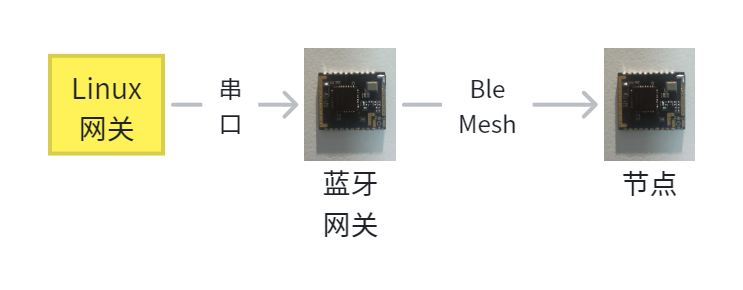

(3) Application scenarios
~~~~~~~~~~~~~~~~~~~~~~~~~

*  Smart LED

*  AI Data Solution for Smart Home

*  Sensor

*  Industrial Wireless Controls

*  Babies, Surveillance Room

*  Smart Transport

4. Functional features
~~~~~~~~~~~~~~~~~~~~~~

Instruction-driven configuration: All pin function switching is completed through standard serial port instructions, which supports dynamic adjustment at runtime.

Multi-mode pin multiplexing: The same physical pin supports multiple peripheral functions, and can be switched between modes such as GPIO, PWM, UART, I2C, SPI, ADC according to requirements.

Flexible examples:

Taking the C0 pin as an example, the user can configure it with instructions to:

PWM4_N channel enabled for motor control or light adjustment

SDA mode enabled for I2C communication

Serial mode enable request to send signal for UART flow control

Basic GPIO input /output mode configuration.

5. Packaging instructions
~~~~~~~~~~~~~~~~~~~~~~~~~

Pin Definition
^^^^^^^^^^^^^^

.. raw:: html

   

+------+------+----------+----------------------------------------------------------------------+
| No.  | Symb | I /O     | Description                                                          |
|      | ols  | Type     |                                                                      |
+======+======+==========+======================================================================+
| 1    | SDA  | I/O      | Corresponding chip PC < 0 >, I2C data line pin, can be used as       |
|      |      |          | ordinary IO port                                                     |
+------+------+----------+----------------------------------------------------------------------+
| 2    | SCL  | I/O      | Corresponding chip PC < 1 >, I2C clock line pin, can be used as      |
|      |      |          | ordinary IO port                                                     |
+------+------+----------+----------------------------------------------------------------------+
| 3    | C3   | I/O      | Corresponding chip PC < 3 >, normal IO port, can be used as          |
|      |      |          | LED-driven PWM output, default control green light                   |
+------+------+----------+----------------------------------------------------------------------+
| 4    | D2   | I/O      | Corresponding chip PD < 2 >, normal IO port, can be used as LED      |
|      |      |          | driven PWM output, default control blue light                        |
+------+------+----------+----------------------------------------------------------------------+
| 5    | C2   | I/O      | Corresponding chip PC < 2 >, normal IO port, can be used as LED      |
|      |      |          | driven PWM output, warm white light is controlled by default         |
+------+------+----------+----------------------------------------------------------------------+
| 6    | B5   | I/O      | Corresponding chip PB < 5 >, normal IO port, can be used as          |
|      |      |          | LED-driven PWM output, cool white light is controlled by default     |
+------+------+----------+----------------------------------------------------------------------+
| 7    | B4   | I/O      | Corresponding chip PB < 4 >, normal IO port, can be used as          |
|      |      |          | LED-driven PWM output, default control red light                     |
+------+------+----------+----------------------------------------------------------------------+
| 8    | 3.3V | P        | Module power input pin                                               |
+------+------+----------+----------------------------------------------------------------------+
| 9    | TX   | I/O      | Corresponding chip PB < 1 >, serial port sending pin, can be used as |
|      |      |          | ordinary IO port                                                     |
+------+------+----------+----------------------------------------------------------------------+
| 10   | RX   | I/O      | Corresponding chip PB < 7 >, serial port receiving pin, can be used  |
|      |      |          | as ordinary IO port                                                  |
+------+------+----------+----------------------------------------------------------------------+
| 11   | GND  | P        | Module power supply reference ground pin                             |
+------+------+----------+----------------------------------------------------------------------+
| 12   | SW   | I/O      | Corresponding chip SWS, Bluetooth chip burning pin                   |
+------+------+----------+----------------------------------------------------------------------+
| 13   | RST  | I        | Corresponding chip RESETB, module reset pin, built-in pull-up        |
|      |      |          | resistor                                                             |
+------+------+----------+----------------------------------------------------------------------+
| 14   | GND  | P        | Module power supply reference ground pin                             |
+------+------+----------+----------------------------------------------------------------------+