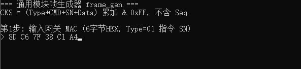
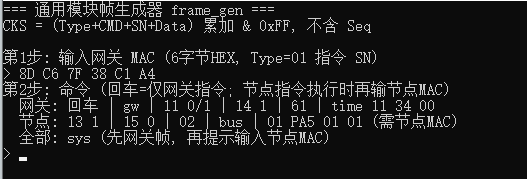
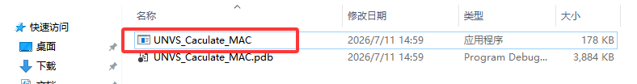
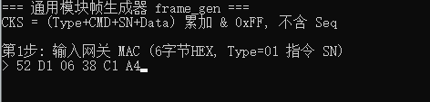
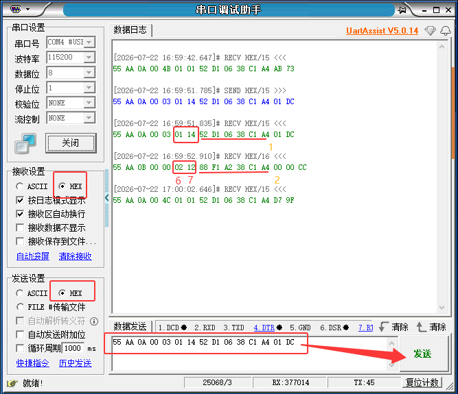
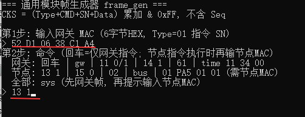
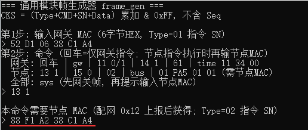
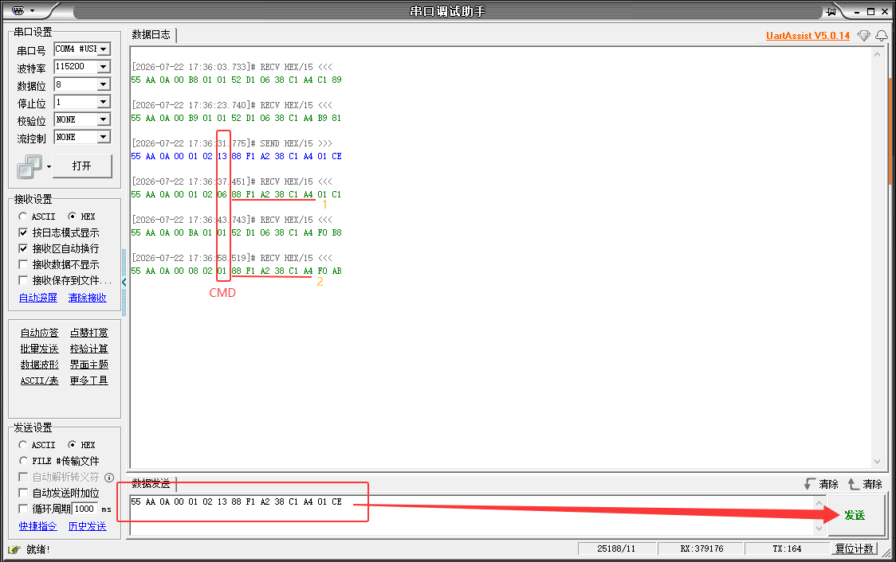
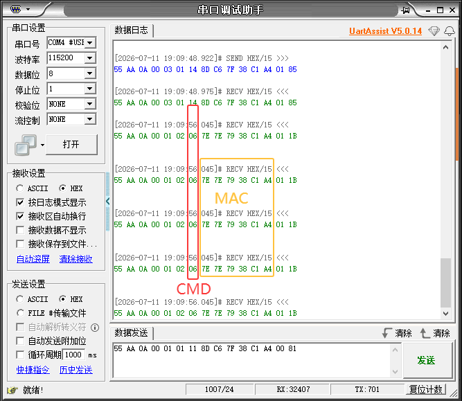
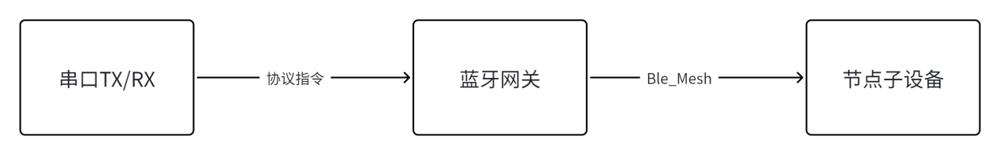

用户手册
========

蓝牙通用模块帧生成器使用指南
----------------------------

本文主要介绍应用程序UNVS_Caculate_MAC如何使用。主要根据设备MAC地址生成相应的完整协议帧指令。如果要详细了解完整协议帧结构请参考《蓝牙通用模块串口通信协议.docx》。

本文档主要解释如何用UNVS_Caculate_MAC程序生成指令

打开UNVS_Caculate_MAC应用程序
~~~~~~~~~~~~~~~~~~~~~~~~~~~~~

.. image:: ../../../image/MYZR-IoT系列/MYZR-MOD-BTU/用户手册1.png
   :alt: 用户手册1.png
   :width: 100%

.. image:: ../../../image/MYZR-IoT系列/MYZR-MOD-BTU/用户手册2.png
   :alt: 用户手册2.png
   :width: 100%

获取网关MAC：确保网关上电
~~~~~~~~~~~~~~~~~~~~~~~~~

通过任意串口工具比如串口助手接收并查看网关TX输出的数据。波特率默认115200，用HEX模式发送，HEX模式接收。这里以网关MAC=8D C6 7F 38 C1 A4为例说明

.. image:: ../../../image/MYZR-IoT系列/MYZR-MOD-BTU/用户手册3.png
   :alt: 用户手册3.png
   :width: 100%

**说明**：

第6位是Type，01:网关，02：子设备

第7位是CMD字段，这里01：心跳

第7位后面6位就是MAC地址，固定6字节长度，后三位固定：38 C1 A4 所以这里获取网关MAC地址时候：1.必须是Xx Xx Xx 38 C1 A4，2.必须是01 01后面连续6位。就是第8个字节开始后6位。

然后输入网关MAC后再回车。

**说明**：

输入第二步里面网关/节点/全部后面相关指令就可以生成指令，这一步如果需要输入节点MAC要配网阶段才能获取节点MAC地址。这里你只需要发送网关后面的：回车/gw/11 0/1……熟悉UNVS_Caculate_MAC程序如何生成指令就行，需要获取节点MAC的方法参考《蓝牙通用模块配网快速上手.docx》

**网关**：生成只需要填网关MAC的指令。一般用于只跟网关交互的指令，比如重启网关，网关恢复出厂，网关开启扫描……

**节点**：生成需要填节点MAC的指令。用于网关跟节点通信的指令，如网关允许节点入网，重启节点，出厂节点，移除子设备……这个需要配网才能获取节点MAC，参考32Pin通用模块使用手册.docx使用步骤如何配网。

**全部**：输入sys，按照网关MAC到节点MAC全部指令。

蓝牙通用模块配网快速上手
------------------------

配网步骤
~~~~~~~~

配网成功后要发送其他指令或者想了解全部裸数据含义，请参考《蓝牙通用模块串口通信协议.docx》，这里只介绍配网步骤。

步骤1.网关接线上电
^^^^^^^^^^^^^^^^^^

*  为确保模块顺利接入网络，请严格按照以下步骤进行操作

*  网关节点接3V3，GND,网关需要接串口引脚：TX=PB1,RX=PA0，发送指令用随意串口助手都行，TTL接串口引脚。

步骤2.获取网关MAC：确保网关上电
^^^^^^^^^^^^^^^^^^^^^^^^^^^^^^^

首先确保网关已正确连接电源3.3V，然后通过串口工具RX引脚（HEX模式）捕获网关TX引脚上报的指令，波特率115200，串口工具TX引脚（HEX模式）下发指令到网关RX引脚。如网关MAC=8D C6 7F 38 C1 A4，网关上电周期发送心跳指令。

.. image:: ../../../image/MYZR-IoT系列/MYZR-MOD-BTU/用户手册6.png
   :alt: 用户手册6.png
   :width: 100%

**说明**：

*  第6位固定是Type，01:网关，02：子设备。

*  第7位固定是CMD字段，这里05：上电/重连上报，01：心跳。

*  第7位后面连续6位就是MAC地址，固定6字节长度，后三位固定：38 C1 A4，所以获取MAC地址时候：1.格式必须是Xx Xx Xx 38 C1 A4，2.必须是01 01后面6位（必须01 01）。就是第8个字节开始后连续6位这里MAC地址=52 D1 06 38 C1 A4。

**关键**:

*  CMD用于判断指令类型，这里01是心跳，说明是心跳指令。后续你看到的心跳格式就是55 AA 00 05 030201Xx Xx Xx 38 C1 A447 36。

*  TYPE用于判断设备类型，这里01是网关，说明是网关自身发送的指令，配合CMD，说明这条指令是网关的心跳上报。

*  如果看到TYPE=02，CMD=01，后面的Xx Xx Xx 38 C1 A4就是子设备MAC地址，也就是连接节点的MAC地址，网关MAC与子设备MAC前三位不一样。

*  然后05表示网关上电指令，看到CMD=05表示网关正常上电了，CMD=05指令也可以获取MAC只不过上电打印一次，所以从网关心跳指令里面获取MAC最好。

*  如果没看到网关心跳，检查网关串口是否接好，波特率，HEX接收模式，确保网关上电正常，网关上电就输出心跳信号。

步骤3.获取配网指令
^^^^^^^^^^^^^^^^^^

双击运行通用模块帧生成器UNVS_Caculate_MAC 并输入刚刚获取到的网关MAC地址，然后直接回车

输入网关MAC后回车

然后再回车

.. image:: ../../../image/MYZR-IoT系列/MYZR-MOD-BTU/用户手册9.png
   :alt: 用户手册9.png
   :width: 100%

回车后看到如下指令：

.. image:: ../../../image/MYZR-IoT系列/MYZR-MOD-BTU/用户手册10.png
   :alt: 用户手册10.png
   :width: 100%

这里网关发送开启扫描指令（上电默认采用配网模式-单个确认）

**说明**：配网有两种方式

*  先发送配网模式指令再发开启扫描（这里不做演示，如需看下文-配网拓展）。

*  直接发送开启扫描（本文演示这个方式）。这个方式条件是从来没有发送过“批量自动”，可以发送配网模式切换回来。

步骤4.发送开启扫描指令
^^^^^^^^^^^^^^^^^^^^^^

网关开启扫描节点广播的配网信号，注意：若未手动发送关闭扫描指令，系统将在 5 分钟后自动关闭扫描以节省资源。可重复开启。

**说明**：

*  这里有两个MAC地址，看第1个（黄色标号），因为Type字段（第6位）=01，所以这个是网关的MAC地址。第二个（黄标）指令里面Type=02，所以88 F1 A2 38 C1 A4就是网关扫描到节点的MAC地址。

*  如果没看到节点心跳，检查节点电源是否接好，确保网关节点都上电正常，最好共地，如果看到有指令显示，并且是在”单个确定“模式下发送的指令，一定在字段第7位CMD=14的指令里面去找，如果你先发了批量自动模式再开启扫描，节点会自己进网，就不需要配网了，节点会自动发心跳给网关，然后要获取节点MAC地址就从节点心跳里面去找。

步骤5.生成入网指令
^^^^^^^^^^^^^^^^^^

重新打开UNVS_Caculate_MAC应用程序，用于生成节点入网指令，输入13 1（注意中间有空格）。CMD=13（允许入网）,然后回车。

然后回车

输入节点MAC，回车生成指令

再回车

.. image:: ../../../image/MYZR-IoT系列/MYZR-MOD-BTU/用户手册14.png
   :alt: 用户手册14.png
   :width: 100%

**注意**：一定要配网模式是“单个确定”发允许/拒绝入网（0x13）才会有效，如果是批量模式节点会自动入网，网关第一次直接发开启扫描就默认是单个节点入网模式。如果你第一次发送的指令是步骤3里面的“批量自动”，然后再发开启扫描节点就会自动入网。

步骤6.发送指令：发送允许子设备入网指令
^^^^^^^^^^^^^^^^^^^^^^^^^^^^^^^^^^^^^^

如果没看到节点心跳，检查节点电源是否接好，确保网关节点都上电正常，最好共地，节点重新上电一下。然后重新发送网关开启扫描回包简要说明（详细字段解释看《蓝牙通用模块串口通信协议.docx》）

1：55 AA 0A 00 01020688 F1 A2 38 C1 A401C1

Type=02（子设备）,CMD=06（入网上报）,倒数第二位的01是处理结果-成功。整个指令表示子设备入网上报，节点成功入网。

2：55 AA 0A 00 08020188 F1 A2 38 C1 A4F0 AB

这段是节点的心跳，Type=02，CMD=01（心跳）。只要看到心跳就说明节点入网/在线（节点成功入网标志）。

配网拓展
~~~~~~~~

如果你是需要批量入网，让大量节点快速入网而不是单个节点筛选式入网，下面介绍，这里以网关MAC=8D C6 7F 38 C1 A4为例说明。

发送批量入网模式，把配网模式切换为批量自动模式

.. image:: ../../../image/MYZR-IoT系列/MYZR-MOD-BTU/用户手册16.png
   :alt: 用户手册16.png
   :width: 100%

配网模式切换成批量自动入网。

.. image:: ../../../image/MYZR-IoT系列/MYZR-MOD-BTU/用户手册17.png
   :alt: 用户手册17.png
   :width: 100%

再发送开始扫描

.. image:: ../../../image/MYZR-IoT系列/MYZR-MOD-BTU/用户手册18.png
   :alt: 用户手册18.png
   :width: 100%

发送开启网关扫描，这次就以批量形式入网。自动入网，就不需要发允许/拒绝入网。

.. image:: ../../../image/MYZR-IoT系列/MYZR-MOD-BTU/用户手册19.png
   :alt: 用户手册19.png
   :width: 100%

如果你有很多节点，就会上报很多子设备入网上报指令。以下图中“子设备入网上报”是我粘贴出来的，为了解释多节点情况：
CMD固定0x06，表示入网上报，但是MAC真实情况是有多少个节点就有多少种MAC，这里我粘贴出来的所以看到是一样的。

蓝牙通用模块串口通信协议
------------------------

1.概述
~~~~~~

明远智睿蓝牙 Mesh 通讯协议是用于串口向网关发送蓝牙指令，协议主要用于网关与节点模块之间通信。

1.1架构框图
^^^^^^^^^^^

1.2术语与定义
^^^^^^^^^^^^^

*  APP：移动端控制软件。

*  TTL :串口工具

*  GW (Gateway)：蓝牙网关，负责协议转换与数据透传。

*  Node：BLE Mesh 子设备（如开关、灯具等）。

*  GATT：APP 与网关之间的通信通道。

*  Mesh：网关与节点之间的通信通道。

1.3串口通信规范
^^^^^^^^^^^^^^^

*  波特率：115200

*  数据位：8

*  奇偶校验：无

*  停止位：1

*  数据流控：无

*  字节序：小端模式

2.消息格式说明
~~~~~~~~~~~~~~

2.1完整协议帧字段
^^^^^^^^^^^^^^^^^

[HEAD_0][HEAD_1][Length(2)][Seq][Type][CMD][SN(6)][Data][Checksum]

表 2-1协议帧字段说明
""""""""""""""""""""

.. raw:: html

   

+--------------+---------------+------+--------------------------------------------------------------------------+
| 字段         | 字段标识      | 长度 | 说明                                                                     |
+==============+===============+======+==========================================================================+
| 协议标识     | Head0 + Head1 | 2    | 固定 0x55 0xAA，固定值。                                                 |
+--------------+---------------+------+--------------------------------------------------------------------------+
| 数据长度     | Length        | 2    | 小端；数值 = Seq(1)+Type(1)+CMD(1)+SN(6)+Data(N) = 9+N，不包含 Head、Len |
|              |               |      | gth 自身、Checksum。                                                     |
+--------------+---------------+------+--------------------------------------------------------------------------+
| 消息ID       | Seq           | 1    | 请求/响应匹配；不参与校验和。                                            |
+--------------+---------------+------+--------------------------------------------------------------------------+
| 目标设备类型 | Type          | 1    | 0x01=网关，0x02=子设备                                                   |
+--------------+---------------+------+--------------------------------------------------------------------------+
| 命令类型     | CMD           | 1    | 命令类型，如0x14 移除子设备，0x14 开启扫描等。见表3-2和表3-3             |
+--------------+---------------+------+--------------------------------------------------------------------------+
| MAC地址      | SN            | 6    | 网关/子设备MAC。                                                         |
+--------------+---------------+------+--------------------------------------------------------------------------+
| 数据字段     | Data          | 0~96 | 业务/系统功能的具体实现。                                                |
+--------------+---------------+------+--------------------------------------------------------------------------+
| 协议校验     | Checksum      | 1    | sum=Type+CMD+SN[0..5]+Data[0..N-1]，取 sum & 0xFF（不含 Seq、不含 Head、 |
|              |               |      | 不含 Length）。                                                          |
+--------------+---------------+------+--------------------------------------------------------------------------+

系统命令类型一览表
""""""""""""""""""

表 2-2CMD字段
"""""""""""""

.. raw:: html

   

+----------------+--------------------+-------------+--------------------+
|    消息类型    |        方向        | 命令类型CMD |        说明        |
+================+====================+=============+====================+
| 系  统  指  令 | 1.网关→Linux 主控  | 0x01        | 心跳               |
|                |  2.子设备→网关→主控|             |                    |
+                +--------------------+-------------+--------------------+
|                | 1.主控→网关        | 0x02        | 查询设备信息       |
|                |  2.主控→网关→子设备|             |                    |
+                +--------------------+-------------+--------------------+
|                | 1.网关→主控        | 0x03        | 设备信息主动上报   |
|                |  2.子设备→网关→主控|             |                    |
+                +--------------------+-------------+--------------------+
|                | 主控→网关→子设备   | 0x04        | 查询设备网络状态   |
+                +--------------------+-------------+--------------------+
|                | 子设备→网关→主控   | 0x05        | 子设备重连上报     |
+                +--------------------+-------------+--------------------+
|                | 子设备→网关→主控   | 0x06        | 子设备入网上报     |
+                +--------------------+-------------+--------------------+
|                | 子设备→网关→主控   | 0x07        | 子设备离线上报     |
+                +--------------------+-------------+--------------------+
|                | 子设备→网关→主控   | 0x08        | 子设备信号弱上报   |
+                +--------------------+-------------+--------------------+
|                | 子设备→网关→主控   | 0x09        | 子设备状态异常上报 |
+                +--------------------+-------------+--------------------+
|                | 主控→网关→子设备   | 0x10        | 组地址配置         |
+                +--------------------+-------------+--------------------+
|                | 主控→网关→子设备   | 0x11        | 下发配网模式       |
+                +--------------------+-------------+--------------------+
|                | 网关→主控          | 0x12        | 上报扫描子设备信息 |
+                +--------------------+-------------+--------------------+
|                | 主控→网关          | 0x13        | 选择是否入网       |
+                +--------------------+-------------+--------------------+
|                | 主控→网关          | 0x14        | 配网扫描开关       |
+                +--------------------+-------------+--------------------+
|                | 主控→网关→子设备   | 0x15        | 移除子设备         |
+                +--------------------+-------------+--------------------+
|                |                    |             |                    |
+                +--------------------+-------------+--------------------+
|                | 1.主控→网关        | 0x17        | 系统复位           |
|                |  2.主控→网关→子设备|             |                    |
+                +--------------------+-------------+--------------------+
|                | 1.主控→网关        | 0x18        | 恢复出厂           |
|                |  2.主控→网关→子设备|             |                    |
+                +--------------------+-------------+--------------------+
|                |                    |             |                    |
+----------------+--------------------+-------------+--------------------+

业务命令类型一览表
""""""""""""""""""

表 2-3CMD字段
"""""""""""""

.. raw:: html

   

+----------------+--------------------+----------+------------------+
| 消息类型       | 方向               | 命令类型 | 说明             |
+================+====================+==========+==================+
| 业  务  指  令 | 1.主控→网关        | 0x30     | OTA升级指令      |
|                |  2.主控→网关→子设备|          |                  |
+                +--------------------+----------+------------------+
|                | 主控→网关→子设备   | 0x40     | IO资源配置       |
+                +--------------------+----------+------------------+
|                | 主控→网关→子设备   | 0x41     | A类状态读取      |
+                +--------------------+----------+------------------+
|                | 子设备→网关→主控   | 0x42     | A类上报          |
+                +--------------------+----------+------------------+
|                | 主控→网关→子设备   | 0x43     | I2C/SPI总线读写  |
+                +--------------------+----------+------------------+
|                | 主控→网关→子设备   | 0x44     | B类总线使能配置  |
+                +--------------------+----------+------------------+
|                | 子设备→网关→主控   | 0x45     | B类总线主动上报  |
+                +--------------------+----------+------------------+
|                |                    |          |                  |
+                +--------------------+----------+------------------+
|                | 1.主控→网关        | 0x61     | 属性读取         |
|                |  2.主控→网关→子设备|          |                  |
+                +--------------------+----------+------------------+
|                | 主控→网关（广播）  | 0x62     | 时间校准         |
+                +--------------------+----------+------------------+
|                | 网关→主控          | 0x63     | 网关上电时间上报 |
+                +--------------------+----------+------------------+
|                |                    |          |                  |
+                +--------------------+----------+------------------+
|                | 主控→网关          | 0x71     | WiFi配网指令     |
+----------------+--------------------+----------+------------------+

外设类型
^^^^^^^^

.. raw:: html

   

+---------+-------------------+----------------------------------------+
| 分类    | 外设              | 说明                                   |
+=========+===================+========================================+
| A类外设 | GPIO/PWM/UART/ADC | 可穷举，0x40使能，0x41读取，0x42上报   |
+---------+-------------------+----------------------------------------+
| B类外设 | I2C/SPI           | 不可穷举，0x43透传，0x44使能，0x45上报 |
+---------+-------------------+----------------------------------------+

3.指令标识消息
~~~~~~~~~~~~~~

**示例1**：例如查询设备信息完整帧是[HEAD_0][HEAD_1][Length(2)][Seq][Type][CMD][SN(6)][Checksum]
无Data字段。

.. raw:: html

   

+-----------+----------+---------+--------+
| Type      | CMD      | SN      | CKS    |
+===========+==========+=========+========+
| 01/02     | 02       |         |        |
+-----------+----------+---------+--------+
| 网关/节点 | 命令类型 | 目标MAC | 校验码 |
+-----------+----------+---------+--------+

**示例2**：网关扫描使能完整帧是
[HEAD_0][HEAD_1][Length(2)][Seq][Type][CMD][SN(6)][Data][Checksum][Data]=[00/01]

.. raw:: html

   

+-----------+----------+---------+---------------+--------+
| Type      | CMD      | SN      | Data          | CKS    |
+===========+==========+=========+===============+========+
| 01/02     | 14       |         | 00/01         |        |
+-----------+----------+---------+---------------+--------+
| 网关/节点 | 命令类型 | 目标MAC | 关闭/开启扫描 | 校验码 |
+-----------+----------+---------+---------------+--------+

消息格式说明
^^^^^^^^^^^^

表3-1Mode字段

.. raw:: html

   

+------+------+----------+
| 字段 | HEX  | 功能描述 |
+======+======+==========+
| Mode | 00   | 输入模式 |
+      +------+----------+
|      | 01   | 输出模式 |
+      +------+----------+
|      | 02   | PWM模式  |
+      +------+----------+
|      | 03   | UART模式 |
+      +------+----------+
|      | 04   | SPI模式  |
+      +------+----------+
|      | 05   | I2C模式  |
+      +------+----------+
|      | 06   | ADC模式  |
+------+------+----------+

表3-2Event Type字段说明

.. raw:: html

   

+------------+----------+
| Event Type | 说明     |
+============+==========+
| 0x00       | 周期上报 |
+------------+----------+
| 0x01       | 阈值触发 |
+------------+----------+
| 0x02       | 中断触发 |
+------------+----------+

3.1 A类外设
^^^^^^^^^^^

示例（data字段）：多个引脚，PB5 + PB4 同时持续翻转

.. raw:: html

   

+------+----------+---------+---------+-----------+----------+----------+------------+----------+----------+--------+
| Type | CMD      | SN      | Data                                                                         | CKS    |
+      +          +         +---------+-----------+----------+----------+------------+----------+----------+        +
|      |          |         | Count   | Pin\_Name | Mode     | State    | Pin\_Name2 | Mode     | State    |        |
+======+==========+=========+=========+===========+==========+==========+============+==========+==========+========+
| 02   | 40       |         | 1~16    | 42 35     | 01       | 03       | 42 34      | 01       | 03       |        |
+------+----------+---------+---------+-----------+----------+----------+------------+----------+----------+--------+
| 节点 | 命令类型 | 目标MAC | Pin数量 | PB5       | 输出模式 | 周期翻转 | PB4        | 输出模式 | 周期翻转 | 校验位 |
+------+----------+---------+---------+-----------+----------+----------+------------+----------+----------+--------+

输入模式
""""""""

输入模式使能

.. raw:: html

   

+-----------+----------+---------+----------+--------+-----------+----------+------+----------+------+----------+------+--------------+--------------+
| Type      | CMD      | SN      | Data                                                                                                              |
+           +          +         +----------+--------+-----------+----------+------+----------+------+----------+------+--------------+--------------+
|           |          |         | Count             | Pin\_Name            | Mode            | Pull            | IRQ                 | Debounce\_ms |
+===========+==========+=========+==========+========+===========+==========+======+==========+======+==========+======+==============+==============+
| 01/02     | 14       |         | 1~16              | HEX                  | 0x00            |       00/01/02  |       00/01/02      | ——           |              
+-----------+----------+---------+----------+--------+-----------+----------+------+----------+------+----------+------+--------------+--------------+
| 网关/节点 | 命令类型 | 目标MAC | 引脚数量          | 引脚名               | 输入模式        | 浮空            | 无                  | 消抖ms（2B） |
|           |          |         |                   |                      |                 | 上拉            | 上升沿              |              |
|           |          |         |                   |                      |                 | 下拉            | 下降沿              |              |
+-----------+----------+---------+----------+--------+-----------+----------+------+----------+------+----------+------+--------------+--------------+

电平配置
""""""""

IO使能

.. raw:: html

   

+------+----------+---------+----------+--------+-----------+----------+---------------+------------+----------+--------+
| Type | CMD      | SN      | Data                                                                             | CKS    |
+      +          +         +----------+--------+-----------+----------+---------------+------------+----------+        +
|      |          |         | Count             | Pin\_Name            | Mode          | Action                |        |
+======+==========+=========+==========+========+===========+==========+===============+============+==========+========+
| 02   | 14       |         | 1~16              | HEX                  |        01     | 00低电平   | ——       |        |
+      +          +         +                   +                      +               +------------+----------+        +
|      |          |         |                   |                      |               | 01高电平   | ——       |        |
+      +          +         +                   +                      +               +------------+----------+        +
|      |          |         |                   |                      |               | 02单次翻转 | ——       |        |
+      +          +         +                   +                      +               +------------+----------+        +
|      |          |         |                   |                      |               | 03周期翻转 | 周期     |        |
+------+----------+---------+----------+--------+-----------+----------+---------------+------------+----------+--------+
| 节点 | 命令类型 | 目标MAC | 引脚数量          | 引脚名               |      输出模式 | 动作       | 补充字段 | 校验位 |
+------+----------+---------+----------+--------+-----------+----------+---------------+------------+----------+--------+

PWM外设
"""""""

PWM关

.. raw:: html

   

+------+----------+---------+----------+-----------+------+-------+--------+
| Type | CMD      | SN      | Data                                | CKS    |
+      +          +         +----------+-----------+------+-------+        +
|      |          |         | Count    | Pin\_Name | Mode | State |        |
+======+==========+=========+==========+===========+======+=======+========+
| 02   | 40       |         | 1~16     | HEX       | 0x02 | 00    |        |
+------+----------+---------+----------+-----------+------+-------+--------+
| 节点 | 命令类型 | 目标MAC | 引脚数量 | 引脚名    | PWM  | 关    | 校验位 |
+------+----------+---------+----------+-----------+------+-------+--------+

PWM方波效果，固定周期

.. raw:: html

   

+------+----------+---------+----------+-----------+------+----------+-------+--------+--------+
| Type | CMD      | SN      | Data                                                    | CKS    |
+      +          +         +----------+-----------+------+----------+-------+--------+        +
|      |          |         | Count    | Pin\_Name | Mode | Pattern  | State | Action |        |
+======+==========+=========+==========+===========+======+==========+=======+========+========+
| 02   | 40       |         | 1~16     | HEX       | 0x02 | 00       | 01    | 0~64   |        |
+------+----------+---------+----------+-----------+------+----------+-------+--------+--------+
| 节点 | 命令类型 | 目标MAC | 引脚数量 | 引脚名    | PWM  | 固定模式 | 开    | 占空比 | 校验位 |
+------+----------+---------+----------+-----------+------+----------+-------+--------+--------+

PWM呼吸效果-单个周期

.. raw:: html

   

+------+----------+---------+----------+-----------+------+----------+------+-------+------+-------+------+--------+--------+
| Type | CMD      | SN      | Data                                                                                 | CKS    |
+      +          +         +----------+-----------+------+----------+------+-------+------+-------+------+--------+        +
|      |          |         | Count    | Pin\_Name | Mode | Pattern  | FUN  | State | T    | Limit        | Action |        |
+======+==========+=========+==========+===========+======+==========+======+=======+======+=======+======+========+========+
| 02   | 40       |         | 1~16     | HEX       | 0x02 | 01       | 00   | 01    | Ms   | 0~Ms  | 0~Ms | 0~64   |        |
+------+----------+---------+----------+-----------+------+----------+------+-------+------+-------+------+--------+--------+
| 节点 | 命令类型 | 目标MAC | 引脚数量 | 引脚名    | PWM  | 呼吸模式 | 单次 | 开    | 周期 | Min   | Max  | 占空比 | 校验位 |
+------+----------+---------+----------+-----------+------+----------+------+-------+------+-------+------+--------+--------+

PWM呼吸效果-周期循环

.. raw:: html

   

+------+----------+---------+----------+-----------+------+----------+------+-------+------+-------+------+--------+
| Type | CMD      | SN      | Data                                                                        | CKS    |
+      +          +         +----------+-----------+------+----------+------+-------+------+-------+------+        +
|      |          |         | Count    | Pin\_Name | Mode | Pattern  | FUN  | State | T    | Limit        |        |
+======+==========+=========+==========+===========+======+==========+======+=======+======+=======+======+========+
| 02   | 40       |         | 1~16     | HEX       | 0x02 | 01       | 01   | 01    | Ms   | 0~Ms  | 0~Ms |        |
+------+----------+---------+----------+-----------+------+----------+------+-------+------+-------+------+--------+
| 节点 | 命令类型 | 目标MAC | 引脚数量 | 引脚名    | PWM  | 呼吸模式 | 循环 | 开    | 周期 | Min   | Max  | 校验位 |
+------+----------+---------+----------+-----------+------+----------+------+-------+------+-------+------+--------+

UART 外设
"""""""""

UART使能

.. raw:: html

   

+------+----------+---------+----------+-----------+------+-------+----------------+--------+
| Type | CMD      | SN      | Data                                                 | CKS    |
+      +          +         +----------+-----------+------+-------+----------------+        +
|      |          |         | Count    | Pin\_Name | Mode | FUN   | BAUD           |        |
+======+==========+=========+==========+===========+======+=======+================+========+
| 02   | 40       |         | 1~16     | HEX       | 0x03 | 00/01 | 9600/115200/…… |        |
+------+----------+---------+----------+-----------+------+-------+----------------+--------+
| 节点 | 命令类型 | 目标MAC | 引脚数量 | 引脚名    | UART | RX/TX | 4字节          | 校验位 |
+------+----------+---------+----------+-----------+------+-------+----------------+--------+

ADC 外设
""""""""

ADC使能

.. raw:: html

   

+------+----------+---------+----------+-----------+------+-------+----------+----------+-------------+--------+
| Type | CMD      | SN      | Data                                                                    | CKS    |
+      +          +         +----------+-----------+------+-------+----------+----------+-------------+        +
|      |          |         | Count    | Pin\_Name | Mode | State | Period   | Limit    | Resolution  |        |
+======+==========+=========+==========+===========+======+=======+==========+==========+=============+========+
| 02   | 40       |         | 1~16     | HEX       | 0x06 | 00/01 | 1000     | 64       | 08/0A/0C    |        |
+------+----------+---------+----------+-----------+------+-------+----------+----------+-------------+--------+
| 节点 | 命令类型 | 目标MAC | 引脚数量 | 引脚名    | ADC  | 关/开 | 1s（2B） | 电压阈值 | 精度8/10/12 | 校验位 |
+------+----------+---------+----------+-----------+------+-------+----------+----------+-------------+--------+

ADC使能结果上报

.. raw:: html

   

+------+----------+---------+-----------+------+-------+--------+--------+
| Type | CMD      | SN      | Data                              | CKS    |
+      +          +         +-----------+------+-------+--------+        +
|      |          |         | Pin\_Name | Mode | Value | Result |        |
+======+==========+=========+===========+======+=======+========+========+
| 02   | 42       |         | HEX       | 0x06 |       | 00     |        |
+------+----------+---------+-----------+------+-------+--------+--------+
| 节点 | 命令类型 | 目标MAC | 引脚名    | ADC  | 值    | 成功   | 校验位 |
+------+----------+---------+-----------+------+-------+--------+--------+

A类外设
"""""""

读取引脚模式/状态

.. raw:: html

   

+------+----------+---------+----------+-----------+---------+--------+
| Type | CMD      | SN      | Data                           | CKS    |
+      +          +         +----------+-----------+---------+        +
|      |          |         | Count    | Pin\_Name | Mode    |        |
+======+==========+=========+==========+===========+=========+========+
| 02   | 41       |         | 1~16     | HEX       |         |        |
+------+----------+---------+----------+-----------+---------+--------+
| 节点 | 命令类型 | 目标MAC | 引脚数量 | 引脚名    | 见表4-1 | 校验位 |
+------+----------+---------+----------+-----------+---------+--------+

读取后的回复（比如读取ADC回复)

.. raw:: html

   

+------+----------+---------+----------+-----------+---------+------------+------------+----------+--------+
| Type | CMD      | SN      | Data                                                                | CKS    |
+      +          +         +----------+-----------+---------+------------+------------+----------+        +
|      |          |         | Count    | Pin\_Name | Mode    | Event Type | Value      | Reserved |        |
+======+==========+=========+==========+===========+=========+============+============+==========+========+
| 02   | 42       |         | 1~16     | HEX       | 06      | 见表4-2    | 1C 07      | 00       |        |
+------+----------+---------+----------+-----------+---------+------------+------------+----------+--------+
| 节点 | 命令类型 | 目标MAC | 引脚数量 | 引脚名    | ADC模式 | 事件类型   | 电压1.820V | 结果码   | 校验位 |
+------+----------+---------+----------+-----------+---------+------------+------------+----------+--------+

3.2 B类外设
^^^^^^^^^^^

总线透传读
""""""""""

.. raw:: html

   

+------+----------+---------+------------+------------+--------+-----------+------------+-------------------+--------+
| Type | CMD      | SN      | Data                                                                          | CKS    |
+      +          +         +------------+------------+--------+-----------+------------+-------------------+        +
|      |          |         | Busy\_Type | Ops\_Count | OPCODE | Addr (1B) | Reg(1B)    | Data\_Len(1B)     |        |
+======+==========+=========+============+============+========+===========+============+===================+========+
| 02   | 43       |         | 00         | 01/02      | 01     | 0x68      | 0x6B       |                   |        |
+------+----------+---------+------------+------------+--------+-----------+------------+-------------------+--------+
| 节点 | 命令类型 | 目标MAC | I2C        | OP条数     | 读     | 从机地址  | 寄存器地址 | 读长度最大读到61B | 校验位 |
+------+----------+---------+------------+------------+--------+-----------+------------+-------------------+--------+

总线透传写
""""""""""

.. raw:: html

   

+------+----------+---------+------------+------------+--------+----------+------------+-----------+----------+--------+
| Type | CMD      | SN      | Data                                                                            | CKS    |
+      +          +         +------------+------------+--------+----------+------------+-----------+----------+        +
|      |          |         | Busy\_Type | Ops\_Count | OPCODE | Addr     | Reg        | Data\_Len | Data     |        |
|      |          |         |            |            |        | (1B)     | (1B)       | (1B)      | Max=58B  |        |
+======+==========+=========+============+============+========+==========+============+===========+==========+========+
| 02   | 43       |         | 00         | 01/02      | 00     | 0x68     | 0x6B       |           |          |        |
+------+----------+---------+------------+------------+--------+----------+------------+-----------+----------+--------+
| 节点 | 命令类型 | 目标MAC | I2C        | OP条数     | 写     | 从机地址 | 寄存器地址 | 写长度    | 写入内容 | 校验位 |
+------+----------+---------+------------+------------+--------+----------+------------+-----------+----------+--------+

I2C总线使能，配置引脚
"""""""""""""""""""""

.. raw:: html

   

+------+----------+---------+------------+--------+----------+---------+---------+--------+
| Type | CMD      | SN      | Data                                               | CKS    |
+      +          +         +------------+--------+----------+---------+---------+        +
|      |          |         | Busy\_Type | Enable | 时钟频率 | SDA(2B) | SCL(2B) |        |
+======+==========+=========+============+========+==========+=========+=========+========+
| 02   | 44       |         | 00         | 00/01  | 1000000  |         |         |        |
+------+----------+---------+------------+--------+----------+---------+---------+--------+ 
| 节点 | 命令类型 | 目标MAC | I2C        | 开关   | 时钟频率 | 数据线  | 时间线  | 校验位 |
+------+----------+---------+------------+--------+----------+---------+---------+--------+

I2C使能上报
"""""""""""

.. raw:: html

   

+------+----------+---------+------------+-----------+--------+
| Type | CMD      | SN      | Data                   | CKS    |
+      +          +         +------------+-----------+        +
|      |          |         | Busy\_Type | Result    |        |
+======+==========+=========+============+===========+========+
| 02   | 0x44     |         | 00         | 00/01     |        |
+------+----------+---------+------------+-----------+--------+
| 节点 | 使能上报 | 目标MAC | I2C        | 成功/失败 | 校验位 |
+------+----------+---------+------------+-----------+--------+

SPI读
"""""

.. raw:: html

   

+------+----------+---------+------------+------------+--------+-------------+--------+
| Type | CMD      | SN      | Data                                           | CKS    |
+      +          +         +------------+------------+--------+-------------+        +
|      |          |         | Busy\_Type | Ops\_Count | OPCODE | Read\_Len   |        |
|      |          |         |            |            |        | (1B)        |        |
+======+==========+=========+============+============+========+=============+========+
| 02   | 43       |         | 00         | 01/02      | 01     |             |        |
+------+----------+---------+------------+------------+--------+-------------+--------+
| 节点 | 命令类型 | 目标MAC | SPI        | OP条数     | 读     | 读长度      | 校验位 |
|      |          |         |            |            |        | 最大读到61B |        |
+------+----------+---------+------------+------------+--------+-------------+--------+

SPI写
"""""

.. raw:: html

   

+------+----------+---------+------------+------------+--------+-----------+----------+--------+
| Type | CMD      | SN      | Data                                                    | CKS    |
+      +          +         +------------+------------+--------+-----------+----------+        +
|      |          |         | Busy\_Type | Ops\_Count | OPCODE | Read\_Len | Data     |        |
|      |          |         |            |            |        | (1B)      | Max=59B  |        |
+======+==========+=========+============+============+========+===========+==========+========+
| 02   | 43       |         | 00         | 01/02      | 00     |           |          |        |
+------+----------+---------+------------+------------+--------+-----------+----------+--------+
| 节点 | 命令类型 | 目标MAC | SPI        | OP条数     | 写     | 写长度    | 写入内容 | 校验位 |
+------+----------+---------+------------+------------+--------+-----------+----------+--------+

SPI总线使能，配置引脚
"""""""""""""""""""""

.. raw:: html

   

+------+----------+---------+------------+--------+----------+-----------+--------+
| Type | CMD      | SN      | Data                                       | CKS    |
+      +          +         +------------+--------+----------+-----------+        +
|      |          |         | Busy\_Type | Enable | 时钟频率 | SPI\_Mode |        |
+======+==========+=========+============+========+==========+===========+========+
| 02   | 42       |         | 00         | 00/01  | 1000000  | 0~3       |        |
+------+----------+---------+------------+--------+----------+-----------+--------+
| 节点 | 命令类型 | 目标MAC | SPI        | 开关   | 时钟频率 | 节点定义  | 校验位 |
+------+----------+---------+------------+--------+----------+-----------+--------+

SPI使能上报
"""""""""""

.. raw:: html

   

+------+----------+---------+------------+-----------+--------+
| Type | CMD      | SN      | Data                   | CKS    |
+      +          +         +------------+-----------+        +
|      |          |         | Busy\_Type | Result    |        |
+======+==========+=========+============+===========+========+
| 02   | 0x44     |         | 01         | 00/01     |        |
+------+----------+---------+------------+-----------+--------+
| 节点 | 使能上报 | 目标MAC | SPI        | 成功/失败 | 校验位 |
+------+----------+---------+------------+-----------+--------+

主动上报
""""""""

.. raw:: html

   

+------+----------+---------+-----------+--------------+-----------+--------+
| Type | CMD      | SN      | Data                                 | CKS    |
+      +          +         +-----------+--------------+-----------+        +
|      |          |         | Bus\_Type | Data\_Len    | Pay\_Load |        |
+======+==========+=========+===========+==============+===========+========+
| 02   | 45       |         | 00/01     |              |           |        |
+------+----------+---------+-----------+--------------+-----------+--------+
| 节点 | 主动上报 | 目标MAC | I2C/SPI   | 上报数据长度 | 内容      | 校验位 |
+------+----------+---------+-----------+--------------+-----------+--------+

网关请求校准时间（上行）
""""""""""""""""""""""""

.. raw:: html

   

+------+--------------+---------+------+--------+--------+--------+
| Type | CMD          | SN      | Data                   | CKS    |
+      +              +         +------+--------+--------+        +
|      |              |         | Hour | Minute | Second |        |
+======+==============+=========+======+========+========+========+
| 01   | 63           |         |      |        |        |        |
+------+--------------+---------+------+--------+--------+--------+
| 网关 | 请求时间校准 | 目标MAC | 时   | 分     | 秒     | 校验位 |
+------+--------------+---------+------+--------+--------+--------+

校准时间
""""""""

下发时间校准

.. raw:: html

   

+------+----------+---------+------+--------+--------+--------+
| Type | CMD      | SN      | Data                   | CKS    |
+      +          +         +------+--------+--------+        +
|      |          |         | Hour | Minute | Second |        |
+======+==========+=========+======+========+========+========+
| 01   | 62       |         | 0~17 | 0~3B   | 0~3B   |        |
+------+----------+---------+------+--------+--------+--------+
| 网关 | 时间校准 | 目标MAC | 时   | 分     | 秒     | 校验位 |
+------+----------+---------+------+--------+--------+--------+

时间上报（时间上报在上电/复位/重启时候会上报）

.. raw:: html

   

+------+----------+---------+--------+--------+--------+--------+
| Type | CMD      | SN      | Data                     | CKS    |
+      +          +         +--------+--------+--------+        +
|      |          |         | Hour   | Minute | Second |        |
+======+==========+=========+========+========+========+========+
| 01   | 62       |         |        |        |        |        |
+------+----------+---------+--------+--------+--------+--------+
| 网关 | 时间校准 | 目标MAC | 时0~17 | 分0~3B | 秒0~3B | 校验位 |
+------+----------+---------+--------+--------+--------+--------+

3.3 系统标识消息
^^^^^^^^^^^^^^^^

心跳
""""

.. raw:: html

   

+-----------+------------+---------------+----------------+--------+
| Type      | CMD        | SN            | Data           | CKS    |
+           +            +               +----------------+        +
|           |            |               | RSSI           |        |
+===========+============+===============+================+========+
| 01/02     | 01         |               |                |        |
+-----------+------------+---------------+----------------+--------+
| 网关/节点 | 心跳包上报 | Type对应的MAC | 信号强度（1B） | 校验位 |
+-----------+------------+---------------+----------------+--------+

设备信息
""""""""

设备信息上报

.. raw:: html

   

+-----------+--------------+---------------+--------------+--------+
| Type      | CMD          | SN            | Data         | CKS    |
+           +              +               +--------------+        +
|           |              |               | MSG\_Service |        |
+===========+==============+===============+==============+========+
| 01/02     | 03           |               |              |        |
+-----------+--------------+---------------+--------------+--------+
| 网关/节点 | 设备信息上报 | Type对应的MAC | 设备信息     | 校验位 |
+-----------+--------------+---------------+--------------+--------+

设备连接状态
""""""""""""

查询网络状态

.. raw:: html

   

+-----------+--------------+---------------+----------------+--------+
| Type      | CMD          | SN            | Data           | CKS    |
+           +              +               +----------------+        +
|           |              |               | Connect\_State |        |
+===========+==============+===============+================+========+
| 01/02     | 04           |               | 00/01          |        |
+-----------+--------------+---------------+----------------+--------+
| 网关/节点 | 查询网络状态 | Type对应的MAC | 离线/在线      | 校验位 |
+-----------+--------------+---------------+----------------+--------+

设备重连上报
""""""""""""

.. raw:: html

   

+-----------+--------------+---------+-----------+--------+
| Type      | CMD          | SN      | Data      | CKS    |
+           +              +         +-----------+        +
|           |              |         | Result    |        |
+===========+==============+=========+===========+========+
| 01/02     | 0x05         |         | 00/01     |        |
+-----------+--------------+---------+-----------+--------+
| 网关/节点 | 设备重连上报 | 目标MAC | 失败/成功 | 校验位 |
+-----------+--------------+---------+-----------+--------+

子设备入网上报
""""""""""""""

.. raw:: html

   

+------+----------------+---------+-----------+--------+
| Type | CMD            | SN      | Data      | CKS    |
+      +                +         +-----------+        +
|      |                |         | Result    |        |
+======+================+=========+===========+========+
| 02   | 0x06           |         | 00/01     |        |
+------+----------------+---------+-----------+--------+
| 节点 | 子设备入网上报 | 目标MAC | 失败/成功 | 校验位 |
+------+----------------+---------+-----------+--------+

子设备离线上报
""""""""""""""

.. raw:: html

   

+------+----------------+---------+--------+--------+
| Type | CMD            | SN      | Data   | CKS    |
+      +                +         +--------+        +
|      |                |         | Result |        |
+======+================+=========+========+========+
| 02   | 0x07           |         | 00     |        |
+------+----------------+---------+--------+--------+
| 节点 | 子设备离线上报 | 目标MAC | 离线   | 校验位 |
+------+----------------+---------+--------+--------+

设备信号弱上报
""""""""""""""

.. raw:: html

   

+-------+------------+---------+----------+--------+
| Type  | CMD        | SN      | Data     | CKS    |
+       +            +         +----------+        +
|       |            |         | RSSI     |        |
+=======+============+=========+==========+========+
| 01/02 | 0x08       |         | 00~FF    |        |
+-------+------------+---------+----------+--------+
| 节点  | 设备信号弱 | 目标MAC | 信号强度 | 校验位 |
+-------+------------+---------+----------+--------+

子设备状态异常上报
""""""""""""""""""

.. raw:: html

   

+------+----------------+---------+-------+--------+
| Type | CMD            | SN      | Data  | CKS    |
+      +                +         +-------+        +
|      |                |         | State |        |
+======+================+=========+=======+========+
| 02   | 0x09           |         | 00~FF |        |
+------+----------------+---------+-------+--------+
| 节点 | 子设备状态异常 | 目标MAC | 状态  | 校验位 |
+------+----------------+---------+-------+--------+

组地址
""""""

组地址订阅

.. raw:: html

   

+------+------------+---------+--------+-------------+--------+
| Type | CMD        | SN      | Data                 | CKS    |
+      +            +         +--------+-------------+        +
|      |            |         | 房间号 | Action      |        |
+======+============+=========+========+=============+========+
| 02   | 0x10       |         | 00     | 00/01       |        |
+------+------------+---------+--------+-------------+--------+
| 节点 | 组地址订阅 | 目标MAC | 组地址 | 退/进组地址 | 校验位 |
+------+------------+---------+--------+-------------+--------+

组订阅处理上报
""""""""""""""

.. raw:: html

   

+------+----------------+---------+--------+-------------+-----------+--------+
| Type | CMD            | SN      | Data                             | CKS    |
+      +                +         +--------+-------------+-----------+        +
|      |                |         | 房间号 | Action      | Result    |        |
+======+================+=========+========+=============+===========+========+
| 02   | 0x10           |         | 00     | 00/01       | 00/01     |        |
+------+----------------+---------+--------+-------------+-----------+--------+
| 节点 | 组订阅处理上报 | 目标MAC | 组地址 | 退/进组地址 | 失败/成功 | 校验位 |
+------+----------------+---------+--------+-------------+-----------+--------+

配网
""""

配网模式使能

.. raw:: html

   

+------+----------+---------+-------------------+--------+
| Type | CMD      | SN      | Data              | CKS    |
+      +          +         +-------------------+        +
|      |          |         | State             |        |
+======+==========+=========+===================+========+
| 01   | 0x11     |         | 00/01             |        |
+------+----------+---------+-------------------+--------+
| 网关 | 配网模式 | 目标MAC | 单次/批量入网模式 | 校验位 |
+------+----------+---------+-------------------+--------+

说明：
网关默认用单次入网模式，发送批量入网模式，可以切换配网模式。如果第一次直接发送开启扫描指令，会以单次入网模式开启扫描，后续也可切换，支持上电记忆。
单次：需要用户允许/拒绝入网。

批量：自动入网，适用大量节点入网。后续可配合查询设备信息和设备出厂指令  踢掉不需要的节点。

网关扫描使能
""""""""""""

.. raw:: html

   

+------+--------------+---------+---------------+--------+
| Type | CMD          | SN      | Data          | CKS    |
+      +              +         +---------------+        +
|      |              |         | State         |        |
+======+==============+=========+===============+========+
| 01   | 0x14         |         | 00/01         |        |
+------+--------------+---------+---------------+--------+
| 网关 | 网关配网扫描 | 目标MAC | 关闭/开启扫描 | 校验位 |
+------+--------------+---------+---------------+--------+

选择设备入网
""""""""""""

.. raw:: html

   

+------+----------+---------+-------------------+--------+
| Type | CMD      | SN      | Data              | CKS    |
+      +          +         +-------------------+        +
|      |          |         | Action            |        |
+======+==========+=========+===================+========+
| 01   | 0x13     |         | 00/01             |        |
+------+----------+---------+-------------------+--------+
| 网关 | 选择入网 | 目标MAC | 拒绝/允许设备入网 | 校验位 |
+------+----------+---------+-------------------+--------+

设备管理
""""""""

移除/重连子设备

.. raw:: html

   

+------+----------+---------+-----------+--------+
| Type | CMD      | SN      | Data      | CKS    |
+      +          +         +-----------+        +
|      |          |         | Action    |        |
+======+==========+=========+===========+========+
| 02   | 0x15     |         | 00/01     |        |
+------+----------+---------+-----------+--------+
| 节点 | 设备管理 | 目标MAC | 移除/恢复 | 校验位 |
+------+----------+---------+-----------+--------+

设备管理上报
""""""""""""

.. raw:: html

   

+------+----------+---------+-----------+-----------+--------+
| Type | CMD      | SN      | Data                  | CKS    |
+      +          +         +-----------+-----------+        +
|      |          |         | Action    | Result    |        |
+======+==========+=========+===========+===========+========+
| 02   | 0x15     |         | 00/01     | 00/01     |        |
+------+----------+---------+-----------+-----------+--------+
| 节点 | 设备管理 | 目标MAC | 移除/恢复 | 失败/成功 | 校验位 |
+------+----------+---------+-----------+-----------+--------+

系统复位
""""""""

.. raw:: html

   

+------+----------+---------+--------+
| Type | CMD      | SN      | CKS    |
+======+==========+=========+========+
| 02   | 0x17     |         |        |
+------+----------+---------+--------+
| 节点 | 系统复位 | 目标MAC | 校验位 |
+------+----------+---------+--------+

恢复出厂
""""""""

设置恢复出厂

.. raw:: html

   

+-----------+----------+---------+--------+
| Type      | CMD      | SN      | CKS    |
+===========+==========+=========+========+
| 01/02     | 0x18     |         |        |
+-----------+----------+---------+--------+
| 网关/节点 | 恢复出厂 | 目标MAC | 校验位 |
+-----------+----------+---------+--------+

出厂结果上报

.. raw:: html

   

+-----------+----------+---------+-----------+--------+
| Type      | CMD      | SN      | Data      | CKS    |
+           +          +         +-----------+        +
|           |          |         | Result    |        |
+===========+==========+=========+===========+========+
| 01/02     | 0x18     |         | 00/01     |        |
+-----------+----------+---------+-----------+--------+
| 网关/节点 | 恢复出厂 | 目标MAC | 失败/成功 | 校验位 |
+-----------+----------+---------+-----------+--------+

设备属性
""""""""

查询设备属性

.. raw:: html

   

+-----------+----------+---------+--------+
| Type      | CMD      | SN      | CKS    |
+===========+==========+=========+========+
| 01/02     | 0x61     |         |        |
+-----------+----------+---------+--------+
| 网关/节点 | 设备属性 | 目标MAC | 校验位 |
+-----------+----------+---------+--------+

设备属性上报

.. raw:: html

   

+------+----------+---------+----------+----------+----------+----------+------+------+------+--------+--------+
| Type | CMD      | SN      | Data                                                                    | CKS    |
+      +          +         +----------+----------+----------+----------+------+------+------+--------+        +
|      |          |         | [0]      | [1~2]    | [3]      | [4]      | [5]  | [6]  | [7]  | [8~19] |        |
+======+==========+=========+==========+==========+==========+==========+======+======+======+========+========+
| 01   | 61       |         | 1~16     | HEX      | 0x02     | 01       | 01   | 01   | Ms   | 全00   |        |
+------+----------+---------+----------+----------+----------+----------+------+------+------+--------+--------+
| 网关 | 设备属性 | 目标MAC | 设备类型 | Mesh地址 | 在线状态 | 固件版本 | 时   | 分   | 秒   | 保留   | 校验位 |
|      |          |         |          |          |          |          |      |      |      | 未使用 |        |
+------+----------+---------+----------+----------+----------+----------+------+------+------+--------+--------+

蓝牙通用模块使用手册
--------------------

1.产品概述
~~~~~~~~~~

通用模块是一款基于 TLSR8258 芯片设计的符合 BLE 5.0 低功耗 Tmall Genie Mesh 的蓝牙模块，该模块是拥有蓝牙 mesh 组网功能的蓝牙模块； 设备之间通过对等星型网络通讯， 采用蓝牙广播进行通讯， 可保证多设备情况下响应及时。

以满足多样化的物联网与硬件控制场景。核心优势在于引脚功能的动态可配置性。用户无需更改硬件电路，根据实际业务需求,仅需通过串口发送特定指令，即可改变引脚的工作模式,如 GPIO、PWM、UART 等，实现灵活的引脚复用。

产品提供3个封装，MYZR_MOD_TB04，MYZR_MOD_BTU系列，MYZR_MOD_BT7L。

因为通用模块主要用裸数据发送指令配置节点的引脚模式，所以需要先给节点配网后才能发送数据，为了快速上手配网，配网流程请参考《蓝牙通用模块配网快速上手.docx》，如果要了解详细数据含义，请参考《蓝牙通用模块串口通信协议.docx》。

2.通信链路
~~~~~~~~~~

.. image:: ../../../image/MYZR-IoT系列/MYZR-MOD-BTU/用户手册22.png
   :alt: 用户手册22.png
   :width: 100%

3.应用场景
~~~~~~~~~~

*  智能LED

*  智能家居

*  传感器

*  工业无线控制

*  婴儿、监控室

*  智能交通

4.功能特点
~~~~~~~~~~

指令驱动配置：所有引脚功能切换均通过标准串口指令完成，支持运行时动态调整。

多模式引脚复用：同一物理引脚支持多种外设功能，可根据需求在 GPIO、PWM、UART、I2C、SPI、ADC 等模式间切换。

灵活示例：
以 C0 引脚为例，用户可通过指令将其配置为：

PWM4_N通道使能，用于电机控制或灯光调节

SDA模式使能，用于 I2C 通信

串口模式使能 请求发送信号，用于 UART 流控

基础的GPIO输入/输出模式。

5.封装说明
~~~~~~~~~~

管脚定义
^^^^^^^^

.. raw:: html

   

+----------+------+---------+--------------------------------------+
| 引脚序号 | 符号 | I/O类型 | 功能描述                             |
+==========+======+=========+======================================+
| 1        | D3   | I/O     | 普通 IO 引脚，对应IC 的 D3(Pin32)    |
+----------+------+---------+--------------------------------------+
| 2        | D7   | I/O     | 普通 IO 引脚，对应IC 的 D7(Pin2)     |
+----------+------+---------+--------------------------------------+
| 3        | C0   | I/O     | 普通 IO 引脚，对应IC 的 C0(Pin20)    |
+----------+------+---------+--------------------------------------+
| 4        | SWS  | I/O     | 烧录引脚，对应 IC 的SWS（Pin5）      |
+----------+------+---------+--------------------------------------+
| 5        | B6   | I       | ADC 引脚，对应 IC的 B6（Pin16）      |
+----------+------+---------+--------------------------------------+
| 6        | A0   | I/O     | 普通 IO 引脚，对应IC 的 A0（Pin3）   |
+----------+------+---------+--------------------------------------+
| 7        | A1   | I/O     | 普通 IO 引脚，对应IC 的 A1（Pin4）   |
+----------+------+---------+--------------------------------------+
| 8        | C2   | I/O     | 支持硬件 PWM，对应 IC 的 C2（Pin22） |
+----------+------+---------+--------------------------------------+
| 9        | C3   | I/O     | 支持硬件 PWM，对应 IC 的 C3（Pin23） |
+----------+------+---------+--------------------------------------+
| 10       | D2   | I/O     | 支持硬件 PWM，对应 IC 的 D2（Pin31） |
+----------+------+---------+--------------------------------------+
| 11       | B4   | I/O     | 支持硬件 PWM，对应 IC 的 B4（Pin14） |
+----------+------+---------+--------------------------------------+
| 12       | B5   | I/O     | 支持硬件 PWM，对应 IC 的 B5（Pin15） |
+----------+------+---------+--------------------------------------+
| 13       | GND  | P       | 电源接地引脚                         |
+----------+------+---------+--------------------------------------+
| 14       | VCC  | P       | 电源引脚（3.3V）                     |
+----------+------+---------+--------------------------------------+
| 15       | B1   | I/O     | Uart\_TXD ，对应 IC的 B1（Pin6）     |
+----------+------+---------+--------------------------------------+
| 16       | B7   | I/O     | Uart\_RXD ，对应 IC的 B7（Pin17）    |
+----------+------+---------+--------------------------------------+
| 17       | C4   | I/O     | ADC 引脚，对应 IC的 C4（Pin24）      |
+----------+------+---------+--------------------------------------+
| 18       | RST  | I/O     | 复位引脚，低电平有效                 |
+----------+------+---------+--------------------------------------+
| 19       | C1   | I/O     | 普通 IO 引脚，对应IC 的 C1（Pin21）  |
+----------+------+---------+--------------------------------------+
| 20       | D4   | I/O     | 普通 IO 引脚，对应IC 的 D4（Pin1）   |
+----------+------+---------+--------------------------------------+
| 21       | NC   | I/O     | 空接                                 |
+----------+------+---------+--------------------------------------+
