规格书
======

MYZR-BTU 是一款低功耗嵌入式蓝牙模组。它主要由一个高集成度的蓝牙芯片TLSR8258 和少量的外围电路构成，内置了蓝牙网络通信协议栈和丰富的库函数。

产品概述
--------

BTU 还包含低功耗的 32 位 MCU、蓝牙 LE5.0/2.4G Radio、4Mbits flash 和 48Kbyte SRAM.

特性

• 内置低功耗 32 位 MCU，可以兼作应用处理器。

• 主频支持 48 MHz

• 工作电压：3.0V-3.6V

• 外设：15×GPIOs、1×UART、2×ADC

• 蓝牙 LE RF 特性

• 兼容蓝牙 LE 4.2/5.0

• TX 发射功率：+10dBm

• RX 接收灵敏度：-94.5dBm@蓝牙 LE 1Mbps

• 内嵌硬件 AES 加密

• 搭配板载 PCB 天线，天线增益 1.1dB

• 工作温度：-40℃ 到 +85℃

应用领域

• 智能楼宇

• 智慧家居/家电

• 智能插座、智慧灯

• 工业无线控制

• 婴儿监控器

• 智能公交

模组接口
--------

尺寸封装
~~~~~~~~

BTU 共有 3 排引脚，引脚间距为 1.4±0.1mm。

BTU 尺寸大小：20.6±0.35mm (L) × 15.8±0.35mm (W) × 3.0±0.15mm (H)。

引脚定义
~~~~~~~~

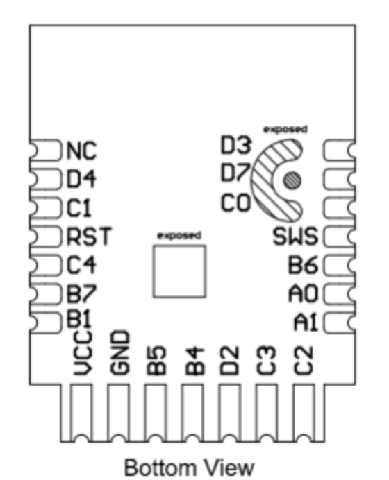

管脚功能定义表

.. raw:: html

   

+----------+------+---------+--------------------------------------+
| 引脚序号 | 符号 | I/O类型 | 功能描述                             |
+==========+======+=========+======================================+
| 1        | D3   | I/O     | 普通 IO 引脚，对应IC 的 D3(Pin32)    |
+----------+------+---------+--------------------------------------+
| 2        | D7   | I/O     | 普通 IO 引脚，对应IC 的 D7(Pin2)     |
+----------+------+---------+--------------------------------------+
| 3        | C0   | I/O     | 普通 IO 引脚，对应IC 的 C0(Pin20)    |
+----------+------+---------+--------------------------------------+
| 4        | SWS  | I/O     | 烧录引脚，对应 IC 的SWS（Pin5）      |
+----------+------+---------+--------------------------------------+
| 5        | B6   | I       | ADC 引脚，对应 IC的 B6（Pin16）      |
+----------+------+---------+--------------------------------------+
| 6        | A0   | I/O     | 普通 IO 引脚，对应IC 的 A0（Pin3）   |
+----------+------+---------+--------------------------------------+
| 7        | A1   | I/O     | 普通 IO 引脚，对应IC 的 A1（Pin4）   |
+----------+------+---------+--------------------------------------+
| 8        | C2   | I/O     | 支持硬件 PWM，对应 IC 的 C2（Pin22） |
+----------+------+---------+--------------------------------------+
| 9        | C3   | I/O     | 支持硬件 PWM，对应 IC 的 C3（Pin23） |
+----------+------+---------+--------------------------------------+
| 10       | D2   | I/O     | 支持硬件 PWM，对应 IC 的 D2（Pin31） |
+----------+------+---------+--------------------------------------+
| 11       | B4   | I/O     | 支持硬件 PWM，对应 IC 的 B4（Pin14） |
+----------+------+---------+--------------------------------------+
| 12       | B5   | I/O     | 支持硬件 PWM，对应 IC 的 B5（Pin15） |
+----------+------+---------+--------------------------------------+
| 13       | GND  | P       | 电源接地引脚                         |
+----------+------+---------+--------------------------------------+
| 14       | VCC  | P       | 电源引脚（3.3V）                     |
+----------+------+---------+--------------------------------------+
| 15       | B1   | I/O     | Uart\_TXD ，对应 IC的 B1（Pin6）     |
+----------+------+---------+--------------------------------------+
| 16       | B7   | I/O     | Uart\_RXD ，对应 IC的 B7（Pin17）    |
+----------+------+---------+--------------------------------------+
| 17       | C4   | I/O     | ADC 引脚，对应 IC的 C4（Pin24）      |
+----------+------+---------+--------------------------------------+
| 18       | RST  | I/O     | 复位引脚，低电平有效                 |
+----------+------+---------+--------------------------------------+
| 19       | C1   | I/O     | 普通 IO 引脚，对应IC 的 C1（Pin21）  |
+----------+------+---------+--------------------------------------+
| 20       | D4   | I/O     | 普通 IO 引脚，对应IC 的 D4（Pin1）   |
+----------+------+---------+--------------------------------------+
| 21       | NC   | I/O     | 空接                                 |
+----------+------+---------+--------------------------------------+

说明： P 表示电源引脚，

电气参数
--------

绝对电气参数
~~~~~~~~~~~~~~~~~

.. raw:: html

   

+--------------+-----------------------+--------+--------+------+
|     参数     |         描述          | 最小值 | 最大值 | 单位 |
+==============+=======================+========+========+======+
| Ts           | 存储温度              | -65    | 150    | ℃    |
+--------------+-----------------------+--------+--------+------+
| VCC          | 供电电压              | -0.3   | 3.9    | V    |
+--------------+-----------------------+--------+--------+------+
| 静电释放电压 | （人体模型） TAMB-25℃ | ——     | 2      | KV   |
+--------------+-----------------------+--------+--------+------+
| 静电释放电压 | （机器模型） TAMB-25℃ | ——     | 0.5    | KV   |
+--------------+-----------------------+--------+--------+------+

工作条件
~~~~~~~~~~~~~~~~~

.. raw:: html

   

+------+---------------+---------+--------+---------+------+
| 参数 |     描述      | 最小值  | 典型值 | 最大值  | 单位 |
+======+===============+=========+========+=========+======+
| Ta   | 工作温度      | -40     | ——     | 85      | ℃    |
+------+---------------+---------+--------+---------+------+
| VCC  | 工作电压      | 3       | 3.3    | 3.6     | V    |
+------+---------------+---------+--------+---------+------+
| VIL  | IO 低电平输入 | VSS     | ——     | VCC*0.3 | V    |
+------+---------------+---------+--------+---------+------+
| VIH  | IO 高电平输入 | VCC*0.7 | ——     | VCC     | V    |
+------+---------------+---------+--------+---------+------+
| VOL  | IO 低电平输出 | VSS     | ——     | VCC*0.1 | V    |
+------+---------------+---------+--------+---------+------+
| VOH  | IO 高电平输出 | VCC*0.9 | ——     | VCC     | V    |
+------+---------------+---------+--------+---------+------+

工作模式下功耗
~~~~~~~~~~~~~~~~~

.. raw:: html

   

+-------------+--------------------------------+------------------+------+
| 符号        | 条件                           | 最大值（典型值） | 单位 |
+=============+================================+==================+======+
| Itx         | 连续发送，11.5dBm输出功率      | 22.6             | mA   |
+-------------+--------------------------------+------------------+------+
| Irx         | 连续接收                       | 6.5              | mA   |
+-------------+--------------------------------+------------------+------+
| IDC         | Mesh 联网工作状态下 Average 值 | 6.59             | mA   |
+-------------+--------------------------------+------------------+------+
| IDC         | Mesh 联网工作状态下 Peak 值    | 24.9             | mA   |
+-------------+--------------------------------+------------------+------+
| Ideepsleep1 | 深度休眠模式（保留16KBRAM）    | 1.2              | μA   |
+-------------+--------------------------------+------------------+------+
| Ideepsleep2 | 深度休眠模式（不保留 RAM）     | 0.4              | μA   |
+-------------+--------------------------------+------------------+------+

射频参数
--------

基本射频特性
~~~~~~~~~~~~~~~~~

.. raw:: html

   

+--------------+-----------------+
| 参数项       | 详细说明        |
+==============+=================+
| 工作频率     | 2.4GHz ISM band |
+--------------+-----------------+
| 无线标准     | 蓝牙 LE 4.2/5.0 |
+--------------+-----------------+
| 数据传输速率 | 1 Mbps          |
+--------------+-----------------+
| 天线类型     | 板载 PCB 天线   |
+--------------+-----------------+

RF 输出功率
~~~~~~~~~~~~~~~~~

.. raw:: html

   

+----------------------+--------+--------+--------+------+
|        参数项        | 最小值 | 典型值 | 最大值 | 单位 |
+======================+========+========+========+======+
| RF平均输出功率       | -21    | 10     | 11.5   | dBm  |
+----------------------+--------+--------+--------+------+
| 20dB调制信号带宽(1M) | ——     | ——     | 2500   | KHz  |
+----------------------+--------+--------+--------+------+

RF 接收灵敏度
~~~~~~~~~~~~~~~~~

.. raw:: html

   

+-----------------+--------+--------+--------+------+
|     参数项      | 最小值 | 典型值 | 最大值 | 单位 |
+=================+========+========+========+======+
| RX 灵敏度1Mbps  | ——     | -94.5  | ——     | dBm  |
+-----------------+--------+--------+--------+------+
| 频率偏移误1Mbps | -250   | ——     |        | KHz  |
+-----------------+--------+--------+--------+------+
| 同信道干扰抑制  | ——     | ——     | -10    | dB   |
+-----------------+--------+--------+--------+------+

模组上电时序要求
-----------------

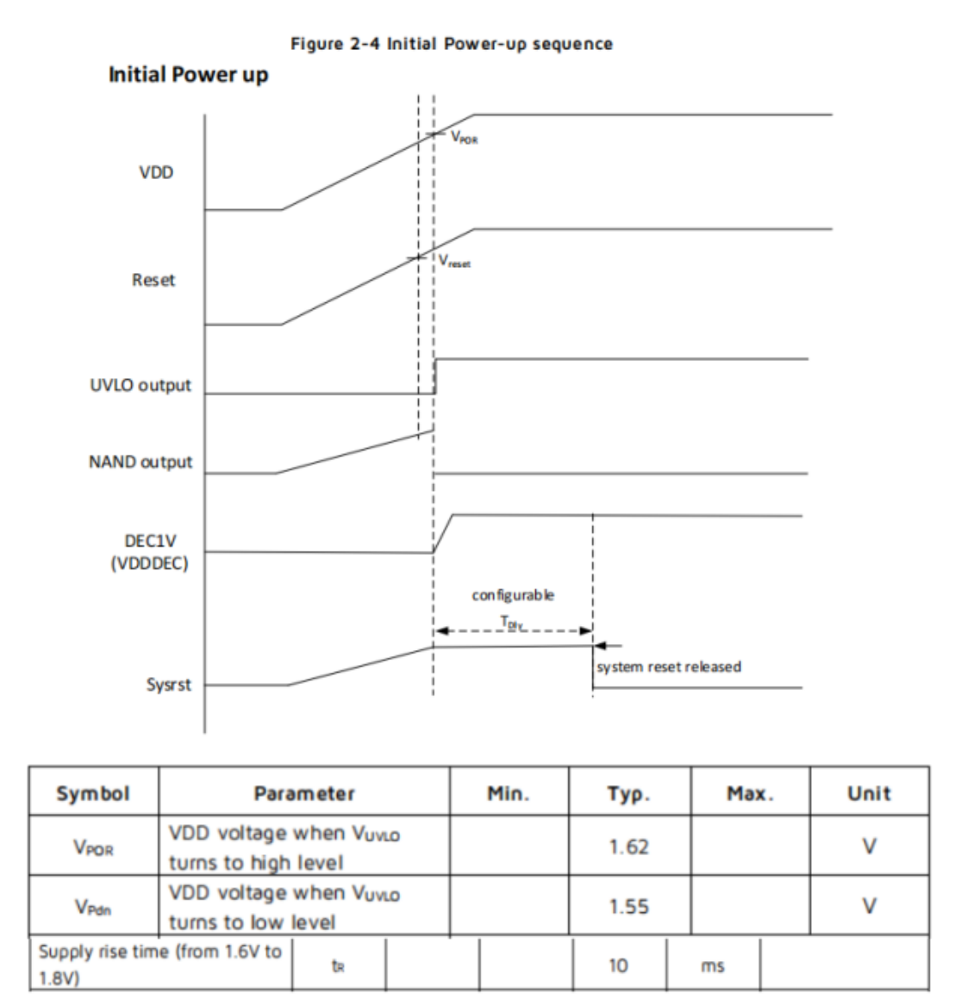

TLSR8258 芯片对上电时序有要求，在上电过程中 RST 引脚达到 1.62V 以后系统开始启动，这时 VDD 需要在 10ms 内达到 1.8V 以上。由于 RST 引脚有 RC 链路，故裸模组在 RST 达到1.62V 的时候 VDD 已经远超过 1.8。 TLSR8258 芯片模组对接的电源驱动如果存在大电容的一些充放电情况下，若模组电压未完全放电到 0.6V 以下，模组再启动的话会有死机风险。要求模组 VDD_3.3V 供电引脚需要接 1K 的假负载，用来快速释放电能。可参考下面的部分电源驱动链路：

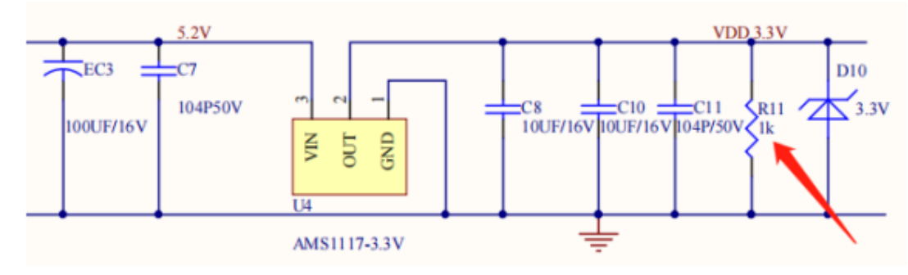

天线信息
--------

天线类型
~~~~~~~~~~~

BTU 使用的是板载 PCB 天线，天线增益 1.1dBi。

降低天线干扰
~~~~~~~~~~~~~~~~~

为确保 RF 性能的最优化，建议模组天线部分和其他金属件的距离至少保持 15mm 以上。如果使用环境的天线周边包裹金属材料等，会极大地衰减无线信号，进而恶化射频性能。成品设计时，注意给天线区域预留出足够的空间。

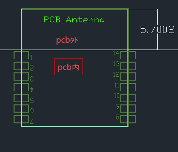

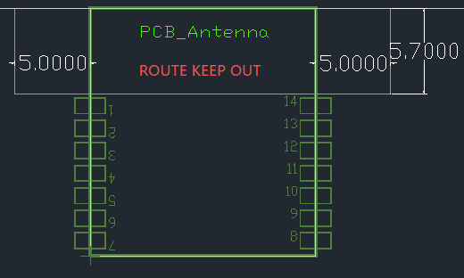

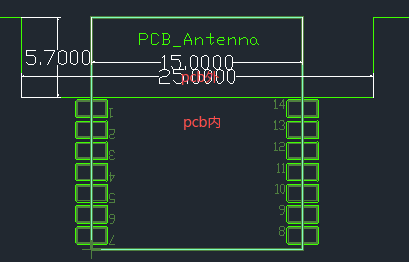

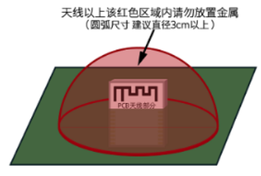

封装信息及生产指导
------------------

机械尺寸
~~~~~~~~

PCB 尺寸大小：20.3±0.35mm (L) × 15.8±0.35mm (W) × 1.0±0.1mm (H)。

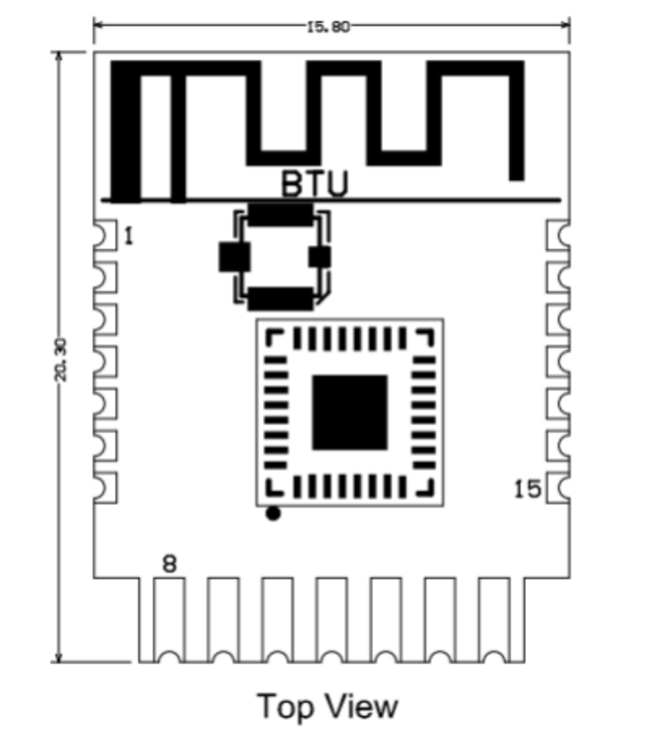

侧视图
~~~~~~~~~~

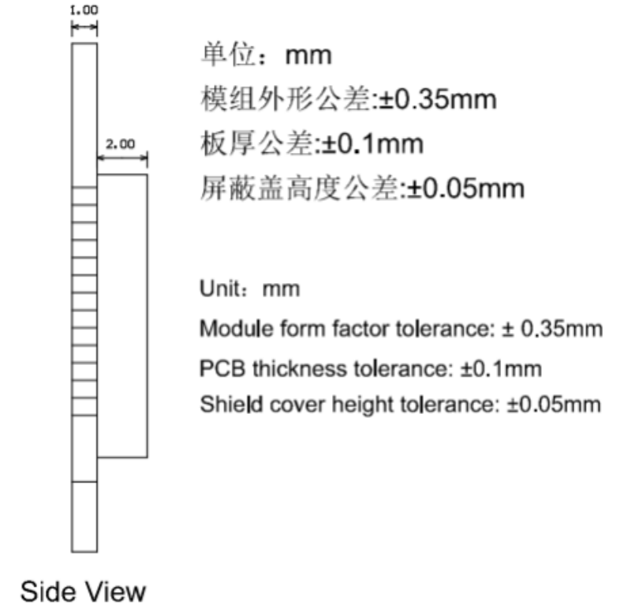

PCB 封装图-SMT
~~~~~~~~~~~

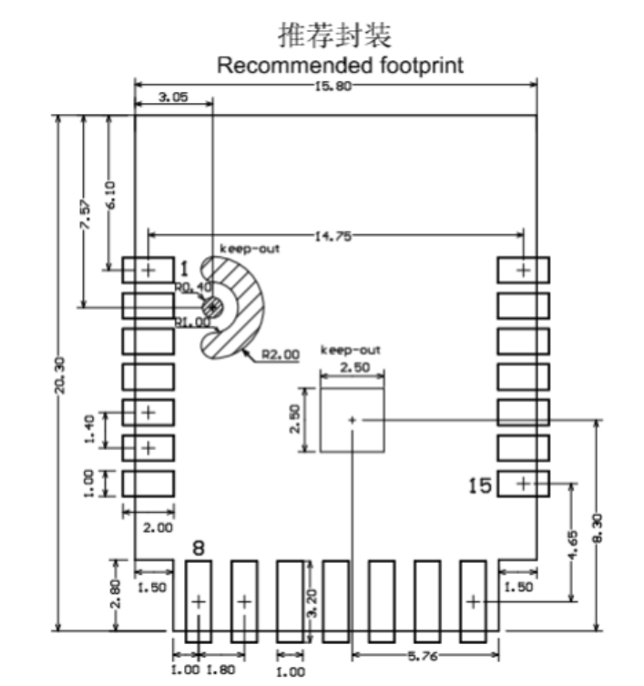

设计指导
--------

1. 应用电路
~~~~~~~~~~~~~~~~~~

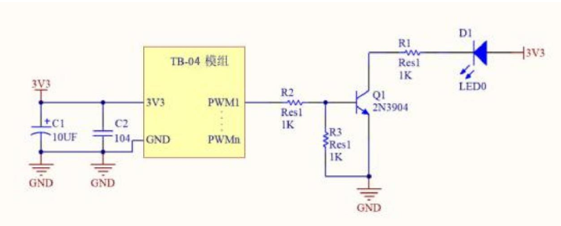

2. 天线布局要求
~~~~~~~~~~~~~~~~~~

把模组放在主板边沿， 天线周边禁止放置金属件， 远离高频器件。

3. 供电  
~~~~~~~~~~~~~~~~~~

（1）、 推荐 3.3V 电压， 峰值 50mA 以上电流

（2）、建议使用 LDO 供电； 如使用 DC-DC 建议纹波控制在 30mV 以内。

（3）、DC-DC 供电电路建议预留动态响应电容的位置， 可以在负载变化较大时， 优化输出纹波。

（4）、3.3V 电源接口建议增加 ESD 器件。

4. PWM 调光方案设计说明
~~~~~~~~~~~~~~~~~~

对于需要调光功能的灯具， 只需要将对应颜色的 PWM 引脚连接到后级驱动电路的控制端即可； PWM 独立输出占空比为 100 级可调的数字信号， 后级电路可以是电压驱动型也可以是电流驱动型。

连接示意图

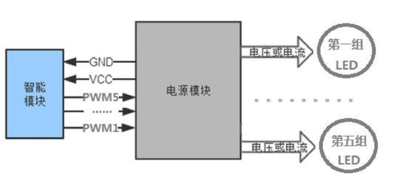

5. LED 驱动参考设计
~~~~~~~~~~~~~~~~~~

TB-04 模块应用只需要搭配 3.3V 供电， 以及简单的驱动电路， 即可实现智能灯控，以 MOS 管驱动一路正白光为例， 设计参考如下图； CW_I 为模块正白光的 PWM 输出引脚， Q1 为 MOS 管， WW 为 LED 灯珠， 其他 4 路灯驱动电路与这一路的设计方法一样。

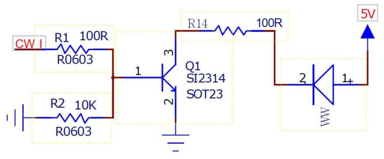

6. 回流焊曲线图
~~~~~~~~~~~~~~~~~~~~

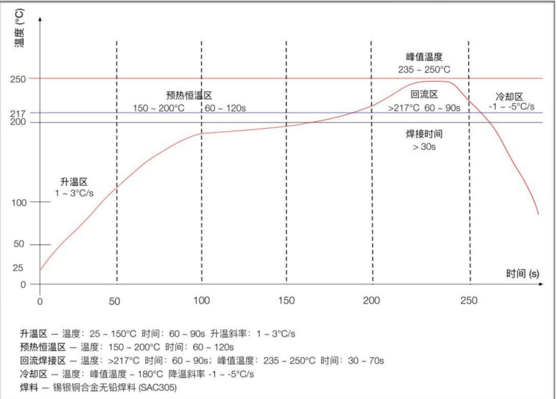

生产指南
--------

1. 组装方式
~~~~~~~~~~~~~~~~~~

出厂的可贴可插封装模组根据客户底板设计方案选择组装方式，底板设计为贴片封装

时使用 SMT 贴片制程进行生产，如果底板设计为插件封装时使用波峰焊制程进行生产。模

组产品拆开包装后建议在 24 小时内完成焊接，否则需放置在湿度不超过 10%RH 的干燥柜

内，或重新进行真空包装并记录暴露时间，总暴露时间不超过 168 小时。

* SMT 制程）SMT 贴片所需仪器或设备：

• 贴片机

• SPI

• 回流焊

• 炉温测试仪

• AOI

* 波峰焊制程）波峰焊所需的仪器或设备：

• 波峰焊设备

• 波峰焊接治具

• 恒温烙铁

• 锡条、锡丝、助焊剂

• 炉温测试仪

* 烘烤所需仪器或设备：

• 柜式烘烤箱

• 防静电耐高温托盘

• 防静电耐高温手套

2. 出厂的模组存储条件如下：
~~~~~~~~~~~~~~~~~~

• 防潮袋必须储存在温度 ＜40℃、湿度 ＜90%RH 的环境中。

• 干燥包装的产品，保质期为从包装密封之日起 12 个月的时间。

• 密封包装内装有湿度指示卡：

.. image:: ../../../image/MYZR-IoT系列/MYZR-MOD-BTU/规格书+15.png
   :alt: 规格书+15.png
   :width: 100%

3. 出厂的模组当出现可能受潮的情况下需要进行烘烤：
~~~~~~~~~~~~~~~~~~

• 拆封前发现真空包装袋破损。

• 拆封后发现包装袋内没有湿度指示卡。

• 拆封后如果湿度指示卡读取到 10% 及以上色环变为粉色。

• 拆封后总暴露时间超过 168 小时。

• 从首次密封包装之日起超过 12 个月。

4. 烘烤参数如下：
~~~~~~~~~~~~~~~~~~

• 烘烤温度：卷盘包装 40℃，小于等于 5%RH。托盘包装 125℃，小于等于 5%RH（耐高温

托盘非吸塑盒拖盘）。

• 烘烤时间：卷盘包装 168 小时，托盘包装 12 小时。

• 报警温度设定：卷盘包装 50℃，托盘包装 135℃。

• 自然条件下冷却到 36℃ 以下后，即可进行生产。

5. 在整个生产过程中，请对模组进行静电放电（ESD）保护。
~~~~~~~~~~~~~~~~~~

6. 为了确保产品合格率，建议使用 SPI 和 AOI 测试设备来监控锡膏印刷和贴装品质。
~~~~~~~~~~~~~~~~~~

推荐炉温曲线
------------------

请根据制程选择相应的焊接方式，SMT 参考回流焊接炉温曲线推荐，波峰焊制程参考波峰焊接炉温曲线推荐。设定炉温与实测炉温有一定差距，本文所示温度均为实测温度。

SMT 制程（SMT 回流焊接推荐炉温曲线）

请参考回流焊炉温曲线要求进行炉温设定，回流焊温度曲线如下图所示：

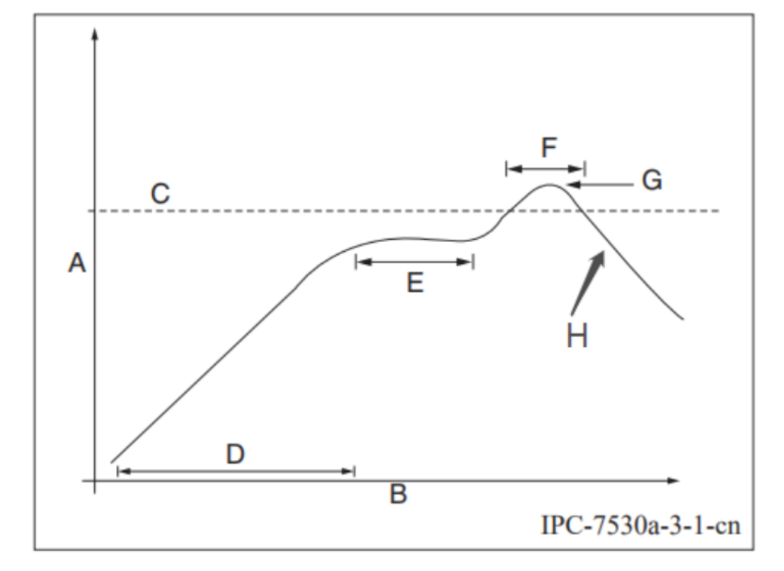

• A：温度轴

• B：时间轴

• C：合金液相线温度区间为 217-220℃

• D：升温斜率为 1-3℃/S

• E：恒温时间为 60-120S，恒温温度区间为 150-200℃

• F：液相线以上时间为 50-70S

• G：峰值温度为 235-245℃

模组储存注意事项
----------------

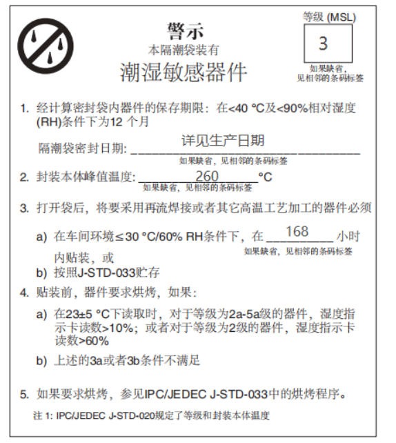

• 若烘烤后暴露时间大于 168 小时没有使用完，请再次进行烘烤。

• 如果暴露时间超过 168 小时未经过烘烤，不建议使用波峰焊接工艺焊接此批次模组，因模

组为 3 级湿敏器件超过允许的暴露时间很可能受潮，进行高温焊接时可能导致器件失效或

焊接不良。

• 在整个生产过程中，请对模组进行静电放电（ESD）保护。

• 为了确保产品合格率，建议使用 SPI 和 AOI 测试设备来监控锡膏印刷和贴装品质。

订购选配
--------

.. raw:: html

   

+---------------+--------------+
| 型号          | 描述         |
+===============+==============+
| MYZR-BTU-ANT  | 板载PCB天线  |
+---------------+--------------+
| MYZR-BTU-IPEX | 板载IPEX座子 |
+---------------+--------------+

