规格书
======

产品概述
--------

TB04 智能照明模块是一款基于 TLSR8258 芯片设计的符合 BLE 5.0 低功耗 Tmall Genie Mesh 的蓝牙模块； 该模块是拥有蓝牙 mesh 组网功能的蓝牙模块； 设备之间通过对等星型网络通讯， 采用蓝牙广播进行通讯， 可保证多设备情况下响应及时。 它主要应用于智能灯控， 可满足低功耗、 低延时、 近距离无线数据通信的要求。

特性

*  1.1mm 间距 SMD-20 封装

*  6 路 PWM 输出

*  亮度（ 占空比） 调整范围 5%-100%

*  出厂默认冷色暖色占空比各50%

*  带小夜灯功能

*  带墙壁开关切换色温功能

应用领域

*  智能 LED・ 智能家居

*  智能低功耗传感器

*  智能楼宇

*  智慧家居/家电

*  智能插座、智慧灯

*  工业无线控制

*  婴儿监控器

*  智能公交

模组接口
--------

外观尺寸
~~~~~~~~

.. raw:: html

   

   

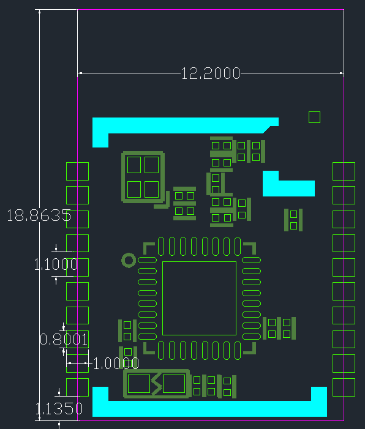

.. raw:: html

   

   

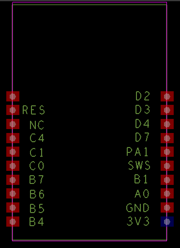

.. raw:: html

   

   

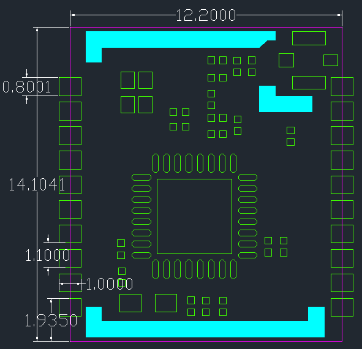

.. raw:: html

   

   

管脚定义
~~~~~~~~

TB-04 模组共接出20 个接 口， 如管脚示意图， 管脚功能定义表是接口定义。

TB-04 管脚示意图

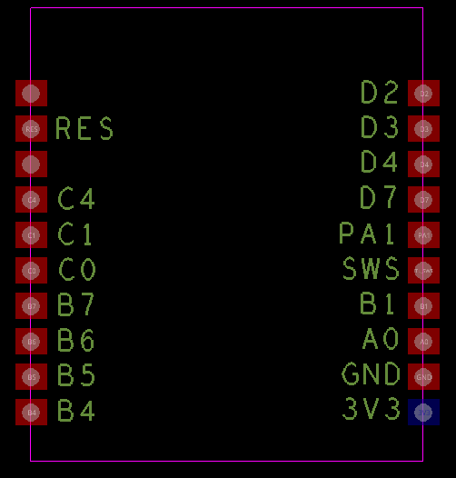

管脚功能定义表

.. raw:: html

   

+------+------+------------------------------------------------------------+
| 脚序 | 名称 | 功能说明                                                   |
+======+======+============================================================+
| 1    | NC   | NOT CONNECTED                                              |
+------+------+------------------------------------------------------------+
| 2    | RST  | 复位引脚                                                   |
+------+------+------------------------------------------------------------+
| 3    | NC   | NOT CONNECTED                                              |
+------+------+------------------------------------------------------------+
| 4    | C4   | PWM2 输出/UART\_CTS/PWM0 反向输出/SAR ADC 输入/GPIO PC4    |
+------+------+------------------------------------------------------------+
| 5    | C1   | I2C 串行时钟/ PWM1 反向输出/ pwm0 输出/GPIO PC1            |
+------+------+------------------------------------------------------------+
| 6    | C0   | I2C 串行数据/ PWM4 反向输出/ UART\_RTS / GPIO PC0          |
+------+------+------------------------------------------------------------+
| 7    | B7   | SPI 数据输出/UART\_RX/SAR ADC 输入/GPIO PB7                |
+------+------+------------------------------------------------------------+
| 8    | B6   | SPI 数据输入（ I2C\_SDA） /UART\_RTS/SAR ADC 输入/GPIO PB6 |
+------+------+------------------------------------------------------------+
| 9    | B5   | PWM5 输出/SAR ADC 输入/GPIO PB5                            |
+------+------+------------------------------------------------------------+
| 10   | B4   | PWM4 输出/SAR ADC 输入/GPIO PB4                            |
+------+------+------------------------------------------------------------+
| 11   | 3V3  | 3.3V 供电                                                  |
+------+------+------------------------------------------------------------+
| 12   | GND  | 接地                                                       |
+------+------+------------------------------------------------------------+
| 13   | RXD  | PWM0 反向输出/UART\_RX/GPIO PA0                            |
+------+------+------------------------------------------------------------+
| 14   | TXD  | PWM4 输出/UART\_TX/SAR ADC 输入/GPIO PB1                   |
+------+------+------------------------------------------------------------+
| 15   | SWS  | 单线从机                                                   |
+------+------+------------------------------------------------------------+
| 16   | A1   | GPIO PA1                                                   |
+------+------+------------------------------------------------------------+
| 17   | D7   | GPIO PD7/SPI 时钟（ I2C\_SCK）                             |
+------+------+------------------------------------------------------------+
| 18   | D4   | GPIO PD4/单线主机/PWM2 反向输出                            |
+------+------+------------------------------------------------------------+
| 19   | D3   | PWM1 反向输出/GPIO PD3                                     |
+------+------+------------------------------------------------------------+
| 20   | D2   | SPI 芯片选择（ 低电平有效） /PWM3 输出/GPIO PD2            |
+------+------+------------------------------------------------------------+

主要参数
~~~~~~~~~~~~~~~~~

.. raw:: html

   

+--------------+------------------------------------+
| 模块型号     | TB04                               |
+==============+====================================+
| 尺寸         | 12.2*14.1*2.3(± 0.2)MM             |
+--------------+------------------------------------+
| 封装         | SMD-20                             |
+--------------+------------------------------------+
| 无线标准     | 蓝牙 5.0                           |
+--------------+------------------------------------+
| 频率范围     | 2400 ~ 2483.5MHz                   |
+--------------+------------------------------------+
| 最大发射功率 | 最大值 10dBm                       |
+--------------+------------------------------------+
| 接收灵敏度   | -93dBm± 2                          |
+--------------+------------------------------------+
| 接口         | GPIO/PWM/SPI/ADC                   |
+--------------+------------------------------------+
| 工作温度     | -40℃ ~ 85 ℃                        |
+--------------+------------------------------------+
| 存储环境     | -40 ℃ ~ 125 ℃ , < 90%RH            |
+--------------+------------------------------------+
| 供电范围     | 供电电压 2.7V ~ 3.6V,供电电流≥50mA |
+--------------+------------------------------------+
| 功耗         | 深度睡眠模式： 0.8uA               |
+              +------------------------------------+
|              | 休眠模式： 1.8uA                   |
+              +------------------------------------+
|              | TX（ 10dBm） ： 20.69mA            |
+--------------+------------------------------------+

电气参数
--------

绝对最大额定值
~~~~~~~~~~~~~~~~~

任何超过下列绝对最大额定值都可能导致 TLSR8258 损坏

.. raw:: html

   

+---------------------+--------+--------+--------+------+
|        名称         | 最小值 | 典型值 | 最大值 | 单位 |
+=====================+========+========+========+======+
| 供电电压            | 2.7    | 3.3    | 3.6    | V    |
+---------------------+--------+--------+--------+------+
| I/O 电源电压(VCCIO) | -0.3   | ——     | 3.6    | V    |
+---------------------+--------+--------+--------+------+
| 工作温度            | -40    | ——     | +85    | ℃    |
+---------------------+--------+--------+--------+------+
| 储存温度            | -40    | ——     | +125   | ℃    |
+---------------------+--------+--------+--------+------+

工作条件
~~~~~~~~~~~~~~~~~

.. raw:: html

   

+------+---------------+---------+--------+---------+------+
| 参数 |     描述      | 最小值  | 典型值 | 最大值  | 单位 |
+======+===============+=========+========+=========+======+
| Ta   | 工作温度      | -40     | ——     | 85      | ℃    |
+------+---------------+---------+--------+---------+------+
| VCC  | 工作电压      | 3       | 3.3    | 3.6     | V    |
+------+---------------+---------+--------+---------+------+
| VIL  | IO 低电平输入 | VSS     | ——     | VCC*0.3 | V    |
+------+---------------+---------+--------+---------+------+
| VIH  | IO 高电平输入 | VCC*0.7 | ——     | VCC     | V    |
+------+---------------+---------+--------+---------+------+
| VOL  | IO 低电平输出 | VSS     | ——     | VCC*0.1 | V    |
+------+---------------+---------+--------+---------+------+
| VOH  | IO 高电平输出 | VCC*0.9 | ——     | VCC     | V    |
+------+---------------+---------+--------+---------+------+

工作模式下功耗
~~~~~~~~~~~~~~~~~

.. raw:: html

   

+--------------------+--------+------+
| 参数名称           | 典型值 | 单位 |
+====================+========+======+
| 发射功耗（ 10dBm） | 20.69  | mA   |
+--------------------+--------+------+
| 接收功耗           | 6.26   | mA   |
+--------------------+--------+------+
| 待机功耗           | 3.06   | mA   |
+--------------------+--------+------+
| 浅度睡眠           | 1.8    | uA   |
+--------------------+--------+------+
| 深度睡眠           | 0.8    | uA   |
+--------------------+--------+------+

射频参数
--------

基本射频特性
~~~~~~~~~~~~~~~~~

.. raw:: html

   

+--------------+-----------------+
| 参数项       | 详细说明        |
+==============+=================+
| 工作频率     | 2.4GHz ISM band |
+--------------+-----------------+
| 无线标准     | 蓝牙 5.0        |
+--------------+-----------------+
| 数据传输速率 | 1 Mbps          |
+--------------+-----------------+
| 天线类型     | 板载 PCB 天线   |
+--------------+-----------------+

RF发射功率
~~~~~~~~~~~~~~~~~

.. raw:: html

   

+----------+--------+--------+--------+------+
|   名称   | 最小值 | 典型值 | 最大值 | 单位 |
+==========+========+========+========+======+
| 平均功率 | ——     | 8.5    | 10     | dBm  |
+----------+--------+--------+--------+------+

RF接收灵敏度
~~~~~~~~~~~~~~~~~

.. raw:: html

   

+------------+--------+--------+--------+------+
|    名称    | 最小值 | 典型值 | 最大值 | 单位 |
+============+========+========+========+======+
| 接收灵敏度 | -94    | -93    | ——     | dBm  |
+------------+--------+--------+--------+------+

模组上电时序要求
-------------------

.. image:: ../../../image/MYZR-IoT系列/MYZR-MOD-TB04/规格书_6.png
   :alt: 规格书_6.png
   :width: 100%

TLSR8258 芯片对上电时序有要求，在上电过程中 RST 引脚达到 1.62V 以后系统开始启动，这时 VDD 需要在 10ms 内达到 1.8V 以上。由于 RST 引脚有 RC 链路，故裸模组在 RST 达到1.62V 的时候 VDD 已经远超过 1.8。 TLSR8258 芯片模组对接的电源驱动如果存在大电容的一些充放电情况下，若模组电压未完全放电到 0.6V 以下，模组再启动的话会有死机风险。要求模组 VDD_3.3V 供电引脚需要接 1K 的假负载，用来快速释放电能。可参考下面的部分电源驱动链路：

.. image:: ../../../image/MYZR-IoT系列/MYZR-MOD-TB04/规格书_7.png
   :alt: 规格书_7.png
   :width: 100%

天线信息
--------

天线类型
~~~~~~~~~~

BTU 使用的是板载 PCB 天线，天线增益 1.1dBi。

降低天线干扰
~~~~~~~~~~

为确保 RF 性能的最优化，建议模组天线部分和其他金属件的距离至少保持 15mm 以上。如果使用环境的天线周边包裹金属材料等，会极大地衰减无线信号，进而恶化射频性能。成品设计时，注意给天线区域预留出足够的空间。

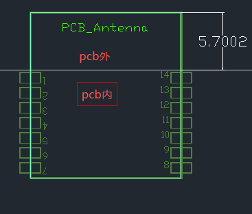

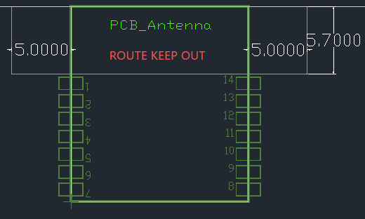

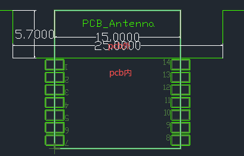

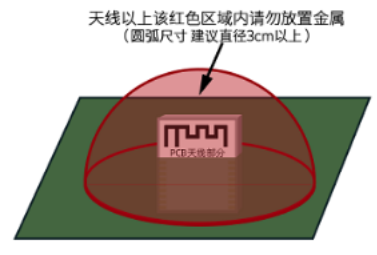

封装信息及生产指导
------------------

机械尺寸
~~~~~~~~

PCB 尺寸大小：20.3±0.35mm (L) × 15.8±0.35mm (W) × 1.0±0.1mm (H)。

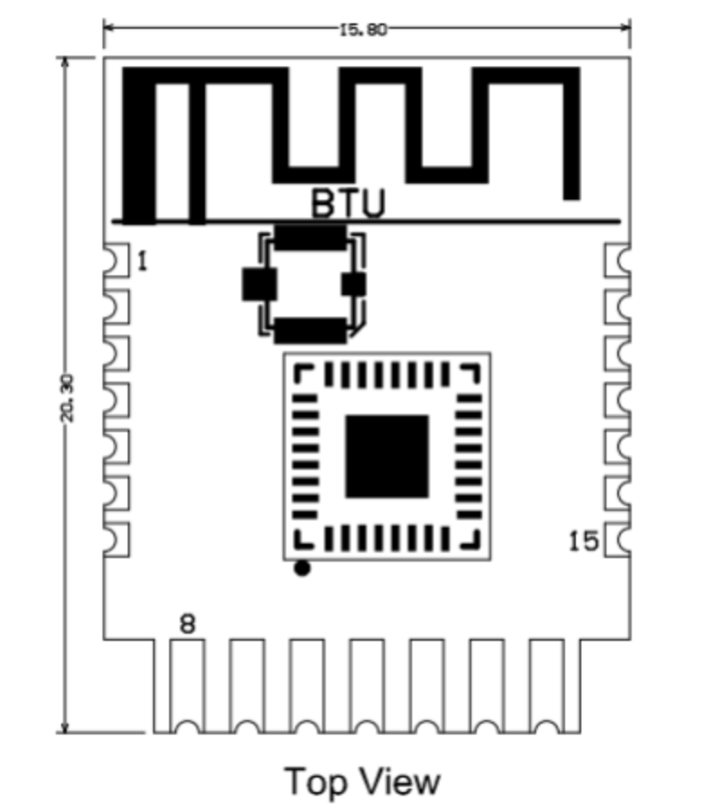

侧视图
~~~~~~~~~~

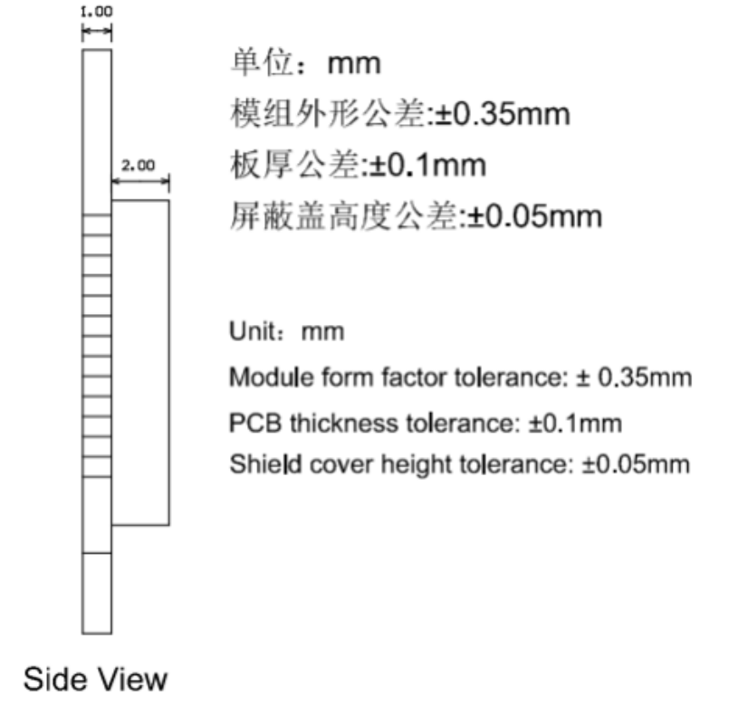

PCB 封装图-SMT
~~~~~~~~~~

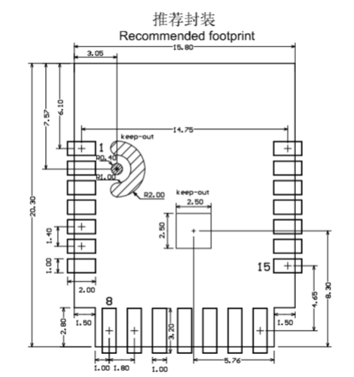

设计指导
--------

1. 应用电路
~~~~~~~~~~

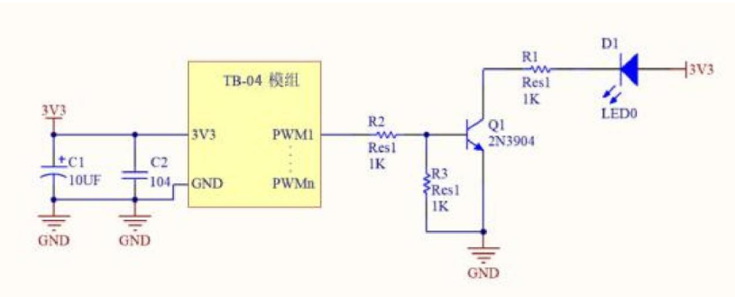

2. 天线布局要求
~~~~~~~~~~

把模组放在主板边沿， 天线周边禁止放置金属件， 远离高频器件。

3. 供电
~~~~~~~~~~

*  推荐 3.3V 电压， 峰值 50mA 以上电流

*  建议使用 LDO 供电； 如使用 DC-DC 建议纹波控制在 30mV 以内。

*  DC-DC 供电电路建议预留动态响应电容的位置， 可以在负载变化较大时， 优化输出纹波。

*  3.3V 电源接口建议增加 ESD 器件。

4. PWM 调光方案设计说明
~~~~~~~~~~

对于需要调光功能的灯具， 只需要将对应颜色的 PWM 引脚连接到后级驱动电路的控制端即可； PWM 独立输出占空比为 100 级可调的数字信号， 后级电路可以是电压驱动型也可以是电流驱动型。

连接示意图

.. image:: ../../../image/MYZR-IoT系列/MYZR-MOD-TB04/规格书_16.png
   :alt: 规格书_16.png
   :width: 100%

5. LED 驱动参考设计
~~~~~~~~~~

TB-04 模块应用只需要搭配 3.3V 供电， 以及简单的驱动电路， 即可实现智能灯控，以 MOS 管驱动一路正白光为例， 设计参考如下图； CW_I 为模块正白光的 PWM 输出引脚， Q1 为 MOS 管， WW 为 LED 灯珠， 其他 4 路灯驱动电路与这一路的设计方法一样。

.. image:: ../../../image/MYZR-IoT系列/MYZR-MOD-TB04/规格书_17.png
   :alt: 规格书_17.png
   :width: 100%

6. 回流焊曲线图
~~~~~~~~~~

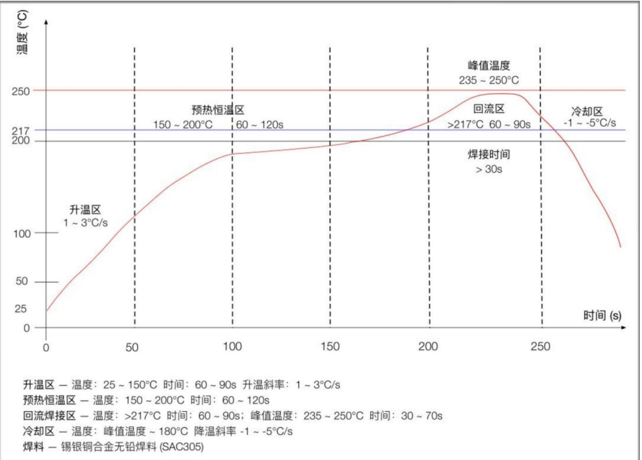

生产指南
--------

1. 组装方式
~~~~~~~~~~

出厂的可贴可插封装模组根据客户底板设计方案选择组装方式，底板设计为贴片封装

时使用 SMT 贴片制程进行生产，如果底板设计为插件封装时使用波峰焊制程进行生产。模

组产品拆开包装后建议在 24 小时内完成焊接，否则需放置在湿度不超过 10%RH 的干燥柜

内，或重新进行真空包装并记录暴露时间，总暴露时间不超过 168 小时。•（SMT 制程）SMT 贴片所需仪器或设备：

• 贴片机

• SPI

• 回流焊

• 炉温测试仪

• AOI

•（波峰焊制程）波峰焊所需的仪器或设备：

• 波峰焊设备

• 波峰焊接治具

• 恒温烙铁

• 锡条、锡丝、助焊剂

• 炉温测试仪

• 烘烤所需仪器或设备：

• 柜式烘烤箱

• 防静电耐高温托盘

• 防静电耐高温手套

2. 出厂的模组存储条件如下：
~~~~~~~~~~

• 防潮袋必须储存在温度 ＜40℃、湿度 ＜90%RH 的环境中。

• 干燥包装的产品，保质期为从包装密封之日起 12 个月的时间。

• 密封包装内装有湿度指示卡：

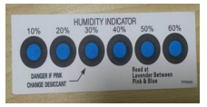

3. 出厂的模组当出现可能受潮的情况下需要进行烘烤：
~~~~~~~~~~

• 拆封前发现真空包装袋破损。

• 拆封后发现包装袋内没有湿度指示卡。

• 拆封后如果湿度指示卡读取到 10% 及以上色环变为粉色。

• 拆封后总暴露时间超过 168 小时。

• 从首次密封包装之日起超过 12 个月。

4. 烘烤参数如下：
~~~~~~~~~~

• 烘烤温度：卷盘包装 40℃，小于等于 5%RH。托盘包装 125℃，小于等于 5%RH（耐高温托盘非吸塑盒拖盘）。

• 烘烤时间：卷盘包装 168 小时，托盘包装 12 小时。

• 报警温度设定：卷盘包装 50℃，托盘包装 135℃。

• 自然条件下冷却到 36℃ 以下后，即可进行生产。

5. 在整个生产过程中，请对模组进行静电放电（ESD）保护。
~~~~~~~~~~

6. 为了确保产品合格率，建议使用 SPI 和 AOI 测试设备来监控锡膏印刷和贴装品质。
~~~~~~~~~~

推荐炉温曲线
-------------------

请根据制程选择相应的焊接方式，SMT 参考回流焊接炉温曲线推荐，波峰焊制程参考波峰焊接炉温曲线推荐。设定炉温与实测炉温有一定差距，本文所示温度均为实测温度。

SMT 制程（SMT 回流焊接推荐炉温曲线）

请参考回流焊炉温曲线要求进行炉温设定，回流焊温度曲线如下图所示：

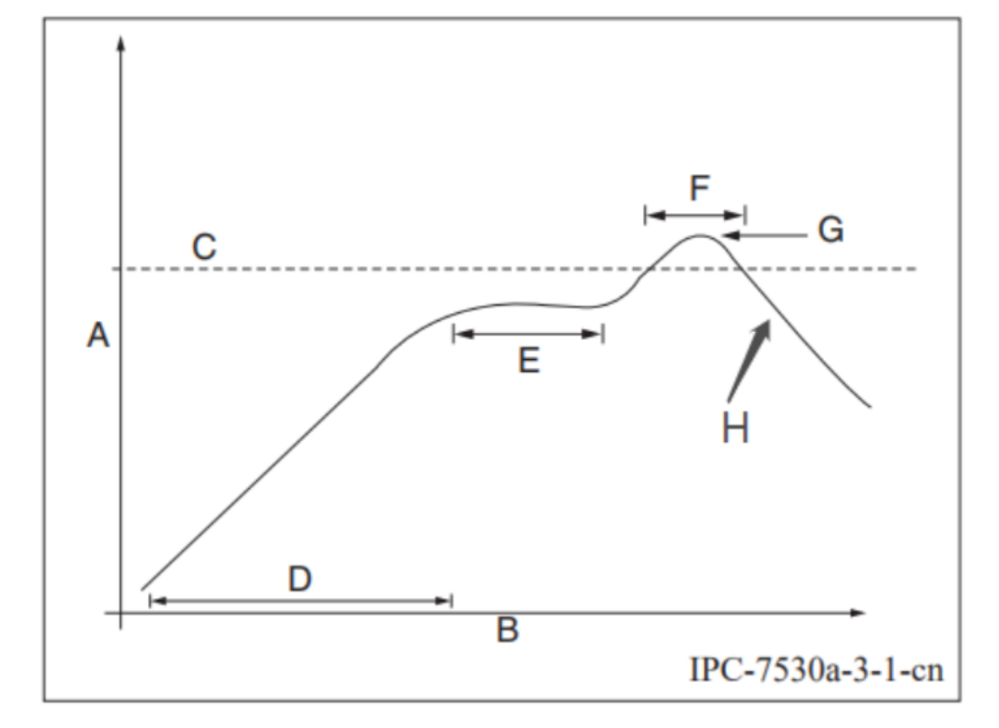

• A：温度轴

• B：时间轴

• C：合金液相线温度区间为 217-220℃

• D：升温斜率为 1-3℃/S

• E：恒温时间为 60-120S，恒温温度区间为 150-200℃

• F：液相线以上时间为 50-70S

• G：峰值温度为 235-245℃

模组储存注意事项
----------------

• 若烘烤后暴露时间大于 168 小时没有使用完，请再次进行烘烤。

• 如果暴露时间超过 168 小时未经过烘烤，不建议使用波峰焊接工艺焊接此批次模组，因模

组为 3 级湿敏器件超过允许的暴露时间很可能受潮，进行高温焊接时可能导致器件失效或

焊接不良。

• 在整个生产过程中，请对模组进行静电放电（ESD）保护。

• 为了确保产品合格率，建议使用 SPI 和 AOI 测试设备来监控锡膏印刷和贴装品质。

订购配置
--------

.. raw:: html

   

+----------------+--------------+
| 型号           | 描述         |
+================+==============+
| MYZR-TB04-ANT  | 板载PCB天线  |
+----------------+--------------+
| MYZR-TB04-IPEX | 板载IPEX座子 |
+----------------+--------------+