Specifications
======

BT7L is a low-power embedded Bluetooth module. It mainly consists of a highly integrated Bluetooth chip TLSR8258F512ET32 and a small amount of peripheral circuits, with built-in Bluetooth network communication protocol stack and rich library functions.

Product Overview
--------

BT7L also includes a low-power 32-bit MCU, Bluetooth 5.0/2.4G Radio, 512kB Flash, 48kB SRAM, and 7 reusable I/O ports.

**Features**

*  Built-in low-power 32-bit MCU, can also serve as application processor.

*  Main frequency supports 48 MHz.

*  Operating voltage: 3.0V-3.6V

*  Peripherals: 5xPWMs, 1xI2C, 1xUART.

*  Bluetooth RF characteristics

*  Bluetooth 5.0

*  Data transmission rate: Up to 2Mbps. TX transmit power: +10dBm

*  RX receive sensitivity: -94.5dBm@Bluetooth 1Mbps. Built-in hardware AES encryption (requires specific testing)

*  Equipped with onboard PCB antenna

*  Operating temperature: -40℃ to +85℃

**Applications**

*  Smart LED / Smart Home

*  Smart low-power sensors

*  Smart buildings

*  Smart home/appliances

*  Smart sockets, smart lights

*  Industrial wireless control

*  Baby monitors

*  Smart buses

Module Interface
--------

Dimensions
~~~~~~~~

BT7L has 2 rows of pins, with pin pitch of 1.5mm.

BT7L dimensions: 15±0.35mm (W) × 16.5±0.35mm (L) × 2.85±0.15mm(H), where PCB thickness is 1.0±0.1mm, package as shown.

TOP view (from above)

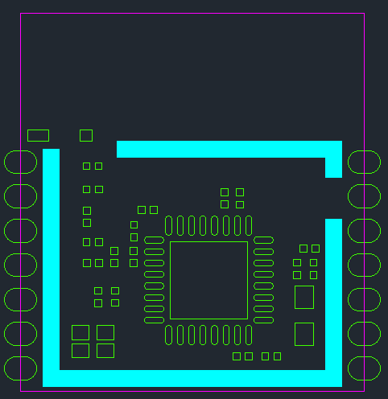

BOTTOM view (from above)

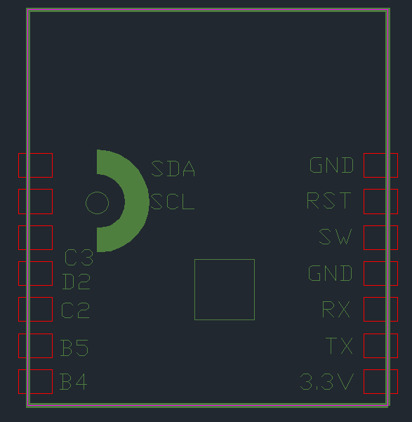

Pin Definition
~~~~~~~~

.. raw:: html

   

+-----+--------+----------+---------------------------------------------------------------------------------------------------------------------+
| Pin | Symbol | I/O Type |                                                Function Description                                                 |
+=====+========+==========+=====================================================================================================================+
| 1   | SDA    | I/O      | Corresponds to chip PC<0>, I2C data line pin, can be used as general IO pin                                         |
+-----+--------+----------+---------------------------------------------------------------------------------------------------------------------+
| 2   | SCL    | I/O      | Corresponds to chip PC<1>, I2C clock line pin, can be used as general IO pin                                        |
+-----+--------+----------+---------------------------------------------------------------------------------------------------------------------+
| 3   | C3     | I/O      | Corresponds to chip PC<3>, general IO pin, can be used for LED driver PWM output, default controls green light      |
+-----+--------+----------+---------------------------------------------------------------------------------------------------------------------+
| 4   | D2     | I/O      | Corresponds to chip PD<2>, general IO pin, can be used for LED driver PWM output, default controls blue light       |
+-----+--------+----------+---------------------------------------------------------------------------------------------------------------------+
| 5   | C2     | I/O      | Corresponds to chip PC<2>, general IO pin, can be used for LED driver PWM output, default controls warm white light |
+-----+--------+----------+---------------------------------------------------------------------------------------------------------------------+
| 6   | B5     | I/O      | Corresponds to chip PB<5>, general IO pin, can be used for LED driver PWM output, default controls cool white light |
+-----+--------+----------+---------------------------------------------------------------------------------------------------------------------+
| 7   | B4     | I/O      | Corresponds to chip PB<4>, general IO pin, can be used for LED driver PWM output, default controls red light        |
+-----+--------+----------+---------------------------------------------------------------------------------------------------------------------+
| 8   | 3.3V   | P        | Module power input pin                                                                                              |
+-----+--------+----------+---------------------------------------------------------------------------------------------------------------------+
| 9   | TX     | I/O      | Corresponds to chip PB<1>, UART transmit pin, can be used as general IO pin                                         |
+-----+--------+----------+---------------------------------------------------------------------------------------------------------------------+
| 10  | RX     | I/O      | Corresponds to chip PB<7>, UART receive pin, can be used as general IO pin                                          |
+-----+--------+----------+---------------------------------------------------------------------------------------------------------------------+
| 11  | GND    | P        | Module power reference ground pin                                                                                   |
+-----+--------+----------+---------------------------------------------------------------------------------------------------------------------+
| 12  | SW     | I/O      | Corresponds to chip SWS, Bluetooth chip programming pin                                                             |
+-----+--------+----------+---------------------------------------------------------------------------------------------------------------------+
| 13  | RST    | I        | Corresponds to chip RESETB, module reset pin, built-in pull-up resistor                                             |
+-----+--------+----------+---------------------------------------------------------------------------------------------------------------------+
| 14  | GND    | P        | Module power reference ground pin                                                                                   |
+-----+--------+----------+---------------------------------------------------------------------------------------------------------------------+

**Note**: P indicates power pin, I/O indicates input/output pin. If you have specific requirements for PWM output controlled light colors, please contact us.

Electrical Parameters
--------

Absolute Electrical Parameters

.. raw:: html

   

+-----------------------------------------+----------------------------------------+------+-----+------+
|                Parameter                |              Description               | Min  | Max | Unit |
+=========================================+========================================+======+=====+======+
| Ts                                      | Storage temperature                    | -65  | 150 | ℃    |
+-----------------------------------------+----------------------------------------+------+-----+------+
| VCC                                     | Supply voltage                         | -0.3 | 3.9 | V    |
+-----------------------------------------+----------------------------------------+------+-----+------+
| ESD voltage (Human body model) TAMB=25℃ | Human body model ESD withstand voltage | ——   | 2   | kV   |
+-----------------------------------------+----------------------------------------+------+-----+------+
| ESD voltage (Machine model) TAMB=25℃    | Machine model ESD withstand voltage    | ——   | 0.5 | kV   |
+-----------------------------------------+----------------------------------------+------+-----+------+

Operating Conditions

.. raw:: html

   

+-----------+------------------------------+---------+-----+---------+------+
| Parameter |         Description          |   Min   | Typ |   Max   | Unit |
+===========+==============================+=========+=====+=========+======+
| Ta        | Operating temperature        | -40     | ——  | 85      | ℃    |
+-----------+------------------------------+---------+-----+---------+------+
| VCC       | Operating voltage            | 3       | 3.3 | 3.6     | V    |
+-----------+------------------------------+---------+-----+---------+------+
| VIL       | IO low-level input voltage   | VSS     | ——  | VCC-0.3 | V    |
+-----------+------------------------------+---------+-----+---------+------+
| VIH       | IO high-level input voltage  | VCC-0.7 | ——  | VCC     | V    |
+-----------+------------------------------+---------+-----+---------+------+
| VOL       | IO low-level output voltage  | VSS     | ——  | VCC-0.1 | V    |
+-----------+------------------------------+---------+-----+---------+------+
| VOH       | IO high-level output voltage | VCC-0.9 | ——  | VCC     | V    |
+-----------+------------------------------+---------+-----+---------+------+

Power Consumption in Operating Mode (To be tested)

.. raw:: html

   

+--------+-----------------------------------------+------+------------+------+
| Symbol |                Condition                | Typ  | Peak (Typ) | Unit |
+========+=========================================+======+============+======+
| Itx    | Continuous transmit, 10dBm output power | 16.8 | 18.4       | mA   |
+--------+-----------------------------------------+------+------------+------+
| Itx    | Continuous transmit, 0dBm output power  | 6.3  | 8.8        | mA   |
+--------+-----------------------------------------+------+------------+------+
| Irx    | Continuous receive                      | 6.3  | 8.9        | mA   |
+--------+-----------------------------------------+------+------------+------+
| IDC    | Network provisioning mode               | 6.8  | 32         | mA   |
+--------+-----------------------------------------+------+------------+------+
| IDC    | Network operating mode                  | 6.8  | 32         | mA   |
+--------+-----------------------------------------+------+------------+------+

RF Parameters
--------

Basic RF Characteristics

.. raw:: html

   

+------------------------+---------------------+
|       Parameter        |     Description     |
+========================+=====================+
| Operating frequency    | 2.4GHz ISM Band     |
+------------------------+---------------------+
| Wireless standard      | Bluetooth 5.0       |
+------------------------+---------------------+
| Data transmission rate | 1Mbps, 2Mbps        |
+------------------------+---------------------+
| Antenna type           | Onboard PCB antenna |
+------------------------+---------------------+

RF Output Power

.. raw:: html

   

+-----------------------------------------+-----+------+------+------+
|                Parameter                | Min | Typ  | Max  | Unit |
+=========================================+=====+======+======+======+
| RF average output power                 | -22 | 10   | 10.5 | dBm  |
+-----------------------------------------+-----+------+------+------+
| 20dB modulated signal bandwidth (1Mbps) | ——  | 2500 | ——   | kHz  |
+-----------------------------------------+-----+------+------+------+
| 20dB modulated signal bandwidth (2Mbps) | ——  | 2600 | ——   | kHz  |
+-----------------------------------------+-----+------+------+------+

RF Receive Sensitivity

.. raw:: html

   

+-----------------------------------+------+-----+-----+------+
|             Parameter             | Min  | Typ | Max | Unit |
+===================================+======+=====+=====+======+
| RX sensitivity (1Mbps)            | ——   | -91 | ——  | dBm  |
+-----------------------------------+------+-----+-----+------+
| RX sensitivity (2Mbps)            | ——   | -89 | ——  | dBm  |
+-----------------------------------+------+-----+-----+------+
| Frequency offset error (1Mbps)    | -300 | ——  |     | kHz  |
+-----------------------------------+------+-----+-----+------+
| Frequency offset error (2Mbps)    | -200 | ——  |     | kHz  |
+-----------------------------------+------+-----+-----+------+
| Co-channel interference rejection | ——   | -7  | ——  | dB   |
+-----------------------------------+------+-----+-----+------+

Module Power-On Sequence Requirements

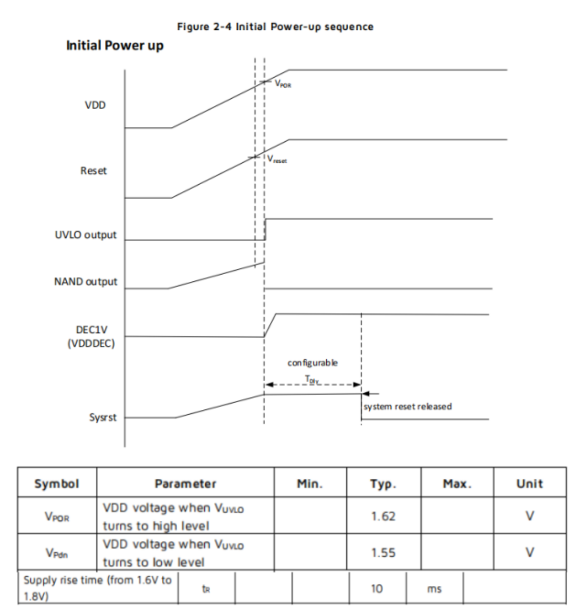

The TLSR8258 chip has requirements for the power-on sequence. During power-on, the system starts when the RST pin reaches 1.62V. At this time, VDD needs to reach 1.8V or above within 10ms. Since the RST pin has an RC circuit, when the bare module's RST reaches 1.62V, VDD has already far exceeded 1.8V. If the power driver connected to the TLSR8258 chip module has large capacitance charging/discharging, if the module voltage is not fully discharged below 0.6V, there is a risk of system crash when the module restarts. The module VDD_3.3V power pin requires a 1K dummy load to quickly release electrical energy. Please refer to the partial power driver circuit below:

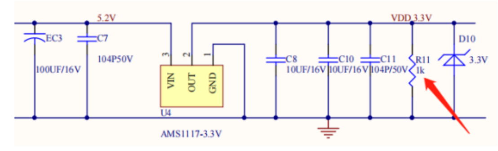

Antenna Information
--------

**Antenna Type**

BT7L uses an onboard PCB antenna.

**Reducing Antenna Interference**

To ensure optimal RF performance, it is recommended that the distance between the module antenna and other metal components be at least 15mm. Do not route traces or even pour copper on the user's PCB board in the antenna area to avoid affecting antenna performance. Layout key points: Ensure that there is no substrate dielectric directly below or above the printed antenna. Ensure that the area around the printed antenna is away from metal copper to maximize the antenna's radiation effect.

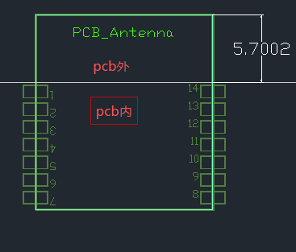

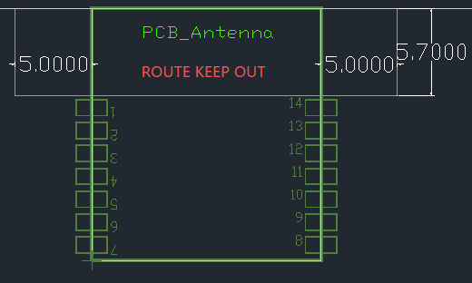

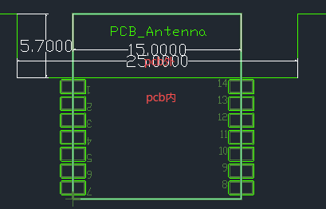

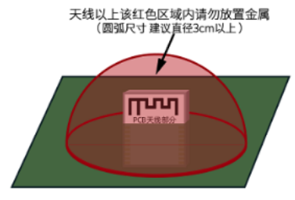

Package Information and Production Guide
------------------

Mechanical Dimensions and Bottom Pad Dimensions
~~~~~~~~~~~~~~~~~~~~~~

Front View

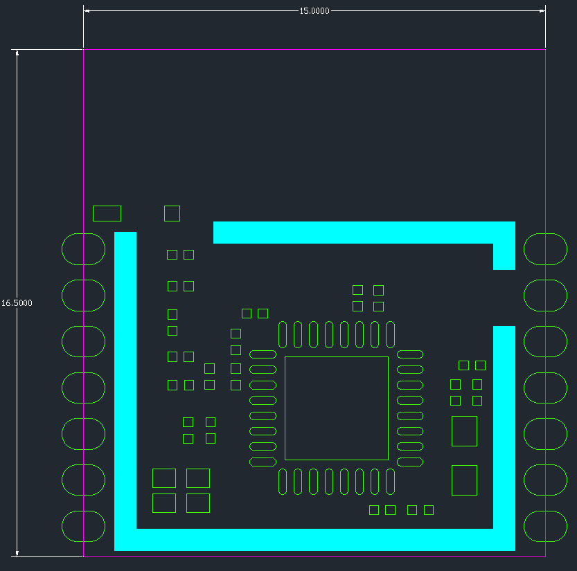

Side View

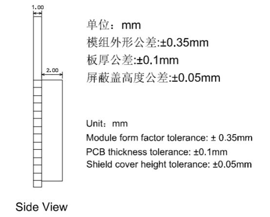

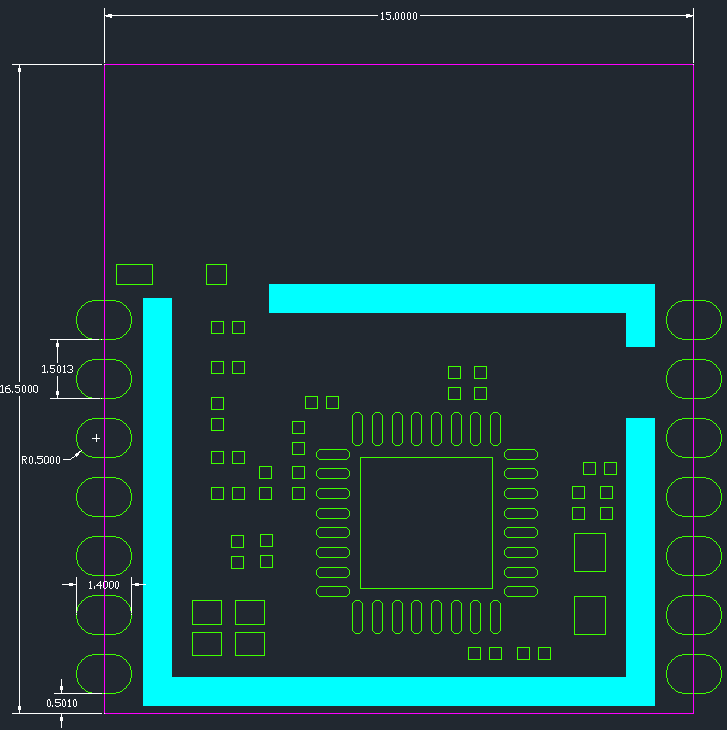

**Note**: The default module outline dimension tolerance is ±0.35mm, key dimension tolerance is ±0.1mm. If customers have specific requirements for key dimensions, please communicate and then clearly mark them in the specifications. In the above figure, the keepout area does not need solder paste, do not route traces.

Design Guidelines
--------

1.  Application Circuit

.. image:: ../../../image/MYZR-IoT系列/MYZR-MOD-BT7L/规格书12.png
   :alt: 规格书12.png
   :width: 100%

2.  Antenna Layout Requirements

Place the module at the edge of the main board. No metal components should be placed around the antenna. Keep away from high-frequency devices.

3.  Power Supply

(1)、  Recommended 3.3V voltage, peak current above 50mA

(2)、  It is recommended to use LDO for power supply; if using DC-DC, it is recommended to control ripple within 30mV.

(3)、  DC-DC power supply circuit is recommended to reserve a position for dynamic response capacitor, which can optimize output ripple when load changes significantly.

(4)、  It is recommended to add ESD components to the 3.3V power interface.

4.  PWM Dimming Design Description

For lamps that require dimming function, simply connect the PWM pin of the corresponding color to the control terminal of the subsequent drive circuit; PWM independently outputs a 100-level adjustable duty cycle digital signal, and the subsequent circuit can be voltage-driven or current-driven.

Connection Diagram

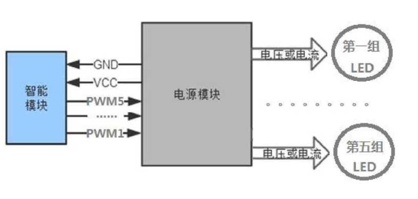

5.  LED Driver Reference Design

TB-04 module application only needs 3.3V power supply and simple drive circuit to realize smart light control. Taking MOS tube driving one channel of positive white light as an example, the design reference is shown in the figure below; CW_I is the PWM output pin for positive white light of the module, Q1 is MOS tube, WW is LED bead. The other 4 channels of LED drive circuit have the same design method as this channel.

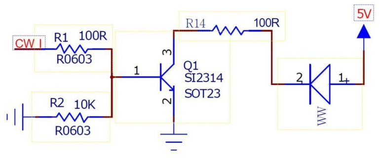

6.  Reflow Soldering Profile

.. image:: ../../../image/MYZR-IoT系列/MYZR-MOD-BT7L/规格书15.png
   :alt: 规格书15.png
   :width: 100%

Production Guide
--------

1.  Assembly Method

The factory's surface-mount packaged module is recommended to use SMT machine placement. After unpacking, it is recommended to complete welding within 24 hours.

If not fully used after unpacking, it is recommended to place in a drying cabinet with humidity not exceeding 10%RH, or re-vacuum packaged and the exposure time recorded. Total exposure time must not exceed 168 hours.

SMT equipment required:

*  Placement machine
*  SPI
*  Reflow soldering
*  Temperature profiler
*  AOI

Baking equipment required:
*  Cabinet baking oven
*  Anti-static high-temperature tray
*  Anti-static high-temperature gloves

2.  Factory module storage conditions are as follows:

*  Moisture barrier bags must be stored in an environment with temperature <40℃ and humidity <90%RH.

*  Products with dry packaging have a shelf life of 12 months from the date of packaging sealing.

*  The sealed package contains a humidity indicator card:

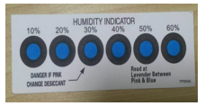

3.  Baking is required when the factory module may have been exposed to moisture:

*  Vacuum packaging bag is found damaged before unpacking.

*  No humidity indicator card is found in the package after unpacking.

*  If the humidity indicator card shows that 10% or more of the color ring turns pink after unpacking.

*  Total exposure time exceeds 168 hours after unpacking.

*  More than 12 months from the date of first sealed packaging.

4.  Baking parameters are as follows:

*  Baking temperature: Reel packaging 40℃, humidity less than or equal to 5%RH. Tray packaging 125℃, humidity less than or equal to 5%RH (high-temperature resistant tray, not plastic tray).

*  Baking time: Reel packaging 168 hours, tray packaging 12 hours.

*  Alarm temperature setting: Reel packaging 50℃, tray packaging 135℃.

*  After cooling to below 36℃ under natural conditions, production can proceed.

*  If the exposure time after baking exceeds 168 hours and the modules are not fully used, please bake again.

*  If the exposure time exceeds 168 hours without baking, reflow soldering process is not recommended for this batch of modules. As the module is a Level 3 moisture-sensitive device, exceeding the allowed exposure time may cause moisture absorption, which may lead to device failure or poor soldering during high-temperature soldering.

5.  During the entire production process, please provide ESD protection for the module.

6.  To ensure product qualification rate, it is recommended to use SPI and AOI test equipment to monitor solder paste printing and mounting quality

Recommended Temperature Profile
------------

Please set the temperature according to the reflow soldering profile diagram. Peak temperature is 245℃. The reflow soldering temperature curve is shown in the figure below:

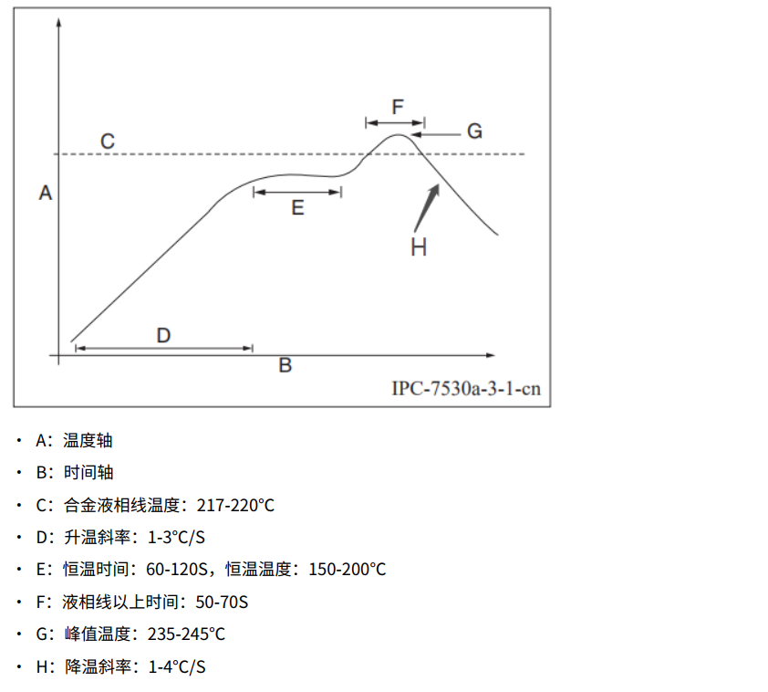

Note: The above recommended profile is based on SAC305 alloy solder paste as an example. For other alloy solder pastes, please set the furnace temperature according to the solder paste specifications recommended profile.

Module Storage Precautions
------------------

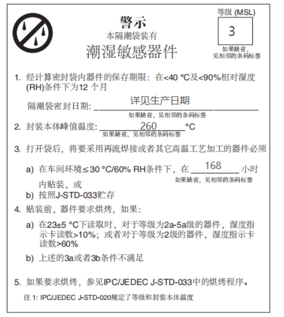

• If the exposure time after baking exceeds 168 hours and the modules are not fully used, please bake again.

• If the exposure time exceeds 168 hours without baking, wave soldering process is not recommended for this batch of modules. As the module is a Level 3 moisture-sensitive device, exceeding the allowed exposure time may cause moisture absorption, which may lead to device failure or poor soldering during high-temperature soldering.

• During the entire production process, please provide ESD protection for the module.

• To ensure product qualification rate, it is recommended to use SPI and AOI test equipment to monitor solder paste printing and mounting quality.

Ordering Options
--------

.. raw:: html

   

+----------------+------------------------+
|     Model      |      Description       |
+================+========================+
| MYZR-BT7L-ANT  | Onboard PCB antenna    |
+----------------+------------------------+
| MYZR-BT7L-IPEX | Onboard IPEX connector |
+----------------+------------------------+