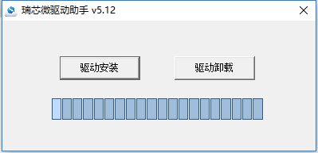
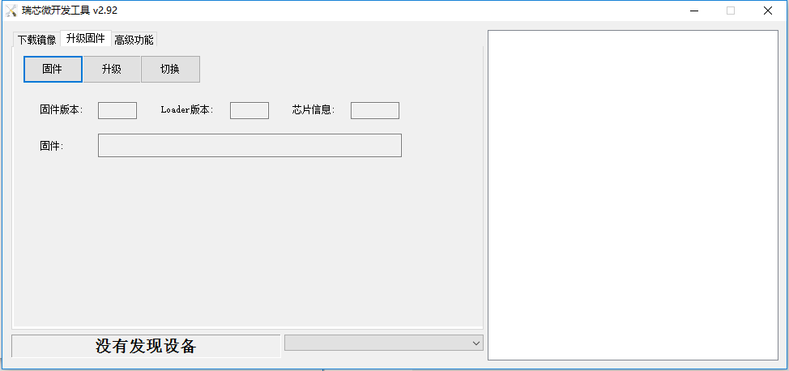
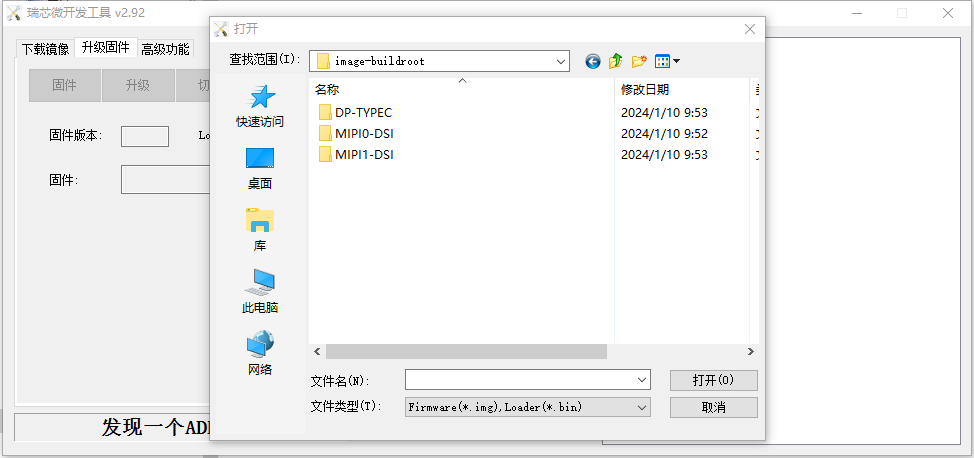
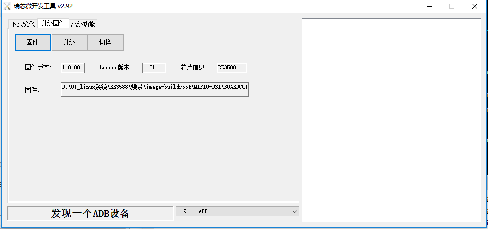
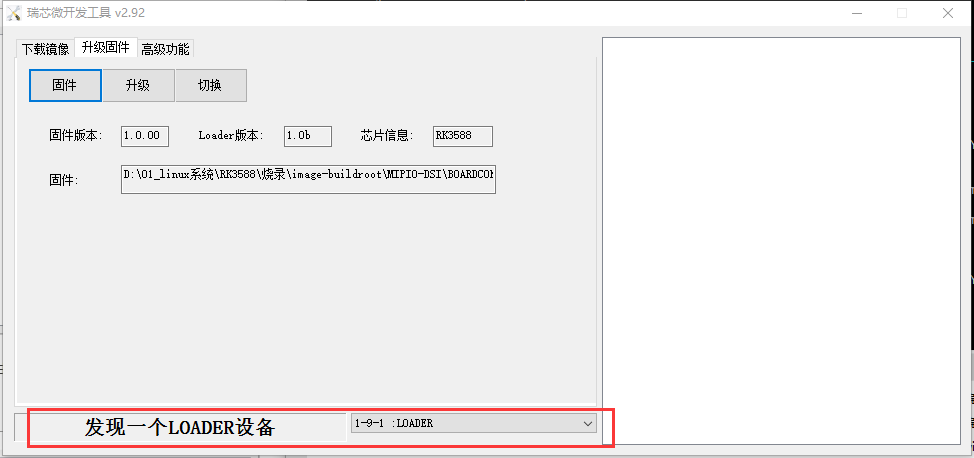
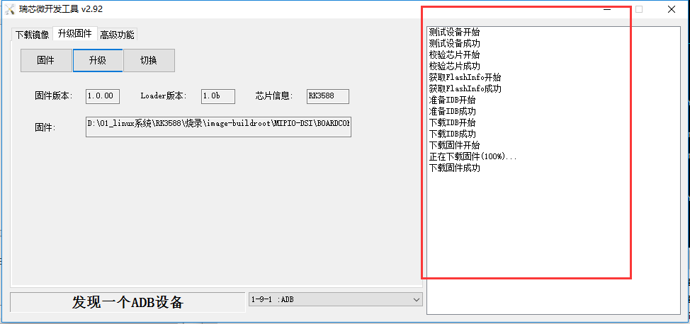

刷机手册
========

下载文件
--------

　　打开网盘,下载 “01_烧录” 目录里面的文件

安装DriverAssitant驱动
----------------------

- 解压DriverAssitant_v5.12.zip，后进入DriverAssitant_v5.12文件夹

- 双击DriverInstall.exe程序进行驱动安装

使用RKDevTool进行刷机
----------

- 解压RKDevTool_Release_v2.92.zip，后进入RKDevTool_Release_v2.92文件夹

- 双击RKDevTool.exe，打开程序

- 点击进入“升级固件”界面

- 点击“固件”按钮，然后选择相应的img镜像文件，镜像文件在刚才下载的image-buildroot文件下，里面分为DP-TYPEC、MIPI0-DSI和MIPI1-DSI。
   DP-TYPEC里面的镜像可显示：HDMI0 + HDMI1 +  MIPI0-DSI + TYPEC 接口显示屏；

   MIPI0-DSI里面的镜像可显示：HDMI0 + HDMI1 +  MIPI0-DSI + VGA  接口显示屏；

   MIPI1-DSI里面的镜像可显示：HDMI0 + HDMI1 +  MIPI1-DSI + VGA  接口显示屏；

- 开发板接上烧录线，按住开发板SW2按键，再给开发板上电，上电3秒左右可看到开发板进入了download模式

- 点击“升级”按钮进行刷机，刷成功右边显示成功字符

- 烧录完成后，开发板系统会自动重启。

::

   --------------------------------------------------------------------------------
   * 珠海明远智睿科技有限公司  
   * ZhuHai MYZR Technology CO.,LTD.
   * Latest Update: 2024/1/10  
   * Supporter: Kuangwh
   --------------------------------------------------------------------------------
