底板硬件手册
============

接口概览
--------

正面图
~~~~~~

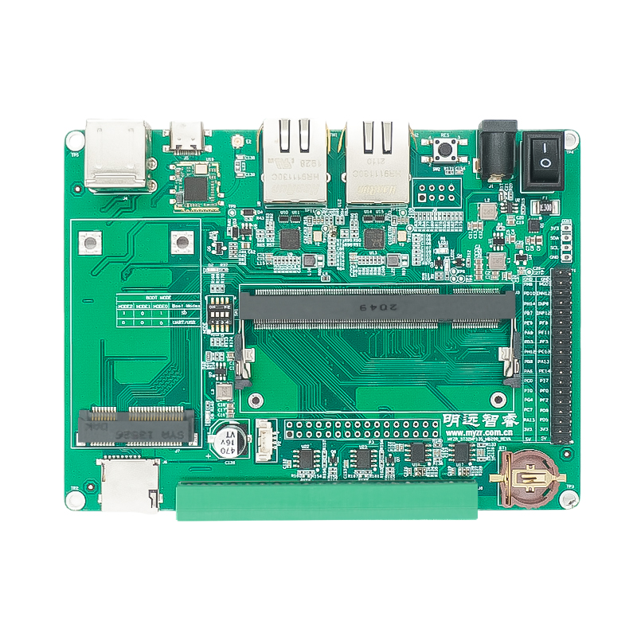

反面图
~~~~~~

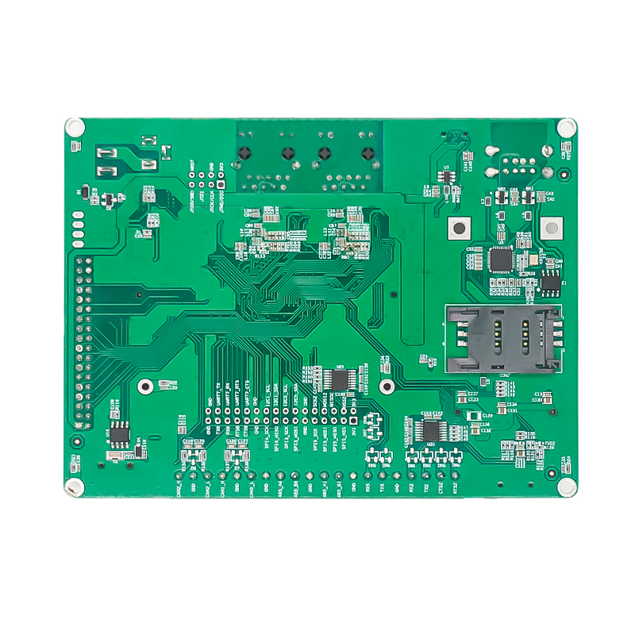

正面标识图
~~~~~~~~~~~~

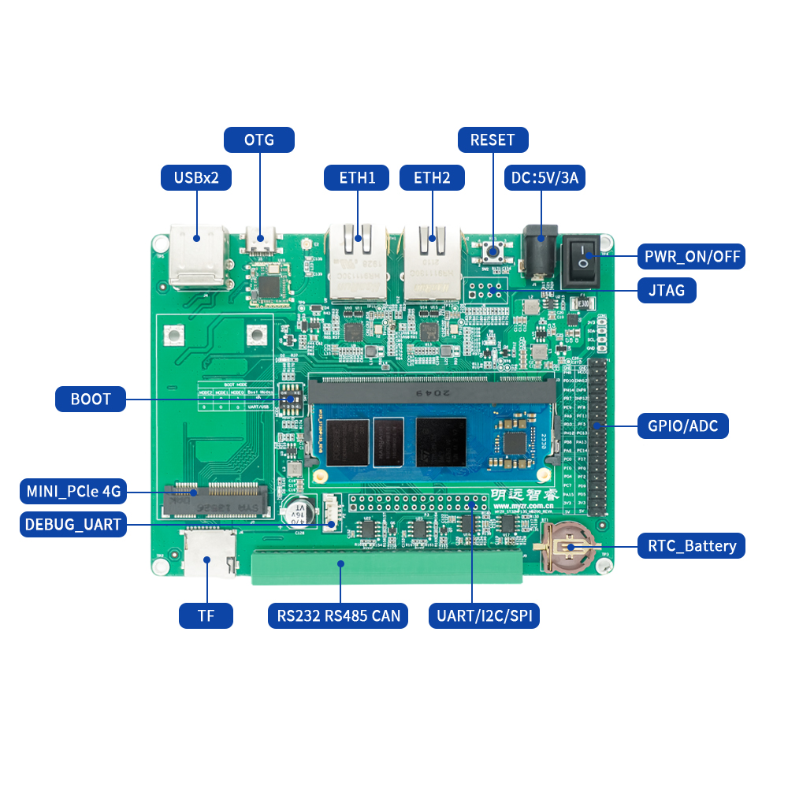

接口功能
--------

RTC
~~~

丝印:U25 接口属性：I2C通信的实时时钟

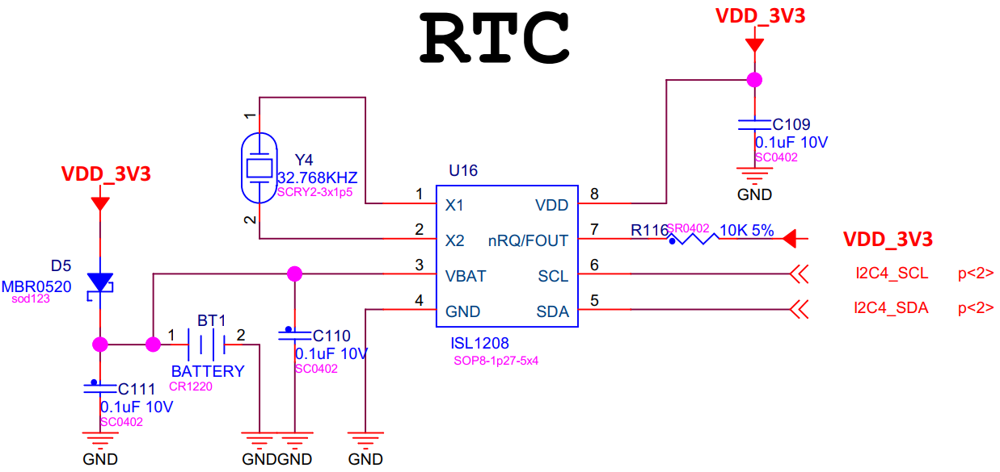

WIFI
~~~~

丝印:U21 模块型号：UM12BS

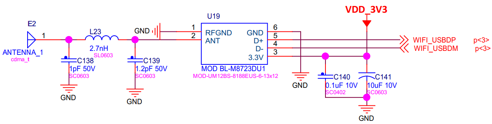

SD
~~

丝印:J10 接口属性：标准SD卡座

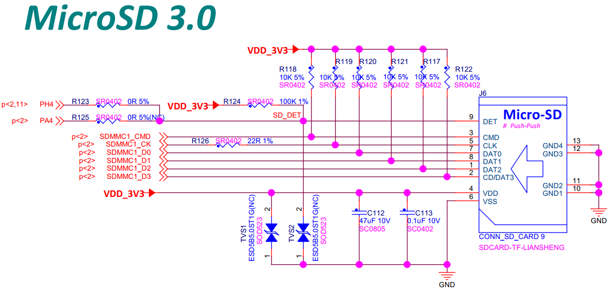

USB
~~~

丝印:J3

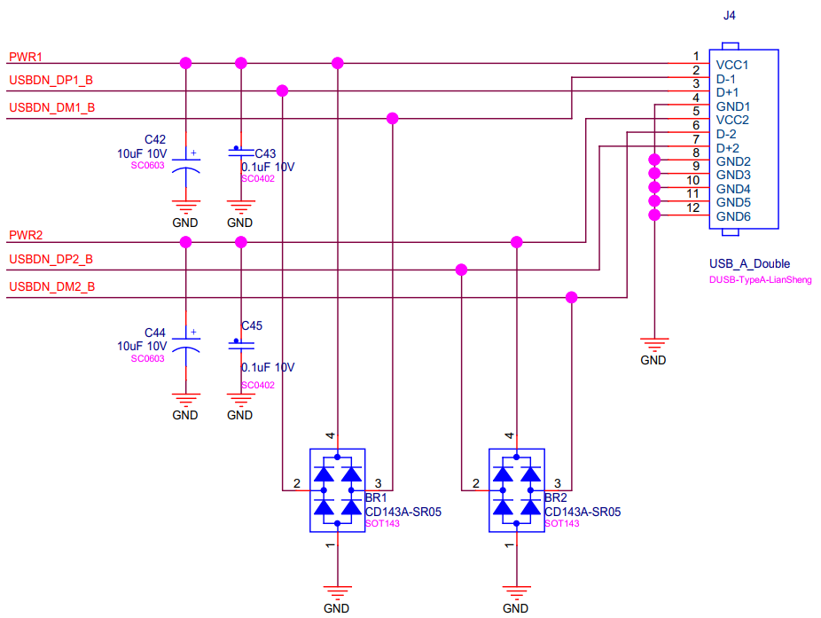

OTG
~~~

丝印:J5

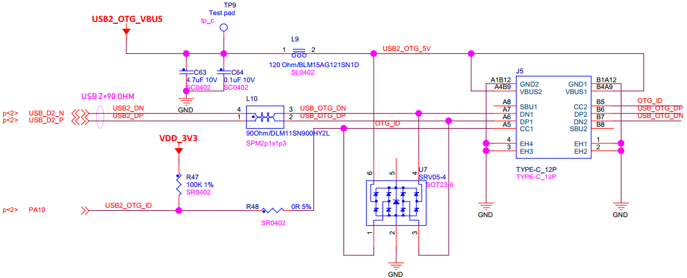

Ethernet
~~~~

丝印：U8,U12

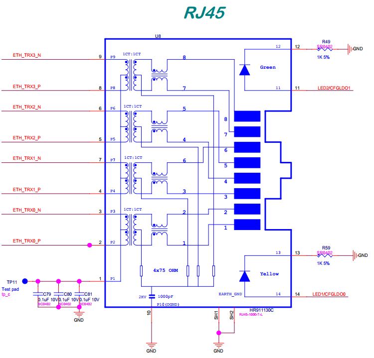

调试串口
~~~~~~~~

丝印：P2

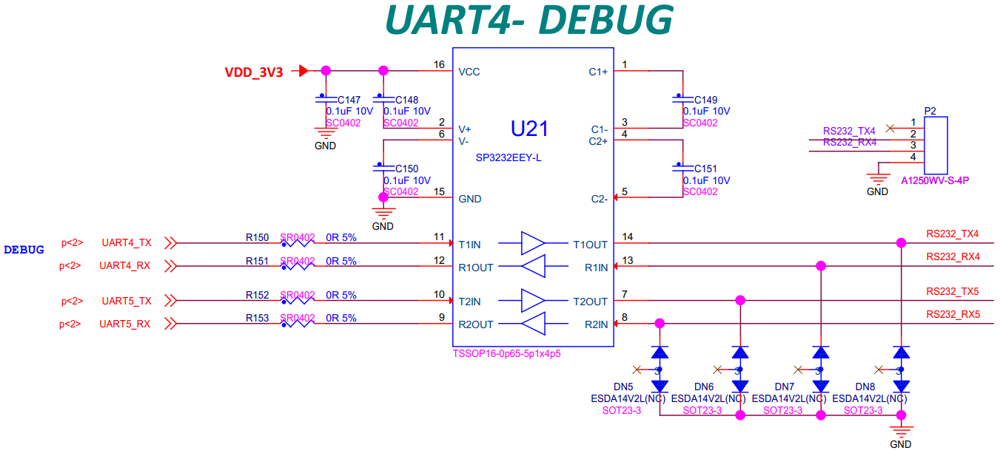

主电源开关
~~~~~~~~~~

丝印：J1

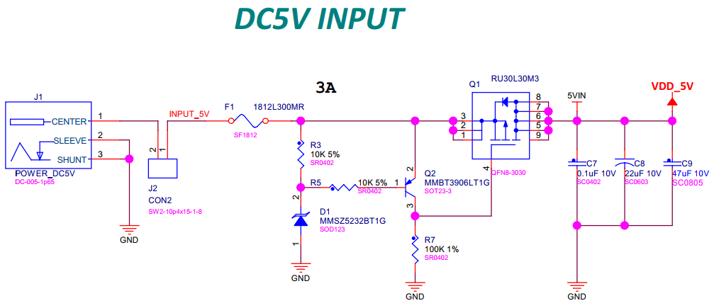

RS232,RS485和CAN
~~~~~~~~~~~~~~~~~~~~~~~~~~

丝印：J8

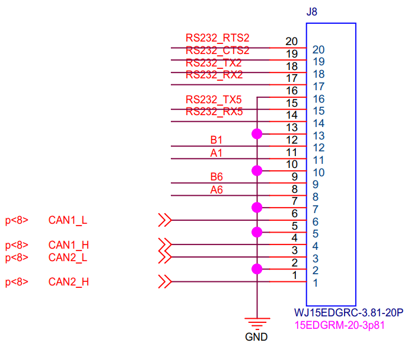

JTAG
~~~~

丝印：J9

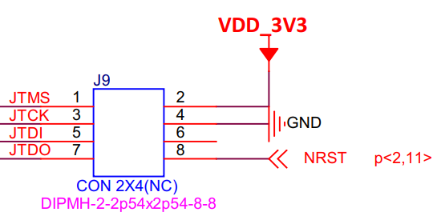

RESET
~~~~~

丝印：SW1和SW2

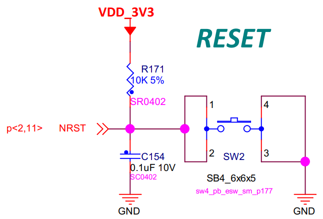

BOOT
~~~~~

丝印：SW1

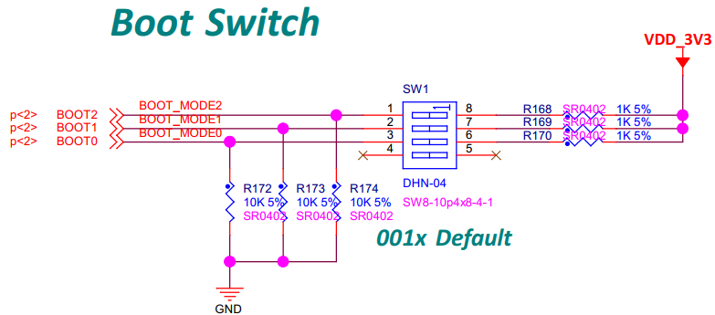

扩展IO接口
~~~~~~~~~~

丝印：P1,P3

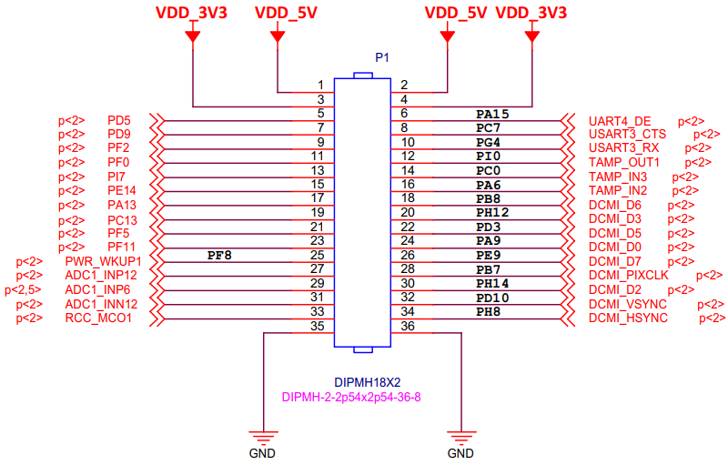

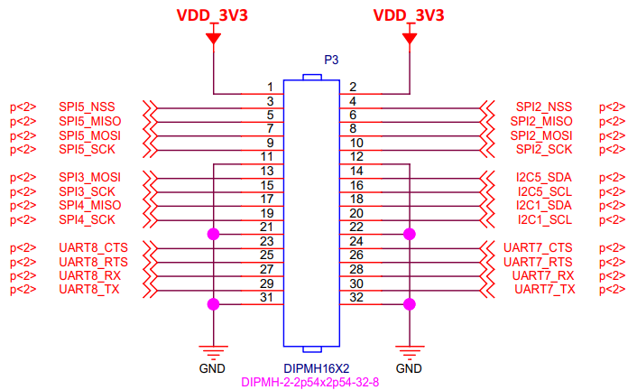

====== ========== ====== ===========
引脚   信号       引脚   信号
====== ========== ====== ===========
P1:1	 VDD_5V	   P1:2	 VDD_5V
P1:3	 VDD_3V3    P1:4	 VDD_3V3
P1:5   PD5        P1:6   PA15
P1:7   PD9        P1:8   PC7
P1:9   PF2        P1:10  PG4
P1:11  PF0        P1:12  PI0
P1:13  PI7        P1:14  PC0
P1:15  PE14       P1:16  PA6
P1:17  PA13       P1:18  PB8
P1:19  PC13       P1:20  PH12
P1:21  PF5        P1:22  PD3
P1:23  PF11       P1:24  PA9
P1:25  PF8        P1:26  PE9
P1:27  ADC1_INP12 P1:28  PB7
P1:29  ADC1_INP6  P1:30  PH14
P1:31  ADC1_INN12 P1:32  PD10
P1:33  RCC_MCO1   P1:34  PH8
P1:35  GND        P1:36  GND
P3:1   VDD_3V3    P3:2   VDD_3V3
P3:3   SPI5_NSS   P3:4   SPI2_NSS
P3:5   SPI5_MISO  P3:6   SPI2_MISO
P3:7   SPI5_MOSI  P3:8   SPI2_MOSI
P3:9   SPI5_SCK   P3:10  SPI2_SCK
P3:11  GND        P3:12  GND
P3:13  SPI3_MOSI  P3:14  I2C5_SDA
P3:15  SPI3_SCK   P3:16  I2C5_SCL
P3:17  SPI4_MISO  P3:18  I2C1_SDA
P3:19  SPI4_SCK   P3:20  I2C1_SCL
P3:21  GND        P3:22  GND
P3:23  UART8_CTS  P3:24  UART7_CTS
P3:25  UART8_RTS  P3:26  UART7_RTS
P3:27  UART8_RX   P3:28  UART7_RX
P3:29  UART8_TX   P3:30  UART7_TX
P3:31  GND        P3:32  GND
====== ========== ====== ===========

--------------------------------------------------------------------------------

::

   --------------------------------------------------------------------------------
   * 珠海明远智睿科技有限公司  
   * ZhuHai MYZR Technology CO.,LTD.
   * Latest Update: 2023/9/27  
   * Supporter: Kuangwh
   --------------------------------------------------------------------------------
