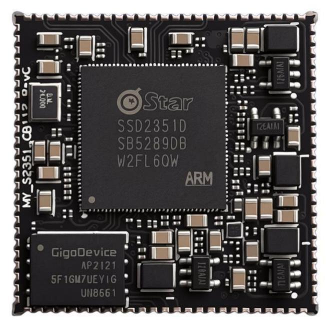
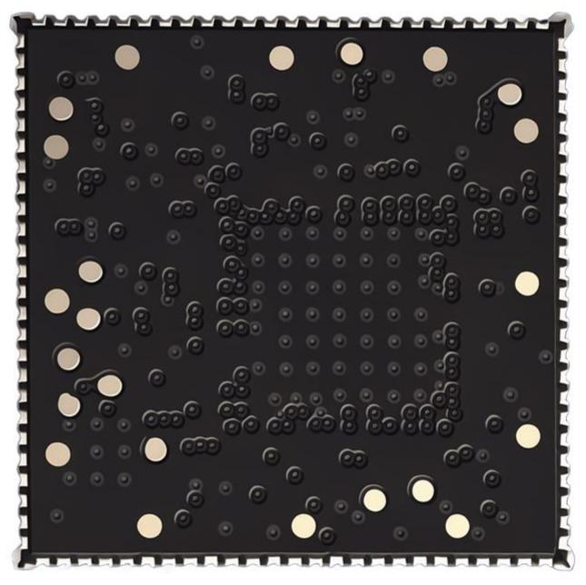
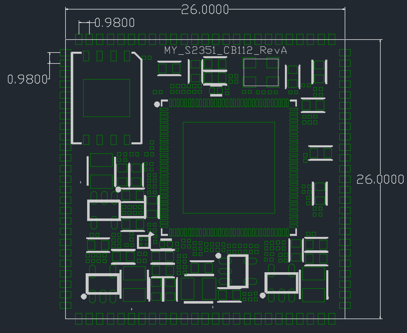
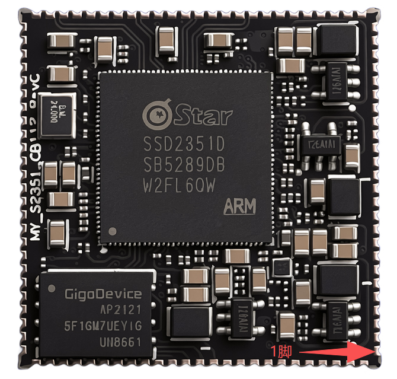
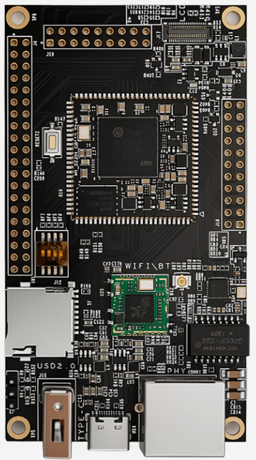
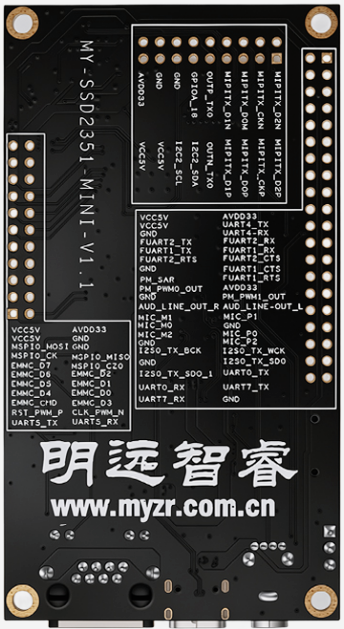
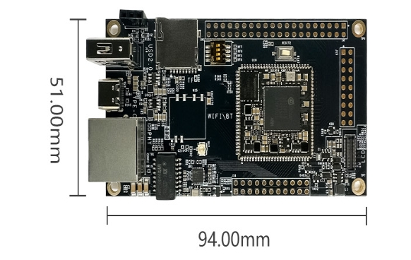
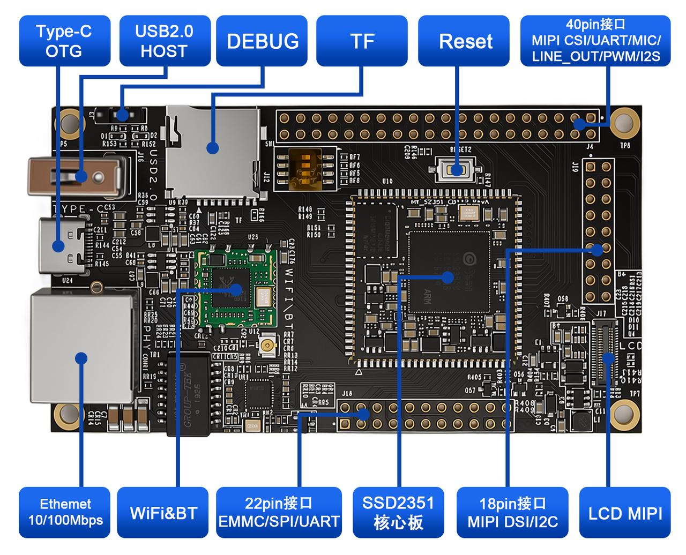

.. raw:: html

   

产品介绍
=====================

核心板介绍
-----------

**硬件资源**

MYZR-SSD2351-CB112核心板基于SSD2351处理器设计，集成处理器运行所需的核心电路，包括DDR内存、Flash存储、电源管理及时钟系统等关键器件，可直接作为产品主控模块使用。

处理器内部集成：

-  四核 ARM Cortex-A35 CPU 
-  IVE 图像处理引擎 
-  IPU 智能处理单元 
-  音频处理器
-  视频输入输出模块
-  DDR 控制器
-  Ethernet MAC
-  安全加密引擎
-  丰富的片上外设资源

核心板规格
-----------

.. raw:: html

   

.. raw:: html

   

+------+----------------+---------------------------------------------------+
| 序号 | 参数           | .. centered :: 值                                 |
+======+================+===================================================+
| 1    | 型号           | MYZR-SSD2351-CB112                                |
+------+----------------+---------------------------------------------------+
| 2    | 尺寸           | 26mm × 26mm                                       |
+------+----------------+---------------------------------------------------+
| 3    | PCB            | 2层，沉金，邮票孔112Pin                           |
+------+----------------+---------------------------------------------------+
| 4    | 内存           | DDR3/DDR3L 128/256MB                              |
+------+----------------+---------------------------------------------------+
| 5    | 存储           | SPI Flash / NAND 128/256/512MB                    |
+------+----------------+---------------------------------------------------+
| 6    | 启动方式       | SPI NOR / NAND、SD、eMMC、USB、UART               |
+------+----------------+---------------------------------------------------+

**核心板正反图**

.. raw:: html

    

.. raw:: html

    

**核心板尺寸图**

核心板尺寸机械图【26mm × 26mm】

**核心板命名规则及可选配置**

.. raw:: html

   

.. raw:: html

   

+---------------------------+-------------------------------------------------------------------------------------------+
|     核心板型号            | 命名规则                                                                                  |
+===========================+================+====================================+==================+==================+
| MYZR-SSD2351-CB112        | MYZR           | SSD2351                            | CB/EK            | 112              |
+                           +----------------+------------------------------------+------------------+------------------+
|                           | 明远智睿       |MPU主控型号                         | 封装             | 核心板引脚数     |
+                           +----------------+------------------------------------+------------------+------------------+
|                           |                |SSD2351D(内置内存128MB)             |                  |                  |
+                           +----------------+------------------------------------+------------------+------------------+
|                           |                |SSD2351Q(内置内存256MB)             |                  |                  |
+                           +----------------+------------------------------------+------------------+------------------+
|                           |                                           **可选配置**                                    | 
+                           +-------------------------------------------------------------------------------------------+
|                           |内存：CPU内置内存128/256MByte                                                              |
+                           +-------------------------------------------------------------------------------------------+
|                           |存储：SPI NAND FLASH 128/256/512MByte                                                      |
+                           +-------------------------------------------------------------------------------------------+
|                           |例：MYZR-SSD2351-CB112-128M-128M                                                           |
+---------------------------+-------------------------------------------------------------------------------------------+

**接口资源**

注：表中参数为硬件设计或 CPU 理论值

.. raw:: html

   

.. raw:: html

   

+--------------+-----------+------------------+--------------------------------------------------------------------------+
| 接口分类     | 接口规格  | 最大可配置接口数 | 描述                                                                     |
+==============+===========+==================+==========================================================================+
| 通讯接口     | Ethernet  | 2                | 2路10/100Mbps以太网，内置10/100M以太网物理层，支持1个RMII连接外部PHY     |
+              +-----------+------------------+--------------------------------------------------------------------------+
|              | USB       | 2                | 2路USB2.0 HOST                                                           |
+              +-----------+------------------+--------------------------------------------------------------------------+
|              | UART      | 10               | 最多6个通用UART和4个带流控制的快速UART                                   |
+              +-----------+------------------+--------------------------------------------------------------------------+
|              | I2C       | 6                | 支持6路I2C接口                                                           |
+              +-----------+------------------+--------------------------------------------------------------------------+
|              | SPI       | 6                | 5路SPI控制器                                                             |
+              +-----------+------------------+--------------------------------------------------------------------------+
|              | ADC       | 3                | 支持3路ADC接口                                                           |
+              +-----------+------------------+--------------------------------------------------------------------------+
|              | PWM       | 13               | 支持8路PWM输入和13路PWM输出（与GPIO共享）                                |
+              +-----------+------------------+--------------------------------------------------------------------------+
|              | I2S       | 3                | 支持3路I2S接口                                                           |
+--------------+-----------+------------------+--------------------------------------------------------------------------+
| 外部存储接口 | SDIO      | 1                | 1路SDIO                                                                  |
+--------------+-----------+------------------+--------------------------------------------------------------------------+
| 多媒体       | MIPI_DSI  | 1                | 支持1路4lane DSI_MIPI接口，最大分辨率2560×1600@60fps                     |
+              +-----------+------------------+--------------------------------------------------------------------------+
|              | MIPI_CSI  | 1                | 支持1路2lane CSI_MIPI接口，最大支持4K(3840×2160)@30fps                   |
+              +-----------+------------------+--------------------------------------------------------------------------+
|              | RGB       | 1                | 支持1路RGB接口，最大分辨率1280×800@60fps                                 |
+--------------+-----------+------------------+--------------------------------------------------------------------------+
| 系统版本     | Linux 6.1 内核版本                                                                                      |
+--------------+---------------------------------------------------------------------------------------------------------+
| 界面         | LVGL/QT5.15                                                                                             |
+--------------+---------------------------------------------------------------------------------------------------------+

**供电模式**

.. raw:: html

   

.. raw:: html

   

+----------+----------+--------+--------+--------+------+------------+
| 功能     | 引脚标号 |              规格               | 说明       |
|          |          +--------+--------+--------+------+            |
|          |          | 最小   | 典型   | 最大   | 单位 |            |
+==========+==========+========+========+========+======+============+
| 电源供电 | 5V_core  | 3.14   | 3.3    | 3.46   | V    | 由底板供电 |
+----------+----------+--------+--------+--------+------+------------+

**工作环境**

.. raw:: html

   

.. raw:: html

   

+----------+--------+--------+--------+-------+-------------------------+
| 参数     |             规格                 |     说明                |     
|          +--------+--------+--------+-------+                         |
|          | 最小   | 典型   | 最大   | 单位  |                         |
+==========+========+========+========+=======+=========================+
| 工作温度 | -20    | 25     | 70     |  ℃    | 实测-20至70℃运行正常    |
+----------+--------+--------+--------+-------+-------------------------+

**启动配置**

核心板支持多种启动介质，启动模式由开发板BOOT配置电路进行选择。

支持启动方式：

-  SPI NAND Flash 

用户可根据实际应用需求选择对应的启动介质。

**是否支持快启动及快启时间**

.. raw:: html

   

.. raw:: html

   

+----------+----------+----------------+
| 项目     | 支持情况 | 时间           |
+==========+==========+================+
| SSD2351  | 支持     | 快启动QT界面4S |
+----------+----------+----------------+

**核心板/开发板功耗**

.. raw:: html

   

.. raw:: html

   

+-----------------+----------+----------+----------+----------+
| 类型            | 测试项目                                  |
+                 +----------+----------+----------+----------+
|                 | 待机电流            |  满载功耗           |
+=================+==========+==========+==========+==========+
| SSD2351核心板   | 100mA    | 0.5W     | 500mA    | 2.5W     |
+-----------------+----------+----------+----------+----------+
| SSD2351开发板   | 200mA    | 1W       | 1000mA   | 5W       |
+-----------------+----------+----------+----------+----------+
|注: 上面数值为电流值（mA），电压为5.0V，满载为全核跑满       |
+-----------------+----------+----------+----------+----------+

**核心板贴片/安装示意图**

**信号定义**

核心板引脚定义

.. raw:: html

   

.. raw:: html

   

================================== ==================================== ============================= ==================
 Pin NO.                            Pin Name                             功能描述                        管脚电压
================================== ==================================== ============================= ==================
 1                                 GPIOE_07_UART5_TX                    UART5_TX                       3.3V
 2                                 GPIOE_06_UART5_RX                    UART5_RX                       3.3V
 3                                 GPIOE_09_I2C2_SCL                    I2C2_SCL                       3.3V
 4                                 GPIOE_12_ETH_RXD0                    RXD0                           3.3V
 5                                 GPIOE_10_I2C2_SDA                    I2C2_SDA                       3.3V
 6                                 GPIOE_11_ETH_COL                     COL                            3.3V
 7                                 GPIOE_13_ETH_RXD1                    RXD1                           3.3V
 8                                 GPIOE_14_ETH_TX_CLK                  TX_CLK                         3.3V
 9                                 GPIOE_15_ETH_TXD0                    TXD0                           3.3V
 10                                GPIOE_16_ETH_TXD1                    TXD1                           3.3V
 11                                GPIOE_17_ETH_TX_EN                   TX_EN                          3.3V
 12                                GPIOE_18_ETH_MDIO                    MDIO                           3.3V
 13                                GPIOE_19_ETH_MDC                     MDC                            3.3V
 14                                EMMC_RST_PWM_P4                      EMMC_RST_PWM_P4                3.3V
 15                                EMMC_CLK_PWM_N(4)                    EMMC_CLK_PWM_N(4)              3.3V
 16                                EMMC_DS_GPIO                         EMMC_DS_GPIO                   3.3V
 17                                EMMC_CMD_GPIO                        EMMC_CMD_GPIO                  3.3V
 18                                EMMC_D3_GPIO                         EMMC_D3_GPIO                   3.3V
 19                                EMMC_D4_PWM_OUT(14)                  EMMC_D4_PWM_OUT(14)            3.3V
 20                                EMMC_D0_GPIO                         EMMC_D0_GPIO                   3.3V
 21                                EMMC_D5_PWM_OUT(15)                  EMMC_D5_PWM_OUT(15)            3.3V
 22                                EMMC_D1_GPIO                         EMMC_D1_GPIO                   3.3V
 23                                EMMC_D6_PWM_OUT(16)                  EMMC_D6_PWM_OUT(16)            3.3V
 24                                EMMC_D2_PWM_P(5)                     EMMC_D2_PWM_P(5)               3.3V
 25                                EMMC_D7_PWM_N(5)                     EMMC_D7_PWM_N(5)               3.3V
 26                                GPIOA_12_MSPI0_CZ0                   SPI_CZ                         3.3V
 27                                GPIOA_13_MSPI0_CK                    SPI_CLK                        3.3V
 28                                GPIOA_15_MSPI0_MISO                  GPIOA_15_MSPI0_MISO            3.3V
 29                                GPIOA_14_MSPI0_MOSI                  GPIOA_14_MSPI0_MOSI            3.3V
 30                                GPIOA_17_UART4_TX                    UART4_TX                       3.3V
 31                                GPIOA_16_UART4_RX                    UART4_RX                       3.3V
 32                                GPIOA_18_GPIO                        GPIOA_18_GPIO                  3.3V
 33                                GPIOA_19_GPIO                        GPIOA_19_GPIO                  3.3V
 34                                OUTP_RX0_CH2_FUART2_RX               UART2_RX                       3.3V
 35                                OUTN_RX0_CH2_FUART2_TX               UART2_TX                       3.3V
 36                                OUTP_RX0_CH0_FUART1_TX               UART1_TX                       3.3V
 37                                OUTN_RX0_CH0_FUART1_RX               UART1_RX                       3.3V
 38                                OUTP_RX0_CH3_FUART2_CTS              UART2_RX                       3.3V
 39                                OUTN_RX0_CH3_FUART2_RTS              UART2_RX                       3.3V
 40                                OUTP_RX0_CH1_FUART1_CTS              UART1_RX                       3.3V
 41                                OUTN_RX0_CH1_FUART1_RTS              UART1_RX                       3.3V
 42                                OUTP_TX0_CH1_MIPITX_D1P              OUTP_TX0_CH1_MIPITX_D1P        1.8V
 43                                OUTN_TX0_CH1_MIPITX_D1N              OUTN_TX0_CH1_MIPITX_D1N        1.8V
 44                                OUTP_TX0_CH0_MIPITX_D0P              OUTP_TX0_CH0_MIPITX_D0P        1.8V
 45                                OUTN_TX0_CH0_MIPITX_D0N              OUTN_TX0_CH0_MIPITX_D0N        1.8V
 46                                OUTP_TX0_CH2_MIPITX_CKP              OUTP_TX0_CH2_MIPITX_CKP        1.8V
 47                                OUTN_TX0_CH2_MIPITX_CKN              OUTN_TX0_CH2_MIPITX_CKN        1.8V
 48                                OUTP_TX0_CH3_MIPITX_D2P              OUTP_TX0_CH3_MIPITX_D2P        1.8V
 49                                OUTN_TX0_CH3_MIPITX_D2N              OUTN_TX0_CH3_MIPITX_D2N        1.8V
 50                                GND                                  GND                            0V
 51                                OUTP_TX0_CH4_GPIO                    OUTP_TX0_CH4_GPIO              1.8V
 52                                OUTN_TX0_CH4_GPIO                    OUTN_TX0_CH4_GPIO              1.8V
 53                                PM_SAR_GPIO                          SAR_GPIO                       3.3V
 54                                PM_PWM0_OUT                          PWMPM_PWM0_OUT_OUT             3.3V
 55                                PM_PWM1_OUT                          PWMPM_PWM1_OUT_OUT             3.3V
 56                                PM_UART1_RX                          UART1_RX                       3.3V
 57                                PM_UART1_TX                          UART1_TX                       3.3V
 58                                PM_RESET                             RESET                          3.3V
 59                                AUD_LINE_OUT_L                       AUD_LINE_OUT_L                 3.3V
 60                                AUD_LINE_OUT_R                       AUD_LINE_OUT_R                 3.3V
 61                                GND                                  GND                            0V
 62                                MIC_M1                               MIC_M1                         1.8V
 63                                MIC_P1                               MIC_P1                         1.8V
 64                                GND                                  GND                            0V
 65                                MIC_M0                               MIC_M0                         1.8V
 66                                MIC_P0                               MIC_P0                         1.8V
 67                                GND                                  GND                            1.8V
 68                                MIC_M2                               MIC_M2                         1.8V
 69                                MIC_P2                               MIC_P2                         1.8V
 70                                GND                                  GND                            0V
 71                                GPIOD_05_I2S0_TX_WCK                 TX_WCK                         3.3V
 72                                GPIOD_04_I2S0_TX_BCK                 TX_BCK                         3.3V
 73                                GPIOD_03_I2S0_TX_SDO                 TX_SDO                         3.3V
 74                                GPIOD_00_I2S0_TX_SDO_1               TX_SDO_1                       3.3V
 75                                UART0_TX                             UART0_TX                       3.3V
 76                                UART0_RX                             UART0_RX                       3.3V
 77                                ADC_PWM_OUT01_UART7_TX               UART7_TX                       3.3V
 78                                ADC_PWM_OUT00_UART7_RX               UART7_RX                       3.3V
 79                                GND                                  GND                            3.3V
 80                                DM_USB2_P1                           DM_USB2_P1                     3.3V
 81                                DP_USB2_P1                           DP_USB2_P1                     3.3V
 82                                GND                                  GND                            0V
 83                                DP_USB2_P0                           DP_USB2_P0                     3.3V
 84                                DM_USB2_P0                           DM_USB2_P0                     3.3V
 85                                GND                                  GND                            0V
 86                                SPI_DO                               SPI_DO                         3.3V
 87                                SPI_HLD                              SPI_HLD                        3.3V
 88                                SPI_CK                               SPI_CLK                        3.3V
 89                                SPI_DI                               SPI_DI                         3.3V
 90                                GND                                  GND                            0V
 91                                GND                                  GND                            0V
 92                                GND                                  GND                            0V
 93                                VCC3V3_CORE                          VCC3V3_CORE                    3.3V
 94                                GND                                  GND                            0V
 95                                GPIOE_01_SD_D[0]                     D[0]                           3.3V
 96                                GPIOE_00_SD_D[1]                     D[1]                           3.3V
 97                                GPIOE_03_SD_CMD                      CMD                            3.3V
 98                                GPIOE_02_SD_CLK                      CLK                            3.3V
 99                                GPIOE_05_SD_D[2]                     D[2]                           3.3V
 100                               GPIOE_04_SD_D[3]                     D[3]                           3.3V
 101                               GND                                  GND                            0V
 102                               GND                                  GND                            0V
 103                               GND                                  GND                            0V
 104                               GND                                  GND                            0V
 105                               GND                                  GND                            0V
 106                               GND                                  GND                            0V
 107                               GND                                  GND                            0V
 108                               GND                                  GND                            0V
 109                               GND                                  GND                            0V
 110                               GND                                  GND                            0V
 111                               GND                                  GND                            0V
 112                               GND                                  GND                            0V
================================== ==================================== ============================= ==================

**备注**

-  本手册中所列处理器参数来源于SSD2351芯片硬件规格。
-  实际功能及性能以最终量产产品和软件版本为准。
-  产品规格如有变更，恕不另行通知。

开发板介绍
-----------

**开发板正反图片**

.. raw:: html

    

.. raw:: html

    

**开发板尺寸机械图**

**开发板接口图**

明远智睿MYZR-SSD2351-EK112开发平台采用邮票孔核心板+底板结构，名字中的112指核心板管脚数非CPU后缀，开发板主要接口如下图所示：

**开发板基础参数**

.. raw:: html

   

.. raw:: html

   

====  ==============  ==========================
序号  项目             规格
====  ==============  ==========================
1     型号             MYZR-SSD2351-EK112
2     PCB尺寸          94mm × 51mm
3     PCB层数          2层
4     PCB厚度          1.6mm
5     PCB颜色          黑色
6     核心板接口       112Pin 邮票孔接口
====  ==============  ==========================

**开发板标配及可选配件**

.. raw:: html

   

.. raw:: html

   

+--------------------+----------------------------------------+----------------------------------------+
| 型号               | 开发板标配                                                                      |
+====================+========================================+========================================+
| MYZR-SSD2351-EK112 | TYPE-C下载线                           | TTL转USB模块x1                         |
|                    +----------------------------------------+----------------------------------------+
|                    | 5V/2A电源                              | 赠品                                   |
|                    +----------------------------------------+----------------------------------------+
|                    | **选配**                                                                        |
|                    +----------------------------------------+----------------------------------------+
|                    | 电容触摸屏幕（5寸MIPI 800*480）、8723DU模块【WiFi/BT】                          | 
+--------------------+----------------------------------------+----------------------------------------+
开发板搭配MYZR-SSD2351-CB112核心板使用，集成开发调试所需的全部常用接口，方便用户进行系统开发与功能验证。

**开发板资源**

.. raw:: html

   

.. raw:: html

   

====  ==============  ================================================  =====================  ========
序号  接口             功能                                              接口形式                丝印
====  ==============  ================================================  =====================  ========
1     Type-C           电源输入/系统升级OTG                              Type-C                 U24
2     Ethernet         Ethernet 10/100Mbps                               RJ45                   CONR1
3     DEBUG UART       调试串口                                          PH1.25排母(3针)        J3
4     40pin            MIPI CSI/UART/MIC/LINE_OUT/PWM/I2S                2.54排针               J4
5     18pin            MIPI DSI/I2C                                      2.54排针               J19
6     22pin            EMMC/SPI/UART                                     2.54排针               J18
7     TF               TF卡                                              标准TF卡自弹式卡座     J12
8     USB              USB2.0 HOST                                       USB_A                  J16
9     LCD              LCD MIPI                                                 J17
10    天线                                                                IPX接头               U12
11    WIFI&蓝牙        WIFI&蓝牙                                                 U25
12    复位按键Reset    复位                                               轻触按键开关          RESET2
13    BOOT MODE        启动模式选择                                       拨码开关 (3位)        SW1
====  ==============  ================================================  =====================  ========

开发板各模块电路设计说明
------------
**1. 电源电路**

-  输入：Type-C（U24）5V DC 
-  输出：通过电源IC拆分为两路3.3V ，一路供核心板 ，一路供板载外设 
-  功能：为整个开发板提供稳定电源

**2. BOOT 配置电路**

-  功能：通过开发板硬件引脚选择核心板启动模式 
-  支持多介质启动（SPI NOR/NAND、SD、eMMC、USB、UART）

**3. 复位电路**

-  复位按钮：RESET22
-  功能：硬件复位核心板及开发板外设

**4. TF 卡 (SDIO) 电路**

-  总线：SDIO
-  PCB设计要求：  信号线等长；3W 间距；整组包地设计 
-  功能：保证高速数据传输稳定性

**5. RJ45 以太网电路**

-  PHY芯片外置于开发板
-  RJ45指示灯按照原理图布局
-  PCB设计要求：差分线对内误差 < 5mil ；差分组间误差 < 25mil ；差分线与其他线路保持3W隔离 
-  功能：保障以太网通信性能

**6. Type-C 烧录 USB**

-  设计：USB差分高速走线
-  功能：用于PC端系统烧写、调试

**7. USB HOST**

-  PCB设计要求：差分走线对内误差 ≤ 5mil ；与其他线路保持3W间距 ；电源走线加粗 ；去耦电容紧邻芯片 ；晶振就近摆放，周边包地隔离 
-  功能：外接USB设备扩展

**8. WIFI 模块电路**

-  PCB设计：数据总线等长 + 3W间距 ；整板包地 ；天线走线50Ω阻抗 ；短线、无直角、周边净空包地 
-  功能：支持外接Wi-Fi模块，保证无线通信质量

**9. Debug 调试口 (J3)**

-  布线：成组等长，组内线长偏差控制严格
-  功能：串口调试、系统日志查看、开发调试