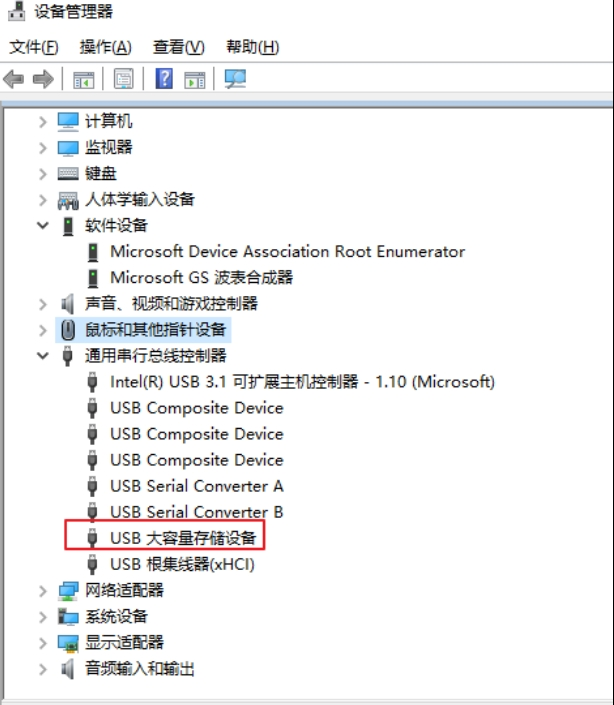
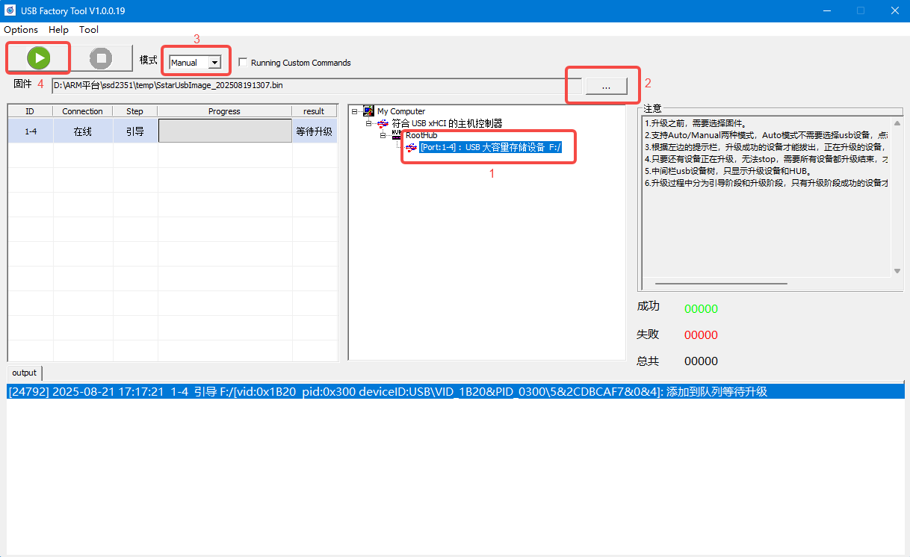
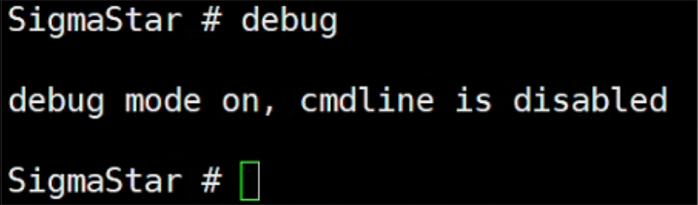
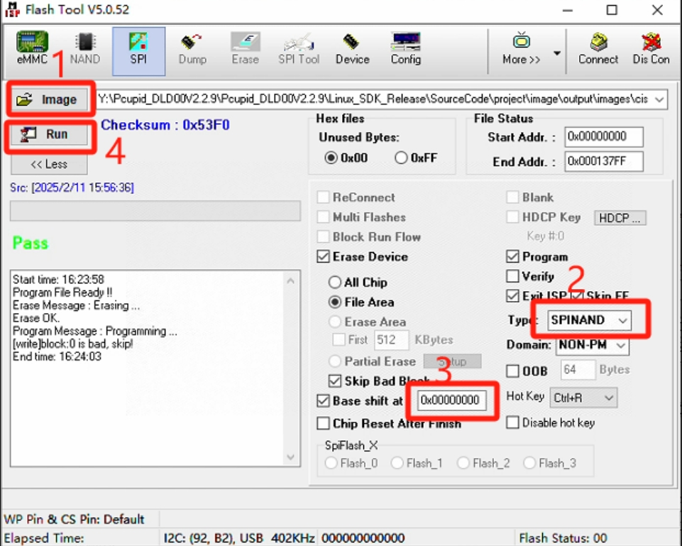
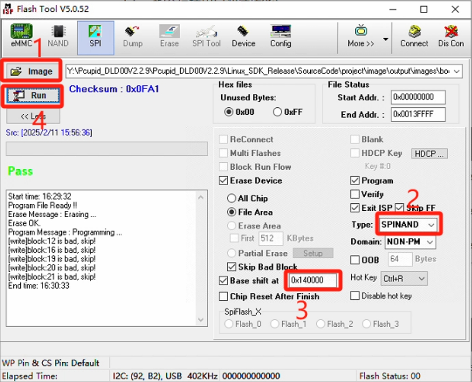
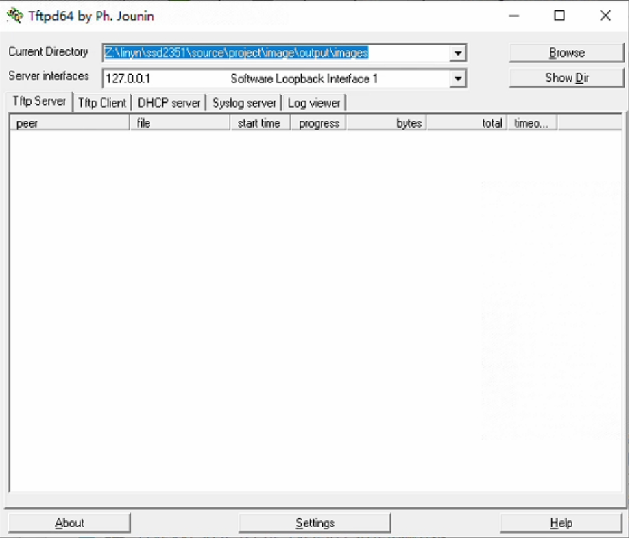

烧录手册
=====================

usb接口下载（推荐）
-----------

-  烧写模式拨码设置：1: on, 2: off 3: off 4 : off
-  烧写工具：UsbFactoryTool_1.0.0.19.tar.gz
-  镜像文件：SstarUsbImage_202503050415.bin

**解压烧写工具**

右击解压到当前目录，我的电脑是64bit，所以选择工具USB_Factory_Tool_64_1.0.0.19.exe

**设置钣金烧写模式**

烧写模式拨码设置：1: on, 2: off 3: off 4 : off

**下载**

接上电源和USB线，电脑检测到”USB大容量存储设备”

双击烧录工具，USB_Factory_Tool_64_1.0.0.19.exe，如下：

1. 可以看到检测到的设备
2. 选择烧写的固件
3. 点击绿色按键开始烧写

4. 当进度100%时，点击红色停止按键结束

Flash_Tool烧录
-----------

1. 烧写工具：FlashTool_5.0.52.tar.gz
2. 本方式适用于空片烧录或者板子无法进入Uboot控制台的情况下使用。
3. 非空片或者能够正常启动的情况下，想使用Flash Tool烧录，则需要按照以下方式先关闭掉Debug Uart

- uboot控制台下直接输入debug，然后关闭串口终端

- kernel下，则输入11111，然后关闭串口终端

1. 开机，并确保串口的log无法执行到uboot控制台（如能正常启动，需要先在uboot控制台输入debug指令停掉串口调试功能）
2. 关闭串口调试终端
3. 启动到Uboot需要必备的分区以及分区起始地址

Nand Flash:

=============  =========  ===========================================
Binary file    offset     Binary 放置目录
=============  =========  ===========================================
cis.bin        0x00000    projectimageoutputimagescis.bin
cis.bin        0x20000    projectimageoutputimagescis.bin
boot.bin       0x140000   projectimageoutputimagesboot.bin
=============  =========  ===========================================

烧写cis.bin镜像(0x00000和0x20000都烧写一次)

烧写boot.bin镜像

TFTP服务器烧写
-----------
#打开tftp服务器，默认编译好的镜像路径project/image/output/images，把image复制电脑，选择Browse设置路径，如下

.. code-block:: shell

    #板子需要进入启动模式：启动拨码模式：1: on, 2: on 3: off 4 : off
    #插入TYPEC线，开机按住Enter不放进入到Uboot控制台，按照以下方式设置IP
    setenv ipaddr 192.168.137.81; //设置板端ip，要求能跟PC端ping通
    setenv serverip 192.168.137.99； //设置PC端的ip
    setenv -f ethact sstar_emac; //设置使用Emac,本平台使用的是Emac
    setenv -f ethaddr 00:11:22:33:44:55; //设定mac地址
    setenv -f netmask 255.255.255.0; //设置掩码
    setenv -f gatewayip 192.168.137.1; //设置网关
    estart //初始化网络 uboot 下使用网络之前需要先输入该命令
    estar
    #烧写成功，会自动启动板子
    #与全烧录的区别是此方式可以estar auto_update.txt中的脚本，烧录任意单独分区

