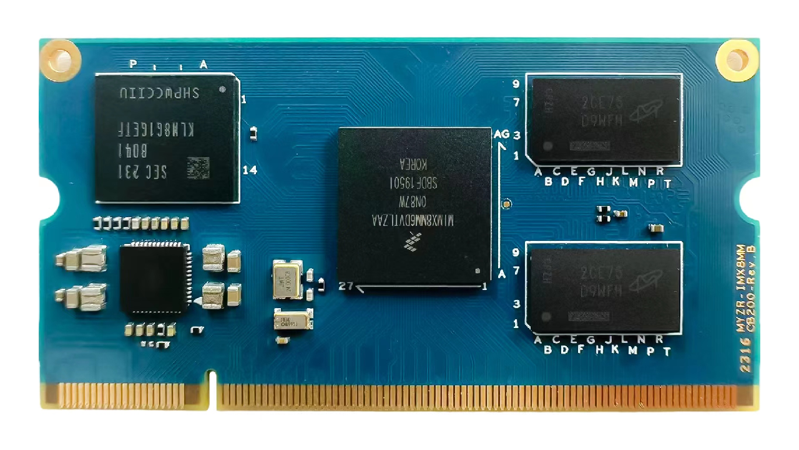

核心板硬件手册
==============

核心板视图
----------

工作温度
--------

-  商业级：

   0°C ~ 70°C

-  工业级：

   -40°C ~ 85°C

供电电源
--------

-  5V输入

操作系统支持
------------

-  Linux
-  Android

硬件接口
--------

+-------------+----------------+--------+------------------------------------------+
| 接口种类    | 接口规格 / 最大可配置数 | 描述                                     |
+=============+================+========+==========================================+
| 通讯接口    | Ethernet       |1       |  1路支持EEE, Ethernet AVB和IEEE1588      |
+             +----------------+--------+------------------------------------------+
|             | USB2.0         |2       |  2路USB3.0 PHY接口                       |
+             +----------------+--------+------------------------------------------+
|             | UART           |4       |  4路UART,每路高达4.0Mbps                 |
+             +----------------+--------+------------------------------------------+
|             | I2C            |4       |  4路I2C,最高支持400 kbps                 |
+             +----------------+--------+------------------------------------------+
|             | SPI            |3       |  3路eCSPI(Enhanced CSPI),每个高达52Mbps  |
+             +----------------+--------+------------------------------------------+
|             | PCIe           |1       |  单通道支持PCIe Gen 3，双模式操作，可用作|
+             +                +        +                                          +
|             |                |        |  根复合体或端点                          |
+             +                +        +                                          +
|             |                |        |                                          |
+-------------+----------------+--------+------------------------------------------+
| 外部存储接口| eMMC           |2       |  5.1 FLASH                               |
+             +----------------+--------+------------------------------------------+
|             | NAND           |1       |  8位NAND闪存，支持ECC与BCH用于错误检测   |
+             +----------------+--------+------------------------------------------+
|             | DRAM           |1       |  82-bit DRAM，对原始MLC/SLC器件的支持，  |
+             +                +        +                                          +
|             |                |        |  BCH ECC高达符合62位和ONFi3.2标准        |
+             +                +        +                                          +
|             |                |        |                                          |
+             +----------------+--------+------------------------------------------+
|             | QSPI           |4       |  1个四路外部串行闪存设备接口，支持XIP模式|
+-------------+----------------+--------+------------------------------------------+
| 多媒体      | DSI（MIPI接口）|1       |  1路4通道MIPI显示接口，支持高速模式（每  |
+             +                +        +                                          +
|             |                |        |  通道1.5Gbps),支持1920x1080@60Hz，       |
+             +                +        +                                          +
|             |                |        |  4K@30Hz，支持LCDIF显示器                |
+             +----------------+--------+------------------------------------------+
|             | CSI（MIPI接口）|2       |  2路4通道MIPI摄像头接口，支持高速模式    |
+             +                +        +                                          +
|             |                |        |  （每通道1.5Gbps），支持4K@30fps         |
+             +                +        +                                          +
|             |                |        |                                          |
+-------------+----------------+--------+------------------------------------------+

管脚定义
--------

.. include:: HM.CB200-PinDef.rst

管脚定义&详细功能说明
---------------------

.. include:: HM.CB200-PinMux.rst

--------------------------------------------------------------------------------

::

   --------------------------------------------------------------------------------
   * 珠海明远智睿科技有限公司  
   * ZhuHai MYZR Technology CO.,LTD.
   * Latest Update: 2023/5/08  
   * Supporter: Zhong JiaYi
   --------------------------------------------------------------------------------
