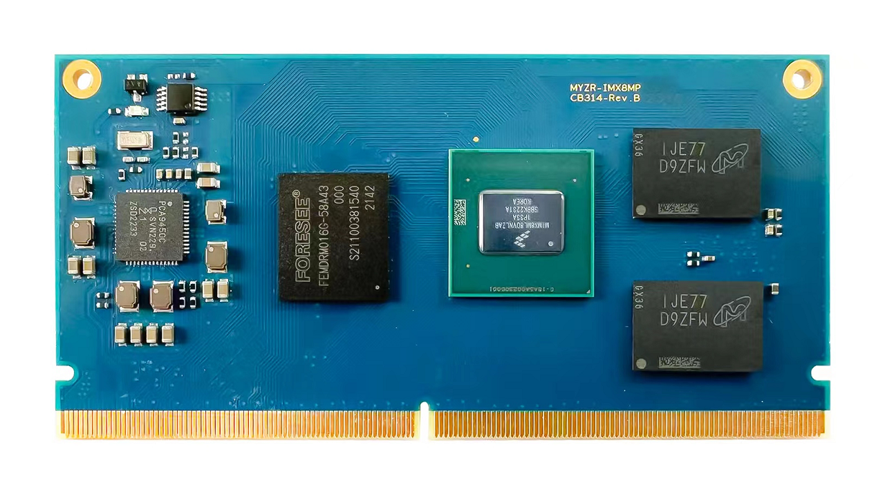

核心板硬件手册
==============

核心板视图
----------

工作温度
--------

-  商业级：

   0°C ~ 70°C

-  工业级：

   -40°C ~ 85°C

供电电源
--------

-  5V输入

操作系统支持
------------

-  Linux
-  Android

硬件接口
--------

+-------------+----------------+--------+---------------------------------------------------+
| 接口种类    | 接口规格 / 最大可配置数 | 描述                                              |
+=============+================+========+===================================================+
| 通讯接口    | Ethernet       |2       | 1路支持EEE, Ethernet AVB和IEEE1588                |
+             +----------------+--------+---------------------------------------------------+
|             | USB3.0         |2       | 2路USB3.0 PHY接口                                 |
+             +----------------+--------+---------------------------------------------------+
|             | UART           |4       | 4路UART,每路高达4.0Mbps                           |
+             +----------------+--------+---------------------------------------------------+
|             | I2C            |6       | 4路I2C,最高支持400 kbps                           |
+             +----------------+--------+---------------------------------------------------+
|             | SPI            |3       | 3路eCSPI（Enhanced CSPI），每个高达52Mbps         |
+             +----------------+--------+---------------------------------------------------+
|             | PCIe           |1       | 单通道支持PCIe Gen 3，双模式操作，可用作根复合体  |
+             +                +        +                                                   +
|             |                |        | 或端点                                            |
+             +                +        +                                                   +
|             |                |        |                                                   |
+-------------+----------------+--------+---------------------------------------------------+
| 外部存储接口| eMMC           |2       | 5.1 FLASH                                         |
+             +----------------+--------+---------------------------------------------------+
|             | NAND           |1       | 8位NAND闪存，支持ECC与BCH用于错误检测             |
+             +----------------+--------+---------------------------------------------------+
|             | DRAM           |1       | 82-bit DRAM，对原始MLC/SLC器件的支持，BCH         |
+             +                +        +                                                   +
|             |                |        | ECC高达符合62位和ONFi3.2标准                      |
+             +                +        +                                                   +
|             |                |        |                                                   |
+             +----------------+--------+---------------------------------------------------+
|             | QSPI           |4       | 1个四路外部串行闪存设备接口，支持XIP模式          |
+-------------+----------------+--------+---------------------------------------------------+
| 多媒体      | HDMI           |1       | 1路HDMI 2.0a，支持4096x2160@60Hz，支持            |
+             +                +        +                                                   +
|             |                |        | HDCP 2.2 和HDCP 1.4，20+音频交错32位              |
+             +                +        +                                                   +
|             |                |        | @384khz fs，支持S/PDIF输入和输出                  |
+             +----------------+--------+---------------------------------------------------+
|             | DSI（MIPI接口）|1       | 1路4通道MIPI显示接口，支持高速模式(每通道         |
+             +                +        +                                                   +
|             |                |        | 1.5Gbps),支持1920x1080@60Hz，4K@30Hz，            |
+             +                +        +                                                   +
|             |                |        | 支持LCDIF显示器                                   |
+             +----------------+--------+---------------------------------------------------+
|             | CSI（MIPI接口）|2       | 2路4通道MIPI摄像头接口，支持高速模式(每通道       |
+             +                +        +                                                   +
|             |                |        | 1.5Gbps)，支持4K@30fps                            |
+             +                +        +                                                   +
|             |                |        |                                                   |
+             +----------------+--------+---------------------------------------------------+
|             | ISI            |2       | ISI是一个简单的相机接口，支持图像处理和传输       |
+             +----------------+--------+---------------------------------------------------+
|             | ISP            |2       | 1路12MP@30fps or 4kp45，2路都是1080p80            |
+-------------+----------------+--------+---------------------------------------------------+

管脚定义
--------

.. include:: HM.CB314-PinDef.rst

管脚定义&详细功能说明
---------------------

.. include:: HM.CB314-PinMux.rst

--------------------------------------------------------------------------------

::

   --------------------------------------------------------------------------------
   * 珠海明远智睿科技有限公司  
   * ZhuHai MYZR Technology CO.,LTD.
   * Latest Update: 2023/4/26  
   * Supporter: Zhong JiaYi
   --------------------------------------------------------------------------------

