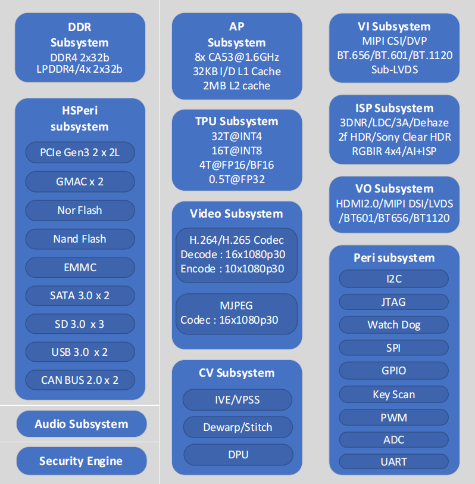

.. raw:: html

   

Platform Introduction
======================

Product Overview
----------------

MYZR‑BM1688‑BOX is an industrial edge AI computing system based on the SOPHGO BM1688 heterogeneous AI chip. It integrates dual Gigabit Ethernet, isolated RS232/RS485, dual CAN‑FD, MIPI camera interface, HDMI display, M.2 wireless and SSD expansion, audio and other peripherals. Supporting multi-channel video encoding/decoding, local AI inference, and industrial protocol data processing, it is suitable for industrial machine vision, smart security, offline large models, IoT edge gateway, and retail intelligent analysis scenarios. With an operating temperature range of ‑20℃~+70℃ and ESD/surge protection on external interfaces, it meets industrial harsh environment requirements.

Target Applications
-------------------

1. Industrial Machine Vision Inspection
~~~~~~~~~~~~~~~~~~~~~~~~~~~~~~~~~~~~~~~~

Production line workpiece defect recognition, size measurement, material sorting and counting, barcode/QR code reading; combined with CAN/RS485 bus to directly connect PLC and variable frequency drives, achieving visual inspection and equipment linkage. Supports local data storage on the production line without cloud upload.

2. Smart Park & Security Video Structuring
~~~~~~~~~~~~~~~~~~~~~~~~~~~~~~~~~~~~~~~~~~

Multi-channel cameras simultaneously perform face recognition, license plate recognition, pedestrian/electric vehicle/abandoned object detection, and boundary intrusion alerts; supports 16-channel 1080P video synchronous decoding and analysis, local video storage, ensuring park data privacy.

3. Retail Store Intelligent Analysis
~~~~~~~~~~~~~~~~~~~~~~~~~~~~~~~~~~~~

Store customer flow statistics, shelf product recognition, customer dwell time behavior analysis; equipped with WiFi/4G wireless module for remote statistical data synchronization, offline status can also complete local algorithm inference.

4. Offline Private Large Model Terminal
~~~~~~~~~~~~~~~~~~~~~~~~~~~~~~~~~~~~~~~

Locally deploy lightweight large language models and voice interaction models for enterprise knowledge base offline Q&A and device voice control; all data is processed only within the box, not uploaded to the cloud, meeting data confidentiality requirements.

5. Intelligent Transportation After-market Devices
~~~~~~~~~~~~~~~~~~~~~~~~~~~~~~~~~~~~~~~~~~~~~~~~~

In-vehicle multi-channel driving footage collection, road target detection, and traffic violation recognition; wide-temperature fanless design adapts to vehicle high/low temperature environments, supporting local video storage and playback.

6. IoT Industrial Edge Gateway
~~~~~~~~~~~~~~~~~~~~~~~~~~~~~~

Collect temperature/humidity, infrared, weighing and other sensor data, perform local preprocessing before differentiated transmission; dual Gigabit Ethernet ports achieve internal/external network isolation, balancing device collection and backend upload.

7. AI Teaching and Algorithm Verification Platform
~~~~~~~~~~~~~~~~~~~~~~~~~~~~~~~~~~~~~~~~~~~~~~~~~

University and R&D laboratory deep learning debugging equipment, supporting multi-channel camera concurrency and multi-model parallel inference, with complete SDK for CV vision and NLP algorithm development and testing.

8. Warehouse Logistics Intelligent Recognition
~~~~~~~~~~~~~~~~~~~~~~~~~~~~~~~~~~~~~~~~~~~~~

Goods inventory, express waybill OCR recognition, stacking anomaly detection, suitable for warehouse enclosed and high/low temperature working environments.

Key Features
------------

*  Adopts A53+RISC-V+TPU triple-core heterogeneous architecture with 16TOPS computing power, supporting multi-channel AI synchronous inference;

*  Built-in 4K ISP and multi-channel video encoding/decoding, can simultaneously connect multiple MIPI cameras;

*  Baseboard integrates dual Gigabit Ethernet, CAN/485, M.2 wireless/SSD and other full industrial peripheral interfaces;

*  Aluminum alloy fanless system, ‑20℃~+70℃ wide temperature, 7×24 hours stable operation;

*  Memory and eMMC capacity flexibly configurable, supporting TF/NVMe multi-level local storage;

*  Complete Linux SDK and compilation environment, convenient model porting and firmware development;

*  Supports TF/eMMC/USB three startup modes, integrated debugging and burning Type-C interface;

*  Low power consumption, compact size, supports rack-mounted and wall-mounted installation methods.

Processor Block Diagram
-----------------------

