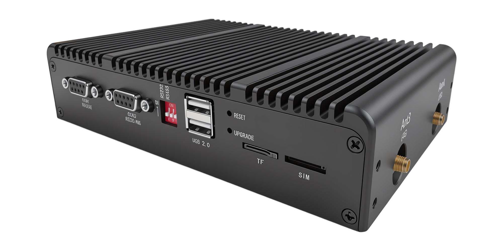
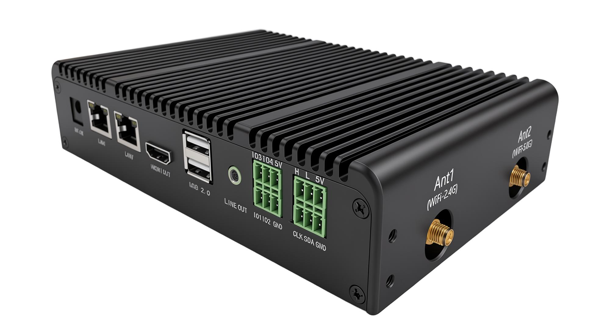
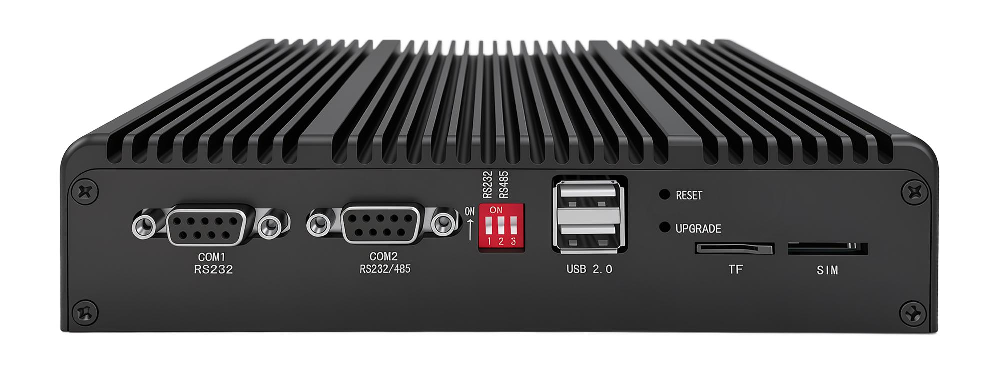
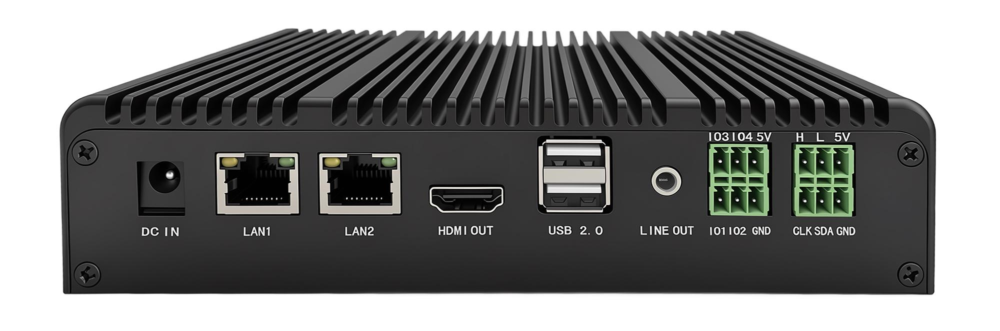
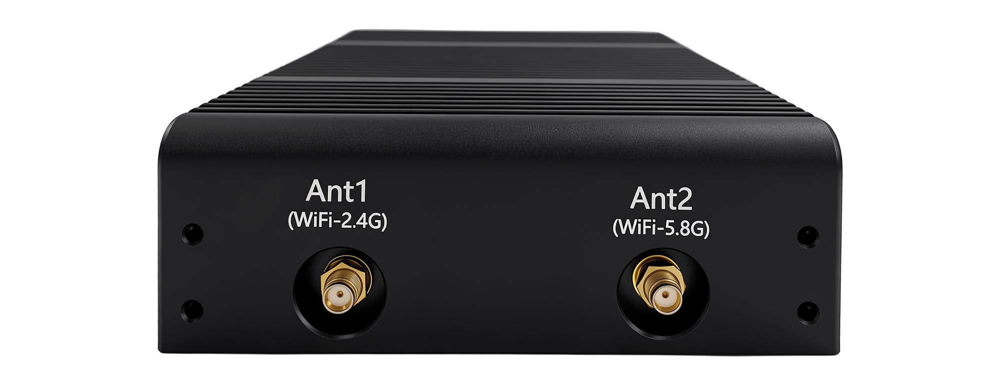
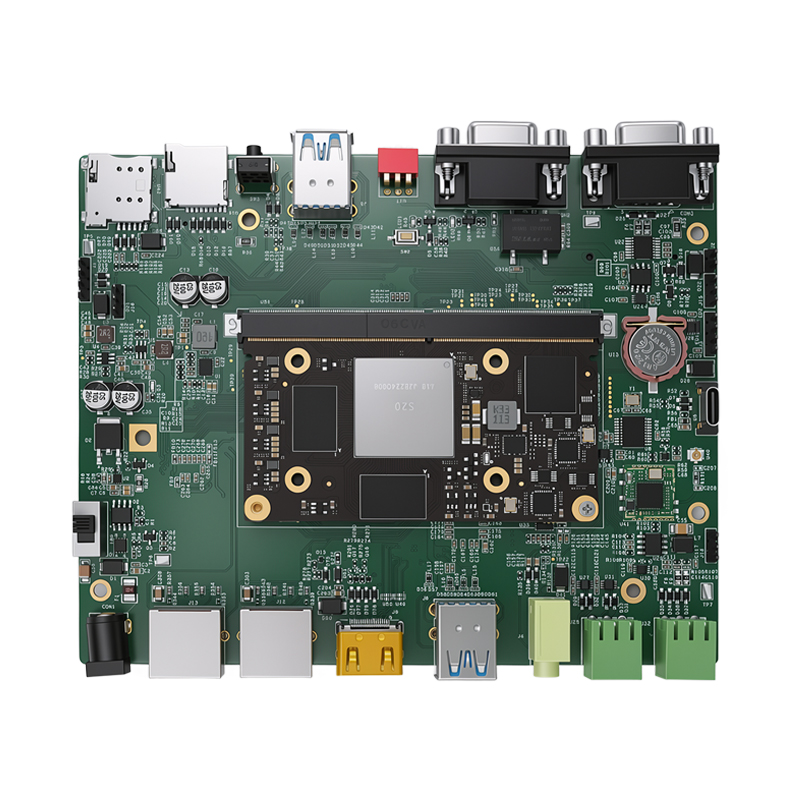
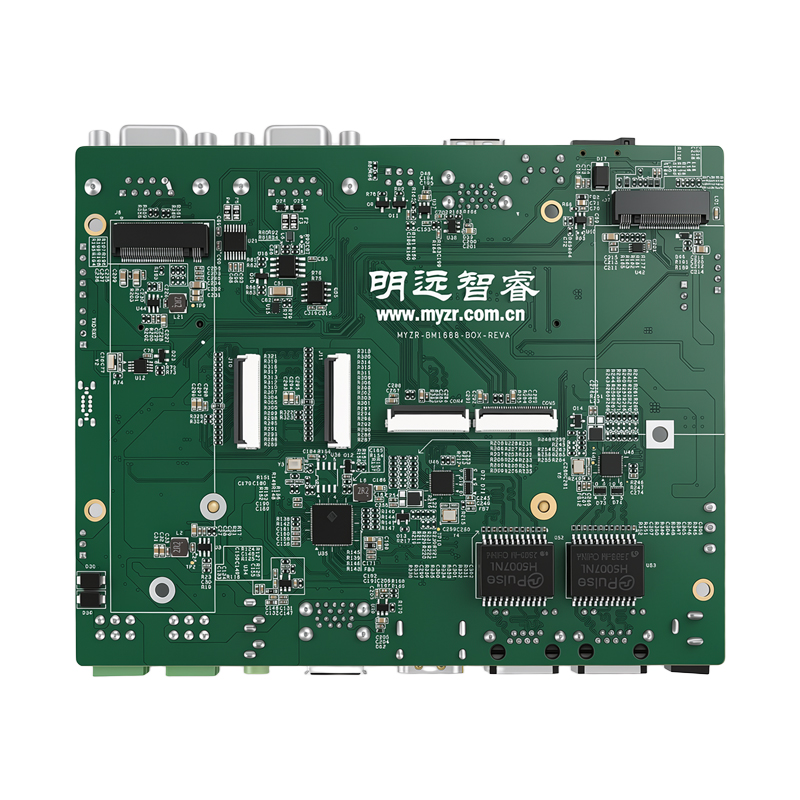
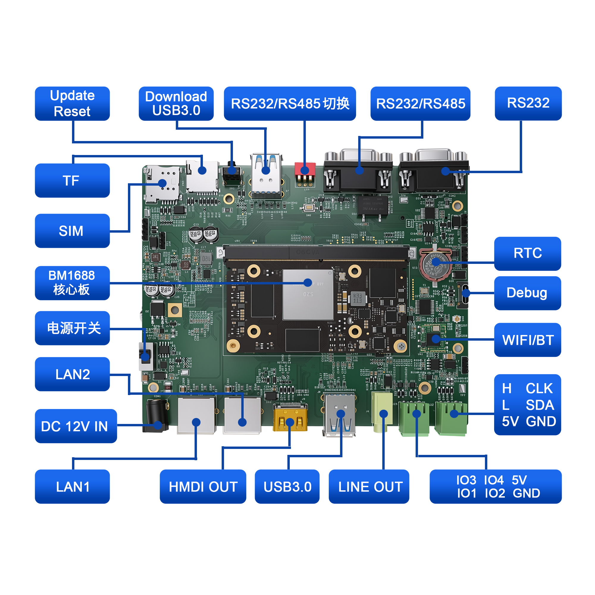
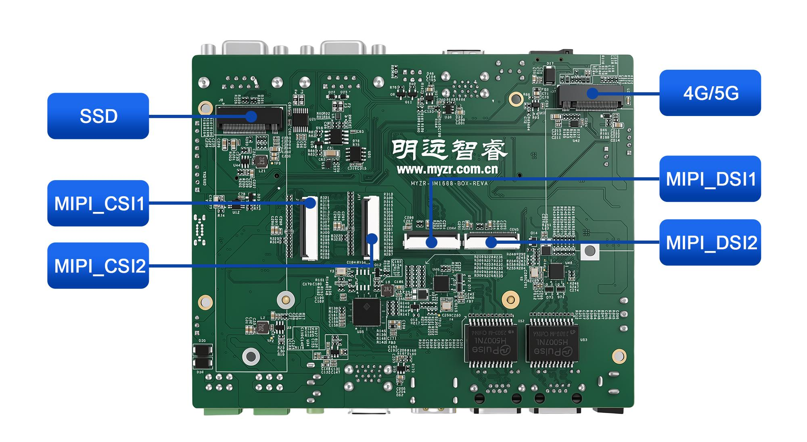

.. raw:: html

   

产品介绍
========

产品外观
--------

产品正侧图

产品反侧图

产品正面图

产品反面图

产品侧面图

开发板介绍
----------

开发板正反图片
~~~~~~~~~~~~~~

.. raw:: html

   

   

开发板正面

.. raw:: html

   

   

开发板反面

.. raw:: html

   

   

开发板接口图
~~~~~~~~~~~~

