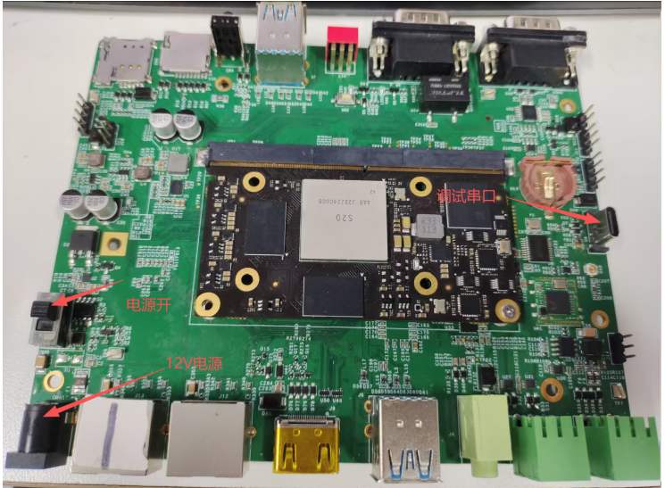

.. raw:: html

   

启动手册
========

1.准备电源线，数据线，按下图方式接好
------------------------------------

2.启动进入系统
----------------

.. code-block:: text

   linaro
   linaro
   sudo -i
   linaro
   root@sophon:~#
