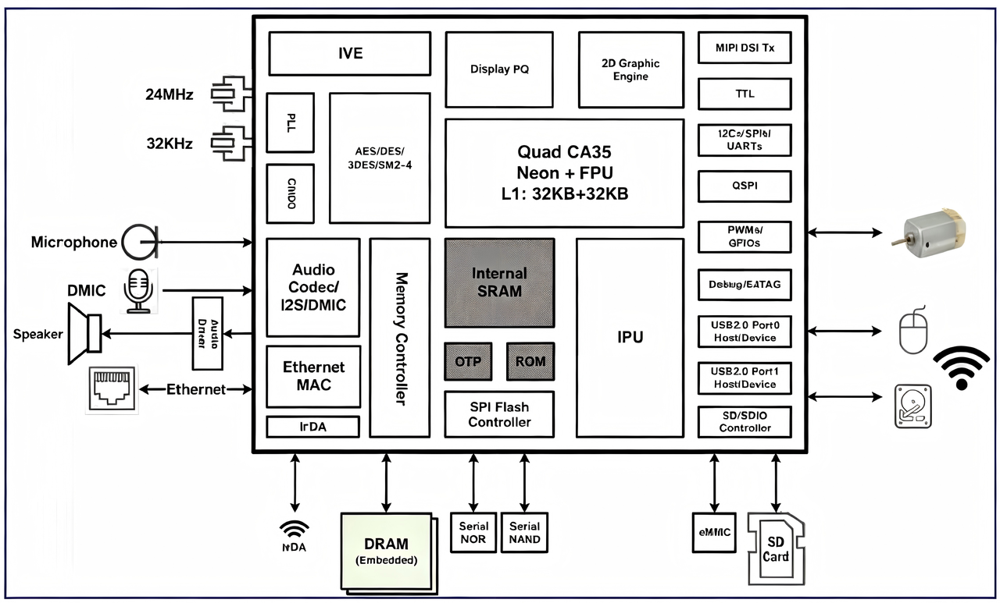

.. raw:: html

   

Platform Introduction
=====================

Product Overview
-----------

MYZR-SSD2351-GW510 (GW510-4G) is an industrial multi-mode communication gateway based on the SigmaStar SSD2351 quad-core industrial chip. It integrates isolated RS485/RS232, 100Mbps Ethernet, DI/DO, relays, and 4G/WiFi/Bluetooth/LoRa multi-communication links. It supports industrial protocol transparent transmission such as serial port to MQTT. Suitable for industrial automation, smart energy, legacy equipment cloud transformation, remote operation and maintenance and other scenarios. Operating temperature -20°C~75°C, all interfaces with 4KV lightning protection, meeting harsh industrial environments.

Target Applications
-----------

- Industrial Automation: Sensor, PLC, and instrument data collection in factory workshops, remote device start/stop, and status monitoring;
- Smart Energy: RS485 data upload for power meters, photovoltaic equipment, and water meters, energy consumption monitoring and remote meter reading;
- Remote Operation and Maintenance: Data transmission and remote control for field equipment, construction machinery, and unmanned computer rooms;
- IoT Networking: Wireless networking for multi-node devices in parks and buildings, unified access of serial port devices to IoT platforms;
- Legacy Equipment Upgrade: Rapid networking upgrade of old RS485/RS232 industrial equipment, low-cost intelligent and cloud transformation.

Key Features
-----------

- Stable Performance: Cortex-A35 quad-core processor, 1.4GHz frequency, supports 7×24 hours continuous operation; Onboard RTC clock with backup battery, maintains accurate timing even when power is off.
- Rich Interfaces: Multiple isolated RS485, RS232, 100Mbps Ethernet, digital IO and relay interfaces, all communication ports have 4KV lightning protection, compatible with various industrial equipment.
- Multi-mode Wireless: Integrated 4G, dual-band WiFi, Bluetooth, LoRa, flexible networking methods to meet different networking needs for local, remote, and long-distance applications.
- Protocol Transparent Transmission: Supports bidirectional transparent transmission between RS485/RS232 and MQTT, visual configuration via Web interface, enabling rapid serial device cloud access and remote control.
- Industrial Protection: -20°C~75°C wide temperature operation, supports 12V/24V wide voltage power supply, with overvoltage, overcurrent, reverse polarity protection, and ESD protection; Aluminum housing, DIN rail mounting, suitable for industrial sites.
- Easy Maintenance: Supports multiple login methods for debugging, status indicators for intuitive operation status display, complete development documentation provided, supports secondary development and remote maintenance.

Processor Block Diagram
------------

Processor Features
-----------

.. raw:: html

   

.. raw:: html

   

+------+------------------------+------------------------------------------------------------------------------------------------------------------------------------------------+
| No.  |    Feature             |                      Description                                                                                                               |
+======+========================+================================================================================================================================================+
| 1    | Processor Core         | ARM Cortex-A35 Quad-core                                                                                                                       |
+      +                        +------------------------------------------------------------------------------------------------------------------------------------------------+
|      |                        | Per core: 32KB L1 Instruction Cache + 32KB L1 Data Cache                                                                                       |
+      +                        +------------------------------------------------------------------------------------------------------------------------------------------------+
|      |                        | 256KB L2 Cache                                                                                                                                 |
+      +                        +------------------------------------------------------------------------------------------------------------------------------------------------+
|      |                        | Supports Neon and FPU (Floating Point Unit)                                                                                                    |
+      +                        +------------------------------------------------------------------------------------------------------------------------------------------------+
|      |                        | Independent power domain per core                                                                                                              |
+      +                        +------------------------------------------------------------------------------------------------------------------------------------------------+
|      |                        | 0.5 TOPS computing power                                                                                                                       |
+      +                        +------------------------------------------------------------------------------------------------------------------------------------------------+
|      |                        | Up to 1.4GHz frequency                                                                                                                         |
+------+------------------------+------------------------------------------------------------------------------------------------------------------------------------------------+
| 2    | Intelligent Video      | Pure hardware accelerator                                                                                                                      |
+      + Engine (IVE)           +------------------------------------------------------------------------------------------------------------------------------------------------+
|      |                        | Supports image processing operations: Filter2D, Box filter, Gaussian filter, Bernsen, Dilate, Erode, etc.                                      |
+      +                        +------------------------------------------------------------------------------------------------------------------------------------------------+
|      |                        | Supports matrix multiplication                                                                                                                 |
+------+------------------------+------------------------------------------------------------------------------------------------------------------------------------------------+
| 3    | Intelligent Processing | Pure hardware accelerator                                                                                                                      |
+      + Unit (IPU)             +------------------------------------------------------------------------------------------------------------------------------------------------+
|      |                        | Programmable 4/8/16-bit processing                                                                                                             |
+      +                        +------------------------------------------------------------------------------------------------------------------------------------------------+
|      |                        | Supports R/W DMA for RGB/YUV data formats                                                                                                      |
+      +                        +------------------------------------------------------------------------------------------------------------------------------------------------+
|      |                        | Supports multiple video analytics: Face Detection/Recognition (FD/FR), Human Detection, Motion/Object Detection (MD/OD), Object Tracking, etc. |
+      +                        +------------------------------------------------------------------------------------------------------------------------------------------------+
|      |                        | Supports Transformer networks                                                                                                                  |
+------+------------------------+------------------------------------------------------------------------------------------------------------------------------------------------+
| 4    | Audio Processor        | Supports 3-channel ADC (single-ended or differential mode)                                                                                     |
+      +                        +------------------------------------------------------------------------------------------------------------------------------------------------+
|      |                        | Supports 2-channel DAC (single-ended mode)                                                                                                     |
+      +                        +------------------------------------------------------------------------------------------------------------------------------------------------+
|      |                        | ADC and DAC SNR exceeds 95.2dB                                                                                                                 |
+      +                        +------------------------------------------------------------------------------------------------------------------------------------------------+
|      |                        | Supports digital and analog gain adjustment                                                                                                    |
+      +                        +------------------------------------------------------------------------------------------------------------------------------------------------+
|      |                        | Supports 8-channel DMIC (1 clock + 4 data)                                                                                                     |
+      +                        +------------------------------------------------------------------------------------------------------------------------------------------------+
|      |                        | Supports TDM mode (1250/1/2), max 8 input channels, 2 output channels                                                                          |
+      +                        +------------------------------------------------------------------------------------------------------------------------------------------------+
|      |                        | Supports SPDIF input                                                                                                                           |
+------+------------------------+------------------------------------------------------------------------------------------------------------------------------------------------+
| 5    | Video Output Interface | Image quality enhancement (gamma, sharpness, brightness, 3x3 matrix, color dithering, OSD, RGB swap)                                           |
+      +                        +------------------------------------------------------------------------------------------------------------------------------------------------+
|      |                        | Display channel supports MIPI/digital port output, digital ports include TTL/18080                                                             |
+      +                        +------------------------------------------------------------------------------------------------------------------------------------------------+
|      |                        | Supports MIPI DSI TX, 2.5Gbps per lane, RGB 16/18/24-bit, resolution up to 2560x1600@60fps                                                     |
+      +                        +------------------------------------------------------------------------------------------------------------------------------------------------+
|      |                        | TTL/Parallel RGB interface, 16/18/24-bit, resolution 1280x800@60fps                                                                            |
+      +                        +------------------------------------------------------------------------------------------------------------------------------------------------+
|      |                        | Supports 8/16-bit 18080 interface                                                                                                              |
+      +                        +------------------------------------------------------------------------------------------------------------------------------------------------+
|      |                        | Supports MIPI CSI                                                                                                                              |
+------+------------------------+------------------------------------------------------------------------------------------------------------------------------------------------+
| 6    | Advanced Color Engine  | Brightness gain/offset adjustment                                                                                                              |
+      +                        +------------------------------------------------------------------------------------------------------------------------------------------------+
|      |                        | Black/White Level Expansion (BLE/WLE)                                                                                                          |
+      +                        +------------------------------------------------------------------------------------------------------------------------------------------------+
|      |                        | Peak/Low-pass Filter/Chrominance Correction/Denoising                                                                                          |
+------+------------------------+------------------------------------------------------------------------------------------------------------------------------------------------+
| 7    | SPI NOR/NAND Flash     | Compatible with standard, dual-channel and quad-channel SPI flash components                                                                   |
+      + Interface              +------------------------------------------------------------------------------------------------------------------------------------------------+
|      |                        | Maximum clock frequency 108MHz                                                                                                                 |
+      +                        +------------------------------------------------------------------------------------------------------------------------------------------------+
|      |                        | Supports power-off protection                                                                                                                  |
+------+------------------------+------------------------------------------------------------------------------------------------------------------------------------------------+
| 8    | SD/eMMC Interface      | Compatible with SD 2.0 specification, supports 1/4-bit data bus mode                                                                           |
+      +                        +------------------------------------------------------------------------------------------------------------------------------------------------+
|      |                        | Compatible with SDIO 2.0 specification, supports 1/4-bit data bus mode                                                                         |
+      +                        +------------------------------------------------------------------------------------------------------------------------------------------------+
|      |                        | Supports eMMC 5.0, 4/8-bit data bus, max clock 200MHz, HS400 DDR mode                                                                          |
+------+------------------------+------------------------------------------------------------------------------------------------------------------------------------------------+
| 9    | USB Interface          | USB2.0 port 0 configurable as host or device                                                                                                   |
+      +                        +------------------------------------------------------------------------------------------------------------------------------------------------+
|      |                        | USB2.0 port 1 configurable as host or device (host mode supports EHC1 specification)                                                           |
+      +                        +------------------------------------------------------------------------------------------------------------------------------------------------+
|      |                        | Integrated 16-bit x1 DDR3/L, 128MB capacity                                                                                                    |
+      +                        +------------------------------------------------------------------------------------------------------------------------------------------------+
|      |                        | Data rate up to 2133Mbps (DDR3/L)                                                                                                              |
+------+------------------------+------------------------------------------------------------------------------------------------------------------------------------------------+
| 10   | DRAM Memory            | Integrated 16-bit x1 DDR3/L, 128MB capacity                                                                                                    |
+      +                        +------------------------------------------------------------------------------------------------------------------------------------------------+
|      |                        | Data rate up to 2133Mbps (DDR3/L)                                                                                                              |
+------+------------------------+------------------------------------------------------------------------------------------------------------------------------------------------+
| 11   | Network Connectivity   | Integrated two 10/100M Ethernet MACs, supports RMII interface                                                                                  |
+      +                        +------------------------------------------------------------------------------------------------------------------------------------------------+
|      |                        | 256-entry hash table                                                                                                                           |
+      +                        +------------------------------------------------------------------------------------------------------------------------------------------------+
|      |                        | Supports broadcast/multicast storm prevention                                                                                                  |
+      +                        +------------------------------------------------------------------------------------------------------------------------------------------------+
|      |                        | Supports full-duplex and half-duplex operation                                                                                                 |
+      +                        +------------------------------------------------------------------------------------------------------------------------------------------------+
|      |                        | Supports IEEE 802.1Q VLAN tag detection                                                                                                        |
+      +                        +------------------------------------------------------------------------------------------------------------------------------------------------+
|      |                        | Supports IPv4 header checksum and TCP/UDP/ICMP checksum verification                                                                           |
+------+------------------------+------------------------------------------------------------------------------------------------------------------------------------------------+
| 12   | Security Engine        | Supports AES128/AES192/AES256/DES/3DES/RSA4096/SHA-1/SHA-256/SM2/SM3/SM4 encryption algorithms                                                 |
+      +                        +------------------------------------------------------------------------------------------------------------------------------------------------+
|      |                        | Supports Secure Boot                                                                                                                           |
+      +                        +------------------------------------------------------------------------------------------------------------------------------------------------+
|      |                        | FIPS 140-1 compliant random number generator                                                                                                   |
+      +                        +------------------------------------------------------------------------------------------------------------------------------------------------+
|      |                        | Integrated OTP (One-Time Programmable) memory for secure and calibration data storage                                                          |
+------+------------------------+------------------------------------------------------------------------------------------------------------------------------------------------+
| 13   | Boot Options           | SPI NOR                                                                                                                                        |
+      +                        +------------------------------------------------------------------------------------------------------------------------------------------------+
|      |                        | SPI NAND (with ECC)                                                                                                                            |
+      +                        +------------------------------------------------------------------------------------------------------------------------------------------------+
|      |                        | SD Card                                                                                                                                        |
+      +                        +------------------------------------------------------------------------------------------------------------------------------------------------+
|      |                        | eMMC                                                                                                                                           |
+      +                        +------------------------------------------------------------------------------------------------------------------------------------------------+
|      |                        | USB                                                                                                                                            |
+      +                        +------------------------------------------------------------------------------------------------------------------------------------------------+
|      |                        | UART                                                                                                                                           |
+------+------------------------+------------------------------------------------------------------------------------------------------------------------------------------------+
| 14   | Peripheral Interfaces  | Dedicated GPIO for system control                                                                                                              |
+      +                        +------------------------------------------------------------------------------------------------------------------------------------------------+
|      |                        | Supports 8-channel PWM input and 13-channel PWM output (shared with GPIO)                                                                      |
+      +                        +------------------------------------------------------------------------------------------------------------------------------------------------+
|      |                        | Supports QSPI interface                                                                                                                        |
+      +                        +------------------------------------------------------------------------------------------------------------------------------------------------+
|      |                        | Up to 6 general-purpose UARTs and 4 high-speed UARTs with flow control                                                                         |
+      +                        +------------------------------------------------------------------------------------------------------------------------------------------------+
|      |                        | Up to 12 general-purpose timers and 1 watchdog timer                                                                                           |
+      +                        +------------------------------------------------------------------------------------------------------------------------------------------------+
|      |                        | Two SPI interfaces, configurable as master or slave mode                                                                                       |
+      +                        +------------------------------------------------------------------------------------------------------------------------------------------------+
|      |                        | Two SPI interfaces in master-only mode                                                                                                         |
+      +                        +------------------------------------------------------------------------------------------------------------------------------------------------+
|      |                        | Up to 6 I2C master controllers                                                                                                                 |
+      +                        +------------------------------------------------------------------------------------------------------------------------------------------------+
|      |                        | Integrated 10-bit SAR ADC, 1 channel                                                                                                           |
+      +                        +------------------------------------------------------------------------------------------------------------------------------------------------+
|      |                        | Supports 7x7 keypad                                                                                                                            |
+      +                        +------------------------------------------------------------------------------------------------------------------------------------------------+
|      |                        | Supports IrDA                                                                                                                                  |
+      +                        +------------------------------------------------------------------------------------------------------------------------------------------------+
|      |                        | Supports POR (Power-On Reset)                                                                                                                  |
+      +                        +------------------------------------------------------------------------------------------------------------------------------------------------+
|      |                        | Supports internal temperature sensor                                                                                                           |
+------+------------------------+------------------------------------------------------------------------------------------------------------------------------------------------+
| 15   | Boot Methods           | Six boot options: SPI NOR, SPI NAND, SD, eMMC, USB, UART.                                                                                      |
+------+------------------------+------------------------------------------------------------------------------------------------------------------------------------------------+