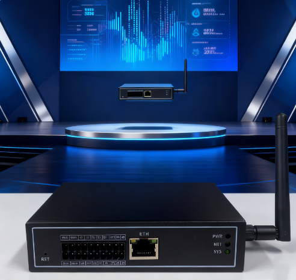
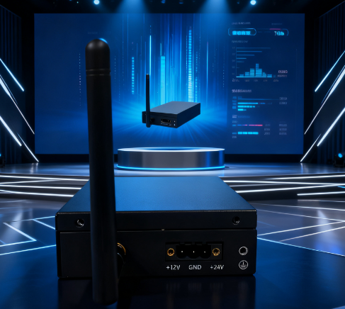
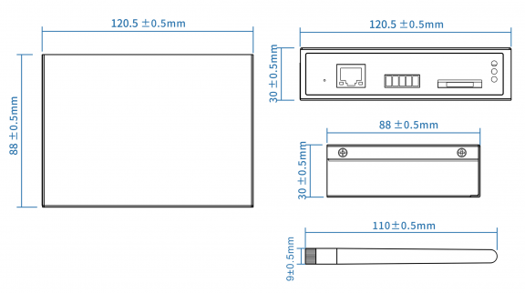
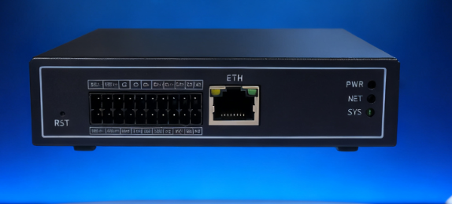
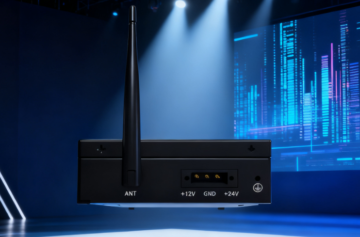
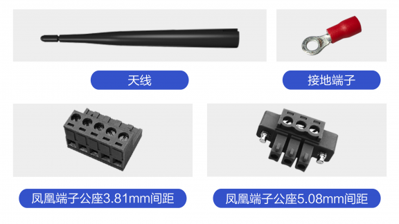

.. raw:: html

   

Product Introduction
==========

GW510-4G is an industrial wireless communication gateway that provides isolated RS485/isolated RS232/100Mbps Ethernet/optocoupler isolated DI/optocoupler isolated DO/relay switch interfaces for external device control, data collection, data parsing, and transparent transmission. The uplink can connect to servers or the cloud via 4G or Ethernet to control terminal devices and collect information. The device meets industrial-grade standards for temperature, ESD, EMC, vibration, etc., making it suitable for various harsh industrial environments and ensuring highly reliable data transmission.

Product Appearance and Interfaces
-----------------

Product Appearance
~~~~~~~~~~~~~~

**Product Front and Side Views**

.. raw:: html

    

.. raw:: html

    

Product Dimensions
~~~~~~~~~~~~~

Product Interfaces
~~~~~~~~~~~

**Product Front Interface Diagram**

.. raw:: html

   

.. raw:: html

   

+--------------------+----------------------------------------------------------+
| Hardware Interface |                  Interface Description                   |
+====================+==========================================================+
| ETH                | Ethernet port, RJ45 connector, 10/100M                   |
+--------------------+----------------------------------------------------------+
| RS232              | 3.81mm pitch Phoenix terminal, connects to RS232 devices |
+--------------------+----------------------------------------------------------+
| RS485              | 3.81mm pitch Phoenix terminal, connects to RS485 devices |
+--------------------+----------------------------------------------------------+
| PWR                | Power indicator, red                                     |
+--------------------+----------------------------------------------------------+
| SYS                | System indicator, green                                  |
+--------------------+----------------------------------------------------------+
| 4G                 | 4G indicator, green                                      |
+--------------------+----------------------------------------------------------+
| RST                | Button, system recovery function                         |
+--------------------+----------------------------------------------------------+

**Product Side Interface Diagram**

.. raw:: html

   

.. raw:: html

   

+--------------------+-----------------------------------------------+
| Hardware Interface |             Interface Description             |
+====================+===============================================+
| Power              | 3P Phoenix terminal (5.08mm pitch), 12V input |
+--------------------+-----------------------------------------------+
| 4G_ANTx            | Standard SMA female antenna connector         |
+--------------------+-----------------------------------------------+

Product Specifications
~~~~~~~~~~~~~~~~~

.. raw:: html

   

.. raw:: html

   

+-------------------------+--------------------------------------------------------------------------+
|          Model          |                                 GW510-4G                                 |
+=========================+==========================================================================+
| **Basic Information**                                                                              |
+-------------------------+--------------------------------------------------------------------------+
| Processor               | Cortex-A35 Quad-core 1.4GHz                                              |
+-------------------------+--------------------------------------------------------------------------+
| Memory                  | 128MB                                                                    |
+-------------------------+--------------------------------------------------------------------------+
| Storage                 | 128MByte Flash                                                           |
+-------------------------+--------------------------------------------------------------------------+
| 4G                      | LTE TDD: B34/38/39/40/41                                                 |
+                         +--------------------------------------------------------------------------+
|                         | LTE FDD: B1/3/5/8                                                        |
+-------------------------+--------------------------------------------------------------------------+
| Power Supply            | 12V DC Input                                                             |
+-------------------------+--------------------------------------------------------------------------+
| Operating Temp          | -20°C ~ 75°C                                                             |
+-------------------------+--------------------------------------------------------------------------+
| Storage Temp            | -40°C ~ 85°C                                                             |
+-------------------------+--------------------------------------------------------------------------+
| **Physical Appearance**                                                                            |
+-------------------------+--------------------------------------------------------------------------+
| Dimensions              | 120.5mm(L) x 88mm(W) x 30mm(H), excluding antenna connector              |
+-------------------------+--------------------------------------------------------------------------+
| Weight                  |                                                                          |
+-------------------------+--------------------------------------------------------------------------+
| Housing                 | Electrolytic aluminum, matte black finish                                |
+-------------------------+--------------------------------------------------------------------------+
| Mounting                | DIN Rail Mount                                                           |
+-------------------------+--------------------------------------------------------------------------+
| Antenna                 | External rod or suction cup antenna (1 piece)                            |
+-------------------------+--------------------------------------------------------------------------+
| **Software Features**                                                                              |
+-------------------------+--------------------------------------------------------------------------+
| Local Config            | Configurable via local config file or configuration tool                 |
+-------------------------+--------------------------------------------------------------------------+
| Ethernet                | Supports LAN or WAN port configuration                                   |
+-------------------------+--------------------------------------------------------------------------+
| MQTT                    | MQTT protocol support                                                    |
+-------------------------+--------------------------------------------------------------------------+
| Modbus                  | Modbus RTU/TCP protocol support                                          |
+-------------------------+--------------------------------------------------------------------------+
| UART                    | Direct serial data transmission/reception                                |
+-------------------------+--------------------------------------------------------------------------+
| Network                 | SDK support for direct data transmission/reception                       |
+-------------------------+--------------------------------------------------------------------------+
| 2nd Dev                 | Linux-based, supports secondary development for upper-layer applications |
+-------------------------+--------------------------------------------------------------------------+

Package Contents
~~~~~~~~~~~~~

Core Board Introduction
-----------

**Hardware Resources**

The MYZR-SSD2351-CB112 core board is designed based on the SSD2351 processor, integrating the core circuits required for processor operation, including DDR memory, Flash storage, power management, and clock systems. It can be directly used as a product main control module.

The processor integrates internally:

-  Quad-core ARM Cortex-A35 CPU
-  IVE image processing engine
-  IPU intelligent processing unit
-  Audio processor
-  Video input/output module
-  DDR controller
-  Ethernet MAC
-  Security encryption engine
-  Rich on-chip peripheral resources

Core Board Specifications
-----------

.. raw:: html

   

.. raw:: html

   

+-----+------------+-------------------------------------+
| No. | Parameter  |        .. centered :: Value         |
+=====+============+=====================================+
| 1   | Model      | MYZR-SSD2351-CB112                  |
+-----+------------+-------------------------------------+
| 2   | Dimensions | 26mm × 26mm                         |
+-----+------------+-------------------------------------+
| 3   | PCB        | 2-layer, ENIG, stamp hole 112Pin    |
+-----+------------+-------------------------------------+
| 4   | Memory     | DDR3/DDR3L 128/256MB                |
+-----+------------+-------------------------------------+
| 5   | Storage    | SPI Flash / NAND 128/256/512MB      |
+-----+------------+-------------------------------------+
| 6   | Boot Mode  | SPI NOR / NAND, SD, eMMC, USB, UART |
+-----+------------+-------------------------------------+

**Core Board Front and Back Views**

.. raw:: html

    

.. image:: ../../../../image/MYZR-SigmaStar系列/MYZR-SSD2351/核心板正面.jpg
   :alt: Core Board Front Side
   :width: 100%

.. image:: ../../../../image/MYZR-SigmaStar系列/MYZR-SSD2351/核心板反面.jpg
   :alt: Core Board Back Side
   :width: 100%

.. raw:: html

    

**Core Board Dimensional Drawing**

Core board mechanical dimensions [26mm × 26mm]

.. image:: ../../../../image/MYZR-SigmaStar系列/MYZR-SSD2351/核心板结构参数.png
   :alt: Core Board Structural Parameters
   :width: 100%

**Core Board Naming Convention and Optional Configurations**

.. raw:: html

   

.. raw:: html

   

+---------------------------+-------------------------------------------------------------------------------------------+
|     Core Board Model      | Naming Convention                                                                         |
+===========================+================+====================================+==================+==================+
| MYZR-SSD2351-CB112        | MYZR           | SSD2351                            | CB/EK            | 112              |
+                           +----------------+------------------------------------+------------------+------------------+
|                           | Mingyuan Zhirui|MPU Main Control Model              | Package          | Core Board Pins  |
+                           +----------------+------------------------------------+------------------+------------------+
|                           |                |SSD2351D (built-in memory 128MB)    |                  |                  |
+                           +----------------+------------------------------------+------------------+------------------+
|                           |                |SSD2351Q (built-in memory 256MB)    |                  |                  |
+                           +----------------+------------------------------------+------------------+------------------+
|                           |                                           **Optional Configurations**                     |
+                           +-------------------------------------------------------------------------------------------+
|                           |Memory: CPU built-in memory 128/256MByte                                                   |
+                           +-------------------------------------------------------------------------------------------+
|                           |Storage: SPI NAND FLASH 128/256/512MByte                                                   |
+                           +-------------------------------------------------------------------------------------------+
|                           |Example: MYZR-SSD2351-CB112-128M-128M                                                      |
+---------------------------+-------------------------------------------------------------------------------------------+

**Power Supply Mode**

.. raw:: html

   

.. raw:: html

   

+----------+----------+--------+--------+--------+------+--------------------------+
| Function | Pin      |            Specification        | Description              |
|          | Label    +--------+--------+--------+------+                          |
|          |          | Min.   | Typ.   | Max.   | Unit |                          |
+==========+==========+========+========+========+======+==========================+
| Power    | 5V_core  | 3.14   | 3.3    | 3.46   | V    | Powered by carrier board |
+----------+----------+--------+--------+--------+------+--------------------------+

**Operating Environment**

.. raw:: html

   

.. raw:: html

   

+------------------------------------------+---------------+-------------+------+------+-----------------------------------------+
|                Parameter                 | Specification                             | Description                             |
|                                          +---------------+-------------+------+------+                                         |
|                                          |     Min.      |    Typ.     | Max. | Unit |                                         |
+==========================================+===============+=============+======+======+=========================================+
| Operating Temperature                    | -20           | 25          | 70   | ℃    | Tested normal operation from -20 to 70℃ |
+------------------------------------------+---------------+-------------+------+------+-----------------------------------------+

**Boot Configuration**

The core board supports multiple boot media, and the boot mode is selected by the BOOT configuration circuit on the development board.

Supported boot methods:

-  SPI NAND Flash

Users can select the corresponding boot medium according to actual application requirements.

**Fast Boot Support and Fast Boot Time**

.. raw:: html

   

.. raw:: html

   

+---------+---------+---------------------------+
|  Item   | Support |           Time            |
+=========+=========+===========================+
| SSD2351 | Yes     | Fast boot QT interface 4S |
+---------+---------+---------------------------+

**Core Board / Development Board Power Consumption**

.. raw:: html

   

.. raw:: html

   

+---------------------------+----------+----------+----------+-------------------------------------------------+
| Type                      | Test Items                                                                       |
+                           +----------+----------+----------+-------------------------------------------------+
|                           | Standby Current     |  Full Load Power Consumption                               |
+===========================+==========+==========+==========+=================================================+
| SSD2351 Core Board        | 100mA    | 0.5W     | 500mA    | 2.5W                                            |
+---------------------------+----------+----------+----------+-------------------------------------------------+
| SSD2351 Development Board | 200mA    | 1W       | 1000mA   | 5W                                              |
+---------------------------+----------+----------+----------+-------------------------------------------------+
|Note: The above values are current values (mA), voltage is 5.0V, full load means all cores running at maximum |
+---------------------------+----------+----------+----------+-------------------------------------------------+

**Core Board SMD/Installation Diagram**

.. image:: ../../../../image/MYZR-SigmaStar系列/MYZR-SSD2351/核心板贴片.png
   :alt: Core Board SMD
   :width: 60%

**Signal Definition**

Core Board Pin Definition

.. raw:: html

   

.. raw:: html

   

================================== ==================================== ============================= ==================
 Pin NO.                            Pin Name                             Function Description          Pin Voltage
================================== ==================================== ============================= ==================
 1                                 GPIOE_07_UART5_TX                    UART5_TX                       3.3V
 2                                 GPIOE_06_UART5_RX                    UART5_RX                       3.3V
 3                                 GPIOE_09_I2C2_SCL                    I2C2_SCL                       3.3V
 4                                 GPIOE_12_ETH_RXD0                    RXD0                           3.3V
 5                                 GPIOE_10_I2C2_SDA                    I2C2_SDA                       3.3V
 6                                 GPIOE_11_ETH_COL                     COL                            3.3V
 7                                 GPIOE_13_ETH_RXD1                    RXD1                           3.3V
 8                                 GPIOE_14_ETH_TX_CLK                  TX_CLK                         3.3V
 9                                 GPIOE_15_ETH_TXD0                    TXD0                           3.3V
 10                                GPIOE_16_ETH_TXD1                    TXD1                           3.3V
 11                                GPIOE_17_ETH_TX_EN                   TX_EN                          3.3V
 12                                GPIOE_18_ETH_MDIO                    MDIO                           3.3V
 13                                GPIOE_19_ETH_MDC                     MDC                            3.3V
 14                                EMMC_RST_PWM_P4                      EMMC_RST_PWM_P4                3.3V
 15                                EMMC_CLK_PWM_N(4)                    EMMC_CLK_PWM_N(4)              3.3V
 16                                EMMC_DS_GPIO                         EMMC_DS_GPIO                   3.3V
 17                                EMMC_CMD_GPIO                        EMMC_CMD_GPIO                  3.3V
 18                                EMMC_D3_GPIO                         EMMC_D3_GPIO                   3.3V
 19                                EMMC_D4_PWM_OUT(14)                  EMMC_D4_PWM_OUT(14)            3.3V
 20                                EMMC_D0_GPIO                         EMMC_D0_GPIO                   3.3V
 21                                EMMC_D5_PWM_OUT(15)                  EMMC_D5_PWM_OUT(15)            3.3V
 22                                EMMC_D1_GPIO                         EMMC_D1_GPIO                   3.3V
 23                                EMMC_D6_PWM_OUT(16)                  EMMC_D6_PWM_OUT(16)            3.3V
 24                                EMMC_D2_PWM_P(5)                     EMMC_D2_PWM_P(5)               3.3V
 25                                EMMC_D7_PWM_N(5)                     EMMC_D7_PWM_N(5)               3.3V
 26                                GPIOA_12_MSPI0_CZ0                   SPI_CZ                         3.3V
 27                                GPIOA_13_MSPI0_CK                    SPI_CLK                        3.3V
 28                                GPIOA_15_MSPI0_MISO                  GPIOA_15_MSPI0_MISO            3.3V
 29                                GPIOA_14_MSPI0_MOSI                  GPIOA_14_MSPI0_MOSI            3.3V
 30                                GPIOA_17_UART4_TX                    UART4_TX                       3.3V
 31                                GPIOA_16_UART4_RX                    UART4_RX                       3.3V
 32                                GPIOA_18_GPIO                        GPIOA_18_GPIO                  3.3V
 33                                GPIOA_19_GPIO                        GPIOA_19_GPIO                  3.3V
 34                                OUTP_RX0_CH2_FUART2_RX               UART2_RX                       3.3V
 35                                OUTN_RX0_CH2_FUART2_TX               UART2_TX                       3.3V
 36                                OUTP_RX0_CH0_FUART1_TX               UART1_TX                       3.3V
 37                                OUTN_RX0_CH0_FUART1_RX               UART1_RX                       3.3V
 38                                OUTP_RX0_CH3_FUART2_CTS              UART2_RX                       3.3V
 39                                OUTN_RX0_CH3_FUART2_RTS              UART2_RX                       3.3V
 40                                OUTP_RX0_CH1_FUART1_CTS              UART1_RX                       3.3V
 41                                OUTN_RX0_CH1_FUART1_RTS              UART1_RX                       3.3V
 42                                OUTP_TX0_CH1_MIPITX_D1P              OUTP_TX0_CH1_MIPITX_D1P        1.8V
 43                                OUTN_TX0_CH1_MIPITX_D1N              OUTN_TX0_CH1_MIPITX_D1N        1.8V
 44                                OUTP_TX0_CH0_MIPITX_D0P              OUTP_TX0_CH0_MIPITX_D0P        1.8V
 45                                OUTN_TX0_CH0_MIPITX_D0N              OUTN_TX0_CH0_MIPITX_D0N        1.8V
 46                                OUTP_TX0_CH2_MIPITX_CKP              OUTP_TX0_CH2_MIPITX_CKP        1.8V
 47                                OUTN_TX0_CH2_MIPITX_CKN              OUTN_TX0_CH2_MIPITX_CKN        1.8V
 48                                OUTP_TX0_CH3_MIPITX_D2P              OUTP_TX0_CH3_MIPITX_D2P        1.8V
 49                                OUTN_TX0_CH3_MIPITX_D2N              OUTN_TX0_CH3_MIPITX_D2N        1.8V
 50                                GND                                  GND                            0V
 51                                OUTP_TX0_CH4_GPIO                    OUTP_TX0_CH4_GPIO              1.8V
 52                                OUTN_TX0_CH4_GPIO                    OUTN_TX0_CH4_GPIO              1.8V
 53                                PM_SAR_GPIO                          SAR_GPIO                       3.3V
 54                                PM_PWM0_OUT                          PWMPM_PWM0_OUT_OUT             3.3V
 55                                PM_PWM1_OUT                          PWMPM_PWM1_OUT_OUT             3.3V
 56                                PM_UART1_RX                          UART1_RX                       3.3V
 57                                PM_UART1_TX                          UART1_TX                       3.3V
 58                                PM_RESET                             RESET                          3.3V
 59                                AUD_LINE_OUT_L                       AUD_LINE_OUT_L                 3.3V
 60                                AUD_LINE_OUT_R                       AUD_LINE_OUT_R                 3.3V
 61                                GND                                  GND                            0V
 62                                MIC_M1                               MIC_M1                         1.8V
 63                                MIC_P1                               MIC_P1                         1.8V
 64                                GND                                  GND                            0V
 65                                MIC_M0                               MIC_M0                         1.8V
 66                                MIC_P0                               MIC_P0                         1.8V
 67                                GND                                  GND                            1.8V
 68                                MIC_M2                               MIC_M2                         1.8V
 69                                MIC_P2                               MIC_P2                         1.8V
 70                                GND                                  GND                            0V
 71                                GPIOD_05_I2S0_TX_WCK                 TX_WCK                         3.3V
 72                                GPIOD_04_I2S0_TX_BCK                 TX_BCK                         3.3V
 73                                GPIOD_03_I2S0_TX_SDO                 TX_SDO                         3.3V
 74                                GPIOD_00_I2S0_TX_SDO_1               TX_SDO_1                       3.3V
 75                                UART0_TX                             UART0_TX                       3.3V
 76                                UART0_RX                             UART0_RX                       3.3V
 77                                ADC_PWM_OUT01_UART7_TX               UART7_TX                       3.3V
 78                                ADC_PWM_OUT00_UART7_RX               UART7_RX                       3.3V
 79                                GND                                  GND                            3.3V
 80                                DM_USB2_P1                           DM_USB2_P1                     3.3V
 81                                DP_USB2_P1                           DP_USB2_P1                     3.3V
 82                                GND                                  GND                            0V
 83                                DP_USB2_P0                           DP_USB2_P0                     3.3V
 84                                DM_USB2_P0                           DM_USB2_P0                     3.3V
 85                                GND                                  GND                            0V
 86                                SPI_DO                               SPI_DO                         3.3V
 87                                SPI_HLD                              SPI_HLD                        3.3V
 88                                SPI_CK                               SPI_CLK                        3.3V
 89                                SPI_DI                               SPI_DI                         3.3V
 90                                GND                                  GND                            0V
 91                                GND                                  GND                            0V
 92                                GND                                  GND                            0V
 93                                VCC3V3_CORE                          VCC3V3_CORE                    3.3V
 94                                GND                                  GND                            0V
 95                                GPIOE_01_SD_D[0]                     D[0]                           3.3V
 96                                GPIOE_00_SD_D[1]                     D[1]                           3.3V
 97                                GPIOE_03_SD_CMD                      CMD                            3.3V
 98                                GPIOE_02_SD_CLK                      CLK                            3.3V
 99                                GPIOE_05_SD_D[2]                     D[2]                           3.3V
 100                               GPIOE_04_SD_D[3]                     D[3]                           3.3V
 101                               GND                                  GND                            0V
 102                               GND                                  GND                            0V
 103                               GND                                  GND                            0V
 104                               GND                                  GND                            0V
 105                               GND                                  GND                            0V
 106                               GND                                  GND                            0V
 107                               GND                                  GND                            0V
 108                               GND                                  GND                            0V
 109                               GND                                  GND                            0V
 110                               GND                                  GND                            0V
 111                               GND                                  GND                            0V
 112                               GND                                  GND                            0V
================================== ==================================== ============================= ==================

**Notes**

-  The processor parameters listed in this manual are derived from the SSD2351 chip hardware specifications.
-  Actual functions and performance are subject to the final mass-produced product and software version.
-  Product specifications are subject to change without notice.

Interface Resources
-------------

Note: Parameters in the table are hardware design or CPU theoretical values

.. raw:: html

   

.. raw:: html

   

+--------------------------+-----------+------------------------+-------------------------------------------------------------------------------------------------+
| Interface Category                   | Max Configurable Ports | Description                                                                                     |
+==========================+===========+========================+=================================================================================================+
| Communication Interfaces | Ethernet  | 2                      | 2 channels 10/100Mbps Ethernet, built-in 10/100M Ethernet PHY, supports 1 RMII for external PHY |
+                          +-----------+------------------------+-------------------------------------------------------------------------------------------------+
|                          | USB       | 2                      | 2 USB2.0 HOST ports                                                                             |
+                          +-----------+------------------------+-------------------------------------------------------------------------------------------------+
|                          | UART      | 10                     | Up to 6 general UARTs and 4 fast UARTs with flow control                                        |
+                          +-----------+------------------------+-------------------------------------------------------------------------------------------------+
|                          | I2C       | 6                      | 6 I2C interfaces supported                                                                      |
+                          +-----------+------------------------+-------------------------------------------------------------------------------------------------+
|                          | SPI       | 6                      | 5 SPI controllers                                                                               |
+                          +-----------+------------------------+-------------------------------------------------------------------------------------------------+
|                          | ADC       | 3                      | 3 ADC interfaces supported                                                                      |
+                          +-----------+------------------------+-------------------------------------------------------------------------------------------------+
|                          | PWM       | 13                     | 8 PWM inputs and 13 PWM outputs (shared with GPIO)                                              |
+                          +-----------+------------------------+-------------------------------------------------------------------------------------------------+
|                          | I2S       | 3                      | 3 I2S interfaces supported                                                                      |
+--------------------------+-----------+------------------------+-------------------------------------------------------------------------------------------------+
| External Storage         | SDIO      | 1                      | 1 SDIO port                                                                                     |
+--------------------------+-----------+------------------------+-------------------------------------------------------------------------------------------------+
| Multimedia               | MIPI_DSI  | 1                      | 1 channel 4-lane DSI_MIPI interface, max resolution 2560×1600@60fps                             |
+                          +-----------+------------------------+-------------------------------------------------------------------------------------------------+
|                          | MIPI_CSI  | 1                      | 1 channel 2-lane CSI_MIPI interface, max support 4K(3840×2160)@30fps                            |
+                          +-----------+------------------------+-------------------------------------------------------------------------------------------------+
|                          | RGB       | 1                      | 1 RGB interface, max resolution 1280×800@60fps                                                  |
+--------------------------+-----------+------------------------+-------------------------------------------------------------------------------------------------+
| System Version           | Linux 6.1 Kernel Version                                                                                                             |
+--------------------------+--------------------------------------------------------------------------------------------------------------------------------------+
| UI                       | LVGL/QT5.15                                                                                                                          |
+--------------------------+--------------------------------------------------------------------------------------------------------------------------------------+

Development Board Introduction
-----------

**Front and Back Views**

.. raw:: html

    

.. image:: ../../../../image/MYZR-SigmaStar系列/MYZR-SSD2351/开发正.png
   :alt: Development Board Front
   :width: 100%

.. image:: ../../../../image/MYZR-SigmaStar系列/MYZR-SSD2351/开发反.png
   :alt: Development Board Back
   :width: 100%

.. raw:: html

    

**Mechanical Drawing**

.. image:: ../../../../image/MYZR-SigmaStar系列/MYZR-SSD2351/主板尺寸.png
   :alt: Board Dimensions
   :width: 100%

**Interface Diagram**

The MYZR-SSD2351-EK112 development platform adopts a stamp-hole core board + baseboard structure. The "112" in the name refers to the number of pins on the core board, not a CPU suffix. The main interfaces are shown in the following diagram:

.. image:: ../../../../image/MYZR-SigmaStar系列/MYZR-SSD2351/接口图.jpg
   :alt: Interface Diagram
   :width: 100%

**Basic Parameters**

.. raw:: html

   

.. raw:: html

   

====  ====================  ==========================
No.   Item                   Specification
====  ====================  ==========================
1     Model                 MYZR-SSD2351-EK112
2     PCB Dimensions        94mm × 51mm
3     PCB Layers            2 layers
4     PCB Thickness         1.6mm
5     PCB Color             Black
6     Core Board Interface  112-Pin Stamp-hole
====  ====================  ==========================

**Standard Accessories and Optional Parts**

.. raw:: html

   

.. raw:: html

   

+--------------------+----------------------------------------+----------------------------------------+
| Model              | Standard Accessories                                                            |
+====================+========================================+========================================+
| MYZR-SSD2351-EK112 | TYPE-C download cable                  | TTL to USB module x1                   |
|                    +----------------------------------------+----------------------------------------+
|                    | 5V/2A Power Supply                     | Gift                                   |
|                    +----------------------------------------+----------------------------------------+
|                    | **Optional**                                                                    |
|                    +----------------------------------------+----------------------------------------+
|                    | Capacitive Touch Screen (5" MIPI 800*480), 8723DU Module [WiFi/BT]              | 
+--------------------+----------------------------------------+----------------------------------------+
The development board is used with the MYZR-SSD2351-CB112 core board, integrating all common interfaces required for development and debugging, facilitating system development and functional verification.

**Development Board Resources**

.. raw:: html

   

.. raw:: html

   

====  ==============  ================================================   =====================  ===========
No.   Interface       Function                                           Interface Type         Silk Screen
====  ==============  ================================================   =====================  ===========
1     Type-C           Power Input / OTG for System Upgrade              Type-C                 U24
2     Ethernet         Ethernet 10/100Mbps                               RJ45                   CONR1
3     DEBUG UART       Debug UART                                        PH1.25 Header (3-pin)  J3
4     40pin            MIPI CSI/UART/MIC/LINE_OUT/PWM/I2S                2.54 Header            J4
5     18pin            MIPI DSI/I2C                                      2.54 Header            J19
6     22pin            EMMC/SPI/UART                                     2.54 Header            J18
7     TF               TF Card                                           Standard TF Card Slot  J12
8     USB              USB2.0 HOST                                       USB_A                  J16
9     LCD              LCD MIPI                                                                 J17
10    Antenna                                                            IPX Connector          U12
11    WIFI&BT          WIFI&BT                                                                  U25
12    Reset Button     Reset                                             Tactile Button         RESET2
13    BOOT MODE        Boot Mode Selection                               DIP Switch (3-bit)     SW1
====  ==============  ================================================   =====================  ===========

Circuit Design Description of Each Module
------------
**1. Power Supply Circuit**

-  Input: Type-C (U24) 5V DC 
-  Output: Split into two 3.3V channels by power IC, one for core board, one for on-board peripherals 
-  Function: Provide stable power for the entire development board

**2. BOOT Configuration Circuit**

-  Function: Select core board boot mode via hardware pins 
-  Supports multi-media boot (SPI NOR/NAND, SD, eMMC, USB, UART)

**3. Reset Circuit**

-  Reset Button: RESET2
-  Function: Hardware reset for core board and peripherals

**4. TF Card (SDIO) Circuit**

-  Bus: SDIO
-  PCB Design Requirements: Equal length signal lines; 3W spacing; Ground shielding for the entire group 
-  Function: Ensure high-speed data transmission stability

**5. RJ45 Ethernet Circuit**

-  PHY chip is external to the development board
-  RJ45 indicator lights are arranged according to the schematic
-  PCB Design Requirements: Differential pair length mismatch < 5mil; Group-to-group mismatch < 25mil; 3W isolation between differential lines and other signals 
-  Function: Ensure Ethernet communication performance

**6. Type-C Programming USB**

-  Design: USB differential high-speed routing
-  Function: Used for system programming and debugging from PC

**7. USB HOST**

-  PCB Design Requirements: Differential pair length mismatch ≤ 5mil; 3W spacing from other signals; Power traces widened; Decoupling capacitors close to the chip; Crystal oscillator placed nearby with ground shielding 
-  Function: External USB device expansion

**8. WiFi Module Circuit**

-  PCB Design: Equal length data bus + 3W spacing; Full board ground shielding; 50Ω impedance for antenna traces; Short traces, no right angles, clearance and ground shielding around 
-  Function: Support external WiFi module, ensure wireless communication quality

**9. Debug Port (J3)**

-  Routing: Grouped equal length, strict control of length deviation within the group
-  Function: UART debugging, system log viewing, development debugging