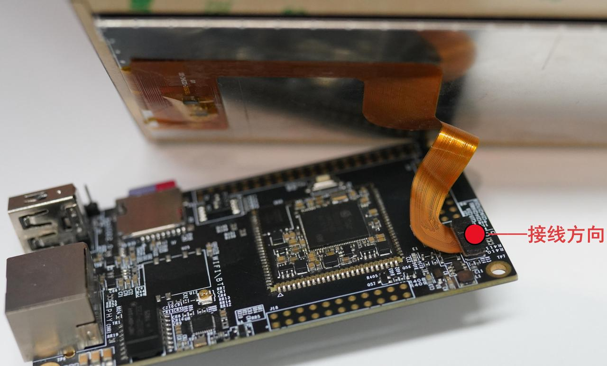

.. raw:: html

   

启动手册
=====================
注意：以下针对ubifs版本系统

开发板连接
-----------
**准备工作**

.. raw:: html

   

.. raw:: html

   

+--------------+--------+
| 检查并核对开发板配件  |
+==============+========+
| 开发板       | 1个    |
+--------------+--------+
| TYPEC数据线  | 1条    |
+--------------+--------+
| TTL串口模块  | 1个    |
+--------------+--------+
**屏幕接法注意事项**

- 请严格按照上图所示屏幕接法进行，接口没有防呆
- 接反会导致屏幕及板子损坏

**检查电源开关**

把开发板的电源开关“SW1”的“o”按下，以确保开发板电源开关处于断开状态。

**串口参数设置**

+--------+--------+--------+--------+
| 波特率 | 数据位 | 停止位 | 校验位 |
+========+========+========+========+
| 115200 | 8bit   | 1bit   | none   |
+--------+--------+--------+--------+

**拨码设置以及TTL串口模块**

启动拨码模式：1: on， 2: on， 3: off， 4 : off

**TTL串口模块接法**

采用TTL串口模块，调试串口座子为J3，按以下CPU的对应端和TTL模块的管脚连接起来

+-------------+----------------------------+----------------------------+----------------------------+
| **CPU端**   | J3_1: RX管脚(正方形焊盘)   | J3_2: TX管脚               |   J3_3: 地                 |
+-------------+----------------------------+----------------------------+----------------------------+
| **TTL端**   | TX管脚                     |RX管脚                      |  GND                       |
+-------------+----------------------------+----------------------------+----------------------------+

**下载线的连接**

使用 TYPE-C 数据线，一端接开发板 Type-C 接口，另一端连接电脑 USB 口。

**电源线的连接**

可选 5V/2A 规格 DC 电源供电，也可通过 Type-C 数据线由 PC 端 USB 完成供电。

启动开发板
-----------
**为开发板上电**

拨码设置

启动拨码模式：1: on， 2: on， 3: off， 4 : off

开发板的启动信息解读
-----------
**U-Boot 信息**

上电后串口依次打印 SPINAND 闪存初始化、DDR 内存检测、环境变量加载信息，输出U-Boot 2021.10版本、SigmaStar pcupid 主控、128MiB DRAM 容量、SPI NAND 参数、MTD 分区地址列表，默认自动倒计时启动内核，倒计时期间按下按键可终止自动启动进入 U-Boot 命令行。

**内核信息**

U-Boot 加载并解压 Linux 镜像，打印Linux version 6.1.111-rt42内核版本、四核 ARMv7 处理器信息、内存分区配置、设备树匹配信息；依次输出多核初始化、各外设（I2C/SPI/ 以太网 / 音频 / NAND/UBIFS）驱动加载日志、NAND 闪存分区信息；最终挂载 squashfs 格式根文件系统与 UBIFS 数据分区，进入用户初始化脚本。

开发板的登录
-----------
**串口登录**

.. code-block:: shell

   #用TTL模块，把电脑和板子连接起来。插入TYPEC线，开机
   # 用户名是root，没有密码，直接敲回车登陆
   U-Boot 2021.10 (Aug 04 2025 - 14:14:26 +0000)
   
   SoC: SigmaStar pcupid
   Model: PCUPID
   Version: P###g#######
   DRAM:  128 MiB
   WDT:   Not found!
   NAND:  SPI 104M
   [SPINAND] RFC use command 0x6b
   [SPINAND] dummy clock 0x8
   [SPINAND] Program with command 0x32.
   [SPINAND] Random with command 0x34.
   [FLASH] BDMA mode.
   spi clk already initialized
   [FLASH] dev_id = 0xee
   [FLASH] mfr_id = 0xc8, dev_id= 0x91 id_len = 0x2
   128 MiB
   MMC:   Fail to get pad(0x20309) ip(0x2_8)  form padmux !
   ......
   mi wbc debug init success
   mi pspi debug init success
   mi GFX debug init success
   mi scl debug init success
   mi isp debug init success
   mi FB debug init success
   mi vdisp debug init success
   mi ipu debug init success
   module [debug] init
   pad 0 register
   pad 2 register
   [emac_phy_link_adjust] EMAC Link Down 
   Starting system message bus: Gadget configfs UDC:1f284200.msb250x-udc-p0
   done
   Starting iptables: CMDQ - IRQ Request 0 
   OK
   Starting bluetoothd: OK
   Starting network: OK
   Starting crond: OK
   Starting sshd: OK
   
   Welcome to MYZR-SSD2351-EK112
   myzr login: 
   Welcome to MYZR-SSD2351-EK112
   myzr login: 

**adb连接登陆**

.. code-block:: shell

   #需要TYPEC线供电#打开win10电脑的cmd输入终端#输入adb shell和ls,如下：
   adb shell
   * daemon not running. starting it now on port 5037 *
   * daemon started successfully *
   root@myzr:~#
   可以看到文件，说明已经登录完成

**网线ssh登录**

.. code-block:: shell

   #需要插上网线和配置IP地址(我的电脑IP地址为192.168.137.99)
   #板子默认IP地址为192.168.137.81
   #可以串口软件登陆，如
   #点击串口file->New
   #设置Protocol选择SSH 
   #host设置为192.168.137.81
   #点击Connect连接#用户名是root，没有密码，直接敲回车登陆，如下
   Connecting to 192.168.137.81:22...
   Connection established.
   To escape to local shell, press 'Ctrl+Alt+]'.
   
   WARNING! The remote SSH server rejected X11 forwarding request.
   root@myzr:~# 
   root@myzr:~# 
   root@myzr:~# 
