测试指导
==========

产品测试指导
-------------

网口0测试
~~~~~~~~~~~

1. 用网线将主机与开发板网口1相连，并将主机IP地址改为与网关同一网段，如192.168.131.99

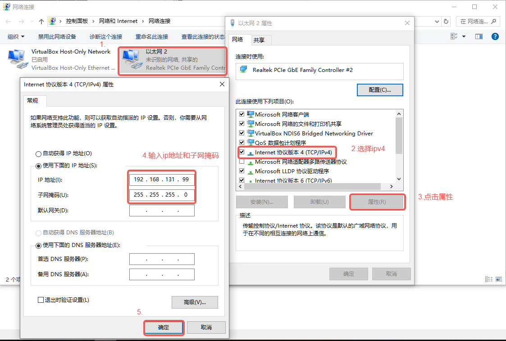

2. 打开串口终端如xhell,输入网关默认ip地址192.168.131.81,协议选择ssh，最后点连接

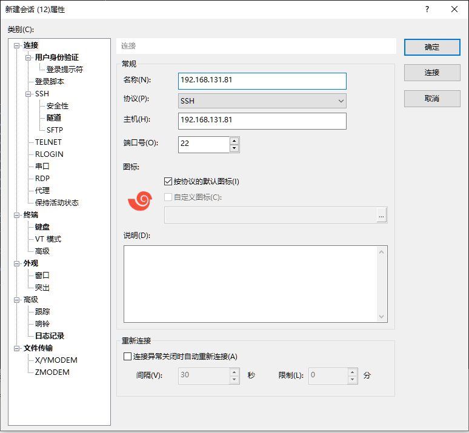

3. 连接成功后弹出如下信息接收主机密钥，点击接收并保存

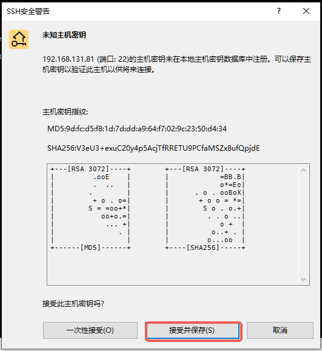

4. 保存后弹出如下，输入用户名root，点击确定

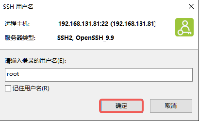

5. 能进入系统表示网口ssh登录成功

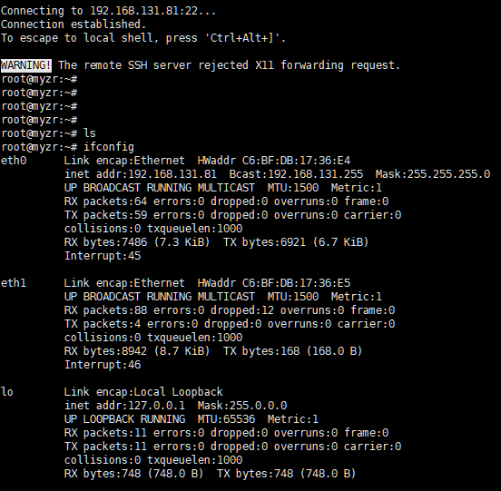

网口1测试
~~~~~~~~~~~

|  【测试说明】：采用开发板向PC发送ICMP报文的方式进行测试
|  【接口标识】：J2
|  【系统设备】：/dev/eth1
|  【测试操作】：

1. 使用网线连接开发板网口和电脑的网口，串口显示信息：

.. code-block:: shell

   [emac_phy_link_adjust] EMAC Link Up

2. 获取网口1 IP地址，输入指令如下：

.. code-block:: shell

   udhcpc -i eth1

3. 输出信息如下：

.. code-block:: shell

   udhcpc: started, v1.37.0
   udhcpc: broadcasting discover
   udhcpc: broadcasting select for 192.168.128.194, server 192.168.128.1
   udhcpc: lease of 192.168.128.194 obtained from 192.168.128.1, lease time 300
   deleting routers
   adding dns 192.168.128.1

4. 验证网口1网络，输入指令如下：

.. code-block:: shell

   ping -I eth1 www.baidu.com -c 3

5. 输出信息如下：“0% packet loss”表示测试通过

.. code-block:: shell

   PING www.baidu.com (183.2.172.177): 56 data bytes
   64 bytes from 183.2.172.177: seq=0 ttl=54 time=6.859 ms
   64 bytes from 183.2.172.177: seq=1 ttl=54 time=6.508 ms
   64 bytes from 183.2.172.177: seq=2 ttl=54 time=6.886 ms

   --- www.baidu.com ping statistics ---
   3 packets transmitted, 3 packets received, 0% packet loss
   round-trip min/avg/max = 6.508/6.751/6.886 ms

SD接口测试
~~~~~~~~~~~~~~

|  【测试说明】：插入TF卡。
|  【接口标识】：U19
|  【系统设备】：/dev/mmcblk0 mmcblk0p1
|  【测试操作】：

1. 将TF卡安装到SD接口，开发会输出如下信息：

.. code-block:: shell

   >> [Hal_CARD_SetBustiming] LS mode. <<
   SDMMC0 >> [Hal_CARD_SetBustiming] HS mode. <<

2. 输入如下指令，可查看sd卡信息：

.. code-block:: shell

   fdisk -l

|  信息如下

.. code-block:: shell

   Disk /dev/mmcblk0: 7388 MB, 7746879488 bytes, 15130624 sectors
   938 cylinders, 256 heads, 63 sectors/track
   Units: sectors of 1 * 512 = 512 bytes

   Device       Boot StartCHS    EndCHS        StartLBA     EndLBA    Sectors  Size Id Type
   /dev/mmcblk0p1 *  1023,255,63 1023,255,63       2048   15130623   15128576 7387M  c Win95 FAT32 (LBA)
   Partition 1 has different physical/logical start (non-Linux?):
        phys=(1023,255,63) logical=(0,32,33)
   Partition 1 has different physical/logical end:
        phys=(1023,255,63) logical=(938,40,40)

3. 将TF拔出，输出信息如下：

.. code-block:: shell

   SDMMC0 >> [Hal_CARD_SetBustiming] LS mode. <<
   SDMMC0 >> [Hal_CARD_SetBustiming] DEFS mode. <<

|  结果：操作时的现象符合正确预期，表示 TF 热插拔正常

RTC测试
~~~~~~~~~~~~~~~~

|  【测试说明】：读取并设置时间，断电重启后检查时间是否正确
|  【接口标识】：CON1
|  【系统设备】：/dev/rtc0
|  【测试操作】：

1. 设备通电，查看当前系统时钟，输入指令如下：

.. code-block:: shell

   date

|  输出信息：

.. code-block:: shell

   Sat Jan  1 00:26:33 UTC 2000

2. 查看rtc时钟，输入指令如下：

.. code-block:: shell

   hwclock

|  输出信息：

.. code-block:: shell

   Sat Jan  1 00:26:54 2000  0.000000 seconds

3. 设置系统时间，输入指令如下:

.. code-block:: shell

   date -s "2026-1-29 9:30:00"

4. 将系统时间写入rtc，并查看，输入指令如下：

.. code-block:: shell

   hwclock -w
   hwclock

5. 断电，查看有没有成功写入，输入指令如下：

.. code-block:: shell

   hwclock

|  输出信息：

.. code-block:: shell

   Thu Jan 29 09:32:10 2026  0.000000 seconds

|  结果：与系统时间差不多并继续走，表示成功写入rtc。

RS232测试
~~~~~~~~~~~~~~~

|  【测试说明】：短接232_TX1,232_RX1  232_TX2,232_RX2进行自收发测试
|  【接口标识】：​232_TX1,232_RX1  232_TX2,232_RX2
|  【系统设备】：/dev/ttyS4,ttyS5
|  【测试操作】：

1. 用杜邦线短接232_TX1,232_RX1
2. 进入测试目录，输入指令如下：

.. code-block:: shell

   cd /customer/app/

3. 运行测试程序，输入指令如下：

.. code-block:: shell

   ./serial_test.out /dev/ttyS4 "www.myzr.com.cn"

|  输出信息如下：

.. code-block:: shell

   Starting send data...finish
   Starting receive data:
   ASCII: 0x77          Character: w 
   ASCII: 0x77          Character: w 
   ASCII: 0x77          Character: w 
   ASCII: 0x2e          Character: . 
   ASCII: 0x6d          Character: m 
   ASCII: 0x79          Character: y 
   ASCII: 0x7a          Character: z 
   ASCII: 0x72          Character: r 
   ASCII: 0x2e          Character: . 
   ASCII: 0x63          Character: c 
   ASCII: 0x6f          Character: o 
   ASCII: 0x6d          Character: m 
   ASCII: 0x2e          Character: . 
   ASCII: 0x63          Character: c 
   ASCII: 0x6e          Character: n 
   ASCII: 0x0          Character:  

4. 用杜邦线短接232_TX2,232_RX2
5. 进入测试目录，输入指令如下：

.. code-block:: shell

   cd /customer/app/

6. 运行测试程序，输入指令如下：

.. code-block:: shell

   ./serial_test.out /dev/ttyS5 "www.myzr.com.cn"

|  输出信息如下：

.. code-block:: shell

   Starting send data...finish
   Starting receive data:
   ASCII: 0x77          Character: w 
   ASCII: 0x77          Character: w 
   ASCII: 0x77          Character: w 
   ASCII: 0x2e          Character: . 
   ASCII: 0x6d          Character: m 
   ASCII: 0x79          Character: y 
   ASCII: 0x7a          Character: z 
   ASCII: 0x72          Character: r 
   ASCII: 0x2e          Character: . 
   ASCII: 0x63          Character: c 
   ASCII: 0x6f          Character: o 
   ASCII: 0x6d          Character: m 
   ASCII: 0x2e          Character: . 
   ASCII: 0x63          Character: c 
   ASCII: 0x6e          Character: n 
   ASCII: 0x0          Character:  

RS485测试
~~~~~~~~~~~~

|  【测试说明】：通过485-USB转换头与电脑互联进行收发测试
|  【接口标识】：485_A1,485_B1,485_A2,485_B2,485_A3,485_B3
|  【系统设备】：/dev/ttyS2，/dev/ttyS6，/dev/ttyS7
|  【测试操作】：​

1. 使用485-USB转换头连接开发板和电脑(A接A,B接B)
2. 使用Xshell打开对应串口,将波特率设置成115200，数据为8位，停止位1位
3. 进入测试目录，输入如下命令：

.. code-block:: shell

   cd /customer/app/

4. 运行测试，输入如下指令：

.. code-block:: shell

   ./serial_test.out /dev/ttyS2 "www.myzr.com.cn"

|  结果可以看到485串口终端输出

.. code-block:: shell

   www.myzr.com.cn

5. 在485串口终端输入123(不带显示），可在板子终端看到123

.. code-block:: shell

   root@myzr:/customer/app# ./serial_test.out /dev/ttyS6 "www.myzr.com.cn"
   Starting send data...finish
   Starting receive data:
   ASCII: 0xbf          Character: ¿ 
   ASCII: 0x7f          Character: 
   ASCII: 0xfb          Character: 
   ASCII: 0xbf          Character: ¿ 
   ASCII: 0xfe          Character: þ 
   ASCII: 0xbf          Character: ¿ 
   ASCII: 0xbe          Character: ¾ 
   ASCII: 0x80          Character:  
   ASCII: 0x31          Character: 1 
   ASCII: 0x32          Character: 2 
   ASCII: 0x33          Character: 3 
   ASCII: 0xd           Character: 

6. 其中485_A2,485_B2,对应ttyS6，485_A3,485_B3对应ttyS7，测试方法与上面一致。

继电器测试
~~~~~~~~~~~~

|  【测试说明】：对GPIO引脚进行设置高低电平进行测试吸合
|  【接口标识】：j8,j9
|  【系统设备】：
|  【测试操作】：​

1. 输入以下指令对（j8继电器）GPIO设置高低电平进行测试吸合

.. code-block:: shell

   echo 121 > /sys/class/gpio/export
   echo out > /sys/class/gpio/gpio121/direction
   echo 1 > /sys/class/gpio/gpio121/value
   echo 0 > /sys/class/gpio/gpio121/value

|  结果：会听继电器到吸合的声音

2. 输入以下指令对（j9继电器）GPIO设置高低电平进行测试吸合

.. code-block:: shell

   echo 122 > /sys/class/gpio/export
   echo out > /sys/class/gpio/gpio122/direction
   echo 1 > /sys/class/gpio/gpio122/value
   echo 0 > /sys/class/gpio/gpio122/value

|  结果：会听继电器到吸合的声音

LED测试
~~~~~~~~~~~~

|  【测试说明】：设置GPIO引脚高低电平来测试LED亮灭
|  【接口标识】：P3
|  【系统设备】：LED
|  【测试操作】：​

1. 输入以下指令对（中间灯）GPIO设置高电平进行亮灯测试

.. code-block:: shell

   echo 98 > /sys/class/gpio/export
   echo out > /sys/class/gpio/gpio98/direction
   echo 1 > /sys/class/gpio/gpio98/value

|  结果：中间灯亮则正常。

2. 输入以下指令对（中间灯）GPIO设置低电平进行灭灯测试

.. code-block:: shell

   echo 0 > /sys/class/gpio/gpio98/value

|  结果：中间灯灭则正常。

3. 输入以下指令对（底下灯）GPIO设置高电平进行亮灯测试

.. code-block:: shell

   echo 82 > /sys/class/gpio/export
   echo out > /sys/class/gpio/gpio82/direction
   echo 1 > /sys/class/gpio/gpio82/value

|  结果：底下灯亮则正常。

4. 输入以下指令对（底下灯）GPIO设置低电平进行灭灯测试

.. code-block:: shell

   echo 0 > /sys/class/gpio/gpio82/value

|  结果：底下灯灭则正常。

4G测试
~~~~~~~~~~

|  【测试说明】：4G连接成功后，开发板向外网发送ICMP报文来验证连接正常
|  【接口标识】：U38
|  【系统设备】：/dev/ttyUSB1，usb0
|  【测试操作】：

1. ​把4G天线连接到”U3”接口上，把SIM卡插到“J3”卡槽
2. 对4G_PWRKEY1引脚设置高电平来开机4G，输入命令如下：

.. code-block:: shell

   echo 98 > /sys/class/gpio/export
   echo out > /sys/class/gpio/gpio98/direction
   echo 1 > /sys/class/gpio/gpio98/value
   echo 64 > /sys/class/gpio/export
   echo out > /sys/class/gpio/gpio64/direction
   echo 1 > /sys/class/gpio/gpio64/value

3. 输入以下指令，适配启动4G

.. code-block:: shell

   echo -e "AT+QNETDEVCTL=3,1,1\r\n" > /dev/ttyUSB1

4. 输入以下指令，查看4G是否启动成功

.. code-block:: shell

   lsusb

|  输出信息如下，出现Quectel EC801E-CN表示成功，如果没有需等待1分钟：

.. code-block:: shell

   Bus 001 Device 001: ID 1d6b:0002 Linux 6.1.111-rt42 ehci_hcd EHCI Host Controller
   Bus 001 Device 003: ID 0bda:d723 Realtek 802.11n WLAN Adapter
   Bus 001 Device 002: ID 1a40:0101 USB 2.0 Hub
   Bus 001 Device 005: ID 2c7c:0903 Quectel EC801E-CN

5. 输入以下指令，获取IP

.. code-block:: shell

   udhcpc -i usb0

|  输出信息如下：

.. code-block:: shell

   udhcpc: started, v1.37.0
   udhcpc: broadcasting discover
   udhcpc: broadcasting select for 192.168.43.100, server 192.168.43.1
   udhcpc: lease of 192.168.43.100 obtained from 192.168.43.1, lease time 86400
   deleting routers
   adding dns 192.168.43.2
   adding dns 192.168.43.3

6. 输入以下指令，进行4G验证：

.. code-block:: shell

   ping -I usb0 www.baidu.com -c 3

|  输出信息如下：“0% packet loss”表示测试通过

.. code-block:: shell

   PING www.baidu.com (183.240.99.224): 56 data bytes
   64 bytes from 183.240.99.224: seq=0 ttl=51 time=56.363 ms
   64 bytes from 183.240.99.224: seq=1 ttl=51 time=56.105 ms
   64 bytes from 183.240.99.224: seq=2 ttl=51 time=55.599 ms

   --- www.baidu.com ping statistics ---
   3 packets transmitted, 3 packets received, 0% packet loss
   round-trip min/avg/max = 55.599/56.022/56.363 ms

WiFi STA测试
~~~~~~~~~~~~~~

|  【测试说明】：WiFi连接成功后，开发板向外网发送ICMP报文来验证连接正常
|  【接口标识】：U41
|  【系统设备】：​wlan0
|  【测试操作】：​

1. 把WIFI天线连接到”U40”接口上
2. 生成 SSID 的 WPA PSK 文件，MY-WIFI My202412是wifi名和密码，输入指令如下：

.. code-block:: shell

   wpa_passphrase MY-WIFI My202412 > /etc/wpa_supplicant.conf
   wpa_passphrase MYZR-WiFi-5G Myzr2012 > /etc/wpa_supplicant.conf

4. 连接，输入指令如下：

.. code-block:: shell

   wpa_supplicant -B -i wlan0 -c /etc/wpa_supplicant.conf

5. 输出信息：

.. code-block:: shell

   Successfully initialized wpa_supplicant
   nl80211: kernel reports: Authentication algorithm number required
   [  266.744713] IPv6: ADDRCONF(NETDEV_CHANGE): wlan0: link becomes ready

6. 获取IP，输入指令如下:

.. code-block:: shell

   udhcpc -i wlan0

|  输出信息,：

.. code-block:: shell

   udhcpc: started, v1.36.0
   udhcpc: broadcasting discover
   udhcpc: broadcasting select for 192.168.43.35, server 192.
   udhcpc: lease of 192.168.43.35 obtained from 192.168.43.1, lease time 3600
   deleting routers
   adding dns 192.168.43.1

7. 测试连接，输入指令如下：

.. code-block:: shell

   ping -I wlan0 www.baidu.com -c 3

|  输出信息：结果：”0% packet loss”表示wifi连接正常

.. code-block:: shell

   PING www.baidu.com (183.2.172.177) from 192.168.61.73 wlan0: 56(84) bytes of data.
   64 bytes from 183.2.172.177: icmp_seq=1 ttl=54 time=10.0 ms
   64 bytes from 183.2.172.177: icmp_seq=2 ttl=54 time=13.2 ms
   64 bytes from 183.2.172.177: icmp_seq=3 ttl=54 time=14.5 ms

   --- www.baidu.com ping statistics ---
   3 packets transmitted, 3 received, 0% packet loss, time 2003ms
   rtt min/avg/max/mdev = 10.031/12.576/14.482/1.872 ms

蓝牙
~~~~~~~

|  【测试说明】：网关连接成功后，网关与节点进行收发来验证连接正常
|  【接口标识】：U53
|  【系统设备】：/dev/ttyS3
|  【测试操作】：​

**连接两个开发板，一个蓝牙模块为G(mesh)为网关,一个蓝牙模块为N(mesh)为节点**

1. 两个终端都进入测试应用目录，输入命令如下：

.. code-block:: shell

   cd /customer/app

2. 在网关终端输入以下指令

.. code-block:: shell

   ./wg

|  输出信息如下，说明网关已连接节点

.. code-block:: shell

   ===== Bluetooth Gateway Config Tool (Linux) =====
   Serial port /dev/ttyS3 opened successfully (Baudrate: 4098)

   ===== Step 1: Read Gateway Info =====
   Send: E9 FF 0C 
   Recv: 1C 00 91 8B 01 AE 24 1C D2 6E BC B0 8E EA B1 B9 C8 EC D1 8A A3 00 00 00 11 22 33 44 00 00 03 00 91 8C 01 

   ===== Step 2: Set Gateway Key =====
   Send: E9 FF 09 AE 24 1C D2 6E BC B0 8E EA B1 B9 C8 EC D1 8A A3 00 00 00 11 22 33 44 01 00 
   Recv: 06 00 91 9A 11 22 33 44 

   ===== Step 3: Set Gateway Params =====
   Send: E9 FF 0D 01 00 02 19 B1 24 E7 99 B7 9B D3 10 82 B6 C8 A9 A9 56 

   ===== Step 4: Scan Nodes =====
   Send: E9 FF 00 

   ===== Step 5: Set Broadcast Filter =====
   Send: E9 FF 08 4E AC 57 38 C1 A4 

   ===== Step 6: Config Node Params =====
   Send: E9 FF 0A AE 24 1C D2 6E BC B0 8E EA B1 B9 C8 EC D1 8A A3 00 00 00 11 22 33 44 02 00 

   ===== Step 7: Bind Operation =====
   Send: E9 FF 0B 00 00 00 60 96 47 71 73 4F BD 76 E3 B4 05 19 D1 D9 4A 48 
   Recv: 09 00 91 B5 01 00 02 00 80 08 FF 
   Recv: 09 00 91 B5 01 00 02 00 80 08 FF 
   Recv: 03 00 91 8A 02 
   Recv: 03 00 91 82 01 

   ===== All Config Steps Completed. Serial Port Closed =====

3. 在节点终端输入以下指令，使节点进入接收状态

.. code-block:: shell

   ./serial_test.out /dev/ttyS1 1

4. 在网关终端输入以下指令，发送12345给节点

.. code-block:: shell

   ./n0x002

|  此时节点终端可以接收到12345，信息如下

.. code-block:: shell

   root@myzr:/customer/app# ./serial_test.out /dev/ttyS3 1
   Starting send data...finish
   Starting receive data:
   ASCII: 0x7          Character:  
   ASCII: 0x0          Character:  
   ASCII: 0x93          Character:  
   ASCII: 0x0          Character:  
   ASCII: 0x31          Character: 1 
   ASCII: 0x32          Character: 2 
   ASCII: 0x33          Character: 3 
   ASCII: 0x34          Character: 4 
   ASCII: 0x35          Character: 5 

5. 在网关终端输入以下指令，使网关进入接收状态

.. code-block:: shell

   ./serial_test.out /dev/ttyS1 1

6. 在节点终端输入以下指令，发送12345给网关

.. code-block:: shell

   ./a

|  此时网关终端可以接收到12345，信息如下

.. code-block:: shell

   root@myzr:/customer/app# ./serial_test.out /dev/ttyS3 1
   Starting send data...finish
   Starting receive data:
   ASCII: 0xc          Character: 

   ASCII: 0x0          Character:  
   ASCII: 0x91          Character:  
   ASCII: 0x81          Character:  
   ASCII: 0x3          Character:  
   ASCII: 0x0          Character:  
   ASCII: 0x1          Character:  
   ASCII: 0x0          Character:  
   ASCII: 0x52          Character: R 
   ASCII: 0x31          Character: 1 
   ASCII: 0x32          Character: 2 
   ASCII: 0x33          Character: 3 
   ASCII: 0x34          Character: 4 
   ASCII: 0x35          Character: 5 

7. 如果节点用模块的话，请使用串口软件，串口软件配置如下

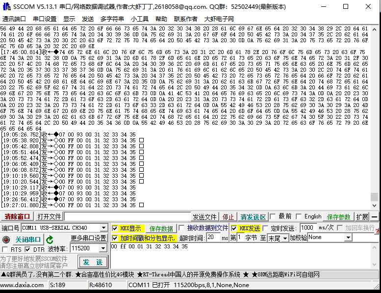

|  当网关运行./n0x002时，此页面会收到07 00 93 00 31 32 33 34 35
|  当用节点发送信息给网关时，请按此页面配置点击发送00 ff 00 01 31 32 33 34 35 36,点击发送前请在网关终端运行./serial_test.out /dev/ttyS1 1使网关进入接收状态，以接收节点发过来的12345

lora测试
~~~~~~~~~~~~~~~

|  【测试说明】：开启两个开发终端进行收发验证连接正常
|  【接口标识】：U51
|  【系统设备】：​/dev/ttyS3
|  【测试操作】：​

1. 把天线连接到”U51”接口上
2. 进入测试目录，输入以下指令

.. code-block:: shell

   cd /customer/app/

3. 配置工作模式(M0=1,M1=0),输入指令如下：（两个终端都需要配置）

.. code-block:: shell

   echo 96 > /sys/class/gpio/export
   echo out > /sys/class/gpio/gpio96/direction
   echo 1 > /sys/class/gpio/gpio96/value
   echo 97 > /sys/class/gpio/export
   echo out > /sys/class/gpio/gpio97/direction
   echo 0 > /sys/class/gpio/gpio97/value

4. 在终端2，输入指令如下：

.. code-block:: shell

   ./lora /dev/ttyS1 12345

5. 输出信息：

.. code-block:: shell

   Sent: 12345
   Entering receive mode...

6. 在终端1，输入指令如下:

.. code-block:: shell

   ./lora /dev/ttyS1 12345

7. 此时观察终端2，会接收输出信息如下：

.. code-block:: shell

   Sent: 12345
   Entering receive mode...
   Received: 123456

8. 此时关闭终端2接收，向终端1发送信息，输入指令如下：

.. code-block:: shell

   ^C（CTRL C 停止接收）
   ./lora /dev/ttyS3 12345

9. 此时观察终端1，会接收输出信息如下：

.. code-block:: shell

   Sent: 123456
   Entering receive mode...
   Received: 12345

do测试
~~~~~~~~~~~~~~

|  【测试说明】：验证输入输出功能
|  【接口标识】：OUT0+,OUT0-
|  【系统设备】：
|  【测试操作】：​​

1. DO测试接线图

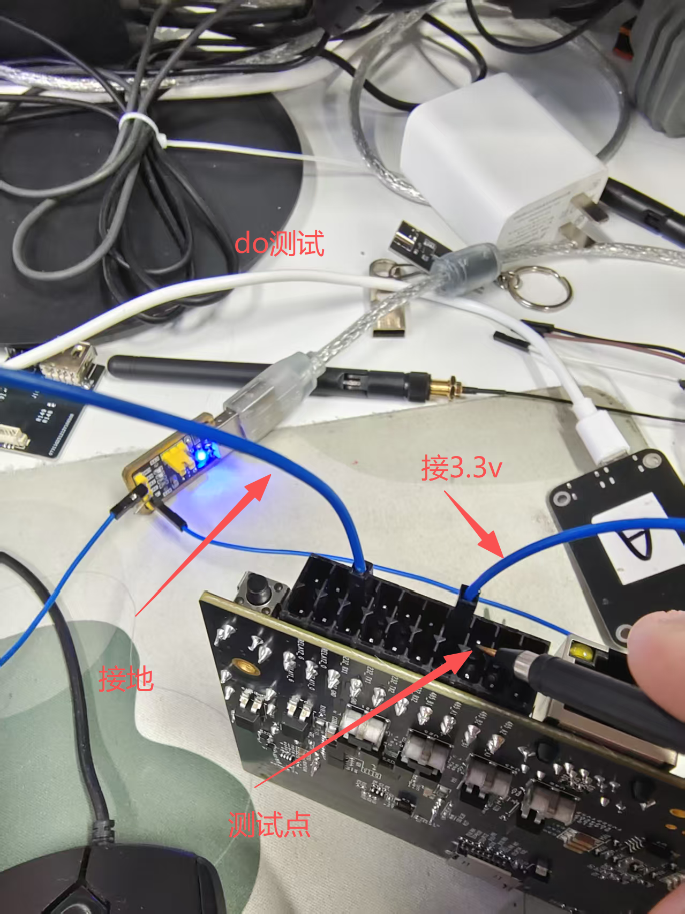

|  注意：电压设置3.3V，电流设置为0.1A，过流保护设置为0.12A。

2. OUT+引脚接3.3V电源，用示波器或万用表测OUT-引脚。OUT-默认是低电平，OUT+引脚接3.3V电源后，OUT-是3V-3.3V。也可以用以下指令查看引脚状态.
3. 输入以下指令，进行拉高测试

.. code-block:: shell

   echo 126 > /sys/class/gpio/export
   echo out > /sys/class/gpio/gpio126/direction
   echo 1 > /sys/class/gpio/gpio126/value

|  此时，用示波器或万用表测OUT-引脚，可以看到OUT-是3V-3.3V
|  也可以用以下指令查看引脚状态.

.. code-block:: shell

   echo 126 > /sys/class/gpio/export
   echo out > /sys/class/gpio/gpio126/direction
   cat /sys/class/gpio/gpio126/value

|  输出信息为1

4. 输入以下指令，进行拉低测试

.. code-block:: shell

   echo 126 > /sys/class/gpio/export
   echo out > /sys/class/gpio/gpio126/direction
   echo 0 > /sys/class/gpio/gpio126/value

|  此时，用示波器或万用表测OUT-引脚，可以看到OUT-是0V
|  也可以用以下指令查看引脚状态.

.. code-block:: shell

   echo 126 > /sys/class/gpio/export
   echo out > /sys/class/gpio/gpio126/direction
   cat /sys/class/gpio/gpio126/value

|  输出信息为0

di测试
~~~~~~~~~~~~~~~

|  【测试说明】：验证输入输出功能 
|  【接口标识】：IN0+,IN0-
|  【系统设备】：​
|  【测试操作】：

1. DI测试接线图

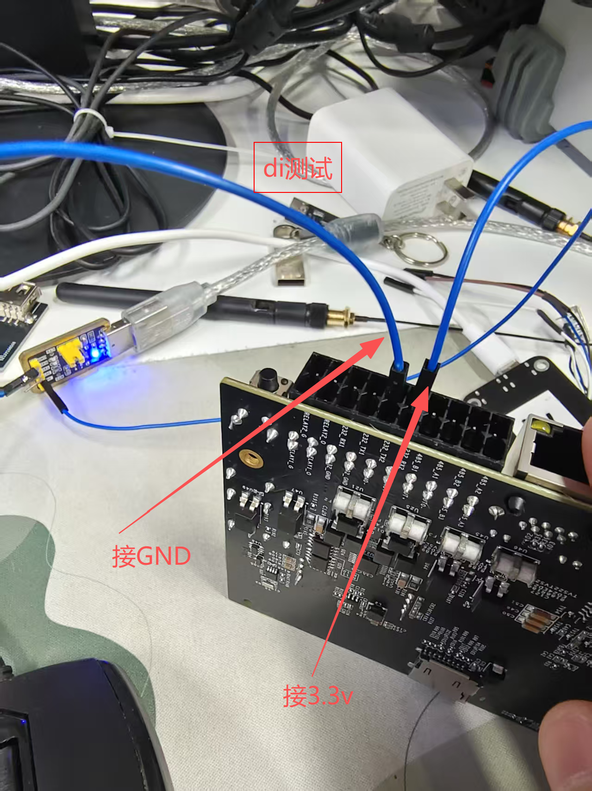

2. IN0+引脚接3.3V电源，IN0-引脚接地。

|  注意：电压设置3.3V，电流设置为0.1A，过流保护设置为0.12A。

3. IN0+引脚接3.3V电源不开启时，读取电平为1。

.. code-block:: shell

   echo 125 > /sys/class/gpio/export
   echo in > /sys/class/gpio/gpio125/direction
   cat /sys/class/gpio/gpio125/value

|  测试结果：显示1表示成功

.. code-block:: shell

   root@myzr:~# cat /sys/class/gpio/gpio125/value
   1

|  IN0+引脚接3.3V电源，IN0-引脚接地开启时，读取电平为0。

.. code-block:: shell

   echo 125 > /sys/class/gpio/export
   echo in > /sys/class/gpio/gpio125/direction
   cat /sys/class/gpio/gpio125/value

|  测试结果：显示0表示失败

.. code-block:: shell

   root@myzr:~# cat /sys/class/gpio/gpio125/value
   0

RS485与MQTT透传示例
~~~~~~~~~~~~~~~~~~~~~

1、目标
***********

|  将 RS485 电表（dds1079）的数据，通过网关转换为 MQTT 消息，上报到 MQTT 服务器，用户在电脑上的 MQTT 客户端就能看到电表数据。
|  涉及设备

  - 网关开发板（内置 RS485 与以太网接口，运行网关程序）
  - RS485 电表 dds1079（或等效设备）
  - 客户电脑（用于网页配置 + MQTT 客户端）
  - MQTT 服务器（可以是公网的 broker.emqx.io，也可以是客户自建）

2、设备连接
*****************

|  RS485连接

1. 准备一根 RS485 通讯线 （A/B 两芯，或差分线）。
2. 将 RS485 接线端子与网关的 RS485 接口对应连接：

  - 电表 A ↔ 网关 A2
  - 电表 B ↔ 网关 B2
  - 电表GND↔ 网关GND

3. 确认电表和网关都上电正常：

  - 电表显示屏/指示灯正常；
  - 网关电源指示灯、RUN 指示灯正常。

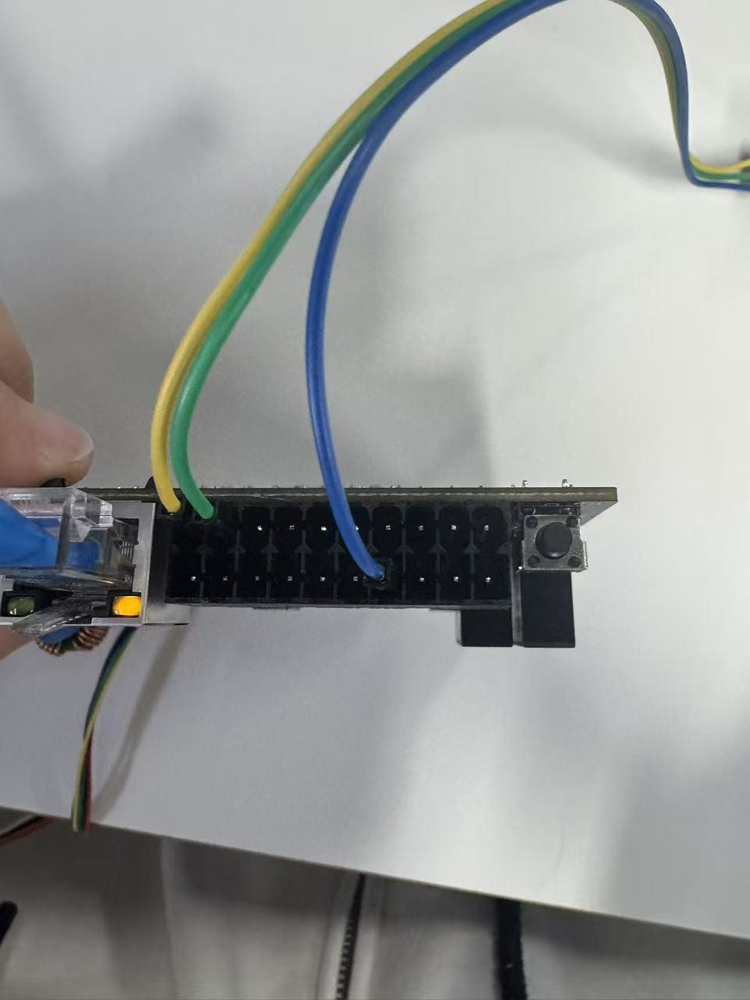

3、网口连接
*******************

|  ETH1 -- WAN: DHCP
|  BR0 -- LAN: 192.168.9.1
|  BR0 (ETH2, WLAN0, WLAN1)

1. 先通过网线将主机和开发板连接，通过静态ip，192.168.137.81进入网址首页找到MAC地址并记住。

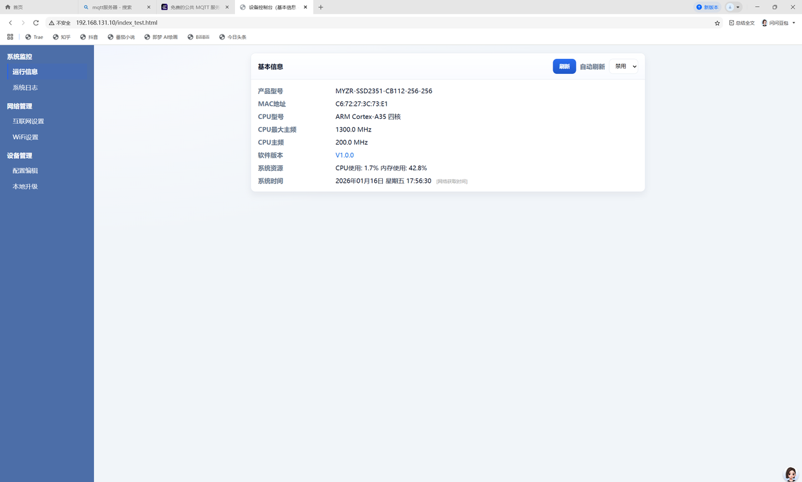

 
|  这里的MAC地址是C6:72:27:3C:73:E1

2. 进入主机cmd命令端，输入命令arp -a | find /i "c6-72-27-3c-73-e1"来找到

3. 在网站中输入命令端进入网页

4 、网页配置
********************

|  进入左侧配置编辑，当前界面可以对配置文件进行修改，Device 是设备，UART 是串口，MQTT 是服务器 ，三者通过 object/interface 串起来”。

设备列表配置
+++++++++++++

参数说明
##########

- **interface (接口名称)**

  - 含义 ：该采集任务的唯一识别名。
  - 说明 ：建议设置为设备型号或安装位置（如 dds1079 ），方便在日志和数据平台中区分不同的设备。

- **status (启用状态)**
  
  - 含义 ：该任务的开关。
  - 说明 ：设置为 enabled 表示立即开始采集；设置为 disabled 表示暂时停止该任务。

- **command (采集指令)**
  
  - 含义 ：发送给物理设备的原始指令报文。
  - 说明 ：通常为十六进制格式（Hex）。例如，图中是一串读取电表数据的 Modbus 或 DL/T 645 协议指令。

- **period (采集周期)**
  
  - 含义 ：两次采集之间的时间间隔。
  - 说明 ：单位为 毫秒 。例如设置为 1000 表示每隔 1 秒钟向设备发送一次指令。

- **action (处理动作)**
  
  - 含义 ：获取到设备回传数据后的处理方式。
  - 说明 ：常用 forward （转发），表示将采集到的原始数据直接转发给服务器或云平台。

- **object (物理端口)**
  
  - 含义 ：指令通过哪个硬件接口发出去。
  - 说明 ：例如 uart2 代表开发板上的第 2 个串口（通常对应板子上的 RS485 接口）。

- **format (数据格式)**
  
  - 含义 ：通信时使用的数据编码形式。
  - 说明 ： hex 代表十六进制（工业设备最常用）；也可以根据需求配置为 string （字符串）或 json 。
  
**示例：**

|  本次示例按照图中配置

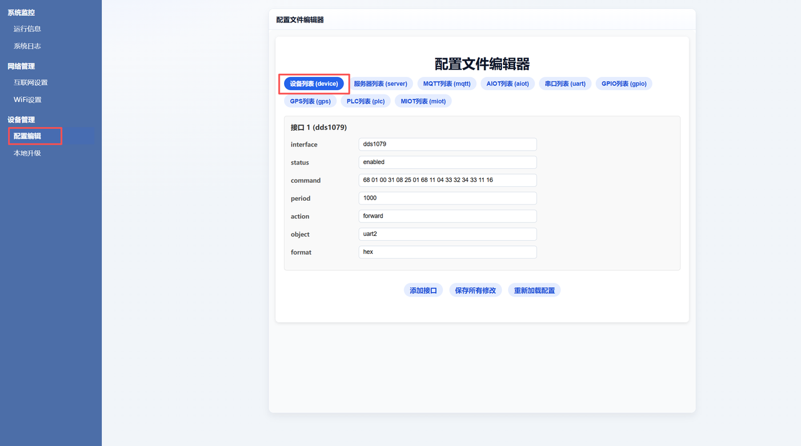

串口列表配置
+++++++++++++++++

参数说明
##########

- **interface (接口名称)**

  - 含义 ：该串口配置的内部识别名。
  - 说明 ：通常命名为 uart1 、 uart2 等，用于在其他配置中引用此串口。

- **status (启用状态)**

  - 含义 ：是否激活该串口。
  - 说明 ： enabled 为开启， disabled 为关闭。若不使用该串口，建议关闭以节省资源。

- **device (设备路径)**

  - 含义 ：硬件串口在 Linux 系统中的物理地址。
  - 说明 ：例如 /dev/ttyS1 。这直接对应开发板上的某个物理接线端子，通常无需用户修改。

- **baud_rate (波特率)**

  - 含义 ：串口通信的传输速率。
  - 说明 ：必须与连接的外部设备一致。常见值有 9600 、 115200 等。

- **data_bits / stop_bits / parity (数据位/停止位/校验位)**

  - 含义 ：串口通信的基础底层协议参数。
  - 说明 ：工业标准通常为 8 位数据位、 1 位停止位、 none （无）校验。需根据外部设备手册进行匹配。

- **flow_control (流控)**

  - 含义 ：数据传输的流量控制方式。
  - 说明 ：通常设置为 none 。除非设备明确要求硬件或软件流控，否则不建议开启。

- **udelay (微秒延迟)**

  - 含义 ：串口读写操作后的强制等待时间。
  - 说明 ：单位为 微秒 。用于适配一些响应较慢的老旧工业设备，通常设置为 0 。

- **action / object (处理动作/转发对象)**

  - 含义 ：串口收到数据后的去向。
  - 说明 ：例如 action 为 forward ， object 为 server1 ，表示串口收到的所有原始数据都会立即转发给配置好的服务器。

- **format (数据格式)**

  - 含义 ：数据的表现形式。
  - 说明 ： string 代表文本字符串形式， hex 代表十六进制原始字节。

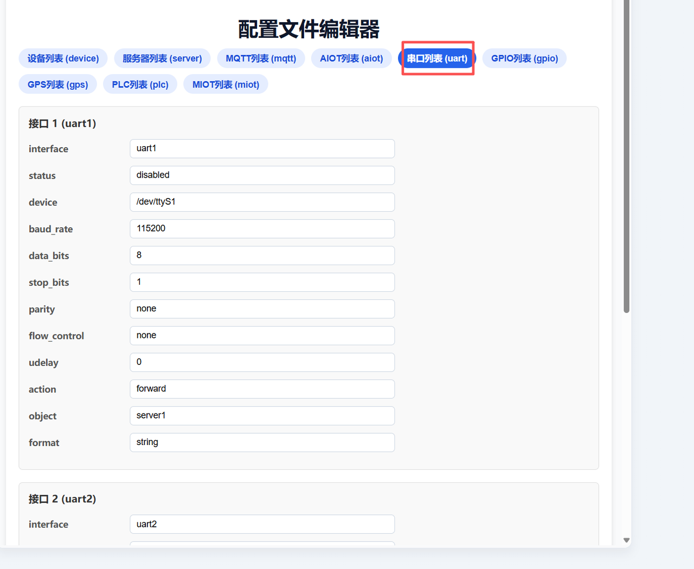

**示例**

|  本次使用uart2接口，设备路径为图ttyS6，具体配置如图所示

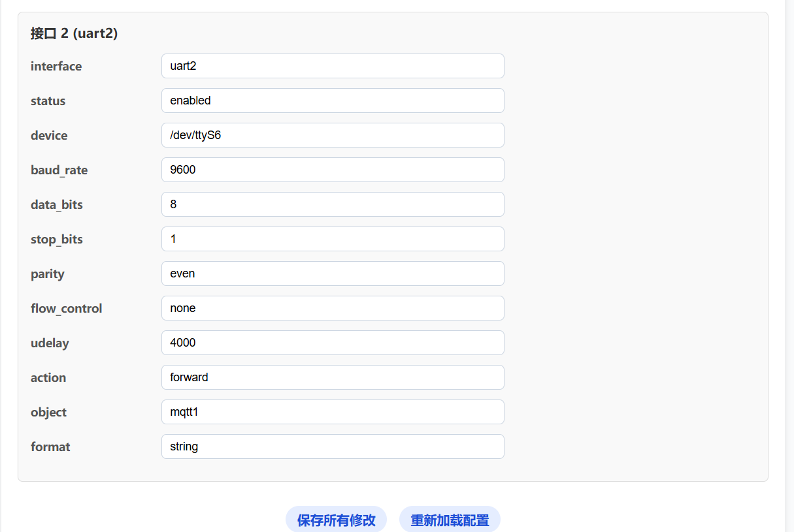

MQTT列表配置
++++++++++++++++

参数说明
###############

- **interface (接口名称)**

  - 含义 ：该 MQTT 连接的唯一识别名。
  - 说明 ：用于区分不同的云平台连接（如 mqtt1 、 mqtt2 ）。

- **status (启用状态)**

  - 含义 ：是否开启此 MQTT 连接。
  - 说明 ：设置为 enabled 后，开发板会尝试连接云端服务器。

- **serverURL (服务器地址)**

  - 含义 ：MQTT 服务器（Broker）的域名或 IP 地址。
  - 说明 ：例如 broker.emqx.io 。这是数据上报的目的地。

- **clientId (客户端 ID)**

  - 含义 ：开发板在云端的“身份证号”。
  - 说明 ：必须保证在同一个服务器上是唯一的，通常用于云平台识别具体的网关设备。

- **username / password (用户名 / 密码)**

  - 含义 ：连接云平台所需的身份验证凭据。
  - 说明 ：如果服务器开启了安全认证，需在此填写正确的账号密码。

- **topic_sub (订阅主题)**

  - 含义 ：开发板“听”哪个频道。
  - 说明 ：开发板会监听此主题，用于接收来自云端的远程控制指令。

- **topic_pub (发布主题)**

  - 含义 ：开发板“说”哪个频道。
  - 说明 ：开发板采集到的所有数据都会通过这个主题发布到云端。

- **payload (测试负载)**

  - 含义 ：默认的发送内容。
  - 说明 ：通常用于心跳包或测试连接是否正常。

- **qos (服务质量)**

  - 含义 ：消息传输的可靠性等级。
  - 说明 ：可选 0 （最多一次）、 1 （至少一次）、 2 （只有一次）。工业场景建议设为 1 。

- **timeout (超时时间)**

  - 含义 ：网络响应等待时间。
  - 说明 ：单位为 毫秒 。在网络环境较差时，可适当调大此值。

- **action / object / format (处理动作 / 转发对象 / 数据格式)**

  - 含义 ：云端指令下发后的去向。
  - 说明 ：例如 action 为 forward ， object 为 uart2 ， format 为 hex 。这意味着：云端下发的 MQTT 消息会自动转换成十六进制，并从 RS485 串口发给现场设备。

**示例**

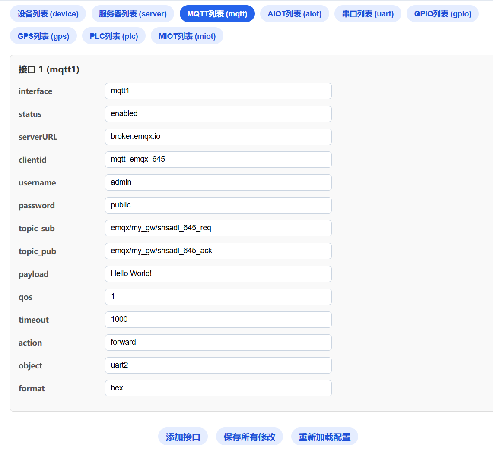

**完成这三个列表的修改后本次示例的网页配置完成，下一步对串口调试工具进行配置**

5、电脑
**************

|  进入串口调试工具

|  默认界面如图所示：

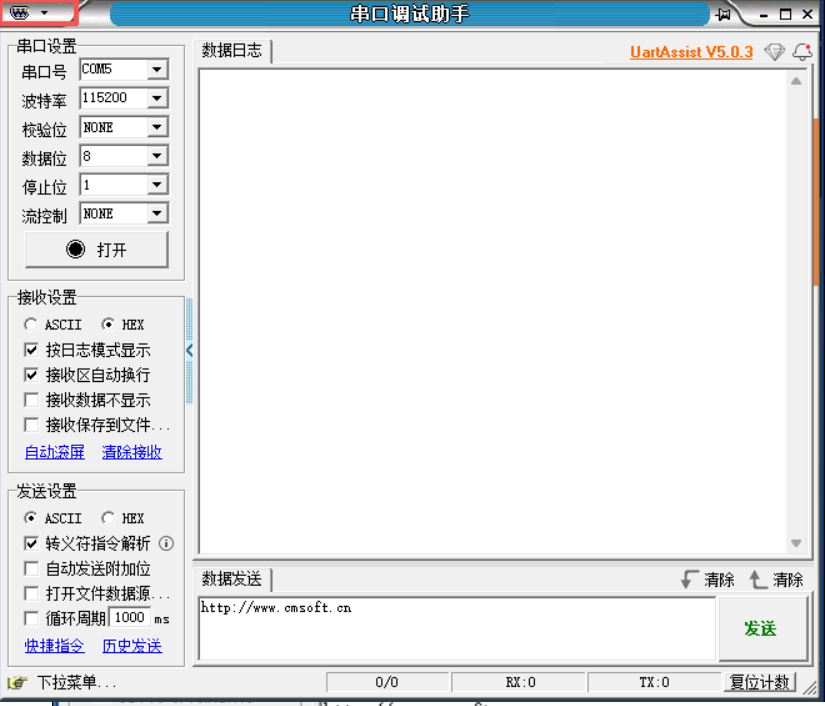

|  点击左上角图标->工具->自动应答控制，打开右侧工具栏后点击右侧自动应答

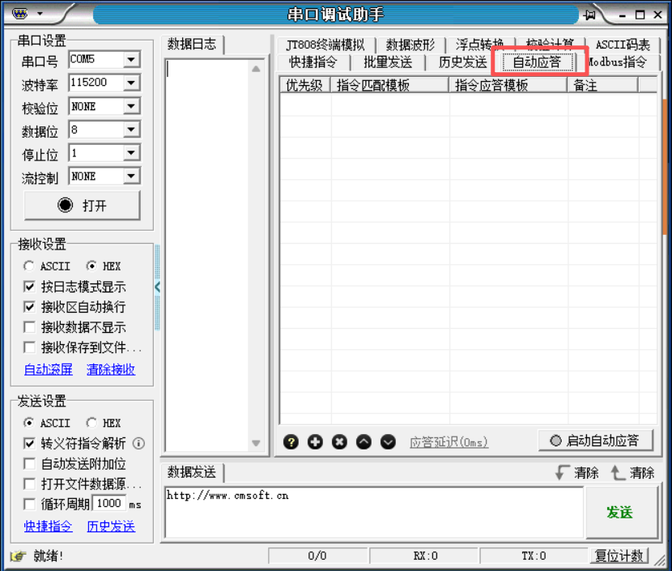

|  对着右侧空白处点击右键->导入
|  将电表配置.cfg导入到自动应答中

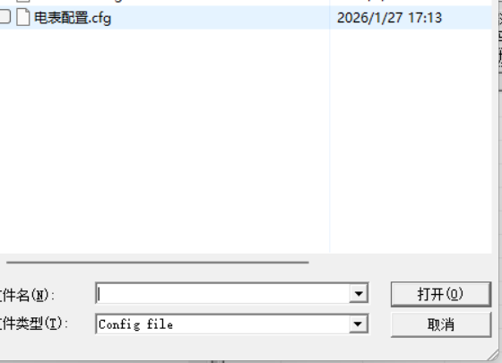

|  导入完成后如图所示：

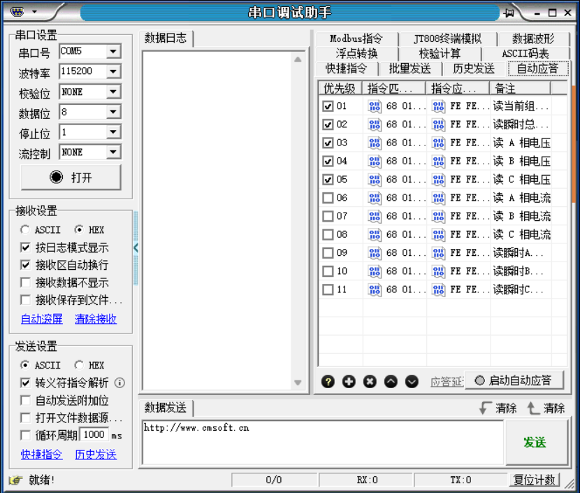

|  随后启动自动应答

|  串口设置配置
   本次示例串口设置按照图中左侧所示：

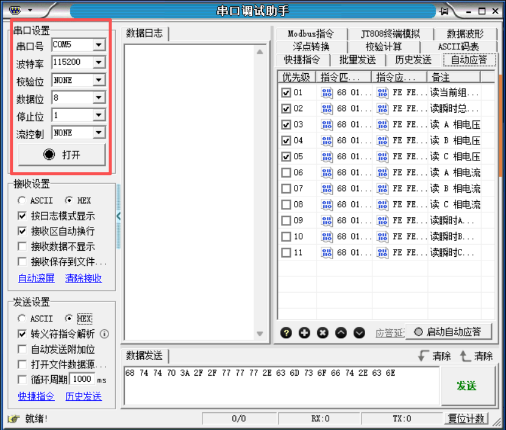

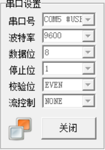

|  设置完成后点击启动将接收设置和发送设置都设置成hex

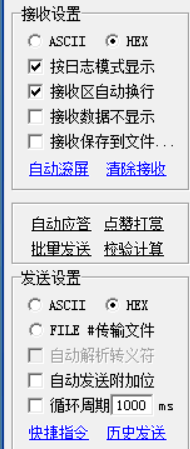

|  完成配置开启串口
|  随后数据日志会有数据输出为完成启动：

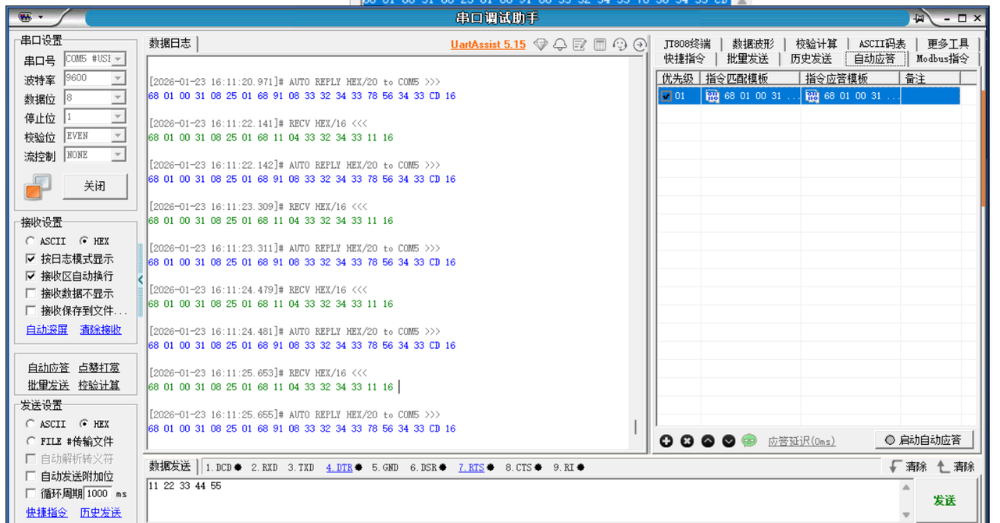

|  串口调试助手配置完成
  
**MQTT客户端配置**

|  在电脑上安装 MQTT 客户端工具（推荐 MQTTX 或 mosquitto_sub）。
|  点击左上角添加连接

  
|  使用与网关中 serverURL 一致的 MQTT 服务器信息建立连接：

  - 服务器地址：例如 broker.emqx.io 或客户自建 IP
  - Port： 1883 （若无特殊说明）
  - username/password：可以默认为：admin和public
  - Client ID：一定不要和配置文件中的clientid一致，否则开发板的clientid会被踢掉

|  点击右上角connect进行连接
|  可以参考配置编辑中的mqtt列表进行配置。

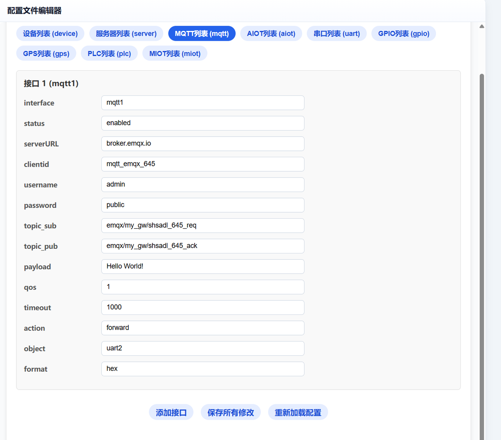

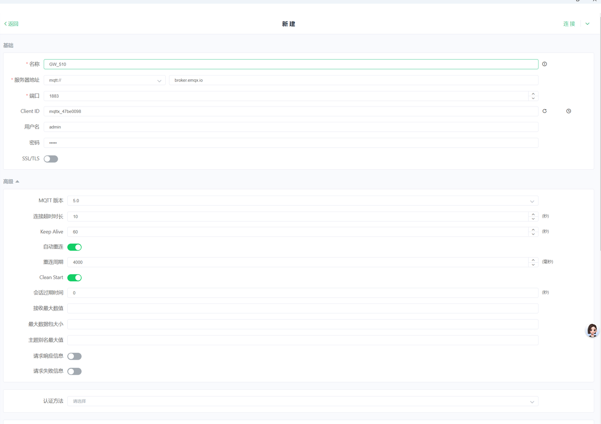

|  完成连接后点击添加订阅，可以参考配置文件的topic进行编辑。
|  本次示例：

|  如果你想看网关上传的数据（电表读数）
|  MQTTX 的 Topic 框里填： emqx/my_gw/shsadl_645_ack

|  如果你想看网关接收到的指令
|  MQTTX 的 Topic 框里填： emqx/my_gw/shsadl_645_req

|  按照之前已经完成的mqtt列表的配置来填

|  最推荐的填法（全通配符）
|  如果你想同时看到上面两种数据，直接填： emqx/my_gw/#

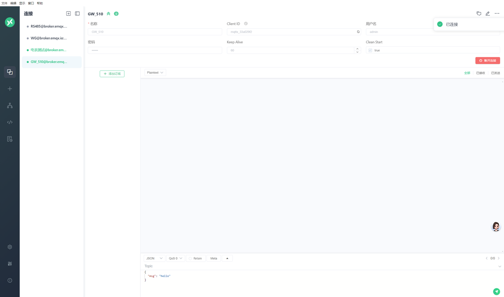

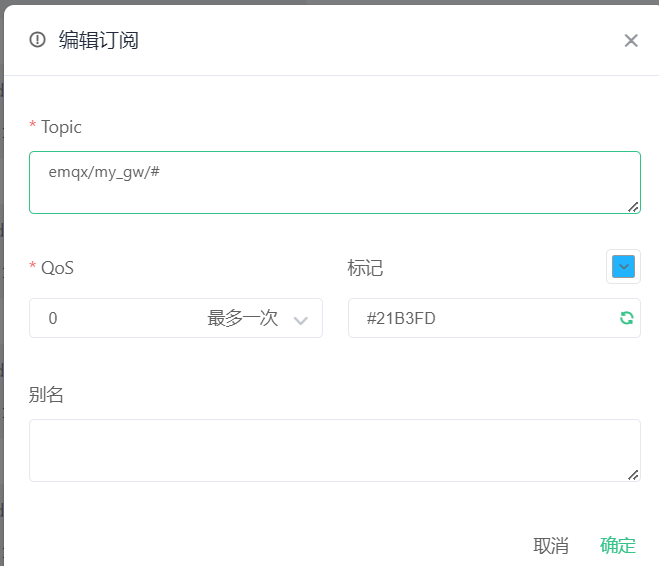

  
|  完成订阅后可以查看mqtt订阅端就配置完成了，就会弹出电表数据如图所示。

|  注意：开发板启动后会自动执行miot程序。

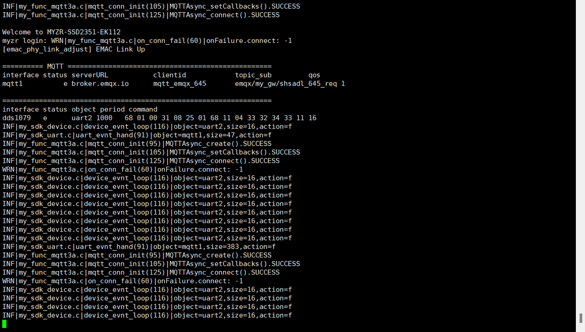

|  如果想终止
|  输入root进入登录后输入/etc/init.d/S99miot stop

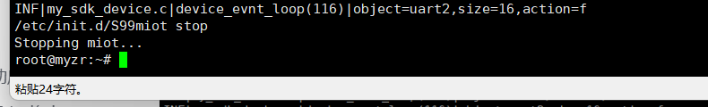

开发板测试指导
------------------

注意：以下针对ubifs版本系统

UART测试
~~~~~~~~~~~~

**UART1配置和测试**

.. code-block:: shell

   #设备接口：/dev/ttyS1
   #测试说明：把J4:9(OUTP_RX0_CH0_FUART1_RX)管脚和J4:10(OUTN_RX0_CH0_FUART1_TX)管脚短接.
   $ cd /customer/app/
   $ ./serial_test.out /dev/ttyS1 "www.myzr.com.cn"
   Starting send data...finish
   Starting receive data:
   ASCII: 0x77      Character: w
   ASCII: 0x77      Character: w
   ASCII: 0x77      Character: w
   ASCII: 0x2e      Character: .
   ASCII: 0x6d      Character: m
   ASCII: 0x79      Character: y
   ASCII: 0x7a      Character: z
   ASCII: 0x72      Character: r
   ASCII: 0x2e      Character: .
   ASCII: 0x63      Character: c
   ASCII: 0x6f      Character: o
   ASCII: 0x6d      Character: m
   ASCII: 0x2e      Character: .
   ASCII: 0x63      Character: c
   ASCII: 0x6e      Character: n
   ASCII: 0x0       Character:

**UART2配置和测试**

.. code-block:: shell

   #设备接口：/dev/ttyS2
   #测试说明：把J4:7(OUTP_RX0_CH2_FUART2_RX)管脚和J19:8(OUTN_RX0_CH2_FUART2_TX)管脚短接.
   $ cd /customer/app/
   $ ./serial_test.out /dev/ttyS2 "www.myzr.com.cn"
   Starting send data...finish
   Starting receive data:
   ASCII: 0x77      Character: w
   ASCII: 0x77      Character: w
   ASCII: 0x77      Character: w
   ASCII: 0x2e      Character: .
   ASCII: 0x6d      Character: m
   ASCII: 0x79      Character: y
   ASCII: 0x7a      Character: z
   ASCII: 0x72      Character: r
   ASCII: 0x2e      Character: .
   ASCII: 0x63      Character: c
   ASCII: 0x6f      Character: o
   ASCII: 0x6d      Character: m
   ASCII: 0x2e      Character: .
   ASCII: 0x63      Character: c
   ASCII: 0x6e      Character: n
   ASCII: 0x0       Character:

**UART3配置和测试**

.. code-block:: shell

   #配置(默认禁止，配置为MIPI接口，如果要用，需要打开配置,屏蔽)
   $ vim arch/arm/boot/dts/pcupid-ssm001c-s01a-voip-padmux.dtsi
   
   #增加（需要屏蔽到PAD_OUTP_CH0和PAD_OUTN_CH0其他管脚配置）
   //UART3 Mode2
   <PAD_OUTP_CH0  MDRV_PUSE_UART3_TX>,
   <PAD_OUTN_CH0  MDRV_PUSE_UART3_RX>,
   
   #设备接口：/dev/ttyS3
   #测试说明：把J19:5(OUTP_TX0_CH0_MIPITX_D0P)管脚和J19:6(OUTN_TX0_CH0_MIPITX_D0N)管脚短接.
   $ cd /customer/app/
   $ ./serial_test.out /dev/ttyS3 "www.myzr.com.cn"
   Starting send data...finish
   Starting receive data:
   ASCII: 0x77    Character: w
   ASCII: 0x77    Character: w
   ASCII: 0x77    Character: w
   ASCII: 0x2e    Character: .
   ASCII: 0x6d    Character: m
   ASCII: 0x79    Character: y
   ASCII: 0x7a    Character: z
   ASCII: 0x72    Character: r
   ASCII: 0x2e    Character: .
   ASCII: 0x63    Character: c
   ASCII: 0x6f    Character: o
   ASCII: 0x6d    Character: m
   ASCII: 0x2e    Character: .
   ASCII: 0x63    Character: c
   ASCII: 0x6e    Character: n
   ASCII: 0x0     Character:

**UART4配置和测试**

.. code-block:: shell

   #设备接口：/dev/ttyS1
   #测试说明：把J4:9(OUTP_RX0_CH0_FUART1_RX)管脚和J4:10(OUTN_RX0_CH0_FUART1_TX)管脚短接.
   $ cd /customer/app/
   $ ./serial_test.out /dev/ttyS1 "www.myzr.com.cn"
   Starting send data...finish
   Starting receive data:
   ASCII: 0x77      Character: w
   ASCII: 0x77      Character: w
   ASCII: 0x77      Character: w
   ASCII: 0x2e      Character: .
   ASCII: 0x6d      Character: m
   ASCII: 0x79      Character: y
   ASCII: 0x7a      Character: z
   ASCII: 0x72      Character: r
   ASCII: 0x2e      Character: .
   ASCII: 0x63      Character: c
   ASCII: 0x6f      Character: o
   ASCII: 0x6d      Character: m
   ASCII: 0x2e      Character: .
   ASCII: 0x63      Character: c
   ASCII: 0x6e      Character: n
   ASCII: 0x0       Character:

**UART5配置和测试**

.. code-block:: shell

   #设备接口：/dev/ttyS5
   #测试说明：把J18:1(GPIOE_07_UART5_TX)管脚和J18:2(GPIOE_06_UART5_RX)管脚短接.
   $ cd /customer/app/
   $ ./serial_test.out /dev/ttyS5 "www.myzr.com.cn"
   Starting send data...finish
   Starting receive data:
   ASCII: 0x77    Character: w
   ASCII: 0x77    Character: w
   ASCII: 0x77    Character: w
   ASCII: 0x2e    Character: .
   ASCII: 0x6d    Character: m
   ASCII: 0x79    Character: y
   ASCII: 0x7a    Character: z
   ASCII: 0x72    Character: r
   ASCII: 0x2e    Character: .
   ASCII: 0x63    Character: c
   ASCII: 0x6f    Character: o
   ASCII: 0x6d    Character: m
   ASCII: 0x2e    Character: .
   ASCII: 0x63    Character: c
   ASCII: 0x6e    Character: n
   ASCII: 0x0     Character:

**UART6配置和测试**

.. code-block:: shell

   #设备接口：/dev/ttyS6
   #测试说明：把J4:35(UART0_TX)管脚和J4:38(UART0_RX)管脚短接.
   $ cd /customer/app/
   $ ./serial_test.out /dev/ttyS6 "www.myzr.com.cn"
   Starting send data...finish
   Starting receive data:
   ASCII: 0x77    Character: w
   ASCII: 0x77    Character: w
   ASCII: 0x77    Character: w
   ASCII: 0x2e    Character: .
   ASCII: 0x6d    Character: m
   ASCII: 0x79    Character: y
   ASCII: 0x7a    Character: z
   ASCII: 0x72    Character: r
   ASCII: 0x2e    Character: .
   ASCII: 0x63    Character: c
   ASCII: 0x6f    Character: o
   ASCII: 0x6d    Character: m
   ASCII: 0x2e    Character: .
   ASCII: 0x63    Character: c
   ASCII: 0x6e    Character: n
   ASCII: 0x0     Character:

**UART7配置和测试**

.. code-block:: shell

   #设备接口：/dev/ttyS7
   #测试说明：把J4:37(ADC_PWM_OUT01_UART7_TX)管脚和J4:40(ADC_PWM_OUT00_UART7_RX)管脚短接.
   $ cd /customer/app/
   $ ./serial_test.out /dev/ttyS7 "www.myzr.com.cn"
   Starting send data...finish
   Starting receive data:
   ASCII: 0x77    Character: w
   ASCII: 0x77    Character: w
   ASCII: 0x77    Character: w
   ASCII: 0x2e    Character: .
   ASCII: 0x6d    Character: m
   ASCII: 0x79    Character: y
   ASCII: 0x7a    Character: z
   ASCII: 0x72    Character: r
   ASCII: 0x2e    Character: .
   ASCII: 0x63    Character: c
   ASCII: 0x6f    Character: o
   ASCII: 0x6d    Character: m
   ASCII: 0x2e    Character: .
   ASCII: 0x63    Character: c
   ASCII: 0x6e    Character: n
   ASCII: 0x0     Character:
   
I2C2配置和测试
~~~~~~~~~~~~~~~~
.. code-block:: shell

   #1.i2ctool测试
   #设备接口：/dev/i2c2
   #测试说明：把J19:11(GPIOE_10_I2C2_SDA)管脚和J19:13(GPIOE_09_I2C2_SCL)接上hym8563模块，还有电源和地.i2c2接了hym8563的rtc时钟模块，0x51是hym8563的设置地址，如果模块不存在，会报错。正常提示一下：
   $ cd /customer/app/
   $ ./i2cdump -f -y 2 0x51
   
   #输出信息：
   No size specified (using byte-data access)
       0  1  2  3  4  5  6  7  8  9  a  b  c  d  e  f    0123456789abcdef
   00: 80 00 47 04 00 01 00 01 00 80 80 81 80 80 03 00    ?.G?.?.?.??????.
   10: 80 00 47 04 00 01 00 01 00 80 80 81 80 80 03 00    ?.G?.?.?.??????.
   20: 80 00 47 04 00 01 00 01 00 80 80 81 80 80 03 00    ?.G?.?.?.??????.
   30: 80 00 47 04 00 01 00 01 00 80 80 81 80 80 03 00    ?.G?.?.?.??????.
   40: 80 00 47 04 00 01 00 01 00 80 80 81 80 80 03 00    ?.G?.?.?.??????.
   50: 80 00 47 04 00 01 00 01 00 80 80 81 80 80 03 00    ?.G?.?.?.??????.
   60: 80 00 47 04 00 01 00 01 00 80 80 81 80 80 03 00    ?.G?.?.?.??????.
   70: 80 00 47 04 00 01 00 01 00 80 80 81 80 80 03 00    ?.G?.?.?.??????.
   80: 80 00 47 04 00 01 00 01 00 80 80 81 80 80 03 00    ?.G?.?.?.??????.
   90: 80 00 47 04 00 01 00 01 00 80 80 81 80 80 03 00    ?.G?.?.?.??????.
   a0: 80 00 47 04 00 01 00 01 00 80 80 81 80 80 03 00    ?.G?.?.?.??????.
   b0: 80 00 47 04 00 01 00 01 00 80 80 81 80 80 03 00    ?.G?.?.?.??????.
   c0: 80 00 47 04 00 01 00 01 00 80 80 81 80 80 03 00    ?.G?.?.?.??????.
   d0: 80 00 47 04 00 01 00 01 00 80 80 81 80 80 03 00    ?.G?.?.?.??????.
   e0: 80 00 47 04 00 01 00 01 00 80 80 81 80 80 03 00    ?.G?.?.?.??????.
   f0: 80 00 47 04 00 01 00 01 00 80 80 81 80 80 03 00    ?.G?.?.?.??????.
   
   #2.测试hym8563实时时钟
   #设备接口：/dev/rct1
   #测试说明：检测和设置时钟
   $ dmesg | grep rtc
   
   #输出信息：
   sstar,rtcpwc 1f006800.rtcpwc: registered as rtc0
   sstar,rtcpwc 1f006800.rtcpwc: setting system clock to 1970-01-01T04:41:54 UTC
   (16914)
   input: rtcpwc as /devices/soc0/soc/1f006800.rtcpwc/input/input0
   rtc-hym8563 2-0051: registered as rtc1
   
   #测试hym8563时钟
   #a.设置系统时钟2025-03-01 12:34:19
   $ date
   Thu Jan  1 04:59:47 UTC 1970
   $ date -s "2025-03-01 12:34:19"
   Sat Mar  1 12:34:19 UTC 2025
   
   #b.把系统时钟写到硬件时钟
   $ hwclock -w -f /dev/rtc1
   
   #c.读取硬件时钟是否正确
   $ hwclock -r -f /dev/rtc1
   Sat Mar  1 12:35:07 2025  0.000000 seconds

SPI0配置和测试
~~~~~~~~~~~~~~~
.. code-block:: shell

   #设备接口：/dev/spidev0.0
   #测试说明：把J18:16(GPIOA_15_MSPI0_MISO)管脚和J18:17(GPIOA_14_MSPI0_MOSI)管脚短接.
   $ cd /customer/app/
   $ /customer/tools # ./spidev_test.out -D /dev/spidev0.0
   
   #输出信息
   spi mode: 0
   bits per word: 8
   max speed: 500000 Hz (500 KHz)
   FF FF FF FF FF FF
   40 00 00 00 00 95
   FF FF FF FF FF FF
   FF FF FF FF FF FF
   FF FF FF FF FF FF
   DE AD BE EF BA AD
   F0 0D
   
   #注意：如果没有短接，输出以下信息：
   spi mode: 0
   bits per word: 8
   max speed: 500000 Hz (500 KHz)
   
   00 00 00 00 00 00
   00 00 00 00 00 00
   00 00 00 00 00 00
   00 00 00 00 00 00
   00 00 00 00 00 00
   00 00 00 00 00 00
   00 00
PWM配置和测试
~~~~~~~~~~~~~
【接口丝印】：PM_PWM0_OUT和PM_PWM1_OUT和EMMC_D4和EMMC_D5和EMMC_D6

.. code-block:: shell

   #设备接口：# PAD_PM_PWM0_OUT：对应设备节点/sys/class/sstar/pwm/pwm18
   # PAD_PM_PWM1_OUT：对应设备节点/sys/class/sstar/pwm/pwm19
   # PAD_EMMC_D4：对应设备节点/sys/class/sstar/pwm/group3/pwm14
   # PAD_EMMC_D5：对应设备节点/sys/class/sstar/pwm/group3/pwm15
   # PAD_EMMC_D6：对应设备节点/sys/class/sstar/pwm/group3/pwm16
   #测试说明：用示波器查看,以J18:7(EMMC_D4_PWM_OUT[14])为例输出100HZ，50%占空比，极性normal的波形
   $ cd /sys/class/sstar/pwm/group3/pwm14
   $ echo 1000000  > period
   $ echo 500000   > duty
   $ echo normal   > polarity
   $ echo 1        > enable
GPIO配置和测试
~~~~~~~~~~~~~~~
【接口丝印】：EMMC_CMD和EMMC_D5和EMMC_D3和EMMC_D0和EMMC_D1

.. raw:: html

   

.. raw:: html

   

=============  ===========  =============  ===========  =============  ===========
Pad Name       GPIO Index   Pad Name       GPIO Index   Pad Name       GPIO Index
=============  ===========  =============  ===========  =============  ===========
PAD_EMMC_CMD   52           PAD_EMMC_D5    57           PAD_EMMC_D3    54
PAD_EMMC_D0    56           PAD_EMMC_D1    58
=============  ===========  =============  ===========  =============  ===========
.. code-block:: shell

   #设备接口：/sys/class/gpio
   #测试说明：以J18:10(EMMC_D1_GPIO)为例
   #设置高电平和低电平
   $ echo 68 > /sys/class/gpio/export
   $ echo out > /sys/class/gpio/gpio58/direction
   $ echo 1 > /sys/class/gpio/gpio58/value
   $ echo 0 > /sys/class/gpio/gpio58/value
   
   #读取管脚电平
   $ echo in > /sys/class/gpio/gpio58/direction
   $ cat /sys/class/gpio/gpio58/value
TF卡测试
~~~~~~~~~~~~~~~~~
【接口丝印】：J12

.. code-block:: shell

   #设备接口：/dev/mmcblk0
   #测试说明：插入TF卡
   #提示信息如下：
   SDMMC0 >> [Hal_CARD_SetBustiming] LS mode. <<
   SDMMC0 >> [Hal_CARD_SetBustiming] HS mode. <<
   
   #查看分区：
   $ ls /dev/mmcblk0*
   
   #输出信息：
   /dev/mmcblk0   /dev/mmcblk0p1   /dev/mmcblk0p2
   
   #挂载
   $ mount  /dev/mmcblk0p1  /mnt/
   $ ls /mnt/
   imx6ul~1.dtb   imx6ul~3.dtb    imx6ul~5.dtb    imx6ul~7.dtb    zimage
   imx6ul~2.dtb   imx6ul~4.dtb    imx6ul~6.dtb    system~1
   
   #卸载
   $ umount /mnt/
U盘测试
~~~~~~~~~~~~~~~~~~
【接口丝印】：J16

.. code-block:: shell

   #设备接口：/dev/sd*
   #测试说明：插入U盘
   $ dmesg | grep sd
   
   #提示信息如下：
   sd 0:0:0:0: [sda] 61440000 512-byte logical blocks: (31.5 GB/29.3 GiB)
   sd 0:0:0:0: [sda] Write Protect is off
   sd 0:0:0:0: [sda] Mode Sense: 03 00 00 00
   sd 0:0:0:0: [sda] No Caching mode page found
   sd 0:0:0:0: [sda] Assuming drive cache: write through
   sda: sda1
   sd 0:0:0:0: [sda] Attached SCSI removable disk
   
   #查看分区：
   $ ls /dev/sd*
   
   #输出信息：
   /dev/sda   /dev/sda1
   
   #挂载
   $ mount /dev/sda1 /mnt/
   $ ls /mnt/
   imx6ul~1.dtb  imx6ul~3.dtb  imx6ul~5.dtb  imx6ul~7.dtb  zimage
   imx6ul~2.dtb  imx6ul~4.dtb  imx6ul~6.dtb  system~1
   
   #卸载
   $ umount /mnt/
以太网测试
~~~~~~~~~~~~~~~~~~~~~
【接口丝印】：CONR1

.. code-block:: shell

   #设备接口：/dev/eth0
   ##测试说明：电脑设置为192.168.137.99，板子设置为192.168.137.81，通过ping测试
   $ ifconfig eth0 192.168.137.81
   
   #输出信息：
   [emac_phy_link_adjust] EMAC Link Down
   [emac_phy_link_adjust] EMAC Link Up
   
   #测试 如果没有丢包，正常。
   $ ping 192.168.137.99 -c 2 -w 4
   PING 192.168.137.99 (192.168.137.99): 56 data bytes
   64 bytes from 192.168.137.99: seq=0 ttl=64 time=0.537 ms
   64 bytes from 192.168.137.99: seq=1 ttl=64 time=0.276 ms
   
   --- 192.168.137.99 ping statistics --
   2 packets transmitted, 2 packets received, 0% packet loss
   round-trip min/avg/max = 0.276/0.406/0.537 ms
WIFI STA测试
~~~~~~~~~~~~~~~~~
【接口丝印】：U12

.. code-block:: shell

   【测试说明】：WIFI连接到AP后，开发板向外网发送ICMP报文来验证连接正常。
   【接口标识】：WIFI&BT
   【系统设备】：wlan0
   【接口丝印】：U12
   
   测试操作
   把天线连接到“U12”接口上
   生成 SSID 的 WPA PSK 文件
   
   1.设置WIFI SSID的用户名和密码
   wpa_passphrase命令格式：wpa_passphrase + wifi名称 + wifi密码 > /etc/wpa_supplicant.conf
   
   =====> Input:
   wpa_passphrase MYZR-WIFI-2.4G myzr2012 > /etc/wpa_supplicant.conf
   
   2.连接：
   =====> Input:
   wpa_supplicant -B -i wlan0 -c /etc/wpa_supplicant.conf
   
   =====> Output:
   Successfully initialized wpa_supplicant
   nl80211: kernel reports: Match already configured
   rfkill: Cannot open RFKILL control device
   ......
   
   3.获取IP：
   =====> Input:
   $ udhcpc -i wlan0=====> Output:
   udhcpc: started, v1.37.0
   udhcpc: broadcasting discover
   udhcpc: broadcasting discover
   udhcpc: broadcasting select for 192.168.43.74, server 192.168.43.1
   udhcpc: lease of 192.168.43.74 obtained from 192.168.43.1, lease time 3600
   deleting routers
   adding dns 192.168.43.1
   
   4.测试连接
   =====> Input:
   $ ping -I wlan0 www.baidu.com
   
   =====> Output:
   [   39.924248] RTW: rtl8723d_fill_default_txdesc(wlan0): SP Packet(0x0806) rate=0x0 SeqNum = 40
   PING www.baidu.com (163.177.151.109): 56 data bytes
   [   40.813870] RTW: OnAction_back
   [   40.816968] RTW: OnAction_back, action=0[   40.821089] RTW: Drop duplicate management frame with seq_num = 668.
   64 bytes from 163.177.151.109: seq=0 ttl=56 time=233.235 ms
   [   40.832117] RTW: issue_addba_rsp_wait_ack(wlan0) ra=40:77:a9:64:76:b2 status:=0 tid=4 size:64, acked, 1/3 in 12 ms
   64 bytes from 163.177.151.109: seq=1 ttl=56 time=22.882 ms
   64 bytes from 163.177.151.109: seq=2 ttl=56 time=8.862 ms
   64 bytes from 163.177.151.109: seq=3 ttl=56 time=9.219 ms
   64 bytes from 163.177.151.109: seq=4 ttl=56 time=7.952 ms
   64 bytes from 163.177.151.109: seq=5 ttl=56 time=400.328 ms
   64 bytes from 163.177.151.109: seq=6 ttl=56 time=11.634 ms
   ^C
   --- www.baidu.com ping statistics ---
   22 packets transmitted, 22 packets received, 0% packet loss
   round-trip min/avg/max = 17.336/38.637/123.220 ms
   “0% packet loss”表示wifi连接正常
WIF AP测试
~~~~~~~~~~~~~
.. code-block:: shell

   【测试说明】：WIFI连接到AP后，开发板向外网发送ICMP报文来验证连接正常。
   【接口标识】：WIFI&BT
   【系统设备】：wlan0
   【接口丝印】：U12
   
   测试操作
   把天线连接到“U12”接口上
   生成 SSID 的 WPA PSK 文件
   
   1.创建热点
   $ /etc/hostapd.conf的ssid改成MYZR-SSD2351-EK112和interface改成wlan1
   $ ifconfig wlan1 192.168.8.1
   $ hostapd -B /etc/hostapd.conf
   $ dnsmasq --interface=wlan1 --dhcp-range=192.168.8.2,192.168.8.100,24h
   #手机可以识别到MYZR-SSD2351-EK112
   
   2.启用IP转发与NAT
   $ echo 1 > /proc/sys/net/ipv4/ip_forward
   $ iptables -t nat -A POSTROUTING -o wlan0 -j MASQUERADE
蓝牙测试
~~~~~~~~~~~~~
.. code-block:: shell

   【测试说明】：扫描到蓝牙设备后，发送L2CAP回应请求并接收回答
   【接口标识】：WIFI&BT
   【系统设备】：hci0
   【接口丝印】：U12
   
   测试操作
   把天线连接到“U12”接口上
   
   1.启动蓝牙：
   =====> Input:
   $ hciconfig hci0 up
   $ hciconfig=====> Output:
   hci0:   Type: Primary  Bus: UART
       BD Address: B0:F1:EC:A7:E8:03  ACL MTU: 1021:8  SCO MTU: 64:1
       UP RUNNING
       RX bytes:1266 acl:0 sco:0 events:66 errors:0
       TX bytes:1138 acl:0 sco:0 commands:66 errors:0
       
   2.扫描外部蓝牙设备：
   =====> Input:
   $ hcitool scan=====> Output:
   Scanning ...
       88:46:04:4C:11:A7   Redmi K40
   
   3.发送发送L2CAP包测试：
   =====> Input:
   $ l2ping 88:46:04:4C:11:A7
   
   =====> Output:
   Ping: 88:46:04:4C:11:A7 from B0:F1:EC:A7:E8:03 (data size 44) ...
   44 bytes from 88:46:04:4C:11:A7 id 0 time 44.84ms
   44 bytes from 88:46:04:4C:11:A7 id 1 time 28.58ms
   44 bytes from 88:46:04:4C:11:A7 id 2 time 46.05ms
   44 bytes from 88:46:04:4C:11:A7 id 3 time 44.86ms
   44 bytes from 88:46:04:4C:11:A7 id 4 time 44.67ms
   ^C8 sent, 8 received, 0% loss
   “0% packet loss”表示蓝牙连接正常。
   
   4.连接蓝牙可以用命令 bluetoothctl
   #进入终端;
   [bluetooth]#
   [bluetooth]# show //查看控制器的 Power 是否为 yes，如果 Power 为 no，则运行 power on
   [bluetooth]# power on
   [bluetooth]# agent NoInputNoOutput //可以设置其他 IO caps, 如 KeyboardDisplay
   [bluetooth]# default-agent
   [bluetooth]# scan on //扫描到对应的设备后，使用 scan off 关闭 scan。
   [bluetooth]# pair 00:22:48:DC:89:0F //配对远端设备。
   [bluetooth]# connect 00:22:48:DC:89:0F //连接远端设备
MIC测试
~~~~~~~~~~~~~~~~
.. code-block:: shell

   #prog_audio_ai_ao_demo在sdk里面
   #MIC0录音测试
   ./prog_audio_ai_ao_demo capture -i adc_a -F test_amic1.wav -A 0 -D 0 -R 8000 -C 1 -T 10 -V 60
   #MIC1录音测试
   ./prog_audio_ai_ao_demo capture -i adc_a -F test_amic2.wav -A 0 -D 0 -R 8000 -C 2 -T 10 -V 60
   #MIC2录音测试
   ./prog_audio_ai_ao_demo capture -i adc_b -F test_amic3.wav -A 0 -D 0 -R 8000 -C 1 -T 10 -V 60
