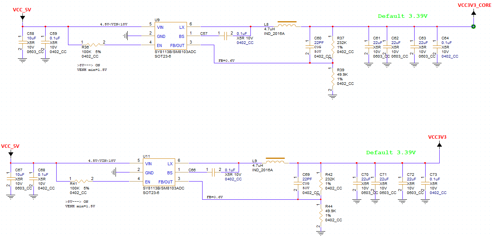
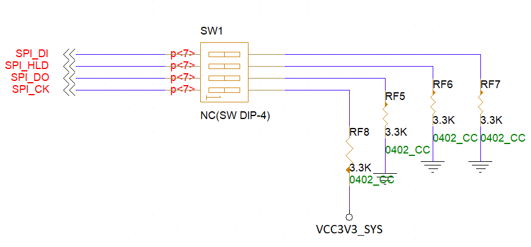
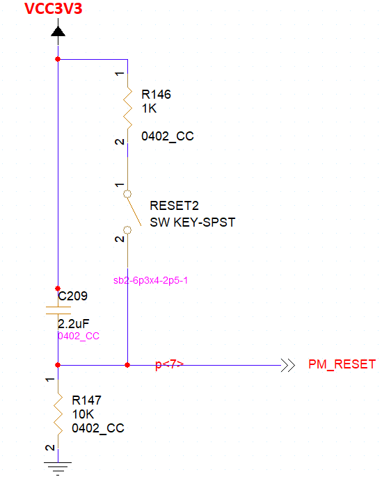
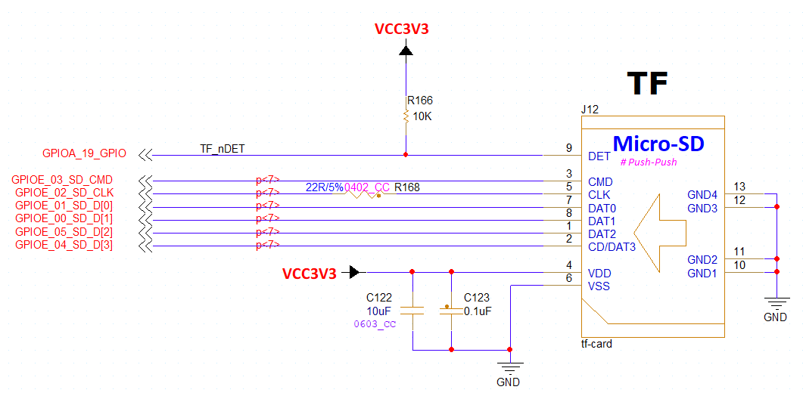
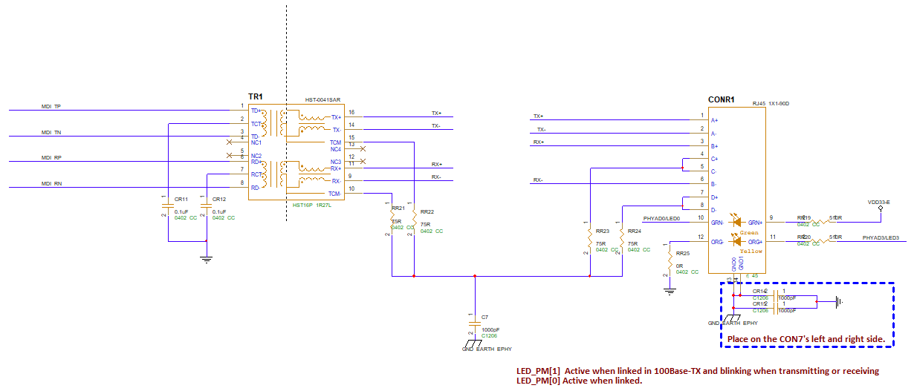
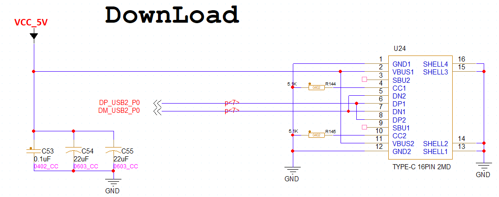
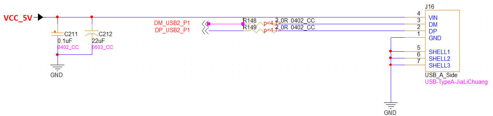
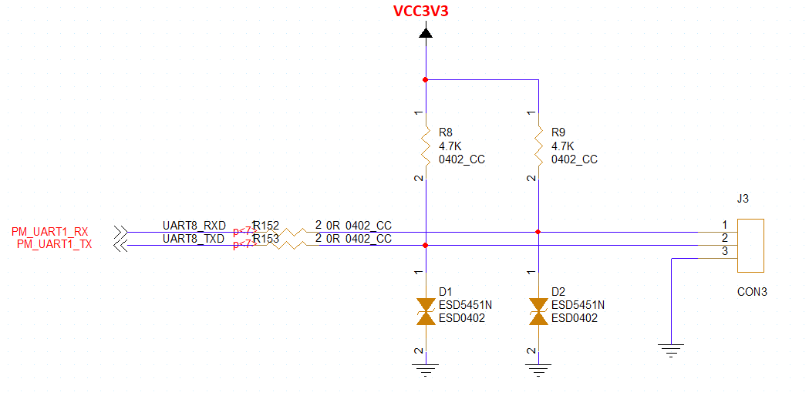

.. raw:: html

   

硬件开发指导
=====================

开发板原理图设计说明
-----------
**主要供电电路**

开发板电源由直流 5V 电源提供。由 Type-C插座（U24）引入

5V电源经过电源IC分成两路3.3V分别给核心和其它设备供电。

**BOOT Mode**

核心板启动时需要先读取BOOT模式（具体BOOT启动模式见原理图）。

**复位电路**

本开发板只使用了图中的RESET22复位开关。

**外接TF卡电路**

TF卡电路使用了SDIO总线接口。

注意：PCB设计时需做等长处理并要求3W间距且做整体包地处理。

**以太网接口电路**

核心板内没有网口芯片，网口芯片在开发板。需要注意的是RJ45接口两指示灯需要按照本原理图设计。

注意：PCB设计时，4组以太网信号线需要按照差分规则走线并做差分对内等长，差分对与其他网络要保持3倍线宽以上间距；差分对内要求等长误差范围在5mil以内，差分对间要求等长误差范围在25mil以内。

**DownLoad烧录系统USB口电路**

此接口是Type-C接口，用来接上位PC机给本开发板烧录系统。USB线要求差分走线。

**USB HOST电路**

PCB设计时每组USB信号线需要按照差分规则走线并做差分对内等长，差分对与其他网络尽量保持3倍线宽以上间距，差分对内要求等长误差范围在5mil以内。

进行PCB设计时，芯片电源网络走线应该加粗，电源去耦电容要靠近芯片管脚摆放；晶振要靠近芯片摆放，晶振网络尽量远离其他信号线并包地处理，晶振本身周围要求包地。

**WIFI**

.. image:: ../../../../image/MYZR-SigmaStar系列/MYZR-SSD2351/WIFI.png
   :alt: WIFI.png
   :width: 100%    
PCB设计时，要求网络组等长走线，线间距满足3W规则要求，整组包地处理；图中天线接口U12所在网络要求走线满足50Ω阻抗设计，走线尽量短且不可走折角，周围要求包地无信号干扰。

**Debug调试口**

J3接口是开发板Debug调试口。

设计PCB时，应成组走线，避免走线太远时使组内两网络长度误差太大。