MYZR-R16-EK166 Linux-3.4 Test Manual
======================================

Wifi Test
-----------

.. code:: shell

   $ wifi_connect_ap_test wifi_name password

| **参数说明：**
| "wifi_connect_ap_test" is the application name
| "wifi_name" is the name of the wifi to connect to
| "password" is the password of the wifi to connect to
| For Example:

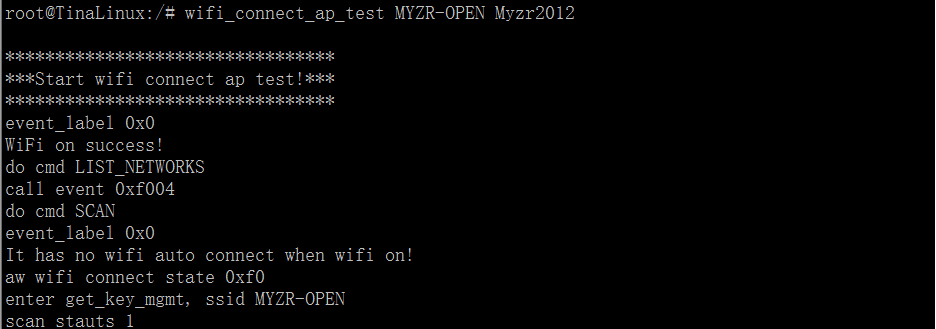

USB Test
----------

1. Insert U disk

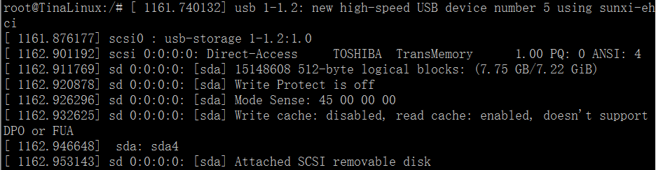

.. code:: shell
   
   $ ls /dev/sda*

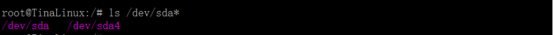

2. Mount the U disk

.. code:: shell
   
   $ mount /dev/sda4 /mnt

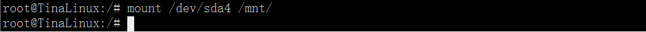

3. View the contents of the USB flash drive

.. code:: shell

   $ ls /mnt

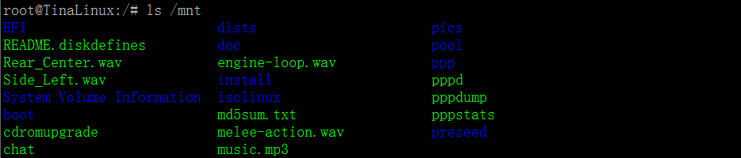

4. Uninstall the U disk

.. code:: shell
   
   $ umount /mnt

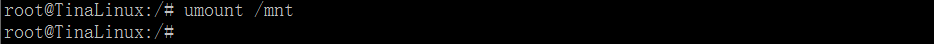

SD card Test
--------------

1. Insert SD card

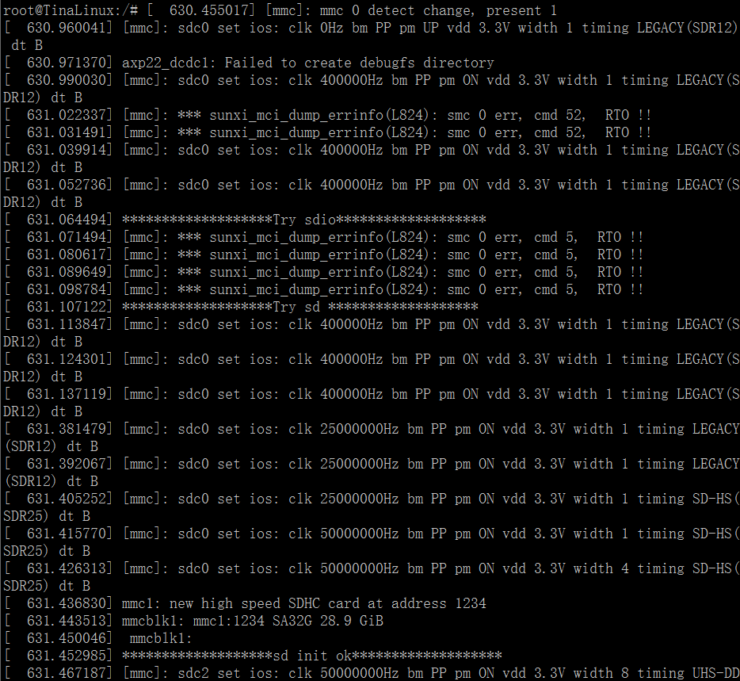
 
.. code:: shell
   
   $ ls /dev/mmcblk1

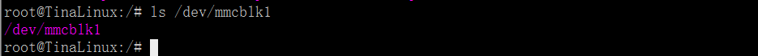

2. Mount the SD card

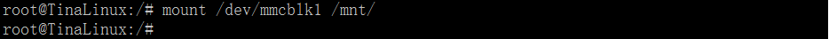

3. View the contents of the SD card

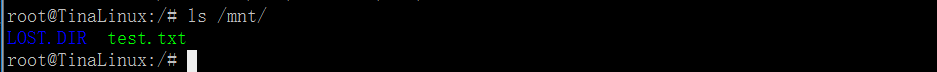

4. Uninstall the SD card

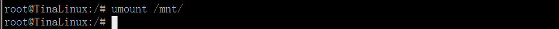

Audio Test
------------

1. Copy an mp3 file to the development board with a USB flash drive.

.. code:: shell

   $ mount /dev/sda4 /mnt/
   $ cp /mnt/music.mp3 /
   $ cd /
   $ tinyplayer music.mp3

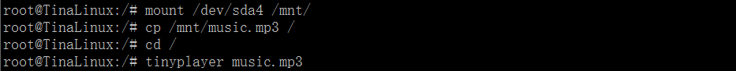

2. Volume adjustment

.. code:: shell

   $ amixer controls

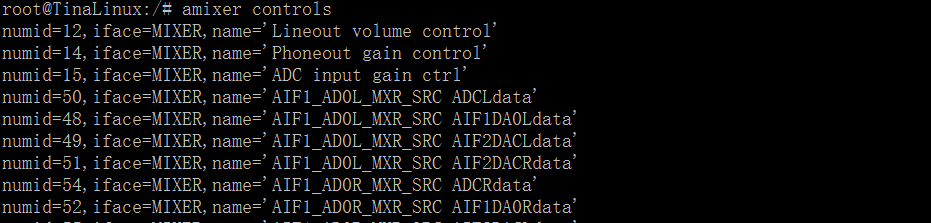

|  Find out numid=3,iface=MIXER,name='speaker volume control'

3. Gets current volume information

.. code:: shell

   $ amixer cget numid=3,iface=MIXER,name='speaker volume control'

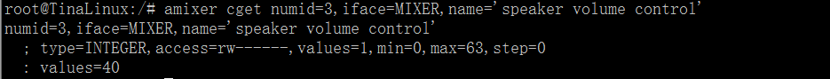

4. Set the volume to 50

.. code:: shell

   $ amixer cset numid=3,iface=MIXER,name='speaker volume control' 50

Record Test
-------------

1. Recording

.. code:: shell

   $ arecord -d 10 -D plughw:0 demo.wav

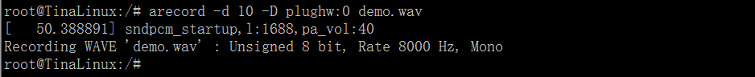

2. Play recording

.. code:: shell
   
   $ aplay -Dplug:dmix demo.wav

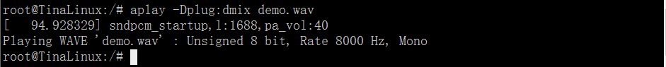

Serial port test
------------------

- The development board has only one UART3, which shorts the pin of pin 13.14 of J20.

.. code:: shell

   $ ./etc/uart.o /dev/ttyS3 “Hello”

- Parameter Description：

 | "uart.o" serial test application name
 | "ttyS3" serial port to be tested
 | "Hello" message content to be sent

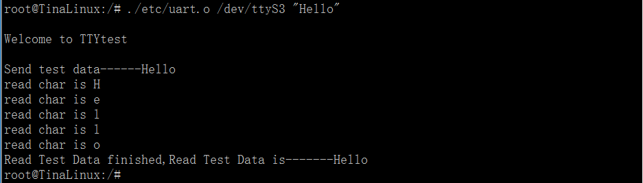

Network port test
-------------------

- Set your computer's local IP to 192.168.18.18 ，and close your computer's firewall.Connect the development board to the computer with a network cable and execute the following command:

.. code:: shell

   $ ifconfig eth0 192.168.18.36
   $ ping 192.168.18.18

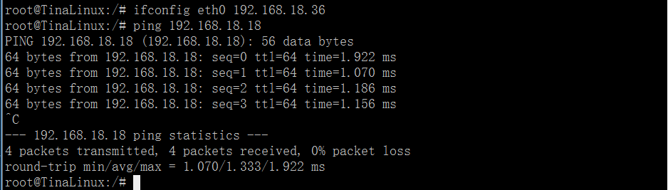

4G Test
---------

- The test takes L506 as an example (L506 is the 4G module of total network access)
- The test card is a mobile card.
- The dialup script is in the /etc/ppp/peers/ directory.
- Dial：

.. code:: shell

   $ pppd call gprsdial &

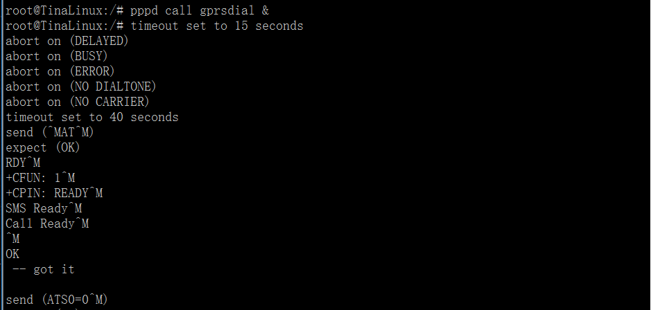

- Check the IP

.. code:: shell

   $ ifconfig ppp0

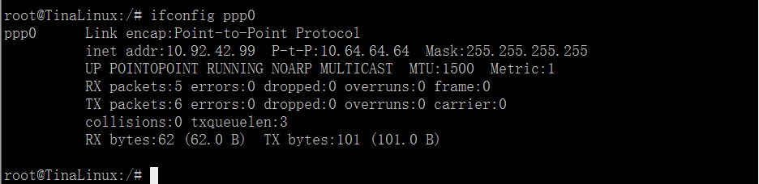

::

   --------------------------------------------------------------------------------
   * 珠海明远智睿科技有限公司  
   * ZhuHai MYZR Technology CO.,LTD.
   * Latest Update: 2023/5/08  
   * Supporter: Zhong JiaYi
   --------------------------------------------------------------------------------
