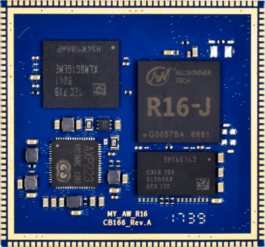
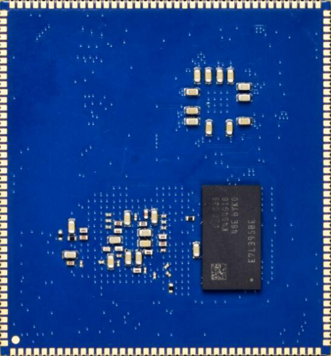
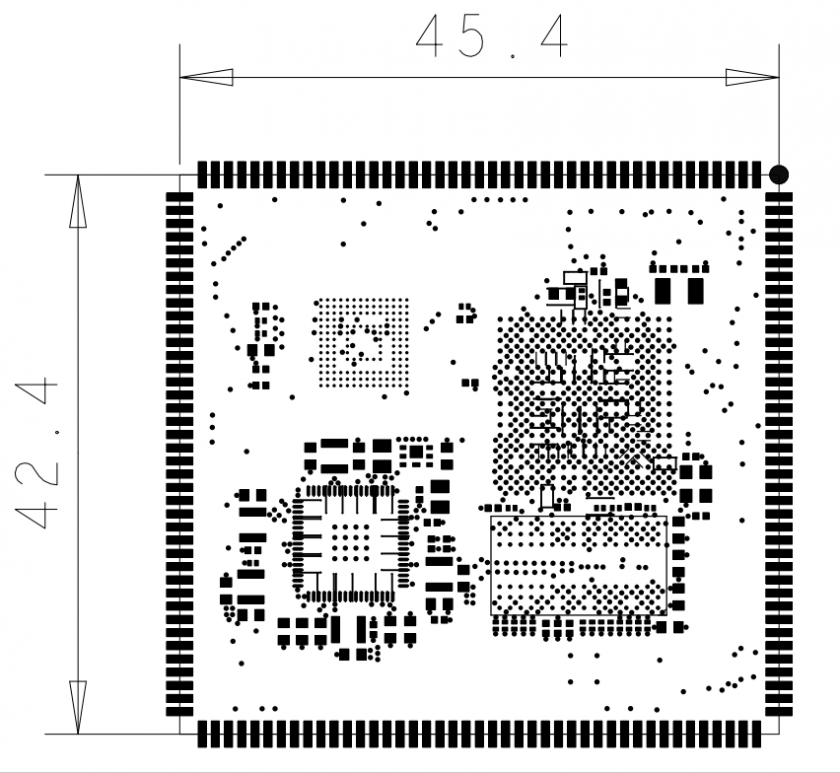
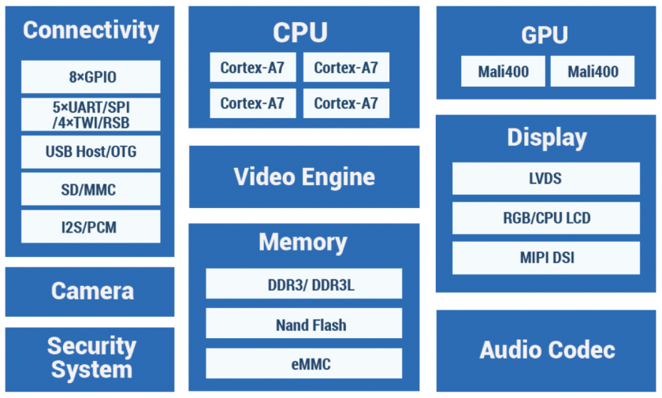

MYZR-R16-CB166 硬件介绍
========================

MYZR-R16-CB166简介
--------------------

|  MYZR-R16-CB166是我司基于全志R16应用处理器设计研发的嵌入式核心控制模块。核心板采用邮票孔的连接方式。

MYZR-R16-CB166视图
~~~~~~~~~~~~~~~~~~~~

**正面**

**背面**

MYZR-R16-CB166尺寸
~~~~~~~~~~~~~~~~~~~~

|  42.4mm * 45.4mm

R16处理器介绍
---------------

框图及基本规格
~~~~~~~~~~~~~~~

**框图**

概述
~~~~~~

|  MYZR-R16-EK166是我司全力打造的一款低功耗、高性能、可扩展的应用程序开发板，其在灵活性、系统性能和能源效率等方面都有很强竞争力。
|  MYZR-R16-CB166采用了极具性价比的四核CortexTM-A7架构处理器，搭载Mali 400 MP2图形处理单元，支持1080P高清视频处理及播放，最大支持1280×800分辨率的屏幕，支持500万像素摄像头，支持USB2.0接口。丽色显示系统，显示效果出色。

特性
~~~~~~

- Quad-core Cortex™-A7，主频1.2GHZ
- 256KB L1 Cache,512KB L2 Cache
- 16位DDR3/DDR3L 最高支持2GB
- Supports 8-bit NAND Flash controller
- LVDS，分辨率高达1280x800
- 8/10/16/24位并行摄像头传感器接口
- 一个10/100以太网，支持IEEE 1588协议
- 支持1080p@60fps视频播放
- 可切换耳机模式/电话模式

MYZR-R16-CB166介绍
--------------------

硬件配置
~~~~~~~~~~

+--------------+----------------+-------------+
| CPU          | R16            | 商业级      |
+--------------+----------------+-------------+
| 内存         | DDR3/DDR3L 1GB | 可扩展至2GB |
+--------------+----------------+-------------+
| body row     | 8GB eMMC       | 兼容至64GB  |
+--------------+----------------+-------------+

供电电源
~~~~~~~~~~

   |  5V输入

温度范围
~~~~~~~~~~

- **工作温度**

   |  0°C ~ 70°C（商业级）

- **存储温度**

   |  -60°C ~ 125°C

操作系统支持
~~~~~~~~~~~~~

- **Linux**
   |  Linux-3.4.39

- **Android**
   |  Android 4.4（使用Linux-3.4.39内核）

硬件默认接口
~~~~~~~~~~~~~

+--------------+------------------+------+-----------------------------------------------+
|   接口规格   | 最大可配置接口数 | 描述 |                                               |
+==============+==================+======+===============================================+
| 通讯接口     | USB2.0           | 2    | 1路HOST， 1路OTG接口，最高速率480M            |
+              +------------------+------+-----------------------------------------------+
|              | UART             | 5    | 5路UART,速率高达3.0MHz                        |
+              +------------------+------+-----------------------------------------------+
|              | I2C（TWI）       | 3    | 4路I2C接口，支持标准100kbps，快速400kbps      |
+              +------------------+------+-----------------------------------------------+
|              | SPI              | 2    | 1路SPI接口，支持主从模式                      |
+              +------------------+------+-----------------------------------------------+
|              | PWM              | 4    | 2路PWM输出，最高到达24MHz                     |
+--------------+------------------+------+-----------------------------------------------+
| 外部存储接口 | SD/SDIO          | 3    | SD/SDIO V2.0,支持1/4bit，可达到50MHz          |
+--------------+------------------+------+-----------------------------------------------+
| 多媒体       | MIPI-DSI         | 1    | 1路4通道MIPI DSI接口，支持1280x800分辨率      |
+              +------------------+------+-----------------------------------------------+
|              | RGB/LVDS         | 1    | 最高可支持1280x800分辨率                      |
+              +------------------+------+-----------------------------------------------+
|              | DVP              | 1    | 8bit yuv422 CMOS摄像头，最大分辨率1080p@30fps |
+              +------------------+------+-----------------------------------------------+
|              | SSI              | 2    | 2路 I2S/PCM,采样频率8KHz-192KHz               |
+--------------+------------------+------+-----------------------------------------------+

管脚定义
~~~~~~~~~~

+------+--------------+--------------+
| 序号 |   信号名称   | 所属CPU模块  |
+======+==============+==============+
| 001  | GND          | —            |
+------+--------------+--------------+
| 002  | LRADC0       | SYS          |
+------+--------------+              +
| 003  | RESET-N      |              |
+------+--------------+--------------+
| 004  | AP-CK32KO    | OSC          |
+------+--------------+--------------+
| 005  | GND          | —            |
+------+--------------+--------------+
| 006  | PHOUTN       | AUDIO        |
+------+--------------+              +
| 007  | PHOUTP       |              |
+------+--------------+              +
| 008  | PHINP        |              |
+------+--------------+              +
| 009  | PHINN        |              |
+------+--------------+              +
| 010  | MIC2N        |              |
+------+--------------+              +
| 011  | MIC2P        |              |
+------+--------------+              +
| 012  | MIC1N        |              |
+------+--------------+              +
| 013  | MIC1P        |              |
+------+--------------+              +
| 014  | HPL          |              |
+------+--------------+              +
| 015  | HPR          |              |
+------+--------------+              +
| 016  | MIC-MBIAS    |              |
+------+--------------+              +
| 017  | MIC-HBIAS    |              |
+------+--------------+              +
| 018  | AGND         |              |
+------+--------------+              +
| 019  | VRP          |              |
+------+--------------+              +
| 020  | VRA2         |              |
+------+--------------+              +
| 021  | VRA1         |              |
+------+--------------+              +
| 022  | HPCOMFB      |              |
+------+--------------+              +
| 023  | HPCOM        |              |
+------+--------------+--------------+
| 024  | GND          | —            |
+------+--------------+--------------+
| 025  | AP-UART2-RX  | PB           |
+------+--------------+              +
| 026  | AP-UART2-TX  |              |
+------+--------------+              +
| 027  | AP-UART2-CTS |              |
+------+--------------+              +
| 028  | AP-UART2-RTS |              |
+------+--------------+              +
| 029  | TP-INT       |              |
+------+--------------+              +
| 030  | LS-INT       |              |
+------+--------------+              +
| 031  | GS-INT       |              |
+------+--------------+              +
| 032  | T-CARD-DET   |              |
+------+--------------+--------------+
| 033  | GND          | —            |
+------+--------------+--------------+
| 034  | LCD-RST      | PH           |
+------+--------------+              +
| 035  | LCD-BL-EN    |              |
+------+--------------+              +
| 036  | LCD-PWM      |              |
+------+--------------+              +
| 037  | PA-SHDN      |              |
+------+--------------+              +
| 038  | TP-RST       |              |
+------+--------------+              +
| 039  | TP-SCK       |              |
+------+--------------+              +
| 040  | TP-SDA       |              |
+------+--------------+              +
| 041  | SENSOR-SCK   |              |
+------+--------------+              +
| 042  | SENSOR-SDA   |              |
+------+--------------+--------------+
| 043  | GND          | —            |
+------+--------------+--------------+
| 044  | AP-WAKE-BB   | PG           |
+------+--------------+              +
| 045  | AP-UART1-RX  |              |
+------+--------------+              +
| 046  | AP-UART1-TX  |              |
+------+--------------+              +
| 047  | AP-UART1-RTS |              |
+------+--------------+              +
| 048  | AP-UART1-CTS |              |
+------+--------------+              +
| 049  | GND          |              |
+------+--------------+              +
| 050  | PCM1_CLK     |              |
+------+--------------+              +
| 051  | PCM1_DOUT    |              |
+------+--------------+              +
| 052  | PCM1_DIN     |              |
+------+--------------+              +
| 053  | WL-SDIO-CLK  |              |
+------+--------------+              +
| 054  | WL-SDIO-CMD  |              |
+------+--------------+              +
| 055  | WL-SDIO-D0   |              |
+------+--------------+              +
| 056  | WL-SDIO-D1   |              |
+------+--------------+              +
| 057  | WL-SDIO-D2   |              |
+------+--------------+              +
| 058  | WL-SDIO-D3   |              |
+------+--------------+--------------+
| 059  | GND          | —            |
+------+--------------+--------------+
| 060  | ND-WE        | FLASH        |
+------+--------------+              +
| 061  | ND-ALE       |              |
+------+--------------+              +
| 062  | ND-CLE       |              |
+------+--------------+              +
| 063  | ND-RB1       |              |
+------+--------------+              +
| 064  | ND-CE0       |              |
+------+--------------+              +
| 065  | ND-CE1       |              |
+------+--------------+--------------+
| 066  | GND          | —            |
+------+--------------+--------------+
| 067  | SDC0-D1      | TF CARD      |
+------+--------------+              +
| 068  | SDC0-D0      |              |
+------+--------------+              +
| 069  | SDC0-CLK     |              |
+------+--------------+              +
| 070  | SDC0-CMD     |              |
+------+--------------+              +
| 071  | SDC0-D3      |              |
+------+--------------+              +
| 072  | SDC0-D2      |              |
+------+--------------+--------------+
| 073  | GND          | —            |
+------+--------------+--------------+
| 074  | CSI-VSYNC    | CSI          |
+------+--------------+              +
| 075  | CSI-HSYNC    |              |
+------+--------------+              +
| 076  | CSI-MCLK     |              |
+------+--------------+              +
| 077  | CSI-PCLK     |              |
+------+--------------+              +
| 078  | CSI-D0       |              |
+------+--------------+              +
| 079  | CSI-D1       |              |
+------+--------------+              +
| 080  | CSI-D2       |              |
+------+--------------+              +
| 081  | CSI-D3       |              |
+------+--------------+              +
| 082  | CSI-D4       |              |
+------+--------------+              +
| 083  | CSI-D5       |              |
+------+--------------+              +
| 084  | CSI-D6       |              |
+------+--------------+              +
| 085  | CSI-D7       |              |
+------+--------------+              +
| 086  | CSI-STBY-F   |              |
+------+--------------+              +
| 087  | CSI-RST-F    |              |
+------+--------------+              +
| 088  | CSI-STBY-R   |              |
+------+--------------+              +
| 089  | CSI-RST-R    |              |
+------+--------------+              +
| 090  | CSI-SCK      |              |
+------+--------------+              +
| 091  | CSI-SDA      |              |
+------+--------------+--------------+
| 092  | GND          | —            |
+------+--------------+--------------+
| 093  | POWER_ON     | 电源芯片引出 |
+------+--------------+              +
| 094  | USB-DRVVBUS  |              |
+------+--------------+              +
| 095  | CHGLED       |              |
+------+--------------+              +
| 096  | TS           |              |
+------+--------------+--------------+
| 097  | DOVDD-CSI    | POWER        |
+------+--------------+              +
| 098  | VCC-3V0      |              |
+------+--------------+              +
| 099  | DVDD1V8-CSI  |              |
+------+--------------+              +
| 100  | VCC-LCD      |              |
+------+--------------+              +
| 101  | VCC-CTP      |              |
+------+--------------+              +
| 102  | VCC-USB      |              |
+------+--------------+              +
| 103  | AVCC         |              |
+------+--------------+              +
| 104  | AVDD-CSI     |              |
+------+--------------+              +
| 105  | USBVBUS      |              |
+------+--------------+              +
| 106  | USBVBUS      |              |
+------+--------------+              +
| 107  | USBVBUS      |              |
+------+--------------+              +
| 108  | VCC-WIFI     |              |
+------+--------------+              +
| 109  | VBAT         |              |
+------+--------------+              +
| 110  | VBAT         |              |
+------+--------------+              +
| 111  | VBAT         |              |
+------+--------------+--------------+
| 112  | GND          | —            |
+------+--------------+--------------+
| 113  | DSI-CKN      | DSI          |
+------+--------------+              +
| 114  | DSI-CKP      |              |
+------+--------------+              +
| 115  | DSI-D0N      |              |
+------+--------------+              +
| 116  | DSI-D0P      |              |
+------+--------------+              +
| 117  | DSI-D1N      |              |
+------+--------------+              +
| 118  | DSI-D1P      |              |
+------+--------------+              +
| 119  | DSI-D2P      |              |
+------+--------------+              +
| 120  | DSI-D2N      |              |
+------+--------------+              +
| 121  | DSI-D3N      |              |
+------+--------------+              +
| 122  | DSI-D3P      |              |
+------+--------------+--------------+
| 123  | GND          | —            |
+------+--------------+--------------+
| 124  | LCD-VSYNC    | RGB/LVDS     |
+------+--------------+              +
| 125  | LCD-HSYNC    |              |
+------+--------------+--------------+
| 126  | GND          | —            |
+------+--------------+--------------+
| 127  | LCD-DE       | RGB/LVDS     |
+------+--------------+              +
| 128  | LCD-CLK      |              |
+------+--------------+--------------+
| 129  | GND          | —            |
+------+--------------+--------------+
| 130  | LCD-D23      | RGB/LVDS     |
+------+--------------+              +
| 131  | LCD-D22      |              |
+------+--------------+              +
| 132  | LCD-D21      |              |
+------+--------------+              +
| 133  | LCD-D20      |              |
+------+--------------+              +
| 134  | LCD-D19      |              |
+------+--------------+              +
| 135  | LCD-D18      |              |
+------+--------------+              +
| 136  | LCD-D15      |              |
+------+--------------+              +
| 137  | LCD-D14      |              |
+------+--------------+              +
| 138  | LCD-D13      |              |
+------+--------------+              +
| 139  | LCD-D12      |              |
+------+--------------+              +
| 140  | LCD-D11      |              |
+------+--------------+              +
| 141  | LCD-D10      |              |
+------+--------------+              +
| 142  | LCD-D7       |              |
+------+--------------+              +
| 143  | LCD-D6       |              |
+------+--------------+              +
| 144  | LCD-D5       |              |
+------+--------------+              +
| 145  | LCD-D4       |              |
+------+--------------+              +
| 146  | LCD-D3       |              |
+------+--------------+              +
| 147  | LCD-D2       |              |
+------+--------------+--------------+
| 148  | GND          | —            |
+------+--------------+--------------+
| 149  | AP-WAKE-BT   | PL           |
+------+--------------+              +
| 150  | WL-RST-N     |              |
+------+--------------+              +
| 151  | WL-PMU-EN    |              |
+------+--------------+              +
| 152  | BT-RST-N     |              |
+------+--------------+              +
| 153  | WL-WAKE-AP   |              |
+------+--------------+              +
| 154  | BT-WAKE-AP   |              |
+------+--------------+              +
| 155  | BB-WAKE-AP   |              |
+------+--------------+              +
| 156  | BB-PWREN     |              |
+------+--------------+              +
| 157  | BB-PWR-BAT   |              |
+------+--------------+              +
| 158  | BB-RST       |              |
+------+--------------+              +
| 159  | PMIC-SDA     |              |
+------+--------------+              +
| 160  | PMIC-SCK     |              |
+------+--------------+--------------+
| 161  | GND          | —            |
+------+--------------+--------------+
| 162  | USB-DM1      | USB          |
+------+--------------+              +
| 163  | USB-DP1      |              |
+------+--------------+              +
| 164  | USB-DM0      |              |
+------+--------------+              +
| 165  | USB-DP0      |              |
+------+--------------+              +
| 166  | USB-ID       |              |
+------+--------------+--------------+

::

   --------------------------------------------------------------------------------
   * 珠海明远智睿科技有限公司  
   * ZhuHai MYZR Technology CO.,LTD.
   * Latest Update: 2023/5/08  
   * Supporter: Zhong JiaYi
   --------------------------------------------------------------------------------