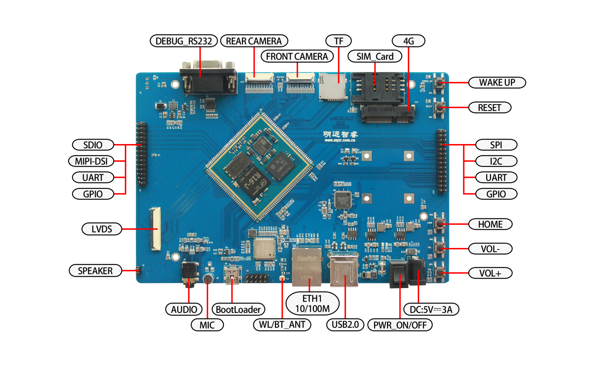
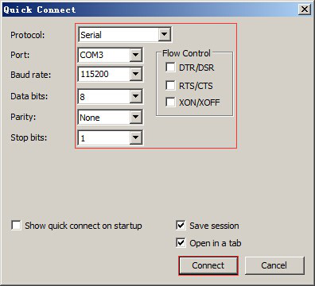
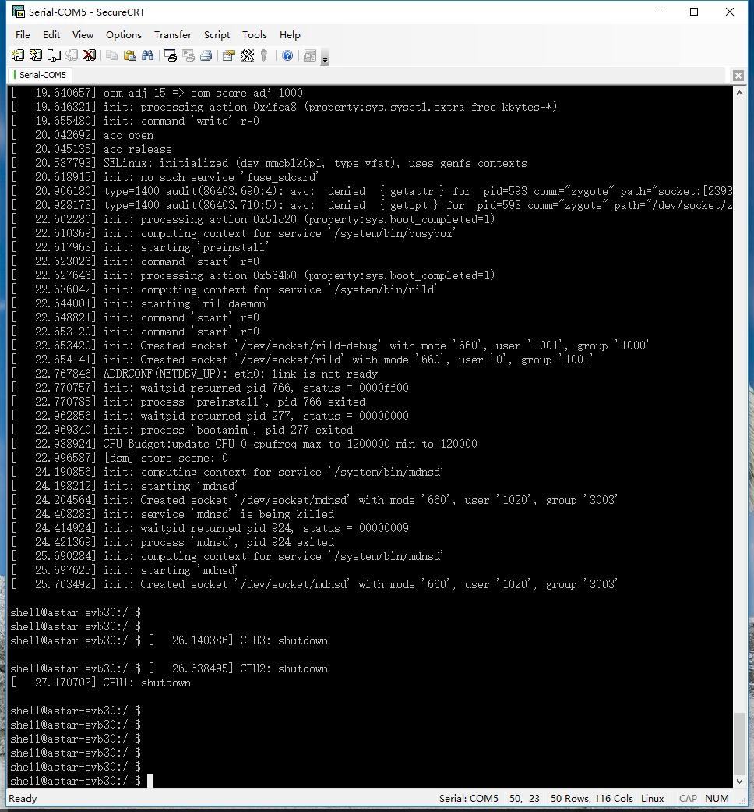
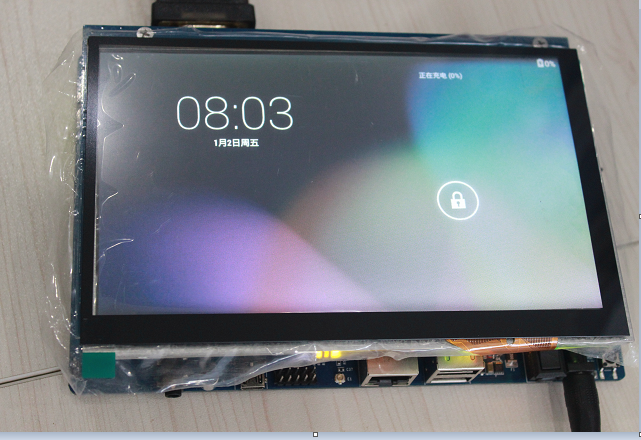

MYZR-R16-EK166 启动手册
=========================

准备开发板套件
---------------

开发板套件由开发板和开发板配件组成。

开发板
~~~~~~~

|  开发板由以下器件组装而成：

- 16 开发板一块
- 显示屏电路板一片
- 液晶显示屏一块
- 触摸屏一片

开发板配件
~~~~~~~~~~~

|  开发板配件有：

- 电源适配器1个
- USB下载线1条
- 网线1条
- 串口线1条

开发板接口概览
---------------

**MYZR-R16-EK166 正面图**

快速启动开发板
---------------

1. 检查电源是否关闭状态，确保电源开关是断开。
2. 与计算机连接，将串口线一端连接到开发板的J7，一端连接到计算机。如果没有连接串口线，将不能通过串口方式与开发板交互。但是不影响开发板的启动及烧录系统。
3. 串口终端工具配置。通过window的设备管理器找到计算机上我们使用的端口号。配置串口终端工具的各参数。

|  SecureCRT & USB串口3 示例配置如下：

4. 网线连接，将网线一端连接到开发板的j12，网线另一端插入计算机的网口。
5. USB下载线的连接，将USB线一端连接到开发板的j8，另外一端插入计算机的USB接口。
6. 连接电源线，将电源线一端连接到开发板的j18，一端连接电源插座。
7. 将开发板电源开关j17按到闭合状态。

观察启动状况
~~~~~~~~~~~~

|  串口终端动态，会看到计算机的串口终端有开发板启动过程中输出的启动过程信息。
|  启动后串口打印信息如下:

|  启动后UI界面如下:

::

   --------------------------------------------------------------------------------
   * 珠海明远智睿科技有限公司  
   * ZhuHai MYZR Technology CO.,LTD.
   * Latest Update: 2023/5/08  
   * Supporter: Zhong JiaYi
   --------------------------------------------------------------------------------