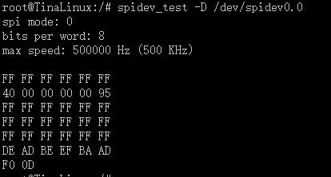
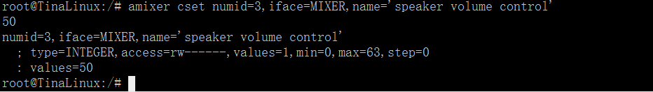

MYZR-R16-EK166 测试手册
========================

Wifi测试
----------

.. code:: shell

   $ wifi_connect_ap_test wifi_name password

**参数说明：**

|  wifi_connect_ap_test是应用名
|  wifi_name是要连接的wifi的名字
|  password是要连接的wifi的密码
|  例：

.. image:: ../../../../image/MYZR-国产系列/Allwinner平台/MYZR-R16-EK166/MY-R16-CB166_linux-34_test1.png
   :alt: MY-R16-CB166_linux-34_test1.png

USB测试
----------

|  插入U盘

.. image:: ../../../../image/MYZR-国产系列/Allwinner平台/MYZR-R16-EK166/MY-R16-CB166_linux-34_test2-1.png
   :alt: MY-R16-CB166_linux-34_test2-1.png

.. code:: shell
   
   $ ls /dev/sda*

.. image:: ../../../../image/MYZR-国产系列/Allwinner平台/MYZR-R16-EK166/MY-R16-CB166_linux-34_test2-2.png
   :alt: MY-R16-CB166_linux-34_test2-2.png

|  挂载U盘

.. code:: shell
   
   $ mount /dev/sda4 /mnt

.. image:: ../../../../image/MYZR-国产系列/Allwinner平台/MYZR-R16-EK166/MY-R16-CB166_linux-34_test2-3.png
   :alt: MY-R16-CB166_linux-34_test2-3.png

|  查看U盘的内容

.. code:: shell

   $ ls /mnt

.. image:: ../../../../image/MYZR-国产系列/Allwinner平台/MYZR-R16-EK166/MY-R16-CB166_linux-34_test2-4.png
   :alt: MY-R16-CB166_linux-34_test2-4.png

|  卸载U盘

.. code:: shell
   
   $ umount /mnt

.. image:: ../../../../image/MYZR-国产系列/Allwinner平台/MYZR-R16-EK166/MY-R16-CB166_linux-34_test2-5.png
   :alt: MY-R16-CB166_linux-34_test2-5.png

SD卡测试
----------

| 插入SD卡

.. image:: ../../../../image/MYZR-国产系列/Allwinner平台/MYZR-R16-EK166/MY-R16-CB166_linux-34_test3-1.png
   :alt: MY-R16-CB166_linux-34_test3-1.png

.. code:: shell
   
   $ ls /dev/mmcblk1

.. image:: ../../../../image/MYZR-国产系列/Allwinner平台/MYZR-R16-EK166/MY-R16-CB166_linux-34_test3-2.png
   :alt: MY-R16-CB166_linux-34_test3-2.png

| 挂载SD卡

.. image:: ../../../../image/MYZR-国产系列/Allwinner平台/MYZR-R16-EK166/MY-R16-CB166_linux-34_test3-3.png
   :alt: MY-R16-CB166_linux-34_test3-3.png

| 查看SD卡内容

.. image:: ../../../../image/MYZR-国产系列/Allwinner平台/MYZR-R16-EK166/MY-R16-CB166_linux-34_test3-4.png
   :alt: MY-R16-CB166_linux-34_test3-4.png

| 卸载SD卡

.. image:: ../../../../image/MYZR-国产系列/Allwinner平台/MYZR-R16-EK166/MY-R16-CB166_linux-34_test3-5.png
   :alt: MY-R16-CB166_linux-34_test3-5.png

SPI测试
----------

| **参数说明：**
|  spidev_test spi 测试程序
|  /dev/spidev0.0 要测试的spi
|  短接开发板j19上的5、6号管脚，然后在串口输入如下指令：

.. code:: shell
   
   $ spidev_test -D /dev/spidev0.0

|  如果spi正常会输出如下结果

音频测试
----------

用U盘复制一个mp3文件到开发板上。

.. code:: shell
   
   $ mount /dev/sda4 /mnt/
   $ cp /mnt/music.mp3 /
   $ cd /
   $ tinyplayer music.mp3

.. image:: ../../../../image/MYZR-国产系列/Allwinner平台/MYZR-R16-EK166/MY-R16-CB166_linux-34_test4-1.png
   :alt: MY-R16-CB166_linux-34_test4-1.png

| 音量调整

.. code:: shell

   $ amixer controls

.. image:: ../../../../image/MYZR-国产系列/Allwinner平台/MYZR-R16-EK166/MY-R16-CB166_linux-34_test4-2.png
   :alt: MY-R16-CB166_linux-34_test4-2.png

| 找到numid=3,iface=MIXER,name='speaker volume control'
| 获取当前音量信息

.. code:: shell
   
   $ amixer cget numid=3,iface=MIXER,name='speaker volume control'

.. image:: ../../../../image/MYZR-国产系列/Allwinner平台/MYZR-R16-EK166/MY-R16-CB166_linux-34_test4-3.png
   :alt: MY-R16-CB166_linux-34_test4-3.png

| 设置音量大小为50

.. code:: shell
   
   $ amixer cset numid=3,iface=MIXER,name='speaker volume control' 50

录音测试
----------

| 录音

.. code:: shell
   
   $ arecord -d 10 -D plughw:0 demo.wav

.. image:: ../../../../image/MYZR-国产系列/Allwinner平台/MYZR-R16-EK166/MY-R16-CB166_linux-34_test5-1.png
   :alt: MY-R16-CB166_linux-34_test5-1.png

| 播放录音

.. code:: shell
   
   $ aplay -Dplug:dmix demo.wav

.. image:: ../../../../image/MYZR-国产系列/Allwinner平台/MYZR-R16-EK166/MY-R16-CB166_linux-34_test5-2.png
   :alt: MY-R16-CB166_linux-34_test5-2.png

串口测试
----------

开发板只有一个UART3，将j19的13.14号管脚短接.

.. code:: shell
   
   $ uart_test /dev/ttyS3 "Hello"

| **参数说明：**
|  uart.o串口测试的应用名
|  ttyS3要测试的串口
|  "Hello"要发送的信息内容

.. image:: ../../../../image/MYZR-国产系列/Allwinner平台/MYZR-R16-EK166/MY-R16-CB166_linux-34_test6-1.png
   :alt: MY-R16-CB166_linux-34_test6-1.png

网口测试
----------

| 将电脑的本地ip设置为192.168.18.18，并将电脑的防火墙关闭。将开发板跟电脑用网线相连然后执行如下命令:

.. code:: shell
   
   $ ifconfig eth0 192.168.18.36
   $ ping 192.168.18.18

.. image:: ../../../../image/MYZR-国产系列/Allwinner平台/MYZR-R16-EK166/MY-R16-CB166_linux-34_test7-1.png
   :alt: MY-R16-CB166_linux-34_test7-1.png

4G测试
----------

| 测试以L506为例（L506是全网通4G模块）
| 测试用卡为移动卡。
| 拨号脚本在/etc/ppp/peers/目录下。
| 拨号：

.. code:: shell
   
   $ pppd call gprsdial &

.. image:: ../../../../image/MYZR-国产系列/Allwinner平台/MYZR-R16-EK166/MY-R16-CB166_linux-34_test8-1.png
   :alt: MY-R16-CB166_linux-34_test8-1.png

| 查看IP

.. code:: shell
   
   $ ifconfig ppp0

.. image:: ../../../../image/MYZR-国产系列/Allwinner平台/MYZR-R16-EK166/MY-R16-CB166_linux-34_test8-2.png
   :alt: MY-R16-CB166_linux-34_test8-2.png

::

   --------------------------------------------------------------------------------
   * 珠海明远智睿科技有限公司  
   * ZhuHai MYZR Technology CO.,LTD.
   * Latest Update: 2023/5/08  
   * Supporter: Zhong JiaYi
   --------------------------------------------------------------------------------
