MYZR-RK3288-EK314 Android-5.1.1 Build Manual
==============================================

Install ubuntu12.04
---------------------

|   If virtual machine downloaded from MYZR is going to be used,please skip to the section"download source code and decompress"
|   Here it is recommended to users to use operating system of 64bit ubuntu12.04 of which has been proven in compilation by real machine.

Install openjdk1.7
--------------------

|   Execute command to install openjdk1.7

.. code:: shell

    sudo add-apt-repository "deb http://archive.canonical.com/ lucid partner"
    sudo apt-get update
    sudo apt-get install openjdk-7-jdk
    $ sudo gedit /etc/profile

|   Add the following environment variables

.. code:: shell

    export JAVA_HOME=/usr/lib/jvm/java-7-openjdk-amd64/
    export JRE_HOME=$JAVA_HOME/jre
    export CLASSPATH=$JAVA_HOME/lib:$JRE_HOME/lib:$CLASSPATH
    export PATH=$JAVA_HOME/bin:$PATH:$JRE_HOME/bin
    $ source /etc/profile
    $ java –version

|   （When version 1.7.0_121 is seen,which represent a success）

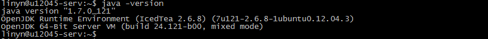

Install libraries needed to compile Android system
-----------------------------------------------------

|   (For detailed information, please visit http://source.android.com/source/initializing.html)

.. code:: shell

    sudo apt-get install git gnupg flex bison gperf build-essential \ 
     zip curl libc6-dev libncurses5-dev:i386 x11proto-core-dev \ 
     libx11-dev:i386 libreadline6-dev:i386 libgl1-mesa-glx:i386 \ 
     g++-multilib mingw32 tofrodos gcc-multilib ia32-libs \ 
     python-markdown libxml2-utils xsltproc zlib1g-dev:i386 \ 
     lzop libssl1.0.0 libssl-dev

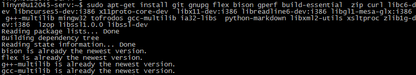

Download source code and decompress
--------------------------------------

Download source code
~~~~~~~~~~~~~~~~~~~~~~

|   Login downloads in http://www.myzr.com.cn to download source code of Android5.1
|   Source code package of Android5.1 sub-volume compression decompressed is :rk32-myzr_android5.1_20180328.tar.bz2

Decompress source code
~~~~~~~~~~~~~~~~~~~~~~~~

.. code:: shell

    $ mkdir ~/rk3288-myzr
    $ tar jxvf rk32-myzr_android5.1_20180328.tar.bz2 -C ~/rk3288-myzr/

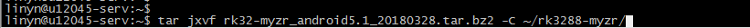

Compile source code(Android system)
-------------------------------------

Set environment variables
~~~~~~~~~~~~~~~~~~~~~~~~~~~

.. code:: shell

    $ export ARCH=arm
    $ export CROSS_COMPILE=~/rk3288-myzr/prebuilts/gcc/linux-x86/arm/arm-eabi-4.6/bin/arm-eabi-

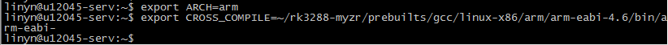

.. code:: shell

    $ ${CROSS_COMPILE}gcc -v

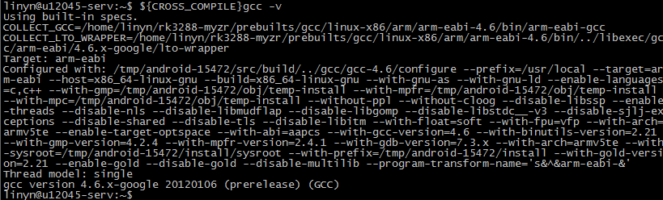

Compile uboot
~~~~~~~~~~~~~~~

- Enter U-BOOT code directory

.. code:: shell

    $ cd ~/rk3288-myzr/u-boot/

- Set up configuration file

.. code:: shell

    $ make rk3288_defconfig

- Compile

.. code:: shell

    $ make

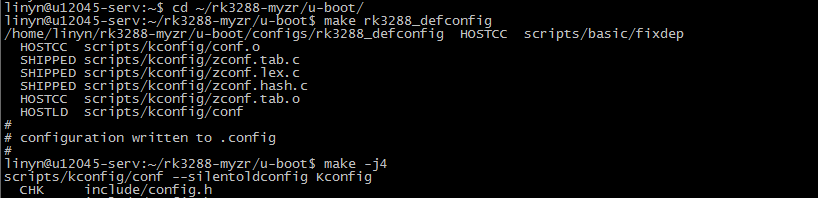

- Target file

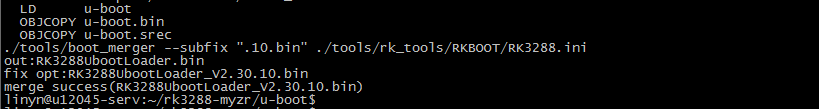

Compile kernetl
~~~~~~~~~~~~~~~~~

|   Different display types for different images are listed in the following table.

+----------------------------+-----------------+----------------------------+
| Evaluation board model no. |       LCD       |       Configuration        |
+============================+=================+============================+
| MYZR-RK3288-EK314          | LVDS(1024X600)  | rk3288-myzr_rh568_lvds.img |
+                            +-----------------+----------------------------+
|                            | HDMI(1920X1080) | rk3288-myzr_rh568_hdmi.img |
+                            +-----------------+----------------------------+
|                            | EDP(1920X1080)  | rk3288-myzr_rh568_edp.img  |
+----------------------------+-----------------+----------------------------+

- Enter kernel code directory

.. code:: shell

    $ cd ~/rk3288-myzr/kernel/

- Clear kernel configuration

.. code:: shell

    $ make distclean

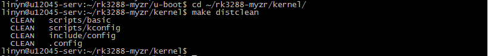

- Set up configuration file

.. code:: shell

    $ make rk3288-myzr_defconfig

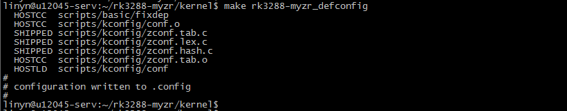

- Compile(for example: LVDS)

.. code:: shell

    $ make -j8 rk3288-myzr_rh568_lvds.img

|   Instruction：8 threads compilation is used in the screenshots

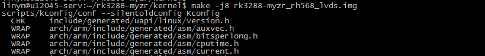

- Complete compilation

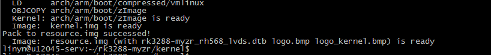

- Target file

|   Kernel.img and resource.img are the compiled target files. Use the ls command to view the file information.

.. code:: shell

    $ ls

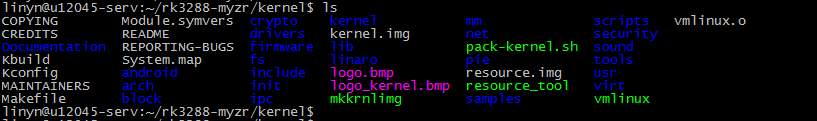

Compile android code
----------------------

- Set android environment variables

.. code:: shell

    $ cd ~/rk3288-myzr/
    $ source build.sh

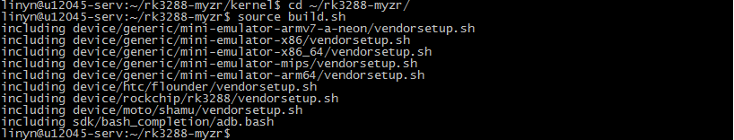

- Set android version configuration

.. code:: shell

    $ lunch rk3288_box-userdebug

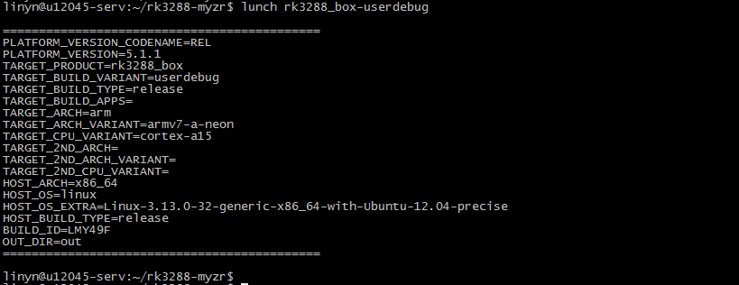

- Compile

.. code:: shell

    $ make -j16

|   Instruction：16 threads compilation is used in the screenshots.

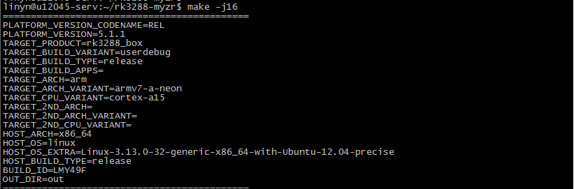

- Complete compilation

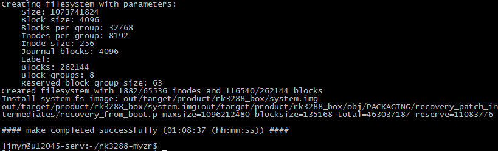

- Target file

|   boot.img，misc.img，kernel.img，resource.img，recovery.img，system.img即为编译得到的目标文件，使用ls命令可查看文件信息。

.. code:: shell

    $ ./mkimage.sh
    $ ls rockdev/Image-rk3288_box/

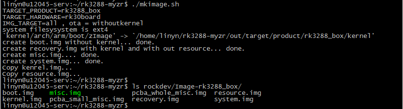

Pack relase_android_update.img
--------------------------------

Compile packaging tools
~~~~~~~~~~~~~~~~~~~~~~~~~

|   Note: If you have compiled rk2918_tools.tar.bz2, you do not need to recompile. You can skip this step.
|   Copy rk2918_tools.tar.bz2 to directory ~/rk3288-myzr/rockdev by default

.. code:: shell

    $ cd ~/rk3288-myzr/rockdev
    $ tar jxf rk2918_tools.tar.bz2
    $ cd rk2918_tools/
    $ make -j4
    $ sudo cp afptool img_unpack img_maker mkkrnlimg /usr/local/bin/

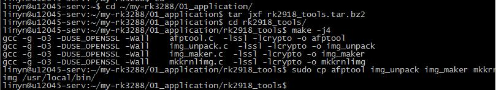

New folder and copy image
~~~~~~~~~~~~~~~~~~~~~~~~~~~

|   The file of "rockdev/Image-rk3288_box/" corresponds to the file of "Image\android", rk3288box-3.10-uboot-android.parameter.txt is renamed to parameter, RK3288UbootLoader_V2.30.10.bin corresponds to RKLoader.bin, update-script and The recover-script is copied by the burning tool. The contents of the package-file are renamed according to the corresponding file, as follows:

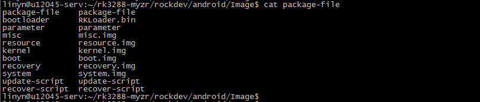

.. code:: shell

    $ mkdir -p rockdev/android/Image
    $ cd rockdev/android/Image/
    $ cp ~/rk3288-myzr/rockdev/Image-rk3288_box/* ./
    $ rm pc*
    $ ls

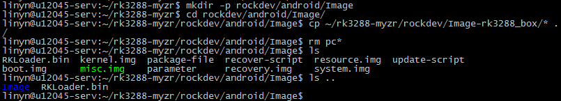

Pack relase_android_update.img
~~~~~~~~~~~~~~~~~~~~~~~~~~~~~~~~

.. code:: shell

    $ afptool -pack . ../update.img
    $ img_maker -rk32 RKLoader.bin update.img relase_android_update.img

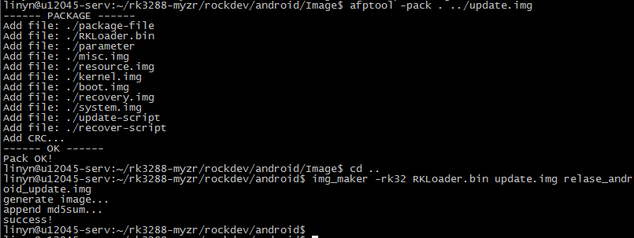