MYZR-RK3288-EK314 Android-5.1.1 Test Manual
=============================================

Preparation before test
-------------------------

|   1）Prepare a set of MYZR-RK3288-EK314 development board, 5V DC power supply, USB to serial cable.
|   2）Connect the serial cable to the development board and power.

Test item
------------

Network inferface test
~~~~~~~~~~~~~~~~~~~~~~~~

|   MYZR-RK3288-EK314 support two ethernet interfaces, one is 100 Mbps ethernet, the other is 1 Gbps ethernet.

**Interface property**

+----------------------------+--------------------+-------------------------+------------------+
| Evaluation board model no. | Interface position | Interface rate standard | System interface |
+============================+====================+=========================+==================+
| MYZR-RK3288-EK314          | U13                | 10/100/1000Mbps         | eth0             |
+                            +--------------------+-------------------------+------------------+
|                            | P1                 | 10/100Mbps              | eth1             |
+----------------------------+--------------------+-------------------------+------------------+

**Test method**

|   1） Test instruction

- Need to use a router, the default gateway is 192.168.137.1

|   2） Eth0 connect test

- Connect lan line: connect “eth0”on evaluation board with corresponding network router with lan line.
- Figure

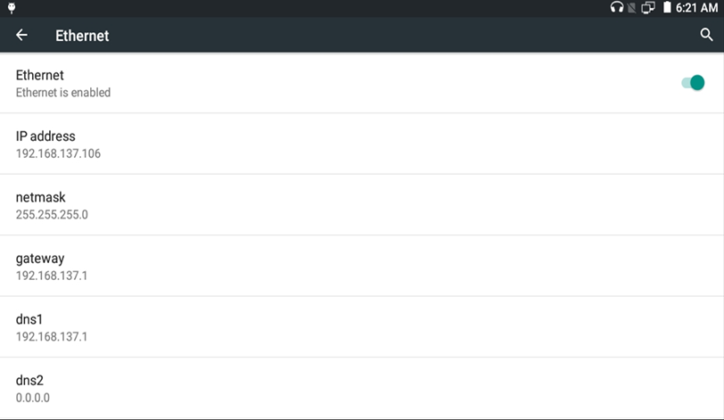

|   3） Eth1 connect test

- Connect lan line：insert one end of lan line into “eth1”on evaluation board and another end into network router.
- Set the second network inter face IP：

.. code:: shell

    ＃ ifconfig eth1 192.168.137.100 　　　　　＃ configure the eth1
    ＃ ping -I eth1 192.168.137.1 　　　　　＃ send ICMP to HOST

- Figures

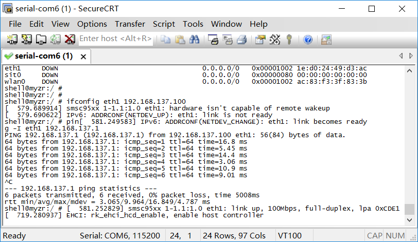

USB test
~~~~~~~~~~

**Interface property**

+----------------------------+--------------------+-------------------------+
| Evaluation board model no. | Interface position | Interface rate standard |
+============================+====================+=========================+
| MYZR-RK3288-EK314          | J10                | 480 Mbits/s             |
+----------------------------+--------------------+-------------------------+

**Test method**

|   1） Start test
|   Insert USB device into USB port on base board，enter the following command：
|   2） Test over
|   Instruction：when plug in & out U disk from USB interface

**Figure**

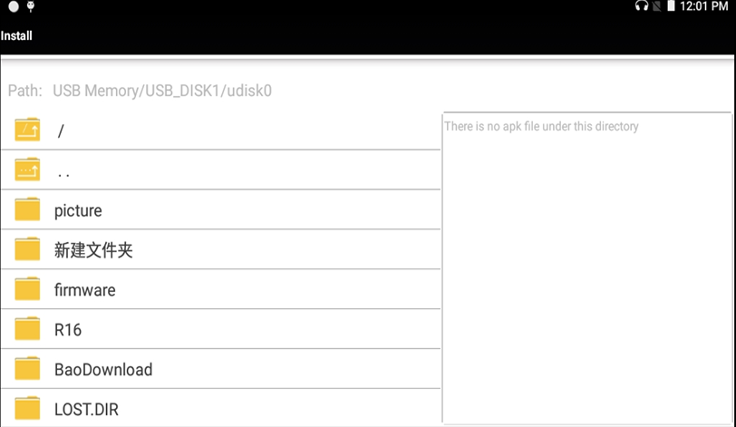

SD card test
~~~~~~~~~~~~~~~

**Interface property**

+----------------------+--------------------+----------------+
| Evaluation model no. | Interface position | Interface type |
+======================+====================+================+
| MYZR-RK3288-EK314    | U22                | SD             |
+----------------------+--------------------+----------------+

**Start test**

|   1） Insert device into SD card slot
|   Insert SD card into SD card port on base board
|   2） Test over
|   Take out SD card after SD card pop-pup,then test is over.

**Figures**

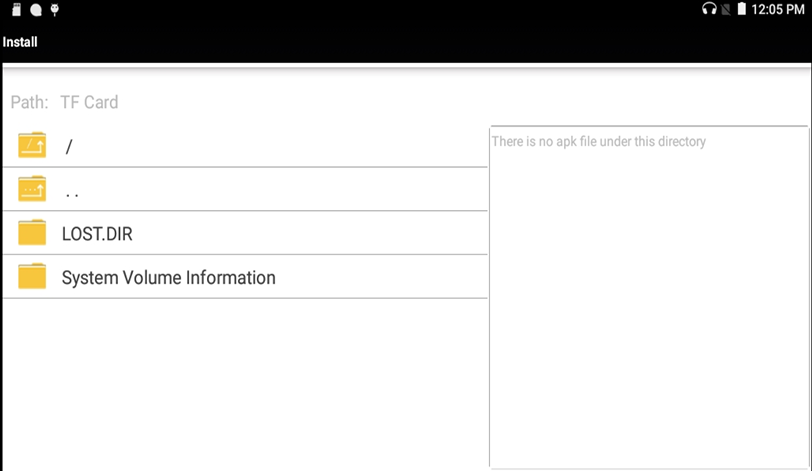

Audio test
~~~~~~~~~~~~

|   Click “Setting”->“Display”->“Brightness level”

**Figures**

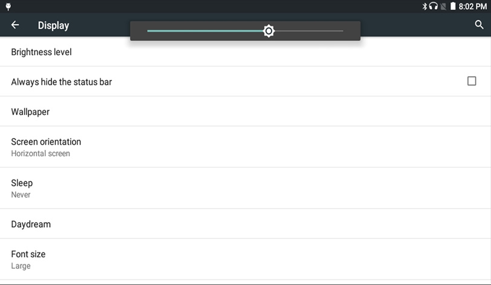

Audio test
~~~~~~~~~~~~

**Test instruction**

|   The test is to verify audio function of evaluation board by playing audio file.

**Test method**

|   1）Prepare test
|   Connect audio output device to audio element in front view of base board,audio element is “J20”in front view of base board.
|   2）执Execute test
|   Prepare the mp3 audio file with the USB drive, plug in the USB drive and directly open the mp3 file .

**Figures**

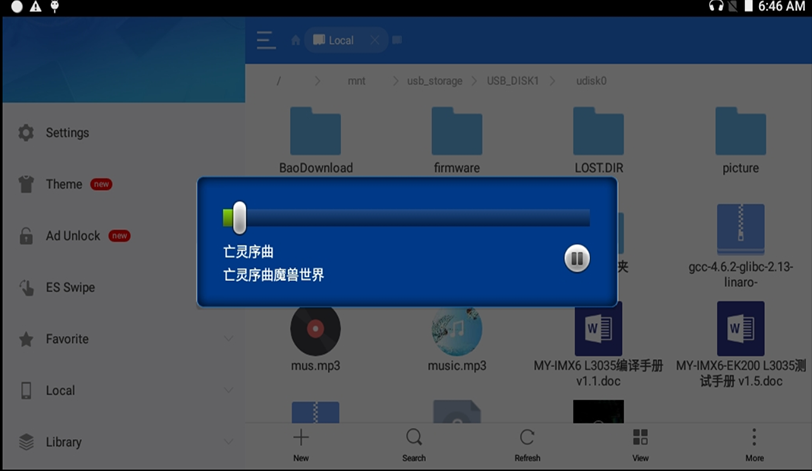

Standard GPIO test
~~~~~~~~~~~~~~~~~~~~

**Interface property**

+----------------------+-----------+---------------+-----------------+
| Evaluation model no. | LED label | GPIO property | IO order number |
+======================+===========+===============+=================+
| MYZR-RK3288-EK314    | D1        | GPIO0_B1      | 9               |
+                      +-----------+---------------+-----------------+
|                      | D2        | GPIO0_C2      | 18              |
+                      +-----------+---------------+-----------------+
|                      | D3        | GPIO0_B0      | 8               |
+                      +-----------+---------------+-----------------+
|                      | D4        | GPIO0_A7      | 7               |
+----------------------+-----------+---------------+-----------------+

**Test method**

|   1）GPIO output test
|   Set IO order number for GPIO of which need to be tested.

.. code:: shell

    ＃ OUT_IO_NUMBER=9

Lead out GPIO

.. code:: shell

    ＃ echo ${OUT_IO_NUMBER} > /sys/class/gpio/export

Set GPIO direction

.. code:: shell

    ＃ echo out > /sys/class/gpio/gpio${OUT_IO_NUMBER}/direction

Control outputed electrical level 

.. code:: shell

    ＃ echo 0 > /sys/class/gpio/gpio${OUT_IO_NUMBER}/value
    ＃ echo 1 > /sys/class/gpio/gpio${OUT_IO_NUMBER}/value

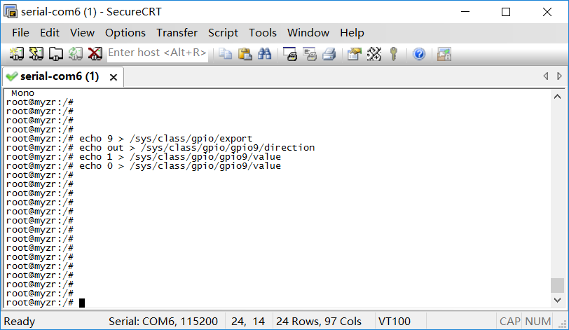

|   2）GPIO input test
|   Set IO order number for GPIO of which need to be tested .

.. code:: shell

    ＃ IN_IO_NUMBER=18

Lead out GPIO

.. code:: shell

    ＃ echo ${IN_IO_NUMBER} > /sys/class/gpio/export

Set GPIO direction

.. code:: shell

    ＃ echo in > /sys/class/gpio/gpio${IN_IO_NUMBER}/direction

Check inputed electrical level

.. code:: shell

    cat /sys/class/gpio/gpio${IN_IO_NUMBER}/value

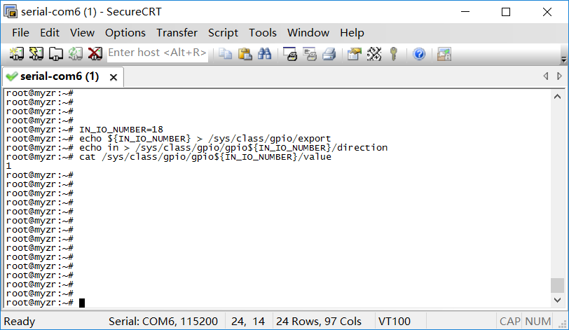

GPIO-KEY test
~~~~~~~~~~~~~~~

**Interface property**

+--------------------+---------------+--------------+
| MYZR-RK3288-EK314                                 |
+====================+===============+==============+
| Interface position | GPIO property | KEY property |
+--------------------+---------------+--------------+
| SW1                | gpio-keys     | Volume Down  |
+--------------------+---------------+--------------+
| SW2                | gpio-keys     | Volume Up    |
+--------------------+---------------+--------------+
| SW3                | gpio-keys     | Power        |
+--------------------+---------------+--------------+
| SW4                | gpio-keys     | Reset        |
+--------------------+---------------+--------------+
| SW5                | gpio-keys     | Recovery     |
+--------------------+---------------+--------------+

**Test method**

|   Press SW1 and SW2

**Figures**

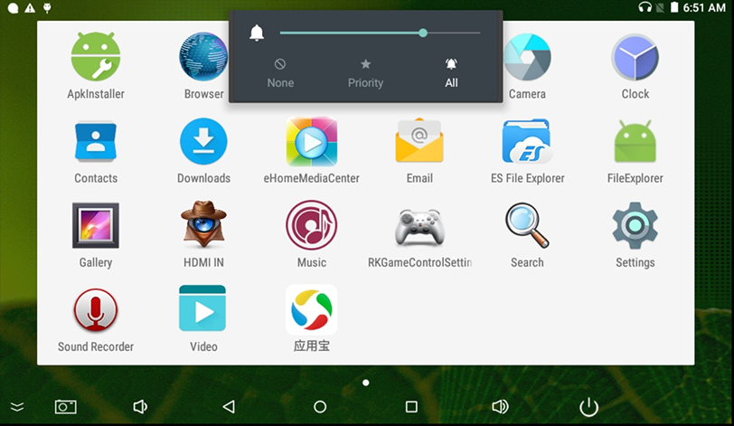

Serial port test
~~~~~~~~~~~~~~~~~~

|   MYZR-RK3288-EK314 has total 5 serial ports，one is debug seiral port，the other 4 are user serial ports.

**User serial port property**

+----------------------------+-------+--------------------+------------------+
| Evaluation board model no. | UARTx | Hardware interface | System interface |
+============================+=======+====================+==================+
| MYZR-RK3288-EK314          | UART0 | BT (Bluetooth)     | ttyS0            |
+                            +-------+--------------------+------------------+
|                            | UART1 | P3                 | ttyS1            |
+                            +-------+--------------------+------------------+
|                            | UART2 | P4 (DEBUG)         | ttyS2            |
+----------------------------+-------+--------------------+------------------+

|   Tips：transceiver pins of serial port are listed here,but please refer to schematic for definition of all pins of serial port.

**Serial port test**

- Install uart APK
- Figures

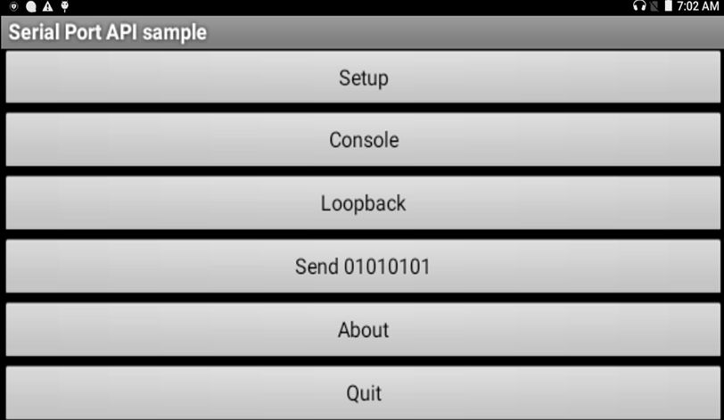

RTC test
~~~~~~~~~~~

**Test instruction**

|   Due to restrictions in transportation，MYZR-RK3288-EK314 evaluation board doesn't contatin battery in delivery。before RTC test please prepare button cell to install on evaluation board。
|   MYZR-RK3288-EK314 battery holder is located in“BT1”on front view of base board.

**Test method**

|   1）Power on, and look at the"clock"

- Figures

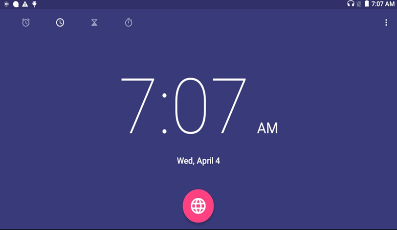

|   2）Power off ,wait for a while and power on

- Figures

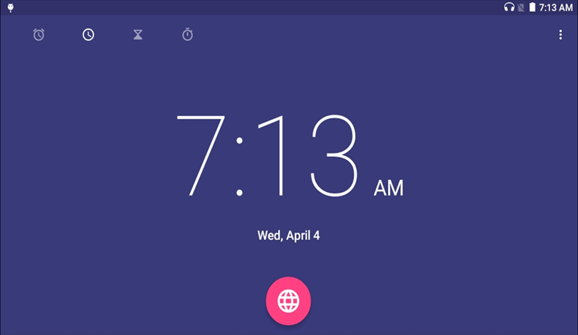

SPI test
~~~~~~~~~~

|   MYZR-RK3288-EK314 has two groups of SPI interfaces.

**Interface property**

|   Pins of MISO and MOSI need to be used for test,listed as below.

+----------------------------+------+--------+--------+------------------+
| Evaluation board model no. | SPIx |  MISO  |  MOSI  | System interface |
+============================+======+========+========+==================+
| MYZR-RK3288-EK314          | SPI1 | J11:33 | J11:35 | spidev0.0        |
+                            +------+--------+--------+------------------+
|                            | SPI2 | J11:38 | J13:34 | spidev2.0        |
+----------------------------+------+--------+--------+------------------+

**Test specification**

|   1）Adopt way of SPI self-sending(output)self-receiving(input).
|   Note：the test need a short connection of evaluation board pins,if you are not sure of how to conduct this kind of connection,please ask hardware engineer for a support,otherwise it may cause a damage of evaluation board.
|   2）SPI port which is matched up with SPI test program is SPI2，e.g.SPI test is SPI2 test.

**Test method**

|   1）Prepare test
|   Short connect MISO pin and MOSI pin of SPI2.
|   2）Execute test

.. code:: shell

    ＃ ./spi_test -D /dev/spidev0.0

|   3）Test result
|   If SPI is normal,you can see following charaters on terminal：

.. code:: shell

    FF FF FF FF FF FF
    40 00 00 00 00 95
    FF FF FF FF FF FF
    FF FF FF FF FF FF
    FF FF FF FF FF FF
    DE AD BE EF BA AD
    F0 0D

**Figures**

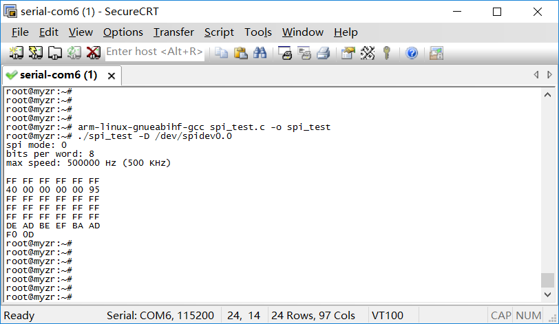

Camera ov13850 test
~~~~~~~~~~~~~~~~~~~~~

|   Connect the Camera, start up, and then open the "Camera", as follows:

- Figures

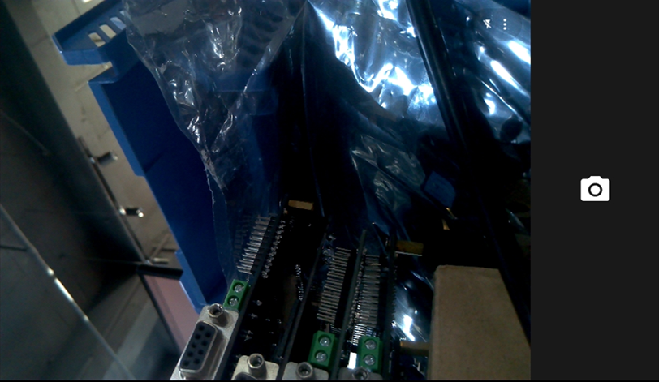

WIFI test
~~~~~~~~~~~

|   The WIFI chip model used on the MY-RK3288-EK314 evaluation board is AP6335.
|   1）Step 1
|   Click "Settings" -> "Wi-Fi" to open the WIFI switch.

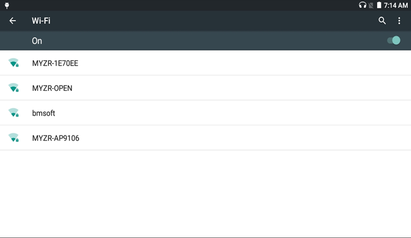

|   2）Step 2
|   Enter WIFI password and connect successfully.

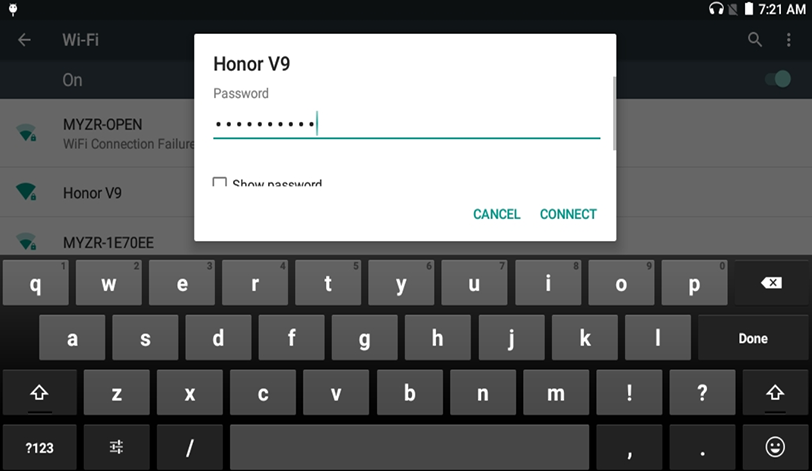

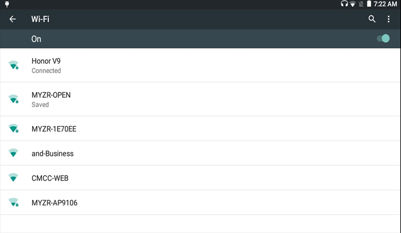

Bluetooth test
~~~~~~~~~~~~~~~~

|   The Bluetooth chip model used on the MY-RK3288-EK314 evaluation board is AP6335.
|   1）Step 1
|   Click on “Settings”->“Bluetooth”,turn on Bluetooth

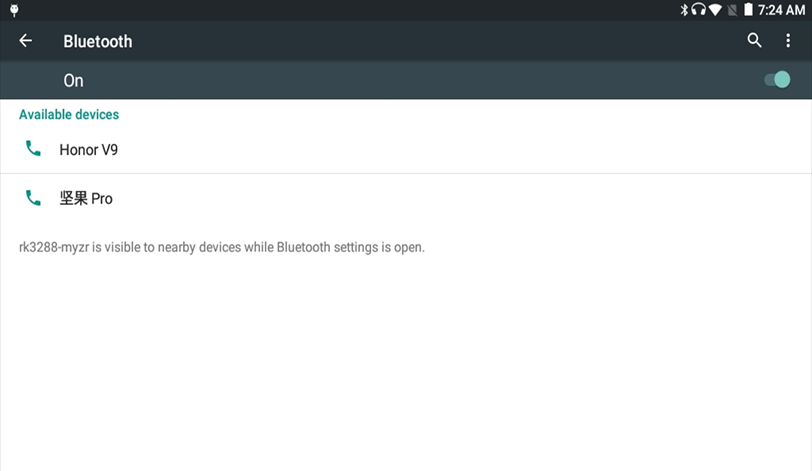

|   2）Step 2
|   Match

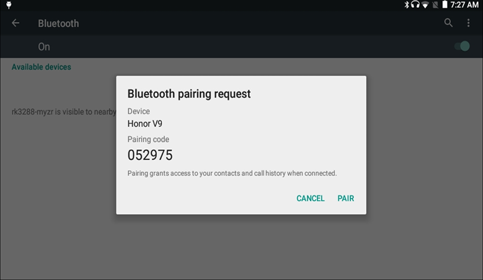

|   3）Step 3
|   Send and receive files

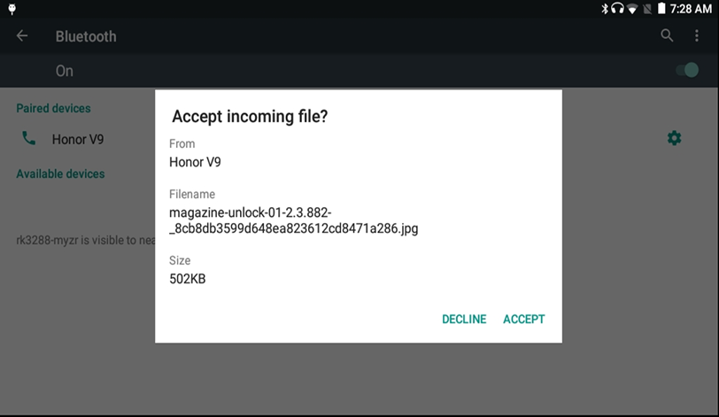

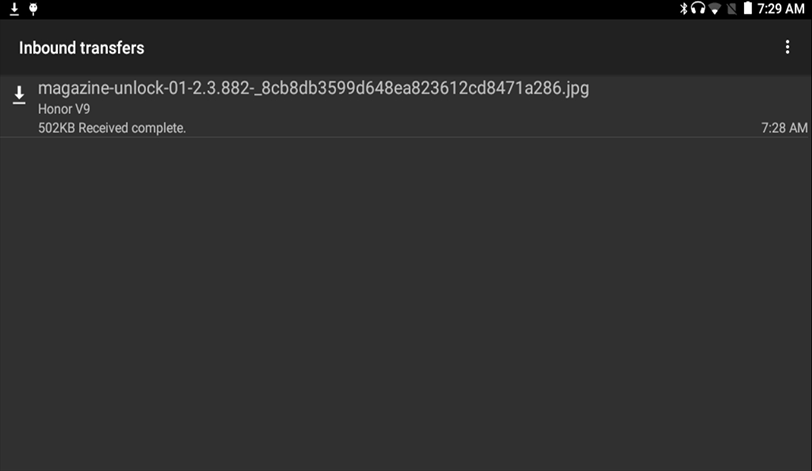

4G internet module test
~~~~~~~~~~~~~~~~~~~~~~~~~

**Test instruction**

|   Test online 4G module, such as L506.

**Test method**

- Power on with the module, display 3G logo.

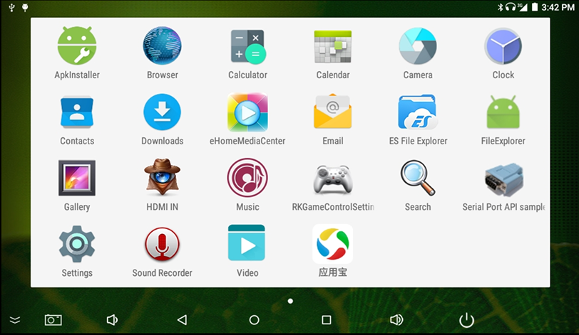

HDMI test
~~~~~~~~~~~

**Test instruction**

|   Connect HDMI.

**Test method**

- Burn resource-hdmi.img

|   Burn with AndroidTool_Release_v2.35.

- Test

|   Power on, HDMI has display image.

- Modify the resolution

|   To modify the resolution, modify arch/arm/boot/dts/lcd-box.dtsi.

EDP test
~~~~~~~~~~

**Test instruction**

|   Connect EDP.

**Test method**

- Burn resource-edp.img

|   Burn with AndroidTool_Release_v2.35.

- Test

|   Power on, EDP has display image

- Modify the resolution

|   To modify the resolution, modify arch/arm/boot/dts/lcd-EDP1080p.dtsi.