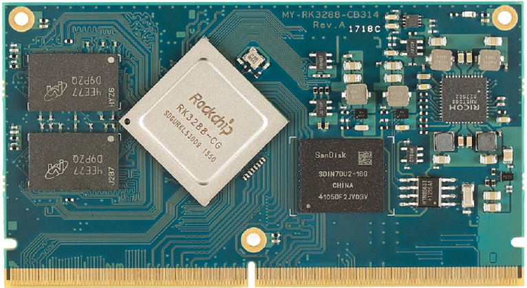
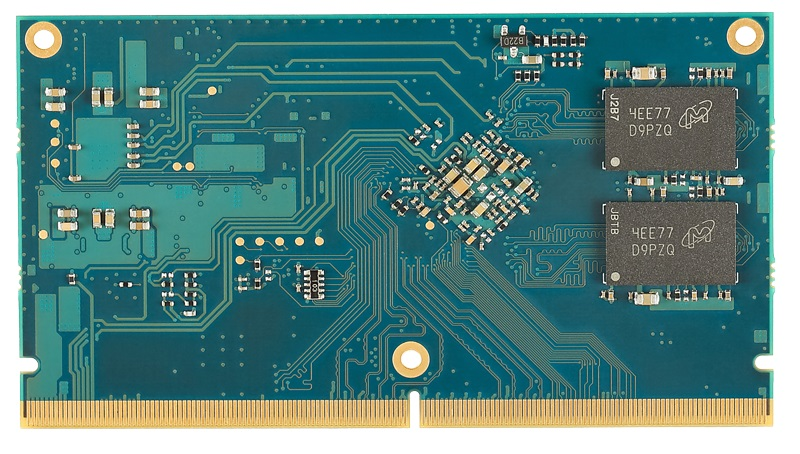
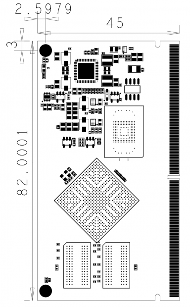

MYZR-RK3288-CB314 硬件介绍
===========================

MYZR-RK3288_CB314视图
-----------------------

**正面**

**背面**

**尺寸**

MYZR-RK3288_CB314参数
-----------------------

主控平台详细参数
~~~~~~~~~~~~~~~~~

- 1. 四核Cortex-A17，主频最高达1.8GHz；
- 2. Mali-T764 GPU，支持AFBC（帧缓冲压缩）；
- 3. 支持OpenGL ES1.1/2.0/3.1，OpenCL，DirectX9.3；
- 4. 支持4K 10bit VP9/H265/H264 视频解码，高达60fps；
- 5. 1080P 多格式视频解码（VC-1，MPEG-1/2/4，VP8）；
- 6. 视频后期处理器：反交错、去噪、边缘/细节/色彩优化；
- 7. 支持RGB，Dual LVDS，Dual MIPI-DSI，EDP显示接口，分辨率最高达3840*2160；
- 8. HDMI 2.0 支持4K 60Hz显示，支持HDCP 1.4/2.2；
- 9. ARM信任区（TEE），安全视频路径，密码引擎，安全启动；
- 10. 双通道64位ddr3 - 1333 / ddr3l - 1333；
- 11. 支持MLC NAND Flash，EMMC 4.51；
- 12. 内置13M ISP，支持MIPI CSI-2 and DVP接口；
- 13. 双路SDIO 3.0 接口；
- 14. TS in/CSA2.0，支持DTV功能；

硬件配置
~~~~~~~~~

+-------------------+--------+----------+-------------+----------+----------+----------------------+
|   核心板主型号    |  CPU   | 内存容量 |  存储容量   | 启动方式 | 烧录方式 |         其它         |
+===================+========+==========+=============+==========+==========+======================+
| MYZR-RK3288_CB314 | RK3288 | 1G/2G    | eMMC:4G~32G | eMMC     | 按键进入 | 标配：内存1G，存储4G |
+-------------------+--------+----------+-------------+----------+----------+----------------------+

温度范围
~~~~~~~~~

- **工作温度**

   商业级：0°C ~ 70°C

- **存储温度**

   -40°C ~ 125°C

操作系统支持
-------------

   - 内核：Linux-3.10.79
   - 内核：Andorid 5.1
   - 内核：ubuntu14.04

硬件接口
----------

+--------------+----------+------------------+------------------------------------------------------------------------------------+
|   接口规格              | 最大可配置接口数 |                                        描述                                        |
+==============+==========+==================+====================================================================================+
| 多媒体       | EDP      | 1                | - 支持EDP1.3，多达4通道，(2.7/1.62 Gbps/通道，HBR2/HBR/RBR)，4Kx2K@30fps；         |
|              |          |                  | - 支持RGB, YCbCr 4:4:4, YCbCr 4:2:2 和 8/10/12bit 视频格式                         |
+              +----------+------------------+------------------------------------------------------------------------------------+
|              | HDMI     | 1                | - 支持 HDMI1.4 和 2.0，且支持 HDCP 1.4；                                           |
|              |          |                  | - 支持 1080p（120 Hz）、4k x 2k（60 Hz）HDTV显示，和QXGA图形显示                   |
+              +----------+------------------+------------------------------------------------------------------------------------+
|              | LVDS     | 1                | - 结合LVTTL IO，支持LVDS / LVTTL数据输出，                                         |
|              |          |                  | - 支持LVDS RGB 30/24/18bits彩色数据传输，参考时钟频率：10Mhz~148.5Mhz              |
|              |          |                  | - 支持LVDS单/双通道数据传输，每通道包括5个数据通道和1个时钟通道"                   |
+              +----------+------------------+------------------------------------------------------------------------------------+
|              | LCD      | 2                |                                                                                    |
+              +----------+------------------+------------------------------------------------------------------------------------+
|              | MIPI     | 3                | - 支持3路MIPI，每路多达4条通道（4Gbps/通道），                                     |
|              |          |                  | - 支持1080p @ 60fps输出，其中MIPI0 仅用于 DSI, MIPI1 用于 DSI或CSI, MIPI2 仅用于CSI|
+              +----------+------------------+------------------------------------------------------------------------------------+
|              | CIF      | 1                | 8 bit                                                                              |
+              +----------+------------------+------------------------------------------------------------------------------------+
|              | I2S/PCM  | 8                |  支持主/从模式，软件可配置，16bits ~ 32bits音频分辨率，采样率高达192KHz            |
+              +----------+------------------+------------------------------------------------------------------------------------+
|              | SPDIF    | 1                | 在线性PCM模式下支持16、20、24位音频数据传输                                        |
+--------------+----------+------------------+------------------------------------------------------------------------------------+
| 外部存储接口 | SDMMC    | 1                | 4bit，管脚电平：3.3V                                                               |
+              +----------+------------------+------------------------------------------------------------------------------------+
|              | SDIO3.0  | 1                | 4bit，管脚电平：3.3V                                                               |
+--------------+----------+------------------+------------------------------------------------------------------------------------+
| 其他         | Ethernet | 1                | 10/100/1000Mbps                                                                    |
+              +----------+------------------+------------------------------------------------------------------------------------+
|              | USB      | 3                | - 支持2路USB HOST2.0 和 1路USB OTG 2.0，                                           |
|              |          |                  | - 支持高速（480Mbps），全速（12Mbps）和低速（1.5Mbps）模式                         |
+              +----------+------------------+------------------------------------------------------------------------------------+
|              | UART     | 5                | 支持 5bit,6bit,7bit,8bit 串行数据收发                                              |
+              +----------+------------------+------------------------------------------------------------------------------------+
|              | I2C      | 6                | 支持7/10位地址模式，快速模式下可高达400 kbit / s的速率传输                         |
+              +----------+------------------+------------------------------------------------------------------------------------+
|              | SPI(M/S) | 3                | - 支持串行主/从模式，由软件配置（在主模式下支持2个片选输出）；                     |
|              |          |                  | - 内置两个 32 x 16bit FIFO，分别用于 TX 和 RX                                      |
+              +----------+------------------+------------------------------------------------------------------------------------+
|              | PWM      | 4                | 32bit 定时器/计数器                                                                |
+              +----------+------------------+------------------------------------------------------------------------------------+
|              | ADC      | 3                | 10bit，高达1MS/s采样率                                                             |
+              +----------+------------------+------------------------------------------------------------------------------------+
|              | Timer    | 8                |                                                                                    |
+--------------+----------+------------------+------------------------------------------------------------------------------------+

管脚详细功能说明
-----------------

**表1**

+----------+--------------+-------------+---------------------------------------------------------+-------+
| 管脚序号 |   管脚名称   | CPU管脚位号 |                       CPU管脚名称                       | 电压  |
+==========+==============+=============+=========================================================+=======+
| P1       | GND          | --          | --                                                      | 0V    |
+----------+--------------+-------------+---------------------------------------------------------+-------+
| P2       | GND          | --          | --                                                      | 0V    |
+----------+--------------+-------------+---------------------------------------------------------+-------+
| P3       | GND          | --          | --                                                      | 0V    |
+----------+--------------+-------------+---------------------------------------------------------+-------+
| P4       | RGMII_RXD2   | AB1         | HOST_D2/MAC_RXD2/SDIO1_D2/FLASH1_D2/GPIO3_D2_u          | 3.3V  |
+----------+--------------+-------------+---------------------------------------------------------+-------+
| P5       | RGMII_TXD1   | AB2         | HOST_D5/MAC_TXD1/SDIO1_WRPRT/FLASH1_D5/GPIO3_D5_u       | 3.3V  |
+----------+--------------+-------------+---------------------------------------------------------+-------+
| P6       | RGMII_RXD3   | AC1         | HOST_D3/MAC_RXD3/SDIO1_D3/FLASH1_D3/GPIO3_D3_u          | 3.3V  |
+----------+--------------+-------------+---------------------------------------------------------+-------+
| P7       | RGMII_RXDV   | AC2         | HOST_CKOUTN/MAC_RXDV/FLASH0_CSn4/FLASH1_WP/GPIO4_A1_u   | 3.3V  |
+----------+--------------+-------------+---------------------------------------------------------+-------+
| P8       | RGMII_TXD0   | AD1         | HOST_D4/MAC_TXD0/SDIO1_DET/FLASH1_D4/GPIO3_D4_u         | 3.3V  |
+----------+--------------+-------------+---------------------------------------------------------+-------+
| P9       | RGMII_TXEN   | AD2         | HOST_D10/MAC_TXEN/FLASH0_CSn7/FLASH1_CLE/GPIO4_A4_u     | 3.3V  |
+----------+--------------+-------------+---------------------------------------------------------+-------+
| P10      | RGMII_RXER   | AE1         | HOST_D8/MAC_RXER/FLASH0_CSn5/FLASH1_RDN/GPIO4_A2_u      | 3.3V  |
+----------+--------------+-------------+---------------------------------------------------------+-------+
| P11      | GND          | --          | --                                                      | 0V    |
+----------+--------------+-------------+---------------------------------------------------------+-------+
| P12      | RGMII_CLK    | AE2         | HOST_D9/MAC_CLK/FLASH0_CSn6/FLASH1_ALE/GPIO4_A3_u       | 3.3V  |
+----------+--------------+-------------+---------------------------------------------------------+-------+
| P13      | GND          | --          | --                                                      | 0V    |
+----------+--------------+-------------+---------------------------------------------------------+-------+
| P14      | RGMII_RXD0   | AA3         | HOST_D6/MAC_RXD0/SDIO1_BKPWR/FLASH1_D6/GPIO3_D6_u       | 3.3V  |
+----------+--------------+-------------+---------------------------------------------------------+-------+
| P15      | RGMII_RXD1   | AA4         | HOST_D7/MAC_RXD1/SDIO1_INTn/FLASH1_D7/GPIO3_D7_u        | 3.3V  |
+----------+--------------+-------------+---------------------------------------------------------+-------+
| P16      | RGMII_TXD2   | Y4          | HOST_D0/MAC_TXD2/SDIO1_D0/FLASH1_D0/GPIO3_D0_u          | 3.3V  |
+----------+--------------+-------------+---------------------------------------------------------+-------+
| P17      | RGMII_TXD3   | V6          | HOST_D1/MAC_TXD3/SDIO1_D1/FLASH1_D1/GPIO3_D1_u          | 3.3V  |
+----------+--------------+-------------+---------------------------------------------------------+-------+
| P18      | RGMII_TXCLK  | V7          | HOST_D15/MAC_TXCLK/SDIO1_PWREN/FLASH1_CSn2/GPIO4_B1_u   | 3.3V  |
+----------+--------------+-------------+---------------------------------------------------------+-------+
| P19      | RGMII_RXCLK  | AB5         | HOST_D12/MAC_RXCLK/SDIO1_CMD/FLASH1_CSn0/GPIO4_A6_u     | 3.3V  |
+----------+--------------+-------------+---------------------------------------------------------+-------+
| P20      | RGMII_MDC    | AC3         | HOST_CKOUTP/MAC_MDC/FLASH1_RDY/GPIO4_A0_u               | 3.3V  |
+----------+--------------+-------------+---------------------------------------------------------+-------+
| P21      | RGMII_MDIO   | Y5          | HOST_D11/MAC_MDIO/FLASH1_WRN/GPIO4_A5_u                 | 3.3V  |
+----------+--------------+-------------+---------------------------------------------------------+-------+
| P22      | RGMII_RST    | AA5         | HOST_D14/MAC_COL/FLASH1_DQS/FLASH1_CSn3/GPIO4_B0_u      | 3.3V  |
+----------+--------------+-------------+---------------------------------------------------------+-------+
| P23      | RGMII_CRS    | AA6         | HOST_D13/MAC_CRS/SDIO1_CLKOUT/FLASH1_CSn1/GPIO4_A7_u    | 3.3V  |
+----------+--------------+-------------+---------------------------------------------------------+-------+
| P24      | GND          | --          | --                                                      | 0V    |
+----------+--------------+-------------+---------------------------------------------------------+-------+
| P25      | SDIO0_D3     | AH7         | SDIO0_D3/GPIO4_C7_u                                     | 2.2V  |
+----------+--------------+-------------+---------------------------------------------------------+-------+
| P26      | SDIO0_CMD    | AH8         | SDIO0_CMD/GPIO4_D0_u                                    | 2.2 V |
+----------+--------------+-------------+---------------------------------------------------------+-------+
| P27      | SDIO0_D0     | AH9         | SDIO0_D0/GPIO4_C4_u                                     | 2.2 V |
+----------+--------------+-------------+---------------------------------------------------------+-------+
| P28      | SDIO0_D2     | AG9         | SDIO0_D2/GPIO4_C6_u                                     | 2.2V  |
+----------+--------------+-------------+---------------------------------------------------------+-------+
| P29      | SDIO0_D1     | AH10        | SDIO0_D1/GPIO4_C5_u                                     | 2.2V  |
+----------+--------------+-------------+---------------------------------------------------------+-------+
| P30      | SDIO0_CLK    | AG8         | SDIO0_CLKOUT/GPIO4_D1_d                                 | 2.2V  |
+----------+--------------+-------------+---------------------------------------------------------+-------+
| P31      | GND          | --          | --                                                      | 0V    |
+----------+--------------+-------------+---------------------------------------------------------+-------+
| P32      | GND          | --          | --                                                      | 0V    |
+----------+--------------+-------------+---------------------------------------------------------+-------+
| P33      | GND          | --          | --                                                      | 0V    |
+----------+--------------+-------------+---------------------------------------------------------+-------+
| P34      | GND          | --          | --                                                      | 0V    |
+----------+--------------+-------------+---------------------------------------------------------+-------+
| P35      | GND          | --          | --                                                      | 0V    |
+----------+--------------+-------------+---------------------------------------------------------+-------+
| P36      | GND          | --          | --                                                      | 0V    |
+----------+--------------+-------------+---------------------------------------------------------+-------+
| P37      | UART0_CTS    | AB12        | UART0_CTSn/GPIO4_C2_u                                   | 2.2 V |
+----------+--------------+-------------+---------------------------------------------------------+-------+
| P38      | UART0_RTS    | AB11        | UART0_RTSn/GPIO4_C3_u                                   | 2.2V  |
+----------+--------------+-------------+---------------------------------------------------------+-------+
| P39      | UART0_TXD    | AG10        | UART0_TXD/GPIO4_C1_d                                    | 2.2 V |
+----------+--------------+-------------+---------------------------------------------------------+-------+
| P40      | UART0_RXD    | AH11        | UART0_RXD/GPIO4_C0_u                                    | 2.2V  |
+----------+--------------+-------------+---------------------------------------------------------+-------+
| P41      | I2C2_SCL     | AD12        | I2C2_SCL/GPIO6_B2_u                                     | 3.3 V |
+----------+--------------+-------------+---------------------------------------------------------+-------+
| P42      | I2C2_SDA     | AF12        | I2C2_SDA/GPIO6_B1_u                                     | 3.3V  |
+----------+--------------+-------------+---------------------------------------------------------+-------+
| P43      | SPDIF_TX     | AE12        | SPDIF_TX/GPIO6_B3_d                                     | 3.3V  |
+----------+--------------+-------------+---------------------------------------------------------+-------+
| P44      | GND          | --          | --                                                      | 0V    |
+----------+--------------+-------------+---------------------------------------------------------+-------+
| P45      | EDP_TX0P     | AG14        | eDP_TX0P                                                | 1.8V  |
+----------+--------------+-------------+---------------------------------------------------------+-------+
| P46      | EDP_TX0N     | AH14        | eDP_TX0N                                                | 1.8V  |
+----------+--------------+-------------+---------------------------------------------------------+-------+
| P47      | GND          | --          | --                                                      | 0V    |
+----------+--------------+-------------+---------------------------------------------------------+-------+
| P48      | EDP_TX1P     | AG15        | eDP_TX1P                                                | 1.8V  |
+----------+--------------+-------------+---------------------------------------------------------+-------+
| P49      | EDP_TX1N     | AH15        | eDP_TX1N                                                | 1.8V  |
+----------+--------------+-------------+---------------------------------------------------------+-------+
| P50      | GND          | --          | --                                                      | 0V    |
+----------+--------------+-------------+---------------------------------------------------------+-------+
| P51      | EDP_TX2P     | AG16        | eDP_TX2P                                                | 1.8V  |
+----------+--------------+-------------+---------------------------------------------------------+-------+
| P52      | EDP_TX2N     | AH16        | eDP_TX2N                                                | 1.8V  |
+----------+--------------+-------------+---------------------------------------------------------+-------+
| P53      | GND          | --          | --                                                      | 0V    |
+----------+--------------+-------------+---------------------------------------------------------+-------+
| P54      | EDP_TX3P     | AG17        | eDP_TX3P                                                | 1.8V  |
+----------+--------------+-------------+---------------------------------------------------------+-------+
| P55      | EDP_TX3N     | AH17        | eDP_TX3N                                                | 1.8V  |
+----------+--------------+-------------+---------------------------------------------------------+-------+
| P56      | GND          | --          | --                                                      | 0V    |
+----------+--------------+-------------+---------------------------------------------------------+-------+
| P57      | EDPAUXP      | AG18        | eDP_AXUP                                                | 1.8V  |
+----------+--------------+-------------+---------------------------------------------------------+-------+
| P58      | EDPAUXN      | AH18        | eDP_AXUN                                                | 1.8V  |
+----------+--------------+-------------+---------------------------------------------------------+-------+
| P59      | GND          | --          | --                                                      | 0V    |
+----------+--------------+-------------+---------------------------------------------------------+-------+
| P60      | MIPI_RX_D0N  | AH23        | MIPI_RX_D0N                                             | 1.8V  |
+----------+--------------+-------------+---------------------------------------------------------+-------+
| P61      | MIPI_RX_D0P  | AG23        | MIPI_RX_D0P                                             | 1.8V  |
+----------+--------------+-------------+---------------------------------------------------------+-------+
| P62      | GND          | --          | --                                                      | 0V    |
+----------+--------------+-------------+---------------------------------------------------------+-------+
| P63      | MIPI_RX_D1N  | AH24        | MIPI_RX_D1N                                             | 1.8V  |
+----------+--------------+-------------+---------------------------------------------------------+-------+
| P64      | MIPI_RX_D1P  | AG24        | MIPI_RX_D1P                                             | 1.8V  |
+----------+--------------+-------------+---------------------------------------------------------+-------+
| P65      | GND          | --          | --                                                      | 0V    |
+----------+--------------+-------------+---------------------------------------------------------+-------+
| P66      | MIPI_RX_CLKN | AH25        | MIPI_RX_CLKN                                            | 1.8V  |
+----------+--------------+-------------+---------------------------------------------------------+-------+
| P67      | MIPI_RX_CLKP | AG25        | MIPI_RX_CLKP                                            | 1.8V  |
+----------+--------------+-------------+---------------------------------------------------------+-------+
| P68      | GND          | --          | --                                                      | 0V    |
+----------+--------------+-------------+---------------------------------------------------------+-------+
| P69      | MIPI_RX_D2N  | AH26        | MIPI_RX_D2N                                             | 1.8V  |
+----------+--------------+-------------+---------------------------------------------------------+-------+
| P70      | MIPI_RX_D2P  | AG26        | MIPI_RX_D2P                                             | 1.8V  |
+----------+--------------+-------------+---------------------------------------------------------+-------+
| P71      | GND          | --          | --                                                      | 0V    |
+----------+--------------+-------------+---------------------------------------------------------+-------+
| P72      | MIPI_RX_D3N  | AH27        | MIPI_RX_D3N                                             | 1.8V  |
+----------+--------------+-------------+---------------------------------------------------------+-------+
| P73      | MIPI_RX_D3P  | AH28        | MIPI_RX_D3P                                             | 1.8V  |
+----------+--------------+-------------+---------------------------------------------------------+-------+
| P74      | GND          | --          | --                                                      | 0V    |
+----------+--------------+-------------+---------------------------------------------------------+-------+
| P75      | GND          | --          | --                                                      | 0V    |
+----------+--------------+-------------+---------------------------------------------------------+-------+
| P76      | LVDS_D4P     | AA27        | TRACE_D8/LCDC0_D8/LVDS_D4P                              | 3.3V  |
+----------+--------------+-------------+---------------------------------------------------------+-------+
| P77      | LVDS_D4N     | AA28        | TRACE_D9/LCDC0_D9/LVDS_D4N                              | 3.3V  |
+----------+--------------+-------------+---------------------------------------------------------+-------+
| P78      | LVDS_D3P     | Y27         | TRACE_D6/LCDC0_D6/LVDS_D3P                              | 3.3V  |
+----------+--------------+-------------+---------------------------------------------------------+-------+
| P79      | LVDS_D3N     | Y28         | TRACE_D7/LCDC0_D7/LVDS_D3N                              | 3.3V  |
+----------+--------------+-------------+---------------------------------------------------------+-------+
| P80      | LVDS_D2P     | W27         | TRACE_D4/LCDC0_D4/LVDS_D2P                              | 3.3V  |
+----------+--------------+-------------+---------------------------------------------------------+-------+
| P81      | LVDS_D2N     | W28         | TRACE_D5/LCDC0_D5/LVDS_D2N                              | 3.3V  |
+----------+--------------+-------------+---------------------------------------------------------+-------+
| P82      | LVDS_CLK0P   | V27         | TRACE_D10/LCDC0_D10/LVDS_CLK0P                          | 3.3V  |
+----------+--------------+-------------+---------------------------------------------------------+-------+
| P83      | LVDS_CLK0N   | V28         | TRACE_D11/LCDC0_D11/LVDS_CLK0N                          | 3.3V  |
+----------+--------------+-------------+---------------------------------------------------------+-------+
| P84      | LVDS_D1P     | U27         | TRACE_D2/LCDC0_D2/LVDS_D1P                              | 3.3V  |
+----------+--------------+-------------+---------------------------------------------------------+-------+
| P85      | LVDS_D1N     | U28         | TRACE_D3/LCDC0_D3/LVDS_D1N                              | 3.3V  |
+----------+--------------+-------------+---------------------------------------------------------+-------+
| P86      | LVDS_D0P     | T27         | TRACE_D0/LCDC0_D0/LVDS_D0P                              | 3.3V  |
+----------+--------------+-------------+---------------------------------------------------------+-------+
| P87      | LVDS_D0N     | T28         | TRACE_D1/LCDC0_D1/LVDS_D0N                              | 3.3V  |
+----------+--------------+-------------+---------------------------------------------------------+-------+
| P88      | LVDS_D8P     | AB27        | LCDC0_D18/LVDS_D8P                                      | 3.3V  |
+----------+--------------+-------------+---------------------------------------------------------+-------+
| P89      | LVDS_D8N     | AB28        | LCDC0_D19/LVDS_D8N                                      | 3.3V  |
+----------+--------------+-------------+---------------------------------------------------------+-------+
| P90      | LVDS_D9N     | AC26        | LCDC0_D21/LVDS_D9N                                      | 3.3V  |
+----------+--------------+-------------+---------------------------------------------------------+-------+
| P91      | LVDS_D9P     | AC25        | LCDC0_D20/LVDS_D9P                                      | 3.3V  |
+----------+--------------+-------------+---------------------------------------------------------+-------+
| P92      | LVDS_D7N     | AA26        | TRACE_CTL/LCDC0_D17/LVDS_D7N                            | 3.3V  |
+----------+--------------+-------------+---------------------------------------------------------+-------+
| P93      | LVDS_D7P     | AA25        | TRACE_CLK/LCDC0_D16/LVDS_D7P                            | 3.3V  |
+----------+--------------+-------------+---------------------------------------------------------+-------+
| P94      | LVDS_CLK1N   | Y26         | LCDC0_D23/LVDS_CLK1N                                    | 3.3V  |
+----------+--------------+-------------+---------------------------------------------------------+-------+
| P95      | LVDS_CLK1P   | Y25         | LCDC0_D22/LVDS_CLK1P                                    | 3.3V  |
+----------+--------------+-------------+---------------------------------------------------------+-------+
| P96      | LVDS_D6P     | V25         | TRACE_D14/LCDC0_D14/LVDS_D6P                            | 3.3V  |
+----------+--------------+-------------+---------------------------------------------------------+-------+
| P97      | LVDS_D6N     | V26         | TRACE_D15/LCDC0_D15/LVDS_D6N                            | 3.3V  |
+----------+--------------+-------------+---------------------------------------------------------+-------+
| P98      | LVDS_D5P     | U25         | TRACE_D12/LCDC0_D12/LVDS_D5P                            | 3.3V  |
+----------+--------------+-------------+---------------------------------------------------------+-------+
| P99      | LVDS_D5N     | U26         | TRACE_D13/LCDC0_D13/LVDS_D5N                            | 3.3V  |
+----------+--------------+-------------+---------------------------------------------------------+-------+
| P100     | LCDC0_VSYNC  | AB24        | LCDC0_VSYNC/GPIO1_D1_d                                  | 3.3V  |
+----------+--------------+-------------+---------------------------------------------------------+-------+
| P101     | GND          | --          | --                                                      | 0V    |
+----------+--------------+-------------+---------------------------------------------------------+-------+
| P102     | LCDC0_DCLK   | AA24        | LCDC0_DCLK/GPIO1_D3_d                                   | 3.3V  |
+----------+--------------+-------------+---------------------------------------------------------+-------+
| P103     | GND          | --          | --                                                      | 0V    |
+----------+--------------+-------------+---------------------------------------------------------+-------+
| P104     | LCDC0_HSYNC  | AA23        | LCDC0_HSYNC/GPIO1_D0_d                                  | 3.3V  |
+----------+--------------+-------------+---------------------------------------------------------+-------+
| P105     | LCDC0_DEN    | AA22        | LCDC0_DEN/GPIO1_D2_d                                    | 3.3V  |
+----------+--------------+-------------+---------------------------------------------------------+-------+
| P106     | I2C3_SCL     | P22         | I2C3_SCL/GPIO2_C0_u                                     | 1.8V  |
+----------+--------------+-------------+---------------------------------------------------------+-------+
| P107     | I2C3_SDA     | R23         | I2C3_SDA/GPIO2_C1_u                                     | 1.8V  |
+----------+--------------+-------------+---------------------------------------------------------+-------+
| P108     | GPIO2_B6     | R26         | CIF_D1/GPIO2_B5_d                                       | 1.8V  |
+----------+--------------+-------------+---------------------------------------------------------+-------+
| P109     | GPIO2_B5     | R27         | CIF_D0/GPIO2_B4_d                                       | 1.8V  |
+----------+--------------+-------------+---------------------------------------------------------+-------+
| P110     | GND          | --          | --                                                      | 0V    |
+----------+--------------+-------------+---------------------------------------------------------+-------+
| P111     | ADC_IN0      | P24         | ADC_IN0                                                 | 1.8V  |
+----------+--------------+-------------+---------------------------------------------------------+-------+
| P112     | ADC_IN2      | P23         | ADC_IN2                                                 | 1.8V  |
+----------+--------------+-------------+---------------------------------------------------------+-------+
| P113     | RECOVER      | P21         | RECOVER/ADC_IN1                                         | 1.8V  |
+----------+--------------+-------------+---------------------------------------------------------+-------+
| P114     | GND          | --          | --                                                      | 0V    |
+----------+--------------+-------------+---------------------------------------------------------+-------+
| P115     | EFUSE_PWR    | K27         | EFUSE_PWREN/PMUGPIO0_A3_u                               | 3.3V  |
+----------+--------------+-------------+---------------------------------------------------------+-------+
| P116     | PMUGPIO0_B5  | L28         | CLK27M_IN/PMUGPIO0_B5_d                                 | 3.3V  |
+----------+--------------+-------------+---------------------------------------------------------+-------+
| P117     | OTG_VBUS_DRV | M28         | PMUGPIO0_B4_d                                           | 3.3V  |
+----------+--------------+-------------+---------------------------------------------------------+-------+
| P118     | PHONE_CTL    | L27         | PMUGPIO0_B3_d                                           | 3.3V  |
+----------+--------------+-------------+---------------------------------------------------------+-------+
| P119     | UART2_RXD    | J25         | UART2_RX/IR_RX/PWM2/GPIO7_C6_u                          | 3.3V  |
+----------+--------------+-------------+---------------------------------------------------------+-------+
| P120     | UART2_TXD    | H28         | UART2_TX/IR_TX/PWM3/EDPHDMI_CEC/GPIO7_C7_u              | 3.3V  |
+----------+--------------+-------------+---------------------------------------------------------+-------+
| P121     | HDMI_CEC     | G28         | ISP_FLASHTRIGIN/EDPHDMI_CEC_T1/GPIO7_C0_u               | 3.3V  |
+----------+--------------+-------------+---------------------------------------------------------+-------+
| P122     | SPK_CTL      | G27         | ISP_SHUTTERTRIG/SPI1_TXD/GPIO7_B7_d                     | 3.3V  |
+----------+--------------+-------------+---------------------------------------------------------+-------+
| P123     | FLASH_EN     | F28         | ISP_PRELIGHTTRIG/SPI1_RXD/GPIO7_B6_d                    | 3.3V  |
+----------+--------------+-------------+---------------------------------------------------------+-------+
| P124     | UART3_RTS    | F27         | UART3_RTSn/GPIO7_B2_u                                   | 3.3V  |
+----------+--------------+-------------+---------------------------------------------------------+-------+
| P125     | EDP_HPD      | E28         | eDP_HOTPLUG/GPIO7_B3_d                                  | 3.3V  |
+----------+--------------+-------------+---------------------------------------------------------+-------+
| P126     | UART3_RX     | E27         | GPS_MAG/HSADC_D0_T1/UART3_RX/GPIO7_A7_u                 | 3.3V  |
+----------+--------------+-------------+---------------------------------------------------------+-------+
| P127     | BL_EN        | D28         | GPIO7_A2_d                                              | 3.3V  |
+----------+--------------+-------------+---------------------------------------------------------+-------+
| P128     | LED4         | L25         | PMUGPIO0_B1_u                                           | 3.3V  |
+----------+--------------+-------------+---------------------------------------------------------+-------+
| P129     | LED3         | M24         | PMUGPIO0_C2_u                                           | 3.3V  |
+----------+--------------+-------------+---------------------------------------------------------+-------+
| P130     | LED2         | L24         | PMUGPIO0_B0_u                                           | 3.3V  |
+----------+--------------+-------------+---------------------------------------------------------+-------+
| P131     | LED1         | L23         | PMUGPIO0_A7_u                                           | 3.3V  |
+----------+--------------+-------------+---------------------------------------------------------+-------+
| P132     | KEY_VOL_N    | M22         | PMUGPIO0_B6_d                                           | 3.3V  |
+----------+--------------+-------------+---------------------------------------------------------+-------+
| P133     | KEY_VOL_P    | L22         | PMUGPIO0_A6_u                                           | 3.3V  |
+----------+--------------+-------------+---------------------------------------------------------+-------+
| P134     | I2C5_SDA     | H26         | I2C5_SDA/EDPHDMI_I2C_SDA/GPIO7_C3_u                     | 3.3V  |
+----------+--------------+-------------+---------------------------------------------------------+-------+
| P135     | I2C5_SCL     | J24         | I2C5_SCL/EDPHDMI_I2C_SCL/GPIO7_C4_u                     | 3.3V  |
+----------+--------------+-------------+---------------------------------------------------------+-------+
| P136     | I2C4_SDA     | H25         | I2C4_SDA/GPIO7_C1_u                                     | 3.3V  |
+----------+--------------+-------------+---------------------------------------------------------+-------+
| P137     | I2C4_SCL     | J23         | I2C4_SCL/GPIO7_C2_u                                     | 3.3V  |
+----------+--------------+-------------+---------------------------------------------------------+-------+
| P138     | PWR_KEY      | --          | NC                                                      | 5V    |
+----------+--------------+-------------+---------------------------------------------------------+-------+
| P139     | RESET_KEY    | --          | 复位管脚，拉低 RESET_KEY 管脚可复位                     | 5V    |
+----------+--------------+-------------+---------------------------------------------------------+-------+
| P140     | PMIC_PWRON   | --          | 电源开关管脚，内部 10K 上拉，拉低至少 100ms PMU启动电源 | 5V    |
+----------+--------------+-------------+---------------------------------------------------------+-------+
| P141     | OTP_RESET    | L26         | OTP_OUT/PMUGPIO0_B2_d                                   | 3.3V  |
+----------+--------------+-------------+---------------------------------------------------------+-------+
| P142     | HSIC_STROBE  | B27         | HSIC_STROBE                                             | 1.0V  |
+----------+--------------+-------------+---------------------------------------------------------+-------+
| P143     | HSIC_DATA    | A27         | HSIC_DATA                                               | 1.0V  |
+----------+--------------+-------------+---------------------------------------------------------+-------+
| P144     | RTC_CLKOUT2  | CLKOUT      | 32.768KHz 输出                                          | --    |
+----------+--------------+-------------+---------------------------------------------------------+-------+
| P145     | GND          | --          | --                                                      | 0V    |
+----------+--------------+-------------+---------------------------------------------------------+-------+
| P146     | GND          | --          | --                                                      | 0V    |
+----------+--------------+-------------+---------------------------------------------------------+-------+
| P147     | GND          | --          | --                                                      | 0V    |
+----------+--------------+-------------+---------------------------------------------------------+-------+
| P148     | GND          | --          | --                                                      | 0V    |
+----------+--------------+-------------+---------------------------------------------------------+-------+
| P149     | GND          | --          | --                                                      | 0V    |
+----------+--------------+-------------+---------------------------------------------------------+-------+
| P150     | GND          | --          | --                                                      | 0V    |
+----------+--------------+-------------+---------------------------------------------------------+-------+
| P151     | GND          | --          | --                                                      | 0V    |
+----------+--------------+-------------+---------------------------------------------------------+-------+
| P152     | GND          | --          | --                                                      | 0V    |
+----------+--------------+-------------+---------------------------------------------------------+-------+
| P153     | GND          | --          | --                                                      | 0V    |
+----------+--------------+-------------+---------------------------------------------------------+-------+
| P154     | GND          | --          | --                                                      | 0V    |
+----------+--------------+-------------+---------------------------------------------------------+-------+
| P155     | GND          | --          | --                                                      | 0V    |
+----------+--------------+-------------+---------------------------------------------------------+-------+
| P156     | GND          | --          | --                                                      | 0V    |
+----------+--------------+-------------+---------------------------------------------------------+-------+

**表2**

+----------+-----------------+-------------+---------------------------------------------------+------+
| 管脚序号 |    管脚名称     | CPU管脚位号 |                    CPU管脚名称                    | 电压 |
+==========+=================+=============+===================================================+======+
| S1       | GND             | --          | --                                                | 0V   |
+----------+-----------------+-------------+---------------------------------------------------+------+
| S2       | RGMII_INT       | Y7          | FLASH0_CSn3/EMMC_RSTNOUT/GPIO3_C1_u               | 1.8V |
+----------+-----------------+-------------+---------------------------------------------------+------+
| S3       | NFC_WAKE        | Y6          | FLASH0_RDN/GPIO3_B2_u                             | 1.8V |
+----------+-----------------+-------------+---------------------------------------------------+------+
| S4       | NFC_REG_ON      | AB8         | TS0_ERR/GPIO5_C3_d                                | 3.3V |
+----------+-----------------+-------------+---------------------------------------------------+------+
| S5       | SPI0_CSn0       | AC7         | SPI0_CSn0/UART4_RTSn/TS0_D5/GPIO5_B5_u            | 3.3V |
+----------+-----------------+-------------+---------------------------------------------------+------+
| S6       | SPI0_CLK        | AD7         | SPI0_CLK/UART4_CTSn/TS0_D4/GPIO5_B4_u             | 3.3V |
+----------+-----------------+-------------+---------------------------------------------------+------+
| S7       | NFC_HOST_WAKE   | AA9         | TS0_VALID/GPIO5_C1_d                              | 3.3V |
+----------+-----------------+-------------+---------------------------------------------------+------+
| S8       | SDMMC_D3        | AB9         | JTAG_TCK/SDMMC0_D3/GPIO6_C3_u                     | 3.3V |
+----------+-----------------+-------------+---------------------------------------------------+------+
| S9       | SDMMC_CMD       | AC8         | SDMMC0_CMD/GPIO6_C5_u                             | 3.3V |
+----------+-----------------+-------------+---------------------------------------------------+------+
| S10      | SDMMC_D2        | AD8         | JTAG_TDI/SDMMC0_D2/GPIO6_C2_u                     | 3.3V |
+----------+-----------------+-------------+---------------------------------------------------+------+
| S11      | SDMMC_DET       | AH5         | SDMMC0_DET/GPIO6_C6_u                             | 3.3V |
+----------+-----------------+-------------+---------------------------------------------------+------+
| S12      | SDMMC_D1        | AH6         | JTAG_TRSTN/SDMMC0_D1/GPIO6_C1_u                   | 3.3V |
+----------+-----------------+-------------+---------------------------------------------------+------+
| S13      | SDMMC_CLK       | AG6         | JTAG_TDO/SDMMC0_CLKOUT/GPIO6_C4_d                 | 3.3V |
+----------+-----------------+-------------+---------------------------------------------------+------+
| S14      | SDMMC_D0        | AG7         | JTAG_TMS/SDMMC0_D0/GPIO6_C0_u                     | 3.3V |
+----------+-----------------+-------------+---------------------------------------------------+------+
| S15      | SDMMC_WP        | AG4         | FLASH0_WRN/GPIO3_B5_u                             | 3.3V |
+----------+-----------------+-------------+---------------------------------------------------+------+
| S16      | FLASH0_ALE      | AF4         | FLASH0_ALE/GPIO3_B3_d                             | 1.8V |
+----------+-----------------+-------------+---------------------------------------------------+------+
| S17      | FLASH0_CLE      | AH3         | FLASH0_CLE/GPIO3_B4_d                             | 1.8V |
+----------+-----------------+-------------+---------------------------------------------------+------+
| S18      | FLASH0_RDY      | AH2         | FLASH0_RDY/GPIO3_B0_u                             | 1.8V |
+----------+-----------------+-------------+---------------------------------------------------+------+
| S19      | FLASH0_CS0      | AC5         | FLASH0_CSn0/GPIO3_B6_u                            | 1.8V |
+----------+-----------------+-------------+---------------------------------------------------+------+
| S20      | MIPI_RST        | AD4         | FLASH0_CSn1/GPIO3_B7_u                            | 1.8V |
+----------+-----------------+-------------+---------------------------------------------------+------+
| S21      | UART1_CTS       | AH4         | UART1_CTSn/TS0_D2/GPIO5_B2_u                      | 3.3V |
+----------+-----------------+-------------+---------------------------------------------------+------+
| S22      | UART1_RX        | AF5         | UART1_RX/TS0_D0/GPIO5_B0_u                        | 3.3V |
+----------+-----------------+-------------+---------------------------------------------------+------+
| S23      | UART1_TX        | AA7         | UART1_TX/TS0_D1/GPIO5_B1_d                        | 3.3V |
+----------+-----------------+-------------+---------------------------------------------------+------+
| S24      | UART1_RTS       | AD6         | UART1_RTSn/TS0_D3/GPIO5_B3_u                      | 3.3V |
+----------+-----------------+-------------+---------------------------------------------------+------+
| S25      | GPIO5_C2        | AE6         | TS0_CLK/GPIO5_C2_d                                | 3.3V |
+----------+-----------------+-------------+---------------------------------------------------+------+
| S26      | SPI0_TXD        | AE5         | SPI0_TXD/UART4_TX/TS0_D6/GPIO5_B6_d               | 3.3V |
+----------+-----------------+-------------+---------------------------------------------------+------+
| S27      | SPI0_RXD        | AF6         | SPI0_RXD/UART4_RX/TS0_D7/GPIO5_B7_u               | 3.3V |
+----------+-----------------+-------------+---------------------------------------------------+------+
| S28      | SPI0_CSn1       | AG5         | SPI0_CSn1/TS0_SYNC/GPIO5_C0_u                     | 3.3V |
+----------+-----------------+-------------+---------------------------------------------------+------+
| S29      | WIFI_REG_ON     | AC11        | SDIO0_PWR/GPIO4_D4_d                              | 2.2V |
+----------+-----------------+-------------+---------------------------------------------------+------+
| S30      | BT_HOST_WAKE    | AD9         | GPIO4_D7_u                                        | 2.2V |
+----------+-----------------+-------------+---------------------------------------------------+------+
| S31      | GPIO4_D3        | AE9         | SDIO0_WP/GPIO4_D3_d                               | 2.2V |
+----------+-----------------+-------------+---------------------------------------------------+------+
| S32      | WIFI_HOST_WAKE  | AE8         | SDIO0_INTn/GPIO4_D6_u                             | 2.2V |
+----------+-----------------+-------------+---------------------------------------------------+------+
| S33      | BT_RST          | AF8         | SDIO0_BKPWR/GPIO4_D5_d                            | 2.2V |
+----------+-----------------+-------------+---------------------------------------------------+------+
| S34      | BT_WAKE         | AF9         | SDIO0_DET/GPIO4_D2_u                              | 2.2V |
+----------+-----------------+-------------+---------------------------------------------------+------+
| S35      | GND             | --          | --                                                | 0V   |
+----------+-----------------+-------------+---------------------------------------------------+------+
| S36      | GND             | --          | --                                                | 0V   |
+----------+-----------------+-------------+---------------------------------------------------+------+
| S37      | I2S0_CLK        | AC12        | I2S_CLK/GPIO6_B0_d                                | 3.3V |
+----------+-----------------+-------------+---------------------------------------------------+------+
| S38      | GND             | --          | --                                                | 0V   |
+----------+-----------------+-------------+---------------------------------------------------+------+
| S39      | I2S0_SCLK       | AD11        | I2S_SCLK/GPIO6_A0_d                               | 3.3V |
+----------+-----------------+-------------+---------------------------------------------------+------+
| S40      | I2S0_SDI        | AE11        | I2S_SDI/GPIO6_A3_d                                | 3.3V |
+----------+-----------------+-------------+---------------------------------------------------+------+
| S41      | I2S0_LRCK_TX    | AF11        | I2S_LRCK_TX/GPIO6_A2_d                            | 3.3V |
+----------+-----------------+-------------+---------------------------------------------------+------+
| S42      | I2S0_LRCK_RX    | AG11        | I2S_LRCK_RX/GPIO6_A1_d                            | 3.3V |
+----------+-----------------+-------------+---------------------------------------------------+------+
| S43      | I2S0_SDO0       | AG12        | I2S_SDO0/GPIO6_A4_d                               | 3.3V |
+----------+-----------------+-------------+---------------------------------------------------+------+
| S44      | I2S0_SDO3       | AH12        | I2S_SDO3/GPIO6_A7_d                               | 3.3V |
+----------+-----------------+-------------+---------------------------------------------------+------+
| S45      | I2S0_SDO2       | AG13        | I2S_SDO2/GPIO6_A6_d                               | 3.3V |
+----------+-----------------+-------------+---------------------------------------------------+------+
| S46      | I2S0_SDO1       | AH13        | I2S_SDO1/GPIO6_A5_d                               | 3.3V |
+----------+-----------------+-------------+---------------------------------------------------+------+
| S47      | HDMI_HPD        | AB18        | HDMI_HPD_d                                        | 1.8V |
+----------+-----------------+-------------+---------------------------------------------------+------+
| S48      | GND             | --          | --                                                | 0V   |
+----------+-----------------+-------------+---------------------------------------------------+------+
| S49      | HDMI_TXCP       | AG19        | HDMI_TXCP                                         | 1.8V |
+----------+-----------------+-------------+---------------------------------------------------+------+
| S50      | HDMI_TXCN       | AH19        | HDMI_TXCN                                         | 1.8V |
+----------+-----------------+-------------+---------------------------------------------------+------+
| S51      | GND             | --          | --                                                | 0V   |
+----------+-----------------+-------------+---------------------------------------------------+------+
| S52      | HDMI_TX0P       | AG20        | HDMI_TX0P                                         | 1.8V |
+----------+-----------------+-------------+---------------------------------------------------+------+
| S53      | HDMI_TX0N       | AH20        | HDMI_TX0N                                         | 1.8V |
+----------+-----------------+-------------+---------------------------------------------------+------+
| S54      | GND             | --          | --                                                | 0V   |
+----------+-----------------+-------------+---------------------------------------------------+------+
| S55      | HDMI_TX1N       | AH21        | HDMI_TX1N                                         | 1.8V |
+----------+-----------------+-------------+---------------------------------------------------+------+
| S56      | HDMI_TX1P       | AG21        | HDMI_TX1P                                         | 1.8V |
+----------+-----------------+-------------+---------------------------------------------------+------+
| S57      | GND             | --          | --                                                | 0V   |
+----------+-----------------+-------------+---------------------------------------------------+------+
| S58      | HDMI_TX2N       | AH22        | HDMI_TX2N                                         | 1.8V |
+----------+-----------------+-------------+---------------------------------------------------+------+
| S59      | HDMI_TX2P       | AG22        | HDMI_TX2P                                         | 1.8V |
+----------+-----------------+-------------+---------------------------------------------------+------+
| S60      | GND             | --          | --                                                | 0V   |
+----------+-----------------+-------------+---------------------------------------------------+------+
| S61      | MIPI_TX/RX_D0P  | AE20        | MIPI_TX/RX_D0P                                    | 1.8V |
+----------+-----------------+-------------+---------------------------------------------------+------+
| S62      | MIPI_TX/RX_D0N  | AF20        | MIPI_TX/RX_D0N                                    | 1.8V |
+----------+-----------------+-------------+---------------------------------------------------+------+
| S63      | GND             | --          | --                                                | 0V   |
+----------+-----------------+-------------+---------------------------------------------------+------+
| S64      | MIPI_TX/RX_D1P  | AE21        | MIPI_TX/RX_D1P                                    | 1.8V |
+----------+-----------------+-------------+---------------------------------------------------+------+
| S65      | MIPI_TX/RX_D1N  | AF21        | MIPI_TX/RX_D1N                                    | 1.8V |
+----------+-----------------+-------------+---------------------------------------------------+------+
| S66      | GND             | --          | --                                                | 0V   |
+----------+-----------------+-------------+---------------------------------------------------+------+
| S67      | MIPI_TX/RX_CLKP | AE23        | MIPI_TX/RX_CLKP                                   | 1.8V |
+----------+-----------------+-------------+---------------------------------------------------+------+
| S68      | MIPI_TX/RX_CLKN | AF23        | MIPI_TX/RX_CLKN                                   | 1.8V |
+----------+-----------------+-------------+---------------------------------------------------+------+
| S69      | GND             | --          | --                                                | 0V   |
+----------+-----------------+-------------+---------------------------------------------------+------+
| S70      | MIPI_TX/RX_D2P  | AE24        | MIPI_TX/RX_D2P                                    | 1.8V |
+----------+-----------------+-------------+---------------------------------------------------+------+
| S71      | MIPI_TX/RX_D2N  | AF24        | MIPI_TX/RX_D2N                                    | 1.8V |
+----------+-----------------+-------------+---------------------------------------------------+------+
| S72      | GND             | --          | --                                                | 0V   |
+----------+-----------------+-------------+---------------------------------------------------+------+
| S73      | MIPI_TX/RX_D3P  | AF25        | MIPI_TX/RX_D3P                                    | 1.8V |
+----------+-----------------+-------------+---------------------------------------------------+------+
| S74      | MIPI_TX/RX_D3N  | AD25        | MIPI_TX/RX_D3N                                    | 1.8V |
+----------+-----------------+-------------+---------------------------------------------------+------+
| S75      | GND             | --          | --                                                | 0V   |
+----------+-----------------+-------------+---------------------------------------------------+------+
| S76      | GND             | --          | --                                                | 0V   |
+----------+-----------------+-------------+---------------------------------------------------+------+
| S77      | GND             | --          | --                                                | 0V   |
+----------+-----------------+-------------+---------------------------------------------------+------+
| S78      | MIPI_TX_D1P     | AF27        | MIPI_TX_D1P                                       | 1.8V |
+----------+-----------------+-------------+---------------------------------------------------+------+
| S79      | MIPI_TX_D1N     | AF28        | MIPI_TX_D1N                                       | 1.8V |
+----------+-----------------+-------------+---------------------------------------------------+------+
| S80      | GND             | --          | --                                                | 0V   |
+----------+-----------------+-------------+---------------------------------------------------+------+
| S81      | MIPI_TX_D0P     | AG27        | MIPI_TX_D0P                                       | 1.8V |
+----------+-----------------+-------------+---------------------------------------------------+------+
| S82      | MIPI_TX_D0N     | AG28        | MIPI_TX_D0N                                       | 1.8V |
+----------+-----------------+-------------+---------------------------------------------------+------+
| S83      | GND             | --          | --                                                | 0V   |
+----------+-----------------+-------------+---------------------------------------------------+------+
| S84      | MIPI_TX_CLKP    | AE27        | MIPI_TX_CLKP                                      | 1.8V |
+----------+-----------------+-------------+---------------------------------------------------+------+
| S85      | MIPI_TX_CLKN    | AE28        | MIPI_TX_CLKN                                      | 1.8V |
+----------+-----------------+-------------+---------------------------------------------------+------+
| S86      | GND             | --          | --                                                | 0V   |
+----------+-----------------+-------------+---------------------------------------------------+------+
| S87      | MIPI_TX_D2P     | AD27        | MIPI_TX_D2P                                       | 1.8V |
+----------+-----------------+-------------+---------------------------------------------------+------+
| S88      | MIPI_TX_D2N     | AD28        | MIPI_TX_D2N                                       | 1.8V |
+----------+-----------------+-------------+---------------------------------------------------+------+
| S89      | GND             | --          | --                                                | 0V   |
+----------+-----------------+-------------+---------------------------------------------------+------+
| S90      | MIPI_TX_D3P     | AC27        | MIPI_TX_D3P                                       | 1.8V |
+----------+-----------------+-------------+---------------------------------------------------+------+
| S91      | MIPI_TX_D3N     | AC28        | MIPI_TX_D3N                                       | 1.8V |
+----------+-----------------+-------------+---------------------------------------------------+------+
| S92      | GND             | --          | --                                                | 0V   |
+----------+-----------------+-------------+---------------------------------------------------+------+
| S93      | CIF_D5          | U21         | HOST_CKINN/TS_D5/CIF_D7/GPIO2_A5_d                | 1.8V |
+----------+-----------------+-------------+---------------------------------------------------+------+
| S94      | CIF_D1          | Y21         | HOST_D1/TS_D1/CIF_D3/GPIO2_A1_d                   | 3.3V |
+----------+-----------------+-------------+---------------------------------------------------+------+
| S95      | CIF_D2          | Y22         | HOST_D2/TS_D2/CIF_D4/GPIO2_A2_d                   | 1.8V |
+----------+-----------------+-------------+---------------------------------------------------+------+
| S96      | CIF_D3          | V21         | HOST_D3/TS_D3/CIF_D5/GPIO2_A3_d                   | 1.8V |
+----------+-----------------+-------------+---------------------------------------------------+------+
| S97      | CIF_D0          | Y23         | HOST_D0/TS_D0/CIF_D2/GPIO2_A0_d                   | 1.8V |
+----------+-----------------+-------------+---------------------------------------------------+------+
| S98      | CIF_CLKI        | V22         | HOST_WKACK/GPS_CLK/TS_CLKOUT/CIF_CLKIN/GPIO2_B2_d | 1.8V |
+----------+-----------------+-------------+---------------------------------------------------+------+
| S99      | CIF_D7          | V23         | HOST_D5/TS_D7/CIF_D9/GPIO2_A7_d                   | 1.8V |
+----------+-----------------+-------------+---------------------------------------------------+------+
| S100     | CIF_D4          | U22         | HOST_CKINP/TS_D4/CIF_D6/GPIO2_A4_d                | 1.8V |
+----------+-----------------+-------------+---------------------------------------------------+------+
| S101     | CIF_D6          | U23         | HOST_D4/TS_D6/CIF_D8/GPIO2_A6_d                   | 1.8V |
+----------+-----------------+-------------+---------------------------------------------------+------+
| S102     | CIF_PDN1        | R21         | CIF_D11/GPIO2_B7_d                                | 1.8V |
+----------+-----------------+-------------+---------------------------------------------------+------+
| S103     | CIF_CLKO        | R22         | HOST_WKREQ/TS_FAIL/CIF_CLKOUT/GPIO2_B3_d          | 1.8V |
+----------+-----------------+-------------+---------------------------------------------------+------+
| S104     | CIF_VSYNC       | R25         | HOST_D6/TS_SYNC/CIF_VSYNC/GPIO2_B0_d              | 1.8V |
+----------+-----------------+-------------+---------------------------------------------------+------+
| S105     | CIF_PDN0        | R24         | CIF_D10/GPIO2_B6_d                                | 1.8V |
+----------+-----------------+-------------+---------------------------------------------------+------+
| S106     | CIF_HREF        | R28         | HOST_D7/TS_VALID/CIF_HREF/GPIO2_B1_d              | 1.8V |
+----------+-----------------+-------------+---------------------------------------------------+------+
| S107     | GND             | --          | --                                                | 0V   |
+----------+-----------------+-------------+---------------------------------------------------+------+
| S108     | UART3_TX        | J21         | GPS_SIG/HSADC_D1_T1/UART3_TX/GPIO7_B0_d           | 3.3V |
+----------+-----------------+-------------+---------------------------------------------------+------+
| S109     | 5V_DRV          | J22         | ISP_SHUTTEREN/SPI1_CLK/GPIO7_B4_d                 | 3.3V |
+----------+-----------------+-------------+---------------------------------------------------+------+
| S110     | GYR_INT         | G21         | SC_DET/GPIO8_A2_u                                 | 3.3V |
+----------+-----------------+-------------+---------------------------------------------------+------+
| S111     | EDP_BL          | G23         | PWM1/GPIO7_A1_d                                   | 3.3V |
+----------+-----------------+-------------+---------------------------------------------------+------+
| S112     | UART3_CTS       | H23         | GPS_RFCLK/GPS_CLK_T1/UART3_CTSn/GPIO7_B1_u        | 3.3V |
+----------+-----------------+-------------+---------------------------------------------------+------+
| S113     | FLASH_TRIGOUT   | H24         | ISP_FLASHTRIGOUT/SPI1_CSN0/GPIO7_B5_u             | 3.3V |
+----------+-----------------+-------------+---------------------------------------------------+------+
| S114     | LCDC_BL         | H22         | PWM0/GPIO7_A0_d                                   | 3.3V |
+----------+-----------------+-------------+---------------------------------------------------+------+
| S115     | TOUCH_RST       | G24         | GPIO7_A5_d                                        | 3.3V |
+----------+-----------------+-------------+---------------------------------------------------+------+
| S116     | LCD_EN          | F25         | GPIO7_A3_d                                        | 3.3V |
+----------+-----------------+-------------+---------------------------------------------------+------+
| S117     | LCD_RST         | E26         | GPIO7_A4_u                                        | 3.3V |
+----------+-----------------+-------------+---------------------------------------------------+------+
| S118     | TOUCH_INT       | F26         | GPIO7_A6_u                                        | 3.3V |
+----------+-----------------+-------------+---------------------------------------------------+------+
| S119     | I2C1_SCL        | E25         | I2C1_SCL/SC_CLK/GPIO8_A5_u                        | 3.3V |
+----------+-----------------+-------------+---------------------------------------------------+------+
| S120     | I2C1_SDA        | A28         | I2C1_SDA/SC_RST/GPIO8_A4_u                        | 3.3V |
+----------+-----------------+-------------+---------------------------------------------------+------+
| S121     | GSEN_INT        | D24         | PS2_CLK/GPIO8_A0_u                                | 3.3V |
+----------+-----------------+-------------+---------------------------------------------------+------+
| S122     | SPI2_MISO       | F24         | SPI2_RXD/SC_RST_T1/GPIO8_B0_d                     | 3.3V |
+----------+-----------------+-------------+---------------------------------------------------+------+
| S123     | SPI2_CLK        | D26         | SPI2_CLK/SC_IO_T1/GPIO8_A6_d                      | 3.3V |
+----------+-----------------+-------------+---------------------------------------------------+------+
| S124     | SPI2_nCS0       | D27         | SPI2_CSn0/SC_DET_T1/GPIO8_A7_u                    | 3.3V |
+----------+-----------------+-------------+---------------------------------------------------+------+
| S125     | SPI2_MOSI       | C28         | SPI2_TXD/SC_CLK_T1/GPIO8_B1_d                     | 3.3V |
+----------+-----------------+-------------+---------------------------------------------------+------+
| S126     | JTAG_TCK        | E23         | BS_JTAG_TCK                                       | 3.3V |
+----------+-----------------+-------------+---------------------------------------------------+------+
| S127     | JTAG_TDO        | F22         | BS_JTAG_TDO                                       | 3.3V |
+----------+-----------------+-------------+---------------------------------------------------+------+
| S128     | JTAG_TDI        | F21         | BS_JTAG_TDI                                       | 3.3V |
+----------+-----------------+-------------+---------------------------------------------------+------+
| S129     | JTAG_TMS        | G20         | BS_JTAG_TMS                                       | 3.3V |
+----------+-----------------+-------------+---------------------------------------------------+------+
| S130     | nJTAG_TRST      | C27         | PS2_DATA/GPIO8_A1_u                               | 3.3V |
+----------+-----------------+-------------+---------------------------------------------------+------+
| S131     | USB2UART_nRST   | B28         | SPI2_CSn1/SC_IO/GPIO8_A3_u                        | 3.3V |
+----------+-----------------+-------------+---------------------------------------------------+------+
| S132     | OTG_ID          | C25         | OTG_ID                                            | 3.3V |
+----------+-----------------+-------------+---------------------------------------------------+------+
| S133     | OTG_DET         | D23         | OTG_VBUS                                          | 3.3V |
+----------+-----------------+-------------+---------------------------------------------------+------+
| S134     | GND             | --          | --                                                | 0V   |
+----------+-----------------+-------------+---------------------------------------------------+------+
| S135     | HOST1_DP        | B23         | HOST1_DP                                          | 5V   |
+----------+-----------------+-------------+---------------------------------------------------+------+
| S136     | HOST1_DM        | A23         | HOST1_DM                                          | 5V   |
+----------+-----------------+-------------+---------------------------------------------------+------+
| S137     | GND             | --          | --                                                | 0V   |
+----------+-----------------+-------------+---------------------------------------------------+------+
| S138     | HOST2_DP        | B22         | HOST2_DP                                          | 5V   |
+----------+-----------------+-------------+---------------------------------------------------+------+
| S139     | HOST2_DM        | A22         | HOST2_DM                                          | 5V   |
+----------+-----------------+-------------+---------------------------------------------------+------+
| S140     | GND             | --          | --                                                | 0V   |
+----------+-----------------+-------------+---------------------------------------------------+------+
| S141     | OTG_DP          | B26         | OTG_DP                                            | 5V   |
+----------+-----------------+-------------+---------------------------------------------------+------+
| S142     | OTG_DM          | A26         | OTG_DM                                            | 5V   |
+----------+-----------------+-------------+---------------------------------------------------+------+
| S143     | NC              | NC          | NC                                                | --   |
+----------+-----------------+-------------+---------------------------------------------------+------+
| S144     | VCC_EFUSE       | P19         | EFUSE_VQPS                                        | 3.0V |
+----------+-----------------+-------------+---------------------------------------------------+------+
| S145     | VCCA_33         | OUTPUT      | 最大电流可达300mA                                 | 3.3V |
+----------+-----------------+-------------+---------------------------------------------------+------+
| S146     | VCC18_DVP       | OUTPUT      | 最大电流可达300mA                                 | 1.8V |
+----------+-----------------+-------------+---------------------------------------------------+------+
| S147     | VCC28_DVP       | OUTPUT      | 最大电流可达300mA                                 | 2.8V |
+----------+-----------------+-------------+---------------------------------------------------+------+
| S148     | RTC_PWRIN       | INPUT       | RTC输入电源：0≤VIN≤36                             | 3.4V |
+----------+-----------------+-------------+---------------------------------------------------+------+
| S149     | VCC_18          | OUTPUT      | 最大电流可达300mA                                 | 1.8V |
+----------+-----------------+-------------+---------------------------------------------------+------+
| S150     | VCC_IO          | OUTPUT      | 最大电流可达2A                                    | 3.3V |
+----------+-----------------+-------------+                                                   +------+
| S151     | VCC_IO          | OUTPUT      |                                                   | 3.3V |
+----------+-----------------+-------------+---------------------------------------------------+------+
| S152     | 5VIN            | INPUT       | 输入电源：5V/3A                                   | 5V   |
+----------+                 +             +                                                   +      +
| S153     |                 |             |                                                   |      |
+----------+                 +             +                                                   +      +
| S154     |                 |             |                                                   |      |
+----------+                 +             +                                                   +      +
| S155     |                 |             |                                                   |      |
+----------+                 +             +                                                   +      +
| S156     |                 |             |                                                   |      |
+----------+                 +             +                                                   +      +
| S157     |                 |             |                                                   |      |
+----------+                 +             +                                                   +      +
| S158     |                 |             |                                                   |      |
+----------+-----------------+-------------+---------------------------------------------------+------+

::

   --------------------------------------------------------------------------------
   * 珠海明远智睿科技有限公司  
   * ZhuHai MYZR Technology CO.,LTD.
   * Latest Update: 2023/7/31  
   * Supporter: Zhong JiaYi
   --------------------------------------------------------------------------------
