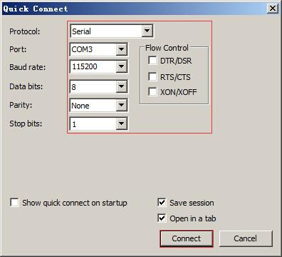

MYZR-RK3399-EK314 Quick Start
===============================

Prepare development board kits
--------------------------------

|   Development board kits consist of development board and its accessories.

Development board
------------------

|   Development board consist of following components:

- | MYZR-RK3399-CB314 (core board),one unit
- | MYZR-RK3399-MB314 (bottom board),one unit

Fast boot development board
-----------------------------

Development board is connected to the computer
~~~~~~~~~~~~~~~~~~~~~~~~~~~~~~~~~~~~~~~~~~~~~~~~

|   Because in many cases we need to connect the development board to the computer, the following describes how the development board connects to the computer.

**Power switch off**

|   1）Before connecting the development board to the computer, we need to check the power switch status of the development board and ensure that the power switch is disconnected.
|   2）The way to keep the POWER switch on the development board in a disconnected state is to press the POWER switch on the development board (the MAIN POWER SW shown in the drawing on the front of the development board) to a disconnected state (-- : close, O: disconnect).

**Connection of serial lines**

|  Connect one end of the serial cable to a serial transfer module, connect the serial transfer module to p5 of the development board, and connect the other end to the computer.
|  Introductions：
|  1）If the computer does not have a serial port, you need to prepare your own USB cable and connect it.
|  2）If there is no connection to the serial port line, you will not be able to interact with the development board in a serial port manner.However, it does not affect the starting and burning system of the development board.

Serial port terminal tool configuration
~~~~~~~~~~~~~~~~~~~~~~~~~~~~~~~~~~~~~~~~~

|   1）Find the port number we use on the computer through the Windows device manager.
|   2）Configure the parameters of the serial port terminal tool.

- | The SecureCRT & USB serial port 3 example configuration is as follows：

Network connection
~~~~~~~~~~~~~~~~~~~~

|   Connect one end of the network cable to P19 of the development board, and plug the other end of the network cable into the network port of the computer.

USB download the connection
~~~~~~~~~~~~~~~~~~~~~~~~~~~~

|   Connect one end of the USB cable to p11 of the development board, and plug the other end into the USB interface of the computer.

Connect the power cord
~~~~~~~~~~~~~~~~~~~~~~~

|   Connect one end of the power cord to p18 of the development board and one end to a power outlet.

Startup of the development board
~~~~~~~~~~~~~~~~~~~~~~~~~~~~~~~~~~

|   1）After performing the operation in the order of "connection between development board and computer", the connection between our development board and computer has been completed.
|   2）To start the development board, we need to power on the development board.

Power on the development board
~~~~~~~~~~~~~~~~~~~~~~~~~~~~~~~

|   Press the development board power switch p20 to the closed state (—: closed, O: open).

Observe the startup status
~~~~~~~~~~~~~~~~~~~~~~~~~~~

|   You will see that the serial port terminal of the computer has the startup process information output during the startup process of the development board.

Development Board Login
~~~~~~~~~~~~~~~~~~~~~~~~

|  After starting the system, you can log in:
|  【User name】：myzr
|  【Password】：myzr
|  Note: After logging in, you can set and modify the password through the "passwd" command.