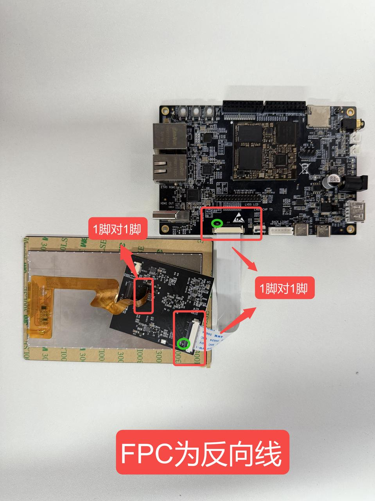

.. raw:: html

   

Boot Manual
===========

Development Board Connection
----------------------------

Preparation
-----------

.. raw:: html

   

+------------------------------------------------+-----------------------------------------------+
| Check and Verify Development Board Accessories                                                 |
+================================================+===============================================+
| Core Board                                     | None                                          |
+------------------------------------------------+-----------------------------------------------+
| Baseboard                                      | 1 piece                                       |
+------------------------------------------------+-----------------------------------------------+
| Power Supply                                   | 1 unit, 12V                                   |
+------------------------------------------------+-----------------------------------------------+
| Flashing Cable                                 | 1 piece, Type-C cable                         |
+------------------------------------------------+-----------------------------------------------+
| Serial Cable                                   | 1 piece, Type-C cable                         |
+------------------------------------------------+-----------------------------------------------+
| Ethernet Cable                                 | 1 piece                                       |
+------------------------------------------------+-----------------------------------------------+
| HDMI Cable                                     | 1 piece                                       |
+------------------------------------------------+-----------------------------------------------+
| FPC Cable                                      | 1 piece, nPin, same side/opposite side        |
+------------------------------------------------+-----------------------------------------------+
| Display Screen                                 | 1 piece (optional 5-inch screen)              |
+------------------------------------------------+-----------------------------------------------+
| Camera                                         | 1 piece (optional OV13850 MIPI camera module) |
+------------------------------------------------+-----------------------------------------------+

Screen Connection Precautions
~~~~~~~~~~~~~~~~~~~~~~~~~~~~~

Check Power Switch
~~~~~~~~~~~~~~~~~~

Confirm that the power adapter output is normal.

Confirm that the development board power switch is in the ON position.

Serial Port Parameter Settings
~~~~~~~~~~~~~~~~~~~~~~~~~~~~~~

.. raw:: html

   

+---------+--------+---------+----------+
| Baud    | Data   | Stop    | Parity   |
| Rate    | Bits   | Bits    | Bit      |
+=========+========+=========+==========+
| 1500000 | 8      | 1       |          |
+---------+--------+---------+----------+

DIP Switch Settings and TTL Serial Module
~~~~~~~~~~~~~~~~~~~~~~~~~~~~~~~~~~~~~~~~~

Power-on auto-start, no DIP switch configuration required.

TTL Serial Module Connection
~~~~~~~~~~~~~~~~~~~~~~~~~~~~

Connect one end of the Type-C cable to "CON4" and the other end to the rear USB port of the computer.

Download Cable Connection
~~~~~~~~~~~~~~~~~~~~~~~~~

Connect one end of the Type-C cable to "USB3.0 OTG (CON6)" and the other end to the rear USB port of the computer.

Power Cable Connection
~~~~~~~~~~~~~~~~~~~~~~

Connect one end of the power adapter to the development board's "Power IN (J15)" and the other end to a mains power outlet (220V AC).

Serial Cable Connection
~~~~~~~~~~~~~~~~~~~~~~~

1. Connect one end of the Type-C cable to the "CON4" port on the development board and the other end to the rear USB port of the computer.

2. Refer to the *Xshell Reference Manual* to create a new serial session and open the session.

Ethernet Cable Connection
~~~~~~~~~~~~~~~~~~~~~~~~~

Connect one end of the Ethernet cable to "CON8" or "CON9" and the other end to the computer's Ethernet port.

HDMI Display Connection
~~~~~~~~~~~~~~~~~~~~~~~

Connect one end of the HDMI display cable to CON14 on the development board, the other end to the HDMI display, and power on the HDMI display.

Note: It is recommended to use an HDMI display with 1080P resolution, and use a display with a native HDMI interface rather than one converted to HDMI.

Starting the Development Board
------------------------------

Power On the Development Board
~~~~~~~~~~~~~~~~~~~~~~~~~~~~~~

Connect one end of the power adapter to "J15" on the development board to power on the development board.

DIP Switch Settings
^^^^^^^^^^^^^^^^^^^

Power-on auto-start, no DIP switch configuration required.

Interpreting the Development Board Boot Information
---------------------------------------------------

After the development board is powered on, the boot information output can be viewed in the serial terminal software.

.. code-block:: text

   U-Boot 2017.09 (May 12 2025 - 15:29:05 +0000)
    
   Model: MYZR RK3562 EK200 Board
   MPIDR: 0x0
   PreSerial: 0, raw, 0xff210000
   DRAM:  2 GiB
   Sysmem: init
   Relocation Offset: 7da3b000
   Relocation fdt: 7b7fa590 - 7b7fecf0
   CR: M/C/I
   DM: v2

U-Boot Information
~~~~~~~~~~~~~~~~~~

The boot information U-Boot 2017.09 (May 12 2025 - 15:29:05 +0000) contains the following information:

【U-Boot Version】: 2017.09;

【Source Code Version】: g8372631b28;

【U-Boot File Compilation Time】: May 12 2025 - 15:29:05 +0000.

Kernel Information
~~~~~~~~~~~~~~~~~~

In the boot information:

[    1.903539] Linux version 5.10.209-rt89 (root@RK3562-MYZR) (aarch64-none-linux-gnu-gcc (GNU Toolchain for the A-profile Architecture 10.3-2021.07 (arm-10.29)) 10.3.1 20210621, GNU ld (GNU Toolchain for the A-profile Architecture 10.3-2021.07 (arm-10.29)) 2.36.1.20210621) ##6 SMP Mon May 26 09:06:41 UTC 2025

[    1.914167] Machine model: MYZR RK3562 EK200 Board

Contains the following information:

【Kernel Version】: Linux-5.10.209-rt89;

【GCC Version for Kernel Compilation】: 10.3.1;

【Kernel File Compilation Time】: Mon May 26 09:06:41 UTC 2025.

Logging into the Development Board
----------------------------------

Serial Login
~~~~~~~~~~~~

.. code-block:: shell

   DDR V1.04 bae1baa081 typ 23/02/15-15:05:39
   LP4/4x derate en, other dram:1x trefi
   ddrconfig:0
   LPDDR4X, 324MHz
   BW=32 Col=10 Bk=8 CS0 Row=16 CS=1 Die BW=16 Size=2048MB
   tdqss: cs0 dqs0: 120ps, dqs1: 72ps, dqs2: 24ps, dqs3: -24ps, 

   change to: 324MHz
   PHY drv:clk:37,ca:37,DQ:30,odt:0
   vrefinner:24%, vrefout:41%
   dram drv:40,odt:0
   clk skew:0x5f
   
   change to: 528MHz
   PHY drv:clk:37,ca:37,DQ:30,odt:0
   vrefinner:24%, vrefout:41%
   dram drv:40,odt:0
   clk skew:0x58
   
   change to: 780MHz
   PHY drv:clk:37,ca:37,DQ:30,odt:0
   vrefinner:24%, vrefout:41%
   dram drv:40,odt:0
   clk skew:0x58
   
   change to: 1332MHz(final freq)
   PHY drv:clk:37,ca:37,DQ:30,odt:60
   vrefinner:16%, vrefout:22%
   dram drv:40,odt:80
   vref_ca:00000071
   clk skew:0x1f
   cs 0:
   the read training result:
   DQS0:0x32, DQS1:0x31, DQS2:0x33, DQS3:0x33, 
   min  : 0x4  0x4  0x6  0x6  0x0  0x3  0x2  0x3 , 0x2  0x4  0x3  0x3  0x2  0x4  0x2  0x3 ,
          0x3  0x6  0x3  0x3  0x2  0x3  0x3  0x0 , 0x3  0x2  0x3  0x0  0x2  0x3  0x0  0x3 ,
   mid  :0x17 0x18 0x1a 0x1b 0x14 0x17 0x14 0x17 ,0x1a 0x1a 0x19 0x1a 0x19 0x1c 0x18 0x1b ,
         0x19 0x1a 0x19 0x1a 0x16 0x18 0x17 0x15 ,0x1b 0x1b 0x1c 0x18 0x1a 0x1b 0x18 0x1b ,
   max  :0x2b 0x2d 0x2e 0x30 0x29 0x2b 0x27 0x2c ,0x33 0x31 0x30 0x31 0x30 0x34 0x2e 0x33 ,
         0x2f 0x2f 0x30 0x32 0x2b 0x2e 0x2c 0x2b ,0x34 0x34 0x36 0x31 0x33 0x33 0x30 0x33 ,
   range:0x27 0x29 0x28 0x2a 0x29 0x28 0x25 0x29 ,0x31 0x2d 0x2d 0x2e 0x2e 0x30 0x2c 0x30 ,
         0x2c 0x29 0x2d 0x2f 0x29 0x2b 0x29 0x2b ,0x31 0x32 0x33 0x31 0x31 0x30 0x30 0x30 ,
   the write training result:
   DQS0:0x33, DQS1:0x2b, DQS2:0x23, DQS3:0x1b, 
   min  :0x64 0x67 0x66 0x66 0x63 0x64 0x64 0x65 0x67 ,0x5b 0x5d 0x5a 0x5b 0x5d 0x5f 0x5b 0x5d 0x5e ,
         0x54 0x54 0x54 0x53 0x53 0x55 0x54 0x52 0x54 ,0x4c 0x4c 0x4d 0x4b 0x4d 0x4d 0x4d 0x4d 0x4c ,
   mid  :0x7c 0x7f 0x7e 0x7f 0x7b 0x7c 0x79 0x7d 0x7e ,0x78 0x79 0x75 0x77 0x78 0x7a 0x77 0x79 0x79 ,
         0x6d 0x6e 0x6d 0x6e 0x6c 0x6d 0x6d 0x6b 0x6c ,0x68 0x67 0x69 0x66 0x68 0x68 0x67 0x68 0x67 ,
   max  :0x94 0x97 0x97 0x99 0x94 0x95 0x8f 0x95 0x95 ,0x95 0x95 0x91 0x94 0x93 0x95 0x94 0x95 0x95 ,
         0x87 0x88 0x87 0x8a 0x85 0x86 0x87 0x84 0x84 ,0x84 0x83 0x85 0x81 0x83 0x83 0x82 0x83 0x83 ,
   range:0x30 0x30 0x31 0x33 0x31 0x31 0x2b 0x30 0x2e ,0x3a 0x38 0x37 0x39 0x36 0x36 0x39 0x38 0x37 ,
         0x33 0x34 0x33 0x37 0x32 0x31 0x33 0x32 0x30 ,0x38 0x37 0x38 0x36 0x36 0x36 0x35 0x36 0x37 ,
   CA Training result:
   cs:0 min  :0x46 0x43 0x3f 0x42 0x45 0x42 0x41 ,0x3b 0x3b 0x3b 0x3b 0x3f 0x3e 0x41 ,
   cs:0 mid  :0x83 0x7f 0x7d 0x80 0x80 0x7e 0x7e ,0x79 0x78 0x77 0x78 0x7d 0x7a 0x6a ,
   cs:0 max  :0xc1 0xbb 0xbc 0xbe 0xbc 0xba 0xbc ,0xb7 0xb5 0xb3 0xb6 0xbc 0xb7 0x93 ,
   cs:0 range:0x7b 0x78 0x7d 0x7c 0x77 0x78 0x7b ,0x7c 0x7a 0x78 0x7b 0x7d 0x79 0x52 ,
   out
   U-Boot SPL board init
   U-Boot SPL 2017.09-231211-dirty # (Mar 18 2026 - 09:14:57)
   unknown raw ID 0 0 0
   unrecognized JEDEC id bytes: 00, 00, 00
   Trying to boot from MMC2
   Card did not respond to voltage select!
   mmc_init: -95, time 12
   spl: mmc init failed with error: -95
   Trying to boot from MMC1
   SPL: A/B-slot: _a, successful: 0, tries-remain: 7
   Trying fit image at 0x4000 sector
   ## Verified-boot: 0
   ## Checking atf-1 0x00040000 ... sha256(b69e8292fd...) + OK
   ## Checking uboot 0x00200000 ... sha256(1b457dae25...) + OK
   ## Checking fdt 0x00314848 ... sha256(e7ffa453e5...) + OK
   ## Checking atf-2 0xfe481000 ... sha256(8857274472...) + OK
   ## Checking atf-3 0xfe490000 ... sha256(8da74bc229...) + OK
   ## Checking optee 0x08400000 ... sha256(34263f2418...) + OK
   Jumping to U-Boot(0x00200000) via ARM Trusted Firmware(0x00040000)
   Total: 95.691/158.653 ms
   
   UINFO:    Preloader serial: 0
   NOTICE:  BL31: v2.3():v2.3-632-g763689fe5:xsf
   NOTICE:  BL31: Built : 03:15:31, Aug 24 2023
   INFO:    rk_otp_init finish!
   NOTICE:  BL31: Rockchip release version: v1.0
   INFO:    ARM GICv2 driver initialized
   INFO:    nonboot cpus st-ee0
   INFO:    dfs DDR fsp_param[0].freq_mhz= 1332MHz
   INFO:    dfs DDR fsp_param[1].freq_mhz= 324MHz
   INFO:    dfs DDR fsp_param[2].freq_mhz= 528MHz
   INFO:    dfs DDR fsp_param[3].freq_mhz= 780MHz
   INFO:    BL31: Initializing runtime services
   INFO:    BL31: Initializing BL32
   I/TC: 
   I/TC: OP-TEE version: 3.13.0-743-gb5340fd65 #hisping.lin (gcc version 10.2.1 20201103 (GNU Toolchain for the A-profile Architecture 10.2-2020.11 (arm-10.16))) #7 Tue Aug 29 08:56:34 CST 2023 aarch64
   I/TC: Primary CPU initializing
   I/TC: Primary CPU switching to normal world boot
   INFO:    BL31: Preparing for EL3 exit to normal world
   INFO:    Entry point address = 0x200000
   INFO:    SPSR = 0x3c9
   
   
   U-Boot 2017.09-231211-dirty # (Mar 18 2026 - 09:14:57 +0000)
   
   Model: Rockchip RK3562 Evaluation Board
   MPIDR: 0x80000000
   PreSerial: 0, raw, 0xff210000
   DRAM:  2 GiB
   Sysmem: init
   Relocation Offset: 7da4b000
   Relocation fdt: 7b9fa530 - 7b9fece8
   CR: M/C/I
   Using default environment
   
   optee api revision: 2.0
   mmc@ff870000: 0, mmc@ff880000: 1
   Bootdev(atags): mmc 0
   MMC0: HS400 Enhanced Strobe, 200Mhz
   PartType: EFI
   TEEC: Waring: Could not find security partition
   DM: v2
   boot mode: None
   RESC: 'boot', blk@0x0001998b
   resource: sha256+
   FIT: no signed, no conf required
   DTB: rk-kernel.dtb
   HASH(c): OK
   rk3036_pll_set_rate: wait pll lock timeout! pll_id=3
   I2c0 speed: 100000Hz
   PMIC:  RK8090 (on=0x40, off=0x00)
   vdd_logic init 950000 uV
   vdd_cpu init 1050000 uV
   vdd_gpu init 900000 uV
   Could not find baseparameter partition
   Model: Rockchip RK3562 EVB2 DDR4 V10 Board
   MPIDR: 0x80000000
   Rockchip UBOOT DRM driver version: v1.0.1
   VOP have 1 active VP
   vp0 have layer nr:4[2 3 8 9 ], primary plane: 2
   vp1 have layer nr:0[], primary plane: 0
   Using display timing dts
   dsi@ffb10000:  detailed mode clock 148500 kHz, flags[6]
       H: 1920 2008 2052 2200
       V: 1080 1084 1089 1125
   bus_format: 100e
   VOP update mode to: 1920x1080p60, type: MIPI0 for VP0
   VP0 set crtc_clock to 148500KHz
   VOP VP0 enable Esmart0[654x270->654x270@633x405] fmt[2] addr[0x7df04000]
   final DSI-Link bandwidth: 990 Mbps x 4
   CLK: (sync kernel. arm: enter 600000 KHz, init 1008000 KHz, kernel 0N/A)
     apll 600000 KHz
     gpll 1188000 KHz
     vpll 594000 KHz
     hpll 983039 KHz
     cpll 1000000 KHz
     dpll 666000 KHz
     aclk_bus 198000 KHz
     hclk_bus 198000 KHz
     pclk_bus 99000 KHz
     aclk_peri 198000 KHz
     hclk_peri 148500 KHz
     pclk_peri 99000 KHz
   I2c1 speed: 100000Hz
   LT8912 chip ID: 0x12, 0xb2
   LT8912 0x9c~9f = ff, ff, 0, 0
   no video mode
   Net:   eth0: ethernet@ffa80000, eth1: ethernet@ffb30000
   Hit key to stop autoboot('CTRL+C'):  0 
   ANDROID: reboot reason: "(none)"
   Not AVB images, AVB skip
   No valid android hdr
   Android image load failed
   Android boot failed, error -1.
   ## Booting FIT Image at 0x794c7f00 with size 0x02331600
   Fdt Ramdisk skip relocation
   ## Loading kernel from FIT Image at 794c7f00 ...
      Using 'conf' configuration
   ## Verified-boot: 0
      Trying 'kernel' kernel subimage
        Description:  unavailable
        Type:         Kernel Image
        Compression:  uncompressed
        Data Start:   0x794ec300
        Data Size:    36753920 Bytes = 35.1 MiB
        Architecture: AArch64
        OS:           Linux
        Load Address: 0x00400000
        Entry Point:  0x00400000
        Hash algo:    sha256
        Hash value:   2376c4d0f9a476295d95ee3a978b7c94dd92ffd75eab150f4d815489f9cc3287
      Verifying Hash Integrity ... sha256+ OK
   ## Loading fdt from FIT Image at 794c7f00 ...
      Using 'conf' configuration
      Trying 'fdt' fdt subimage
        Description:  unavailable
        Type:         Flat Device Tree
        Compression:  uncompressed
        Data Start:   0x794c8700
        Data Size:    145921 Bytes = 142.5 KiB
        Architecture: AArch64
        Load Address: 0x08300000
        Hash algo:    sha256
        Hash value:   162d2c018cbb4726a1a25a806d7acebaff3617c8726585dccb5b45697f3e6d21
      Verifying Hash Integrity ... sha256+ OK
      Loading fdt from 0x08300000 to 0x08300000
      Booting using the fdt blob at 0x08300000
      Loading Kernel Image from 0x794ec300 to 0x00400000 ... OK
      kernel loaded at 0x00400000, end = 0x0270d200
      Using Device Tree in place at 0000000008300000, end 0000000008326a00
   vp0, plane_mask:0x30c, primary-id:2, curser-id:-1
   ## reserved-memory:
     drm-logo@00000000: addr=7df00000 size=b8000
     vendor-storage-rm@00000000: addr=7bcdf000 size=10000
     ramoops@110000: addr=110000 size=e0000
   Adding bank: 0x00200000 - 0x08400000 (size: 0x08200000)
   Adding bank: 0x08c00000 - 0x80000000 (size: 0x77400000)
   Total: 1816.223/2009.767 ms
   
   Starting kernel ...
   
   [    2.014792] Booting Linux on physical CPU 0x0000000000 [0x410fd034]
   [    2.014809] Linux version 5.10.198 (wanglk@myzr-u2204) (aarch64-none-linux-gnu-gcc (GNU Toolchain for the A-profile Architecture 10.3-2021.07 (arm-10.29)) 10.3.1 20210621, GNU ld (GNU Toolchain for the A-profile Architecture 10.3-2021.07 (arm-10.29)) 2.36.1.20210621) #11 SMP Wed Mar 18 06:59:27 UTC 2026
   [    2.016387] random: crng init done
   [    2.019821] Machine model: Rockchip RK3562 EVB2 DDR4 V10 Board
   [    2.051039] earlycon: uart8250 at MMIO32 0x00000000ff210000 (options '')
   [    2.055491] printk: bootconsole [uart8250] enabled
   [    2.057034] efi: UEFI not found.
   [    2.058775] OF: fdt: Reserved memory: failed to reserve memory for node 'drm-cubic-lut@00000000': base 0x0000000000000000, size 0 MiB
   [    2.091094] Zone ranges:
   [    2.091334]   DMA      [mem 0x0000000000200000-0x000000007fffffff]
   [    2.091901]   DMA32    empty
   [    2.092164]   Normal   empty
   [    2.092428] Movable zone start for each node
   [    2.092816] Early memory node ranges
   [    2.093142]   node   0: [mem 0x0000000000200000-0x00000000083fffff]
   [    2.093712]   node   0: [mem 0x0000000008c00000-0x000000007fffffff]
   [    2.094284] Initmem setup node 0 [mem 0x0000000000200000-0x000000007fffffff]
   [    2.103213] cma: Reserved 16 MiB at 0x000000007e800000
   [    2.103750] psci: probing for conduit method from DT.
   [    2.104214] psci: PSCIv1.1 detected in firmware.
   [    2.104634] psci: Using standard PSCI v0.2 function IDs
   [    2.105111] psci: Trusted OS migration not required
   [    2.105557] psci: SMC Calling Convention v1.2
   [    2.106135] percpu: Embedded 30 pages/cpu s83800 r8192 d30888 u122880
   [    2.106806] Detected VIPT I-cache on CPU0
   [    2.107197] CPU features: detected: ARM erratum 845719
   [    2.107850] Built 1 zonelists, mobility grouping on.  Total pages: 513544
   [    2.108472] Kernel command line: storagemedia=emmc androidboot.storagemedia=emmc androidboot.mode=normal  androidboot.verifiedbootstate=orange rw rootwait earlycon=uart8250,mmio32,0xff210000 console=ttyFIQ0 root=PARTUUID=614e0000-0000 androidboot.fwver=uboot-31211-dirt-03/18/2026
   [    2.111108] Dentry cache hash table entries: 262144 (order: 9, 2097152 bytes, linear)
   [    2.111933] Inode-cache hash table entries: 131072 (order: 8, 1048576 bytes, linear)
   [    2.112638] mem auto-init: stack:off, heap alloc:off, heap free:off
   [    2.135999] Memory: 1991748K/2086912K available (18752K kernel code, 3508K rwdata, 6876K rodata, 6656K init, 797K bss, 78780K reserved, 16384K cma-reserved)
   [    2.137362] SLUB: HWalign=64, Order=0-3, MinObjects=0, CPUs=4, Nodes=1
   [    2.137979] ftrace: allocating 57295 entries in 224 pages
   [    2.186694] ftrace: allocated 224 pages with 3 groups
   [    2.187370] rcu: Hierarchical RCU implementation.
   [    2.187801] rcu:         RCU event tracing is enabled.
   [    2.188213] rcu:         RCU dyntick-idle grace-period acceleration is enabled.
   [    2.188822] rcu:         RCU restricting CPUs from NR_CPUS=8 to nr_cpu_ids=4.
   [    2.189416]         Rude variant of Tasks RCU enabled.
   [    2.189828] rcu: RCU calculated value of scheduler-enlistment delay is 30 jiffies.
   [    2.190515] rcu: Adjusting geometry for rcu_fanout_leaf=16, nr_cpu_ids=4
   [    2.194626] NR_IRQS: 64, nr_irqs: 64, preallocated irqs: 0
   [    2.196603] GIC: Using split EOI/Deactivate mode
   [    2.197578] rcu:         Offload RCU callbacks from CPUs: (none).
   [    2.223099] arch_timer: cp15 timer(s) running at 24.00MHz (phys).
   [    2.223665] clocksource: arch_sys_counter: mask: 0xffffffffffffff max_cycles: 0x588fe9dc0, max_idle_ns: 440795202592 ns
   [    2.224648] sched_clock: 56 bits at 24MHz, resolution 41ns, wraps every 4398046511097ns
   [    2.226176] Console: colour dummy device 80x25
   [    2.226605] Calibrating delay loop (skipped), value calculated using timer frequency.. 48.00 BogoMIPS (lpj=80000)
   [    2.227542] pid_max: default: 32768 minimum: 301
   [    2.228046] Mount-cache hash table entries: 4096 (order: 3, 32768 bytes, linear)
   [    2.228723] Mountpoint-cache hash table entries: 4096 (order: 3, 32768 bytes, linear)
   [    2.230225] rcu: Hierarchical SRCU implementation.
   [    2.231719] EFI services will not be available.
   [    2.232326] smp: Bringing up secondary CPUs ...
   I/TC: Secondary CPU 1 initializing
   I/TC: Secondary CPU 1 switching to normal world boot
   I/TC: Secondary CPU 2 initializing
   I/TC: Secondary CPU 2 switching to normal world boot
   I/TC: Secondary CPU 3 initializing
   I/TC: Secondary CPU 3 switching to normal world boot
   [    2.233760] Detected VIPT I-cache on CPU1
   [    2.233800] CPU1: Booted secondary processor 0x0000000001 [0x410fd034]
   [    2.234791] Detected VIPT I-cache on CPU2
   [    2.234812] CPU2: Booted secondary processor 0x0000000002 [0x410fd034]
   [    2.235766] Detected VIPT I-cache on CPU3
   [    2.235785] CPU3: Booted secondary processor 0x0000000003 [0x410fd034]
   [    2.235829] smp: Brought up 1 node, 4 CPUs
   [    2.239087] SMP: Total of 4 processors activated.
   [    2.239516] CPU features: detected: 32-bit EL0 Support
   [    2.239989] CPU features: detected: CRC32 instructions
   [    2.246636] CPU: All CPU(s) started at EL2
   [    2.247056] alternatives: patching kernel code
   [    2.248221] devtmpfs: initialized
   [    2.261043] Registered cp15_barrier emulation handler
   [    2.261516] Registered setend emulation handler
   [    2.262034] clocksource: jiffies: mask: 0xffffffff max_cycles: 0xffffffff, max_idle_ns: 6370867519511994 ns
   [    2.262925] futex hash table entries: 1024 (order: 4, 65536 bytes, linear)
   [    2.263979] pinctrl core: initialized pinctrl subsystem
   [    2.264808] DMI not present or invalid.
   [    2.265344] NET: Registered protocol family 16
   [    2.266823] DMA: preallocated 256 KiB GFP_KERNEL pool for atomic allocations
   [    2.267571] DMA: preallocated 256 KiB GFP_KERNEL|GFP_DMA pool for atomic allocations
   [    2.270107] Registered FIQ tty driver
   [    2.270651] thermal_sys: Registered thermal governor 'fair_share'
   [    2.270654] thermal_sys: Registered thermal governor 'step_wise'
   [    2.271226] thermal_sys: Registered thermal governor 'user_space'
   [    2.271772] thermal_sys: Registered thermal governor 'power_allocator'
   [    2.272534] cpuidle: using governor menu
   [    2.273642] hw-breakpoint: found 6 breakpoint and 4 watchpoint registers.
   [    2.274322] ASID allocator initialised with 65536 entries
   [    2.275836] ramoops: dmesg-0        0x18000@0x0000000000110000
   [    2.276316] ramoops: dmesg-1        0x18000@0x0000000000128000
   [    2.276799] ramoops: console        0x80000@0x0000000000140000
   [    2.277280] ramoops: pmsg        0x30000@0x00000000001c0000
   [    2.277929] printk: console [ramoops-1] enabled
   [    2.278360] pstore: Registered ramoops as persistent store backend
   [    2.278923] ramoops: using 0xe0000@0x110000, ecc: 0
   [    2.306867] rockchip-gpio ff260000.gpio: probed /pinctrl/gpio@ff260000
   [    2.307758] rockchip-gpio ff620000.gpio: probed /pinctrl/gpio@ff620000
   [    2.308623] rockchip-gpio ff630000.gpio: probed /pinctrl/gpio@ff630000
   [    2.309608] rockchip-gpio ffac0000.gpio: probed /pinctrl/gpio@ffac0000
   [    2.310459] rockchip-gpio ffad0000.gpio: probed /pinctrl/gpio@ffad0000
   [    2.311125] rockchip-pinctrl pinctrl: probed pinctrl
   [    2.324896] fiq_debugger fiq_debugger.0: IRQ fiq not found
   [    2.325438] fiq_debugger fiq_debugger.0: IRQ wakeup not found
   [    2.325967] fiq_debugger_probe: could not install nmi irq handler
   [[    2.326586] printk: console [ttyFIQ0] enabled
       2.326586] printk: console [ttyFIQ0] enabled
   [    2.327366] printk: bootconsole [uart8250] disabled
   [    2.327366] printk: bootconsole [uart8250] disabled
   [    2.327954] Registered fiq debugger ttyFIQ0
   [    2.328620] vcc3v3_pcie20: supplied by dc_12v
   [    2.328715] vcc5v0_sys: supplied by dc_12v
   [    2.328889] vcc5v0_usb: supplied by dc_12v
   [    2.329187] vcc5v0_usb_host: supplied by vcc5v0_usb
   [    2.329460] vcc5v0_usb_otg: supplied by vcc5v0_usb
   [    2.329618] vcc3v3_clk: supplied by vcc5v0_sys
   [    2.329710] vcc3v3_sys: supplied by dc_12v
   [    2.329871] vcc25_ddr: supplied by vcc3v3_sys
   [    2.330866] iommu: Default domain type: Translated 
   [    2.332926] SCSI subsystem initialized
   [    2.333070] usbcore: registered new interface driver usbfs
   [    2.333094] usbcore: registered new interface driver hub
   [    2.333118] usbcore: registered new device driver usb
   [    2.333175] mc: Linux media interface: v0.10
   [    2.333192] videodev: Linux video capture interface: v2.00
   [    2.333238] pps_core: LinuxPPS API ver. 1 registered
   [    2.333243] pps_core: Software ver. 5.3.6 - Copyright 2005-2007 Rodolfo Giometti <giometti@linux.it>
   [    2.333256] PTP clock support registered
   [    2.333283] EDAC MC: Ver: 3.0.0
   [    2.333916] arm-scmi firmware:scmi: SCMI Notifications - Core Enabled.
   [    2.333955] arm-scmi firmware:scmi: SCMI Protocol v2.0 'rockchip:' Firmware version 0x0
   [    2.335326] Advanced Linux Sound Architecture Driver Initialized.
   [    2.335616] Bluetooth: Core ver 2.22
   [    2.335638] NET: Registered protocol family 31
   [    2.335644] Bluetooth: HCI device and connection manager initialized
   [    2.335652] Bluetooth: HCI socket layer initialized
   [    2.335658] Bluetooth: L2CAP socket layer initialized
   [    2.335670] Bluetooth: SCO socket layer initialized
   [    2.336045] rockchip-cpuinfo cpuinfo: SoC                : 35621000
   [    2.336052] rockchip-cpuinfo cpuinfo: Serial                : 6638a5102792f894
   [    2.336513] clocksource: Switched to clocksource arch_sys_counter
   [    2.792899] NET: Registered protocol family 2
   [    2.793004] IP idents hash table entries: 32768 (order: 6, 262144 bytes, linear)
   [    2.793847] tcp_listen_portaddr_hash hash table entries: 1024 (order: 2, 16384 bytes, linear)
   [    2.793877] TCP established hash table entries: 16384 (order: 5, 131072 bytes, linear)
   [    2.793956] TCP bind hash table entries: 16384 (order: 6, 262144 bytes, linear)
   [    2.794102] TCP: Hash tables configured (established 16384 bind 16384)
   [    2.794168] UDP hash table entries: 1024 (order: 3, 32768 bytes, linear)
   [    2.794201] UDP-Lite hash table entries: 1024 (order: 3, 32768 bytes, linear)
   [    2.794300] NET: Registered protocol family 1
   [    2.794596] RPC: Registered named UNIX socket transport module.
   [    2.794602] RPC: Registered udp transport module.
   [    2.794606] RPC: Registered tcp transport module.
   [    2.794610] RPC: Registered tcp NFSv4.1 backchannel transport module.
   [    2.795299] PCI: CLS 0 bytes, default 64
   [    2.796821] rockchip-thermal ffa70000.tsadc: tsadc is probed successfully!
   [    2.797436] hw perfevents: enabled with armv8_cortex_a53 PMU driver, 7 counters available
   [    2.800058] Initialise system trusted keyrings
   [    2.800143] workingset: timestamp_bits=62 max_order=19 bucket_order=0
   [    2.802907] squashfs: version 4.0 (2009/01/31) Phillip Lougher
   [    2.803284] NFS: Registering the id_resolver key type
   [    2.803303] Key type id_resolver registered
   [    2.803308] Key type id_legacy registered
   [    2.803331] ntfs: driver 2.1.32 [Flags: R/O].
   [    2.803459] jffs2: version 2.2. (NAND) © 2001-2006 Red Hat, Inc.
   [    2.803621] fuse: init (API version 7.32)
   [    2.803807] SGI XFS with security attributes, no debug enabled
   [    2.831086] NET: Registered protocol family 38
   [    2.831102] Key type asymmetric registered
   [    2.831108] Asymmetric key parser 'x509' registered
   [    2.831134] Block layer SCSI generic (bsg) driver version 0.4 loaded (major 242)
   [    2.831140] io scheduler mq-deadline registered
   [    2.831144] io scheduler kyber registered
   [    2.831596] rockchip-csi2-dphy-hw ff3c0000.csi2-dphy0-hw: csi2 dphy hw probe successfully!
   [    2.831670] rockchip-csi2-dphy-hw ff3d0000.csi2-dphy1-hw: csi2 dphy hw probe successfully!
   [    2.832007] rockchip-csi2-dphy csi2-dphy0: csi2 dphy0 probe successfully!
   [    2.832110] rockchip-csi2-dphy csi2-dphy3: csi2 dphy3 probe successfully!
   [    2.833533] rockchip-usb2phy ff740000.usb2-phy: IRQ index 0 not found
   [    2.838713] pwm-backlight backlight: supply power not found, using dummy regulator
   [    2.839128] iep: Module initialized.
   [    2.839169] mpp_service mpp-srv: ea89a0945141 author: Yandong Lin 2023-12-20 video: rockchip: mpp: fix watch dog interrupt storm issue
   [    2.839175] mpp_service mpp-srv: probe start
   [    2.840725] mpp_jpgdec ff450000.jpegd: Adding to iommu group 7
   [    2.840862] mpp_jpgdec ff450000.jpegd: probe device
   [    2.841196] mpp_jpgdec ff450000.jpegd: probing finish
   [    2.841508] mpp_rkvdec2 ff340100.rkvdec: Adding to iommu group 1
   [    2.841624] mpp_rkvdec2 ff340100.rkvdec: rkvdec, probing start
   [    2.841751] rkvdec2_init:996: failed on clk_get clk_core
   [    2.841757] rkvdec2_init:999: failed on clk_get clk_cabac
   [    2.841779] mpp_rkvdec2 ff340100.rkvdec: shared_niu_a is not found!
   [    2.841784] rkvdec2_init:1022: No niu aclk reset resource define
   [    2.841790] mpp_rkvdec2 ff340100.rkvdec: shared_niu_h is not found!
   [    2.841795] rkvdec2_init:1025: No niu hclk reset resource define
   [    2.841801] mpp_rkvdec2 ff340100.rkvdec: shared_video_core is not found!
   [    2.841805] rkvdec2_init:1028: No core reset resource define
   [    2.841811] mpp_rkvdec2 ff340100.rkvdec: shared_video_cabac is not found!
   [    2.841815] rkvdec2_init:1031: No cabac reset resource define
   [    2.841875] mpp_rkvdec2 ff340100.rkvdec: could not find property rcb-iova
   [    2.841911] mpp_rkvdec2 ff340100.rkvdec: link mode probe finish
   [    2.841950] mpp_rkvdec2 ff340100.rkvdec: probing finish
   [    2.842369] mpp_rkvenc2 ff360000.rkvenc: Adding to iommu group 2
   [    2.842491] mpp_rkvenc2 ff360000.rkvenc: probing start
   [    2.842690] mpp_rkvenc2 ff360000.rkvenc: dev_pm_opp_set_regulators: no regulator (venc) found: -19
   [    2.842719] rkvenc_init:1905: failed to add venc devfreq
   [    2.842900] mpp_rkvenc2 ff360000.rkvenc: probing finish
   [    2.843452] mpp_service mpp-srv: probe success
   [    2.849366] dma-pl330 ff990000.dma-controller: Loaded driver for PL330 DMAC-241330
   [    2.849383] dma-pl330 ff990000.dma-controller:         DBUFF-128x8bytes Num_Chans-8 Num_Peri-32 Num_Events-16
   [    2.850337] rockchip-system-monitor rockchip-system-monitor: system monitor probe
   [    2.850789] arm-scmi firmware:scmi: Failed. SCMI protocol 22 not active.
   [    2.850955] Serial: 8250/16550 driver, 10 ports, IRQ sharing disabled
   [    2.851453] ff6c0000.serial: ttyS6 at MMIO 0xff6c0000 (irq = 51, base_baud = 1500000) is a 16550A
   [    2.853421] rockchip-vop2 ff400000.vop: Adding to iommu group 5
   [    2.859507] rockchip-vop2 ff400000.vop: [drm:vop2_bind] vp0 assign plane mask: 0x30c, primary plane phy id: 2
   [    2.859711] rockchip-drm display-subsystem: bound ff400000.vop (ops 0xffffffc00935e328)
   [    2.859787] dw-mipi-dsi-rockchip ffb10000.dsi: failed to find panel or bridge: -517
   [    2.864997] cacheinfo: Unable to detect cache hierarchy for CPU 0
   [    2.865470] brd: module loaded
   [    2.868477] loop: module loaded
   [    2.868706] zram: Added device: zram0
   [    2.868869] lkdtm: No crash points registered, enable through debugfs
   [    2.873044] rk_gmac-dwmac ffa80000.ethernet: IRQ eth_lpi not found
   [    2.873234] rk_gmac-dwmac ffa80000.ethernet: PTP uses main clock
   [    2.873269] rk_gmac-dwmac ffa80000.ethernet: supply phy not found, using dummy regulator
   [    2.873356] rk_gmac-dwmac ffa80000.ethernet: clock input or output? (output).
   [    2.873364] rk_gmac-dwmac ffa80000.ethernet: TX delay(0x35).
   [    2.873370] rk_gmac-dwmac ffa80000.ethernet: Can not read property: rx_delay.
   [    2.873375] rk_gmac-dwmac ffa80000.ethernet: set rx_delay to 0xffffffff
   [    2.873388] rk_gmac-dwmac ffa80000.ethernet: integrated PHY? (no).
   [    2.873400] rk_gmac-dwmac ffa80000.ethernet: cannot get clock mac_clk_rx
   [    2.873407] rk_gmac-dwmac ffa80000.ethernet: cannot get clock mac_clk_tx
   [    2.873423] rk_gmac-dwmac ffa80000.ethernet: cannot get clock clk_mac_speed
   [    2.873659] rk_gmac-dwmac ffa80000.ethernet: init for RGMII_RXID
   [    2.873795] rk_gmac-dwmac ffa80000.ethernet: User ID: 0x40, Synopsys ID: 0x51
   [    2.873803] rk_gmac-dwmac ffa80000.ethernet:         DWMAC4/5
   [    2.873810] rk_gmac-dwmac ffa80000.ethernet: DMA HW capability register supported
   [    2.873815] rk_gmac-dwmac ffa80000.ethernet: RX Checksum Offload Engine supported
   [    2.873820] rk_gmac-dwmac ffa80000.ethernet: TX Checksum insertion supported
   [    2.873825] rk_gmac-dwmac ffa80000.ethernet: Wake-Up On Lan supported
   [    2.873867] rk_gmac-dwmac ffa80000.ethernet: TSO supported
   [    2.873872] rk_gmac-dwmac ffa80000.ethernet: Enable RX Mitigation via HW Watchdog Timer
   [    2.873878] rk_gmac-dwmac ffa80000.ethernet: TSO feature enabled
   [    2.873884] rk_gmac-dwmac ffa80000.ethernet: Using 40 bits DMA width
   [    3.034413] rk_gmac-dwmac ffb30000.ethernet: IRQ eth_lpi not found
   [    3.034562] rk_gmac-dwmac ffb30000.ethernet: PTP uses main clock
   [    3.034592] rk_gmac-dwmac ffb30000.ethernet: supply phy not found, using dummy regulator
   [    3.034664] rk_gmac-dwmac ffb30000.ethernet: clock input or output? (input).
   [    3.034671] rk_gmac-dwmac ffb30000.ethernet: Can not read property: tx_delay.
   [    3.034676] rk_gmac-dwmac ffb30000.ethernet: set tx_delay to 0xffffffff
   [    3.034682] rk_gmac-dwmac ffb30000.ethernet: Can not read property: rx_delay.
   [    3.034687] rk_gmac-dwmac ffb30000.ethernet: set rx_delay to 0xffffffff
   [    3.034700] rk_gmac-dwmac ffb30000.ethernet: integrated PHY? (no).
   [    3.034711] rk_gmac-dwmac ffb30000.ethernet: cannot get clock mac_clk_rx
   [    3.034718] rk_gmac-dwmac ffb30000.ethernet: cannot get clock mac_clk_tx
   [    3.034738] rk_gmac-dwmac ffb30000.ethernet: cannot get clock clk_mac_speed
   [    3.034743] rk_gmac-dwmac ffb30000.ethernet: clock input from PHY
   [    3.034969] rk_gmac-dwmac ffb30000.ethernet: init for RMII
   [    3.035078] rk_gmac-dwmac ffb30000.ethernet: User ID: 0x10, Synopsys ID: 0x35
   [    3.035086] rk_gmac-dwmac ffb30000.ethernet:         DWMAC1000
   [    3.035092] rk_gmac-dwmac ffb30000.ethernet: DMA HW capability register supported
   [    3.035098] rk_gmac-dwmac ffb30000.ethernet: RX Checksum Offload Engine supported
   [    3.035102] rk_gmac-dwmac ffb30000.ethernet: COE Type 2
   [    3.035107] rk_gmac-dwmac ffb30000.ethernet: TX Checksum insertion supported
   [    3.035112] rk_gmac-dwmac ffb30000.ethernet: Wake-Up On Lan supported
   [    3.035147] rk_gmac-dwmac ffb30000.ethernet: Normal descriptors
   [    3.035152] rk_gmac-dwmac ffb30000.ethernet: Ring mode enabled
   [    3.035157] rk_gmac-dwmac ffb30000.ethernet: Enable RX Mitigation via HW Watchdog Timer
   [    3.655046] usbcore: registered new interface driver rtl8150
   [    3.655086] usbcore: registered new interface driver r8152
   [    3.659586] ehci_hcd: USB 2.0 'Enhanced' Host Controller (EHCI) Driver
   [    3.659615] ehci-pci: EHCI PCI platform driver
   [    3.659660] ehci-platform: EHCI generic platform driver
   [    3.661781] ehci-platform fed00000.usb: EHCI Host Controller
   [    3.661886] ehci-platform fed00000.usb: new USB bus registered, assigned bus number 1
   [    3.661967] ehci-platform fed00000.usb: irq 20, io mem 0xfed00000
   [    3.673183] ehci-platform fed00000.usb: USB 2.0 started, EHCI 1.00
   [    3.673294] usb usb1: New USB device found, idVendor=1d6b, idProduct=0002, bcdDevice= 5.10
   [    3.673301] usb usb1: New USB device strings: Mfr=3, Product=2, SerialNumber=1
   [    3.673307] usb usb1: Product: EHCI Host Controller
   [    3.673312] usb usb1: Manufacturer: Linux 5.10.198 ehci_hcd
   [    3.673317] usb usb1: SerialNumber: fed00000.usb
   [    3.673571] hub 1-0:1.0: USB hub found
   [    3.673591] hub 1-0:1.0: 1 port detected
   [    3.674055] ohci_hcd: USB 1.1 'Open' Host Controller (OHCI) Driver
   [    3.674069] ohci-platform: OHCI generic platform driver
   [    3.674302] ohci-platform fed40000.usb: Generic Platform OHCI controller
   [    3.674391] ohci-platform fed40000.usb: new USB bus registered, assigned bus number 2
   [    3.674458] ohci-platform fed40000.usb: irq 21, io mem 0xfed40000
   [    3.733936] usb usb2: New USB device found, idVendor=1d6b, idProduct=0001, bcdDevice= 5.10
   [    3.733946] usb usb2: New USB device strings: Mfr=3, Product=2, SerialNumber=1
   [    3.733952] usb usb2: Product: Generic Platform OHCI controller
   [    3.733957] usb usb2: Manufacturer: Linux 5.10.198 ohci_hcd
   [    3.733962] usb usb2: SerialNumber: fed40000.usb
   [    3.734188] hub 2-0:1.0: USB hub found
   [    3.734209] hub 2-0:1.0: 1 port detected
   [    3.734947] usbcore: registered new interface driver cdc_acm
   [    3.734955] cdc_acm: USB Abstract Control Model driver for USB modems and ISDN adapters
   [    3.735079] usbcore: registered new interface driver uas
   [    3.735120] usbcore: registered new interface driver usb-storage
   [    3.735172] usbcore: registered new interface driver usbserial_generic
   [    3.735186] usbserial: USB Serial support registered for generic
   [    3.735206] usbcore: registered new interface driver cp210x
   [    3.735219] usbserial: USB Serial support registered for cp210x
   [    3.735244] usbcore: registered new interface driver ftdi_sio
   [    3.735256] usbserial: USB Serial support registered for FTDI USB Serial Device
   [    3.735302] usbcore: registered new interface driver keyspan
   [    3.735315] usbserial: USB Serial support registered for Keyspan - (without firmware)
   [    3.735330] usbserial: USB Serial support registered for Keyspan 1 port adapter
   [    3.735342] usbserial: USB Serial support registered for Keyspan 2 port adapter
   [    3.735356] usbserial: USB Serial support registered for Keyspan 4 port adapter
   [    3.735380] usbcore: registered new interface driver option
   [    3.735393] usbserial: USB Serial support registered for GSM modem (1-port)
   [    3.735452] usbcore: registered new interface driver oti6858
   [    3.735465] usbserial: USB Serial support registered for oti6858
   [    3.735485] usbcore: registered new interface driver pl2303
   [    3.735497] usbserial: USB Serial support registered for pl2303
   [    3.735520] usbcore: registered new interface driver qcserial
   [    3.735532] usbserial: USB Serial support registered for Qualcomm USB modem
   [    3.735561] usbcore: registered new interface driver sierra
   [    3.735574] usbserial: USB Serial support registered for Sierra USB modem
   [    3.736257] usbcore: registered new interface driver usbtouchscreen
   [    3.736265] Sitronix TDDI Touch Driver v43.00.250117
   [    3.736538] .. rk pwm remotectl v2.0 init
   [    3.736694] input: ff230030.pwm as /devices/platform/ff230030.pwm/input/input0
   [    3.736936] remotectl-pwm ff230030.pwm: pwm version is 0x3150000
   [    3.736967] remotectl-pwm ff230030.pwm: Controller support pwrkey capture
   [    3.737308] i2c /dev entries driver
   [    3.739474] rk808 0-0020: chip id: 0x8090
   [    3.739513] rk808 0-0020: No cache defaults, reading back from HW
   [    3.762961] rk808 0-0020: source: on=0x40, off=0x00
   [    3.762974] rk808 0-0020: support dcdc3 fb mode:-22, 1
   [    3.762981] rk808 0-0020: support pmic reset mode:0,0
   [    3.767498] rk808-regulator rk808-regulator: there is no dvs0 gpio
   [    3.767527] rk808-regulator rk808-regulator: there is no dvs1 gpio
   [    3.768029] vdd_logic: supplied by vcc3v3_sys
   [    3.768891] vdd_cpu: supplied by vcc3v3_sys
   [    3.769357] vcc_ddr: supplied by vcc3v3_sys
   [    3.769853] vdd_gpu: supplied by vcc3v3_sys
   [    3.770664] vcc_1v8: supplied by vcc3v3_sys
   [    3.771115] vcc2v8_dvp: Bringing 600000uV into 2800000-2800000uV
   [    3.771523] vcc2v8_dvp: supplied by vcc3v3_sys
   [    3.771914] vdda_0v9: supplied by vcc3v3_sys
   [    3.772894] vdda0v9_pmu: supplied by vcc3v3_sys
   [    3.773860] vccio_acodec: supplied by vcc3v3_sys
   [    3.775160] vccio_sd: supplied by vcc3v3_sys
   [    3.776143] vcc3v3_pmu: supplied by vcc3v3_sys
   [    3.777434] vcca_1v8: supplied by vcc3v3_sys
   [    3.778421] vcca1v8_pmu: supplied by vcc3v3_sys
   [    3.779397] vcc1v8_dvp: Bringing 600000uV into 1800000-1800000uV
   [    3.779799] vcc1v8_dvp: supplied by vcc3v3_sys
   [    3.780207] vcc_3v3: supplied by vcc3v3_sys
   [    3.780988] vcc3v3_sd: supplied by vcc3v3_sys
   [    3.781440] rk817-battery: Failed to locate of_node [id: -1]
   [    3.781533] rk817-battery rk817-battery: Failed to find matching dt id
   [    3.781625] rk817-charger: Failed to locate of_node [id: -1]
   [    3.781682] rk817-charger rk817-charger: Failed to find matching dt id
   [    3.784462] input: rk805 pwrkey as /devices/platform/ff200000.i2c/i2c-0/0-0020/rk805-pwrkey/input/input1
   [    3.790130] rk808-rtc rk808-rtc: registered as rtc0
   [    3.791781] rk808-rtc rk808-rtc: setting system clock to 2017-08-04T09:00:04 UTC (1501837204)
   [    3.795165] <<GTP-INF>>[gt1x_ts_probe:560] GTP Driver Version: V1.4<2015/07/10>
   [    3.795187] <<GTP-INF>>[gt1x_ts_probe:561] GTP I2C Address: 0x14
   [    3.795235] <<GTP-ERR>>[gt1x_parse_dt:341] vdd_ana not specified, fallback to power-supply
   [    3.795343] <<GTP-INF>>[gt1x_parse_dt:348] Power Invert,no 
   [    3.795401] <<GTP-INF>>[gt1x_reset_guitar:788] GTP RESET!
   [    3.796027] rkcifhw ff3e0000.rkcif: Adding to iommu group 3
   [    3.796257] rkcifhw ff3e0000.rkcif: No reserved memory region assign to CIF
   [    3.796334] rkcif rkcif-mipi-lvds: Adding to iommu group 3
   [    3.796351] rkcif rkcif-mipi-lvds: rkcif driver version: v00.02.00
   [    3.796441] rkcif rkcif-mipi-lvds: attach to cif hw node
   [    3.796447] rkcif rkcif-mipi-lvds: rkcif wait line 0
   [    3.796454] : terminal subdev does not exist
   [    3.796459] : terminal subdev does not exist
   [    3.796463] : terminal subdev does not exist
   [    3.796468] : terminal subdev does not exist
   [    3.796474] : get_remote_sensor: video pad[0] is null
   [    3.796479] : rkcif_update_sensor_info: stream[0] get remote sensor_sd failed!
   [    3.796485] : rkcif_scale_set_fmt: req(80, 60) src out(0, 0)
   [    3.796490] : get_remote_sensor: video pad[0] is null
   [    3.796494] : rkcif_update_sensor_info: stream[0] get remote sensor_sd failed!
   [    3.796499] : rkcif_scale_set_fmt: req(80, 60) src out(0, 0)
   [    3.796533] : get_remote_sensor: video pad[0] is null
   [    3.796538] : rkcif_update_sensor_info: stream[0] get remote sensor_sd failed!
   [    3.796543] : rkcif_scale_set_fmt: req(80, 60) src out(0, 0)
   [    3.796548] : get_remote_sensor: video pad[0] is null
   [    3.796552] : rkcif_update_sensor_info: stream[0] get remote sensor_sd failed!
   [    3.796557] : rkcif_scale_set_fmt: req(80, 60) src out(0, 0)
   [    3.797451] rkcif rkcif-mipi-lvds: No memory-region-thunderboot specified
   [    3.797558] rkcif rkcif-mipi-lvds2: Adding to iommu group 3
   [    3.797578] rkcif rkcif-mipi-lvds2: rkcif driver version: v00.02.00
   [    3.797622] rkcif rkcif-mipi-lvds2: attach to cif hw node
   [    3.797628] rkcif rkcif-mipi-lvds2: rkcif wait line 0
   [    3.797634] : terminal subdev does not exist
   [    3.797639] : terminal subdev does not exist
   [    3.797644] : terminal subdev does not exist
   [    3.797648] : terminal subdev does not exist
   [    3.797654] : get_remote_sensor: video pad[0] is null
   [    3.797658] : rkcif_update_sensor_info: stream[0] get remote sensor_sd failed!
   [    3.797664] : rkcif_scale_set_fmt: req(80, 60) src out(0, 0)
   [    3.797669] : get_remote_sensor: video pad[0] is null
   [    3.797673] : rkcif_update_sensor_info: stream[0] get remote sensor_sd failed!
   [    3.797678] : rkcif_scale_set_fmt: req(80, 60) src out(0, 0)
   [    3.797683] : get_remote_sensor: video pad[0] is null
   [    3.797687] : rkcif_update_sensor_info: stream[0] get remote sensor_sd failed!
   [    3.797692] : rkcif_scale_set_fmt: req(80, 60) src out(0, 0)
   [    3.797696] : get_remote_sensor: video pad[0] is null
   [    3.797701] : rkcif_update_sensor_info: stream[0] get remote sensor_sd failed!
   [    3.797706] : rkcif_scale_set_fmt: req(80, 60) src out(0, 0)
   [    3.798513] rkcif rkcif-mipi-lvds2: No memory-region-thunderboot specified
   [    3.799486] rockchip-mipi-csi2-hw ff380000.mipi0-csi2-hw: enter mipi csi2 hw probe!
   [    3.799593] rockchip-mipi-csi2-hw ff380000.mipi0-csi2-hw: probe success, v4l2_dev:mipi0-csi2-hw!
   [    3.799632] rockchip-mipi-csi2-hw ff390000.mipi1-csi2-hw: enter mipi csi2 hw probe!
   [    3.799696] rockchip-mipi-csi2-hw ff390000.mipi1-csi2-hw: probe success, v4l2_dev:mipi1-csi2-hw!
   [    3.799733] rockchip-mipi-csi2-hw ff3a0000.mipi2-csi2-hw: enter mipi csi2 hw probe!
   [    3.799792] rockchip-mipi-csi2-hw ff3a0000.mipi2-csi2-hw: probe success, v4l2_dev:mipi2-csi2-hw!
   [    3.799829] rockchip-mipi-csi2-hw ff3b0000.mipi3-csi2-hw: enter mipi csi2 hw probe!
   [    3.799916] rockchip-mipi-csi2-hw ff3b0000.mipi3-csi2-hw: probe success, v4l2_dev:mipi3-csi2-hw!
   [    3.800280] rockchip-mipi-csi2 mipi0-csi2: attach to csi2 hw node
   [    3.800312] rkcif rkcif-mipi-lvds: Entity type for entity rockchip-mipi-csi2 was not initialized!
   [    3.800321] rockchip-mipi-csi2: Async registered subdev
   [    3.800335] rockchip-mipi-csi2: probe success, v4l2_dev:rkcif-mipi-lvds!
   [    3.800428] rockchip-mipi-csi2 mipi2-csi2: attach to csi2 hw node
   [    3.800447] rkcif rkcif-mipi-lvds2: Entity type for entity rockchip-mipi-csi2 was not initialized!
   [    3.800454] rockchip-mipi-csi2: Async registered subdev
   [    3.800461] rockchip-mipi-csi2: probe success, v4l2_dev:rkcif-mipi-lvds2!
   [    3.801241] rkisp_hw ff3f0000.isp: Adding to iommu group 4
   [    3.801343] rkisp_hw ff3f0000.isp: is_thunderboot: 0
   [    3.801350] rkisp_hw ff3f0000.isp: Missing rockchip,grf property
   [    3.801373] rkisp_hw ff3f0000.isp: max input:0x0@0fps
   [    3.801479] rkisp_hw ff3f0000.isp: no find phandle sram
   [    3.801685] rkisp rkisp-vir0: rkisp driver version: v02.04.00
   [    3.801774] rkisp rkisp-vir0: No memory-region-thunderboot specified
   [    3.801905] rkisp rkisp-vir0: Entity type for entity rkisp-isp-subdev was not initialized!
   [    3.803141] usbcore: registered new interface driver uvcvideo
   [    3.803150] USB Video Class driver (1.1.1)
   [    3.803955] Bluetooth: HCI UART driver ver 2.3
   [    3.803965] Bluetooth: HCI UART protocol H4 registered
   [    3.803970] Bluetooth: HCI UART protocol ATH3K registered
   [    3.804007] usbcore: registered new interface driver bfusb
   [    3.804033] usbcore: registered new interface driver btusb
   [    3.804350] cpu cpu0: bin=0
   [    3.804464] cpu cpu0: leakage=17
   [    3.804536] cpu cpu0: pvtm = 1384, get from otp
   [    3.804547] cpu cpu0: pvtm-volt-sel=2
   [    3.805354] cpu cpu0: avs=0
   [    3.805553] cpu cpu0: EM: created perf domain
   [    3.805590] cpu cpu0: l=10000 h=2147483647 hyst=5000 l_limit=0 h_limit=0 h_table=0
   [    3.807561] rockchip-pinctrl pinctrl: pin gpio0-11 already requested by ffa00000.i2c; cannot claim for sdio-pwrseq
   [    3.807580] rockchip-pinctrl pinctrl: pin-11 (sdio-pwrseq) status -22
   [    3.807590] rockchip-pinctrl pinctrl: could not request pin 11 (gpio0-11) from group wifi-enable-h  on device rockchip-pinctrl
   [    3.807597] pwrseq_simple sdio-pwrseq: Error applying setting, reverse things back
   [    3.807613] pwrseq_simple: probe of sdio-pwrseq failed with error -22
   [    3.807955] sdhci: Secure Digital Host Controller Interface driver
   [    3.807962] sdhci: Copyright(c) Pierre Ossman
   [    3.807967] Synopsys Designware Multimedia Card Interface Driver
   [    3.808418] sdhci-pltfm: SDHCI platform and OF driver helper
   [    3.808910] dwmmc_rockchip ff880000.mmc: No normal pinctrl state
   [    3.808924] dwmmc_rockchip ff880000.mmc: No idle pinctrl state
   [    3.808990] dwmmc_rockchip ff890000.mmc: No normal pinctrl state
   [    3.809000] dwmmc_rockchip ff890000.mmc: No idle pinctrl state
   [    3.809058] dwmmc_rockchip ff880000.mmc: IDMAC supports 32-bit address mode.
   [    3.809079] dwmmc_rockchip ff880000.mmc: Using internal DMA controller.
   [    3.809090] dwmmc_rockchip ff880000.mmc: Version ID is 270a
   [    3.809099] dwmmc_rockchip ff890000.mmc: IDMAC supports 32-bit address mode.
   [    3.809115] dwmmc_rockchip ff890000.mmc: Using internal DMA controller.
   [    3.809126] dwmmc_rockchip ff890000.mmc: Version ID is 270a
   [    3.809136] dwmmc_rockchip ff880000.mmc: DW MMC controller at irq 56,32 bit host data width,256 deep fifo
   [    3.809157] dwmmc_rockchip ff890000.mmc: DW MMC controller at irq 57,32 bit host data width,256 deep fifo
   [    3.810521] arm-scmi firmware:scmi: Failed. SCMI protocol 17 not active.
   [    3.810590] SMCCC: SOC_ID: ARCH_SOC_ID not implemented, skipping ....
   [    3.811518] cryptodev: driver 1.12 loaded.
   [    3.811567] hid: raw HID events driver (C) Jiri Kosina
   [    3.811815] usbcore: registered new interface driver usbhid
   [    3.811821] usbhid: USB HID core driver
   [    3.816266] usbcore: registered new interface driver snd-usb-audio
   [    3.818008] rk817-codec rk817-codec: DMA mask not set
   [    3.821246] rk-multicodecs rk809-sound: Failed to get ADC channel
   [    3.821340] rk-multicodecs rk809-sound: ASoC: Property 'rockchip,audio-routing' does not exist or its length is not even
   [    3.822414] mmc_host mmc1: Bus speed (slot 0) = 400000Hz (slot req 400000Hz, actual 400000HZ div = 0)
   [    3.822454] rk817-codec rk817-codec: rk817_probe: chip_name:0x80, chip_ver:0x9a
   [    3.826636] rk-multicodecs rk809-sound: Don't need to map headset detect gpio to irq
   [    3.828581] Initializing XFRM netlink socket
   [    3.828816] NET: Registered protocol family 10
   [    3.829319] Segment Routing with IPv6
   [    3.829354] NET: Registered protocol family 17
   [    3.829368] NET: Registered protocol family 15
   [    3.829461] Bluetooth: RFCOMM socket layer initialized
   [    3.829485] Bluetooth: RFCOMM ver 1.11
   [    3.829492] Bluetooth: HIDP (Human Interface Emulation) ver 1.2
   [    3.829498] Bluetooth: HIDP socket layer initialized
   [    3.829524] [BT_RFKILL]: Enter rfkill_rk_init
   [    3.829528] [WLAN_RFKILL]: Enter rfkill_wlan_init
   [    3.830067] Key type dns_resolver registered
   [    3.830771] ov13850 0-0010: driver version: 00.01.05
   [    3.830808] ov13850 0-0010: Failed to get power-gpios, maybe no use
   [    3.830822] ov13850 0-0010: Failed to get reset-gpios
   [    3.830870] ov13850 0-0010: supply avdd not found, using dummy regulator
   [    3.830948] ov13850 0-0010: supply dovdd not found, using dummy regulator
   [    3.830972] ov13850 0-0010: supply dvdd not found, using dummy regulator
   [    3.830995] ov13850 0-0010: could not get default pinstate
   [    3.830999] ov13850 0-0010: could not get sleep pinstate
   [    3.835055] ov13850 0-0010: Unexpected sensor id(000000), ret(-5)
   [    3.835296] ov13850 1-0010: driver version: 00.01.05
   [    3.835323] ov13850 1-0010: Failed to get power-gpios, maybe no use
   [    3.835335] ov13850 1-0010: Failed to get reset-gpios
   [    3.835374] ov13850 1-0010: supply avdd not found, using dummy regulator
   [    3.835442] ov13850 1-0010: supply dovdd not found, using dummy regulator
   [    3.835477] ov13850 1-0010: supply dvdd not found, using dummy regulator
   [    3.835498] ov13850 1-0010: could not get default pinstate
   [    3.835502] ov13850 1-0010: could not get sleep pinstate
   [    3.838625] ov13850 1-0010: Unexpected sensor id(000000), ret(-5)
   [    3.839199] Loading compiled-in X.509 certificates
   [    3.839738] pstore: Using crash dump compression: deflate
   [    3.839882] mmc0: SDHCI controller on ff870000.mmc [ff870000.mmc] using ADMA
   [    3.840488] rga2 ff440000.rga: Adding to iommu group 6
   [    3.840599] rga: rga2, irq = 48, match scheduler
   [    3.840911] rga: rga2 hardware loaded successfully, hw_version:3.6.92812.
   [    3.840934] rga: rga2 probe successfully
   [    3.841039] rga_iommu: IOMMU binding successfully, default mapping core[0x4]
   [    3.841233] rga: Module initialized. v1.3.1
   [    3.852867] dwmmc_rockchip ff890000.mmc: No normal pinctrl state
   [    3.852885] dwmmc_rockchip ff890000.mmc: No idle pinctrl state
   [    3.852987] dwmmc_rockchip ff890000.mmc: IDMAC supports 32-bit address mode.
   [    3.853006] dwmmc_rockchip ff890000.mmc: Using internal DMA controller.
   [    3.853014] dwmmc_rockchip ff890000.mmc: Version ID is 270a
   [    3.853040] dwmmc_rockchip ff890000.mmc: DW MMC controller at irq 57,32 bit host data width,256 deep fifo
   [    3.853140] rockchip-dmc dmc: bin=0
   [    3.853282] rockchip-dmc dmc: leakage=21
   [    3.853292] rockchip-dmc dmc: leakage-volt-sel=2
   [    3.853486] rockchip-dmc dmc: avs=0
   [    3.853497] rockchip-dmc dmc: current ATF version 0x101
   [    3.853875] rockchip-dmc dmc: normal_rate = 780000000
   [    3.853882] rockchip-dmc dmc: reboot_rate = 1332000000
   [    3.853887] rockchip-dmc dmc: suspend_rate = 324000000
   [    3.853892] rockchip-dmc dmc: video_4k_rate = 780000000
   [    3.853896] rockchip-dmc dmc: video_4k_10b_rate = 780000000
   [    3.853901] rockchip-dmc dmc: boost_rate = 1332000000
   [    3.853906] rockchip-dmc dmc: fixed_rate(isp|cif0|cif1|dualview) = 1332000000
   [    3.853911] rockchip-dmc dmc: performance_rate = 1332000000
   [    3.853919] rockchip-dmc dmc: failed to get vop bandwidth to dmc rate
   [    3.853923] rockchip-dmc dmc: failed to get vop pn to msch rl
   [    3.854040] rockchip-dmc dmc: l=10000 h=2147483647 hyst=5000 l_limit=0 h_limit=0 h_table=0
   [    3.854542] rockchip-dmc dmc: could not find power_model node
   [    3.866666] <<GTP-ERR>>[_do_i2c_write:432] I2c transfer error! (-6)
   [    3.866672] <<GTP-ERR>>[gt1x_init:2319] Reset guitar failed!
   [    3.866676] <<GTP-INF>>[gt1x_reset_guitar:788] GTP RESET!
   [    3.870997] mali ff320000.gpu: Kernel DDK version g18p0-01eac0
   [    3.871507] mali ff320000.gpu: bin=0
   [    3.871652] mali ff320000.gpu: leakage=7
   [    3.871780] mali ff320000.gpu: pvtm = 852, get from otp
   [    3.871798] mali ff320000.gpu: pvtm-volt-sel=2
   [    3.872375] mali ff320000.gpu: avs=0
   [    3.872399] W : [File] : drivers/gpu/arm/bifrost/platform/rk/mali_kbase_config_rk.c; [Line] : 143; [Func] : kbase_platform_rk_init(); power-off-delay-ms not available.
   [    3.872961] mali ff320000.gpu: GPU identified as 0x2 arch 7.4.0 r1p0 status 0
   [    3.873053] mali ff320000.gpu: No priority control manager is configured
   [    3.873301] mali ff320000.gpu: No memory group manager is configured
   [    3.874465] mali ff320000.gpu: l=10000 h=2147483647 hyst=5000 l_limit=0 h_limit=0 h_table=0
   [    3.875450] rockchip-vop2 ff400000.vop: [drm:vop2_bind] vp0 assign plane mask: 0x30c, primary plane phy id: 2
   [    3.875752] rockchip-drm display-subsystem: bound ff400000.vop (ops 0xffffffc00935e328)
   [    3.875931] rockchip-drm display-subsystem: bound ffb10000.dsi (ops 0xffffffc00936e810)
   [    3.875997] mali ff320000.gpu: Probed as mali0
   [    3.881957] mmc0: Host Software Queue enabled
   [    3.881994] mmc0: new HS400 Enhanced strobe MMC card at address 0001
   [    3.882665] mmcblk0: mmc0:0001 08A391 7.28 GiB 
   [    3.882852] mmcblk0boot0: mmc0:0001 08A391 partition 1 4.00 MiB
   [    3.883026] mmcblk0boot1: mmc0:0001 08A391 partition 2 4.00 MiB
   [    3.883201] mmcblk0rpmb: mmc0:0001 08A391 partition 3 4.00 MiB, chardev (236:0)
   [    3.886286]  mmcblk0: p1 p2 p3 p4 p5 p6 p7 p8
   [    3.892293] rockchip-drm display-subsystem: [drm] fb0: rockchipdrmfb frame buffer device
   [    3.892869] [drm] Initialized rockchip 3.0.0 20140818 for display-subsystem on minor 0
   [    3.893548] input: adc-keys as /devices/platform/adc-keys/input/input2
   [    3.894553] rockchip-pinctrl pinctrl: pin gpio0-11 already requested by ffa00000.i2c; cannot claim for sdio-pwrseq
   [    3.894565] rockchip-pinctrl pinctrl: pin-11 (sdio-pwrseq) status -22
   [    3.894572] rockchip-pinctrl pinctrl: could not request pin 11 (gpio0-11) from group wifi-enable-h  on device rockchip-pinctrl
   [    3.894578] pwrseq_simple sdio-pwrseq: Error applying setting, reverse things back
   [    3.894597] pwrseq_simple: probe of sdio-pwrseq failed with error -22
   [    3.896338] dwmmc_rockchip ff890000.mmc: No normal pinctrl state
   [    3.896363] dwmmc_rockchip ff890000.mmc: No idle pinctrl state
   [    3.896492] dwmmc_rockchip ff890000.mmc: IDMAC supports 32-bit address mode.
   [    3.896558] dwmmc_rockchip ff890000.mmc: Using internal DMA controller.
   [    3.896571] dwmmc_rockchip ff890000.mmc: Version ID is 270a
   [    3.896612] dwmmc_rockchip ff890000.mmc: DW MMC controller at irq 57,32 bit host data width,256 deep fifo
   [    3.897544] rkcif rkcif-mipi-lvds: clear unready subdev num: 1
   [    3.897988] rkcif-mipi-lvds: rkcif_update_sensor_info: stream[0] get remote terminal sensor failed!
   [    3.898006] rkcif-mipi-lvds: Async subdev notifier completed
   [    3.898017] rkcif-mipi-lvds: rkcif_update_sensor_info: stream[0] get remote terminal sensor failed!
   [    3.898022] rkcif-mipi-lvds: There is not terminal subdev, not synchronized with ISP
   [    3.898030] rkcif rkcif-mipi-lvds2: clear unready subdev num: 1
   [    3.898507] rkcif-mipi-lvds2: rkcif_update_sensor_info: stream[0] get remote terminal sensor failed!
   [    3.898518] rkcif-mipi-lvds2: Async subdev notifier completed
   [    3.898530] rkcif-mipi-lvds2: rkcif_update_sensor_info: stream[0] get remote terminal sensor failed!
   [    3.898534] rkcif-mipi-lvds2: There is not terminal subdev, not synchronized with ISP
   [    3.898548] rkcif-mipi-lvds2: rkcif_update_sensor_info: stream[0] get remote terminal sensor failed!
   [    3.898554] rkcif-mipi-lvds2: There is not terminal subdev, not synchronized with ISP
   [    3.898620] rkcif-mipi-lvds: rkcif_update_sensor_info: stream[0] get remote terminal sensor failed!
   [    3.898626] rkcif-mipi-lvds: There is not terminal subdev, not synchronized with ISP
   [    3.899672] cfg80211: Loading compiled-in X.509 certificates for regulatory database
   [    3.901457] cfg80211: Loaded X.509 cert 'sforshee: 00b28ddf47aef9cea7'
   [    3.901975] platform regulatory.0: Direct firmware load for regulatory.db failed with error -2
   [    3.901988] cfg80211: failed to load regulatory.db
   [    3.903744] I : [File] : drivers/gpu/arm/mali400/mali/linux/mali_kernel_linux.c; [Line] : 406; [Func] : mali_module_init(); svn_rev_string_from_arm of this mali_ko is '', rk_ko_ver is '5', built at '08:54:47', on 'Mar 13 2026'.
   [    3.904183] Mali: 
   [    3.904185] Mali device driver loaded
   [    3.904202] rkisp rkisp-vir0: clear unready subdev num: 2
   [    3.904480] rkisp-vir0: Async subdev notifier completed
   [    3.904492] ALSA device list:
   [    3.904498]   #0: rockchip-rk809
   [    3.936944] <<GTP-ERR>>[_do_i2c_write:432] I2c transfer error! (-6)
   [    3.936968] <<GTP-ERR>>[gt1x_init:2319] Reset guitar failed!
   [    3.936974] <<GTP-INF>>[gt1x_reset_guitar:788] GTP RESET!
   [    3.938892] vendor storage:20190527 ret = 0
   [    4.007183] <<GTP-ERR>>[_do_i2c_write:432] I2c transfer error! (-6)
   [    4.007238] <<GTP-ERR>>[gt1x_init:2319] Reset guitar failed!
   [    4.007259] <<GTP-INF>>[gt1x_reset_guitar:788] GTP RESET!
   [    4.077130] <<GTP-ERR>>[_do_i2c_write:432] I2c transfer error! (-6)
   [    4.077176] <<GTP-ERR>>[gt1x_init:2319] Reset guitar failed!
   [    4.077195] <<GTP-INF>>[gt1x_reset_guitar:788] GTP RESET!
   [    4.147116] <<GTP-ERR>>[_do_i2c_write:432] I2c transfer error! (-6)
   [    4.147155] <<GTP-ERR>>[gt1x_init:2319] Reset guitar failed!
   [    4.147175] <<GTP-ERR>>[gt1x_init:2345] Init failed, use default setting
   [    4.147624] <<GTP-ERR>>[_do_i2c_read:390] I2c Transfer error! (-6)
   [    4.147651] <<GTP-ERR>>[gt1x_get_chip_type:895] I2c communication error.
   [    4.147669] <<GTP-ERR>>[gt1x_init:2355] Get chip type failed!
   [    4.148123] <<GTP-ERR>>[_do_i2c_read:390] I2c Transfer error! (-6)
   [    4.148149] <<GTP-ERR>>[gt1x_read_version:845] Read version failed!
   [    4.253786] <<GTP-ERR>>[_do_i2c_read:390] I2c Transfer error! (-6)
   [    4.253831] <<GTP-ERR>>[gt1x_read_version:845] Read version failed!
   [    4.360461] <<GTP-ERR>>[_do_i2c_read:390] I2c Transfer error! (-6)
   [    4.360501] <<GTP-ERR>>[gt1x_read_version:845] Read version failed!
   [    4.466697] <<GTP-INF>>[gt1x_read_version:863] IC VERSION:GT_000000(Patch)_0000(Mask)_00(SensorID)
   [    4.466744] <<GTP-INF>>[gt1x_init_panel:606] Config group0 used, length:239
   [    4.466771] <<GTP-INF>>[gt1x_init_panel:657] X_MAX=4096,Y_MAX=4096,TRIGGER=0x01,WAKEUP_LEVEL=1
   [    4.467219] <<GTP-ERR>>[_do_i2c_write:432] I2c transfer error! (-6)
   [    4.467665] <<GTP-ERR>>[_do_i2c_write:432] I2c transfer error! (-6)
   [    4.468120] <<GTP-ERR>>[_do_i2c_write:432] I2c transfer error! (-6)
   [    4.468567] <<GTP-ERR>>[_do_i2c_write:432] I2c transfer error! (-6)
   [    4.468868] <<GTP-ERR>>[_do_i2c_write:432] I2c transfer error! (-6)
   [    4.468891] <<GTP-ERR>>[gt1x_send_cfg:551] Send config failed!
   [    4.468909] <<GTP-ERR>>[gt1x_init:2367] Init panel failed.
   [    4.469472] <<GTP-ERR>>[gt1x_ts_probe:587] GTP init failed!!!
   [    4.470042] Goodix-TS-GT1X: probe of 2-0014 failed with error -2147483644
   [    4.483971] EXT4-fs (mmcblk0p6): mounted filesystem with ordered data mode. Opts: (null)
   [    4.484108] VFS: Mounted root (ext4 filesystem) on device 179:6.
   [    4.485147] devtmpfs: mounted
   [    4.492194] Freeing unused kernel memory: 6656K
   [    4.500299] Run /sbin/init as init process
   [    4.559202] EXT4-fs (mmcblk0p6): re-mounted. Opts: (null)
   [    4.707649] EXT4-fs (mmcblk0p7): mounted filesystem with ordered data mode. Opts: (null)
   [    4.711885] EXT4-fs (mmcblk0p8): mounted filesystem with ordered data mode. Opts: (null)
   Start mounting all internal partitions in /etc/fstab
   Log saved to /var/log/mount-all.log
   Note: Will skip fsck, remove /.skip_fsck to enable
   [1]: Handling /dev/mmcblk0p7 /oem ext4 defaults 2
   [0]: Handling /dev/mmcblk0p6 / ext4 rw,noauto 1
   [2]: Handling /dev/mmcblk0p8 /userdata ext4 defaults 2
   [1]: Resizing /dev/mmcblk0p7(ext4)
   [2]: Resizing /dev/mmcblk0p8(ext4)
   [0]: Resizing /dev/mmcblk0p6(ext4)
   resize2fs 1.46.5 (30-Dec-2021)
   resize2fs 1.46.5 (30-Dec-2021)
   [    4.908260] EXT4-fs (mmcblk0p8): resizing filesystem from 4368 to 966636 blocks
   [    4.908430] EXT4-fs (mmcblk0p7): resizing filesystem from 17048 to 131072 blocks
   resize2fs 1.46.5 (30-Dec-2021)
   [    4.916859] EXT4-fs (mmcblk0p6): resizing filesystem from 208896 to 1572864 blocks
   [    4.978526] EXT4-fs (mmcblk0p6): resized filesystem to 1572864
   Filesystem at /dev/mmcblk0p6 is mounted on /; on-line resizing required
   old_desc_blocks = 1, new_desc_blocks = 1
   The filesystem on /dev/mmcblk0p6 is now 1572864 (4k) blocks long.
   
   [    5.023939] EXT4-fs (mmcblk0p7): resized filesystem to 131072
   Filesystem at /dev/mmcblk0p7 is mounted on /oem; on-line resizing required
   old_desc_blocks = 1, new_desc_blocks = 1
   The filesystem on /dev/mmcblk0p7 is now 131072 (1k) blocks long.
   
   [    5.054987] EXT4-fs (mmcblk0p8): resized filesystem to 966636
   Filesystem at /dev/mmcblk0p8 is mounted on /userdata; on-line resizing required
   old_desc_blocks = 1, new_desc_blocks = 8
   The filesystem on /dev/mmcblk0p8 is now 966636 (1k) blocks long.
   
   Starting syslogd: OK
   Starting klogd: OK
   Running sysctl: OK
   Populating /dev using udev: [    5.179361] udevd[327]: starting version 3.2.10
   [    5.194406] udevd[332]: starting eudev-3.2.10
   [    5.332344] rkcif-mipi-lvds: rkcif_update_sensor_info: stream[2] get remote terminal sensor failed!
   [    5.332346] rkcif-mipi-lvds: rkcif_update_sensor_info: stream[1] get remote terminal sensor failed!
   [    5.332353] rkcif_scale_ch1: update sensor info failed -19
   [    5.332377] rkcif_tools_id2: update sensor info failed -19
   [    5.334726] rkcif-mipi-lvds: rkcif_update_sensor_info: stream[3] get remote terminal sensor failed!
   [    5.334750] stream_cif_mipi_id3: update sensor info failed -19
   [    5.335465] rkcif-mipi-lvds: rkcif_update_sensor_info: stream[1] get remote terminal sensor failed!
   [    5.335487] stream_cif_mipi_id1: update sensor info failed -19
   [    5.337237] rkcif-mipi-lvds: rkcif_update_sensor_info: stream[2] get remote terminal sensor failed!
   [    5.337260] stream_cif_mipi_id2: update sensor info failed -19
   [    5.337608] rkcif-mipi-lvds: rkcif_update_sensor_info: stream[0] get remote terminal sensor failed!
   [    5.337628] stream_cif_mipi_id0: update sensor info failed -19
   [    5.337843] rkcif-mipi-lvds: rkcif_update_sensor_info: stream[0] get remote terminal sensor failed!
   [    5.337860] rkcif_scale_ch0: update sensor info failed -19
   [    5.343764] rkcif-mipi-lvds: rkcif_update_sensor_info: stream[3] get remote terminal sensor failed!
   [    5.343801] rkcif_scale_ch3: update sensor info failed -19
   [    5.344517] rkcif-mipi-lvds: rkcif_update_sensor_info: stream[1] get remote terminal sensor failed!
   [    5.344540] rkcif_tools_id1: update sensor info failed -19
   [    5.345869] rkcif-mipi-lvds: rkcif_update_sensor_info: stream[2] get remote terminal sensor failed!
   [    5.345892] rkcif_scale_ch2: update sensor info failed -19
   [    5.348112] rkcif-mipi-lvds: rkcif_update_sensor_info: stream[0] get remote terminal sensor failed!
   [    5.348133] rkcif_tools_id0: update sensor info failed -19
   [    5.351362] rkcif-mipi-lvds2: rkcif_update_sensor_info: stream[0] get remote terminal sensor failed!
   [    5.351421] stream_cif_mipi_id0: update sensor info failed -19
   [    5.352625] rkcif-mipi-lvds2: rkcif_update_sensor_info: stream[3] get remote terminal sensor failed!
   [    5.352648] stream_cif_mipi_id3: update sensor info failed -19
   [    5.353230] rkcif-mipi-lvds2: rkcif_update_sensor_info: stream[1] get remote terminal sensor failed!
   [    5.353251] stream_cif_mipi_id1: update sensor info failed -19
   [    5.353911] rkcif-mipi-lvds2: rkcif_update_sensor_info: stream[0] get remote terminal sensor failed!
   [    5.353932] rkcif_scale_ch0: update sensor info failed -19
   [    5.355905] rkcif-mipi-lvds2: rkcif_update_sensor_info: stream[2] get remote terminal sensor failed!
   [    5.355927] stream_cif_mipi_id2: update sensor info failed -19
   [    5.357301] rkcif-mipi-lvds2: rkcif_update_sensor_info: stream[1] get remote terminal sensor failed!
   [    5.357318] rkcif_scale_ch1: update sensor info failed -19
   [    5.361645] rkcif-mipi-lvds2: rkcif_update_sensor_info: stream[3] get remote terminal sensor failed!
   [    5.361683] rkcif_scale_ch3: update sensor info failed -19
   [    5.362326] rkcif-mipi-lvds2: rkcif_update_sensor_info: stream[1] get remote terminal sensor failed!
   [    5.362348] rkcif_tools_id1: update sensor info failed -19
   [    5.365827] rkcif-mipi-lvds2: rkcif_update_sensor_info: stream[2] get remote terminal sensor failed!
   [    5.365830] rkcif-mipi-lvds2: rkcif_update_sensor_info: stream[2] get remote terminal sensor failed!
   [    5.365836] rkcif_scale_ch2: update sensor info failed -19
   [    5.365845] rkcif_tools_id2: update sensor info failed -19
   [    5.372117] rkcif-mipi-lvds2: rkcif_update_sensor_info: stream[0] get remote terminal sensor failed!
   [    5.372158] rkcif_tools_id0: update sensor info failed -19
   done
   Starting irqbalance: OK
   Saving random seed: OK
   Starting system message bus: done
   Starting bluetoothd: OK
   Starting network: Failed to detect Wi-Fi/BT chip!
   ln: failed to create symbolic link '': No such file or directory
   OK
   Starting dhcpcd...
   dhcpcd-9.4.1 starting
   DHCPCD_ARGS: interface not found
   dhcpcd exited
   Starting ntpd: OK
   starting weston... done.
   Starting dropbear sshd: OK
   Starting pulseaudio: OK
   Starting dnsmasq: OK
   Starting input-event-daemon: done
   root@rk3562-buildroot:/# W: [pulseaudio] main.c: This program is not intended to be run as root (unless --system is specified).
   W: [pulseaudio] main.c: Compiled with DEPRECATED libsamplerate support!
   Date: 2017-08-04 UTC
   [09:00:06.726] weston 13.0.0
                  https://wayland.freedesktop.org
                  Bug reports to: https://gitlab.freedesktop.org/wayland/weston/issues/
                  Build: linux-5.10-stan-rkr2.1
   [09:00:06.741] Command line: /usr/bin/weston
   [09:00:06.741] OS: Linux, 5.10.198, #11 SMP Wed Mar 18 06:59:27 UTC 2026, aarch64
   [09:00:06.741] Flight recorder: enabled
   [09:00:06.741] warning: XDG_RUNTIME_DIR "/var/run" is not configured
   correctly.  Unix access mode must be 0700 (current mode is 0755),
   and must be owned by the user UID 0 (current owner is UID 0).
   Refer to your distribution on how to get it, or
   http://www.freedesktop.org/wiki/Specifications/basedir-spec
   on how to implement it.
   /etc/xdg/weston/weston.ini.d/02-desktop.ini: "shell/locking" from "false" to "true"
   [09:00:06.743] Using config file '/etc/xdg/weston/weston.ini'
   [09:00:06.744] Output repaint window is -1 ms maximum.
   [09:00:06.745] Loading module '/usr/lib/libweston-13/drm-backend.so'
   [09:00:06.747] initializing drm backend
   [09:00:06.747] Entering mirror mode.
   [09:00:06.747] Trying direct launcher...
   [09:00:06.748] using /dev/dri/card0
   [09:00:06.749] DRM: does not support atomic modesetting
   [09:00:06.749] DRM: does not support GBM modifiers
   [09:00:06.749] DRM: does not support async page flipping
   [09:00:06.749] DRM: supports picture aspect ratio
   [09:00:06.751] Loading module '/usr/lib/libweston-13/gl-renderer.so'
   arm_release_ver: g13p0-01eac0, rk_so_ver: 10
   [09:00:06.773] EGL version: 1.4 Bifrost-"g13p0-01eac0"
   [09:00:06.773] EGL vendor: ARM
   [09:00:06.773] EGL client APIs: OpenGL_ES
   [09:00:06.773] EGL features:
                  EGL Wayland extension: yes
                  context priority: yes
                  buffer age: no
                  partial update: yes
                  swap buffers with damage: no
                  configless context: yes
                  surfaceless context: yes
                  dmabuf support: modifiers
   W: [pulseaudio] authkey.c: Failed to open cookie file '/userdata/.pulse/.config/pulse/cookie': No such file or directory
   W: [pulseaudio] authkey.c: Failed to load authentication key '/userdata/.pulse/.config/pulse/cookie': No such file or directory
   W: [pulseaudio] authkey.c: Failed to open cookie file '/userdata/.pulse/.pulse-cookie': No such file or directory
   W: [pulseaudio] authkey.c: Failed to load authentication key '/userdata/.pulse/.pulse-cookie': No such file or directory
   E: [pulseaudio] module-rescue-streams.c: module-rescue-stream is obsolete and should no longer be loaded. Please remove it from your configuration.
   [09:00:06.786] GL version: OpenGL ES 3.2 v1.g13p0-01eac0.98c5dad4e3309b873e3189000b74ea36
   [09:00:06.786] GLSL version: OpenGL ES GLSL ES 3.20
   [09:00:06.786] GL vendor: ARM
   [09:00:06.786] GL renderer: Mali-G52
   E: [pulseaudio] module-console-kit.c: GetSessionsForUnixUser() call failed: org.freedesktop.DBus.Error.ServiceUnknown: The name org.freedesktop.ConsoleKit was not provided by any .service files
   E: [pulseaudio] module.c: Failed to load module "module-console-kit" (argument: ""): initialization failed.
   W: [pulseaudio] server-lookup.c: Unable to contact D-Bus: org.freedesktop.DBus.Error.NotSupported: Using X11 for dbus-daemon autolaunch was disabled at compile time, set your DBUS_SESSION_BUS_ADDRESS instead
   W: [pulseaudio] main.c: Unable to contact D-Bus: org.freedesktop.DBus.Error.NotSupported: Using X11 for dbus-daemon autolaunch was disabled at compile time, set your DBUS_SESSION_BUS_ADDRESS instead
   [    6.186067] file system registered
   [    6.240962] read descriptors
   [    6.241000] read strings
   [09:00:07.030] GL ES 3.2 - renderer features:
                  read-back format: ARGB8888
                  glReadPixels supports y-flip: no
                  wl_shm 10 bpc formats: yes
                  wl_shm 16 bpc formats: no
                  wl_shm half-float formats: no
                  internal R and RG formats: yes
                  OES_EGL_image_external: yes
                  wl_shm sub-image to texture: yes
   [09:00:07.030] Using GL renderer
   [09:00:07.043] event2  - adc-keys: is tagged by udev as: Keyboard
   [09:00:07.043] event2  - adc-keys: device is a keyboard
   [09:00:07.045] event1  - rk805 pwrkey: is tagged by udev as: Keyboard
   [09:00:07.045] event1  - rk805 pwrkey: device is a keyboard
   [09:00:07.046] event0  - ff230030.pwm: is tagged by udev as: Keyboard
   [09:00:07.046] event0  - ff230030.pwm: device is a keyboard
   [09:00:07.086] libinput: configuring device "adc-keys".
   [09:00:07.086] libinput: configuring device "rk805 pwrkey".
   [09:00:07.086] libinput: configuring device "ff230030.pwm".
   [09:00:07.086] Registered plugin API 'weston_drm_output_api_v1' of size 40
   [09:00:07.086] Color manager: no-op
   [09:00:07.086] Compositor capabilities:
                  arbitrary surface rotation: yes
                  screen capture uses y-flip: yes
                  cursor planes: yes
                  arbitrary resolutions: no
                  view mask clipping: yes
                  explicit sync: yes
                  color operations: no
                  presentation clock: CLOCK_MONOTONIC, id 1
                  presentation clock resolution: 0.000000001 s
   [09:00:07.091] Loading module '/usr/lib/weston/desktop-shell.so'
   [09:00:07.093] DRM: head 'DSI-1' found, connector 128 is connected, EDID make 'unknown', model 'unknown', serial ''
                  Supported EOTF modes: SDR
   [09:00:07.093] launching '/usr/libexec/weston-keyboard'
   [09:00:07.095] launching '/usr/libexec/weston-desktop-shell'
   [09:00:07.097] DSI-1 using at least 2 buffers
   [09:00:07.097] Output 'DSI-1' attempts EOTF mode: SDR
   [09:00:07.097] Output 'DSI-1' using color profile: stock sRGB color profile
   [09:00:07.098] Chosen EGL config details: id:   9 rgba: 8 8 8 0 buf: 24 dep:  0 stcl: 0 int: 0-1 type: win|pbf|swap_preserved vis_id: XRGB8888 (0x34325258)
   [09:00:07.098] Output DSI-1 (crtc 71) video modes:
                  1920x1080@60.0, preferred, current, 148.5 MHz
   [09:00:07.098] associating input device event2 with output DSI-1 (none by udev)
   [09:00:07.098] associating input device event1 with output DSI-1 (none by udev)
   [09:00:07.098] associating input device event0 with output DSI-1 (none by udev)
   [09:00:07.098] Output 'DSI-1' enabled with head(s) DSI-1
   [    6.425325] android_work: did not send uevent (0 0 0000000000000000)
   could not load cursor 'dnd-move'
   could not load cursor 'dnd-move'
   could not load cursor 'dnd-copy'
   could not load cursor 'dnd-copy'
   could not load cursor 'dnd-none'
   could not load cursor 'dnd-none'
   xkbcommon: ERROR: couldn't find a Compose file for locale "en_US.UTF-8" (mapped to "en_US.UTF-8")
   could not create XKB compose table for locale 'en_US.UTF-8'.  Disabiling compose
   xkbcommon: ERROR: couldn't find a Compose file for locale "en_US.UTF-8" (mapped to "en_US.UTF-8")
   could not create XKB compose table for locale 'en_US.UTF-8'.  Disabiling compose
   [    7.423399] Freeing drm_logo memory: 736K

ADB Connection Login
~~~~~~~~~~~~~~~~~~~~

.. code-block:: text

   # Use a Type-C data cable to connect the development board OTG port to the PC host USB port.
   # Open a PowerShell window on the PC host, enter adb shell to log in.

Ethernet SSH Login
~~~~~~~~~~~~~~~~~~

.. code-block:: shell

   Use an Ethernet cable to connect the development board and PC host.
   
   # Automatically obtain IP address
   udhcpc -i eth0/eth1
   
   Create a new terminal in Xshell, select the SSH protocol in Properties, enter the obtained IP address, and enter the password to log in.
   
   Username: root
   Password: rockchip