.. raw:: html

   

Firmware Update
===============

Installing the DriverAssitant Driver
------------------------------------

#. Find the Rockchip USB driver installation package from the downloaded cloud drive materials, path: 3. Software Materials --> 3.2 Tools --> DriverAssitant_v5.11.zip

#. Extract DriverAssitant_v5.11.zip and enter the DriverAssitant_v5.11 folder

#. Double-click the DriverInstall.exe program to install the driver. The installation steps are as follows:

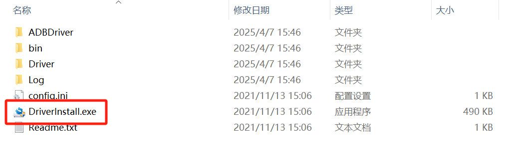

.. image:: ../../../image/MYZR-瑞芯微系列/MYZR-RK3562-EK200/刷新固件2.png
   :alt: 刷新固件2.png
   :width: 100%

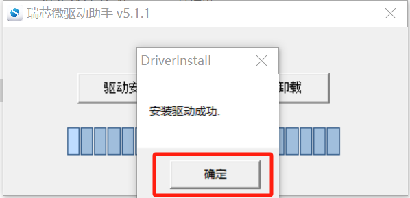

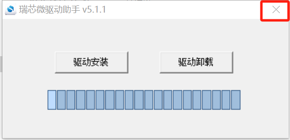

Flashing with the RKDevTool
----------------------------

#. Find the RKDevTool driver installation package from the downloaded cloud drive materials, path: 3. Software Materials --> 3.2 Tools --> RKDevTool_Release_v3.15.zip

#. Extract RKDevTool_Release_v3.15.zip and enter the RKDevTool_Release_v3.15 folder

#. Double-click RKDevTool.exe to open the program

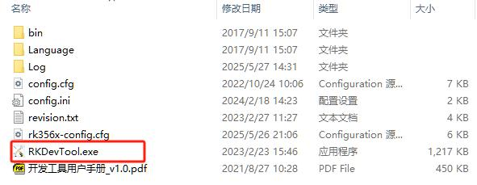

Full Flash
^^^^^^^^^^

Flash the entire firmware.

* Click to enter the "Upgrade Firmware" interface

.. image:: ../../../image/MYZR-瑞芯微系列/MYZR-RK3562-EK200/刷新固件6.png
   :alt: 刷新固件6.png
   :width: 100%

* Click the "Firmware" button, then select the corresponding img image file

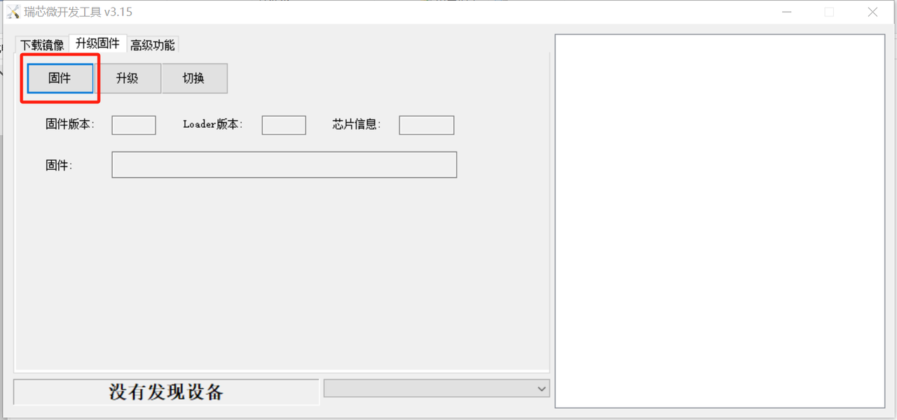

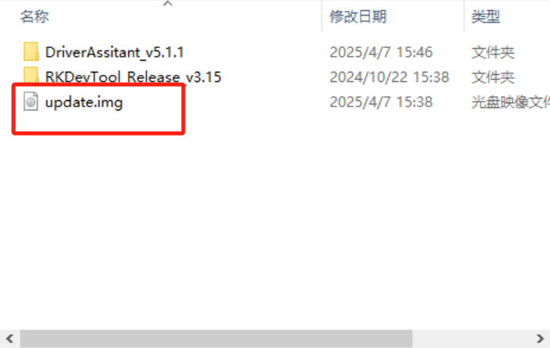

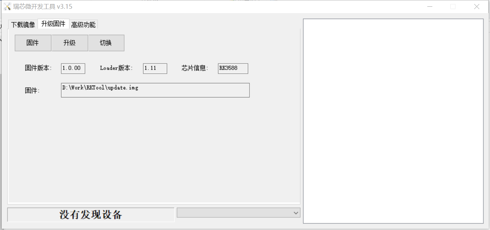

* Connect the Type-C flashing cable to CON6 on the development board, press and hold the USER1 button on the development board, then power on. After about 3 seconds, the development board will enter download mode.

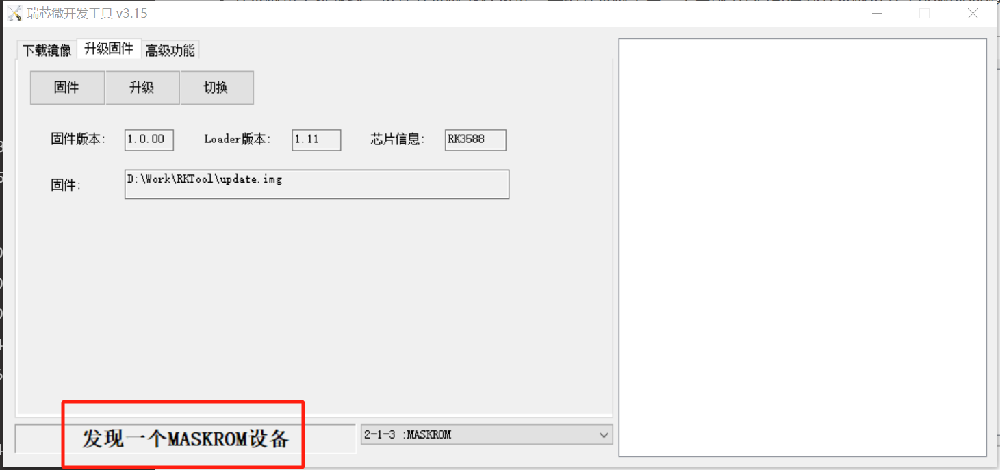

* Click the "Upgrade" button to flash. A success message will appear on the right side when flashing is complete.

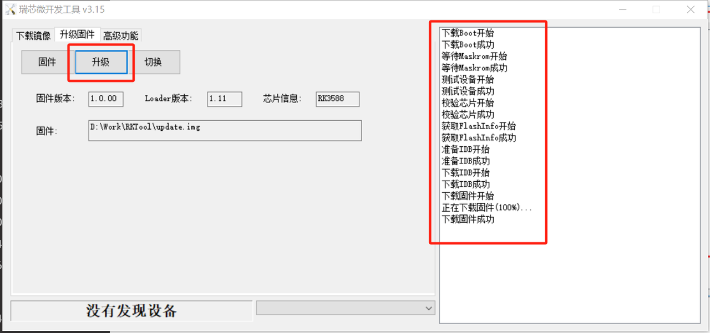

* After flashing is complete, power cycle the development board.

Individual Flash
^^^^^^^^^^^^^^^^

* Flash one or more individual image files.

* Copy the U-Boot image uboot.img, Linux kernel image boot.img, or file system image rootfs.img to be replaced, along with the mkimage/output/Image/parameter.txt (partition table) file, to a Windows working directory without Chinese characters in the path.

* Connect the Type-C flashing cable to CON6 on the development board, press and hold the USER1 button on the development board, then connect the power cable. After about 3 seconds, the development board will enter LOADER mode. Follow the steps below to import the configuration.

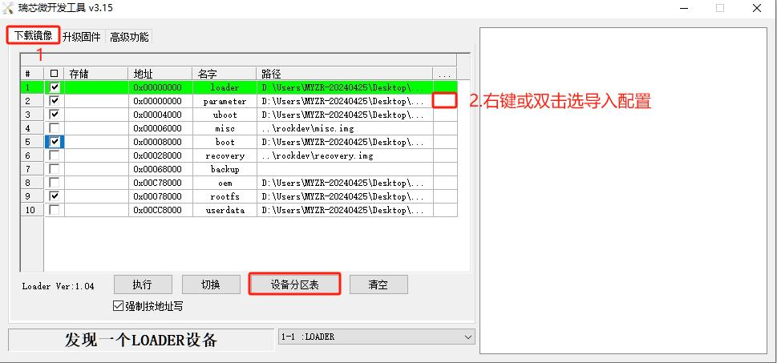

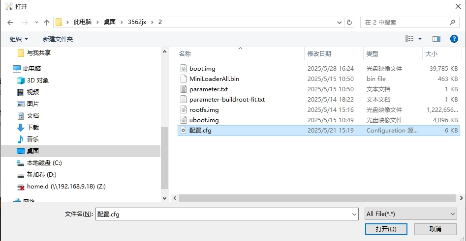

* Check the parameter box and click "Read Partition Table" to read the partitions.

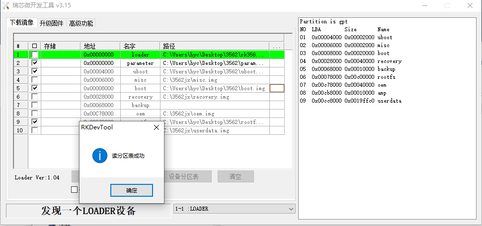

Follow the steps below to flash.

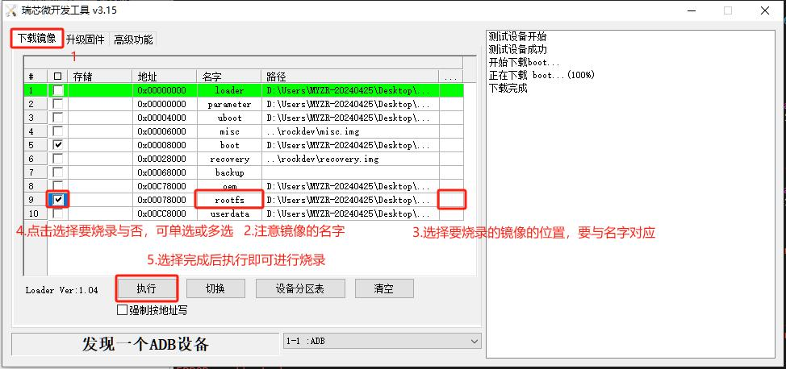

* After flashing is complete, power cycle the development board.