.. raw:: html

   

Hardware Development Guide
==========================

Core Board Pinout Schematic
---------------------------

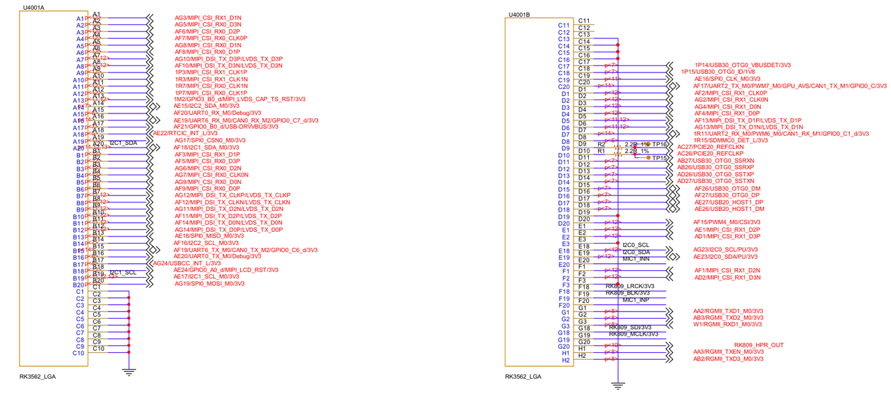

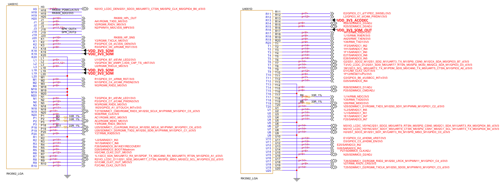

Baseboard Schematic
-------------------

Power Management
~~~~~~~~~~~~~~~~

The evaluation baseboard has one power input interface, where J15 is a 12V DC power supply interface using a DC-005 power connector.

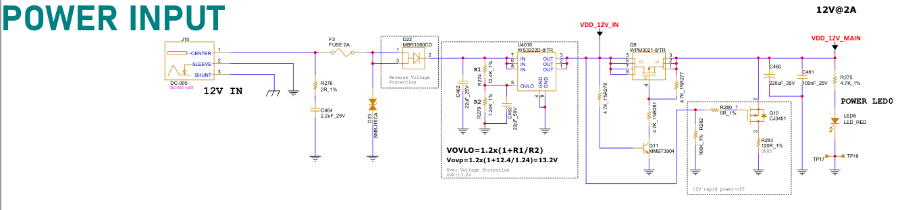

VDD_12V_MAIN is converted through multiple power chips to supply power to the core board and evaluation baseboard peripherals. To meet the timing requirement that the CPU's GPIO power must be powered on before the peripheral power, the recommended power-on sequence for the evaluation board is: 12V DC supply (VDD_12V_MAIN) -> Core board power (VDD_3V3_SOM) -> Core board auxiliary power for baseboard configuration (VDD_3V3_SOM_OUT) -> Baseboard peripheral power (VDD_1V8_MAIN) -> Baseboard peripheral power (VDD_5V_MAIN) -> System reset (1P12/RESETn/PU/3V3) -> Core board audio power (VDD_3V3_ACODEC) -> Baseboard peripheral power (VDD_3V3_MAIN). The recommended power-on sequence design is shown in the following figure.

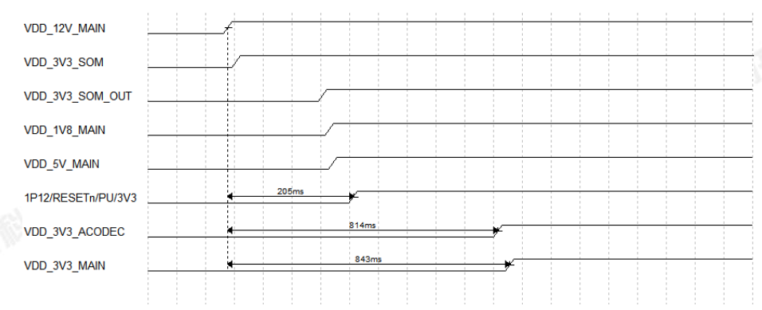

Figure 11: Recommended Evaluation Baseboard Power-On Sequence

VDD_12V_MAIN generates a 3.3V power rail through the Ecranic EC2232E DCDC power chip for core board power supply, net name VDD_3V3_SOM, with a maximum current supply capacity of 3A.

The power enable is provided by the input voltage divider, achieving power-on-immediate-enable timing control. To protect the core board and facilitate voltage/current measurement, a fuse F2 is connected in series on the power path.

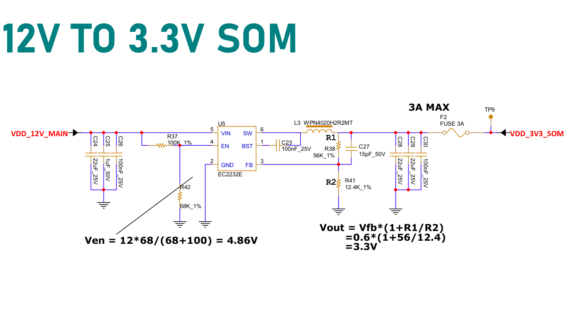

The core board provides VDD_3V3_SOM_OUT and VDD_3V3_ACODEC power outputs with a supply capacity of ≤200mA. VDD_3V3_SOM_OUT is primarily used to control the power-on of some evaluation baseboard power rails and supply power to core board configuration-related circuits (such as BOOT SET, DEBUG UART, Micro SD, etc.); VDD_3V3_ACODEC is primarily used to control the power-on of other parts of the evaluation baseboard. Apart from these functions, these two power outputs from the core board should not be used to supply power to other peripherals.

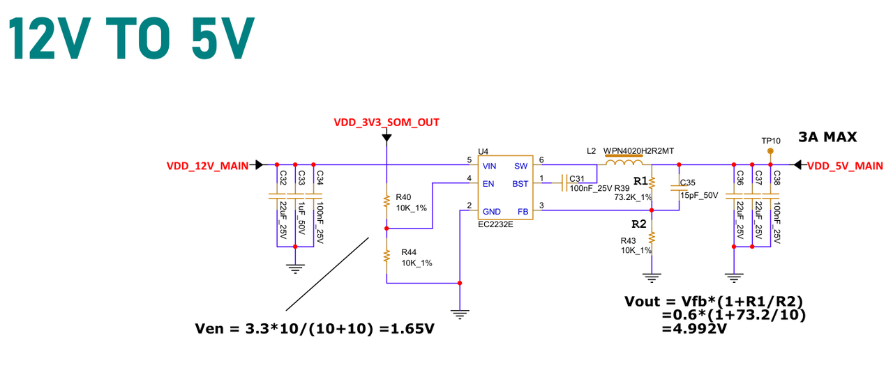

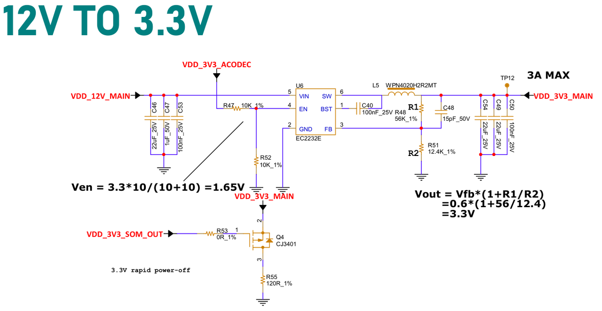

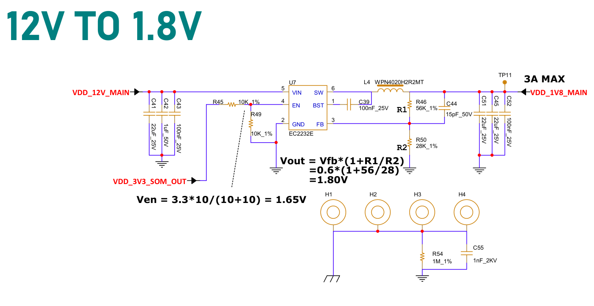

VDD_12V_MAIN generates 3 evaluation baseboard peripheral power rails through three Ecranic EC2232E DCDC power chips, with net names: VDD_5V_MAIN, VDD_3V3_MAIN, VDD_1V8_MAIN. Each peripheral power rail has a maximum current supply capacity of 3A.

The VDD_5V_MAIN and VDD_1V8_MAIN power enables are provided by the core board VDD_3V3_SOM_OUT signal, and the VDD_3V3_MAIN power enable is provided by the core board VDD_3V3_ACODEC signal, achieving timing control where core board power is powered on before peripheral power.

Design Notes:

(1) When designing the baseboard, if part or all of the input protection circuit functionality is not required, it can be appropriately trimmed.

(2) The baseboard power design can be adjusted according to the actual circuit design. It is recommended to refer to our company's power-on sequence for baseboard power enable control.

(3) To ensure VDD_5V_MAIN, VDD_3V3_MAIN, and VDD_1V8_MAIN meet the system power-on and power-off timing requirements, the VDD_3V3_SOM_OUT signal output from the core board must be used to control the power enable of VDD_5V_MAIN and VDD_1V8_MAIN, and the VDD_3V3_ACODEC signal output from the core board must be used to control the power enable of VDD_3V3_MAIN (see the recommended evaluation baseboard power-on sequence for details).

LED Circuit
~~~~~~~~~~~

The evaluation baseboard provides power indicator LEDs and user-programmable LEDs, designated as LED1~LED6. All use 0603 package SMD LEDs.

LED6 is the baseboard power indicator, LED3 is the core board power indicator, both red, and lit by default when powered on. LED1, LED2, LED4, and LED5 are user-programmable LEDs, green, corresponding to GPIO4_B1_d, GPIO4_B7_d, GPIO0_A5_d, and GPIO0_A6_d pins respectively, with active-high lighting.

.. raw:: html

   

   

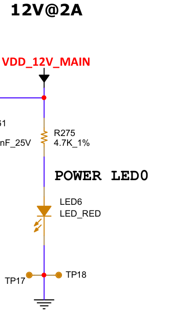

.. raw:: html

   

   

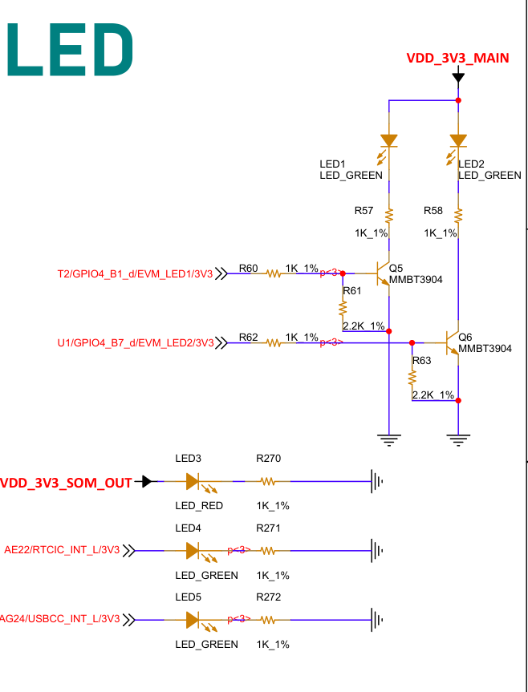

.. raw:: html

   

   

KEY Circuit
~~~~~~~~~~~

The evaluation baseboard includes 1 system reset button RESETn (KEY1), 1 Maskrom button Maskrom (KEY2), and 1 user input button USER1 (KEY3).

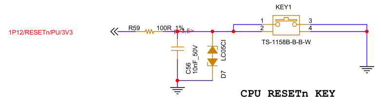

KEY1 is the evaluation board RESET button, controlling the CPU and PMIC reset pins.

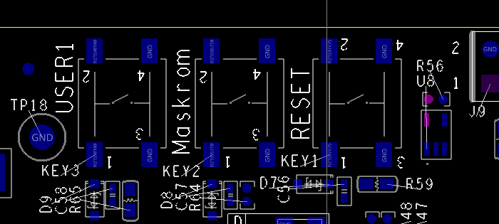

Design Notes:

(1) 1P12/RESETn/PU/3V3 is the core board reset input pin. The core board internally has a 10K pull-up resistor. By default, it should be left floating to avoid affecting the power-on timing.

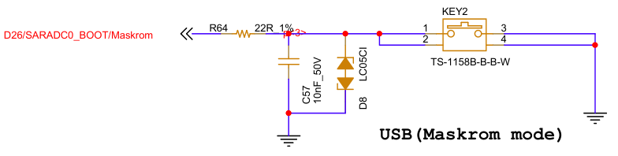

KEY2 is the Maskrom button, with the button status input to the CPU via the SARADC0_BOOT pin.

Design Notes:

(1) When powered on without a system image flashed to eMMC, the CPU will boot into Maskrom mode. The first system image flashing can be performed via USB3.0 OTG, or during development and debugging, if the Loader fails to start normally, the system can also be flashed by entering Maskrom mode.

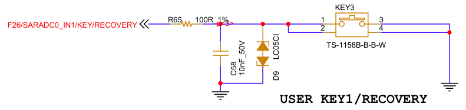

KEY3 (USER1) is the user input button. The KEY3 button status is input to the CPU via the SARADC0_IN1 pin. Note: The KEY3 (USER1) button also serves as the system Recovery button.

Debug UART Circuit
~~~~~~~~~~~~~~~~~~

The evaluation baseboard has 1 onboard serial port. CON4 is the USB TO UART0 debug serial port.

The evaluation baseboard converts UART0 to a Type-C connector (CON4) via the WCH CH340T chip for use as the system debug serial port. The CH340T uses 5V external power from the Type-C data line (net name: VDD_5V_VBUS), and VDD_5V_VBUS can also serve as baseboard power.

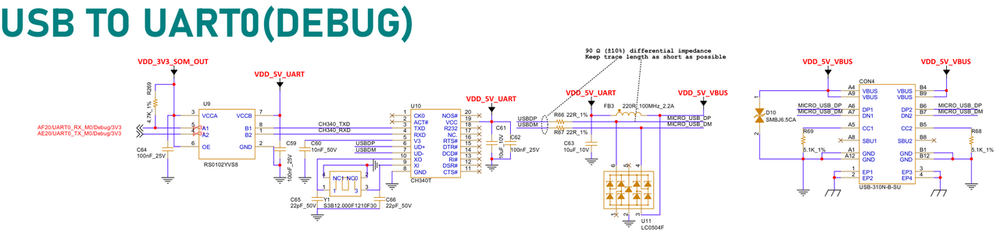

Design Notes:

(1) When designing the baseboard, it is recommended to use the RS0102YVS8 (U9) level translation isolation solution to prevent the debug serial port RX end from being powered before the baseboard is powered on, which could inject current into the core board pins and prevent the system from starting.

(2) The CPU pins UART0_TX_M0 and UART0_RX_M0 are at 3.3V level. Do not directly connect debugging tools with 5V level interfaces, as this will cause CPU damage.

(3) Note that USB signals require 90-ohm differential impedance matching.

(4) ESD devices should be placed close to the Type-C connector layout, with traces passing through the ESD before connecting to the CH340T.

Micro SD Interface Circuit
~~~~~~~~~~~~~~~~~~~~~~~~~~

The evaluation baseboard provides 1 Micro SD interface (CON5), using an external-solder Micro SD connector with a shell clip, located on the front of the evaluation baseboard.

Micro SD is routed through the CPU's SDMMC0 bus, using 4-bit data line mode.

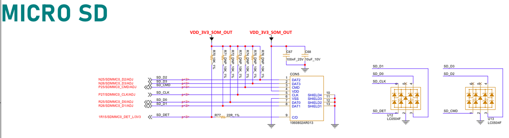

Design Notes:

(1) When designing the baseboard, the SHIELD[1:4] pins of the Micro SD connector shell must be connected to digital ground.

(2) It is recommended to use the core board output power VDD_3V3_SOM_OUT to supply power to Micro SD (CON5). Using VDD_3V3_MAIN is not recommended, as it may cause the system to fail to correctly read the Micro SD card device and fail to boot due to power supply delay.

(3) The maximum clock frequency of the SDMMC0 bus is 100MHz. It is recommended that D0~D3 be controlled to within 50mil relative to CLK equal length, single-ended 50 ohm. For core board signal trace lengths, please refer to our company's core board hardware manual.

Ethernet Interface
~~~~~~~~~~~~~~~~~~

The evaluation board baseboard provides 2 Ethernet ports, including 1 ETH RGMII Gigabit Ethernet port and 1 ETH RMII Fast Ethernet port.

The CPU integrates 1 GMAC and 1 MAC controller, supporting 1 native RGMII Gigabit Ethernet port and 1 native RMII Fast Ethernet port.

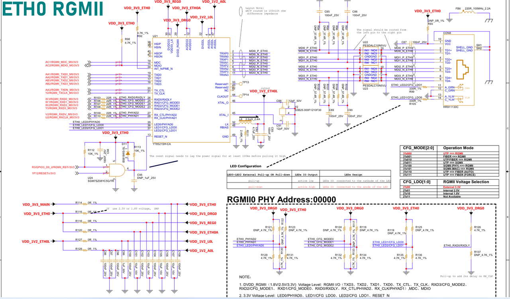

The evaluation baseboard provides 1 10/100/1000Mbps auto-negotiation Ethernet port through the domestic manufacturer Motorcomm YT8521SH-CA integrated Ethernet transceiver solution. It uses a Gigabit RJ45 connector (CON8) with built-in isolation transformer, using independent RGMII bus and MDIO bus for PHY communication and configuration.

The YT8521SH-CA complies with 10BASE-Te, 100BASE-TX, and 1000BASE-T IEEE 802.3 standards, providing crossover detection, auto-correction, polarity correction, and adaptive equalization functions.

Design Notes:

(1) The ETH0 RGMII PHY uses 3.3V IO level. The RGMII level selection is configured using CFG_LDO[1:0], and the corresponding circuit supply pin is DVDD_RGMII (pin 29 of the YT8521SH-CA chip).

(2) The XTAL_I and XTAL_O pins are connected to a 25MHz passive crystal oscillator. If a 25MHz active crystal oscillator is needed, it can be connected to the XTAL_I pin, with the XTAL_O pin left floating.

(3) The evaluation baseboard uses the YT8521SH-CA solution, which uses an internally generated 1.2V voltage (VDD_1V2_ETH0L) for core logic power supply, eliminating the need for an external 1.2V supply. VDD_1V2_ETH0L should not be used to supply other loads.

(4) The YT8521SH-CA chip requires that after the power supply stabilizes, wait 100ms before pulling the reset signal high. It is recommended to use IO to control the PHY chip reset.

(5) The PESDALC10N5VU near the RJ45 connector is a 10-pin ESD device. Note that the 2 adjacent pins (such as IN1 and NC4, IN2 and NC3) are not internally connected within the ESD device. In actual design, the corresponding pins should be directly externally shorted (as shown below), i.e., the net names of the corresponding pins must be consistent.

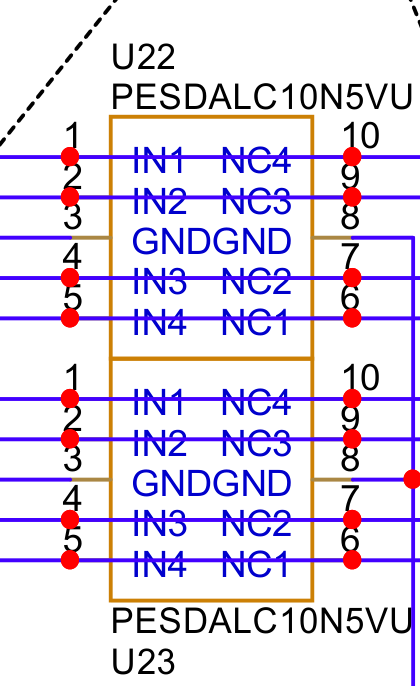

(6) PCB Layout and Routing Notes:

a) The ESD device should be placed close to the RJ45 connector; signal lines requiring ESD protection should pass directly through the ESD pins before connecting to subsequent circuits.

b) MDIx_P/N signals should be routed as 100-ohm differential signal pairs. The clock signal provided by the crystal oscillator is recommended to be ground-shielded.

c) The TX and RX signal groups in the RGMII bus should be length-matched to within 50mil respectively, and the TX and RX groups should be length-matched to within 100mil between them, with single-ended impedance of 50 ohm.

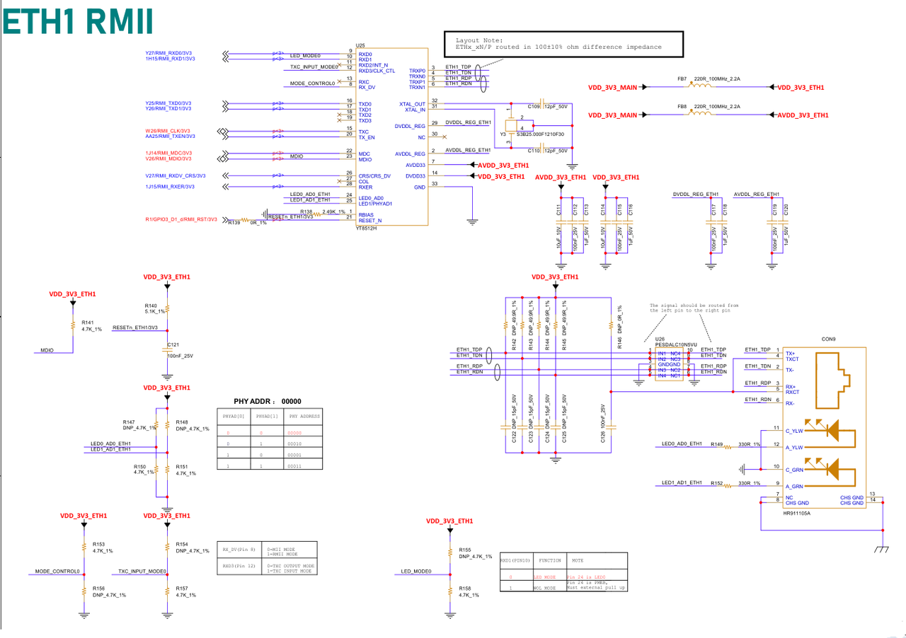

The evaluation baseboard provides 1 10/100Mbps auto-negotiation Ethernet port through the Motorcomm YT8512H integrated Ethernet transceiver, using independent RMII bus and MDIO bus for PHY communication and configuration, with a Fast Ethernet RJ45 connector (CON9) with built-in isolation transformer.

The YT8512H complies with 10BASE-Te and 100BASE-TX EEE 802.3az, EEE standards, providing polarity detection and auto-correction, auto-negotiation, and adaptive equalization functions.

Design Notes:

(1) The XTAL_IN and XTAL_OUT pins are connected to a 25MHz passive crystal oscillator. If a 25MHz active crystal oscillator is needed, it can be connected to the XTAL_IN pin, with the XTAL_OUT pin left floating.

(2) The YT8512H chip requires that after the power supply stabilizes, wait 100ms before pulling the reset signal high. Refer to the evaluation baseboard reset circuit solution and use IO to control the Ethernet port reset.

(3) The PESDALC10N5VU near the RJ45 connector is a 10-pin ESD device. Note that the 2 adjacent pins (such as IN1 and NC4, IN2 and NC3) are not internally connected within the ESD device. In actual design, the corresponding pins should be directly externally shorted (as shown below), i.e., the net names of the corresponding pins must be consistent.

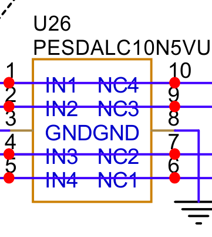

(4) PCB Layout and Routing Notes:

a) The ESD device should be placed close to the RJ45 connector, and signal lines should pass directly through the ESD pins before connecting to subsequent circuits.

b) ETH1_xP/N signals should be routed as 100-ohm differential signal pairs.

c) The clock signal provided by the crystal oscillator is recommended to be ground-shielded.

d) The TX and RX signal groups in the RMII bus should be length-matched to within ±50mil, with single-ended impedance of 50 ohm.

MIPI LCD Interface Circuit
~~~~~~~~~~~~~~~~~~~~~~~~~~

The evaluation baseboard provides MIPI LCD interface and capacitive touch interface J10 via a 30-pin, 0.5mm pitch FFC connector. The core board uses the I2C1 bus to communicate with the capacitive touch interface.

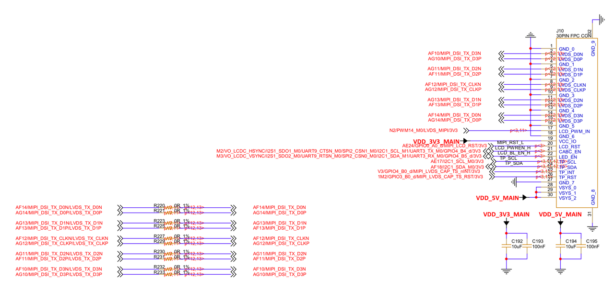

Design Notes:

(1) The MIPI LCD interface and LVDS LCD interface signals are multiplexed, and their capacitive touch screen interfaces also share signals. Additionally, the HDMI OUT signal is converted from the MIPI DSI signal through the LT8912B (U33) chip. Therefore, only one of the MIPI LCD, LVDS LCD, and HDMI OUT interfaces can be used at a time.

(2) The voltage at pins 28-30 of the MIPI connector must be maintained between 4.8-5.3V. 1uF and 0.1uF decoupling capacitors must be placed on these pins and must not be removed. During layout, place them close to the MIPI connector pins. To suppress electromagnetic radiation, common-mode inductors can be reserved for MIPI data and clock signals.

(3) It is recommended that DSI differential intra-pair equal length be within 5mil, inter-pair equal length within 30mil, with differential impedance of 100 ohm.

HDMI OUT Interface Circuit
~~~~~~~~~~~~~~~~~~~~~~~~~~

The evaluation baseboard uses the Dioo ten-channel double-throw MIPI switch DIO1647WL36 and the Lontium video signal conversion chip LT8912B solution to extend the HDMI OUT (CON14) interface through the MIPI DSI bus, using a standard 19-pin HDMI connector.

The LT8912B uses 1.8V power supply, complies with HDMI 1.4, supports 1080p HDMI output, supports 7-bit automatic or manual output swing calibration, and supports hot-plug detection.

The DIO1647WL36 is a 10-channel (4 data differential pairs and 1 clock differential pair) differential MIPI double-throw switch chip with speeds up to 3.5Gbps and a supply voltage range of 1.65V~5V.

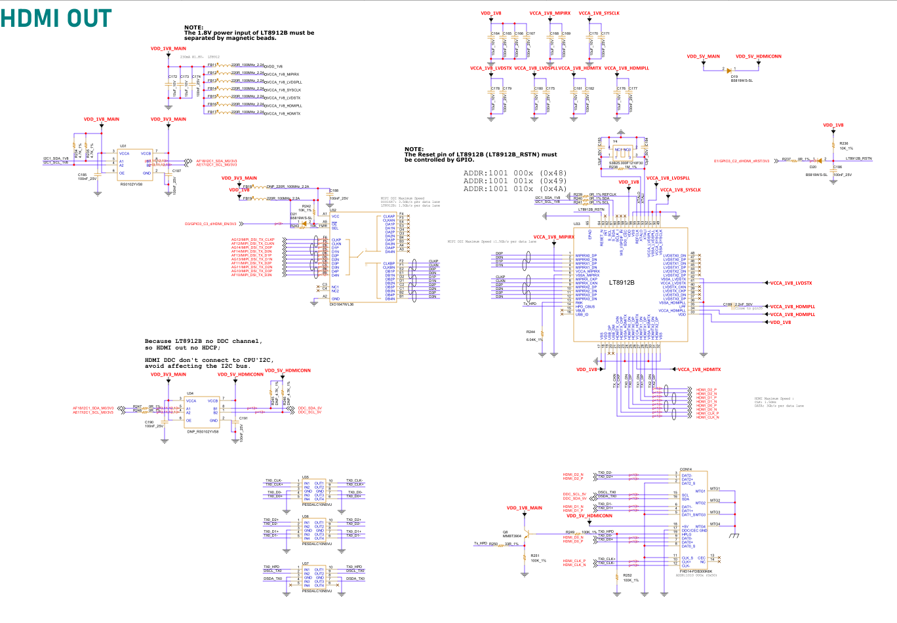

Design Notes:

(1) Since the HDMI OUT signal is converted from the MIPI DSI signal through the LT8912B (U33) chip, and the MIPI LCD interface and LVDS LCD interface signals are multiplexed, and their capacitive touch screen interfaces also share signals, only one of the MIPI LCD, LVDS LCD, and HDMI OUT interfaces can be used at a time.

(2) The IO level of AF18/I2C1_SDA_M0/3V3 and AE17/I2C1_SCL_M0/3V3 is 3.3V and must be converted to 1.8V level before connecting to the LT8912B chip.

(3) The HPLG signal of the HDMI connector must be level-converted through an NPN transistor to output a 1.8V signal before connecting to the LT8912B chip. When an external device is connected, this signal will be pulled high.

(4) To prevent power feed-through via the HDMI interface when the core board is powered off, the D19 component must be added as shown in the evaluation baseboard circuit.

(5) It is recommended that HDMI differential intra-pair equal length be within 5mil, inter-pair equal length within 100mil, with differential impedance controlled at 100 ohm.

LVDS LCD Interface Circuit
~~~~~~~~~~~~~~~~~~~~~~~~~~

CON11 is a single-channel 8-bit LVDS LCD interface, using 2x15-pin header pins with 2.0mm pitch, including LVDS signals and power supply. CON12 is the BACK LIGHT control interface, using a 6-pin white terminal block with 2.0mm pitch. J3 is the RES TS resistive touch screen interface, using 4-pin header pins with 2.54mm pitch; J4 is the LVDS CAPTS capacitive touch screen interface, using a 6-pin FFC connector with 0.5mm pitch. The core board uses the I2C1 bus to communicate with it.

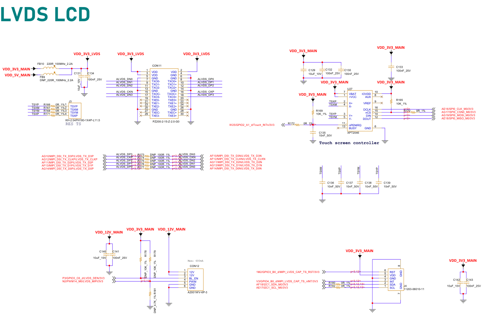

Design Notes:

(1) The LVDS LCD interface and MIPI LCD interface signals are multiplexed, and their capacitive touch screen interfaces also share signals. Additionally, the HDMI OUT signal is converted from the MIPI DSI signal through the LT8912B (U33) chip. Therefore, only one of the MIPI LCD, LVDS LCD, and HDMI OUT interfaces can be used at a time.

(2) It is recommended that LVDS differential intra-pair equal length be within 5mil, inter-pair equal length within 30mil, with differential impedance controlled at 100 ohm.

USB2.0 HOST Interface Circuit
~~~~~~~~~~~~~~~~~~~~~~~~~~~~~

The evaluation baseboard directly routes the USB20_HOST1 bus through a Type-A connector (CON7).

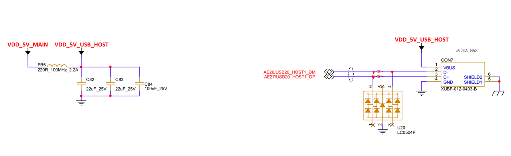

USB3.0 OTG Interface Circuit
~~~~~~~~~~~~~~~~~~~~~~~~~~~~

CON6 is the USB3.0 OTG interface, using a 24-pin Type-C receptacle, routed from the core board through the USB3_OTG0 bus.

The evaluation baseboard uses the WILLSEMI Type-C control chip WUSB3801Q-12/TR to implement communication role detection.

Since USB3.0 differential pair signals have speeds up to 5Gbps, they cannot be directly branched to the Type-C interface front and back sides as with USB2.0. To implement reversible plug functionality, the WCH USB switch chip CH482D is selected. This chip supports 2-channel differential signal 2-to-1 switching for Super Speed+, PCIe Gen1/2/3, SATA/SAS 3Gbps/6Gbps, Display Port, etc.

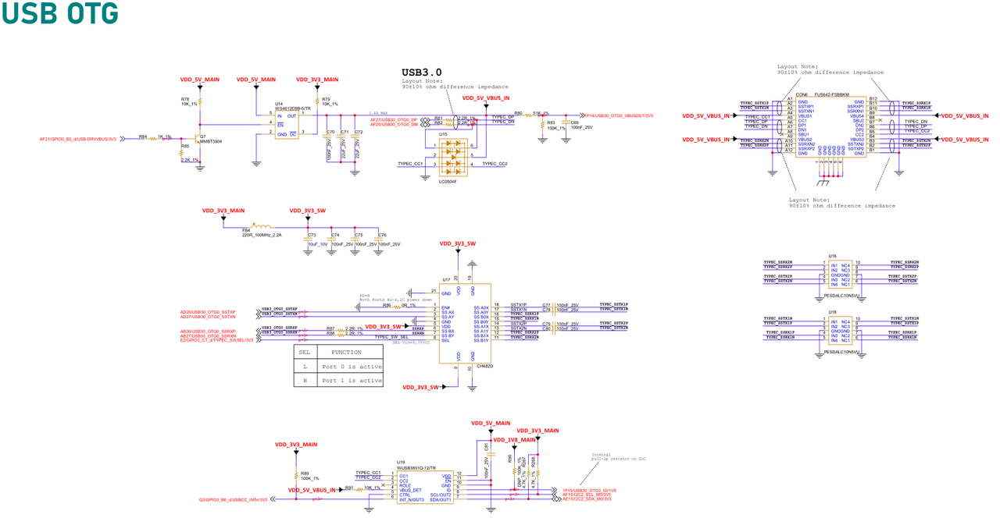

Design Notes:

(1) USB signals have a maximum speed of 5Gbps. It is recommended that differential intra-pair equal length be within 5mil, with differential impedance of 90Ω.

(2) If the INT_N/OUT3 pin of U19 needs to be assigned to another GPIO, use a CPU GPIO pin that supports interrupt functionality (all GPIOs support CPU interrupt functionality).

(3) With the WUSB3801Q-12/TR chip solution, the CC1 and CC2 states of the Type-C connector are automatically detected by the chip's internal state machine and updated in the register map. If the CC channel is detected as SRC or DRP, the chip's ID pin outputs a low level. When two boards are connected, one board's role must be manually configured for the other board to automatically switch roles.

AUDIO Interface Circuit
~~~~~~~~~~~~~~~~~~~~~~~

The evaluation baseboard provides three AUDIO interfaces through the core board's onboard PMIC chip: HEADPHONE OUT, SPK OUT, and MIC IN. CON10 is the HEADPHONE OUT audio interface, using a 3.5mm audio jack. J1 is the SPK OUT audio interface, and J2 is the MIC IN audio interface, both using 2-pin white terminal blocks with 2.0mm pitch.

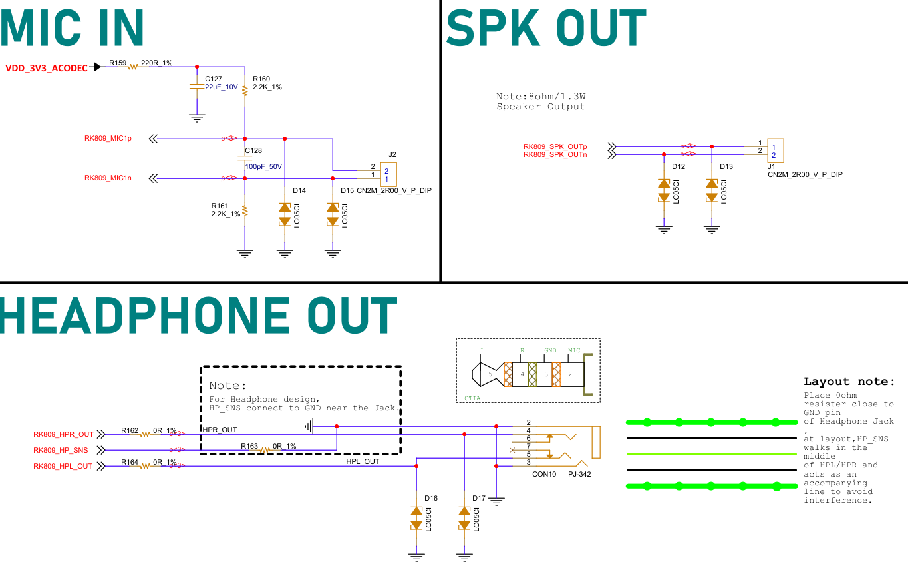

Design Notes:

(1) For the HEADPHONE OUT design, RK809_HP_SNS should be connected to the audio jack's GND.

MIPI CSI0/MIPI CSI1 Interface Circuit
~~~~~~~~~~~~~~~~~~~~~~~~~~~~~~~~~~~~~

The evaluation baseboard provides two camera interfaces via two 30-pin FFC connectors with 0.5mm pitch: MIPI CSI0 (J5) and MIPI CSI1 (J6), both placed on the back of the evaluation baseboard. They support the TL13850 camera module (based on the OV13850 camera module design) and also support the external Tronlong dual-camera adapter board TL-MIPICSI-PinBoard-A1.0-000, which expands one 4-Lane MIPI CSI interface into two 2-Lane MIPI CSI interfaces, allowing simultaneous connection of two different Raspberry Pi camera modules: CAM-MIPI9281RAW-V2 (based on the OV9281 camera module design) and Camera Module v2 (based on the IMX219 camera module design).

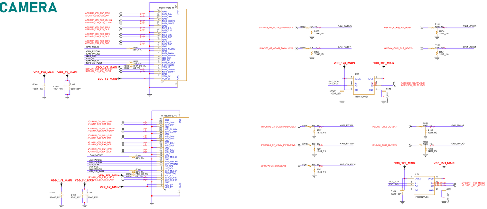

Design Notes:

(1) Since the MIPI CSI camera interface signal level is 1.8V, when using the core board's 3.3V signal level, level conversion is required before connecting to the MIPI CSI interface. To ensure the quality of the CAM_CLK clock signal, it is recommended that the voltage divider resistor values used for the clock signal be consistent with the evaluation baseboard reference circuit design.

(2) It is recommended that MIPI CSI differential intra-pair equal length be within 5mil, inter-pair equal length within 30mil, with differential impedance of 100Ω.

EXPORT Interface
~~~~~~~~~~~~~~~~

The evaluation baseboard provides CPU resources through the EXPORT0 (J8) and EXPORT1 (J9) expansion interfaces. Both EXPORT0 and EXPORT1 use 2x10-pin female headers with 2.54mm pitch.

The CPU resources provided by the EXPORT0 and EXPORT1 interfaces are as follows:

(1) Communication interfaces: 3 UART serial ports, 3 I2C, 2 CAN (RK3562J), 1 SPI, 1 SDIO.

(2) Audio interface: 1 I2S.

(3) System reset: 1 PWRON, which can be used to control PMIC power on/off.

(4) Signal detection: 14 SARADC channels, ADC sampling rate up to 1MSPS.

Note: The signal levels provided by EXPORT0 and EXPORT1 are not consistent. Before use, determine the level standard of the selected signal.

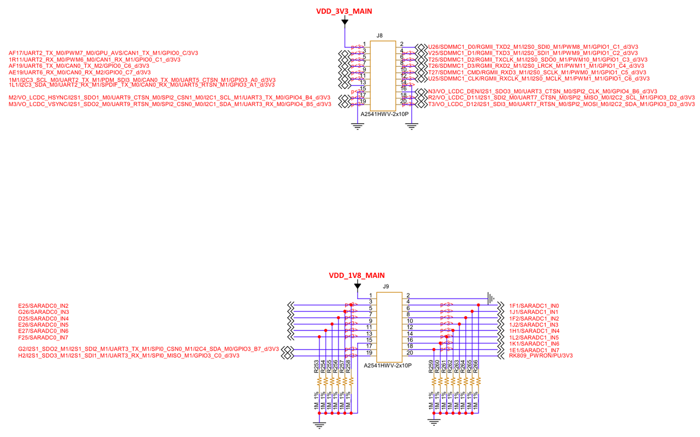

Design Notes:

(1) For ADC input pins with no voltage input, to reduce ADC channel crosstalk, it is recommended to add a 1MΩ pull-down resistor as per our company's baseboard design.