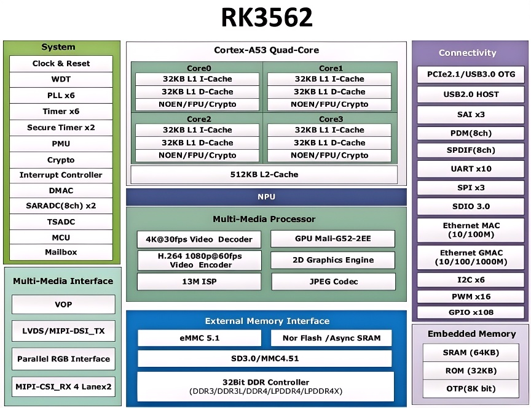

.. raw:: html

   

Platform Introduction
=====================

Product Overview
----------------

The RK3562 is an accessible lightweight AI chip launched by Rockchip for the AIoT market. It officially entered large-scale commercial production in 2025 and won the "Excellent Market Performance Product" award at the China Core Awards that year. Positioned as a cost-effective variant of the RK3568, it focuses on high performance and low power consumption.

Target Applications
-------------------

* Consumer Electronics:

  #. Tablets: Quad-core Cortex-A53 architecture with clock speeds up to 2.0GHz, paired with ARM G52 GPU, capable of smoothly running office applications, playing HD videos, and supporting light gaming, meeting daily multi-scenario usage needs.
  
  #. Smart Speakers: Built-in NPU with 1TOPS computing power enables voice wake-up, keyword detection and other interactions, with software providing music playback, information query and other services.
  
  #. Smart Dictionary Pen: Such as NetEase Youdao Dictionary Pen X6 Pro, leveraging RK3562's high-performance NPU and GPU to achieve large-model AI interactions, including Q&A, grammar explanation and other features, with fast and accurate word lookup.

* Smart Home:

  #. Smart Appliances: As the control core for smart air conditioners, refrigerators and other appliances, enabling remote control and device linkage through networks.
  
  #. Smart Gateway: Supports multiple protocols including Wi-Fi and Bluetooth, serving as a smart home hub to connect and manage various devices.
  
  #. Smart Cameras: Utilizes NPU computing power for facial recognition and behavior detection to ensure home security.

* Industrial Applications:

  #. Industrial Automation Control: With 4 high-performance ARM Cortex-A53 cores handling logic control, data processing and other tasks, connecting sensors and actuators for precise production control.
  
  #. Industrial Display: Used for industrial display screens through interfaces such as LVDS and MIPI DSI, providing clear display and smooth touch experience.
  
  #. Industrial IoT: Dual Ethernet, CAN and other interfaces ensure efficient and stable data transmission, enabling device networking and remote monitoring.

* Smart Security:

  #. Video Surveillance: Supports 4K 30fps H.265 video decoding and 1080p 60fps H.264 encoding, combined with NPU for real-time video analysis, enabling facial recognition and other features to enhance security intelligence.
  
  #. Access Control System: AI-powered facial recognition and fingerprint recognition for access control, capable of linking with other security equipment.

* Smart Education:

  #. Smart Education Tablets: In addition to standard functions, utilizes AI to provide intelligent tutoring, homework grading and other personalized learning services.
  
  #. Electronic Dictionary Pen: Such as Youdao Dictionary Pen X6 Pro, relying on RK3562 to achieve powerful AI interactions to assist learning.

* Smart Retail:

  #. AI Electronic Scale: Built-in high-precision ADC module with low error rate for weighing sensors, supports Android system deployment for AI pricing, payment and other functions.
  
  #. Smart Advertising Machine: Plays HD advertisements, utilizes NPU for facial recognition and customer flow statistics to deliver personalized advertisements.

Key Features
------------

#. High-Performance CPU: Adopts quad-core ARM Cortex-A53 architecture with clock speeds up to 2.0GHz, including 32KB instruction cache and 32KB data cache, plus 512KB L2 cache, providing strong general-purpose computing capabilities to meet the needs of multi-tasking and complex applications.

#. Powerful GPU: Integrated Mali-G52 GPU supporting OpenGL ES 1.1/2.0/3.2, OpenCL 2.0 and Vulkan 1.1, providing smooth graphics rendering capabilities suitable for HD video playback, image processing and other graphics-intensive tasks.

#. AI Acceleration: Built-in NPU with 1TOPS computing power supports mixed-precision operations for INT4/INT8/INT16/FP16 data types, compatible with deep learning frameworks such as TensorFlow, PyTorch, Caffe, and MXNet, providing powerful support for AI applications such as facial recognition and speech recognition.

#. Multimedia Processing: Supports 4K 30fps H.265/VP9 and 1080P 60fps H.264 video decoding, as well as 1080P 60fps H.264 video encoding, plus high-quality JPEG codec capabilities. Additionally, integrated 13M ISP supports HDR (High Dynamic Range), 3DNR (3D Digital Noise Reduction) and more, meeting the needs of HD video surveillance, image processing and other applications.

#. Rich Interfaces: Supports USB3.0 OTG, USB2.0 HOST, PCIE2.1, RGMII + RMII and other interfaces, including dual Ethernet, CAN, UART, SPI, I2C, PWM and more, enabling easy connection to various external devices for functional expansion.

#. Wide Memory Support: Features a 32-bit wide DDR controller supporting DDR3, DDR4, LPDDR3, LPDDR4 and other memory types, with maximum memory capacity up to 8GB, meeting the memory needs of different applications.

#. Low Power Design: Built on 22nm process, excels in balancing performance and power consumption, with static desktop running under 300mW and standby current of 3.3mA, suitable for power-sensitive devices such as smart speakers and smart cameras.

#. Compact Package Size: Uses FCCSP478L package with dimensions of 13.9mm*13.9mm, helping to reduce product volume, suitable for space-constrained devices.

Processor Block Diagram
-----------------------

Processor Specifications
------------------------

.. raw:: html

   

+----------+------------+------------------------------------------------------------------+
| Detailed Specifications                                                                  |
+==========+============+==================================================================+
| 1        | CPU        | Quad-core 64-bit Cortex-A53, up to 2.0 GHz                       |
+          |            +------------------------------------------------------------------+
|          |            | ARM Mali-G52 2EE                                                 |
+----------+------------+------------------------------------------------------------------+
| 2        | GPU        | Supports OpenGL ES 1.1/2.0/3.2, OpenCL 2.0, Vulkan 1.1           |
+          |            +------------------------------------------------------------------+
|          |            | Built-in high-performance 2D acceleration hardware               |
+----------+------------+------------------------------------------------------------------+
| 3        | NPU        | Supports 1 TOPS computing power                                  |
+----------+------------+------------------------------------------------------------------+
| 4        | Multimedia | Supports 4K 30fps H.265/VP9 and 1080P 60fps H.264 video decoding |
+          |            +------------------------------------------------------------------+
|          |            | Supports 1080P 60fps H.264 video encoding                        |
+          |            +------------------------------------------------------------------+
|          |            | Supports 13M ISP                                                 |
+----------+------------+------------------------------------------------------------------+
| 5        | Display    | Single display, supports LVDS/MIPI-DSI/RGB                       |
+----------+------------+------------------------------------------------------------------+
| 6        | Interfaces | Supports USB3.0 OTG, USB2.0 HOST, PCIe 2.1, RGMII + RMII         |
+----------+------------+------------------------------------------------------------------+