.. raw:: html

   

Software Development Guide
==========================

Development Environment
-----------------------

Environment setup and precautions.

File Download
~~~~~~~~~~~~~

Find the VirtualBox installation package from the cloud drive and download it, path: 1. General Materials --> 1.3 Tools --> VirtualBox-5.2.12 --> VirtualBox-5.2.12-122591-Win.exe

Installing Virtual Machine Software
~~~~~~~~~~~~~~~~~~~~~~~~~~~~~~~~~~~

Double-click the downloaded VirtualBox-5.2.12-122591-Win.exe and install as follows:

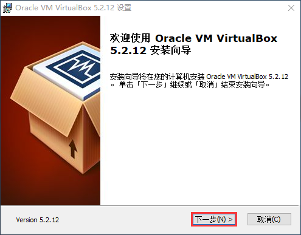

.. image:: ../../../image/MYZR-瑞芯微系列/MYZR-RK3562-EK200/安装虚拟机软件_02.png
   :alt: 安装虚拟机软件_02
   :width: 100%

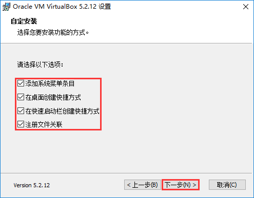

.. image:: ../../../image/MYZR-瑞芯微系列/MYZR-RK3562-EK200/4.png
   :alt: 安装虚拟机软件04
   :width: 100%

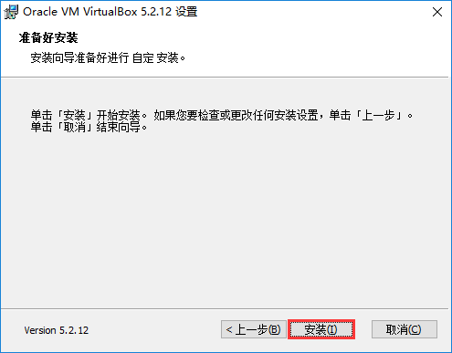

.. image:: ../../../image/MYZR-瑞芯微系列/MYZR-RK3562-EK200/安装虚拟机软件_06.png
   :alt: 安装虚拟机软件_06
   :width: 100%

Configuring Windows for the Virtual Machine
~~~~~~~~~~~~~~~~~~~~~~~~~~~~~~~~~~~~~~~~~~~

Adding Windows Network Adapter
^^^^^^^^^^^^^^^^^^^^^^^^^^^^^^

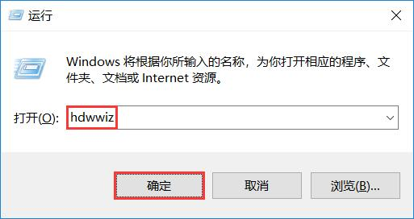

.. image:: ../../../image/MYZR-瑞芯微系列/MYZR-RK3562-EK200/添加Windows网卡_02.jpeg
   :alt: 添加Windows网卡_02
   :width: 100%

.. image:: ../../../image/MYZR-瑞芯微系列/MYZR-RK3562-EK200/添加Windows网卡_03.jpeg 
   :alt: 添加Windows网卡_03
   :width: 100%

.. image:: ../../../image/MYZR-瑞芯微系列/MYZR-RK3562-EK200/添加Windows网卡_04.jpeg
   :alt: 添加Windows网卡_04
   :width: 100%

.. image:: ../../../image/MYZR-瑞芯微系列/MYZR-RK3562-EK200/添加Windows网卡_05.jpeg
   :alt: 添加Windows网卡_05
   :width: 100%

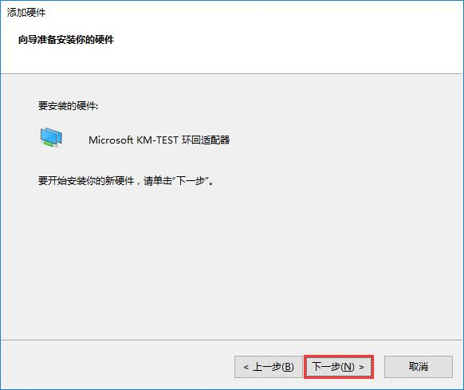

.. image:: ../../../image/MYZR-瑞芯微系列/MYZR-RK3562-EK200/添加Windows网卡_07.jpeg
   :alt: 添加Windows网卡_07
   :width: 100%

Configuring Windows Network Adapter
^^^^^^^^^^^^^^^^^^^^^^^^^^^^^^^^^^^

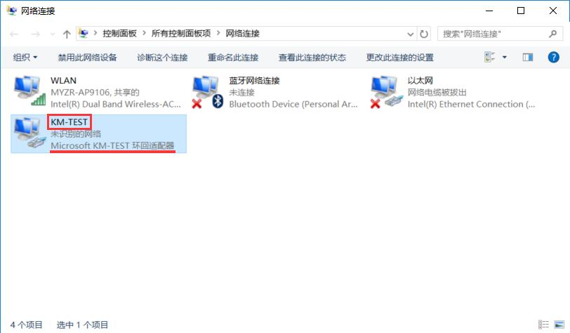

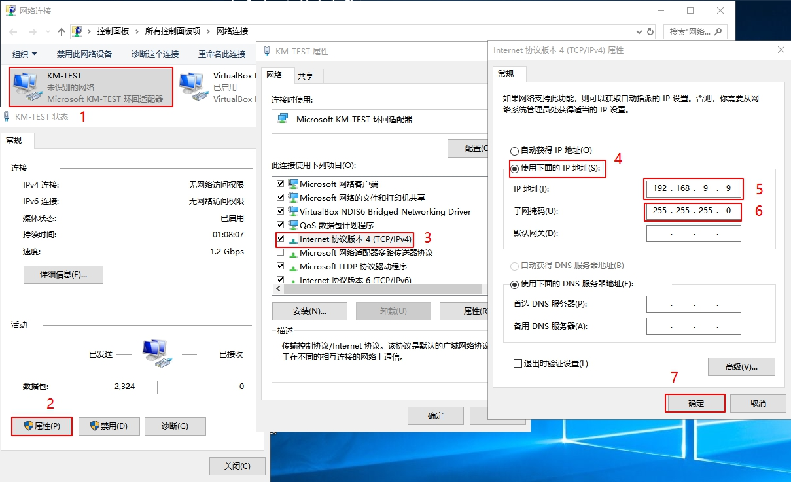

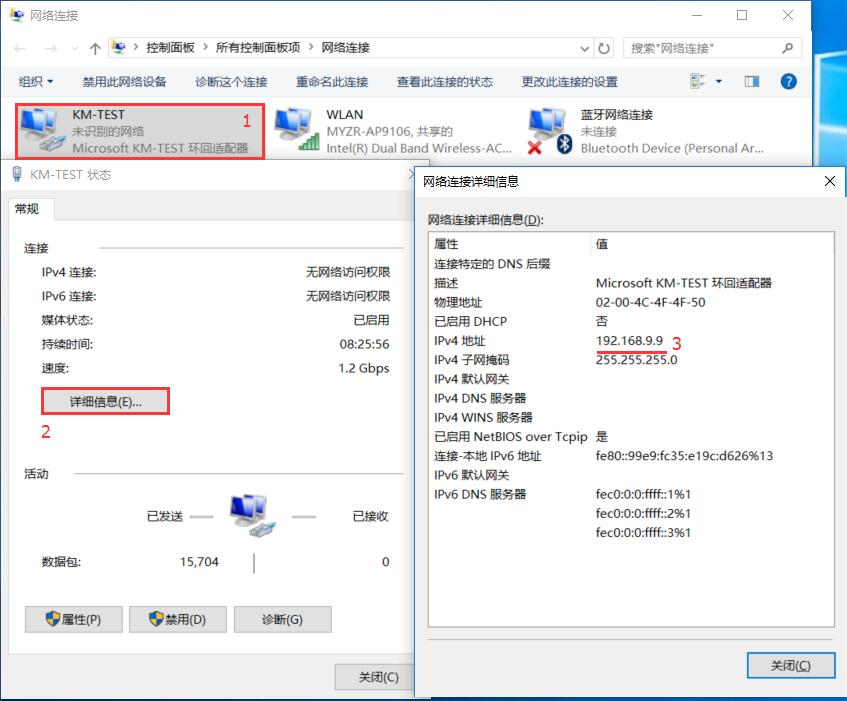

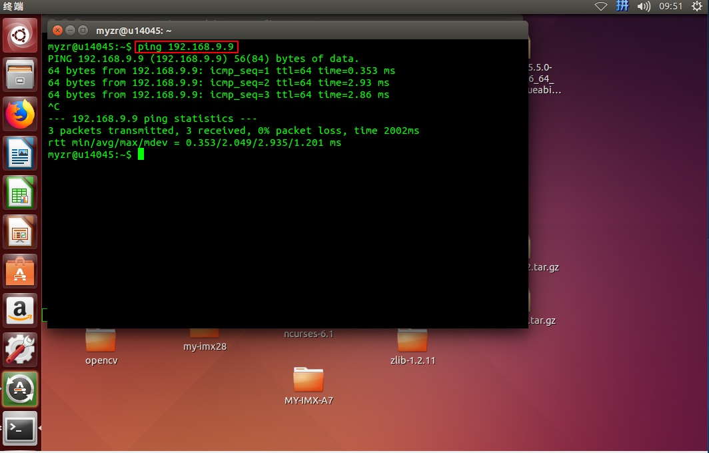

Importing Virtual Machine System
^^^^^^^^^^^^^^^^^^^^^^^^^^^^^^^^

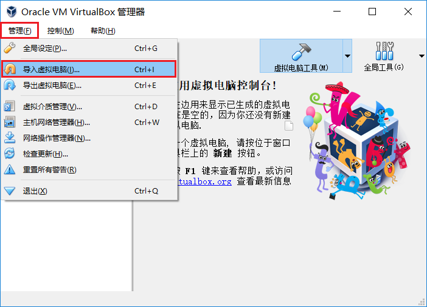
   
.. image:: ../../../image/MYZR-瑞芯微系列/MYZR-RK3562-EK200/导入虚拟机系统_02.png
   :alt: 导入虚拟机系统_02
   :width: 100%

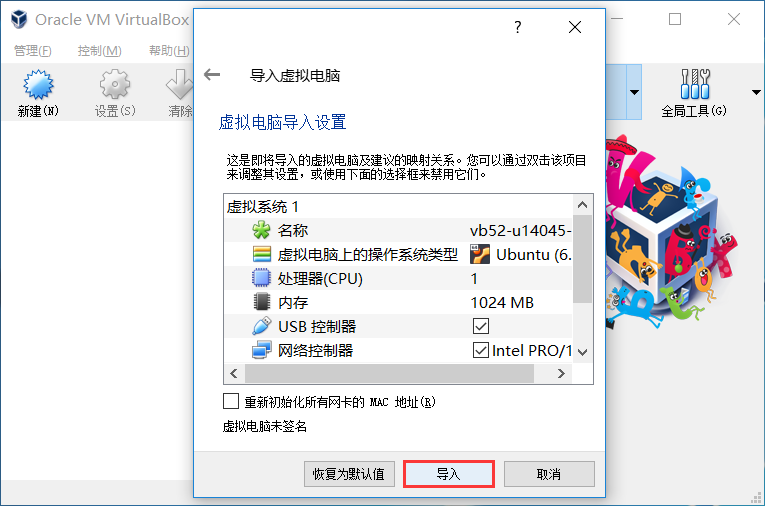

.. image:: ../../../image/MYZR-瑞芯微系列/MYZR-RK3562-EK200/导入虚拟机系统_04.png
   :alt: 导入虚拟机系统_04
   :width: 100%

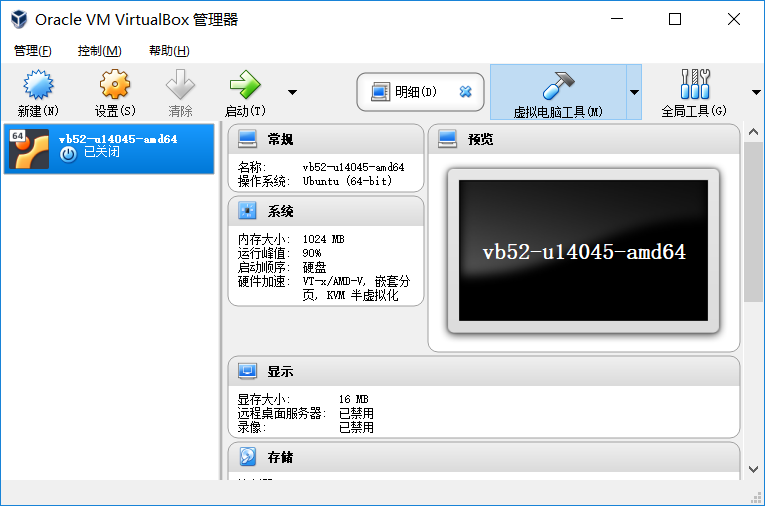

Virtual Machine Settings
~~~~~~~~~~~~~~~~~~~~~~~~

.. image:: ../../../image/MYZR-瑞芯微系列/MYZR-RK3562-EK200/虚拟机设置.png
   :alt: Virtual Machine Settings
   :width: 100%

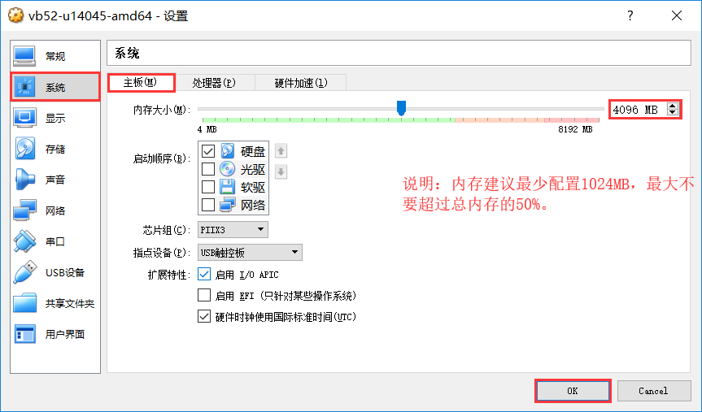

.. image:: ../../../image/MYZR-瑞芯微系列/MYZR-RK3562-EK200/虚拟机设置_03.png    
   :alt: 虚拟机设置_03
   :width: 100%

.. image:: ../../../image/MYZR-瑞芯微系列/MYZR-RK3562-EK200/虚拟机设置_04.png
   :alt: Virtual Machine Settings 04
   :width: 100%

.. image:: ../../../image/MYZR-瑞芯微系列/MYZR-RK3562-EK200/虚拟机设置_05.png
   :alt: Virtual Machine Settings 05
   :width: 100%

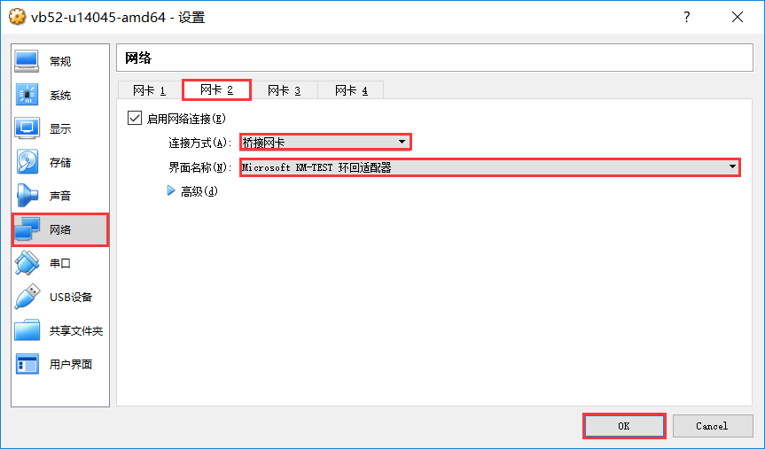

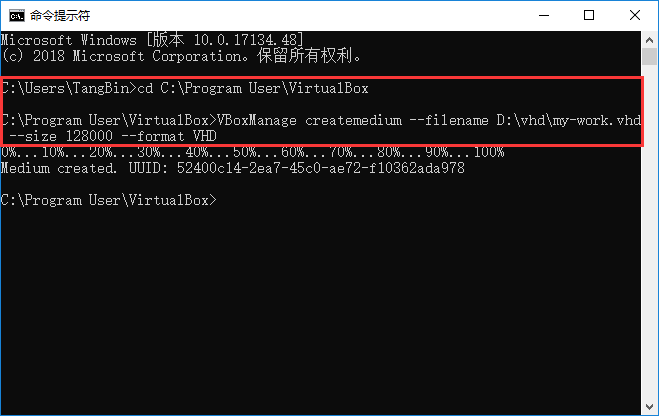

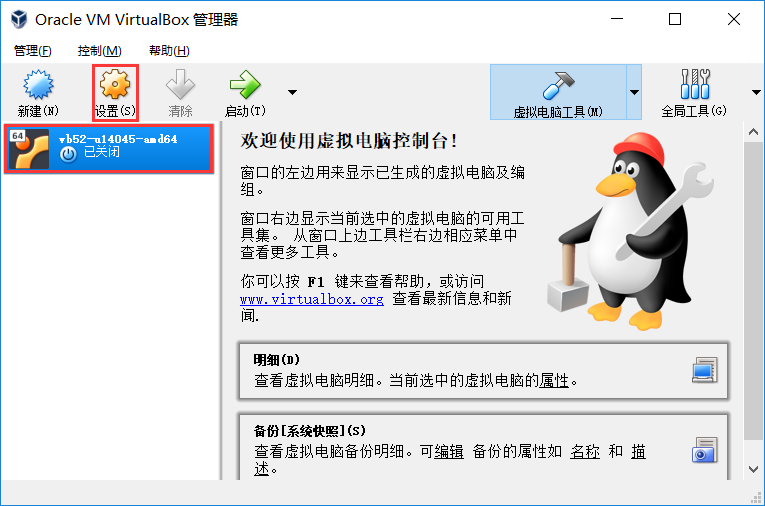

.. image:: ../../../image/MYZR-瑞芯微系列/MYZR-RK3562-EK200/虚拟机设置_09.png 
   :alt: Virtual Machine Settings 09
   :width: 100%

.. image:: ../../../image/MYZR-瑞芯微系列/MYZR-RK3562-EK200/虚拟机设置_10.png
   :alt: Virtual Machine Settings 10
   :width: 100%

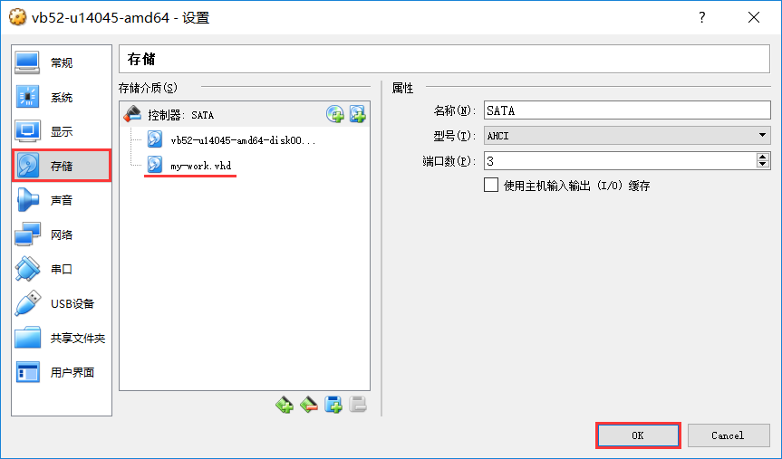

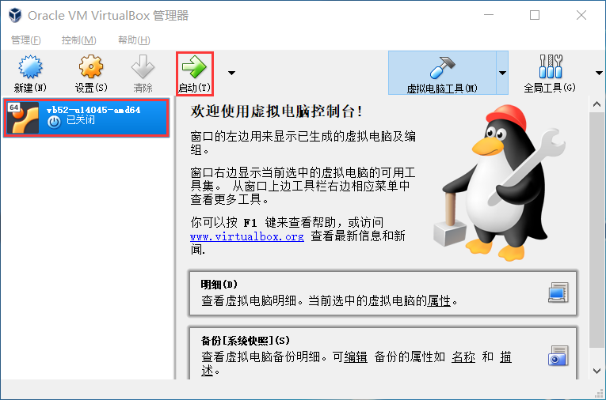

.. image:: ../../../image/MYZR-瑞芯微系列/MYZR-RK3562-EK200/虚拟机设置_13.png
   :alt: Virtual Machine Settings 13
   :width: 100%

.. image:: ../../../image/MYZR-瑞芯微系列/MYZR-RK3562-EK200/虚拟机设置_14.png
   :alt: Virtual Machine Settings 14
   :width: 100%

.. image:: ../../../image/MYZR-瑞芯微系列/MYZR-RK3562-EK200/虚拟机设置_15.png
   :alt: Virtual Machine Settings 15
   :width: 100%

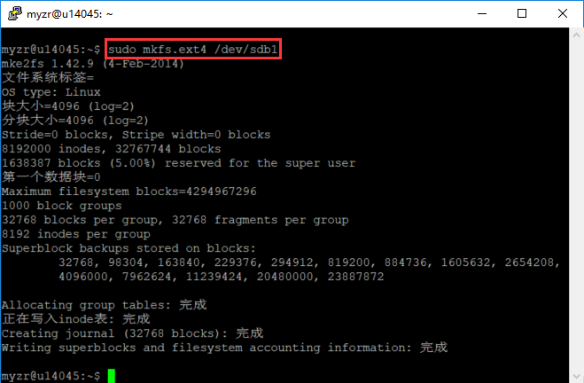

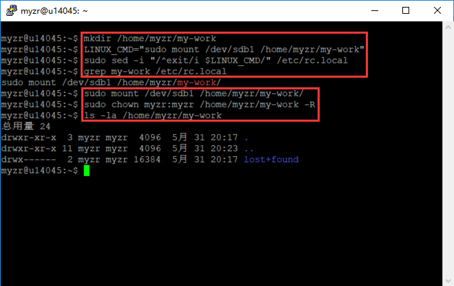

File Transfer Between Virtual Machine and PC
~~~~~~~~~~~~~~~~~~~~~~~~~~~~~~~~~~~~~~~~~~~~

Samba or SSH can be used for file transfer.

Samba setup as follows:

.. image:: ../../../image/MYZR-瑞芯微系列/MYZR-RK3562-EK200/虚拟机与PC互传文件.png
   :alt: File Transfer Between VM and PC
   :width: 100%

SSH setup as follows:

.. image:: ../../../image/MYZR-瑞芯微系列/MYZR-RK3562-EK200/虚拟机与PC互传文件_02.png
   :alt: File Transfer Between VM and PC 02
   :width: 100%

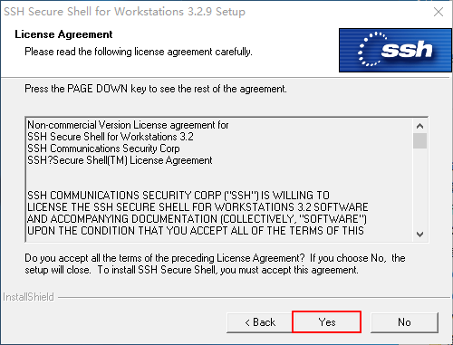

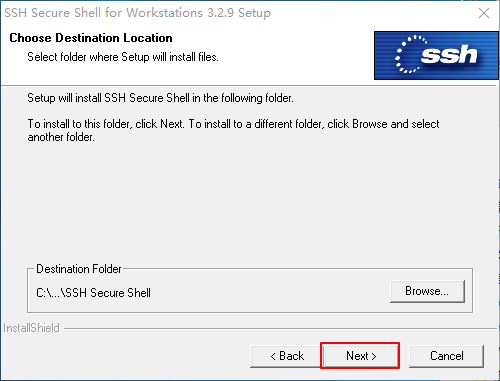

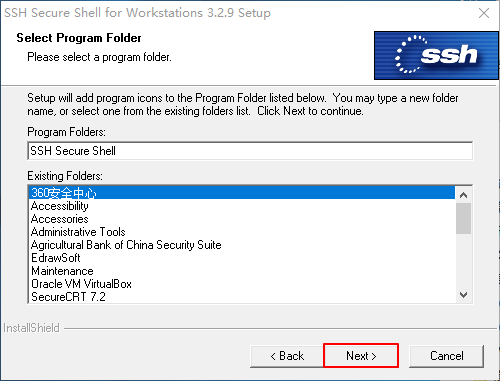

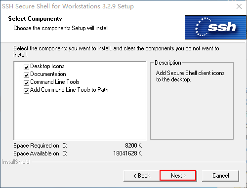

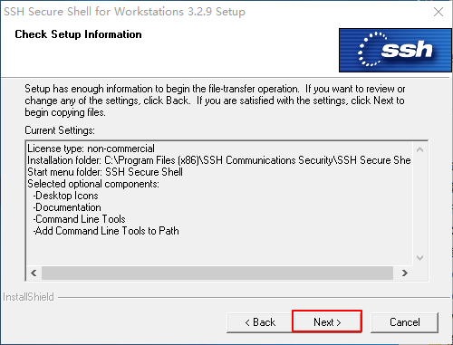

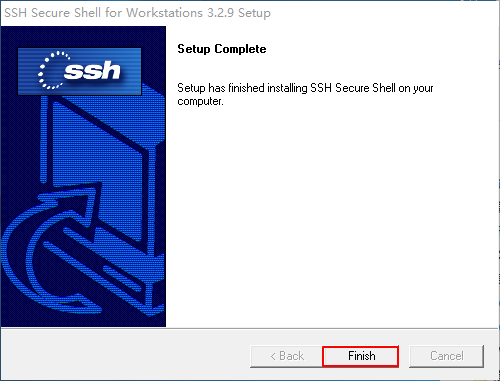

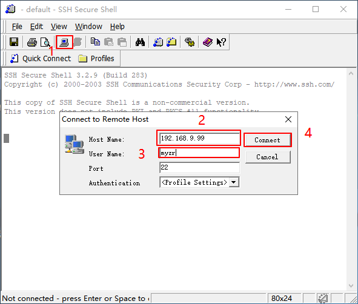

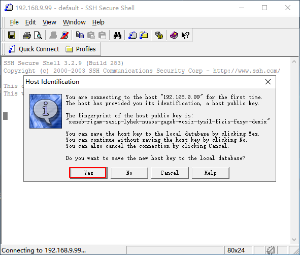

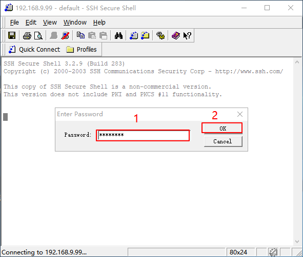

.. image:: ../../../image/MYZR-瑞芯微系列/MYZR-RK3562-EK200/虚拟机与PC互传文件_12.png
   :alt: File Transfer Between VM and PC 12
   :width: 100%

.. image:: ../../../image/MYZR-瑞芯微系列/MYZR-RK3562-EK200/虚拟机与PC互传文件_13.png
   :alt: File Transfer Between VM and PC 13
   :width: 100%

Virtual Machine Usage
~~~~~~~~~~~~~~~~~~~~~

User and Password
^^^^^^^^^^^^^^^^^

Default user: tangb, UserName: myzr, Password: myzr2012

Super user: root, UserName: root, Password: myzr2012

Linux Source Code Compilation
-----------------------------

Compilation Environment Requirements
~~~~~~~~~~~~~~~~~~~~~~~~~~~~~~~~~~~~

1. The compilation host must be in an Ubuntu system, and the version must be Ubuntu 20.04 or above. The author's host system is Ubuntu 20.04.

2. The host must be able to connect to the internet, as the compilation process requires downloading certain files.

Download Source Code Package
~~~~~~~~~~~~~~~~~~~~~~~~~~~~

1. Download the rk3562 source code package, path: 3. Software Materials --> 3.1 Source Code --> Linux --> myzr-rk3562.tar.gz.part_a*

2. Create a compilation directory:

.. code-block:: shell

   mkdir -p ~/my-work/RK3562/02_sources/

3. Place the source code in the newly created directory and perform merge extraction:

.. code-block:: shell

   #1. Enter the newly created directory
   cd ~/my-work/RK3562/
   
   #2. Merge split volumes
   cat myzr-rk3562.tar.gz.part_*>myzr-rk3562.tar.gz
   
   #3. Extract to the current directory
   tar-xzf myzr-rk3562.tar.gz

Dependency Installation
~~~~~~~~~~~~~~~~~~~~~~~

First-time compilation may require installing certain dependencies. The following are dependencies that the host may need to install:

.. code-block:: shell

   sudo apt-get install -y git ssh make gcc libssl-dev liblz4-tool expect expect-dev g++ patchelf 
   chrpath gawk texinfo chrpath diffstat binfmt-support qemu-user-static live-build bison flex 
   fakeroot rsync cmake gcc-multilib g++-multilib unzip device-tree-compiler ncurses-dev 
   libgucharmap-2-90-dev bzip2 expat gpgv2 cpp-aarch64-linux-gnu libgmp-dev libmpc-dev bc 
   python-is-python3 python2 libpkgconf-dev

SDK Configuration Loading
~~~~~~~~~~~~~~~~~~~~~~~~~

First-time compilation requires loading the SDK configuration file. Enter the rk3562_sdk directory and enter the following command to load the configuration file:

.. code-block:: shell

   ./build.sh myzr_rk3562_evb_defconfig
   cd buildroot/
   ./envsetup.sh rockchip_rk3562

Full Compilation
~~~~~~~~~~~~~~~~

1. Return to the SDK root directory and run the full compilation (compilation takes a long time). Enter the following command:

.. code-block:: shell

   #1. Select myzr_rk3562_defconfig board file
   wanglk@myzr-u2004-ec50:~/my-work/rockchip/rk3562-clean/rk3562$./build.sh lunch
   
   ###############RockchipLinuxSDK###############
   
   Manifest:rk3562_linux_release_v1.1.0_20231220.xml
   
   Logcolors:messagenoticewarningerrorfatal
   Logsavedat/home/wanglk/my-work/rockchip/rk3562-clean/rk3562/output/sessions/2026-03-19_20-42-09
   Pickadefconfig:
   
   1.rockchip_defconfig
   2.myzr_rk3562_defconfig
   3.rockchip_rk3562_dictpen_test3_v20_defconfig
   4.rockchip_rk3562_evb1_lp4x_v10_amp_defconfig
   5.rockchip_rk3562_evb1_lp4x_v10_defconfig
   6.rockchip_rk3562_evb2_ddr4_v10_amp_defconfig
   7.rockchip_rk3562_evb2_ddr4_v10_defconfig
   8.rockchip_rk3562_robot_evb1_lp4x_v10_defconfig
   9.rockchip_rk3562_robot_evb2_ddr4_v10_defconfig
   Whichwouldyoulike?[1]:2
   
   #2. Start full compilation
   ./build.sh

2. After successful compilation, the relevant images can be found in the rockdev/ directory, where update.img is the collection of all images.

Individual U-Boot Compilation
~~~~~~~~~~~~~~~~~~~~~~~~~~~~~

1. Before compilation, you can clear previously generated files.

.. code-block:: shell

   cd u-boot/
   make clean

2. Return to the SDK root directory and compile U-Boot individually.

.. code-block:: shell

   cd ../
   ./build.sh uboot

Individual Kernel Compilation
~~~~~~~~~~~~~~~~~~~~~~~~~~~~~

1. Before compilation, you can clear previously generated files.

.. code-block:: shell

   cd kernel/
   make clean

2. Return to the SDK root directory and compile the kernel individually.

.. code-block:: shell

   cd ../
   ./build.sh kernel

Individual Recovery Compilation
~~~~~~~~~~~~~~~~~~~~~~~~~~~~~~~

Enter the following command in the SDK root directory:

.. code-block:: shell

   ./build.sh recovery

Individual Buildroot Compilation
~~~~~~~~~~~~~~~~~~~~~~~~~~~~~~~~

Enter the following command in the SDK root directory:

.. code-block:: shell

   ./build.sh rootfs

Firmware Packaging
~~~~~~~~~~~~~~~~~~

Enter the following command in the SDK root directory:

.. code-block:: shell

   ./build.sh firmware

Packaging update.img
~~~~~~~~~~~~~~~~~~~~

1. Package the images in the output/update/Image directory under the SDK into update.img.

2. Enter the following command in the SDK root directory:

.. code-block:: shell

   ./build.sh updateimg

After completing the above operations, you can re-flash the device according to the flashing manual.

Android Source Code Compilation
-------------------------------

Compilation Environment Configuration
~~~~~~~~~~~~~~~~~~~~~~~~~~~~~~~~~~~~~

#. The compilation host must be in a Linux environment. The recommended host system is Ubuntu 20.04.

#. The host must be able to connect to the internet, as the compilation process requires downloading certain files.

Download Source Code Package
~~~~~~~~~~~~~~~~~~~~~~~~~~~~

#. In the cloud drive directory, download the source code package MYZR-RK3562_Android13_20260407.tar.bz2 (download and merge the split volume files from the cloud drive to obtain this compressed package).

#. Create a compilation directory:

.. code-block:: shell

   mkdir ~/my-work/rk3562/05_android -p

#. Place the source code in this directory and extract it:

.. code-block:: shell

   tar xvf MYZR-RK3562_Android13_20260407.tar.bz2  -C ~/my-work/rk3562/05_android/

Configure Compilation Environment
~~~~~~~~~~~~~~~~~~~~~~~~~~~~~~~~~

#. Each time you open a new terminal, you need to configure the environment.

#. Enter the RK3562_Android13.0_SDK directory.

#. Enter the following command to configure the Java environment:

.. code-block:: shell

   source javaenv.sh

#. Enter the following command to configure the compilation environment:

.. code-block:: shell

   source build/envsetup.sh

#. Enter the following command to configure the platform environment:

.. code-block:: shell

   lunch rk3562_t-userdebug

Full Compilation
~~~~~~~~~~~~~~~~

#. Full compilation compiles the entire Android system, including kernel, U-Boot, Android, and recovery.

#. Enter the following command:

.. code-block:: shell

   ./build.sh -AUCKu

#. Compilation time is long. Using a 16-thread host, it takes approximately 4 hours (for reference only!).

#. After successful compilation, the relevant images can be found in the rockdev/Image-rk3562_t/ directory, where update.img is the collection of all images.

Individual U-Boot Compilation
~~~~~~~~~~~~~~~~~~~~~~~~~~~~~

#. Before compilation, you can clear previously generated files.

.. code-block:: shell

   cd u-boot/
   make clean

#. Return to the SDK root directory and compile U-Boot individually.

.. code-block:: shell

   cd ../
   ./build.sh -U

Individual Kernel Compilation
~~~~~~~~~~~~~~~~~~~~~~~~~~~~~

#. Before compilation, you can clear previously generated files.

.. code-block:: shell

   cd kernel/
   make clean

#. Return to the SDK root directory and compile the kernel individually.

.. code-block:: shell

   cd kernel/
   make clean

Individual Android Compilation
~~~~~~~~~~~~~~~~~~~~~~~~~~~~~~

#. In the SDK root directory:

.. code-block:: shell

   ./build.sh -A

Packaging update.img
~~~~~~~~~~~~~~~~~~~~

#. Package the images in rockdev into update.img.

#. In the SDK root directory:

.. code-block:: shell

   ./build.sh -u

Development Guide
-----------------

Key file paths and their descriptions.

U-Boot Board-Level Files
~~~~~~~~~~~~~~~~~~~~~~~~

U-Boot board-level file location: u-boot/board/rockchip/myzr_rk3562

U-Boot board-level configuration file: include/configs/myzr_rk3562.h

U-Boot board-level compilation configuration file: configs/myzr_rk3562_defconfig

Linux Kernel Board-Level Files
~~~~~~~~~~~~~~~~~~~~~~~~~~~~~~

Kernel board-level compilation configuration file: kernel-5.10/arch/arm64/configs/rockchip_linux_defconfig

Kernel board-level device tree files:

1. kernel-5.10/arch/arm64/boot/dts/rockchip/myzr-rk3562-ek200.dts (default device tree, suitable for HDMI display)

2. kernel-5.10/arch/arm64/boot/dts/rockchip/myzr-rk3562-ek200-lvds-lcd.dtsi (backup, suitable for LVDS LCD display)

3. kernel-5.10/arch/arm64/boot/dts/rockchip/myzr-rk3562-ek200-mipi-lcd.dtsi (backup, suitable for MIPI LCD display)

Ethernet
~~~~~~~~

The development board has two Ethernet ports: CON8 and CON9. CON8 is used as an example, and CON9 follows the same approach.

Both Ethernet ports support internet connectivity.

#. DTS Configuration

1.1 Common Configuration

kernel-5.10/arch/arm64/boot/dts/rockchip/rk3562.dtsi

.. code-block:: dts

   gmac0: ethernet@ffa80000 {
       compatible = "rockchip,rk3562-gmac", "snps,dwmac-4.20a";
       reg = <0x0 0xffa80000 0x0 0x10000>;
       interrupts = <GIC_SPI 73 IRQ_TYPE_LEVEL_HIGH>,
                    <GIC_SPI 70 IRQ_TYPE_LEVEL_HIGH>;
       interrupt-names = "macirq", "eth_wake_irq";
       rockchip,grf = <&sys_grf>;
       rockchip,php_grf = <&ioc_grf>;
       clocks = <&cru CLK_GMAC_125M_CRU_I>, <&cru CLK_GMAC_50M_CRU_I>,
                <&cru PCLK_GMAC>, <&cru ACLK_GMAC>;
       clock-names = "stmmaceth", "clk_mac_ref",
                     "pclk_mac", "aclk_mac";
       resets = <&cru SRST_A_GMAC>;
       reset-names = "stmmaceth";
       rockchip,csu = <&csu CSU_GMAC_ACLK>, <&csu CSU_GMAC_PCLK>;
       rockchip,csu-names = "aclk", "pclk";
       snps,mixed-burst;
       snps,tso;
       snps,axi-config = <&gmac0_stmmac_axi_setup>;
       snps,mtl-rx-config = <&gmac0_mtl_rx_setup>;
       snps,mtl-tx-config = <&gmac0_mtl_tx_setup>;
       status = "disabled";
       mdio0: mdio {
           compatible = "snps,dwmac-mdio";
           #address-cells = <0x1>;
           #size-cells = <0x0>;
   };

1.2 Board-Level Configuration

kernel-5.10/arch/arm64/boot/dts/rockchip/myzr-rk3562-ek200.dts

.. code-block:: dts

   &gmac0 {
       snps,reset-gpio = <&gpio3 RK_PD0 GPIO_ACTIVE_LOW>;
       snps,reset-delays-us = <20000 20000 100000>;
       tx_delay = <0x38>;
       rx_delay = <0x1e>;
       pinctrl-0 = <&rgmiim0_miim
                   &rgmiim0_tx_bus2
                   &rgmiim0_rx_bus2
                   &rgmiim0_rgmii_clk
                   &rgmiim0_rgmii_bus>;
       phy-handle = <&rgmii_phy>;
   };

2. If the Ethernet port does not automatically obtain an IP address

Wait or disable sharing on the internet-capable network adapter in the computer's network settings, then re-enable sharing to the Ethernet adapter, and restart the board to automatically obtain an IP address.

GPIO
~~~~

1. GPIO Driver Architecture
^^^^^^^^^^^^^^^^^^^^^^^^^^^

The GPIO functionality of the RK3562 is implemented through a three-tier architecture: the hardware layer is directly managed by 5 sets of GPIO controllers (corresponding to device nodes gpiochip0~4) built into the chip, each managing 32 pins. The manufacturer has already provided the underlying register drivers. The kernel layer abstracts hardware differences through the Linux GPIO subsystem, providing standard APIs (such as the gpiod interface) to the upper layers, allowing kernel drivers to operate any pin in a unified manner (such as setting direction, reading/writing levels). The user layer leverages the Sysfs module (/sys/class/gpio) to export GPIO subsystem interfaces to user space, allowing direct control of pins via command line (export, direction configuration, level read/write) without writing code. In this entire mechanism, the hardware driver is provided by the chip manufacturer, the Linux kernel implements general abstraction, and developers can either program GPIO control based on kernel APIs or quickly debug through Sysfs.

This section explains how to directly control GPIO (direction/level) via the command line through the user layer.

2. Pin Naming Convention
^^^^^^^^^^^^^^^^^^^^^^^^

The GPIO of the RK3562 is divided into 5 groups (GPIO0~GPIO4), with each group further distinguished by A0~A7, B0~B7, C0~C7, D0~D7 as numbering. For example:

#. GPIO0_D0 represents the 0th pin of group D in GPIO group 0.

#. GPIO4_B5 represents the 5th pin of group B in GPIO group 4.

3. GPIO Pin Number Calculation Formula
^^^^^^^^^^^^^^^^^^^^^^^^^^^^^^^^^^^^^^

bank: GPIO group number (0~4).

group: Group internal sequence number corresponding to the letter (A=0, B=1, C=2, D=3).

X: Specific number within the group (0~7).

number: Internal group number, calculated using the following formula:

GPIO subgroup number calculation formula: number = group * 8 + X

GPIO pin number calculation formula: pin = bank * 32 + number

Below is a demonstration of the GPIO4_B5 pin number calculation method:

bank = 4 (GPIO4).

group = 1 (B group corresponds to 1).

X = 5 (the 5 in B5).

number = group * 8 + X = 1 * 8 + 5 = 13.

pin = bank * 32 + number = 4 * 32 + 13 = 141.

4. Controlling GPIO via the /sys/class/gpio Directory
^^^^^^^^^^^^^^^^^^^^^^^^^^^^^^^^^^^^^^^^^^^^^^^^^^^^^

In Linux, the most common way to read and write GPIO is using the GPIO sysfs interface, which is implemented by operating the export, unexport, gpio{N}/direction, gpio{N}/value files (replacing {N} with the actual pin number) under the /sys/class/gpio directory, and is often used in shell scripts.

echo 141 > /sys/class/gpio/export       # Enable pin GPIO4_B5

echo out > gpio141/direction              # Set pin as output mode

echo 1 > gpio141/value                     # Set pin to high level

cat /sys/class/gpio/gpio141/value        # Read the pin value

echo 141 > /sys/class/gpio/unexport   # Release GPIO

Note: Some GPIOs may not be exportable because they are multiplexed for other functions (such as UART, I2C). Their actual usage should be confirmed through the device tree.

PWM
~~~

1. PWM Hardware and Driver Framework
^^^^^^^^^^^^^^^^^^^^^^^^^^^^^^^^^^^^

On the RK3562 platform, the PWM hardware driver works through the collaboration of counters and comparators: the APB bus clock source is adjusted by a frequency divider to drive the counter to periodically increment/decrement, automatically resetting to generate the base signal when reaching the preset period value; the comparator compares the counter value with the duty cycle threshold in real time, outputting high/low levels, and switches between normal (active high) or inversed (active low) modes through the polarity control bit. The user layer controls through the /sys/class/pwm interface or kernel APIs (such as pwm_config). The core layer manages controller resources through pwm_chip and registers interfaces. The underlying hardware adaptation layer needs to implement the pwm_ops operation set (including config, enable, and other functions), directly operating PWM registers to complete frequency, duty cycle, and enable configuration.

2. PWM Device Tree Configuration
^^^^^^^^^^^^^^^^^^^^^^^^^^^^^^^^

Taking PWM14_M0 as an example, configure the clock and pins in the rk3562.dtsi file:

.. code-block:: dts

   pwm14: pwm@ff720020 {
           compatible = "rockchip,rk3562-pwm", "rockchip,rk3328-pwm";
           reg = <0x0 0xff720020 0x0 0x10>;
           interrupts = <GIC_SPI 26 IRQ_TYPE_LEVEL_HIGH>;
           #pwm-cells = <3>;
           pinctrl-names = "active";
           pinctrl-0 = <&pwm14m0_pins>;
           clocks = <&cru CLK_PWM3_PERI>, <&cru PCLK_PWM3_PERI>;
           clock-names = "pwm", "pclk";
           status = "disabled";
   };

Add the node in myzr-rk3562-ek200-lvds-lcd.dtsi:

.. code-block:: dts

   &pwm14 {
       status = "okay";
       pinctrl-names = "active";
       pinctrl-0 = <&pwm14m0_pins>;  // Ensure correct pin mux configuration
   };

Adding PWM client device node:

In the device node that needs to use PWM (such as backlight, etc.), reference the PWM controller and set parameters (if no device is needed, configuration is not required). The following is a general configuration example:

.. code-block:: dts

   // Example: Configure PWM14_M0 output to a device (e.g., backlight)
   / {
       pwm_dev: pwm-dev {
           compatible = "pwm-device";
           pwms = <&pwm14 0 10000000 1>; // Key parameter settings
           duty-cycle = <5000000>;    // 50% duty cycle
           pinctrl-names = "default";
           pinctrl-0 = <&pwm14m0_pins>;// Ensure consistency with controller configuration
       };
   };

Driver matching: compatible = "pwm-device" triggers the kernel PWM driver with the corresponding compatible. The driver matches the node through the of_device_id table and then calls the probe function to initialize the hardware.

PWM parameter passing: pwms = <&pwm14 0 10000000 1> binds channel 0 of the pwm14 controller, sets the period to 10ms (10000000ns, corresponding to 100Hz frequency), and polarity to 1 (active high). duty_ns = 5000000 specifies an initial duty cycle of 5ms (50% duty cycle). The driver writes to the hardware register through pwm_config().

Controller enable: &pwm14 { status="okay" } enables the PWM14 hardware controller inside the SoC. The underlying driver initializes its clock and reset signals, mapping the register physical address to the kernel virtual address.

The entire process directly passes hardware parameters to the driver through the device tree, achieving PWM waveform output (PWM is initialized and configured to a frequency of 100Hz, duty cycle of 50%, with reversed polarity).

3. Sysfs Interface PWM Operation
^^^^^^^^^^^^^^^^^^^^^^^^^^^^^^^^

#. Find the PWM controller path

Enter the command:

.. code-block:: text

   ls /sys/class/pwm  # Display all PWM controllers, e.g., pwmchip0, pwmchip1, etc.

The PWM controllers of the RK3562 are named pwmchip*. The specific number needs to be confirmed based on the address of &pwm14 in the device tree. It is assumed here that pwm14 corresponds to pwmchip3.

2. Export PWM channel

.. code-block:: text

   echo 0 > /sys/class/pwm/pwmchip3/export  # Export channel 0 of pwm14

After execution, the /sys/class/pwm/pwmchip3/pwm0 directory will be generated.

3. Configure period and duty cycle

Enter the command:

.. code-block:: text

   echo 10000000 > /sys/class/pwm/pwmchip3/pwm0/period     # Set 10ms period (100Hz)
   echo 5000000 > /sys/class/pwm/pwmchip3/pwm0/duty_cycle  # Set 5ms duty cycle (50%)
   echo 1 > /sys/class/pwm/pwmchip3/pwm0/enable            # Enable PWM output

The parameter unit is nanoseconds. Note that the duty cycle cannot exceed the period value.

Note: If export or enable fails, check whether the channel is occupied by other functions such as serial port.

4. Dynamically adjust duty cycle

.. code-block:: text

   echo 7000000 > /sys/class/pwm/pwmchip3/pwm0/duty_cycle  # Adjust to 70% duty cycle

I2C
~~~

1. I2C Subsystem Architecture Overview
^^^^^^^^^^^^^^^^^^^^^^^^^^^^^^^^^^^^^^

On the RK3562 platform, the I2C controller is implemented based on the standard Linux I2C framework. Its core is divided into the hardware abstraction layer (adapter driver) and device driver layer. The hardware layer abstracts the I2C bus controller through i2c_adapter, the device layer describes slave devices through i2c_client, and the two implement driver logic through i2c_driver. The I2C controller of the RK3562 supports multi-master mode, clock division (up to 400kHz), and interrupt/DMA transmission. Its physical layer follows the open-drain output characteristic, implementing SCL/SDA signals through GPIO multiplexing.

2. I2C Device Tree Configuration (Taking the gt911 touch chip mounted on I2C1 as an example)
^^^^^^^^^^^^^^^^^^^^^^^^^^^^^^^^^^^^^^^^^^^^^^^^^^^^^^^^^^^^^^^^^^^^^^^^^^^^^^^^^^^^^^^^^^^^^

Open myzr-rk3562-ek200-lvds-lcd.dts for configuration:

.. code-block:: dts

   &i2c1 {
           gt911@5d {
                   status = "okay";
                   compatible = "goodix,gt911";
                   reg = <0x5d>;
                   pinctrl-names = "default";
                   pinctrl-0 = <>911_int>;
                   interrupt-parent = <&gpio4>;
                   interrupts = <8 0>;
                   irq-gpios = <&gpio4 RK_PB0 0>;
                   reset-gpios = <&gpio3 RK_PB0 0>;
           };
   };

In this node, the kernel matches the driver through the compatible string. For example, the gt9xx.c driver code needs to define the same of_device_id table:

.. code-block:: dts

   static struct of_device_id goodix_ts_dt_ids[] = {
       { .compatible = "goodix,gt9xx" },
       { }
   };

The device's address on the I2C bus (0x14), the driver obtains the reg address through the i2c_client structure. The pinctrl-* references the touch_gpio node to configure the GPIO multiplexing function and electrical attributes.

Driver and device tree matching: When the compatible value matches the driver, the kernel calls the .probe() function. In the probe function, the driver will obtain configuration from the device tree, including pin configuration, chip model, and other information.

When the device is successfully registered on I2C, use the command:

.. code-block:: shell

   i2cdetect -y 1

You can see the letter "UU" appear at address 5d on i2c1, indicating that the device is successfully mounted on I2C.

SPI
~~~

1. Linux SPI Framework Overview
^^^^^^^^^^^^^^^^^^^^^^^^^^^^^^^

The Linux SPI framework provides a standardized SPI device driver support system for the kernel. Its core consists of the SPI Core, controller driver layer, device abstraction layer, and user space interface. The SPI Core serves as the framework hub, handling bus management, device registration, and standard transfer API maintenance, achieving dynamic binding of controllers and slave devices through spi_alloc_device() and spi_add_device(). Hardware-related SPI controller drivers need to implement low-level operations such as clock configuration and data transfer, with each controller corresponding to a struct spi_controller instance. Connected slave devices are described by the struct spi_device structure, containing parameters such as device address, chip select, and communication mode. The core data transfer mechanism triggers the controller-implemented transfer callback function through synchronous/asynchronous interfaces such as spi_sync(), supporting both DMA and interrupt transfer modes. The framework also exposes the SPI interface to user space through the /dev/spidev* device node, enabling hardware register operations from the application layer.

2. SPI Device Tree Configuration (Taking SPI0_M0 as an example, mosi and miso on the J9 expansion interface correspond to pins 17 and 19)
^^^^^^^^^^^^^^^^^^^^^^^^^^^^^^^^^^^^^^^^^^^^^^^^^^^^^^^^^^^^^^^^^^^^^^^^^^^^^^^^^^^^^^^^^^^^^^^^^^^^^^^^^^^^^^^^^^^^^^^^^^^^^^^^^^^^^^^^

.. code-block:: dts

   &spi0 {
     status = "okay";
     pinctrl-names = "default";
     pinctrl-0 = <&spi0m0_pins>; // Specify M0 mode pin group
     #address-cells = <1>;
     #size-cells = <0>;
   
     spidev@0{
         compatible = "spidev";
         reg = <0>;
         spi-max-frequency = <10000000>;// Maximum frequency 10MHz
     };
   };

The kernel parses this node during boot, calling the driver code in drivers/spi/spi-rockchip.c to initialize the SPI0 controller, registering it as /sys/bus/spi/devices/spi0.0. SPI devices are addressed by the Chip Select (CS) signal. #address-cells=1 indicates that the reg attribute corresponds to the CS number (e.g., reg=<0> means using the CS0 line of SPI0). When generating the SPI device, the kernel controls the corresponding GPIO pin to output a low level based on the reg value to activate the target device.

After successful matching of compatible="spidev", the kernel will load drivers/spi/spidev.c and create the device node /dev/spidev0.0. User-space programs can directly initiate SPI data transfer requests through system calls such as ioctl(SPI_IOC_MESSAGE) or write() without developing kernel drivers. After the request is received by the spidev driver, the kernel submits the data transfer task to the SPI controller driver (such as the SPI0 controller) through the spi_async() interface. Finally, the hardware controller generates the SCK signal based on the configured clock polarity, rate, and other parameters, sends the data stream through the MOSI pin, and synchronously reads the response data from the MISO pin, completing the full-duplex communication process.

3. Debugging Tool
^^^^^^^^^^^^^^^^^

Short the mosi and miso of SPI0_M0, and run the SPI test program in the file system:

.. code-block:: shell

   =====> Input:
   ./test_app/spidev_test -D /dev/spidev0.0
   =====> Output:
   spi mode: 0
   bits per word: 8
   max speed: 500000 Hz (500 KHz)
    
   FF FF FF FF FF FF
   40 00 00 00 00 95
   FF FF FF FF FF FF
   FF FF FF FF FF FF
   FF FF FF FF FF FF
   DE AD BE EF BA AD
   F0 0D

This indicates that SPI functionality is normal.

UART
~~~~

1. Device Tree Configuration (Taking UART6_M0 as an example, corresponding to pins 7 and 9 on the J8 expansion interface)
^^^^^^^^^^^^^^^^^^^^^^^^^^^^^^^^^^^^^^^^^^^^^^^^^^^^^^^^^^^^^^^^^^^^^^^^^^^^^^^^^^^^^^^^^^^^^^^^^^^^^^^^^^^^^^^^^^^^^^^^^

.. code-block:: dts

   &uart6 {
       status ="okay";
       pinctrl-name = "default";
       pinctrl-0 = <&uart6m0_xfer>;
   };

The role of pinctrl-0 = <&uart6m0_xfer> is to bind the TX/RX pins of UART6 to the uart6m0_xfer multiplexing group.

uart6m0_xfer is already defined in rk3562-pinctrl.dtsi:

.. code-block:: text

   uart6m0_xfer: uart6m0-xfer {
           rockchip,pins =
                   /* uart6_rx_m0 */
                   <0 RK_PC7 1 &pcfg_pull_up>,
                 /* uart6_tx_m0 */
                   <0 RK_PC6 1 &pcfg_pull_up>;
   };

After the device tree is configured, UART6 is registered as /dev/ttyS6 in the system, which can be verified with ls /dev/ttyS*.

2. Debugging Tool
^^^^^^^^^^^^^^^^^

Short the RX and TX of uart6m0, and use the test file placed in the /test_app directory of the file system for send/receive testing:

.. code-block:: shell

   =====> Input:
   # ./test_app/serial_test.out /dev/ttyS6 "myzr"
   =====> Output:
   Starting send data...finish
   Starting receive data:
   ASCII: 0x6d          Character: m 
   ASCII: 0x79          Character: y 
   ASCII: 0x7a          Character: z 
   ASCII: 0x72          Character: r 
   ASCII: 0x0           Character: