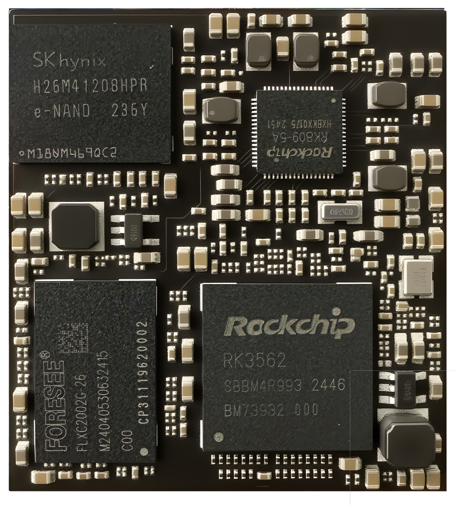
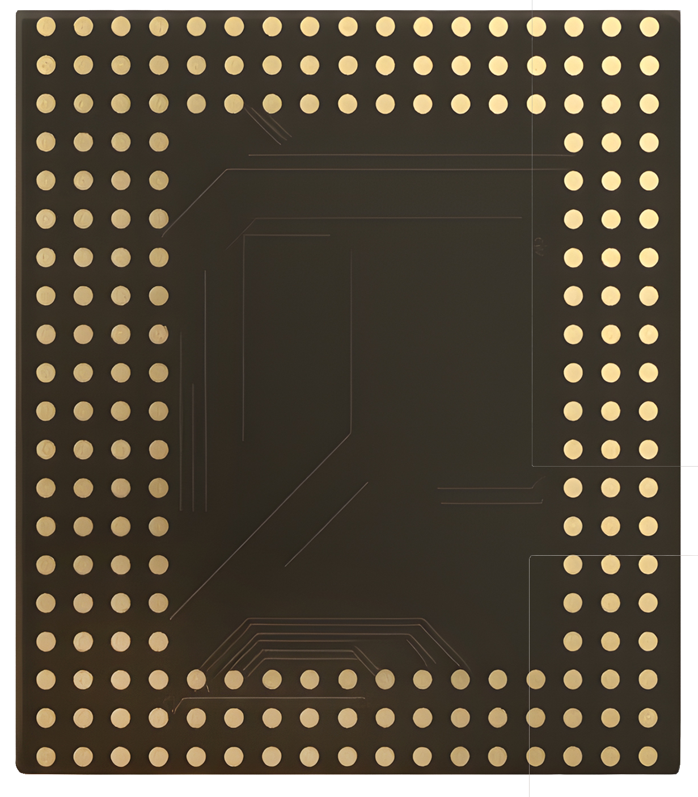
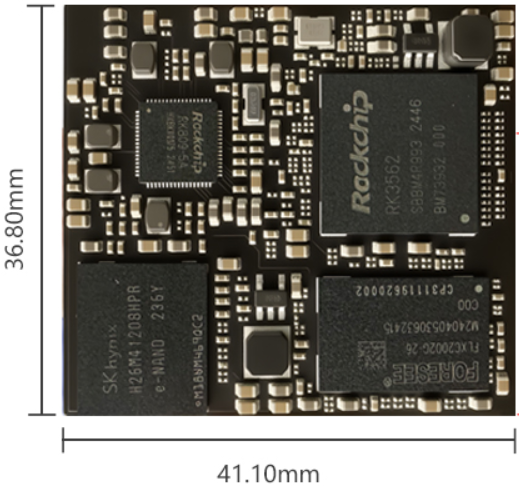
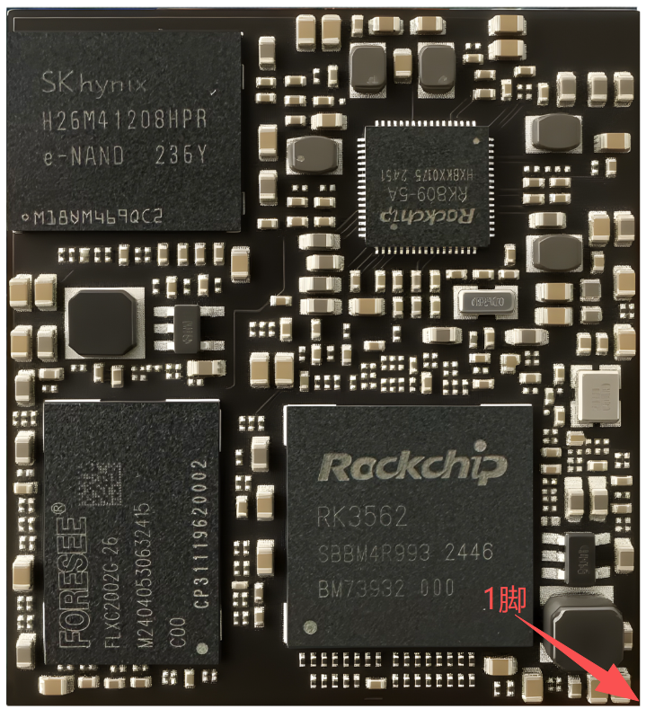
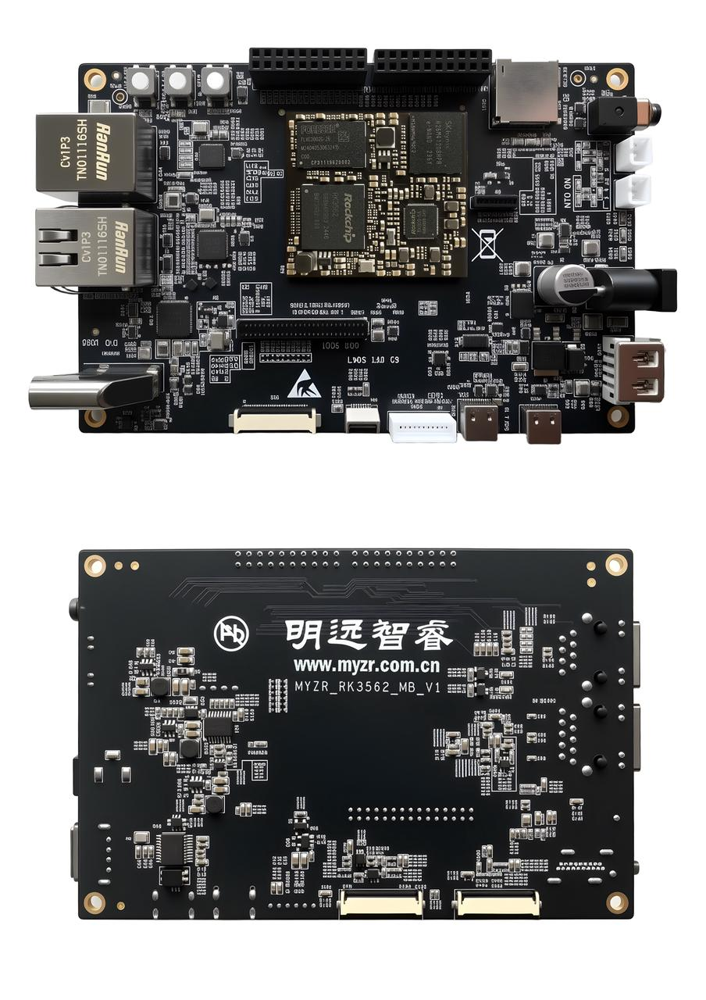
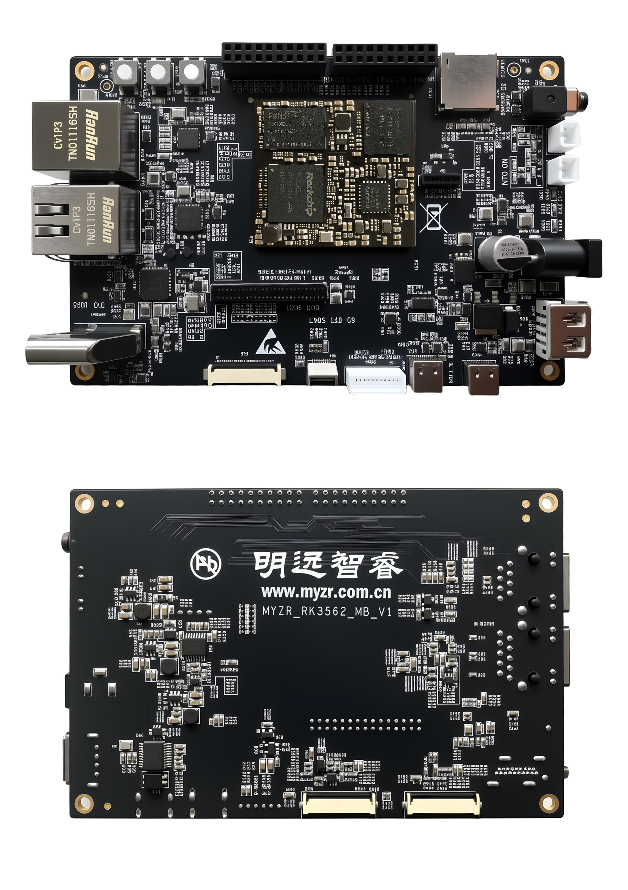
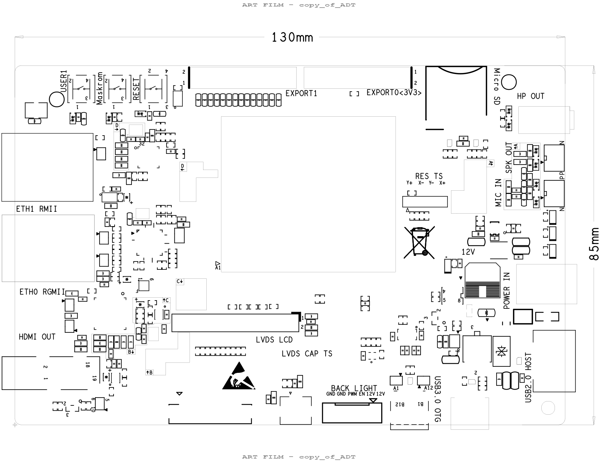
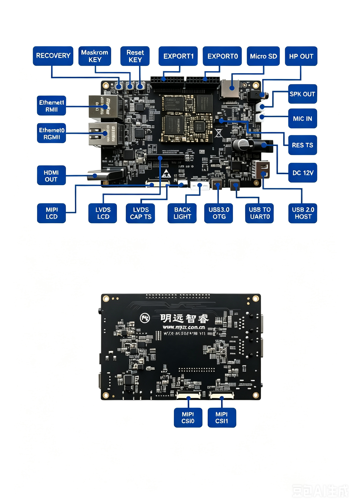

.. raw:: html

   

产品介绍
========

核心板介绍
----------

硬件资源
~~~~~~~~

MYZR-RK3562核心板集成RK3562处理器、DDR存储、电源管理、时钟及高速接口电路，可快速嵌入终端产品设计。

处理器内部集成：

* RK3562处理器

* LPDDR4X内存

* SPI NAND Flash

* PMIC电源管理

* 千兆网络接口

* USB3.0 OTG

* MIPI显示接口

* MIPI摄像头接口

核心板规格
----------

* 规格参数（应包括温度参数、支持的系统版本）

.. raw:: html

   

+------------+----------+----------------------+
| 核心板规格                                   |
+============+==========+======================+
| 1          | 型号     | MYZR-RK3562-LB200    |
+------------+----------+----------------------+
| 2          | 尺寸     | 36mm × 41mm          |
+------------+----------+----------------------+
| 3          | PCB      | 10 层                |
+------------+----------+----------------------+
| 4          | 内存     | 2/4/8GByte LPDDR4X   |
+------------+----------+----------------------+
| 5          | 存储     | 8/16/32/64GByte eMMC |
+------------+----------+----------------------+
| 6          | 启动方式 | 上电启动             |
+------------+----------+----------------------+

核心板正反图
~~~~~~~~~~~~

.. raw:: html

   

   

**核心板正面图**

.. raw:: html

   

   

**核心板背面图**

核心板尺寸图
~~~~~~~~~~~~

命名规则及可选配置
~~~~~~~~~~~~~~~~~~~~~~~~

.. raw:: html

   

+-------------------+-------------------------------------+-------------------+--------------+--------------+
| 核心板型号        | 命名规则                                                                              |
+===================+=====================================+===================+==============+==============+
| MYZR-RK3562-LB200 | MYZR                                | RK3562            | LB/EK        | 200          |
+                   +-------------------------------------+-------------------+--------------+--------------+
|                   | 明远智睿                            | MPU主控型号       | LB【核心板】 | 核心板引脚数 |
+                   +-------------------------------------+-------------------+--------------+--------------+
|                   |                                     | RK3562【商业级】  | EK【开发板】 |              |
+                   +-------------------------------------+-------------------+--------------+--------------+
|                   |                                     | RK3562J【商业级】 |              |              |
+                   +-------------------------------------+-------------------+--------------+--------------+
|                   | 可选配置                                                                              |
+                   +-------------------------------------+-------------------+--------------+--------------+
|                   | 内存：2/4/8GByte LPDDR4X                                                              |
+                   +-------------------------------------+-------------------+--------------+--------------+
|                   | 存储：8/16/32/64GByte eMMC                                                            |
+                   +-------------------------------------+-------------------+--------------+--------------+
|                   | 例：核心板 MYZR-RK3562-LB200-8G-32G                                                   |
+-------------------+-------------------------------------+-------------------+--------------+--------------+

供电模式
~~~~~~~~

.. raw:: html

   

+----------+----------+------+------+------+------+----------+
| 功能     | 引脚标号 | 规格                      | 说明     |
+          |          +------+------+------+------+          +
|          |          | 最小 | 典型 | 最大 | 单位 |          |
+==========+==========+======+======+======+======+==========+
| 电源供电 | J15      | 11.8 | 12   | 12.2 | V    | 底板供电 |
+----------+----------+------+------+------+------+----------+

工作环境
~~~~~~~~

.. raw:: html

   

+--------+------+------+------+------+------------------------+
| 参数   | 规格                      | 说明                   |
+        +------+------+------+------+                        +
|        | 最小 | 典型 | 最大 | 单位 |                        |
+========+======+======+======+======+========================+
| 商业级 | 0℃   | 25   | 80℃  | ℃    | 实测 0 至 80℃运行正常  |
+--------+------+------+------+------+------------------------+
| 工业级 | -40℃ | 25   | 85℃  | ℃    | 实测-40 至 85℃运行正常 |
+--------+------+------+------+------+------------------------+

启动配置
~~~~~~~~

支持：

#. EMMC启动

#. SD卡启动

#. USB烧录模式

是否支持快启动及快启时间
~~~~~~~~~~~~~~~~~~~~~~~~

.. raw:: html

   

+-------------------+----------+------+
| 项目              | 支持情况 | 时间 |
+===================+==========+======+
| MYZR-RK3562-EK200 | 无       |      |
+-------------------+----------+------+

开发板功耗
~~~~~~~~~~

.. raw:: html

   

+------------------------------------------+----------+------+----------+
| 类型                                     | 测试项目                   |
+                                          +----------+------+----------+
|                                          | 待机功耗        | 满载功耗 |
+==========================================+==========+======+==========+
| MYZR-RK3562-EK200(带底板)                | 520mA           | 740mA    |
+------------------------------------------+----------+------+----------+
| 注：上面数值为电流值（mA），电压为5.0V满载为全核跑满                  |
+------------------------------------------+----------+------+----------+

核心板贴片/安装示意图
~~~~~~~~~~~~~~~~~~~~~

信号定义
--------

.. raw:: html

   

+---------+----------+---------------+----------------------------------------------+----------+
| Pin NO. | Pin Name | CPU Ball Name | 功能描述                                     | 管脚电压 |
+=========+==========+===============+==============================================+==========+
| 1       | A1       | AG3           | MIPI\_CSI\_RX1\_D1N                          |          |
+---------+----------+---------------+----------------------------------------------+----------+
| 2       | A2       | AG5           | MIPI\_CSI\_RX0\_D3N                          |          |
+---------+----------+---------------+----------------------------------------------+----------+
| 3       | A3       | AF6           | MIPI\_CSI\_RX0\_D2P                          |          |
+---------+----------+---------------+----------------------------------------------+----------+
| 4       | A4       | AF7           | MIPI\_CSI\_RX0\_CLK0P                        |          |
+---------+----------+---------------+----------------------------------------------+----------+
| 5       | A5       | AG8           | MIPI\_CSI\_RX0\_D1N                          |          |
+---------+----------+---------------+----------------------------------------------+----------+
| 6       | A6       | AF8           | MIPI\_CSI\_RX0\_D1P                          |          |
+---------+----------+---------------+----------------------------------------------+----------+
| 7       | A7       | AG10          | MIPI\_DSI\_TX\_D3P/LVDS\_TX\_D3P             |          |
+---------+----------+---------------+----------------------------------------------+----------+
| 8       | A8       | AF10          | MIPI\_DSI\_TX\_D3N/LVDS\_TX\_D3N             |          |
+---------+----------+---------------+----------------------------------------------+----------+
| 9       | A9       | 1P3           | MIPI\_CSI\_RX1\_CLK1P                        |          |
+---------+----------+---------------+----------------------------------------------+----------+
| 10      | A10      | 1R3           | MIPI\_CSI\_RX1\_CLK1N                        |          |
+---------+----------+---------------+----------------------------------------------+----------+
| 11      | A11      | 1R7           | MIPI\_CSI\_RX0\_CLK1N                        |          |
+---------+----------+---------------+----------------------------------------------+----------+
| 12      | A12      | 1P7           | MIPI\_CSI\_RX0\_CLK1P                        |          |
+---------+----------+---------------+----------------------------------------------+----------+
| 13      | A13      | 1M2           | PCIE20\_PERSTN\_M1 │ -- │ PDM\_SDI1\_M0 │ I2 | 3V3      |
|         |          |               | S0\_SDI1\_M0 │ I2S0\_SDO3\_M0 │ GPIO3\_B0\_d |          |
+---------+----------+---------------+----------------------------------------------+----------+
| 14      | A14      | AE15          | I2C2\_SDA\_M0                                | 3V3      |
+---------+----------+---------------+----------------------------------------------+----------+
| 15      | A15      | AF20          | UART0\_RX\_M0/Debug                          | 3V3      |
+---------+----------+---------------+----------------------------------------------+----------+
| 16      | A16      | AE19          | UART6\_RX\_M0/CAN0\_RX\_M2/GPIO0\_C7\_d      | 3V3      |
+---------+----------+---------------+----------------------------------------------+----------+
| 17      | A17      | AF21          | GPIO0\_B0\_d/USB-DRVVBUS                     | 3V3      |
+---------+----------+---------------+----------------------------------------------+----------+
| 18      | A18      | AE22          | RTCIC\_INT\_L                                | 3V3      |
+---------+----------+---------------+----------------------------------------------+----------+
| 19      | A19      | AG17          | SPI0\_CSN0\_M0                               | 3V3      |
+---------+----------+---------------+----------------------------------------------+----------+
| 20      | A20      | AF18          | I2C1\_SDA\_M0                                | 3V3      |
+---------+----------+---------------+----------------------------------------------+----------+
| 21      | B1       | AF3           | MIPI\_CSI\_RX1\_D1P                          |          |
+---------+----------+---------------+----------------------------------------------+----------+
| 22      | B2       | AF5           | MIPI\_CSI\_RX0\_D3P                          |          |
+---------+----------+---------------+----------------------------------------------+----------+
| 23      | B3       | AG6           | MIPI\_CSI\_RX0\_D2N                          |          |
+---------+----------+---------------+----------------------------------------------+----------+
| 24      | B4       | AG7           | MIPI\_CSI\_RX0\_CLK0N                        |          |
+---------+----------+---------------+----------------------------------------------+----------+
| 25      | B5       | AG9           | MIPI\_CSI\_RX0\_D0N                          |          |
+---------+----------+---------------+----------------------------------------------+----------+
| 26      | B6       | AF9           | MIPI\_CSI\_RX0\_D0P                          |          |
+---------+----------+---------------+----------------------------------------------+----------+
| 27      | B7       | AG12          | MIPI\_DSI\_TX\_CLKP/LVDS\_TX\_CLKP           |          |
+---------+----------+---------------+----------------------------------------------+----------+
| 28      | B8       | AF12          | MIPI\_DSI\_TX\_CLKN/LVDS\_TX\_CLKN           |          |
+---------+----------+---------------+----------------------------------------------+----------+
| 29      | B9       | AG11          | MIPI\_DSI\_TX\_D2N/LVDS\_TX\_D2N             |          |
+---------+----------+---------------+----------------------------------------------+----------+
| 30      | B10      | AF11          | MIPI\_DSI\_TX\_D2P/LVDS\_TX\_D2P             |          |
+---------+----------+---------------+----------------------------------------------+----------+
| 31      | B11      | AF14          | MIPI\_DSI\_TX\_D0N/LVDS\_TX\_D0N             |          |
+---------+----------+---------------+----------------------------------------------+----------+
| 32      | B12      | AG14          | MIPI\_DSI\_TX\_D0P/LVDS\_TX\_D0P             |          |
+---------+----------+---------------+----------------------------------------------+----------+
| 33      | B13      | AE18          | SPI0\_MISO\_M0/                              | 3V3      |
+---------+----------+---------------+----------------------------------------------+----------+
| 34      | B14      | AF16          | I2C2\_SCL\_M0/                               | 3V3      |
+---------+----------+---------------+----------------------------------------------+----------+
| 35      | B15      | AF19          | UART6\_TX\_M0/CAN0\_TX\_M2/GPIO0\_C6\_d      | 3V3      |
+---------+----------+---------------+----------------------------------------------+----------+
| 36      | B16      | AE20          | UART0\_TX\_M0/Debug                          | 3V3      |
+---------+----------+---------------+----------------------------------------------+----------+
| 37      | B17      | AG24          | USBCC\_INT\_L                                | 3V3      |
+---------+----------+---------------+----------------------------------------------+----------+
| 38      | B18      | AE24          | GPIO0\_A0\_d/MIPI\_LCD\_RST                  | 3V3      |
+---------+----------+---------------+----------------------------------------------+----------+
| 39      | B19      | AE17          | I2C1\_SCL\_M0                                | 3V3      |
+---------+----------+---------------+----------------------------------------------+----------+
| 40      | B20      | AG19          | SPI0\_MOSI\_M0                               | 3V3      |
+---------+----------+---------------+----------------------------------------------+----------+
| 41      | C1       |               | GND                                          |          |
+---------+----------+---------------+----------------------------------------------+----------+
| 42      | C2       |               | GND                                          |          |
+---------+----------+---------------+----------------------------------------------+----------+
| 43      | C3       |               | GND                                          |          |
+---------+----------+---------------+----------------------------------------------+----------+
| 44      | C4       |               | GND                                          |          |
+---------+----------+---------------+----------------------------------------------+----------+
| 45      | C5       |               | GND                                          |          |
+---------+----------+---------------+----------------------------------------------+----------+
| 46      | C6       |               | GND                                          |          |
+---------+----------+---------------+----------------------------------------------+----------+
| 47      | C7       |               | GND                                          |          |
+---------+----------+---------------+----------------------------------------------+----------+
| 48      | C8       |               | GND                                          |          |
+---------+----------+---------------+----------------------------------------------+----------+
| 49      | C9       |               | GND                                          |          |
+---------+----------+---------------+----------------------------------------------+----------+
| 50      | C10      |               | GND                                          |          |
+---------+----------+---------------+----------------------------------------------+----------+
| 51      | C11      |               |                                              |          |
+---------+----------+---------------+----------------------------------------------+----------+
| 52      | C12      |               |                                              |          |
+---------+----------+---------------+----------------------------------------------+----------+
| 53      | C13      |               | GND                                          |          |
+---------+----------+---------------+----------------------------------------------+----------+
| 54      | C14      |               | GND                                          |          |
+---------+----------+---------------+----------------------------------------------+----------+
| 55      | C15      |               | GND                                          |          |
+---------+----------+---------------+----------------------------------------------+----------+
| 56      | C16      |               | GND                                          |          |
+---------+----------+---------------+----------------------------------------------+----------+
| 57      | C17      | 1P14          | USB30\_OTG0\_VBUSDET                         | 3V3      |
+---------+----------+---------------+----------------------------------------------+----------+
| 58      | C18      | 1P15          | USB30\_OTG0\_ID                              | 1V8      |
+---------+----------+---------------+----------------------------------------------+----------+
| 59      | C19      | AE16          | SPI0\_CLK\_M0                                | 3V3      |
+---------+----------+---------------+----------------------------------------------+----------+
| 60      | C20      | AF17          | UART2\_TX\_M0/PWM7\_M0/GPU\_AVS/CAN1\_TX\_M1 | 3V3      |
|         |          |               | /GPIO0\_C                                    |          |
+---------+----------+---------------+----------------------------------------------+----------+
| 61      | D1       | AF2           | MIPI\_CSI\_RX1\_CLK0P                        |          |
+---------+----------+---------------+----------------------------------------------+----------+
| 62      | D2       | AG2           | MIPI\_CSI\_RX1\_CLK0N                        |          |
+---------+----------+---------------+----------------------------------------------+----------+
| 63      | D3       | AG4           | MIPI\_CSI\_RX1\_D0N                          |          |
+---------+----------+---------------+----------------------------------------------+----------+
| 64      | D4       | AF4           | MIPI\_CSI\_RX1\_D0P                          |          |
+---------+----------+---------------+----------------------------------------------+----------+
| 65      | D5       | AF13          | MIPI\_DSI\_TX\_D1P/LVDS\_TX\_D1P             |          |
+---------+----------+---------------+----------------------------------------------+----------+
| 66      | D6       | AG13          | MIPI\_DSI\_TX\_D1N/LVDS\_TX\_D1N             |          |
+---------+----------+---------------+----------------------------------------------+----------+
| 67      | D7       | 1R11          | UART2\_RX\_M0/PWM6\_M0/CAN1\_RX\_M1/GPIO0\_C | 3V3      |
|         |          |               | 1\_d                                         |          |
+---------+----------+---------------+----------------------------------------------+----------+
| 68      | D8       | 1R15          | SDMMC0\_DET\_L                               | 3V3      |
+---------+----------+---------------+----------------------------------------------+----------+
| 69      | D9       | AC27          | PCIE20\_REFCLKN                              |          |
+---------+----------+---------------+----------------------------------------------+----------+
| 70      | D10      | AC26          | PCIE20\_REFCLKP                              |          |
+---------+----------+---------------+----------------------------------------------+----------+
| 71      | D11      | AB27          | USB30\_OTG0\_SSRXN                           |          |
+---------+----------+---------------+----------------------------------------------+----------+
| 72      | D12      | AB26          | USB30\_OTG0\_SSRXP                           |          |
+---------+----------+---------------+----------------------------------------------+----------+
| 73      | D13      | AD26          | USB30\_OTG0\_SSTXP                           |          |
+---------+----------+---------------+----------------------------------------------+----------+
| 74      | D14      | AD27          | USB30\_OTG0\_SSTXN                           |          |
+---------+----------+---------------+----------------------------------------------+----------+
| 75      | D15      | AF26          | USB30\_OTG0\_DM                              |          |
+---------+----------+---------------+----------------------------------------------+----------+
| 76      | D16      | AF27          | USB30\_OTG0\_DP                              |          |
+---------+----------+---------------+----------------------------------------------+----------+
| 77      | D17      | AE27          | USB20\_HOST1\_DP                             |          |
+---------+----------+---------------+----------------------------------------------+----------+
| 78      | D18      | AE26          | USB20\_HOST1\_DM                             |          |
+---------+----------+---------------+----------------------------------------------+----------+
| 79      | D19      |               | GND                                          |          |
+---------+----------+---------------+----------------------------------------------+----------+
| 80      | D20      | AF15          | PWM4\_M0/CSI                                 | 3V3      |
+---------+----------+---------------+----------------------------------------------+----------+
| 81      | E1       | AE1           | MIPI\_CSI\_RX1\_D2P                          |          |
+---------+----------+---------------+----------------------------------------------+----------+
| 82      | E2       | AD1           | MIPI\_CSI\_RX1\_D3P                          |          |
+---------+----------+---------------+----------------------------------------------+----------+
| 83      | E3       |               | GND                                          |          |
+---------+----------+---------------+----------------------------------------------+----------+
| 84      | E18      | AG23          | I2C0\_SCL/PU                                 | 3V3      |
+---------+----------+---------------+----------------------------------------------+----------+
| 85      | E19      | AE23          | I2C0\_SDA/PU                                 | 3V3      |
+---------+----------+---------------+----------------------------------------------+----------+
| 86      | E20      |               | RK809\_MIC1n                                 |          |
+---------+----------+---------------+----------------------------------------------+----------+
| 87      | F1       | AF1           | MIPI\_CSI\_RX1\_D2N                          |          |
+---------+----------+---------------+----------------------------------------------+----------+
| 88      | F2       | AD2           | MIPI\_CSI\_RX1\_D3N                          |          |
+---------+----------+---------------+----------------------------------------------+----------+
| 89      | F3       |               | GND                                          |          |
+---------+----------+---------------+----------------------------------------------+----------+
| 90      | F18      | L1            | I2S0\_LRCK\_M0/PMIC/BT                       | 3V3      |
+---------+----------+---------------+----------------------------------------------+----------+
| 91      | F19      | L3            | I2S0\_SCLK\_M0/PMIC/BT                       | 3V3      |
+---------+----------+---------------+----------------------------------------------+----------+
| 92      | F20      |               | RK809\_MIC1p                                 |          |
+---------+----------+---------------+----------------------------------------------+----------+
| 93      | G1       | AA2           | RGMII\_TXD1\_M0                              | 3V3      |
+---------+----------+---------------+----------------------------------------------+----------+
| 94      | G2       | AB3           | RGMII\_TXD2\_M0                              | 3V3      |
+---------+----------+---------------+----------------------------------------------+----------+
| 95      | G3       | W1            | RGMII\_RXD1\_M0                              | 3V3      |
+---------+----------+---------------+----------------------------------------------+----------+
| 96      | G18      | K3            | I2S0\_SDO0\_M0/PMIC/BT                       | 3V3      |
+---------+----------+---------------+----------------------------------------------+----------+
| 97      | G19      | K2            | I2S0\_MCLK\_M0/PMIC                          | 3V3      |
+---------+----------+---------------+----------------------------------------------+----------+
| 98      | G20      |               | RK809\_HPR\_OUT                              |          |
+---------+----------+---------------+----------------------------------------------+----------+
| 99      | H1       | AA3           | RGMII\_TXEN\_M0                              | 3V3      |
+---------+----------+---------------+----------------------------------------------+----------+
| 100     | H2       | AB2           | RGMII\_TXD3\_M0                              | 3V3      |
+---------+----------+---------------+----------------------------------------------+----------+
| 101     | H3       | N3            | VO\_LCDC\_DEN/I2S1\_SDO3\_M0/UART3\_CTSN\_M0 | 3V3      |
|         |          |               | /SPI2\_CLK\_M0/GPIO4\_B6\_d                  |          |
+---------+----------+---------------+----------------------------------------------+----------+
| 102     | H18      | J1            | GPIO3\_A6\_d/CAM\_PWDN0                      | 3V3      |
+---------+----------+---------------+----------------------------------------------+----------+
| 103     | H19      | J2            | I2S0\_SDI0\_M0/PMIC/BT                       | 3V3      |
+---------+----------+---------------+----------------------------------------------+----------+
| 104     | H20      |               | RK809\_HPL\_OUT                              |          |
+---------+----------+---------------+----------------------------------------------+----------+
| 105     | J1       | AA1           | RGMII\_TXD0\_M0                              | 3V3      |
+---------+----------+---------------+----------------------------------------------+----------+
| 106     | J2       | V2            | RGMII\_RXDV\_M0                              | 3V3      |
+---------+----------+---------------+----------------------------------------------+----------+
| 107     | J3       | N2            | PWM14\_M0/LVDS\_MIPI                         | 3V3      |
+---------+----------+---------------+----------------------------------------------+----------+
| 108     | J18      |               | RK809\_SPK\_OUTn                             |          |
+---------+----------+---------------+----------------------------------------------+----------+
| 109     | J19      |               | RK809\_SPK\_OUTp                             |          |
+---------+----------+---------------+----------------------------------------------+----------+
| 110     | J20      |               | RK809\_HP\_SNS                               |          |
+---------+----------+---------------+----------------------------------------------+----------+
| 111     | K1       | Y2            | RGMII\_TXCLK\_M0                             | 3V3      |
+---------+----------+---------------+----------------------------------------------+----------+
| 112     | K2       | P3            | GPIO3\_C6\_d/LVDS\_DEN                       | 3V3      |
+---------+----------+---------------+----------------------------------------------+----------+
| 113     | K3       | R3            | GPIO3\_D0\_d/RGMII\_RST                      | 3V3      |
+---------+----------+---------------+----------------------------------------------+----------+
| 114     | K18      |               | OVCC3V3\_SYS                                 |          |
+---------+----------+---------------+----------------------------------------------+----------+
| 115     | K19      |               | OVCC3V3\_SYS                                 |          |
+---------+----------+---------------+----------------------------------------------+----------+
| 116     | K20      |               | GND                                          |          |
+---------+----------+---------------+----------------------------------------------+----------+
| 117     | L1       | U1            | GPIO4\_B7\_d/EVM\_LED2                       | 3V3      |
+---------+----------+---------------+----------------------------------------------+----------+
| 118     | L2       | V3            | GPIO4\_B0\_d/MIPI\_LVDS\_CAP\_TS\_nINT       | 3V3      |
+---------+----------+---------------+----------------------------------------------+----------+
| 119     | L3       | U2            | RGMII\_RXCLK\_M0                             | 3V3      |
+---------+----------+---------------+----------------------------------------------+----------+
| 120     | L18      |               | OVCC3V3\_SYS                                 |          |
+---------+----------+---------------+----------------------------------------------+----------+
| 121     | L19      |               | OVCC3V3\_SYS                                 |          |
+---------+----------+---------------+----------------------------------------------+----------+
| 122     | L20      |               | GND                                          |          |
+---------+----------+---------------+----------------------------------------------+----------+
| 123     | M1       | R1            | GPIO3\_D1\_d/RMII\_RST                       | 3V3      |
+---------+----------+---------------+----------------------------------------------+----------+
| 124     | M2       | N1            | GPIO3\_C4\_d/CAM\_PWDN2                      | 3V3      |
+---------+----------+---------------+----------------------------------------------+----------+
| 125     | M3       | W2            | RGMII\_RXD2\_M0                              | 3V3      |
+---------+----------+---------------+----------------------------------------------+----------+
| 126     | M18      |               | GND                                          |          |
+---------+----------+---------------+----------------------------------------------+----------+
| 127     | M19      |               | GND                                          |          |
+---------+----------+---------------+----------------------------------------------+----------+
| 128     | M20      |               | GND                                          |          |
+---------+----------+---------------+----------------------------------------------+----------+
| 129     | N1       | T2            | GPIO4\_B1\_d/EVM\_LED1                       | 3V3      |
+---------+----------+---------------+----------------------------------------------+----------+
| 130     | N2       | P2            | GPIO3\_C7\_d/CAM\_PWDN3                      | 3V3      |
+---------+----------+---------------+----------------------------------------------+----------+
| 131     | N3       | W3            | RGMII\_RXD0\_M0                              | 3V3      |
+---------+----------+---------------+----------------------------------------------+----------+
| 132     | N18      | W25           | GPIO2\_A1\_d/TOUCH\_INTn                     | 3V3      |
+---------+----------+---------------+----------------------------------------------+----------+
| 133     | N19      | T27           | SDMMC1\_CLK/RGMII\_RXD3\_M1/I2S0\_SCLK\_M1/P | 3V3      |
|         |          |               | WM0\_M1/GPIO1\_C5\_d                         |          |
+---------+----------+---------------+----------------------------------------------+----------+
| 134     | N20      | W26           | RMII\_CLK                                    | 3V3      |
+---------+----------+---------------+----------------------------------------------+----------+
| 135     | P1       | AC1           | RGMII\_MDC\_M0                               | 3V3      |
+---------+----------+---------------+----------------------------------------------+----------+
| 136     | P2       | AC2           | RGMII\_MDIO\_M0                              | 3V3      |
+---------+----------+---------------+----------------------------------------------+----------+
| 137     | P3       | Y3            | RGMII\_RXD3\_M0                              | 3V3      |
+---------+----------+---------------+----------------------------------------------+----------+
| 138     | P18      | U25           | SDMMC1\_CLK/RGMII\_RXCLK\_M1/I2S0\_MCLK\_M1/ | 3V3      |
|         |          |               | PWM1\_M1/GPIO1\_C6\_d                        |          |
+---------+----------+---------------+----------------------------------------------+----------+
| 139     | P19      | U26           | SDMMC1\_CMD/RGMII\_TXD2\_M1/I2S0\_SDI0\_M1/P | 3V3      |
|         |          |               | WM8\_M1/GPIO1\_C1\_d                         |          |
+---------+----------+---------------+----------------------------------------------+----------+
| 140     | P20      | Y27           | RMII\_RXD0                                   | 3V3      |
+---------+----------+---------------+----------------------------------------------+----------+
| 141     | R1       |               | GND                                          |          |
+---------+----------+---------------+----------------------------------------------+----------+
| 142     | R2       | 1J2           | SARADC1\_IN3                                 |          |
+---------+----------+---------------+----------------------------------------------+----------+
| 143     | R3       | 1K1           | SARADC1\_IN6                                 |          |
+---------+----------+---------------+----------------------------------------------+----------+
| 144     | R4       | F26           | SARADC0\_IN1/KEY/RECOVERY                    |          |
+---------+----------+---------------+----------------------------------------------+----------+
| 145     | R5       | D26           | SARADC0\_BOOT/Maskrom                        |          |
+---------+----------+---------------+----------------------------------------------+----------+
| 146     | R6       | H3            | CAM\_CLK0\_OUT\_M0                           | 3V3      |
+---------+----------+---------------+----------------------------------------------+----------+
| 147     | R7       | 1L1           | I2C3\_SDA\_M0/UART2\_RX\_M1/SPDIF\_TX\_M0/CA | 3V3      |
|         |          |               | N0\_RX\_M0/UART5\_RTSN\_M1/GPIO3\_A1\_d      |          |
+---------+----------+---------------+----------------------------------------------+----------+
| 148     | R8       | R2            | VO\_LCDC\_D11/I2S1\_SDI2\_M0/UART7\_CTSN\_M0 | 3V3      |
|         |          |               | /SPI2\_MISO\_M0/I2C2\_SCL\_M1/GPIO3\_D2\_d   |          |
+---------+----------+---------------+----------------------------------------------+----------+
| 149     | R9       | G1            | CAM\_CLK1\_OUT\_M0                           | 3V3      |
+---------+----------+---------------+----------------------------------------------+----------+
| 150     | R10      | F2            | CAM\_CLK2\_OUT                               | 3V3      |
+---------+----------+---------------+----------------------------------------------+----------+
| 151     | R11      | E2            | GPIO3\_C1\_d/TYPEC\_SWSEL                    | 3V3      |
+---------+----------+---------------+----------------------------------------------+----------+
| 152     | R12      | L2            | GPIO3\_A7\_d/CAM\_PWDN1                      | 3V3      |
+---------+----------+---------------+----------------------------------------------+----------+
| 153     | R13      |               | OVCCIO\_ACODEC                               |          |
+---------+----------+---------------+----------------------------------------------+----------+
| 154     | R14      | N26           | SDMMC0\_D3/ADJ                               |          |
+---------+----------+---------------+----------------------------------------------+----------+
| 155     | R15      | S25           | SDMMC0\_D0/ADJ                               |          |
+---------+----------+---------------+----------------------------------------------+----------+
| 156     | R16      |               | OVCC\_3V3                                    |          |
+---------+----------+---------------+----------------------------------------------+----------+
| 157     | R17      | 1H15          | RMII\_RXD1                                   | 3V3      |
+---------+----------+---------------+----------------------------------------------+----------+
| 158     | R18      | 1J15          | RMII\_RXER                                   | 3V3      |
+---------+----------+---------------+----------------------------------------------+----------+
| 159     | R19      | AA25          | RMII\_TXEN                                   | 3V3      |
+---------+----------+---------------+----------------------------------------------+----------+
| 160     | R20      | Y26           | RMII\_TXD1                                   | 3V3      |
+---------+----------+---------------+----------------------------------------------+----------+
| 161     | T1       | 1F2           | SARADC1\_INC2                                |          |
+---------+----------+---------------+----------------------------------------------+----------+
| 162     | T2       | 1H1           | SARADC1\_IN4                                 |          |
+---------+----------+---------------+----------------------------------------------+----------+
| 163     | T3       | 1F1           | SARADC1\_IN0                                 |          |
+---------+----------+---------------+----------------------------------------------+----------+
| 164     | T4       | E27           | SARADC0\_IN6                                 |          |
+---------+----------+---------------+----------------------------------------------+----------+
| 165     | T5       | G22           | I2S1\_SDO2\_M1/I2S1\_SDI2\_M1/UART3\_TX\_M1/ | 3V3      |
|         |          |               | SPI0\_CSN0\_M0/I2C4\_SDA\_M1                 |          |
+---------+----------+---------------+----------------------------------------------+----------+
| 166     | T6       | T3            | VO\_LCDC\_D12/I2S1\_SDI3\_M0/UART7\_RTSN\_M0 | 3V3      |
|         |          |               | /SPI2\_MOSI\_M0/I2C2\_SDA\_M1                |          |
+---------+----------+---------------+----------------------------------------------+----------+
| 167     | T7       | 1M1           | I2C3\_SCL\_M0/UART2\_TX\_M1/PDM\_SDI3\_M0/CA | 3V3      |
|         |          |               | N0\_TX\_M0/UART5\_CTSN\_M1                   |          |
+---------+----------+---------------+----------------------------------------------+----------+
| 168     | T8       | D1            | CAM\_CLK3\_OUT                               | 3V3      |
+---------+----------+---------------+----------------------------------------------+----------+
| 169     | T9       | 1P1           | RESETn\_PU                                   | 3V3      |
+---------+----------+---------------+----------------------------------------------+----------+
| 170     | T10      | G3            | GPIO3\_B6\_d/USBCC\_INTn                     | 3V3      |
+---------+----------+---------------+----------------------------------------------+----------+
| 171     | T11      | F25           | SARADC0\_IN4                                 |          |
+---------+----------+---------------+----------------------------------------------+----------+
| 172     | T12      |               | GND                                          |          |
+---------+----------+---------------+----------------------------------------------+----------+
| 173     | T13      | R26           | SDMMC0\_D1/ADJ                               |          |
+---------+----------+---------------+----------------------------------------------+----------+
| 174     | T14      | P25           | SDMMC0\_CMD/ADJ                              |          |
+---------+----------+---------------+----------------------------------------------+----------+
| 175     | T15      |               | GND                                          |          |
+---------+----------+---------------+----------------------------------------------+----------+
| 176     | T16      |               | GND                                          |          |
+---------+----------+---------------+----------------------------------------------+----------+
| 177     | T17      | 1J14          | RMII\_MDC                                    | 3V3      |
+---------+----------+---------------+----------------------------------------------+----------+
| 178     | T18      | Y25           | RMII\_TXD0                                   | 3V3      |
+---------+----------+---------------+----------------------------------------------+----------+
| 179     | T19      | V26           | RMII\_MDIO                                   | 3V3      |
+---------+----------+---------------+----------------------------------------------+----------+
| 180     | T20      | V25           | SDMMC1\_D1/RGMII\_TXD3\_M1/I2S0\_SDI1\_M1/PW | 3V3      |
|         |          |               | M9\_M1/GPIO1\_C2\_d                          |          |
+---------+----------+---------------+----------------------------------------------+----------+
| 181     | U1       | 1L2           | SARADC1\_IN5                                 |          |
+---------+----------+---------------+----------------------------------------------+----------+
| 182     | U2       | 1J1           | SARADC1\_IN1                                 |          |
+---------+----------+---------------+----------------------------------------------+----------+
| 183     | U3       | 1.00E+01      | SARADC1\_IN7                                 |          |
+---------+----------+---------------+----------------------------------------------+----------+
| 184     | U4       | F25           | SARADC0\_IN7                                 |          |
+---------+----------+---------------+----------------------------------------------+----------+
| 185     | U5       |               | GND                                          |          |
+---------+----------+---------------+----------------------------------------------+----------+
| 186     | U6       | M3            | VO\_LCDC\_VSYNC/I2S1\_SDO2\_M0/UART9\_RTSN\_ | 3V3      |
|         |          |               | M0/SPI2\_CSN0\_M0/I2C4\_SDA\_M1              |          |
+---------+----------+---------------+----------------------------------------------+----------+
| 187     | U7       | M2            | VO\_LCDC\_HSYNC/I2S1\_SDI1\_M0/UART9\_CTSN\_ | 3V3      |
|         |          |               | M0/SPI2\_CSN1\_M0/I2C2\_SCL\_M1              |          |
+---------+----------+---------------+----------------------------------------------+----------+
| 188     | U8       | H2            | I2S1\_SDO3\_M1/I2S1\_SDI1\_M1/UART3\_RX\_M1/ | 3V3      |
|         |          |               | SPI0\_MISO\_M1/GPIO3\_CC\_d                  |          |
+---------+----------+---------------+----------------------------------------------+----------+
| 189     | U9       |               | GND                                          |          |
+---------+----------+---------------+----------------------------------------------+----------+
| 190     | U10      | E1            | GPIO3\_C2\_d/HDMI\_nRST                      | 3V3      |
+---------+----------+---------------+----------------------------------------------+----------+
| 191     | U11      | D3            | GPIO3\_C3\_d/HDMI\_EN                        | 3V3      |
+---------+----------+---------------+----------------------------------------------+----------+
| 192     | U12      | E25           | SARADC0\_IN2                                 |          |
+---------+----------+---------------+----------------------------------------------+----------+
| 193     | U13      | P27           | SDMMC0\_CLK/ADJ                              |          |
+---------+----------+---------------+----------------------------------------------+----------+
| 194     | U14      | N25           | SDMMC0\_D2/ADJ                               |          |
+---------+----------+---------------+----------------------------------------------+----------+
| 195     | U15      |               | GND                                          |          |
+---------+----------+---------------+----------------------------------------------+----------+
| 196     | U16      | T26           | SDMMC1\_D3/RGMII\_RXD2\_M1/I2S0\_LRCK\_M1/PW | 3V3      |
|         |          |               | M11\_M1/GPIO1\_C4\_d                         |          |
+---------+----------+---------------+----------------------------------------------+----------+
| 197     | U17      | V27           | RMII\_RXDV\_CRS                              | 3V3      |
+---------+----------+---------------+----------------------------------------------+----------+
| 198     | U18      |               | GND                                          |          |
+---------+----------+---------------+----------------------------------------------+----------+
| 199     | U19      | T25           | SDMMC1\_D2/RGMII\_TXCLK\_M1/I2S0\_SDO0\_M1/P | 3V3      |
|         |          |               | WM10\_M1/GPIO1\_C3\_d                        |          |
+---------+----------+---------------+----------------------------------------------+----------+
| 200     | U20      |               | GND                                          |          |
+---------+----------+---------------+----------------------------------------------+----------+

备注
~~~~

所有IO复用关系以RK3562芯片手册及原理图为准。

接口资源
----------

.. raw:: html

   

+------------+-------------------------------------+------+--------------------------------------------------------------------------+
| 核心板规格                                                                                                                         |
+------------+-------------------------------------+------+--------------------------------------------------------------------------+
| 接口功能                                         | 数量 | 接口描述                                                                 |
+============+=====================================+======+==========================================================================+
| 通讯网络   | GMAC                                | 1    | 支持 RMII/RGMII PHY 接口，10/100/1000Mbps 自适应                         |
+            +-------------------------------------+------+--------------------------------------------------------------------------+
|            | PCIe2.1                             | 1    | 仅支持 Root Complex(RC)模式，通信速率高达5Gbps；注：PCIe2.1与USB3.0 OTG  |
|            |                                     |      | 共用同一个Multi-PHY，不可同时使用                                        |
+            +-------------------------------------+------+--------------------------------------------------------------------------+
|            | MAC                                 | 1    | 支持 RMII 接口，10/100Mbps 自适应                                        |
+            +-------------------------------------+------+--------------------------------------------------------------------------+
|            | USB2.0 HOST                         | 1    | 支持高速(480Mbps)、全速(12Mbps)和低速(1.5Mbps)模式                       |
+            +-------------------------------------+------+--------------------------------------------------------------------------+
|            | USB3.0 OTG                          | 1    | 支持 USB3.0 OTG 或 USB2.0 OTG                                            |
+            +-------------------------------------+------+--------------------------------------------------------------------------+
|            | SPI                                 | 3    | SPI(SPI0~SPI2)，支持主从模式，每路SPI包含2个片选                         |
+            +-------------------------------------+------+--------------------------------------------------------------------------+
|            | I2C                                 | 6    | I2C(0~5)，支持7bit和10bit地址模式，标准模式100Kbps，快速模式400Kbps；注  |
|            |                                     |      | ：核心板板载PMIC已使用I2C0，地址0x20，同时引出至底板                     |
+            +-------------------------------------+------+--------------------------------------------------------------------------+
|            | CAN                                 | 2    | CAN(CAN0、CAN1)，支持CAN2.0B协议，通信速率高达1Mbps                      |
+            +-------------------------------------+------+--------------------------------------------------------------------------+
|            | UART                                | 10   | UART(UART0~UART9)，最高支持4Mbps波特率，支持流控模式（UART0除外）        |
+            +-------------------------------------+------+--------------------------------------------------------------------------+
|            | PWM                                 | 16   | PWM(PWM0~PWM15)，支持32bit定时器/计数器                                  |
+            +-------------------------------------+------+--------------------------------------------------------------------------+
|            | SARADC                              | 2    | 每路包含8通道单端输入，10bit分辨率，采样率高达1MSPS                      |
+            +-------------------------------------+------+--------------------------------------------------------------------------+
|            | Timer                               | 8    | 64bit，支持定时中断                                                      |
+            +-------------------------------------+------+--------------------------------------------------------------------------+
|            | Watchdog                            | 3    | 32位看门狗计数器                                                         |
+            +-------------------------------------+------+--------------------------------------------------------------------------+
|            | I2S从机                             | 1    | 24bit分辨率，采样率高达192KHz（由PMIC引出）                              |
+------------+-------------------------------------+------+--------------------------------------------------------------------------+
| 外部存储   | SDMMC                               | 2    | SDMMC0支持SD3.0/MMC4.51协议，SDMMC1支持SD2.0/MMC4.51协议                 |
+------------+-------------------------------------+------+--------------------------------------------------------------------------+
| 多媒体     | Video IN                            | 2    | MIPI CSI v1.2，每路4Lane数据通道，每Lane速率高达2.5Gbps，支持2x2Lane和1x |
|            |                                     |      | 4Lane模式                                                                |
+            +-------------------------------------+------+--------------------------------------------------------------------------+
|            | Video OUT                           | 3    | 1x RGB，支持RGB888/RGB666/RGB565/BT.1120/BT.656，支持2048x1080@60fps；注 |
|            |                                     |      | ：RGB/LVDS/MIPI DSI共用VOP，仅支持单屏显示                               |
|            |                                     |      | 1x LVDS，支持RGB888/RGB666，支持800x1280@60fps                           |
|            |                                     |      | 1x MIPI DSI，每4Lane数据通道，每Lane速率高达1.2Gbps，支持1080x2048@60fps |
+            +-------------------------------------+------+--------------------------------------------------------------------------+
|            | Audio                               | 5    | 3x SAI(Serial Audio Interface)，SAI0~SAI2，支持I2S/PCM/TDM模式，分辨率8b |
|            |                                     |      | it~32bit，采样频率192KHz；注：I2S/PCM/TDM模式不可同时使用                |
|            |                                     |      | 1x 8ch SPDIF，支持线性PCM模式16bit/20bit/24bit音频数据传输               |
|            |                                     |      | 1x PDM，8通道，分辨率16~24bit，采样频率192KHz                            |
+------------+-------------------------------------+------+--------------------------------------------------------------------------+
| 内核版本   | linux-5.10.198                                                                                                        |
+------------+-------------------------------------+------+--------------------------------------------------------------------------+
| 系      统 | Buildroot/Android13/Ubuntu20/Debian                                                                                   |
+------------+-------------------------------------+------+--------------------------------------------------------------------------+

开发板介绍
----------

开发板正反图片
~~~~~~~~~~~~~~

.. raw:: html

   

   

**底板正面图**

.. raw:: html

   

   

**底板反面图**

开发板尺寸机械图
~~~~~~~~~~~~~~~~

开发板接口图
~~~~~~~~~~~~

开发板基础参数
~~~~~~~~~~~~~~

.. raw:: html

   

+------+------------+-------------------+
| 序号 | 项目       | 规格              |
+======+============+===================+
| 1    | 型号       | MYZR-RK3562-EK200 |
+------+------------+-------------------+
| 2    | PCB尺寸    | 130mmX85mm        |
+------+------------+-------------------+
| 3    | PCB层数    | 4层               |
+------+------------+-------------------+
| 4    | PCB厚度    | 1.6mm             |
+------+------------+-------------------+
| 5    | PCB颜色    | 黑色              |
+------+------------+-------------------+
| 6    | 核心板接口 | LGA200pin         |
+------+------------+-------------------+

开发板标配及可选配件
~~~~~~~~~~~~~~~~~~~~

.. raw:: html

   

+-------------------+------------------------------+---------------------+
| 型号              | 开发板标配                                         |
+===================+==============================+=====================+
| MYZR-RK3562-EK200 | 开发板【核心板已含】×1       | 超五类以太网 长1m×1 |
+                   +------------------------------+---------------------+
|                   | 12V电源适配器×1              | USB烧录线×1         |
+                   +------------------------------+---------------------+
|                   | TTL串口模块【赠品】×1        |                     |
+                   +------------------------------+---------------------+
|                   | 选           配                                    |
+                   +------------------------------+---------------------+
|                   | 5寸MIPI触摸屏【480*800竖屏】                       |
+-------------------+------------------------------+---------------------+

开发板搭配MYZR-RK3562-EK200核心板使用，集成开发调试所需的全部常用接口，方便用户进行系统开发与功能验证。

开发板资源
~~~~~~~~~~

.. raw:: html

   

+------+------------------+----------------------+------------------+--------+
| 序号 | 接口             | 功能                 | 接口形式         | 丝印   |
+======+==================+======================+==================+========+
| 1    | 电源             | 12V IN               | DC电源插座       | J15    |
+------+------------------+----------------------+------------------+--------+
| 2    | RES TS           | 电阻式触摸屏接口     | 排针             | J3     |
+------+------------------+----------------------+------------------+--------+
| 3    | MIC IN           | 麦克风输入           | 2mm线对板针座    | J2     |
+------+------------------+----------------------+------------------+--------+
| 4    | SPK OUT          | 扬声器输出           | 2mm线对板针座    | J1     |
+------+------------------+----------------------+------------------+--------+
| 5    | HP OUT           | 耳机输出             | 3.5mm音频座      | CON10  |
+------+------------------+----------------------+------------------+--------+
| 6    | Micro SD         | Micro SD卡槽         | Micro SD卡座     | CON5   |
+------+------------------+----------------------+------------------+--------+
| 7    | EXPORT           | 扩展接口             | 2.54mm 排母      | J9、J8 |
+------+------------------+----------------------+------------------+--------+
| 8    | Reset KEY        | 复位按键             | 轻触按键开关     | KEY3   |
+------+------------------+----------------------+------------------+--------+
| 9    | Maskrom KEY      | 烧录模式按键         | 轻触按键开关     | KEY2   |
+------+------------------+----------------------+------------------+--------+
| 22   | RECOVERY         | 修复 / 刷机模式按键  | 轻触按键开关     | KEY1   |
+------+------------------+----------------------+------------------+--------+
| 10   | Ethernet1 RMII   | 以太网1（RMII接口）  | RJ45（带变压器） | CON9   |
+------+------------------+----------------------+------------------+--------+
| 11   | Ethernet0 RGMII  | 以太网0（RGMII接口） | RJ45（带变压器） | CON8   |
+------+------------------+----------------------+------------------+--------+
| 12   | HDMI OUT         | HDMI输出             | HDMI插座         | CON14  |
+------+------------------+----------------------+------------------+--------+
| 13   | MIPI LCD         | MIPI液晶屏接口       | FPC排线座        | J10    |
+------+------------------+----------------------+------------------+--------+
| 14   | LVDS LCD         | LVDS液晶屏接口       | 2mm排针          | CON11  |
+------+------------------+----------------------+------------------+--------+
| 15   | LVDS CAP TS      | LVDS电容式触摸屏接口 | FPC排线座        | J4     |
+------+------------------+----------------------+------------------+--------+
| 16   | BACK LIGHT       | 背光控制接口         | 2mm线对板针座    | CON12  |
+------+------------------+----------------------+------------------+--------+
| 17   | USB3.0 OTG       | USB 3.0 OTG接口      | TYPE-C           | CON6   |
+------+------------------+----------------------+------------------+--------+
| 18   | USB TO UART0     | USB转串口            | TYPE-C           | CON4   |
+------+------------------+----------------------+------------------+--------+
| 19   | USB2.0 HOST      | USB 2.0接口          | Type-A           | CON7   |
+------+------------------+----------------------+------------------+--------+
| 20   | MIPI CSI0        | MIPI CSI摄像头接口0  | FPC排线座        | J5     |
+------+------------------+----------------------+------------------+--------+
| 21   | MIPI CSI1        | MIPI CSI摄像头接口1  | FPC排线座        | J6     |
+------+------------------+----------------------+------------------+--------+

开发板各模块电路设计说明
------------------------

1. 电源电路
~~~~~~~~~~~~~

12V输入，多路DC/DC供电。

2. BOOT 配置电路
~~~~~~~~~~~~~

3. 复位电路
~~~~~~~~~~~~~

4. TF 卡 (SDIO) 电路
~~~~~~~~~~~~~

5. RJ45 以太网电路
~~~~~~~~~~~~~

6. Type-C 烧录 USB
~~~~~~~~~~~~~

7. USB HOST
~~~~~~~~~~~~~

8. WIFI 模块电路
~~~~~~~~~~~~~~~~~~

9. Debug 调试口 (J3)
~~~~~~~~~~~~~