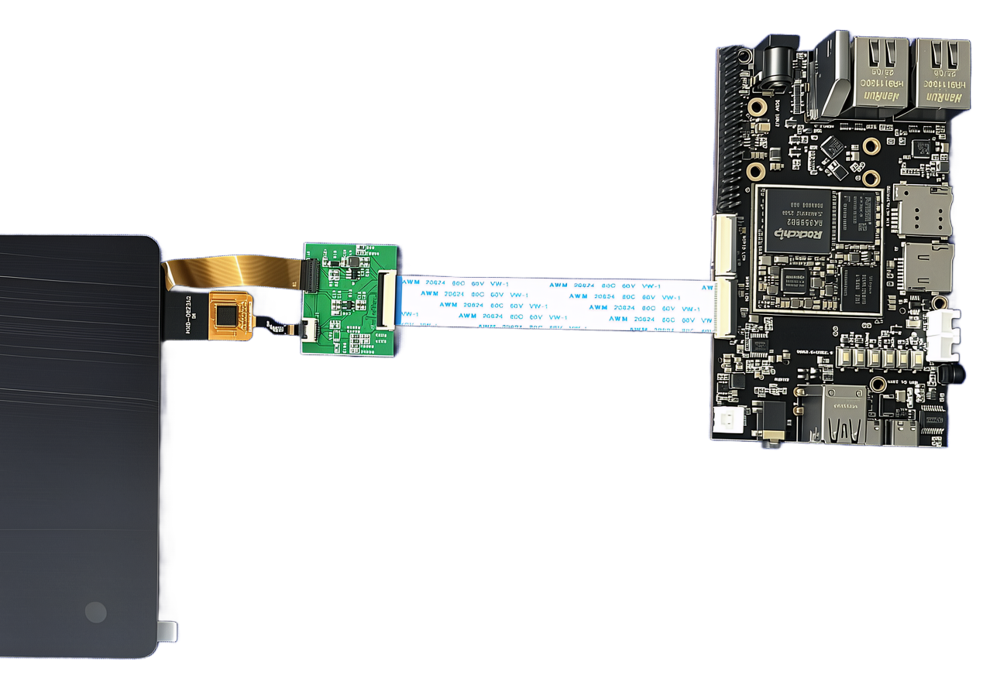

.. raw:: html

   

Boot Manual
===========

Development Board Connection
----------------------------

Preparation
-----------

.. raw:: html

   

+----------------------------------------------------------------+----------------------------------------------+
| .. centered ::  Check and Verify Development Board Accessories                                                |
+================================================================+==============================================+
| Core Board                                                     | 1 piece                                      |
+----------------------------------------------------------------+----------------------------------------------+
| Motherboard                                                    | 1 piece                                      |
+----------------------------------------------------------------+----------------------------------------------+
| Power Supply                                                   | 1 unit, 5V                                   |
+----------------------------------------------------------------+----------------------------------------------+
| Programming Cable                                              | 1 cable, USB male-to-male                    |
+----------------------------------------------------------------+----------------------------------------------+
| Serial Cable                                                   | 1 cable, TTL module and jumper wires         |
+----------------------------------------------------------------+----------------------------------------------+
| Ethernet Cable                                                 | 1 cable                                      |
+----------------------------------------------------------------+----------------------------------------------+
| FPC Cable                                                      | 1 cable, nPin, same/opposite side (optional) |
+----------------------------------------------------------------+----------------------------------------------+
| Display                                                        | 1 piece (optional 8" MIPI display)           |
+----------------------------------------------------------------+----------------------------------------------+
| Camera                                                         | 1 unit (optional OV8858 MIPI camera module)  |
+----------------------------------------------------------------+----------------------------------------------+

Screen Connection Notes
~~~~~~~~~~~~~~~~~~~~~~~

* Please strictly follow the screen connection method shown in the diagram. The interface has no foolproof design.

* Reversed connection will damage the screen and board.

RK3568 Development Board 8-inch MIPI Touchscreen Connection Diagram

Check Power Switch
~~~~~~~~~~~~~~~~~~

Power on to boot. No power-off switch.

Serial Port Settings
~~~~~~~~~~~~~~~~~~~~

.. raw:: html

   

+-----------+-----------+-----------+--------+
| Baud Rate | Data Bits | Stop Bits | Parity |
+===========+===========+===========+========+
| 115200    | 8bit      | 1bit      | none   |
+-----------+-----------+-----------+--------+

DIP Switch Settings and TTL Serial Module
~~~~~~~~~~~~~~~~~~~~~~~~~~~~~~~~~~~~~~~~~

This development board does not have DIP switches.

TTL Serial Module Connection
~~~~~~~~~~~~~~~~~~~~~~~~~~~~

The development board uses a Type-C debug port.

Download Cable Connection
~~~~~~~~~~~~~~~~~~~~~~~~

Connect one end of the Type-C USB cable to development board U4, and the other end to the computer's rear USB port.

Power Cable Connection
~~~~~~~~~~~~~~~~~~~~~

Connect one end of the power adapter (5V output) to the development board's "J15", and plug the other end into a mains (220V AC) outlet.

Serial Cable Connection
~~~~~~~~~~~~~~~~~~~~~~

1. Connect one end of the serial cable to the development board's "J9" (refer to the silk screen diagram) serial port, and the other end to the computer's serial port.

2. Refer to the "Xshell Reference Manual" to create a new serial session and open it.

Ethernet Cable Connection
~~~~~~~~~~~~~~~~~~~~~~~~~

Connect one end of the Ethernet cable to "U9", and the other end to the computer's network port.

HDMI Display Connection
~~~~~~~~~~~~~~~~~~~~~~~

Connect one end of the HDMI display cable to development board J2, and the other end to the HDMI display. Power on the HDMI display.

**Note: It is recommended to use 1080P resolution for the HDMI display, and use a display with native HDMI interface instead of an adapter.**

Boot the Development Board
--------------------------

Power On the Development Board
~~~~~~~~~~~~~~~~~~~~~~~~~~~~~~

Plug the power adapter into the development board's J15 connector to power the board.

DIP Switch Settings
^^^^^^^^^^^^^^^^^^^

There are no DIP switches on the development board.

Interpreting Boot Information
-----------------------------

After powering on, the boot information can be seen in the serial terminal software.

.. code-block:: shell

   U-Boot SPL 2017.09-gaaca6ffec1-211203 #zzz (Dec 03 2021 - 18:42:16)
   Linux version 4.19.232 (zhengc@myzr-92aa) (gcc version 10.3.1 20210621 (GNU Toolchain for the A-profile Architecture 10.3-2021.07 (arm-10.29)), GNU ld (GNU Toolchain for the A-profile Architecture 10.3-2021.07 (arm-10.29)) 2.36.1.20210621) #4 SMP Tue Apr 15 17:28:04 CST 2025

U-Boot Information
~~~~~~~~~~~~~~~~~~

The boot message "U-Boot SPL 2017.09-gaaca6ffec1-211203 #zzz (Dec 03 2021 - 18:42:16)" contains the following information:

【U-Boot Version】: 2017.09;

【Source Code Revision】: gaaca6ffec1;

【U-Boot Compilation Time】: Dec 03 2021 - 18:42:16.

Linux Kernel Information
~~~~~~~~~~~~~~~~~~~~~~~

The boot message "Linux version 4.19.232 (zhengc@myzr-92aa) (gcc version 10.3.1 20210621 (GNU Toolchain for the A-profile Architecture 10.3-2021.07 (arm-10.29)), GNU ld (GNU Toolchain for the A-profile Architecture 10.3-2021.07 (arm-10.29)) 2.36.1.20210621) #4 SMP Tue Apr 15 17:28:04 CST 2025" contains the following information:

【Kernel Version】: Linux-4.19.232;

【GCC Version for Kernel Compilation】: 10.3.1;

【Kernel Compilation Time】: Tue Apr 15 17:28:04 CST 2025.

Development Board Login
-----------------------

Serial Login
~~~~~~~~~~~~

.. code-block:: shell

   # Use TTL module to connect computer and board. Insert TYPEC cable and power on
   # Press Enter to login
   DDR V1.16 6f71c736ce typ 23/03/02-20:01:48
   LPDDR4X, 324MHz -> 1560MHz(final freq)
   BW=32 Col=10 Bk=8 CS0 Row=16 CS=1 Die BW=16 Size=2048MB
   ddr read/write/CA training complete
   U-Boot SPL 2017.09-gaaca6ffec1-211203
   MMC2 init failed(-95), switch to MMC1
   SPL: A/B-slot: _a, successful: 0, tries-remain: 7
   sha256 check: atf/uboot/fdt/optee all OK
   Jumping to U-Boot via ARM Trusted Firmware
   Total: 316.785 ms
   NOTICE:  BL31: v2.3():v2.3-578-gaef7950e4
   GICv3 driver initialized in EL3
   dfs DDR fsp_param: 1560/324/528/780MHz
   I/TC: OP-TEE version: 3.13.0-651-gd84087907
   Primary CPU switching to normal world boot
   Entry point address = 0xa00000
   U-Boot 2017.09 (Aug 18 2025 - 09:12:07 +0000)
   Model: MYZR RK3568 Evaluation Board
   DRAM:  2 GiB
   dwmmc@fe2b0000: 1, dwmmc@fe2c0000: 2, sdhci@fe310000: 0
   MMC0: HS200, 200Mhz
   PMIC:  RK8090
   VOP0/VOP1 actived, DSI 800x1280p0 enabled
   hdmi@fe0a0000 disconnected
   Net:   eth1: ethernet@fe010000, eth0: ethernet@fe2a0000
   Loading kernel/fdt from FIT Image, sha256 verify OK
   Booting Linux using fdt blob
   [    2.489574] [WLAN_RFKILL]: wifi_chip_type = ap6398s
   [    2.490327] [BT_RFKILL]: bt shut off power
   [    2.493889] Btrfs loaded
   [    2.495116] rga2: Driver loaded successfully ver:3.2.63318
   [    2.518796] mpp_rkvenc probing start
   [    2.520267] mpp_rkvdec2 probing start
   [    2.528377] mmc0: new HS200 MMC card at address 0001
   [    2.529456] mmcblk0: mmc0:0001 H8G4a2 7.28 GiB
   [    2.536419] mali fde60000.gpu: Kernel DDK version g7p1-01bet0
   [    2.537124] rockchip-dmc dmc initialized
   [    2.550130] rk817-codec probed
   [    2.562049] RKNPU fde40000.npu: iommu mode enabled
   [    2.588662] cfg80211: failed to load regulatory.db
   [    2.611547] EXT4-fs (mmcblk0p6): mounted root filesystem
   [    2.645286] Run /sbin/init as init process
   [    2.848688] rk-pcie Linking... LTSSM is 0x3
   [    5.227449] eth0: stmmac_hw_setup: DMA engine initialization failed
   [    5.334656] eth1: stmmac_hw_setup: DMA engine initialization failed
   [    6.250461] RTW: rtl8723du driver init start

ADB Connection Login
~~~~~~~~~~~~~~~~~~~~

ADB is not available in this kernel version.

SSH Login via Ethernet
~~~~~~~~~~~~~~~~~~~~~~

.. code-block:: shell

   # Connect Ethernet cable to auto-obtain IP 192.168.128.88
   # Username: root  Password: rockchip
   Connecting to 192.168.128.88:22...
   Connection established.
   To escape to local shell, press 'Ctrl+Alt+]'.
   
   sh: line 1: /usr/bin/xauth: No such file or directory
   root@RK356X:~#

For Buildroot system, the login credentials are: root / rockchip

For Debian system:

Regular user: linaro / linaro

Root user: root / linaro

For Ubuntu system:

Regular user: myzr / myzr

Root user: root / root