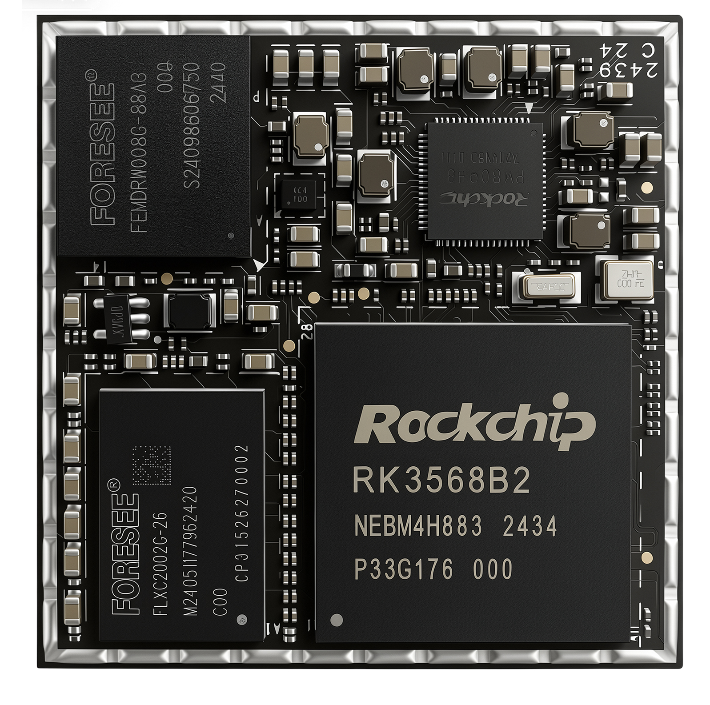
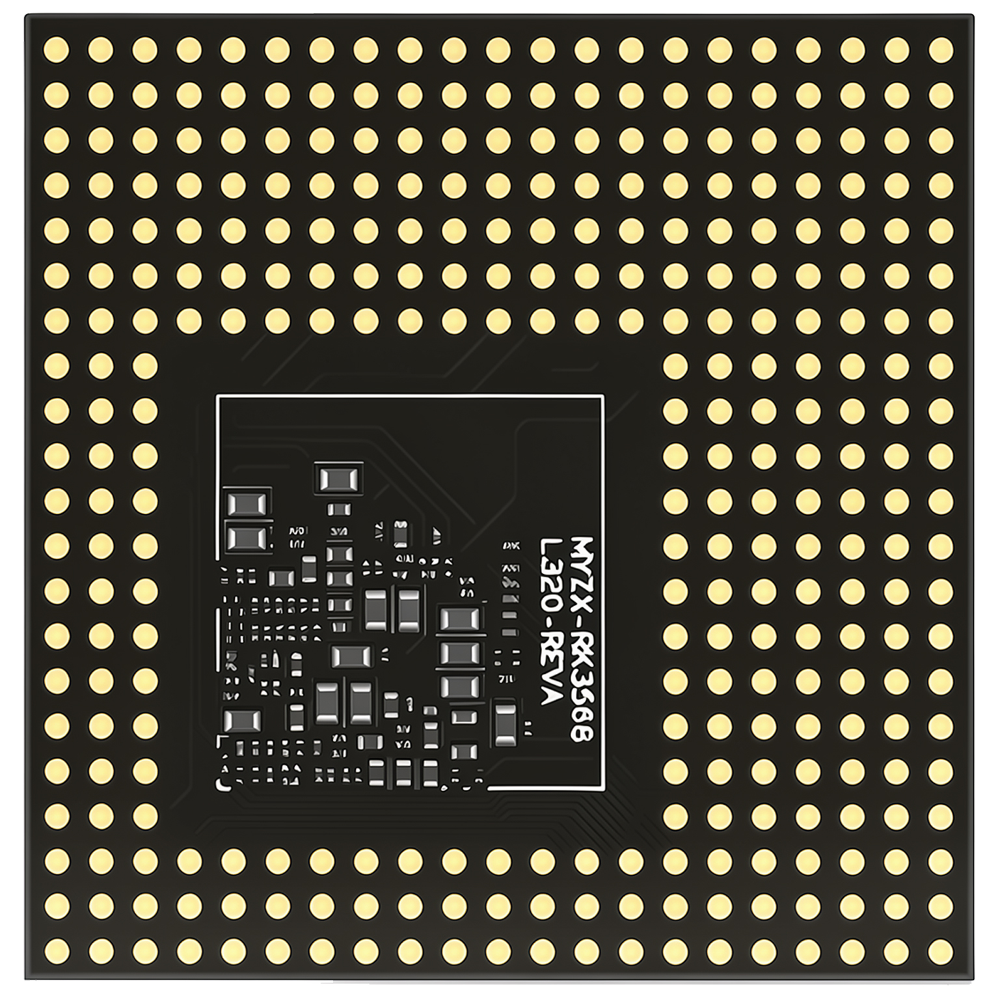
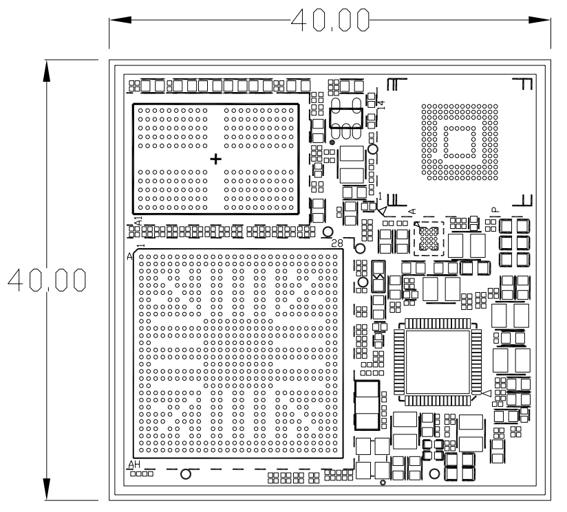
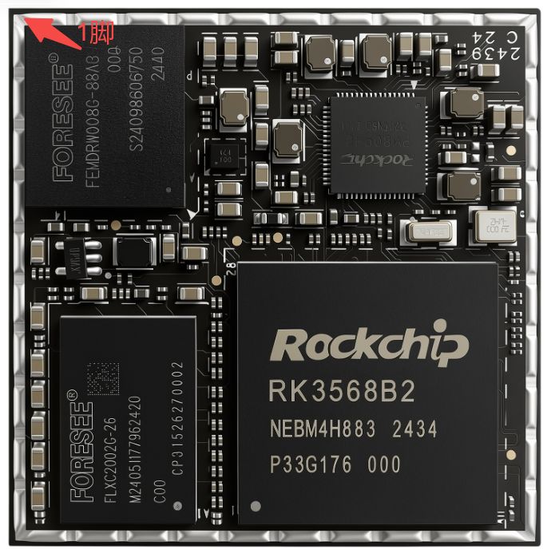
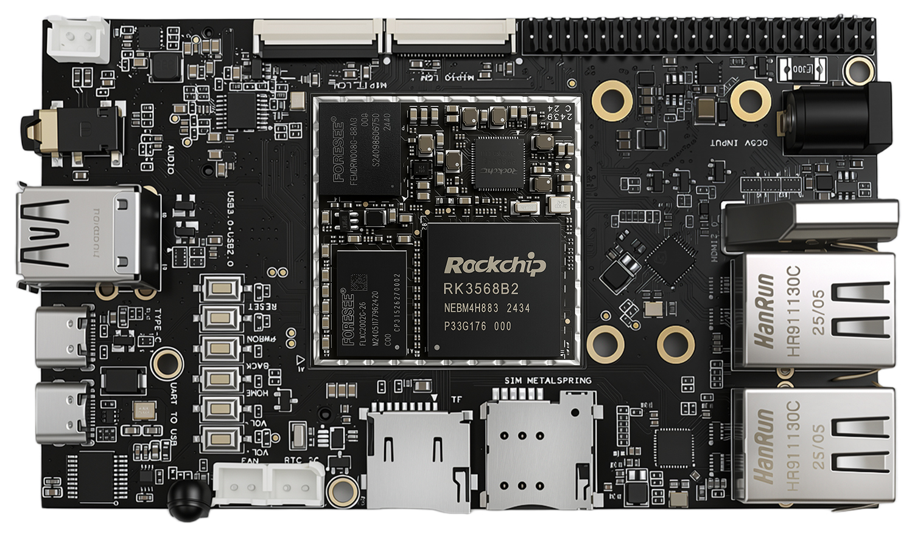
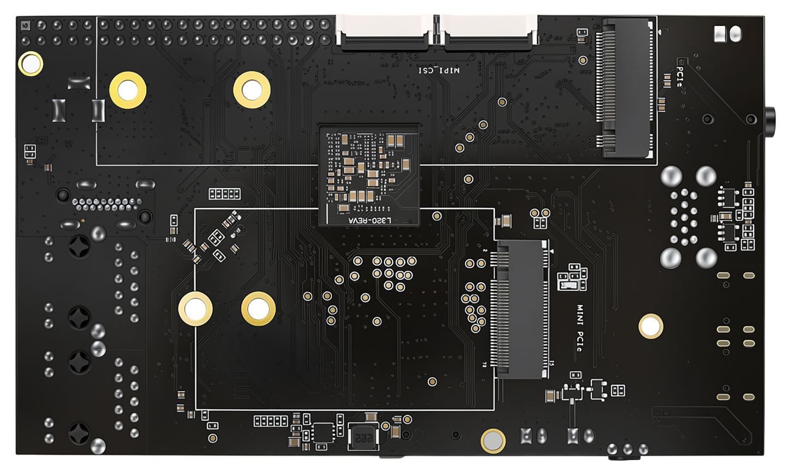
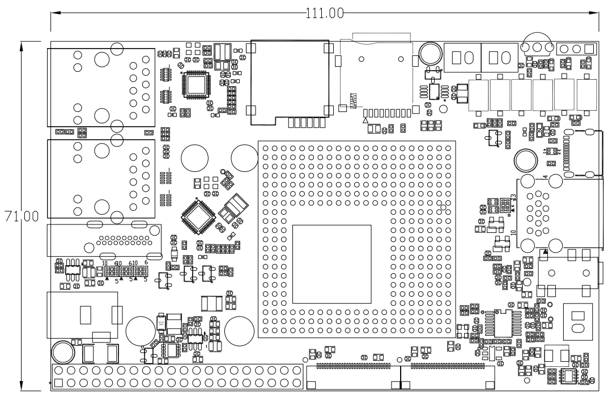
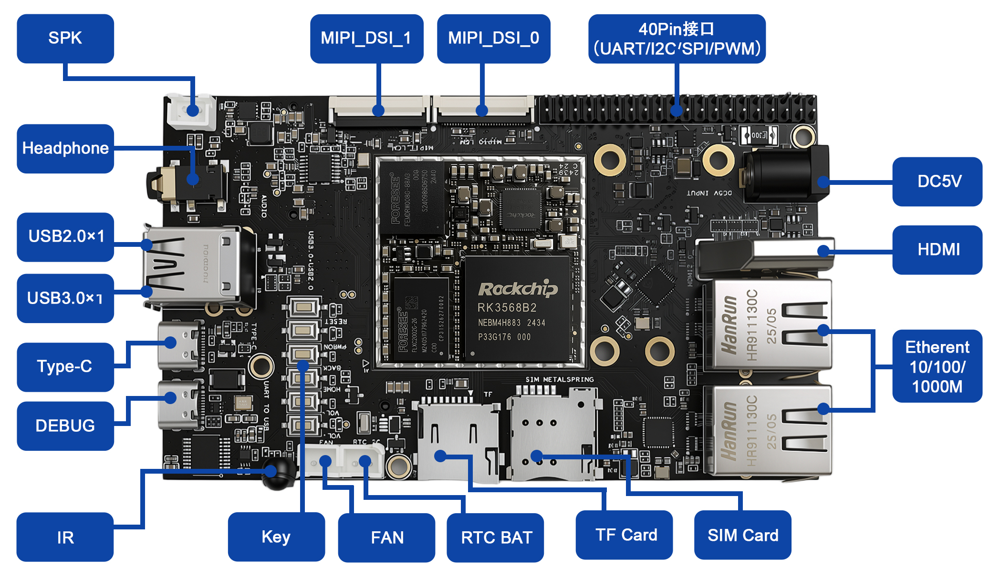
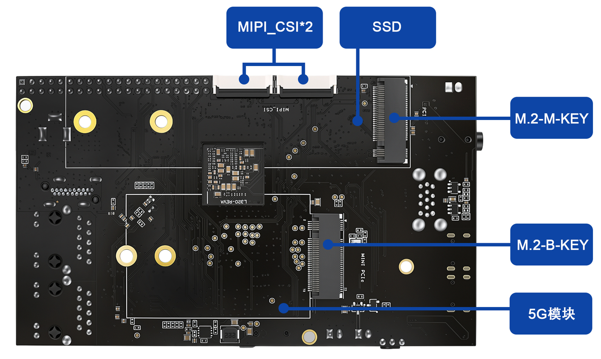

.. raw:: html

   

Product Introduction
====================

Core Board Introduction
-----------------------

Hardware Resources
~~~~~~~~~~~~~~~~~~

The MYZR-RK3568 core board is designed using LGA blind/buried via ENEPIG technology, integrating the RK3568 processor, power management, memory, and other core circuits onto a single board, achieving an extremely compact form factor for convenient development of various miniaturized products.

The core board integrates internally:

* RK3568 processor

* DDR memory

* eMMC Flash

* PMIC power management

* Clock circuit

* Boot configuration circuit

Core Board Specifications
-------------------------

.. raw:: html

   

.. raw:: html

   

+------------------------------------------+-----------+------------------------------------------------------+
| .. centered :: Core Board Specifications                                                                    |
+==========================================+===========+======================================================+
| 1                                        | Model     | MYZR-RK3568-LB320                                    |
+------------------------------------------+-----------+------------------------------------------------------+
| 2                                        | Size      | 40mm × 40mm                                          |
+------------------------------------------+-----------+------------------------------------------------------+
| 3                                        | PCB       | 12-layer 2-stage blind/buried via ENEPIG, LGA 320pin |
+------------------------------------------+-----------+------------------------------------------------------+
| 4                                        | Memory    | LPDDR4X 2/4/8GB(max)                                 |
+------------------------------------------+-----------+------------------------------------------------------+
| 5                                        | Storage   | eMMC 8/16/32/64/128GB                                |
+------------------------------------------+-----------+------------------------------------------------------+
| 6                                        | Boot Mode | SPI NOR / NAND, SD, eMMC, USB, UART                  |
+------------------------------------------+-----------+------------------------------------------------------+

Core Board Top/Bottom Views
~~~~~~~~~~~~~~~~~~~~~~~~~~~

.. raw:: html

   

   

**RK3568 Core Board Top View**

.. raw:: html

   

   

**RK3568 Core Board Bottom View**

.. raw:: html

   

   

Core Board Dimensions
~~~~~~~~~~~~~~~~~~~~~

Core Board Naming Convention and Optional Configurations
~~~~~~~~~~~~~~~~~~~~~~~~~~~~~~~~~~~~~~~~~~~~~~~~~~~~~~~

.. raw:: html

   

.. raw:: html

   

.. table:: Table Title
   :align: center

+-------------------+-------------------------------------------------------+----------------------------+------------------------+----------------------+
| Core Board Model  |                 .. centered :: Naming Convention                                                                                   |
+===================+=======================================================+============================+========================+======================+
| MYZR-RK3568-EK320 | MYZR                                                  | RK3568/RK3568J             | LB/EK                  | 320                  |
+                   +-------------------------------------------------------+----------------------------+------------------------+----------------------+
|                   | Mingyuan Zhirui                                       | MPU Main Controller Model  | LB [Core Board]        | Core Board Pin Count |
+                   +-------------------------------------------------------+----------------------------+------------------------+----------------------+
|                   |                                                       | RK3568 [Commercial Grade]  | EK [Development Board] |                      |
+                   +-------------------------------------------------------+----------------------------+------------------------+----------------------+
|                   |                                                       | RK3568J [Industrial Grade] |                        |                      |
+                   +-------------------------------------------------------+----------------------------+------------------------+----------------------+
|                   | Optional Configurations                                                                                                            |
+                   +-------------------------------------------------------+----------------------------+------------------------+----------------------+
|                   | Memory: 2/4/8GByte LPDDR4X                                                                                                         |
+                   +-------------------------------------------------------+----------------------------+------------------------+----------------------+
|                   | Storage: 8/16/32/64GByte eMMC                                                                                                      |
+                   +-------------------------------------------------------+----------------------------+------------------------+----------------------+
|                   | .. line-block::                                                                                                                    |
|                   |     Example: Core Board MYZR-RK3568-LB320-8G-32G                                                                                   |
|                   |     Development Board MYZR-RK3568-EK320-8G-32G                                                                                     |
+-------------------+-------------------------------------------------------+----------------------------+------------------------+----------------------+

Power Supply
~~~~~~~~~~~~

.. raw:: html

   

.. raw:: html

   

+--------------+----------+------+------+------+------+------------------+
| Function     | Pin Label|   Specification           | Description      |
+              +          +------+------+------+------+                  +
|              |          | Min  | Typ  | Max  | Unit |                  |
+==============+==========+======+======+======+======+==================+
| Power Supply | J15      | 4.8  | 5    | 5.2  | V    | Base Board Power |
+--------------+----------+------+------+------+------+------------------+

Operating Temperature
~~~~~~~~~~~~~~~~~~~~~

.. raw:: html

   

.. raw:: html

   

+-----------------------------------------------+---------------+-------------+------+------+-----------------------------------------+
|                   Parameter                   | Specification                             |          Description                    |
|                                               +---------------+-------------+------+------+                                         |
|                                               |     Min.      |    Typ.     | Max. | Unit |                                         |
+===============================================+===============+=============+======+======+=========================================+
| Commercial                                    | 0℃            | 25          | 80℃  | ℃    | Tested: operates normally at 0 to 80℃   |
+-----------------------------------------------+---------------+-------------+------+------+-----------------------------------------+
| Industrial                                    | -40℃          | 25          | 85℃  | ℃    | Tested: operates normally at -40 to 85℃ |
+-----------------------------------------------+---------------+-------------+------+------+-----------------------------------------+

Boot Configuration
~~~~~~~~~~~~~~~~~~~

Supported:

* eMMC boot

* TF card boot

* USB programming mode

Refer to the schematic for BOOT configuration methods.

Fast Boot Support and Boot Time
~~~~~~~~~~~~~~~~~~~~~~~~~~~~~~~

.. raw:: html

   

.. raw:: html

   
   
+--------+-----------+-------------------------------+
|  Item  |  Support  |             Time              |
+========+===========+===============================+
| RK3568 | Supported | Fast boot to Android UI in 4S |
+--------+-----------+-------------------------------+

Core Board/Development Board Power Consumption
~~~~~~~~~~~~~~~~~~~~~~~~~~~~~~~~~~~~~~~~~~~~~~
.. raw:: html

   

+-------------------------------------------------------+--------------+------------+---------------+-------------+
| .. centered :: Type                                   |  .. centered :: Test Items                              |
+                                                       +--------------+------------+---------------+-------------+
|                                                       | Standby Power Consumption | Full Load Power Consumption |
+=======================================================+==============+============+===============+=============+
| MYZR-RK3568 Core Board                                | 405mA        | 2W         | 767mA         | 3.8W        |
+-------------------------------------------------------+--------------+------------+---------------+-------------+
| MYZR-RK3568 Development Board                         | 430mA        | 2.15W      | 950mA         | 4.7W        |
+-------------------------------------------------------+--------------+------------+---------------+-------------+
|   Note: The above values are current values (mA), voltage is 5.0V, full load means all cores running at maximum |
+-------------------------------------------------------+--------------+------------+---------------+-------------+

Core Board SMT/Installation Diagram
~~~~~~~~~~~~~~~~~~~~~~~~~~~~~~~~~~~

Signal Definitions
~~~~~~~~~~~~~~~~~~~

.. raw:: html

   

+---------+----------+---------------------------------------------------------------------------------------------+-------------+
| Pin NO. | Pin Name |   .. centered :: Function Description                                                       | Pin Voltage |
+=========+==========+=============================================================================================+=============+
| 1       | A1       | GND                                                                                         |             |
+---------+----------+---------------------------------------------------------------------------------------------+-------------+
| 2       | A2       | GND                                                                                         |             |
+---------+----------+---------------------------------------------------------------------------------------------+-------------+
| 3       | A3       | GND                                                                                         |             |
+---------+----------+---------------------------------------------------------------------------------------------+-------------+
| 4       | A4       | GND                                                                                         |             |
+---------+----------+---------------------------------------------------------------------------------------------+-------------+
| 5       | A5       | GND                                                                                         |             |
+---------+----------+---------------------------------------------------------------------------------------------+-------------+
| 6       | A6       | GND                                                                                         |             |
+---------+----------+---------------------------------------------------------------------------------------------+-------------+
| 7       | A7       | G28/GMAC0_TXEN/UART1_RTSn_M0/SPI1_CLK_M0/GPIO2_B5_u                                         | 1V8         |
+---------+----------+---------------------------------------------------------------------------------------------+-------------+
| 8       | A8       | GND                                                                                         |             |
+---------+----------+---------------------------------------------------------------------------------------------+-------------+
| 9       | A9       | Y22/SDMMC0_DET/SATA_CP_DET/PCIE30X1_CLKREQn_M0/GPIO0_A4_u/3V3                               | 3V3         |
+---------+----------+---------------------------------------------------------------------------------------------+-------------+
| 10      | A10      | H26/SDMMC0_D2/ARMJTAG_TCK/UART5_CTSn_M0/GPIO1_D7_u/3V3                                      | 3V3         |
+---------+----------+---------------------------------------------------------------------------------------------+-------------+
| 11      | A11      | J23/SDMMC0_D3/ARMJTAG_TMS/UART5_RTSn_M0/GPIO2_A0_u/3V3                                      | 3V3         |
+---------+----------+---------------------------------------------------------------------------------------------+-------------+
| 12      | A12      | E28/SDMMC1_D1/GMAC0_RXD3/UART6_TX_M0/GPIO2_A4_u                                             | 1V8         |
+---------+----------+---------------------------------------------------------------------------------------------+-------------+
| 13      | A13      | F26/I2S2_SDI_M0/GMAC0_RXER/UART8_TX_M0/SPI2_CS1_M0/GPIO2_C5_d                               | 1V8         |
+---------+----------+---------------------------------------------------------------------------------------------+-------------+
| 14      | A14      | M24/USB3_OTG0_VBUSDET                                                                       | 3V3         |
+---------+----------+---------------------------------------------------------------------------------------------+-------------+
| 15      | A15      | F25/I2S2_SCLK_TX_M0/GMAC0_MCLKINOUT/UART7_CTSn_M0/SPI2_MISO_M0/GPIO2_C2_d                   | 1V8         |
+---------+----------+---------------------------------------------------------------------------------------------+-------------+
| 16      | A16      | D26/SDMMC1_PWREN/I2C4_SDA_M1/UART8_RTSn_M0/CAN2_RX_M1/GPIO2_B1_d                            | 1V8         |
+---------+----------+---------------------------------------------------------------------------------------------+-------------+
| 17      | A17      | G23/I2S2_MCLK_M0/ETH0_REFCLKO_25M/UART7_RTSn_M0/SPI2_CLK_M0/GPIO2_C1_d                      | 1V8         |
+---------+----------+---------------------------------------------------------------------------------------------+-------------+
| 18      | A18      | AA11/PWM15_IR_M1/SPI3_MOSI_M1/CAN1_TX_M1/PCIE30X2_WAKEn_M2/I2S3_SCLK_M1/GPIO4_C3_d/3V3      | 3V3         |
+---------+----------+---------------------------------------------------------------------------------------------+-------------+
| 19      | A19      | AD6/LCDC_D6/VOP_BT656_D6_M0/SPI2_MOSI_M1/PCIE30X2_PERSTn_M1/I2S1_SDI3_M2/GPIO2_D6_d/3V3     | 3V3         |
+---------+----------+---------------------------------------------------------------------------------------------+-------------+
| 20      | A20      | U5/CIF_HREF/EBC_SDLE/GMAC1_MDC_M1/UART1_RTSn_M1/I2S2_MCLK_M1/GPIO4_B6_d                     | 1V8         |
+---------+----------+---------------------------------------------------------------------------------------------+-------------+
| 21      | A21      | U4/CIF_VSYNC/EBC_SDOE/GMAC1_MDIO_M1/I2S2_SCLK_TX_M1/GPIO4_B7_d                              | 1V8         |
+---------+----------+---------------------------------------------------------------------------------------------+-------------+
| 22      | B1       | L28/eDP_TX_D2P                                                                              |             |
+---------+----------+---------------------------------------------------------------------------------------------+-------------+
| 23      | B2       | M27/eDP_TX_D2N                                                                              |             |
+---------+----------+---------------------------------------------------------------------------------------------+-------------+
| 24      | B3       | GND                                                                                         |             |
+---------+----------+---------------------------------------------------------------------------------------------+-------------+
| 25      | B4       | M25/eDP_TX_AUXN                                                                             |             |
+---------+----------+---------------------------------------------------------------------------------------------+-------------+
| 26      | B5       | L25/eDP_TX_AUXP                                                                             |             |
+---------+----------+---------------------------------------------------------------------------------------------+-------------+
| 27      | B6       | GND                                                                                         |             |
+---------+----------+---------------------------------------------------------------------------------------------+-------------+
| 28      | B7       | GND                                                                                         |             |
+---------+----------+---------------------------------------------------------------------------------------------+-------------+
| 29      | B8       | C28/SDMMC1_CMD/GMAC0_TXD3/UART9_RX_M0/GPIO2_A7_u                                            | 1V8         |
+---------+----------+---------------------------------------------------------------------------------------------+-------------+
| 30      | B9       | GND                                                                                         |             |
+---------+----------+---------------------------------------------------------------------------------------------+-------------+
| 31      | B10      | J24/SDMMC0_D1/UART2_RX_M1/UART6_RX_M1/PWM9_M1/GPIO1_D6_u/3V3                                | 3V3         |
+---------+----------+---------------------------------------------------------------------------------------------+-------------+
| 32      | B11      | B28/SDMMC1_D2/GMAC0_RXCLK/UART7_RX_M0/GPIO2_A5_u                                            | 1V8         |
+---------+----------+---------------------------------------------------------------------------------------------+-------------+
| 33      | B12      | GND                                                                                         |             |
+---------+----------+---------------------------------------------------------------------------------------------+-------------+
| 34      | B13      | F24/I2S2_LRCK_RX_M0/GMAC0_RXDV_CRS/UART6_CTSn_M0/SPI1_CS0_M0/GPIO2_C0_d                     | 1V8         |
+---------+----------+---------------------------------------------------------------------------------------------+-------------+
| 35      | B14      | H24/I2S2_LRCK_TX_M0/GMAC0_MDC/UART9_RTSn_M0/SPI2_MOSI_M0/GPIO2_C3_d                         | 1V8         |
+---------+----------+---------------------------------------------------------------------------------------------+-------------+
| 36      | B15      | GND                                                                                         |             |
+---------+----------+---------------------------------------------------------------------------------------------+-------------+
| 37      | B16      | L23/USB3_OTG0_ID                                                                            | 3V3         |
+---------+----------+---------------------------------------------------------------------------------------------+-------------+
| 38      | B17      | H23/I2S2_SDO_M0/GMAC0_MDIO/UART9_CTSn_M0/SPI2_CS0_M0/GPIO2_C4_d                             | 1V8         |
+---------+----------+---------------------------------------------------------------------------------------------+-------------+
| 39      | B18      | AC8/LCDC_D2/VOP_BT656_D2_M0/SPI0_CS0_M1/PCIE30X1_CLKREQn_M1/I2S1_LRCK_TX_M2/GPIO2_D2_d/3V3  | 3V3         |
+---------+----------+---------------------------------------------------------------------------------------------+-------------+
| 40      | B19      | GND                                                                                         |             |
+---------+----------+---------------------------------------------------------------------------------------------+-------------+
| 41      | B20      | AC4/LCDC_DEN/VOP_BT1120_D15/SPI1_CLK_M1/UART5_RX_M1/I2S1_SCLK_RX_M2/GPIO3_C3_d/3V3          | 3V3         |
+---------+----------+---------------------------------------------------------------------------------------------+-------------+
| 42      | B21      | AB1/CIF_D3/EBC_SDDO3/SDMMC2_D3_M0/I2S1_SDO0_M1/VOP_BT656_D3_M1/GPIO3_D1_d                   | 1V8         |
+---------+----------+---------------------------------------------------------------------------------------------+-------------+
| 43      | C1       | N27/eDP_TX_D3N                                                                              |             |
+---------+----------+---------------------------------------------------------------------------------------------+-------------+
| 44      | C2       | M28/eDP_TX_D3P                                                                              |             |
+---------+----------+---------------------------------------------------------------------------------------------+-------------+
| 45      | C3       | GND                                                                                         |             |
+---------+----------+---------------------------------------------------------------------------------------------+-------------+
| 46      | C4       | K27/eDP_TX_D0N                                                                              |             |
+---------+----------+---------------------------------------------------------------------------------------------+-------------+
| 47      | C5       | J28/eDP_TX_D0P                                                                              |             |
+---------+----------+---------------------------------------------------------------------------------------------+-------------+
| 48      | C6       | GND                                                                                         |             |
+---------+----------+---------------------------------------------------------------------------------------------+-------------+
| 49      | C7       | F28/GMAC0_TXD0/UART1_RX_M0/GPIO2_B3_u                                                       | 1V8         |
+---------+----------+---------------------------------------------------------------------------------------------+-------------+
| 50      | C8       | GND                                                                                         |             |
+---------+----------+---------------------------------------------------------------------------------------------+-------------+
| 51      | C9       | J25/SDMMC0_D0/UART2_TX_M1/UART6_TX_M1/PWM8_M1/GPIO1_D5_u/3V3                                | 3V3         |
+---------+----------+---------------------------------------------------------------------------------------------+-------------+
| 52      | C10      | GND                                                                                         |             |
+---------+----------+---------------------------------------------------------------------------------------------+-------------+
| 53      | C11      | GND                                                                                         |             |
+---------+----------+---------------------------------------------------------------------------------------------+-------------+
| 54      | C12      | F27/GMAC0_RXD0/UART1_CTSn_M0/SPI1_MISO_M0/GPIO2_B6_u                                        | 1V8         |
+---------+----------+---------------------------------------------------------------------------------------------+-------------+
| 55      | C13      | H25/I2S2_SCLK_RX_M0/GMAC0_RXD1/UART6_RTSn_M0/SPI1_MOSI_M0/GPIO2_B7_d                        | 1V8         |
+---------+----------+---------------------------------------------------------------------------------------------+-------------+
| 56      | C14      | E26/CLK32K_OUT1/UART8_RX_M0/SPI1_CS1_M0/GPIO2_C6_d                                          | 1V8         |
+---------+----------+---------------------------------------------------------------------------------------------+-------------+
| 57      | C15      | E25/SDMMC1_DET/I2C4_SCL_M1/UART8_CTSn_M0/CAN2_TX_M1/GPIO2_B2_u                              | 1V8         |
+---------+----------+---------------------------------------------------------------------------------------------+-------------+
| 58      | C16      | AC5/CIF_D0/EBC_SDDO0/SDMMC2_D0_M0/I2S1_MCLK_M1/VOP_BT656_D0_M1/GPIO3_C6_d                   | 1V8         |
+---------+----------+---------------------------------------------------------------------------------------------+-------------+
| 59      | C17      | AE2/LCDC_D20/VOP_BT1120_D11/GMAC1_TXD0_M0/I2C3_SCL_M1/PWM10_M0/GPIO3_B5_d/3V3               | 3V3         |
+---------+----------+---------------------------------------------------------------------------------------------+-------------+
| 60      | C18      | AC1/CIF_D5/EBC_SDDO5/SDMMC2_CLK_M0/I2S1_SDI1_M1/VOP_BT656_D5_M1/GPIO3_D3_d                  | 1V8         |
+---------+----------+---------------------------------------------------------------------------------------------+-------------+
| 61      | C19      | AD1/LCDC_HSYNC/VOP_BT1120_D13/SPI1_MOSI_M1/PCIE20_PERSTn_M1/I2S1_SDO2_M2/GPIO3_C1_d/3V3     | 3V3         |
+---------+----------+---------------------------------------------------------------------------------------------+-------------+
| 62      | C20      | GND                                                                                         |             |
+---------+----------+---------------------------------------------------------------------------------------------+-------------+
| 63      | C21      | V1/I2C4_SCL_M0/EBC_GDOE/ETH1_REFCLKO_25M_M1/SPI3_CLK_M0/I2S2_SDO_M1/GPIO4_B3_d              | 1V8         |
+---------+----------+---------------------------------------------------------------------------------------------+-------------+
| 64      | D1       | U28/USB3_HOST1_SSRXP/SATA1_RXP/QSGMII_RXP_M0                                                |             |
+---------+----------+---------------------------------------------------------------------------------------------+-------------+
| 65      | D2       | U27/USB3_HOST1_SSRXN/SATA1_RXN/QSGMII_RXN_M0                                                |             |
+---------+----------+---------------------------------------------------------------------------------------------+-------------+
| 66      | D3       | GND                                                                                         |             |
+---------+----------+---------------------------------------------------------------------------------------------+-------------+
| 67      | D4       | K28/eDP_TX_D1P                                                                              |             |
+---------+----------+---------------------------------------------------------------------------------------------+-------------+
| 68      | D5       | L27/eDP_TX_D1N                                                                              |             |
+---------+----------+---------------------------------------------------------------------------------------------+-------------+
| 69      | D6       | GND                                                                                         |             |
+---------+----------+---------------------------------------------------------------------------------------------+-------------+
| 70      | D7       | GND                                                                                         |             |
+---------+----------+---------------------------------------------------------------------------------------------+-------------+
| 71      | D8       | D27/SDMMC1_CLK/GMAC0_TXCLK/UART9_TX_M0/GPIO2_B0_d                                           | 1V8         |
+---------+----------+---------------------------------------------------------------------------------------------+-------------+
| 72      | D9       | GND                                                                                         |             |
+---------+----------+---------------------------------------------------------------------------------------------+-------------+
| 73      | D10      | H27/SDMMC0_CMD/PWM10_M1/UART5_RX_M0/CAN0_TX_M1/GPIO2_A1_u/3V3                               | 3V3         |
+---------+----------+---------------------------------------------------------------------------------------------+-------------+
| 74      | D11      | A22/FSPI_CLK/FLASH_ALE/GPIO1_D0_d                                                           | 1V8         |
+---------+----------+---------------------------------------------------------------------------------------------+-------------+
| 75      | D12      | E27/SDMMC1_D0/GMAC0_RXD2/UART6_RX_M0/GPIO2_A3_u                                             | 1V8         |
+---------+----------+---------------------------------------------------------------------------------------------+-------------+
| 76      | D13      | GND                                                                                         |             |
+---------+----------+---------------------------------------------------------------------------------------------+-------------+
| 77      | D14      | AE8/PWM13_M1/SPI3_CS0_M1/SATA0_ACT_LED/UART9_RX_M1/I2S3_SDI_M1/GPIO4_C6_d/3V3               | 3V3         |
+---------+----------+---------------------------------------------------------------------------------------------+-------------+
| 78      | D15      | AD8/PWM12_M1/SPI3_MISO_M1/SATA1_ACT_LED/UART9_TX_M1/I2S3_SDO_M1/GPIO4_C5_d3V3               | 3V3         |
+---------+----------+---------------------------------------------------------------------------------------------+-------------+
| 79      | D16      | AC7/LCDC_D3/VOP_BT656_D3_M0/SPI0_CLK_M1/PCIE30X1_WAKEn_M1/I2S1_SDI0_M2/GPIO2_D3_d/3V3       | 3V3         |
+---------+----------+---------------------------------------------------------------------------------------------+-------------+
| 80      | D17      | V4/I2C4_SDA_M0/EBC_VCOM/GMAC1_RXER_M1/SPI3_MOSI_M0/I2S2_SDI_M1/GPIO4_B2_d                   | 1V8         |
+---------+----------+---------------------------------------------------------------------------------------------+-------------+
| 81      | D18      | GND                                                                                         |             |
+---------+----------+---------------------------------------------------------------------------------------------+-------------+
| 82      | D19      | U3/CIF_CLKOUT/EBC_GDCLK/PWM11_IR_M1/GPIO4_C0_d                                              | 1V8         |
+---------+----------+---------------------------------------------------------------------------------------------+-------------+
| 83      | D20      | AE1/LCDC_D19/VOP_BT1120_D10/GMAC1_RXER_M0/I2C5_SDA_M0/PDM_SDI1_M2/GPIO3_B4_d/3V3            | 3V3         |
+---------+----------+---------------------------------------------------------------------------------------------+-------------+
| 84      | D21      | AF1/LCDC_D18/VOP_BT1120_D9/GMAC1_RXDV_CRS_M0/I2C5_SCL_M0/PDM_SDI0_M2/GPIO3_B3_d/3V3         | 3V3         |
+---------+----------+---------------------------------------------------------------------------------------------+-------------+
| 85      | E1       | P28/USB3_OTG0_DM                                                                            |             |
+---------+----------+---------------------------------------------------------------------------------------------+-------------+
| 86      | E2       | P27/USB3_OTG0_DP                                                                            |             |
+---------+----------+---------------------------------------------------------------------------------------------+-------------+
| 87      | E3       | GND                                                                                         |             |
+---------+----------+---------------------------------------------------------------------------------------------+-------------+
| 88      | E4       | V28/USB3_HOST1_SSTXP/SATA1_TXP/QSGMII_TXP_M0                                                |             |
+---------+----------+---------------------------------------------------------------------------------------------+-------------+
| 89      | E5       | V27/USB3_HOST1_SSTXN/SATA1_TXN/QSGMII_TXN_M0                                                |             |
+---------+----------+---------------------------------------------------------------------------------------------+-------------+
| 90      | E6       | GND                                                                                         |             |
+---------+----------+---------------------------------------------------------------------------------------------+-------------+
| 91      | E7       | G27/GMAC0_TXD1/UART1_TX_M0/GPIO2_B4_u                                                       | 1V8         |
+---------+----------+---------------------------------------------------------------------------------------------+-------------+
| 92      | E8       | GND                                                                                         |             |
+---------+----------+---------------------------------------------------------------------------------------------+-------------+
| 93      | E9       | H28/SDMMC0_CLK/TEST_CLKOUT/UART5_TX_M0/CAN0_RX_M1/GPIO2_A2_d/3V3                            | 3V3         |
+---------+----------+---------------------------------------------------------------------------------------------+-------------+
| 94      | E10      | GND                                                                                         |             |
+---------+----------+---------------------------------------------------------------------------------------------+-------------+
| 95      | E11      | Core Board Output Power 1.8V 200mA                                                          |             |
+---------+----------+---------------------------------------------------------------------------------------------+-------------+
| 96      | E12      | C24/FSPI_D0/FLASH_RDY/GPIO1_D1_u                                                            | 1V8         |
+---------+----------+---------------------------------------------------------------------------------------------+-------------+
| 97      | E13      | D24/SARADC_VIN2                                                                             | 1V8         |
+---------+----------+---------------------------------------------------------------------------------------------+-------------+
| 98      | E14      | GND                                                                                         |             |
+---------+----------+---------------------------------------------------------------------------------------------+-------------+
| 99      | E15      | D20/I2S1_SDO1_M0/I2S1_SDI3_M0/PDM_SDI3_M0/PCIE20_CLKREQn_M2/ACODEC_DAC_DATAR/GPIO1_B0_d/3V3 | 3V3         |
+---------+----------+---------------------------------------------------------------------------------------------+-------------+
| 100     | E16      | G21/SARADC_VIN4                                                                             | 1V8         |
+---------+----------+---------------------------------------------------------------------------------------------+-------------+
| 101     | E17      | G20/SARADC_VIN6                                                                             | 1V8         |
+---------+----------+---------------------------------------------------------------------------------------------+-------------+
| 102     | E18      | AA7/LCDC_VSYNC/VOP_BT1120_D14/SPI1_MISO_M1/UART5_TX_M1/I2S1_SDO3_M2/GPIO3_C2_d/3V3          | 3V3         |
+---------+----------+---------------------------------------------------------------------------------------------+-------------+
| 103     | E19      | GND                                                                                         |             |
+---------+----------+---------------------------------------------------------------------------------------------+-------------+
| 104     | E20      | AC2/PWM15_IR_M0/SPDIF_TX_M1/GMAC1_MDIO_M0/UART7_RX_M1/I2S1_LRCK_RX_M2/GPIO3_C5_d/3V3        | 3V3         |
+---------+----------+---------------------------------------------------------------------------------------------+-------------+
| 105     | E21      | AC3/PWM14_M0/VOP_PWM_M1/GMAC1_MDC_M0/UART7_TX_M1/PDM_CLK1_M2/GPIO3_C4_d/3V3                 | 3V3         |
+---------+----------+---------------------------------------------------------------------------------------------+-------------+
| 106     | F1       | R28/USB3_OTG0_SSRXP/SATA0_RXP                                                               |             |
+---------+----------+---------------------------------------------------------------------------------------------+-------------+
| 107     | F2       | R27/USB3_OTG0_SSRXN/SATA0_RXN                                                               |             |
+---------+----------+---------------------------------------------------------------------------------------------+-------------+
| 108     | F3       | GND                                                                                         |             |
+---------+----------+---------------------------------------------------------------------------------------------+-------------+
| 109     | F4       | T28/USB3_OTG0_SSTXP/SATA0_TXP                                                               |             |
+---------+----------+---------------------------------------------------------------------------------------------+-------------+
| 110     | F5       | T27/USB3_OTG0_SSTXN/SATA0_TXN                                                               |             |
+---------+----------+---------------------------------------------------------------------------------------------+-------------+
| 111     | F6       | GND                                                                                         |             |
+---------+----------+---------------------------------------------------------------------------------------------+-------------+
| 112     | F7       | GND                                                                                         |             |
+---------+----------+---------------------------------------------------------------------------------------------+-------------+
| 113     | F8       | C27/SDMMC1_D3/GMAC0_TXD2/UART7_TX_M0/GPIO2_A6_u                                             | 1V8         |
+---------+----------+---------------------------------------------------------------------------------------------+-------------+
| 114     | F9       | GND                                                                                         |             |
+---------+----------+---------------------------------------------------------------------------------------------+-------------+
| 115     | F10      | B27/SARADC_VIN0                                                                             | 1V8         |
+---------+----------+---------------------------------------------------------------------------------------------+-------------+
| 116     | F11      | Core Board Output Power 1.8V 200mA                                                          |             |
+---------+----------+---------------------------------------------------------------------------------------------+-------------+
| 117     | F12      | C23/FSPI_CS0n/FLASH_CS0n/GPIO1_D3_u                                                         | 1V8         |
+---------+----------+---------------------------------------------------------------------------------------------+-------------+
| 118     | F13      | F22/SARADC_VIN5                                                                             | 1V8         |
+---------+----------+---------------------------------------------------------------------------------------------+-------------+
| 119     | F14      | F18/I2S1_SCLK_RX_M0/UART4_RX_M0/PDM_CLK1_M0/SPDIF_TX_M0/GPIO1_A4_d/3V3                      | 3V3         |
+---------+----------+---------------------------------------------------------------------------------------------+-------------+
| 120     | F15      | E20/I2S1_SDO2_M0/I2S1_SDI2_M0/PDM_SDI2_M0/PCIE20_WAKEn_M2/ACODEC_ADC_SYNC/GPIO1_B1_d/3V3    | 3V3         |
+---------+----------+---------------------------------------------------------------------------------------------+-------------+
| 121     | F16      | D18/I2C3_SDA_M0/UART3_RX_M0/CAN1_RX_M0/AUDIOPWM_LOUT_P/ACODEC_ADC_DATA/GPIO1_A0_u/3V3       | 3V3         |
+---------+----------+---------------------------------------------------------------------------------------------+-------------+
| 122     | F17      | GND                                                                                         |             |
+---------+----------+---------------------------------------------------------------------------------------------+-------------+
| 123     | F18      | AB8/LCDC_D8/VOP_BT1120_D0/SPI1_CS0_M1/PCIE30X1_PERSTn_M1/SDMMC2_D0_M1/GPIO3_A1_d/3V3        | 3V3         |
+---------+----------+---------------------------------------------------------------------------------------------+-------------+
| 124     | F19      | V6/I2C2_SDA_M1/EBC_GDSP/CAN2_RX_M0/ISP_FLASH_TRIGIN/VOP_BT656_CLK_M1/GPIO4_B4_d             | 1V8         |
+---------+----------+---------------------------------------------------------------------------------------------+-------------+
| 125     | F20      | AA6/CIF_D1/EBC_SDDO1/SDMMC2_D1_M0/I2S1_SCLK_TX_M1/VOP_BT656_D1_M1/GPIO3_C7_d                | 1V8         |
+---------+----------+---------------------------------------------------------------------------------------------+-------------+
| 126     | F21      | Y7/CIF_D4/EBC_SDDO4/SDMMC2_CMD_M0/I2S1_SDI0_M1/VOP_BT656_D4_M1/GPIO3_D2_d                   | 1V8         |
+---------+----------+---------------------------------------------------------------------------------------------+-------------+
| 127     | G1       | AH24/UART2_TX_M0/GPIO0_D1_u/3V3                                                             | 3V3         |
+---------+----------+---------------------------------------------------------------------------------------------+-------------+
| 128     | G2       | AG23/PWM3_IR/EDP_HPDIN_M1/PCIE30X1_WAKEn_M0/MCU_JTAG_TMS/GPIO0_C2_d/3V3                     | 3V3         |
+---------+----------+---------------------------------------------------------------------------------------------+-------------+
| 129     | G3       | AF23/PWM2_M0/NPUAVS/UART0_TX/MCU_JTAG_TDI/3V3                                               | 3V3         |
+---------+----------+---------------------------------------------------------------------------------------------+-------------+
| 130     | G4       | AE24/GPU_PWREN/SATA_CP_POD/PCIE30X2_CLKREQn_M0/GPIO0_A6_d/3V3                               | 3V3         |
+---------+----------+---------------------------------------------------------------------------------------------+-------------+
| 131     | G5       | AE23/PWM4/VOP_PWM_M0/PCIE30X1_PERSTn_M0/MCU_JTAG_TRSTn/GPIO0_C3_d/3V3                       | 3V3         |
+---------+----------+---------------------------------------------------------------------------------------------+-------------+
| 132     | G6       | GND                                                                                         |             |
+---------+----------+---------------------------------------------------------------------------------------------+-------------+
| 133     | G7       | P25/USB3_HOST1_DM                                                                           |             |
+---------+----------+---------------------------------------------------------------------------------------------+-------------+
| 134     | G8       | P24/USB3_HOST1_DP                                                                           |             |
+---------+----------+---------------------------------------------------------------------------------------------+-------------+
| 135     | G9       | GND                                                                                         |             |
+---------+----------+---------------------------------------------------------------------------------------------+-------------+
| 136     | G10      | C26/SARADC_VIN1                                                                             | 1V8         |
+---------+----------+---------------------------------------------------------------------------------------------+-------------+
| 137     | G11      | A27/FSPI_D3/FLASH_CS1n/GPIO1_D4_u                                                           | 1V8         |
+---------+----------+---------------------------------------------------------------------------------------------+-------------+
| 138     | G12      | D23/FSPI_D1/FLASH_RDn/GPIO1_D2_u                                                            | 1V8         |
+---------+----------+---------------------------------------------------------------------------------------------+-------------+
| 139     | G13      | E23/SARADC_VIN3                                                                             | 1V8         |
+---------+----------+---------------------------------------------------------------------------------------------+-------------+
| 140     | G14      | A21/I2S1_SDO3_M0/I2S1_SDI1_M0/PDM_SDI1_M0/PCIE20_PERSTn_M2/GPIO1_B2_d/3V3                   | 3V3         |
+---------+----------+---------------------------------------------------------------------------------------------+-------------+
| 141     | G15      | F21/SARADC_VIN7                                                                             | 1V8         |
+---------+----------+---------------------------------------------------------------------------------------------+-------------+
| 142     | G16      | E18/I2C3_SCL_M0/UART3_TX_M0/CAN1_TX_M0/AUDIOPWM_LOUT_N/ACODEC_ADC_CLK/GPIO1_A1_u/3V3        | 3V3         |
+---------+----------+---------------------------------------------------------------------------------------------+-------------+
| 143     | G17      | AB9/GPIO4_D2_d/3V3                                                                          | 3V3         |
+---------+----------+---------------------------------------------------------------------------------------------+-------------+
| 144     | G18      | AB5/CIF_D2/EBC_SDDO2/SDMMC2_D2_M0/I2S1_LRCK_TX_M1/VOP_BT656_D2_M1/GPIO3_D0_d                | 1V8         |
+---------+----------+---------------------------------------------------------------------------------------------+-------------+
| 145     | G19      | V5/I2C2_SCL_M1/EBC_SDSHR/CAN2_TX_M0/I2S1_SDO3_M1/GPIO4_B5_d                                 | 1V8         |
+---------+----------+---------------------------------------------------------------------------------------------+-------------+
| 146     | G20      | GND                                                                                         |             |
+---------+----------+---------------------------------------------------------------------------------------------+-------------+
| 147     | G21      | AA5/CIF_D7/EBC_SDDO7/SDMMC2_PWREN_M0/I2S1_SDI3_M1/VOP_BT656_D7_M1/GPIO3_D5_d                | 1V8         |
+---------+----------+---------------------------------------------------------------------------------------------+-------------+
| 148     | H1       | AA25/PCIE30_REFCLKN_IN                                                                      |             |
+---------+----------+---------------------------------------------------------------------------------------------+-------------+
| 149     | H2       | Y25/PCIE30_REFCLKP_IN                                                                       |             |
+---------+----------+---------------------------------------------------------------------------------------------+-------------+
| 150     | H3       | GND                                                                                         |             |
+---------+----------+---------------------------------------------------------------------------------------------+-------------+
| 151     | H4       | V24/PCIE20_REFCLKP                                                                          |             |
+---------+----------+---------------------------------------------------------------------------------------------+-------------+
| 152     | H5       | AD22/PWM1_M0/GPUAVS/UART0_RX/GPIO0_C0_d/3V3                                                 | 3V3         |
+---------+----------+---------------------------------------------------------------------------------------------+-------------+
| 153     | H6       | AC21/PWM6/SPI0_MISO_M0/PCIE30X2_WAKEn_M0/GPIO0_C5_d/3V3                                     | 3V3         |
+---------+----------+---------------------------------------------------------------------------------------------+-------------+
| 154     | H7       | GND                                                                                         |             |
+---------+----------+---------------------------------------------------------------------------------------------+-------------+
| 155     | H19      | AD7/LCDC_D1/VOP_BT656_D1_M0/SPI0_MOSI_M1/PCIE20_WAKEn_M1/I2S1_SCLK_TX_M2/GPIO2_D1_d/3V3     | 3V3         |
+---------+----------+---------------------------------------------------------------------------------------------+-------------+
| 156     | H20      | AD4/LCDC_D22/PWM12_M0/GMAC1_TXEN_M0/UART3_TX_M1/PDM_SDI2_M2/GPIO3_B7_d/3V3                  | 3V3         |
+---------+----------+---------------------------------------------------------------------------------------------+-------------+
| 157     | H21      | Y5/CIF_D9/EBC_SDDO9/GMAC1_TXD3_M1/UART1_RX_M1/PDM_SDI0_M1/GPIO3_D7_d                        | 1V8         |
+---------+----------+---------------------------------------------------------------------------------------------+-------------+
| 158     | J1       | Y27/PCIE20_RXP/SATA2_RXP/QSGMII_RXP_M1                                                      |             |
+---------+----------+---------------------------------------------------------------------------------------------+-------------+
| 159     | J2       | Y28/PCIE20_RXN/SATA2_RXN/QSGMII_RXN_M1                                                      |             |
+---------+----------+---------------------------------------------------------------------------------------------+-------------+
| 160     | J3       | GND                                                                                         |             |
+---------+----------+---------------------------------------------------------------------------------------------+-------------+
| 161     | J4       | V25/PCIE20_REFCLKN                                                                          |             |
+---------+----------+---------------------------------------------------------------------------------------------+-------------+
| 162     | J5       | AC24/GPIO0_D6_d                                                                             | 1V8         |
+---------+----------+---------------------------------------------------------------------------------------------+-------------+
| 163     | J6       | Core Board Input Power 5V 1A                                                                |             |
+---------+----------+---------------------------------------------------------------------------------------------+-------------+
| 164     | J7       | Core Board Input Power 5V 1A                                                                |             |
+---------+----------+---------------------------------------------------------------------------------------------+-------------+
| 165     | J19      | AD2/LCDC_D23/PWM13_M0/GMAC1_MCLKINOUT_M0/UART3_RX_M1/PDM_SDI3_M2/GPIO3_C0_d/3V3             | 3V3         |
+---------+----------+---------------------------------------------------------------------------------------------+-------------+
| 166     | J20      | U2/CIF_CLKIN/EBC_SDCLK/GMAC1_MCLKINOUT_M1/UART1_CTSn_M1/I2S2_SCLK_RX_M1/GPIO4_C1_d          |             |
+---------+----------+---------------------------------------------------------------------------------------------+-------------+
| 167     | J21      | Y2/CIF_D14/EBC_SDDO14/GMAC1_TXD0_M1/UART9_TX_M2/I2S2_LRCK_TX_M1/GPIO4_A4_d                  |             |
+---------+----------+---------------------------------------------------------------------------------------------+-------------+
| 168     | K1       | W28/PCIE20_TXN/SATA2_TXN/QSGMII_TXN_M1                                                      |             |
+---------+----------+---------------------------------------------------------------------------------------------+-------------+
| 169     | K2       | W27/PCIE20_TXP/SATA2_TXP/QSGMII_TXP_M1                                                      |             |
+---------+----------+---------------------------------------------------------------------------------------------+-------------+
| 170     | K3       |                                                                                             |             |
+---------+----------+---------------------------------------------------------------------------------------------+-------------+
| 171     | K4       |                                                                                             |             |
+---------+----------+---------------------------------------------------------------------------------------------+-------------+
| 172     | K5       | AD20/PWM7_IR/SPI0_CS0_M0/PCIE30X2_PERSTn_M0/GPIO0_C6_d/3V3                                  |             |
+---------+----------+---------------------------------------------------------------------------------------------+-------------+
| 173     | K6       |                                                                                             |             |
+---------+----------+---------------------------------------------------------------------------------------------+-------------+
| 174     | K7       | AG24/I2C1_SCL/CAN0_TX_M0/PCIE30X1_BUTTONRSTn/MCU_JTAG_TDO/GPIO0_B3_u/3V3                    |             |
+---------+----------+---------------------------------------------------------------------------------------------+-------------+
| 175     | K19      |                                                                                             |             |
+---------+----------+---------------------------------------------------------------------------------------------+-------------+
| 176     | K20      | AA3/CIF_D10/EBC_SDDO10/GMAC1_TXCLK_M1/PDM_CLK1_M1/GPIO4_A0_d                                |             |
+---------+----------+---------------------------------------------------------------------------------------------+-------------+
| 177     | K21      | W2/ISP_FLASHTRIGOUT/EBC_SDCE0/GMAC1_TXEN_M1/SPI3_CS0_M0/I2S1_SCLK_RX_M1/GPIO4_A6_d          |             |
+---------+----------+---------------------------------------------------------------------------------------------+-------------+
| 178     | L1       | AA27/PCIE30_TX0N                                                                            |             |
+---------+----------+---------------------------------------------------------------------------------------------+-------------+
| 179     | L2       | AA28/PCIE30_TX0P                                                                            |             |
+---------+----------+---------------------------------------------------------------------------------------------+-------------+
| 180     | L3       |                                                                                             |             |
+---------+----------+---------------------------------------------------------------------------------------------+-------------+
| 181     | L4       | AE26/GPIO0_D3_d                                                                             |             |
+---------+----------+---------------------------------------------------------------------------------------------+-------------+
| 182     | L5       | Core Board Input Power 3.3V 2A                                                              |             |
+---------+----------+---------------------------------------------------------------------------------------------+-------------+
| 183     | L6       | Core Board Input Power 3.3V 2A                                                              |             |
+---------+----------+---------------------------------------------------------------------------------------------+-------------+
| 184     | L7       | AB20/I2C1_SDA/CAN0_RX_M0/PCIE20_BUTTONRSTn/MCU_JTAG_TCK/GPIO0_B4_u/3V3                      |             |
+---------+----------+---------------------------------------------------------------------------------------------+-------------+
| 185     | L19      | Y6/CIF_D8/EBC_SDDO8/GMAC1_TXD2_M1/UART1_TX_M1/PDM_CLK0_M1/GPIO3_D6_d                        |             |
+---------+----------+---------------------------------------------------------------------------------------------+-------------+
| 186     | L20      | Y1/CIF_D15/EBC_SDDO15/GMAC1_TXD1_M1/UART9_RX_M2/I2S2_LRCK_RX_M1/GPIO4_A5_d                  |             |
+---------+----------+---------------------------------------------------------------------------------------------+-------------+
| 187     | L21      | Y3/CIF_D13/EBC_SDDO13/GMAC1_RXCLK_M1/UART7_RX_M2/PDM_SDI3_M1/GPIO4_A3_d                     |             |
+---------+----------+---------------------------------------------------------------------------------------------+-------------+
| 188     | M1       | AB28/PCIE30_TX1P                                                                            |             |
+---------+----------+---------------------------------------------------------------------------------------------+-------------+
| 189     | M2       | AB27/PCIE30_TX1N                                                                            |             |
+---------+----------+---------------------------------------------------------------------------------------------+-------------+
| 190     | M3       |                                                                                             |             |
+---------+----------+---------------------------------------------------------------------------------------------+-------------+
| 191     | M4       | AD21/PWM5/SPI0_CS1_M0/UART0_RTSn/GPIO0_C4_d/3V3                                             |             |
+---------+----------+---------------------------------------------------------------------------------------------+-------------+
| 192     | M5       | Core Board Input Power 3.3V 2A                                                              |             |
+---------+----------+---------------------------------------------------------------------------------------------+-------------+
| 193     | M6       |                                                                                             |             |
+---------+----------+---------------------------------------------------------------------------------------------+-------------+
| 194     | M7       |                                                                                             |             |
+---------+----------+---------------------------------------------------------------------------------------------+-------------+
| 195     | M19      |                                                                                             |             |
+---------+----------+---------------------------------------------------------------------------------------------+-------------+
| 196     | M20      | V2/ISP_PRELIGHT_TRIG/EBC_SDCE3/GMAC1_RXDV_CRS_M1/I2S1_SDO2_M1/GPIO4_B1_d                    |             |
+---------+----------+---------------------------------------------------------------------------------------------+-------------+
| 197     | M21      | W1/CAM_CLKOUT0/EBC_SDCE1/GMAC1_RXD0_M1/SPI3_CS1_M0/I2S1_LRCK_RX_M1/GPIO4_A7_d               |             |
+---------+----------+---------------------------------------------------------------------------------------------+-------------+
| 198     | N1       | AC28/PCIE30_RX0P                                                                            |             |
+---------+----------+---------------------------------------------------------------------------------------------+-------------+
| 199     | N2       | AC27/PCIE30_RX0N                                                                            |             |
+---------+----------+---------------------------------------------------------------------------------------------+-------------+
| 200     | N3       |                                                                                             |             |
+---------+----------+---------------------------------------------------------------------------------------------+-------------+
| 201     | N4       | AD23/CLK32K_IN/CLK32K_OUT0/PCIE30X2_BUTTONRSTn/GPIO0_B0_u/3V3                               |             |
+---------+----------+---------------------------------------------------------------------------------------------+-------------+
| 202     | N5       | Core Board Input Power 3.3V 2A                                                              |             |
+---------+----------+---------------------------------------------------------------------------------------------+-------------+
| 203     | N6       |                                                                                             |             |
+---------+----------+---------------------------------------------------------------------------------------------+-------------+
| 204     | N7       |                                                                                             |             |
+---------+----------+---------------------------------------------------------------------------------------------+-------------+
| 205     | N19      | Y4/CIF_D12/EBC_SDDO12/GMAC1_RXD3_M1/UART7_TX_M2/PDM_SDI2_M1/GPIO4_A2_d                      |             |
+---------+----------+---------------------------------------------------------------------------------------------+-------------+
| 206     | N20      | V7/CAM_CLKOUT1/EBC_SDCE2/GMAC1_RXD1_M1/SPI3_MISO_M0/I2S1_SDO1_M1/GPIO4_B0_d                 |             |
+---------+----------+---------------------------------------------------------------------------------------------+-------------+
| 207     | N21      | AA2/CIF_D11/EBC_SDDO11/GMAC1_RXD2_M1/PDM_SDI1_M1/GPIO4_A1_d                                 |             |
+---------+----------+---------------------------------------------------------------------------------------------+-------------+
| 208     | P1       | AD27/PCIE30_RX1N                                                                            |             |
+---------+----------+---------------------------------------------------------------------------------------------+-------------+
| 209     | P2       | AD28/PCIE30_RX1P                                                                            |             |
+---------+----------+---------------------------------------------------------------------------------------------+-------------+
| 210     | P3       |                                                                                             |             |
+---------+----------+---------------------------------------------------------------------------------------------+-------------+
| 211     | P4       | AB23/GPIO0_D4_d                                                                             |             |
+---------+----------+---------------------------------------------------------------------------------------------+-------------+
| 212     | P5       | Core Board Input Power 3.3V 2A                                                              |             |
+---------+----------+---------------------------------------------------------------------------------------------+-------------+
| 213     | P6       |                                                                                             |             |
+---------+----------+---------------------------------------------------------------------------------------------+-------------+
| 214     | P7       |                                                                                             |             |
+---------+----------+---------------------------------------------------------------------------------------------+-------------+
| 215     | P19      |                                                                                             |             |
+---------+----------+---------------------------------------------------------------------------------------------+-------------+
| 216     | P20      | R2/USB2_HOST2_DP                                                                            |             |
+---------+----------+---------------------------------------------------------------------------------------------+-------------+
| 217     | P21      | R1/USB2_HOST2_DM                                                                            |             |
+---------+----------+---------------------------------------------------------------------------------------------+-------------+
| 218     | R1       | AD17/MIPI_DSI_TX1_D1P                                                                       |             |
+---------+----------+---------------------------------------------------------------------------------------------+-------------+
| 219     | R2       | AC17/MIPI_DSI_TX1_D1N                                                                       |             |
+---------+----------+---------------------------------------------------------------------------------------------+-------------+
| 220     | R3       |                                                                                             |             |
+---------+----------+---------------------------------------------------------------------------------------------+-------------+
| 221     | R4       | AB21/I2C0_SDA/GPIO0_B2_u/3V3                                                                |             |
+---------+----------+---------------------------------------------------------------------------------------------+-------------+
| 222     | R5       | AA20/I2C2_SDA_M0/SPI0_MOSI_M0/PCIE20_PERSTn_M0/PWM2_M1/GPIO0_B6_u/3V3                       |             |
+---------+----------+---------------------------------------------------------------------------------------------+-------------+
| 223     | R6       | AC20/UART2_RX_M0/3V3                                                                        |             |
+---------+----------+---------------------------------------------------------------------------------------------+-------------+
| 224     | R7       |                                                                                             |             |
+---------+----------+---------------------------------------------------------------------------------------------+-------------+
| 225     | R19      |                                                                                             |             |
+---------+----------+---------------------------------------------------------------------------------------------+-------------+
| 226     | R20      | T2/USB2_HOST3_DP                                                                            |             |
+---------+----------+---------------------------------------------------------------------------------------------+-------------+
| 227     | R21      | T1/USB2_HOST3_DM                                                                            |             |
+---------+----------+---------------------------------------------------------------------------------------------+-------------+
| 228     | T1       | AD18/MIPI_DSI_TX1_D0P                                                                       |             |
+---------+----------+---------------------------------------------------------------------------------------------+-------------+
| 229     | T2       | AE18/MIPI_DSI_TX1_D0N                                                                       |             |
+---------+----------+---------------------------------------------------------------------------------------------+-------------+
| 230     | T3       |                                                                                             |             |
+---------+----------+---------------------------------------------------------------------------------------------+-------------+
| 231     | T4       | AF24/I2C0_SCL/3V3                                                                           |             |
+---------+----------+---------------------------------------------------------------------------------------------+-------------+
| 232     | T5       | AD25/GPIO0_D5_d                                                                             |             |
+---------+----------+---------------------------------------------------------------------------------------------+-------------+
| 233     | T6       |                                                                                             |             |
+---------+----------+---------------------------------------------------------------------------------------------+-------------+
| 234     | T7       | AB18/HDMI_TX_HPDIN                                                                          |             |
+---------+----------+---------------------------------------------------------------------------------------------+-------------+
| 235     | T19      | AE3/LCDC_D21/VOP_BT1120_D12/GMAC1_TXD1_M0/I2C3_SDA_M1/PWM11_IR_M0/GPIO3_B6_d/3V3            |             |
+---------+----------+---------------------------------------------------------------------------------------------+-------------+
| 236     | T20      | AA1/CIF_D6/EBC_SDDO6/SDMMC2_DET_M0/I2S1_SDI2_M1/VOP_BT656_D6_M1/GPIO3_D4_d                  |             |
+---------+----------+---------------------------------------------------------------------------------------------+-------------+
| 237     | T21      | AG2/LCDC_D15/VOP_BT1120_D6/ETH1_REFCLKO_25M_M0/SDMMC2_PWREN_M1/GPIO3_B0_d/3V3               |             |
+---------+----------+---------------------------------------------------------------------------------------------+-------------+
| 238     | U1       | AE15/MIPI_DSI_TX1_CLKN                                                                      |             |
+---------+----------+---------------------------------------------------------------------------------------------+-------------+
| 239     | U2       | AD15/MIPI_DSI_TX1_CLKP                                                                      |             |
+---------+----------+---------------------------------------------------------------------------------------------+-------------+
| 240     | U3       |                                                                                             |             |
+---------+----------+---------------------------------------------------------------------------------------------+-------------+
| 241     | AA1      | AH25/HDMITX_CEC_M1/PWM0_M1/UART0_CTSN/GPIO0_C7_d/3V3                                        |             |
+---------+----------+---------------------------------------------------------------------------------------------+-------------+
| 242     | AA2      | AH26/PWM0_M0/CPUAVS/GPIO0_B7_d/3V3                                                          |             |
+---------+----------+---------------------------------------------------------------------------------------------+-------------+
| 243     | AA3      | AH17/MIPI_DSI_TX0_D0P/LVDS_TX0_D0P                                                          |             |
+---------+----------+---------------------------------------------------------------------------------------------+-------------+
| 244     | AA4      | AG16/MIPI_DSI_TX0_D1N/LVDS_TX0_D1N                                                          |             |
+---------+----------+---------------------------------------------------------------------------------------------+-------------+
| 245     | AA5      | AG15/MIPI_DSI_TX0_CLKN/LVDS_TX0_CLKN                                                        |             |
+---------+----------+---------------------------------------------------------------------------------------------+-------------+
| 246     | AA6      | AG13/MIPI_DSI_TX0_D3N/LVDS_TX0_D3N                                                          |             |
+---------+----------+---------------------------------------------------------------------------------------------+-------------+
| 247     | AA7      | AG14/MIPI_DSI_TX0_D2N/LVDS_TX0_D2N                                                          |             |
+---------+----------+---------------------------------------------------------------------------------------------+-------------+
| 248     | AA8      | AG19/HDMI_TX_CLKN                                                                           |             |
+---------+----------+---------------------------------------------------------------------------------------------+-------------+
| 249     | AA9      | AH20/HDMI_TX_D0N                                                                            |             |
+---------+----------+---------------------------------------------------------------------------------------------+-------------+
| 250     | AA10     | AG21/HDMI_TX_D1P                                                                            |             |
+---------+----------+---------------------------------------------------------------------------------------------+-------------+
| 251     | AA11     | AG22/HDMI_TX_D2P                                                                            |             |
+---------+----------+---------------------------------------------------------------------------------------------+-------------+
| 252     | AA12     | AE11/MIPI_CSI_RX_D2P                                                                        |             |
+---------+----------+---------------------------------------------------------------------------------------------+-------------+
| 253     | AA13     | AD9/MIPI_CSI_RX_D3P                                                                         |             |
+---------+----------+---------------------------------------------------------------------------------------------+-------------+
| 254     | AA14     | AH12/MIPI_CSI_RX_D0N                                                                        |             |
+---------+----------+---------------------------------------------------------------------------------------------+-------------+
| 255     | AA15     | AH11/MIPI_CSI_RX_D1N                                                                        |             |
+---------+----------+---------------------------------------------------------------------------------------------+-------------+
| 256     | AA16     | AH10/MIPI_CSI_RX_CLK0N                                                                      |             |
+---------+----------+---------------------------------------------------------------------------------------------+-------------+
| 257     | AA17     | AG9/MIPI_CSI_RX_CLK1P                                                                       |             |
+---------+----------+---------------------------------------------------------------------------------------------+-------------+
| 258     | AA18     | AG8/HDMITX_SCL/I2C5_SCL_M1/GPIO4_C7_u/3V3                                                   |             |
+---------+----------+---------------------------------------------------------------------------------------------+-------------+
| 259     | AA19     | AH7/EDP_HPDIN_M0/SPDIF_TX_M2/SATA2_ACT_LED/PCIE30X2_PERSTn_M2/I2S3_LRCK_M1/GPIO4_C4_d/3V3   |             |
+---------+----------+---------------------------------------------------------------------------------------------+-------------+
| 260     | AA20     | AH5/LCDC_D7/VOP_BT656_D7_M0/SPI2_MISO_M1/UART8_TX_M1/I2S1_SDO0_M2/GPIO2_D7_d/3V3            |             |
+---------+----------+---------------------------------------------------------------------------------------------+-------------+
| 261     | AA21     | AH3/LCDC_D12/VOP_BT1120_D4/GMAC1_RXD3_M0/I2S3_SDO_M0/SDMMC2_CMD_M1/GPIO3_A5_d/3V3           |             |
+---------+----------+---------------------------------------------------------------------------------------------+-------------+
| 262     | U4       |                                                                                             |             |
+---------+----------+---------------------------------------------------------------------------------------------+-------------+
| 263     | U5       | Core Board Output Power 3.3V 1A                                                             |             |
+---------+----------+---------------------------------------------------------------------------------------------+-------------+
| 264     | U6       |                                                                                             |             |
+---------+----------+---------------------------------------------------------------------------------------------+-------------+
| 265     | U7       |                                                                                             |             |
+---------+----------+---------------------------------------------------------------------------------------------+-------------+
| 266     | U19      | AE5/LCDC_D9/VOP_BT1120_D1/GMAC1_TXD2_M0/I2S3_MCLK_M0/SDMMC2_D1_M1/GPIO3_A2_d/3V3            |             |
+---------+----------+---------------------------------------------------------------------------------------------+-------------+
| 267     | U20      | AF4/LCDC_D11/VOP_BT1120_D3/GMAC1_RXD2_M0/I2S3_LRCK_M0/SDMMC2_D3_M1/GPIO3_A4_d/3V3           |             |
+---------+----------+---------------------------------------------------------------------------------------------+-------------+
| 268     | U21      | AG3/LCDC_D13/VOP_BT1120_CLK/GMAC1_TXCLK_M0/I2S3_SDI_M0/SDMMC2_CLK_M1/GPIO3_A6_d/3V3         |             |
+---------+----------+---------------------------------------------------------------------------------------------+-------------+
| 269     | V1       | AC14/MIPI_DSI_TX1_D2N                                                                       |             |
+---------+----------+---------------------------------------------------------------------------------------------+-------------+
| 270     | V2       | AD14/MIPI_DSI_TX1_D2P                                                                       |             |
+---------+----------+---------------------------------------------------------------------------------------------+-------------+
| 271     | V3       |                                                                                             |             |
+---------+----------+---------------------------------------------------------------------------------------------+-------------+
| 272     | V4       | AG26/TSADC_SHUT_M0/TSADC_SHUT_ORG/GPIO0_A1_z/3V3                                            |             |
+---------+----------+---------------------------------------------------------------------------------------------+-------------+
| 273     | V5       | Core Board Input Power 5V 1A                                                                |             |
+---------+----------+---------------------------------------------------------------------------------------------+-------------+
| 274     | V6       | AF25/SDMMC0_PWREN/SATA_MP_SWITCH/PCIE20_CLKREQn_M0/GPIO0_A5_d/3V3                           |             |
+---------+----------+---------------------------------------------------------------------------------------------+-------------+
| 275     | V7       | AC22/I2C2_SCL_M0/SPI0_CLK_M0/PCIE20_WAKEn_M0/PWM1_M1/GPIO0_B5_u/3V3                         |             |
+---------+----------+---------------------------------------------------------------------------------------------+-------------+
| 276     | V19      | AF6/LCDC_D5/VOP_BT656_D5_M0/SPI2_CS0_M1/PCIE30X2_WAKEn_M1/I2S1_SDI2_M2/GPIO2_D5_d/3V3       |             |
+---------+----------+---------------------------------------------------------------------------------------------+-------------+
| 277     | V20      | AF5/LCDC_D4/VOP_BT656_D4_M0/SPI2_CS1_M1/PCIE30X2_CLKREQn_M1/I2S1_SDI1_M2/GPIO2_D4_d/3V3     |             |
+---------+----------+---------------------------------------------------------------------------------------------+-------------+
| 278     | V21      | AF2/LCDC_D17/VOP_BT1120_D8/GMAC1_RXD1_M0/UART4_TX_M1/PWM9_M0/GPIO3_B2_d/3V3                 |             |
+---------+----------+---------------------------------------------------------------------------------------------+-------------+
| 279     | W1       | AE12/MIPI_DSI_TX1_D3N                                                                       |             |
+---------+----------+---------------------------------------------------------------------------------------------+-------------+
| 280     | W2       | AD12/MIPI_DSI_TX1_D3P                                                                       |             |
+---------+----------+---------------------------------------------------------------------------------------------+-------------+
| 281     | W3       |                                                                                             |             |
+---------+----------+---------------------------------------------------------------------------------------------+-------------+
| 282     | W4       |                                                                                             |             |
+---------+----------+---------------------------------------------------------------------------------------------+-------------+
| 283     | W5       |                                                                                             |             |
+---------+----------+---------------------------------------------------------------------------------------------+-------------+
| 284     | W6       |                                                                                             |             |
+---------+----------+---------------------------------------------------------------------------------------------+-------------+
| 285     | W7       |                                                                                             |             |
+---------+----------+---------------------------------------------------------------------------------------------+-------------+
| 286     | W8       |                                                                                             |             |
+---------+----------+---------------------------------------------------------------------------------------------+-------------+
| 287     | W9       |                                                                                             |             |
+---------+----------+---------------------------------------------------------------------------------------------+-------------+
| 288     | W10      |                                                                                             |             |
+---------+----------+---------------------------------------------------------------------------------------------+-------------+
| 289     | W11      |                                                                                             |             |
+---------+----------+---------------------------------------------------------------------------------------------+-------------+
| 290     | W12      |                                                                                             |             |
+---------+----------+---------------------------------------------------------------------------------------------+-------------+
| 291     | W13      |                                                                                             |             |
+---------+----------+---------------------------------------------------------------------------------------------+-------------+
| 292     | W14      |                                                                                             |             |
+---------+----------+---------------------------------------------------------------------------------------------+-------------+
| 293     | W15      |                                                                                             |             |
+---------+----------+---------------------------------------------------------------------------------------------+-------------+
| 294     | W16      |                                                                                             |             |
+---------+----------+---------------------------------------------------------------------------------------------+-------------+
| 295     | W17      |                                                                                             |             |
+---------+----------+---------------------------------------------------------------------------------------------+-------------+
| 296     | W18      | AF8/PWM14_M1/SPI3_CLK_M1/CAN1_RX_M1/PCIE30X2_CLKREQn_M2/I2S3_MCLK_M1/GPIO4_C2_d/3V3         |             |
+---------+----------+---------------------------------------------------------------------------------------------+-------------+
| 297     | W19      | AG6/LCDC_D0/VOP_BT656_D0_M0/SPI0_MISO_M1/PCIE20_CLKREQn_M1/I2S1_MCLK_M2/GPIO2_D0_d/3V3      |             |
+---------+----------+---------------------------------------------------------------------------------------------+-------------+
| 298     | W20      | AG4/LCDC_D10/VOP_BT1120_D2/GMAC1_TXD3_M0/I2S3_SCLK_M0/SDMMC2_D2_M1/GPIO3_A3_d/3V3           |             |
+---------+----------+---------------------------------------------------------------------------------------------+-------------+
| 299     | W21      | AG1/LCDC_D16/VOP_BT1120_D7/GMAC1_RXD0_M0/UART4_RX_M1/PWM8_M0/GPIO3_B1_d/3V3                 |             |
+---------+----------+---------------------------------------------------------------------------------------------+-------------+
| 300     | Y1       | AH27/RESETn/3V3                                                                             |             |
+---------+----------+---------------------------------------------------------------------------------------------+-------------+
| 301     | Y2       | AG27/REFCLK_OUT/GPIO0_A0_d/3V3                                                              |             |
+---------+----------+---------------------------------------------------------------------------------------------+-------------+
| 302     | Y3       | AG17/MIPI_DSI_TX0_D0N/LVDS_TX0_D0N                                                          |             |
+---------+----------+---------------------------------------------------------------------------------------------+-------------+
| 303     | Y4       | AH16/MIPI_DSI_TX0_D1P/LVDS_TX0_D1P                                                          |             |
+---------+----------+---------------------------------------------------------------------------------------------+-------------+
| 304     | Y5       | AH15/MIPI_DSI_TX0_CLKP/LVDS_TX0_CLKP                                                        |             |
+---------+----------+---------------------------------------------------------------------------------------------+-------------+
| 305     | Y6       | AH13/MIPI_DSI_TX0_D3P/LVDS_TX0_D3P                                                          |             |
+---------+----------+---------------------------------------------------------------------------------------------+-------------+
| 306     | Y7       | AH14/MIPI_DSI_TX0_D2P/LVDS_TX0_D2P                                                          |             |
+---------+----------+---------------------------------------------------------------------------------------------+-------------+
| 307     | Y8       | AH19/HDMI_TX_CLKP                                                                           |             |
+---------+----------+---------------------------------------------------------------------------------------------+-------------+
| 308     | Y9       | AG20/HDMI_TX_D0P                                                                            |             |
+---------+----------+---------------------------------------------------------------------------------------------+-------------+
| 309     | Y10      | AH21/HDMI_TX_D1N                                                                            |             |
+---------+----------+---------------------------------------------------------------------------------------------+-------------+
| 310     | Y11      | AH22/HDMI_TX_D2N                                                                            |             |
+---------+----------+---------------------------------------------------------------------------------------------+-------------+
| 311     | Y12      | AD11/MIPI_CSI_RX_D2N                                                                        |             |
+---------+----------+---------------------------------------------------------------------------------------------+-------------+
| 312     | Y13      | AE9/MIPI_CSI_RX_D3N                                                                         |             |
+---------+----------+---------------------------------------------------------------------------------------------+-------------+
| 313     | Y14      | AG12/MIPI_CSI_RX_D0P                                                                        |             |
+---------+----------+---------------------------------------------------------------------------------------------+-------------+
| 314     | Y15      | AG11/MIPI_CSI_RX_D1P                                                                        |             |
+---------+----------+---------------------------------------------------------------------------------------------+-------------+
| 315     | Y16      | AG10/MIPI_CSI_RX_CLK0P                                                                      |             |
+---------+----------+---------------------------------------------------------------------------------------------+-------------+
| 316     | Y17      | AH9/MIPI_CSI_RX_CLK1N                                                                       |             |
+---------+----------+---------------------------------------------------------------------------------------------+-------------+
| 317     | Y18      | AG7/HDMITX_SDA/I2C5_SDA_M1/GPIO4_D0_u/3V3                                                   |             |
+---------+----------+---------------------------------------------------------------------------------------------+-------------+
| 318     | Y19      | AH6/HDMITX_CEC_M0/SPI3_CS1_M1/GPIO4_D1_u/3V3                                                |             |
+---------+----------+---------------------------------------------------------------------------------------------+-------------+
| 319     | Y20      | AH4/LCDC_CLK/VOP_BT656_CLK_M0/SPI2_CLK_M1/UART8_RX_M1/I2S1_SDO1_M2/GPIO3_A0_d/3V3           |             |
+---------+----------+---------------------------------------------------------------------------------------------+-------------+
| 320     | Y21      | AH2/LCDC_D14/VOP_BT1120_D5/GMAC1_RXCLK_M0/SDMMC2_DET_M1/GPIO3_A7_d/3V3                      |             |
+---------+----------+---------------------------------------------------------------------------------------------+-------------+

**Notes**

All IO voltage levels, multiplexing relationships, and default functions are subject to the schematic and chip datasheet.

Interface Resources
-------------------

Note: Parameters in the table are theoretical values from hardware design or CPU specifications

.. raw:: html

   

.. raw:: html

   

+--------------------------+--------------+-----------------------------+--------------------------------------------------------------------------------------------------+
| .. centered :: Interface Specifications | Max Configurable Interfaces | .. centered :: Description                                                                       |
+==========================+==============+==================+=============================================================================================================+
| Communication            | Ethemet      | 2                           | 2 channels of 10/100/1000Mbps Ethernet, supporting two identical Ethernet controllers            |
+                          +--------------+-----------------------------+--------------------------------------------------------------------------------------------------+
|                          | USB2.0       | 2                           | 2 channels of USB2.0 HOST                                                                        |
+                          +--------------+-----------------------------+--------------------------------------------------------------------------------------------------+
|                          | USB3.0       | 2                           | 1 USB3.0 OTG controller, 1 USB3.0 HOST controller                                                |
+                          +--------------+-----------------------------+--------------------------------------------------------------------------------------------------+
|                          | UART         | 10                          | Supports up to 10 UART interfaces                                                                |
+                          +--------------+-----------------------------+--------------------------------------------------------------------------------------------------+
|                          | PCIE3.0      | 2                           | One PCIe3.0 x2 Lane PHY, supporting PCIe3.0 x2 Lane Dual Mode and PCIe3.0 x1 Lane RC Mode        |
+                          +--------------+-----------------------------+--------------------------------------------------------------------------------------------------+
|                          | PCIE2.0      | 1                           | One x1 Lane PCIe2.0 RC Mode controller, only supports RC (Root Complex) mode                     |
+                          +--------------+-----------------------------+--------------------------------------------------------------------------------------------------+
|                          | SATA         | 3                           | 3 SATA3.0 controllers                                                                            |
+                          +--------------+-----------------------------+--------------------------------------------------------------------------------------------------+
|                          | SPI          | 4                           | 4 SPI controllers                                                                                |
+                          +--------------+-----------------------------+--------------------------------------------------------------------------------------------------+
|                          | I2C          | 6                           | Supports up to 6 I2C interfaces                                                                  |
+                          +--------------+-----------------------------+--------------------------------------------------------------------------------------------------+
|                          | I3C          | /                           | /                                                                                                |
+                          +--------------+-----------------------------+--------------------------------------------------------------------------------------------------+
|                          | CAN          | 3                           | Supports 3 CAN buses                                                                             |
+                          +--------------+-----------------------------+--------------------------------------------------------------------------------------------------+
|                          | PWM          | 16                          | 4 independent PWM controllers, each with 4 channels, up to 16 PWM channels total                 |
+                          +--------------+-----------------------------+--------------------------------------------------------------------------------------------------+
|                          | ADC          | 8                           | One SARADC controller, providing 8 SARADC inputs                                                 |
+                          +--------------+-----------------------------+--------------------------------------------------------------------------------------------------+
|                          | I2S          | 4                           | Supports up to 4 I2S interfaces                                                                  |
+--------------------------+--------------+-----------------------------+--------------------------------------------------------------------------------------------------+
| External Storage         | SDIO         | 3                           | 3 SDMMC controllers, all supporting SD V3.01 and MMC V4.51 protocols                             |
+--------------------------+--------------+-----------------------------+--------------------------------------------------------------------------------------------------+
| Multimedia               | HDMI_TX      | 1                           | Single PHY supporting HDMI1.4 and HDMI2.0, maximum output resolution up to 4096×2160@60Hz        |
+                          +--------------+-----------------------------+--------------------------------------------------------------------------------------------------+
|                          | HDMI_RX      | /                           | /                                                                                                |
+                          +--------------+-----------------------------+--------------------------------------------------------------------------------------------------+
|                          | CSI_MIPI     | 1                           | Supports 1 channel of 4-lane CSI_MIPI interface, MIPI V1.2, with two pairs of clocks             |
+                          +--------------+-----------------------------+--------------------------------------------------------------------------------------------------+
|                          | DSI_MIPI     | 2                           | Supports 2 channels of 4-lane DSI_MIPI interface, maximum output resolution up to 1920×1080@60Hz |
+                          +--------------+-----------------------------+--------------------------------------------------------------------------------------------------+
|                          | eDP          | 1                           | Supports 1 channel of eDP 1.3 interface, maximum output resolution up to 2560×1600@60Hz          |
+                          +--------------+-----------------------------+--------------------------------------------------------------------------------------------------+
|                          | LVDS         | 2                           | Supports 2 channels of LVDS interface, maximum output resolution up to 1280×800@60Hz             |
+                          +--------------+-----------------------------+--------------------------------------------------------------------------------------------------+
|                          | RGB          | 1                           | Supports 1 channel of RGB interface, maximum output resolution up to 1920×1080@60Hz              |
+--------------------------+--------------+-----------------------------+--------------------------------------------------------------------------------------------------+
| Linux OS Version         | Supports Linux 4.19 and Linux 5.10 kernel versions                                                                                            |
+--------------------------+--------------+-----------------------------+--------------------------------------------------------------------------------------------------+
| Android OS Version       | Android 11                                                                                                                                    |
+--------------------------+--------------+-----------------------------+--------------------------------------------------------------------------------------------------+
| Linux Filesystem Support | buildroot ubuntu20 ubuntu22 debian10 debian11                                                                                                 |
+--------------------------+--------------+-----------------------------+--------------------------------------------------------------------------------------------------+
| UI Framework             | QT5.15                                                                                                                                        |
+--------------------------+--------------+-----------------------------+--------------------------------------------------------------------------------------------------+

Development Board Introduction
-------------------------------

Development Board Top/Bottom Views
~~~~~~~~~~~~~~~~~~~~~~~~~~~~~~~~~~~

.. raw:: html

   

.. raw:: html

   

Development Board Mechanical Drawing
~~~~~~~~~~~~~~~~~~~~~~~~~~~~~~~~~~~~

Development Board Interface Diagram
~~~~~~~~~~~~~~~~~~~~~~~~~~~~~~~~~~~~

Development Board Basic Parameters
~~~~~~~~~~~~~~~~~~~~~~~~~~~~~~~~~~~

.. raw:: html

   

+-----+----------------------+-------------------+
| No. |         Item         |   Specification   |
+=====+======================+===================+
| 1   | Model                | MYZR-RK3568-EK320 |
+-----+----------------------+-------------------+
| 2   | PCB Size             | 120.7X71mm        |
+-----+----------------------+-------------------+
| 3   | PCB Layers           | 6 layers          |
+-----+----------------------+-------------------+
| 4   | PCB Thickness        | 1.6mm             |
+-----+----------------------+-------------------+
| 5   | PCB Color            | Black             |
+-----+----------------------+-------------------+
| 6   | Core Board Interface | LGA 320PIN        |
+-----+----------------------+-------------------+

Development Board Standard and Optional Accessories
~~~~~~~~~~~~~~~~~~~~~~~~~~~~~~~~~~~~~~~~~~~~~~~~~~~

.. raw:: html

   

+-------------------+-------------------------------------------------------+----------------------------+
|       Model       | .. centered :: Development Board Standard Accessories                              |
+===================+=======================================================+============================+
| MYZR-RK3568-EK320 | Development Board [core board included] ×1            | Cat5e Ethernet cable, 1m ×1|
+                   +-------------------------------------------------------+----------------------------+
|                   | 5V Power adapter ×1                                   | USB programming cable ×1   |
+                   +-------------------------------------------------------+----------------------------+
|                   | TTL serial module [gift] ×1                           | Dupont wire ×1             |
+                   +-------------------------------------------------------+----------------------------+
|                   |  .. centered :: Optional                                                           |
+                   +-------------------------------------------------------+----------------------------+
|                   | 8-inch MIPI touchscreen [800×1280 portrait], OV8858 camera [8MP fixed focus]       |
+-------------------+-------------------------------------------------------+----------------------------+

The development board is used with the MYZR-SSD2351-CB112 core board, integrating all common interfaces required for development and debugging, facilitating system development and function verification for users.

Development Board Resources
~~~~~~~~~~~~~~~~~~~~~~~~~~~~

.. raw:: html

   

+-----+---------------+---------------------------------------+----------------------------------------+-------------+
| No. |   Interface   |               Function                |             Interface Type             | Silk Screen |
+=====+===============+=======================================+========================================+=============+
| 1   | Power Input   | DC Power 5V/3A                        | DC-005 In-line Power Socket            | J15         |
+-----+---------------+---------------------------------------+----------------------------------------+-------------+
| 2   | Type-C        | System upgrade OTG, debug serial port | Type-C                                 | U4、con4    |
+-----+---------------+---------------------------------------+----------------------------------------+-------------+
| 3   | Ethernet      | RGMII 10/100/1000Mbps Ethernet        | RJ45                                   | U5、U9      |
+-----+---------------+---------------------------------------+----------------------------------------+-------------+
| 4   | 40pin         | Multiplexed function pins             | 2.54mm Pin Header                      | J14         |
+-----+---------------+---------------------------------------+----------------------------------------+-------------+
| 5   | TF            | TF Card                               | Standard TF Card Push-Push Socket      | J12         |
+-----+---------------+---------------------------------------+----------------------------------------+-------------+
| 6   | SIM           | SIM Card                              | SMD Push-Push SIM Socket               | J8          |
+-----+---------------+---------------------------------------+----------------------------------------+-------------+
| 7   | USB           | USB2.0、USB3.0                        | Dual-layer In-line USB Socket          | J1          |
+-----+---------------+---------------------------------------+----------------------------------------+-------------+
| 8   | LCM           | LCM MIPI                              | 30P 0.5mm Horizontal FPC Connector     | J5、J6      |
+-----+---------------+---------------------------------------+----------------------------------------+-------------+
| 9   | CSI           | CSI MIPI                              | 24P 0.5mm Horizontal FPC Connector     | J3、J4      |
+-----+---------------+---------------------------------------+----------------------------------------+-------------+
| 10  | HDMI          | HDMI2.0 TX                            | Side-entry HDMI-A Female Socket        | J2          |
+-----+---------------+---------------------------------------+----------------------------------------+-------------+
| 11  | PCIE          | PCIE3.0 NVMe SSD                      | 67P M-Key M.2 SSD Connector            | J7          |
+-----+---------------+---------------------------------------+----------------------------------------+-------------+
| 12  | USB           | USB2.0 5G Module RM500U-CN            | 67P B-Key M.2 Horizontal Connector     | U19         |
+-----+---------------+---------------------------------------+----------------------------------------+-------------+
| 13  | IR Receiver   | IR Receiver                           | DIP-3 Through-hole IR Receiver HS0038B | IR1         |
+-----+---------------+---------------------------------------+----------------------------------------+-------------+
| 14  | Speaker Out   | SPK OUT                               | 2P 2.54mm In-line XH White Header      | J10         |
+-----+---------------+---------------------------------------+----------------------------------------+-------------+
| 15  | Fan Connector | PWM Speed Control Fan                 | 2P 2.54mm In-line XH White Header      | J11         |
+-----+---------------+---------------------------------------+----------------------------------------+-------------+
| 16  | Audio Jack    | Headphone/Microphone Combo Audio      | SMD PJ-342S2 Headphone Jack            | P1          |
+-----+---------------+---------------------------------------+----------------------------------------+-------------+
| 17  | RTC Battery   | External RTC Backup Battery Interface | 2P 2.54mm In-line XH White Header      | J13         |
+-----+---------------+---------------------------------------+----------------------------------------+-------------+
| 18  | PWRON         | Control Board Sleep                   | SMD SB2 Push Button Switch             | PWRON1      |
+-----+---------------+---------------------------------------+----------------------------------------+-------------+
| 19  | Reset Button  | Reset                                 | SMD SB2 Push Button Switch             | RESET1      |
+-----+---------------+---------------------------------------+----------------------------------------+-------------+

Development Board Module Circuit Design Description
~~~~~~~~~~~~~~~~~~~~~~~~~~~~~~~~~~~~~~~~~~~~~~~~~~~

1. Power Circuit
~~~~~~~~~~~~~~~~

Using 5V DC input, generated through PMIC:

* VDD_CPU

* VDD_LOGIC

* VCC_IO

* DDR Power

2. Boot Configuration Circuit
~~~~~~~~~~~~~~~~~~~~~~~~~~~~~~

Boot mode is set through BOOT configuration resistors.

3. Reset Circuit
~~~~~~~~~~~~~~~~

Provides independent RESET button.

4. Storage Circuit
~~~~~~~~~~~~~~~~~~

Supported:

* eMMC

* TF Card

5. Network Circuit
~~~~~~~~~~~~~~~~~~

Gigabit Ethernet PHY design.

6. Display Circuit
~~~~~~~~~~~~~~~~~~

Supports: HDMI

* MIPI DSI

* LVDSss