.. raw:: html

   

Software Development Guide
=========================

Development Environment
-----------------------

File Download
~~~~~~~~~~~~~

Find and download the VirtualBox installation package from the cloud materials. Path: 1.General Materials --> 1.3-Tools --> VirtualBox-5.2.12 --> VirtualBox-5.2.12-122591-Win.exe

Install Virtual Machine Software
~~~~~~~~~~~~~~~~~~~~~~~~~~~~~~~~

Double-click the downloaded VirtualBox-5.2.12-122591-Win.exe and follow the installation steps below:

.. image:: ../../../image/MYZR-瑞芯微系列/MYZR-RK3568-EK320/安装虚拟机软件.png
   :alt: Install Virtual Machine Software
   :width: 100%

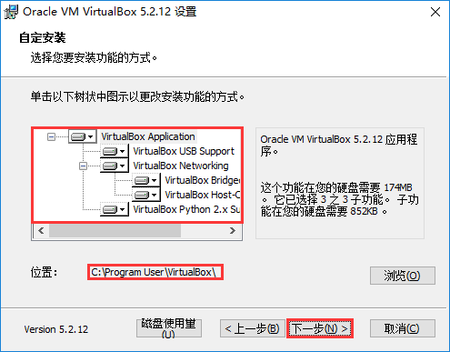

.. image:: ../../../image/MYZR-瑞芯微系列/MYZR-RK3568-EK320/安装虚拟机软件_03.png
   :alt: Install Virtual Machine Software_03
   :width: 100%

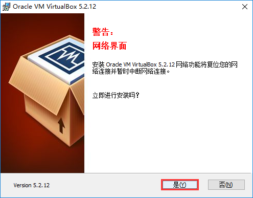

.. image:: ../../../image/MYZR-瑞芯微系列/MYZR-RK3568-EK320/安装虚拟机软件_05.png
   :alt: Install Virtual Machine Software_05
   :width: 100%

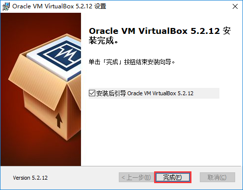

Configure Windows for Virtual Machine
~~~~~~~~~~~~~~~~~~~~~~~~~~~~~~~~~~~~~

Add Windows Network Adapter
^^^^^^^^^^^^^^^^^^^^^^^^^^^

.. image:: ../../../image/MYZR-瑞芯微系列/MYZR-RK3568-EK320/添加Windows网卡.jpeg
   :alt: Add Windows Network Adapter
   :width: 100%

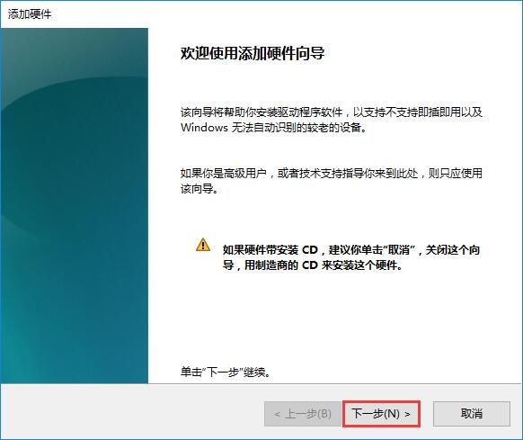

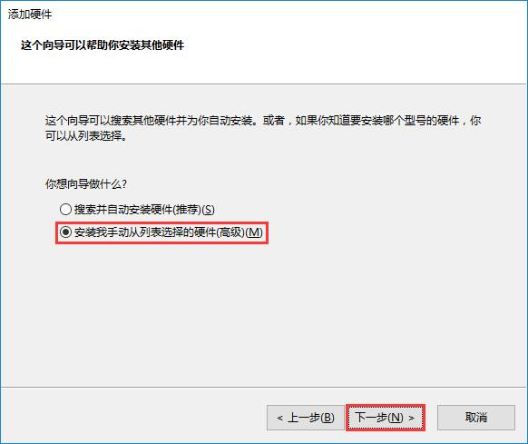

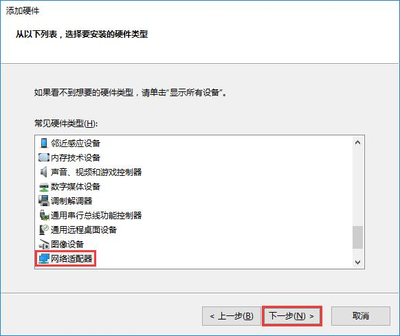

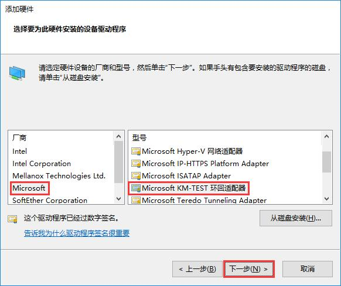

.. image:: ../../../image/MYZR-瑞芯微系列/MYZR-RK3568-EK320/添加Windows网卡_06.jpeg
   :alt: Add Windows Network Adapter_06
   :width: 100%

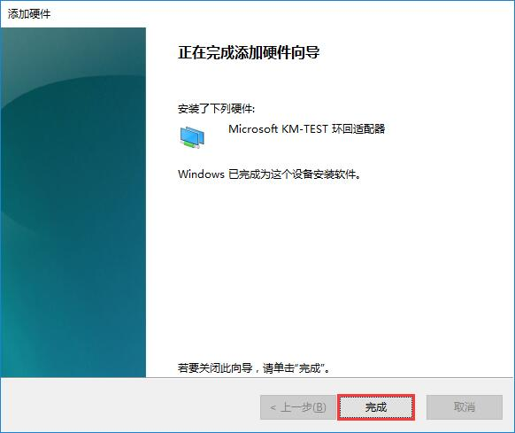

Configure Windows Network Adapter
^^^^^^^^^^^^^^^^^^^^^^^^^^^^^^^^^

.. image:: ../../../image/MYZR-瑞芯微系列/MYZR-RK3568-EK320/配置Windows网卡.jpeg
   :alt: Configure Windows Network Adapter
   :width: 100%

.. image:: ../../../image/MYZR-瑞芯微系列/MYZR-RK3568-EK320/配置Windows网卡_02.jpeg
   :alt: Configure Windows Network Adapter_02
   :width: 100%

.. image:: ../../../image/MYZR-瑞芯微系列/MYZR-RK3568-EK320/配置Windows网卡_03.jpeg
   :alt: Configure Windows Network Adapter_03
   :width: 100%

.. image:: ../../../image/MYZR-瑞芯微系列/MYZR-RK3568-EK320/配置Windows网卡_04.jpeg
   :alt: Configure Windows Network Adapter_04
   :width: 100%

Import Virtual Machine System
^^^^^^^^^^^^^^^^^^^^^^^^^^^^^

.. image:: ../../../image/MYZR-瑞芯微系列/MYZR-RK3568-EK320/导入虚拟机系统.png
   :alt: Import Virtual Machine System
   :width: 100%
   
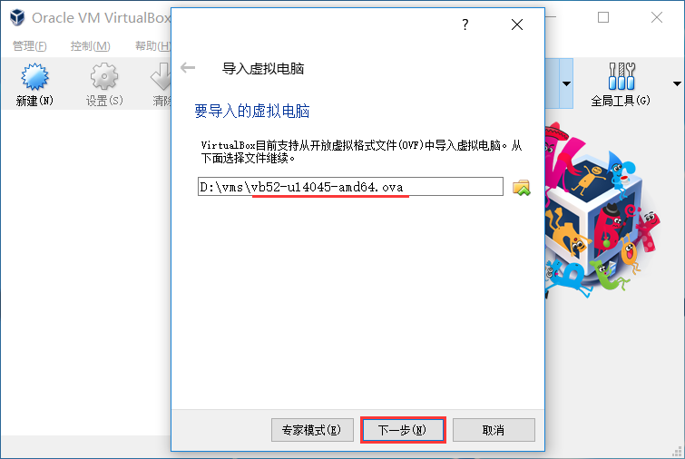

.. image:: ../../../image/MYZR-瑞芯微系列/MYZR-RK3568-EK320/导入虚拟机系统_03.png
   :alt: Import Virtual Machine System_03
   :width: 100%

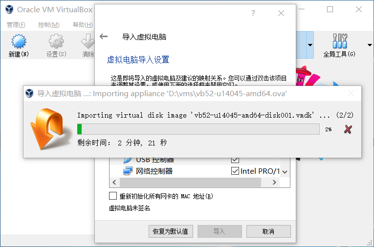

.. image:: ../../../image/MYZR-瑞芯微系列/MYZR-RK3568-EK320/导入虚拟机系统_05.png
   :alt: Import Virtual Machine System_05
   :width: 100%

Virtual Machine Settings
~~~~~~~~~~~~~~~~~~~~~~~~

.. image:: ../../../image/MYZR-瑞芯微系列/MYZR-RK3568-EK320/虚拟机设置.png
   :alt: Virtual Machine Settings
   :width: 100%

.. image:: ../../../image/MYZR-瑞芯微系列/MYZR-RK3568-EK320/虚拟机设置_02.png
   :alt: Virtual Machine Settings_02
   :width: 100%

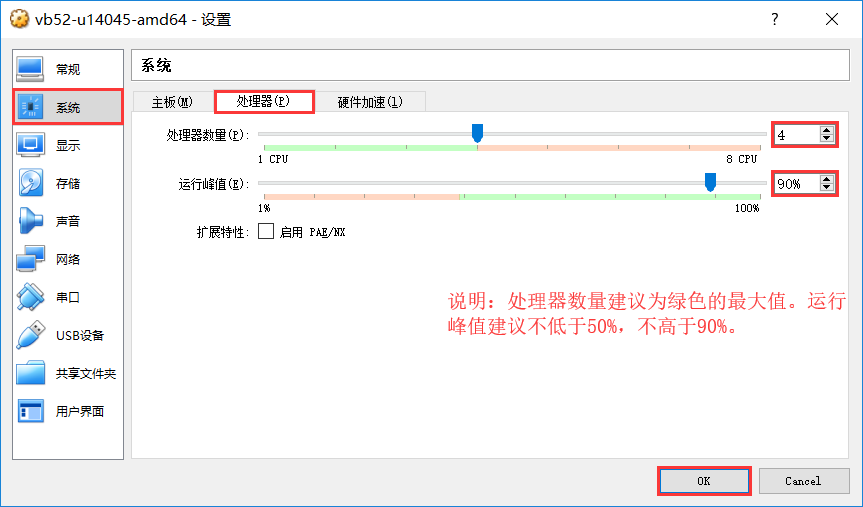

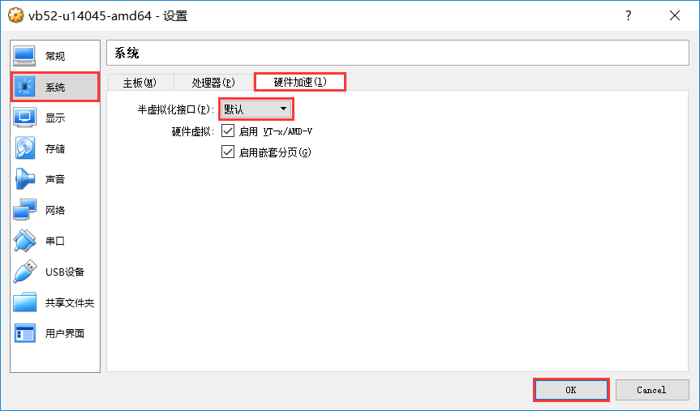

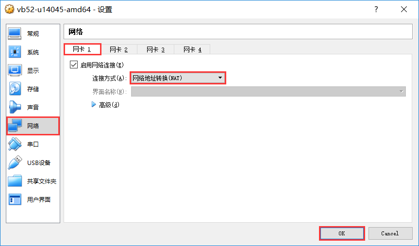

.. image:: ../../../image/MYZR-瑞芯微系列/MYZR-RK3568-EK320/虚拟机设置_06.png
   :alt: Virtual Machine Settings_06
   :width: 100%

.. image:: ../../../image/MYZR-瑞芯微系列/MYZR-RK3568-EK320/虚拟机设置_07.png
   :alt: Virtual Machine Settings_07
   :width: 100%

.. image:: ../../../image/MYZR-瑞芯微系列/MYZR-RK3568-EK320/虚拟机设置_08.png
   :alt: Virtual Machine Settings_08
   :width: 100%

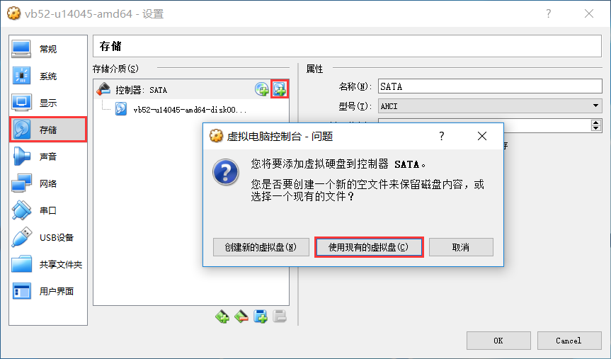

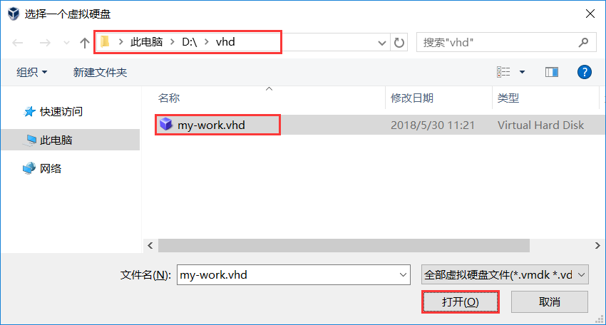

.. image:: ../../../image/MYZR-瑞芯微系列/MYZR-RK3568-EK320/虚拟机设置_11.png
   :alt: Virtual Machine Settings_11
   :width: 100%

.. image:: ../../../image/MYZR-瑞芯微系列/MYZR-RK3568-EK320/虚拟机设置_12.png
   :alt: Virtual Machine Settings_12
   :width: 100%

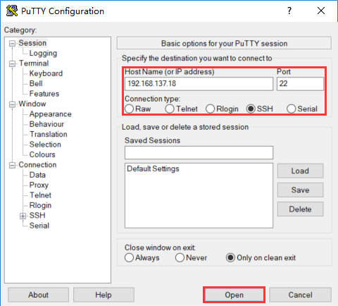

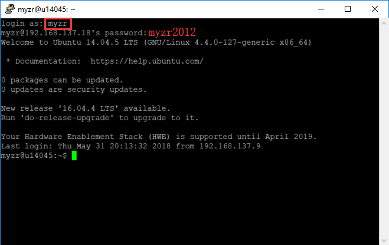

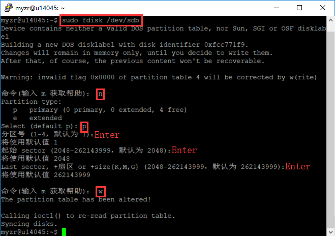

.. image:: ../../../image/MYZR-瑞芯微系列/MYZR-RK3568-EK320/虚拟机设置_16.png
   :alt: Virtual Machine Settings_16
   :width: 100%

.. image:: ../../../image/MYZR-瑞芯微系列/MYZR-RK3568-EK320/虚拟机设置_17.png
   :alt: Virtual Machine Settings_17
   :width: 100%

File Transfer Between Virtual Machine and PC
~~~~~~~~~~~~~~~~~~~~~~~~~~~~~~~~~~~~~~~~~~~~

Files can be transferred using Samba or SSH.

Samba:

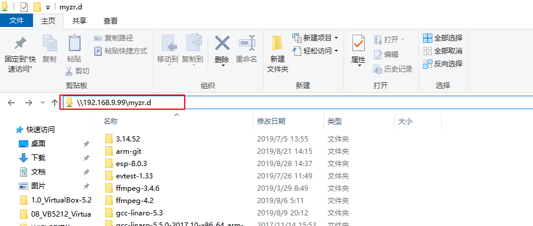

SSH:

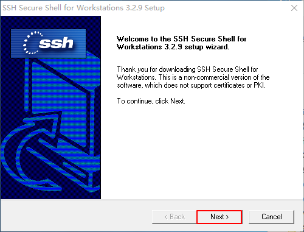

.. image:: ../../../image/MYZR-瑞芯微系列/MYZR-RK3568-EK320/虚拟机与PC互传文件_03.png
   :alt: File Transfer Between VM and PC_03
   :width: 100%

.. image:: ../../../image/MYZR-瑞芯微系列/MYZR-RK3568-EK320/虚拟机与PC互传文件_04.png
   :alt: File Transfer Between VM and PC_04
   :width: 100%

.. image:: ../../../image/MYZR-瑞芯微系列/MYZR-RK3568-EK320/虚拟机与PC互传文件_05.png
   :alt: File Transfer Between VM and PC_05
   :width: 100%

.. image:: ../../../image/MYZR-瑞芯微系列/MYZR-RK3568-EK320/虚拟机与PC互传文件_06.png
   :alt: File Transfer Between VM and PC_06
   :width: 100%

.. image:: ../../../image/MYZR-瑞芯微系列/MYZR-RK3568-EK320/虚拟机与PC互传文件_07.png
   :alt: File Transfer Between VM and PC_07
   :width: 100%

.. image:: ../../../image/MYZR-瑞芯微系列/MYZR-RK3568-EK320/虚拟机与PC互传文件_08.png
   :alt: File Transfer Between VM and PC_08
   :width: 100%

.. image:: ../../../image/MYZR-瑞芯微系列/MYZR-RK3568-EK320/虚拟机与PC互传文件_09.png
   :alt: File Transfer Between VM and PC_09
   :width: 100%

.. image:: ../../../image/MYZR-瑞芯微系列/MYZR-RK3568-EK320/虚拟机与PC互传文件_10.png
   :alt: File Transfer Between VM and PC_10
   :width: 100%

.. image:: ../../../image/MYZR-瑞芯微系列/MYZR-RK3568-EK320/虚拟机与PC互传文件_11.png
   :alt: File Transfer Between VM and PC_11
   :width: 100%

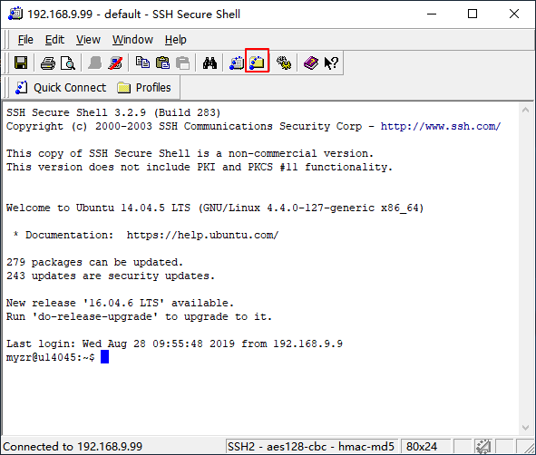

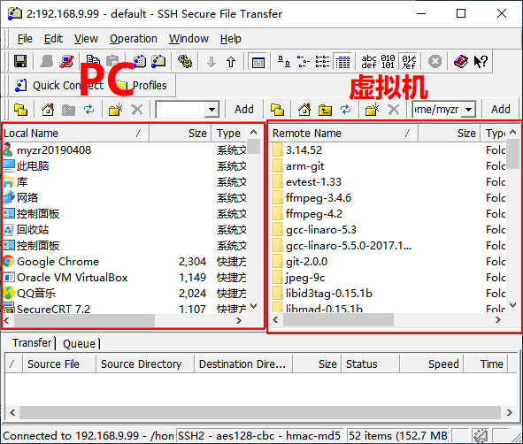

Virtual Machine Usage
~~~~~~~~~~~~~~~~~~~~~

User Accounts and Passwords
^^^^^^^^^^^^^^^^^^^^^^^^^^^

Default User: tangb, UserName: myzr, Password: myzr2012

Super User: root, UserName: root, Password: myzr2012

Source Code Compilation
-----------------------

Compilation Environment Requirements
~~~~~~~~~~~~~~~~~~~~~~~~~~~~~~~~~~~~

1. Compilation must be performed on Ubuntu system, version 20.04 or above. The author's host system is Ubuntu 20.04.

2. The host must have internet access, as the compilation process requires downloading certain files.

Download Source Code Package
~~~~~~~~~~~~~~~~~~~~~~~~~~~~

1. Download the rk3568 source code package. RK3568 provides SDKs for two kernel versions: 4.19 and 5.10. Download either version:

   SDK path for kernel 4.19: 3.Software Materials --> 3.1 Source Code --> Buildroot --> MYZR-RK3568pi_Linux-4.19_20250722.tar.bz2

   SDK path for kernel 5.10: 3.Software Materials --> 3.1 Source Code --> Linux-5.10.209 --> MYZR-RK3568pi_Linux-5.10_20250827.tar.bz2

2. Create compilation directory:

   .. code-block:: Bash

      mkdir -p ~/my-work/RK3568/02_sources/

3. Place the source code in the newly created directory and extract:

   .. code-block:: Bash

      tar -xjf MYZR-RK3568pi_Linux-4.19_20250722.tar.bz2 -C ~/my-work/RK3568/02_sources/

Dependency Installation
~~~~~~~~~~~~~~~~~~~~~~~

First-time compilation may require installing dependencies. Below are some dependencies that may need to be installed:

.. code-block:: Bash

   sudo apt-get install git ssh make gcc libssl-dev liblz4-tool \
   expect g++ patchelf chrpath gawk texinfo chrpath diffstat binfmt-support \
   qemu-user-static live-build bison flex fakeroot cmake gcc-multilib g++-multilib \
   unzip \
   device-tree-compiler libncurses-dev \
   time python3 rsync python-is-python3

SDK Configuration Loading
~~~~~~~~~~~~~~~~~~~~~~~~~

First-time compilation requires loading the SDK configuration file. Enter the following command to navigate to the SDK directory (RK356X_Linux or rk356x_linux5.10):

For kernel 4.19 SDK, use the following command to load the configuration file:

.. code-block:: Bash

   ./build.sh BoardConfig-rk3568-myzr.mk

For kernel 5.10 SDK, use the following command to load the configuration file:

.. code-block:: 

   ./build.sh myzr_rk3568_ddr4_defconfig

Full Compilation
~~~~~~~~~~~~~~~~

1. Run full compilation (this may take a long time), enter the following command:

   .. code-block:: Bash

      ./build.sh

2. After successful compilation, the images can be found in the rockdev/ directory, where update.img contains all images.

Compile U-Boot Separately
~~~~~~~~~~~~~~~~~~~~~~~~~

1. Clean generated files before compilation:

   .. code-block:: Bash

      cd u-boot/
      make clean

2. Return to the SDK root directory and compile U-Boot separately:

   .. code-block:: Bash

      cd ../
      ./build.sh uboot

Compile Kernel Separately
~~~~~~~~~~~~~~~~~~~~~~~~~

1. Clean generated files before compilation:

   .. code-block:: Bash

      cd kernel/
      make clean

2. Return to the SDK root directory and compile Kernel separately:

   .. code-block:: Bash

      cd ../
      ./build.sh kernel

Compile Recovery Separately
~~~~~~~~~~~~~~~~~~~~~~~~~~

Enter the following command in the SDK root directory:

.. code-block:: Bash

   ./build.sh recovery

Compile Buildroot Separately
~~~~~~~~~~~~~~~~~~~~~~~~~~~~

Enter the following command in the SDK root directory:

.. code-block:: Bash

   ./build.sh rootfs

Package Firmware
~~~~~~~~~~~~~~~~

Enter the following command in the SDK root directory:

.. code-block:: Bash

   ./mkfirmware.sh

Package update.img
~~~~~~~~~~~~~~~~~~

1. The packaged image update.img can be found in the rockdev directory under the SDK.

2. Enter the following command in the SDK root directory to complete image packaging:

   .. code-block:: Bash

      ./build.sh updateimg

After completing the above operations, follow the flashing manual to re-flash the firmware.

Finally, remind the user to re-flash and test.

Development Guide
-----------------

UBOOT Board-Level Files
~~~~~~~~~~~~~~~~~~~~~~~

U-Boot board-level files location: u-boot/board/rockchip/myzr_rk3568

U-Boot board-level configuration file: u-boot/include/configs/myzr_rk3568.h

U-Boot board-level compilation configuration file: u-boot/configs/myzr-rk3568_defconfig

Linux Kernel Board-Level Files
~~~~~~~~~~~~~~~~~~~~~~~~~~~~~~

Kernel board-level compilation configuration file: kernel/arch/arm64/configs/myzr_rk_defconfig

Kernel board-level device tree files: kernel/arch/arm64/boot/dts/rockchip/myzr*.dts*

Kernel development reference manual: *Reference Manual*.pdf in the cloud materials

GPIO
~~~~

1. GPIO Driver Architecture
^^^^^^^^^^^^^^^^^^^^^^^^^^^

The GPIO functionality of RK3568 is implemented through a three-level architecture: The hardware layer directly manages 32 pins per group through 5 built-in GPIO controllers (corresponding to device nodes ``gpiochip0~4``), with low-level register drivers provided by the manufacturer; The kernel layer abstracts hardware differences through the Linux GPIO subsystem and provides standard APIs (such as ``gpiod`` interface) for kernel drivers to operate any pin in a unified manner (e.g., setting direction, reading/writing levels); The user layer uses the Sysfs module (``/sys/class/gpio``) to expose the GPIO subsystem interface to user space, allowing direct pin control (export, direction configuration, level read/write) via command line without writing code. In this mechanism, hardware drivers are completed by the chip manufacturer, the Linux kernel implements general abstraction, and developers can control GPIO either through kernel API programming or through Sysfs for rapid debugging.

This section describes how to directly control GPIO (direction/level) through the command line in user space.

2. Pin Naming Convention
^^^^^^^^^^^^^^^^^^^^^^^^

RK3568's GPIO is divided into 5 groups (GPIO0~GPIO4), each containing 32 pins: A0-A7, B0-B7, C0-C7, D0-D7. For example:

- GPIO4_D5 represents the 5th pin in group D of the 4th group (GPIO4).

- GPIO0_B7 represents the 7th pin in group B of the 0th group (GPIO0).

3. GPIO Pin Number Calculation Formula
^^^^^^^^^^^^^^^^^^^^^^^^^^^^^^^^^^^^^^

.. code-block:: 

   pin = bank * 32 + number

bank: GPIO group number (0~4).

number: intragroup number, calculated by the following formula:

.. code-block:: 

   number = group * 8 + X

group: intragroup index corresponding to the letter (A=0, B=1, C=2, D=3).

X: specific number within the group (0~7).

For example, GPIO4_D5:

bank = 4 (GPIO4).

group = 3 (D group corresponds to 3).

X = 5 (the 5 in D5).

number = 3*8 + 5 = 29.

pin = 4*32 + 29 = 157.

4. Control GPIO via /sys/class/gpio Directory
^^^^^^^^^^^^^^^^^^^^^^^^^^^^^^^^^^^^^^^^^^^^^

.. code-block:: bash

   echo 157 > /sys/class/gpio/export     # Export GPIO157
   echo out > gpio157/direction          # Set as output mode
   echo 1 > gpio157/value                # Output high level
   echo 157 > /sys/class/gpio/unexport   # Release GPIO

.. note::

   Note: Some GPIOs may not be exportable if they are multiplexed for other functions (e.g., UART, I2C). Verify actual usage through the device tree.

PWM
~~~

1. PWM Hardware and Driver Framework
^^^^^^^^^^^^^^^^^^^^^^^^^^^^^^^^^^^^

On the RK3568 platform, the PWM hardware driver works through a counter and comparator: The APB bus clock source drives the counter to increment/decrement periodically after frequency division. When the preset period value is reached, it automatically resets to generate a basic signal; The comparator compares the counter value with the duty cycle threshold in real-time, outputs high/low levels, and switches between normal (high active) or inversed (low active) mode through the polarity control bit. The user layer controls PWM through the /sys/class/pwm interface or kernel APIs (such as pwm_config). The core layer manages controller resources through pwm_chip and registers interfaces. The low-level hardware adaptation layer needs to implement the pwm_ops operation set (including config, enable, etc.) to directly operate PWM registers for frequency, duty cycle, and enable configuration.

2. PWM Device Tree Configuration (Taking PWM14_M0 as an example, corresponding to pin 12 on J14 expansion interface)
^^^^^^^^^^^^^^^^^^^^^^^^^^^^^^^^^^^^^^^^^^^^^^^^^^^^^^^^^^^^^^^^^^^^^^^^^^^^^^^^^^^^^^^^^^^^^^^^^^^^^^^^^^^^^^^^^^

Configure clock and pins in rk3568.dtsi file:

.. code-block:: 

   pwm14: pwm@fe700020 {
           compatible = "rockchip,rk3568-pwm", "rockchip,rk3328-pwm";
           reg = <0x0 0xfe700020 0x0 0x10>;
           #pwm-cells = <3>;
           pinctrl-names = "active";
           pinctrl-0 = <&pwm14m0_pins>;
           clocks = <&cru CLK_PWM3>, <&cru PCLK_PWM3>;
           clock-names = "pwm", "pclk";
           status = "disabled";
     };

Add node in myzr-rk3568.dtsi:

.. code-block:: 

   &pwm14 {
       status = "okay";
       pinctrl-names = "active";
       pinctrl-0 = <&pwm14m0_pins>;  // Ensure pin multiplexing configuration is correct
   };

Add PWM client device node:

Reference the PWM controller and set parameters in the device node that needs to use PWM (such as backlight, buzzer, etc.). (If no device needs to use PWM, this configuration can be skipped). Below is a general configuration example:

.. code-block:: 

   // Example: Configure PWM14_M0 output to a device (e.g., backlight)
   / {
       pwm_dev: pwm-dev {
           compatible = "pwm-device";
           pwms = <&pwm14 0 10000000 1>; // Key parameter setting
           duty-cycle = <5000000>;    // 50% duty cycle
           pinctrl-names = "default";
           pinctrl-0 = <&pwm14m0_pins>; // Ensure consistency with controller configuration
       };
   };

Driver matching: ``compatible = "pwm-device"`` triggers the PWM driver in the kernel with the corresponding compatible string. After the driver matches the node through the ``of_device_id`` table, it calls the ``probe`` function to initialize the hardware.

PWM parameter passing: ``pwms = <&pwm14 0 10000000 1>`` binds channel 0 of the pwm14 controller, sets the period to 10ms (10000000ns, corresponding to 100Hz frequency), and polarity to 1 (high level active).

``duty_ns = 5000000`` specifies an initial duty cycle of 5ms (50% duty cycle). The driver writes this to hardware registers through ``pwm_config()``.

Controller enable: ``&pwm14 { status="okay" }`` enables the PWM14 hardware controller inside the SoC. The underlying driver will initialize its clock and reset signals, mapping the physical register address to the kernel virtual address.

The entire process passes hardware parameters directly to the driver through the device tree, achieving PWM waveform output (PWM is initialized with 100Hz frequency, 50% duty cycle, and inverted polarity).

3. Operate PWM via Sysfs Interface
^^^^^^^^^^^^^^^^^^^^^^^^^^^^^^^^^^

1. Find PWM controller path

   Enter command:

   .. code-block:: 

      ls /sys/class/pwm  # Display all PWM controllers, e.g., pwmchip0, pwmchip1, etc.

   RK3568's PWM controllers are named ``pwmchip*``. Confirm the specific number based on the address of ``&pwm14`` in the device tree. Assume pwm14 corresponds to ``pwmchip3``.

2. Export PWM channel

   .. code-block:: 

      echo 0 > /sys/class/pwm/pwmchip3/export  # Export channel 0 of pwm14

   After execution, the ``/sys/class/pwm/pwmchip3/pwm0`` directory will be created.

3. Configure period and duty cycle

   Enter commands:

   .. code-block:: bash

      echo 10000000 > /sys/class/pwm/pwmchip3/pwm0/period    # Set 10ms period (100Hz)
      echo 5000000 > /sys/class/pwm/pwmchip3/pwm0/duty_cycle  # Set 5ms duty cycle (50%)
      echo 1 > /sys/class/pwm/pwmchip3/pwm0/enable            # Enable PWM output

   Parameters are in nanoseconds. Note that duty cycle cannot exceed the period value.

   .. note::

      Note: If export or enable fails, check if the channel is occupied by other functions such as UART.

4. Dynamically adjust duty cycle

   .. code-block:: 

      # Adjust to 70% duty cycle

UART
~~~~

1. Device Tree Configuration (Taking UART3_M1 as an example, corresponding to pins 33 and 35 on J14 expansion interface)
^^^^^^^^^^^^^^^^^^^^^^^^^^^^^^^^^^^^^^^^^^^^^^^^^^^^^^^^^^^^^^^^^^^^^^^^^^^^^^^^^^^^^^^^^^^^^^^^^^^^^^^^^^^^^^^^^^^^^^^

.. code-block:: 

   &uart3 {
       status ="okay";
       pinctrl-name = "default";
       pinctrl-0 = <&uart3m1_xfer>;
   };

The role of ``pinctrl-0 = <&uart3m1_xfer>`` is to bind the TX/RX pins of UART3 to the ``uart3m1_xfer`` multiplexing group.

``uart3m1_xfer`` is already defined in ``rk3568-pinctrl.dtsi``:

.. code-block:: 

   uart3m1_xfer: uart3m1-xfer {
       rockchip,pins =
           /* uart3_rxm1 */
           <3 RK_PC0 4 &pcfg_pull_up>,
           /* uart3_txm1 */
           <3 RK_PB7 4 &pcfg_pull_up>;
   };

After the device tree is configured, UART3 is registered as ``/dev/ttyS3`` in the system. Verify with ``ls /dev/ttyS*``.

2. Debugging Tools
^^^^^^^^^^^^^^^^^^

Short the rx and tx of ``uart3m1``, and use the test file placed in the filesystem for transceiver testing:

.. code-block:: yaml

   =====> Input:
   # /my-demo/serial_test.out /dev/ttyS3 "myzr"
   =====> Output:
   Starting send data...finish
   Starting receive data:
   ASCII: 0x6d      Character: m
   ASCII: 0x79      Character: y
   ASCII: 0x7a      Character: z
   ASCII: 0x72      Character: r
   ASCII: 0x0   Character:

I2C
~~~

1. I2C Subsystem Architecture Overview
^^^^^^^^^^^^^^^^^^^^^^^^^^^^^^^^^^^^^^

On the RK3568 platform, the I2C controller is implemented based on the standard Linux I2C framework, which is divided into hardware abstraction layer (adapter driver) and device driver layer. The hardware layer abstracts the I2C bus controller through ``i2c_adapter``, and the device layer describes slave devices through ``i2c_client``. The driver logic is implemented through ``i2c_driver``. RK3568's I2C controller supports multi-master mode, clock division (up to 400kHz), and interrupt/DMA transmission. Its physical layer follows open-drain output characteristics, and SCL/SDA signals are implemented through GPIO multiplexing.

2. I2C Device Tree Configuration (Taking touch chip mounted on I2C1 as an example)
^^^^^^^^^^^^^^^^^^^^^^^^^^^^^^^^^^^^^^^^^^^^^^^^^^^^^^^^^^^^^^^^^^^^^^^^^^^^^^^^^^

.. code-block:: 

   &i2c1 {
       status = "okay";

       gt1x: gt1x@14 {
           compatible = "goodix,gt1x";
           reg = <0x14>;
           pinctrl-names = "default";
           pinctrl-0 = <&touch_gpio>;
           goodix,rst-gpio = <&gpio0 RK_PB6 GPIO_ACTIVE_HIGH>;
           goodix,irq-gpio = <&gpio0 RK_PB5 IRQ_TYPE_LEVEL_LOW>;
       };
   };

In this node, the kernel matches the driver through the ``compatible`` string. For example, the driver code needs to define the same ``of_device_id`` table:

.. code-block:: 

   static const struct of_device_id gt1x_of_match[] = {
       { .compatible = "goodix,gt1x" },
       {}
   };

The address of the device on the I2C bus (0x14). The driver obtains the reg address through the ``i2c_client`` structure. ``pinctrl-*`` references the ``touch_gpio`` node to configure the multiplexing function and electrical properties of GPIO.

Driver and device tree matching: When the ``compatible`` value matches the driver, the kernel calls the ``.probe()`` function. In the probe function, the driver will obtain configurations from the device tree including pin configuration, chip model, etc.

When the device is successfully registered on I2C, use the command:

.. code-block:: 

   i2cdetect -y 1

You can see the letter "UU" appearing at address 14 on i2c1, indicating that the device is successfully mounted on I2C.

SPI
~~~

1. Linux SPI Framework Overview
^^^^^^^^^^^^^^^^^^^^^^^^^^^^^^^

The Linux SPI framework provides a standardized SPI device driver support system for the kernel, consisting of SPI Core, controller driver layer, device abstraction layer, and user space interface. As the framework hub, SPI Core manages the bus, registers devices, and maintains standard transmission APIs. It dynamically binds controllers and slave devices through spi_alloc_device() and spi_add_device(). Hardware-related SPI controller drivers need to implement low-level operations such as clock configuration and data transmission. Each controller corresponds to a struct spi_controller instance; connected slave devices are described through struct spi_device structures, including parameters such as device address, chip select, and communication mode. The core data transmission mechanism triggers the transmission callback function implemented by the controller through synchronous/asynchronous interfaces such as spi_sync(), supporting both DMA and interrupt transmission modes. The framework also exposes SPI interfaces to user space through /dev/spidev* device nodes, enabling hardware register operations from the application layer.

2. SPI Device Tree Configuration (Taking SPI3_M1 as an example, miso and mosi correspond to pins 19 and 21 on J14 expansion interface)
^^^^^^^^^^^^^^^^^^^^^^^^^^^^^^^^^^^^^^^^^^^^^^^^^^^^^^^^^^^^^^^^^^^^^^^^^^^^^^^^^^^^^^^^^^^^^^^^^^^^^^^^^^^^^^^^^^^^^^^^^^^^^^^^^^^^^

.. code-block:: c++

   &spi3 {
       status = "okay";
       pinctrl-names = "default";
       pinctrl-0 = <&spi3m1_pins>;  // Specify M1 mode pin group
       #address-cells = <1>;
       #size-cells = <0>;

       spidev@0 {
           compatible = "spidev";
           reg = <0>;
           spi-max-frequency = <10000000>;  // Maximum frequency 10MHz
       };
   };

When the kernel parses this node during startup, it calls the driver code in ``drivers/spi/spi-rockchip.c`` to initialize the SPI3 controller and registers it as ``/sys/bus/spi/devices/spi3.0``. SPI devices are addressed through Chip Select (CS) signals. ``#address-cells=1`` means the ``reg`` attribute corresponds to the CS number (e.g., ``reg=<0>`` means using CS0 line of SPI3). When generating an SPI device, the kernel controls the corresponding GPIO pin to output low level according to the ``reg`` value to activate the target device.

After ``compatible="spidev"`` matches successfully, the kernel loads ``drivers/spi/spidev.c`` and creates the device node ``/dev/spidev3.0``. User-mode programs do not need to develop kernel drivers and can directly initiate SPI data transmission requests through system calls such as ``ioctl(SPI_IOC_MESSAGE)`` or ``write()``. After the request is received by the ``spidev`` driver, the kernel submits the data transmission task to the SPI controller driver (such as SPI3 controller) through the ``spi_async()`` interface. Finally, the hardware controller generates SCK signals according to the configured clock polarity, rate, and other parameters, sends data streams through the MOSI pin, and synchronously reads response data from the MISO pin to complete full-duplex communication.

3. Debugging Tools
^^^^^^^^^^^^^^^^^^

Short miso and mosi of SPI3_M1, run the SPI test program in the filesystem:

.. code-block:: 

   =====> Input:
   ./spidev_test -D /dev/spidev3.0
   =====> Output:
   spi mode: 0
   bits per word: 8
   max speed: 500000 Hz (500 KHz)

   FF FF FF FF FF FF
   40 00 00 00 00 95
   FF FF FF FF FF FF
   FF FF FF FF FF FF
   FF FF FF FF FF FF
   DE AD BE EF BA AD
   F0 0D

Indicates SPI function is normal.