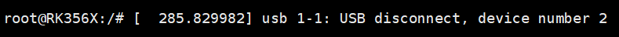
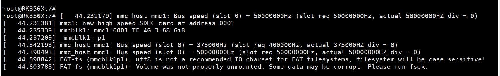
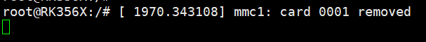
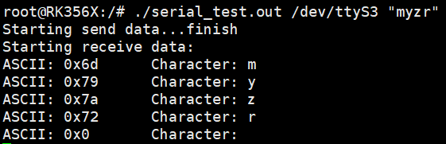
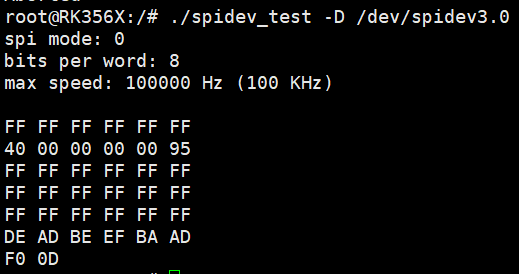

.. raw:: html

   

Test Guide
==========

Ethernet Test
-------------

Ethernet Port 1
~~~~~~~~~~~~~~~

Interface Silk Screen: U9

System Interface: eth0

Test Description: Test by sending ICMP packets from the development board to PC

Test Procedure:

1. Configure PC wired network card IP as 192.168.137.99

2. Connect development board Ethernet port to PC Ethernet port using network cable

3. Check Ethernet port 1 information, enter command:

.. code-block:: shell

   ifconfig eth0

4. Configure IPv4 address for Ethernet port 1, enter command:

.. code-block:: shell

   ifconfig eth0 192.168.137.18 netmask 255.255.255.0

5. Check Ethernet port 1 information again to confirm IPv4 address is configured successfully. If not successful, restart from step 4. Enter command:

.. code-block:: shell

   ifconfig eth0

6. Verify Ethernet port 1 by entering command:

.. code-block:: shell

   ping -I eth0 192.168.137.99 -c 3

"0% packet loss" indicates test passed.

Ethernet Port 2
~~~~~~~~~~~~~~~

Interface Silk Screen: U5

System Interface: eth1

Test Description: Test by sending ICMP packets from the development board to PC

Test Procedure:

1. Configure PC wired network card IP as 192.168.137.99

2. Connect development board Ethernet port to PC Ethernet port using network cable

3. Check Ethernet port 2 information, enter command:

.. code-block:: shell

   ifconfig eth1

4. Configure IPv4 address for Ethernet port 2, enter command:

.. code-block:: shell

   ifconfig eth1 192.168.137.22 netmask 255.255.255.0

5. Check Ethernet port 2 information again to confirm IPv4 address is configured successfully. If not successful, restart from step 4. Enter command:

.. code-block:: shell

   ifconfig eth1

6. Verify Ethernet port 2 by entering command:

.. code-block:: shell

   ping -I eth1 192.168.137.99 -c 3

"0% packet loss" indicates test passed.

USB Test
--------

Interface Silk Screen: J1

Test Description: Test by plugging and unplugging USB storage device (USB flash drive)

Test Procedure:

1. Insert USB flash drive into baseboard USB port. The system will output similar information:

.. image:: ../../../image/MYZR-瑞芯微系列/MYZR-RK3568-EK320 /USB测试.png
   :alt: USB Test
   :width: 100%

2. Remove USB flash drive from baseboard. The system will output similar information:

SD Interface Test
-----------------

Interface Silk Screen: J12

Test Description: Test by plugging and unplugging TF card

Test Procedure:

1. Insert TF card into SD slot. The development board will output the following information:

2. Remove TF card. The output will be:

Audio Playback Test
-------------------

Interface Silk Screen: P1

Test Description: Play audio file to verify audio playback function

Test Procedure:

1. Connect headphones or speaker to the corresponding interface

2. Enter command to test:

.. code-block:: shell

   aplay ./mytest.wav

Audio output from headphones or speaker indicates audio playback test passed.

Recording Test
--------------

Interface Silk Screen: P1

Test Description: Record and play back audio file for testing

Test Procedure:

1. Connect headset with MIC to the corresponding interface

2. Enter command to record for 4 seconds:

.. code-block:: shell

   arecord -d 4 -f S16_LE record.wav

3. Play back the recorded audio file, enter command:

.. code-block:: shell

   aplay record.wav

Recorded audio output from headphones indicates recording test passed.

5G Module Interface Test
------------------------

Interface Silk Screen: J8, U19

Test Description: After 5G connection is successful, the development board sends ICMP packets to external network to verify connection

Test Procedure:

1. Power off development board, connect 5G module, attach antenna, insert SIM card, then power on

2. Dial-up connection, enter command:

.. code-block:: shell

   ./quectel-CM &

3. Get IP address, enter command:

.. code-block:: shell

   udhcpc -i usb0

4. Internet access test, enter command:

.. code-block:: shell

   ping -I usb0 www.baidu.com -c 3

"0% packet loss" indicates 5G module can access internet.

M.2 Interface Test
------------------

Interface Silk Screen: J7

Test Description: Check mounting status after connecting hard drive

Test Procedure:

1. Power off development board, connect M.2 interface hard drive, then power on

2. Create mount point and mount hard drive, enter command:

.. code-block:: shell

   mkdir /nvme    
   mount /dev/nvme0n1p1 /nvme/

3. Check mount status, enter command:

.. code-block:: shell

   df -h

4. Successful mount will show similar output:

/dev/nvme0n1p1 499M 10M 490M 2% /nvme

5. Unmount hard drive, enter command:

.. code-block:: shell

   umount /nvme

UART Test
---------

Interface Silk Screen: J14

Test Description: Test using UART loopback (self-transmit and self-receive)

Test Procedure:

1. Short pins J14-33 (UART3_TX_M1) and J14-35 (UART3_RX_M1)

2. Enter command for transmit/receive test:

.. code-block:: shell

   ./serial_test.out /dev/ttyS3 "myzr"

Output similar to above indicates UART test passed. Press 'Ctrl + C' to exit.

SPI Interface Test
------------------

Interface Silk Screen: J14

Test Description: Test using SPI loopback (self-transmit and self-receive)

Test Procedure:

1. Short pins J14-19 (HDMIRX_INT_L_GPIO4_C3) and J14-21 (UART9_TX_M1)

2. Enter command for transmit/receive test:

.. code-block:: shell

   ./spidev_test -D /dev/spidev3.0

Output similar to above indicates SPI test passed.

IR Test
-------

Interface Silk Screen: IR1

Test Description: Receive IR signals and print corresponding data

Test Procedure:

1. Prepare an IR remote control or use phone IR remote app

2. Enable debug print, enter commands:

.. code-block:: shell

   echo 1 > /sys/module/rockchip_pwm_remotectl/parameters/code_print
   echo 1 > /sys/module/rockchip_pwm_remotectl/parameters/dbg_level

3. Point remote control at IR receiver and press any button

4. Development board displaying button information indicates successful reception.

Display Test
------------

Interface Silk Screen: J2

Test Description: Check if display shows correctly when development board boots up

Test Procedure:

1. Connect HDMI display to development board HDMI port, power on the board

Normal display output indicates test passed.