.. raw:: html

   

刷新固件
========

安装DriverAssitant驱动
----------------------

* 从下载的网盘资料中找到Rockchip USB驱动安装包，路径为：3.软件资料-->3.2-工具-->DriverAssitant_v5.11.zip

* 解压DriverAssitant_v5.11.zip后进入DriverAssitant_v5.11文件夹

* 直接双击DriverInstall.exe程序进行驱动安装，安装步骤如下:

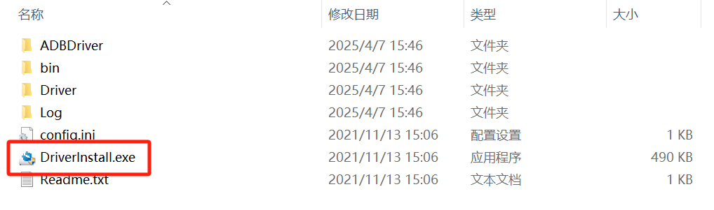

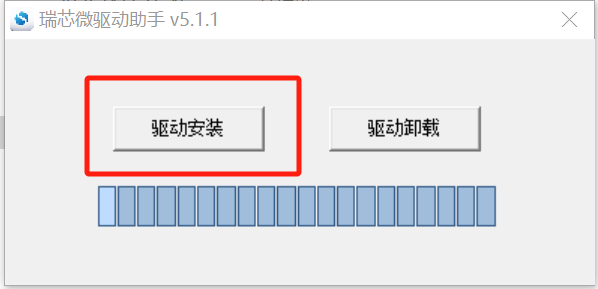

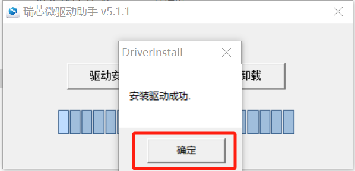

.. image:: ../../../image/MYZR-瑞芯微系列/MYZR-RK3568-EK320/安装DriverAssitant驱动_04.png
   :alt: 安装DriverAssitant驱动_04
   :width: 100%

使用RKDevTool工具进行刷机
-------------------------

* 从下载的网盘资料中找到RKDevTool驱动安装包，路径为：3.软件资料-->3.2-工具-->RKDevTool_Release_v3.15.zip

* 解压RKDevTool_Release_v3.15.zip后进入RKDevTool_Release_v3.15文件夹

* 双击RKDevTool.exe打开程序

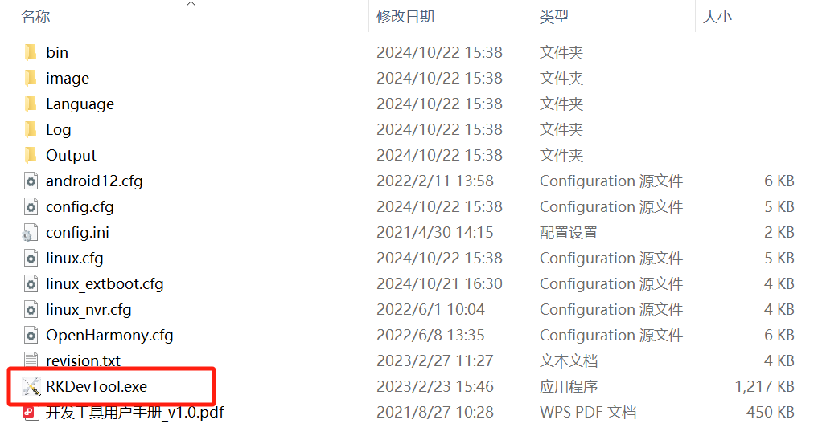

单独烧录
~~~~~~~~

烧录uboot
^^^^^^^^^

* 开发板的Type-C接口U4（对照丝印图确定按键）接上烧录线，按住开发板VOL+按键(对照丝印图确定按键)，再给开发板上电，上电3秒左右可看到开发板进入了download模式，点击如下位置，选择相应的uboot.img文件

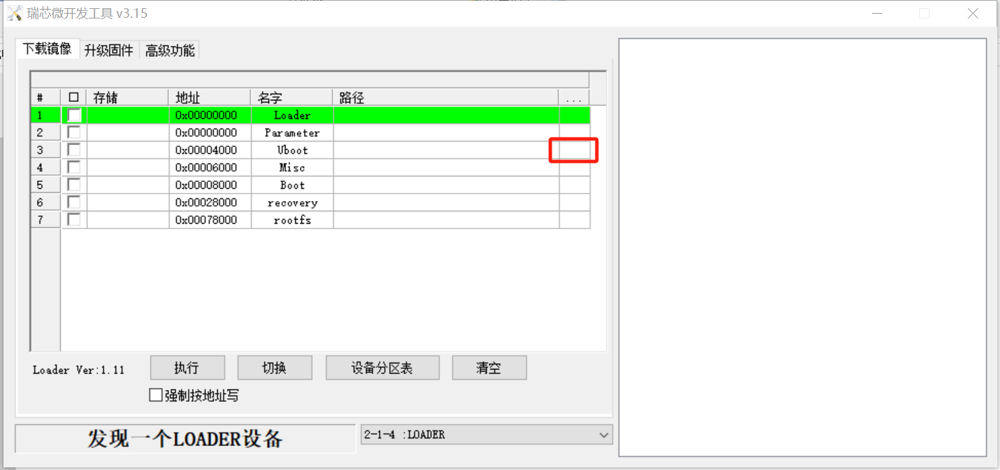

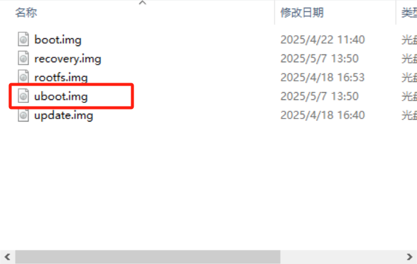

* 如下图顺序操作完成勾选，点击"设备分区表"后在弹窗点击"是"

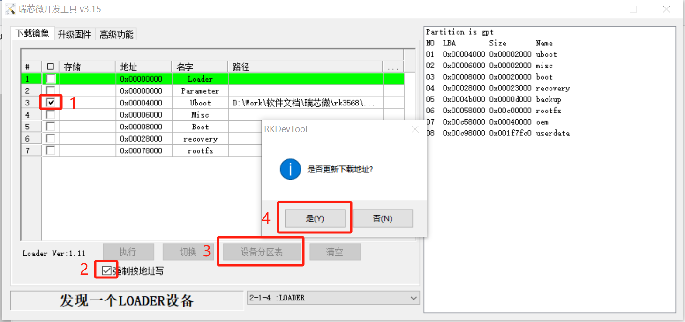

* 点击"确定"，完成读取分区表

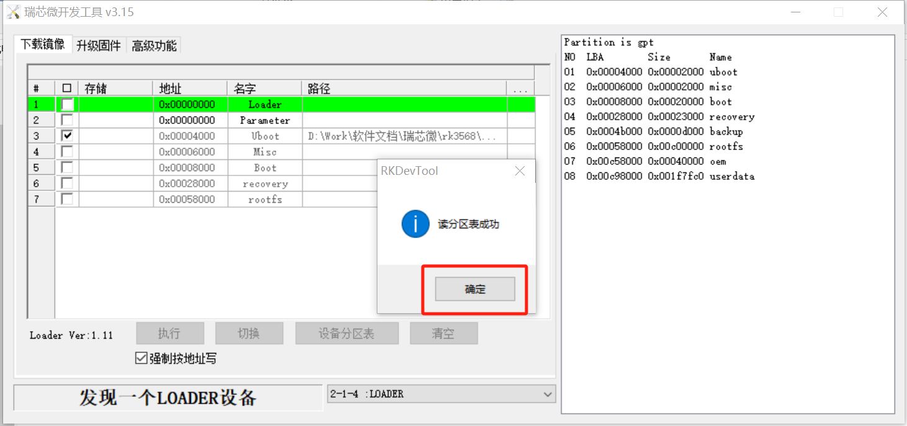

* 点击"执行"按钮进行uboot烧录，烧录成功右边会显示下载完成

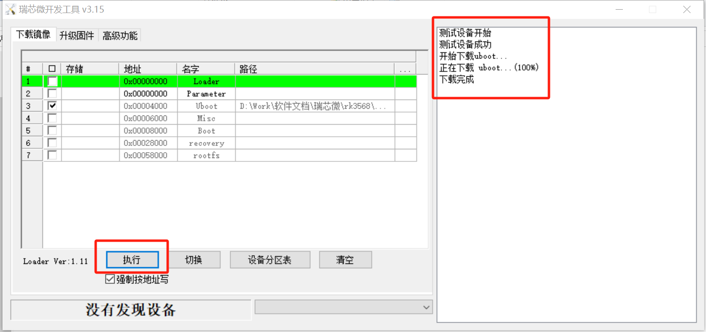

烧录boot
^^^^^^^^

* 开发板的Type-C接口U4（对照丝印图确定按键）接上烧录线，按住开发板VOL+按键(对照丝印图确定按键)，再给开发板上电，上电3秒左右可看到开发板进入了download模式，点击如下位置，选择相应的boot.img文件

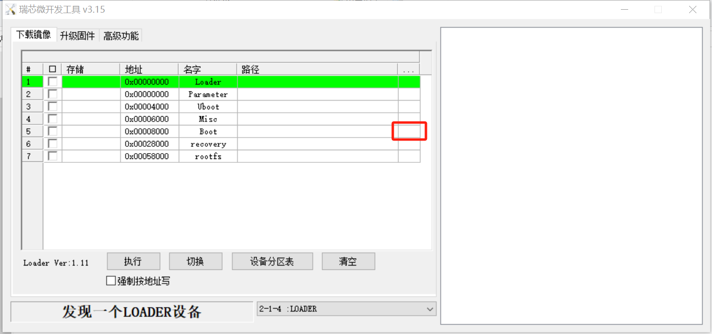

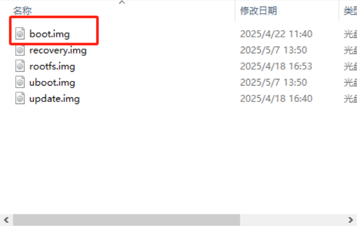

* 如下图顺序操作完成勾选，点击"设备分区表"后在弹窗点击"是"

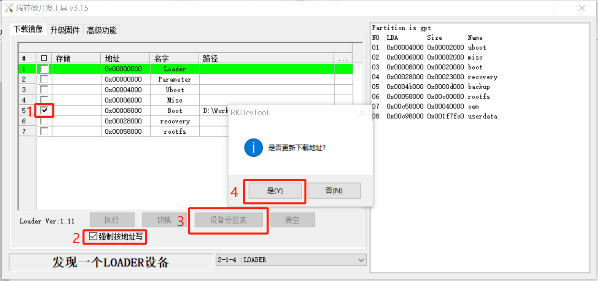

* 点击"确定"，完成读取分区表

* 点击"执行"按钮进行boot烧录，烧录成功右边会显示下载完成

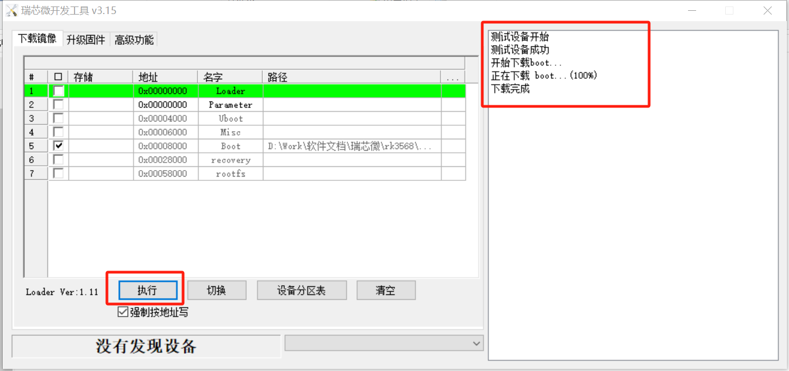

烧录recovery
^^^^^^^^^^^^

* 开发板的Type-C接口U4（对照丝印图确定按键）接上烧录线，按住开发板VOL+按键(对照丝印图确定按键)，再给开发板上电，上电3秒左右可看到开发板进入了download模式，点击如下位置，选择相应的recovery.img文件

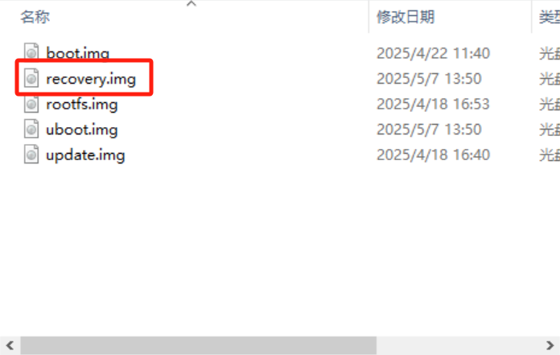

* 如下图顺序操作完成勾选，点击"设备分区表"后在弹窗点击"是"

* 点击"确定"，完成读取分区表

* 点击"执行"按钮进行recovery烧录，烧录成功右边会显示下载完成

烧录rootfs
^^^^^^^^^^

* 开发板的Type-C接口U4（对照丝印图确定按键）接上烧录线，按住开发板VOL+按键(对照丝印图确定按键)，再给开发板上电，上电3秒左右可看到开发板进入了download模式，点击如下位置，选择相应的rootfs.img文件

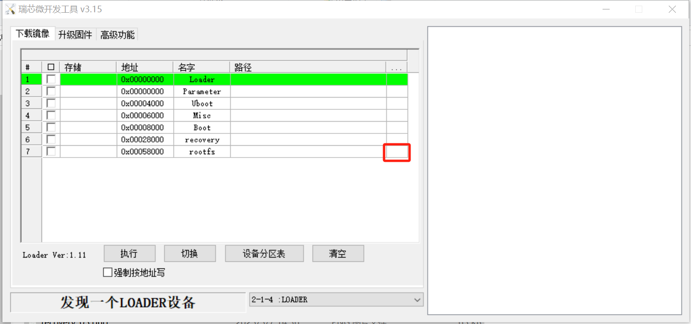

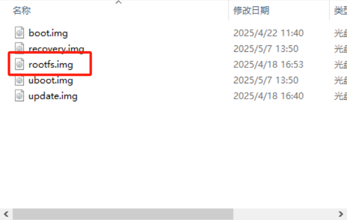

* 如下图顺序操作完成勾选，点击"设备分区表"后在弹窗点击"是"

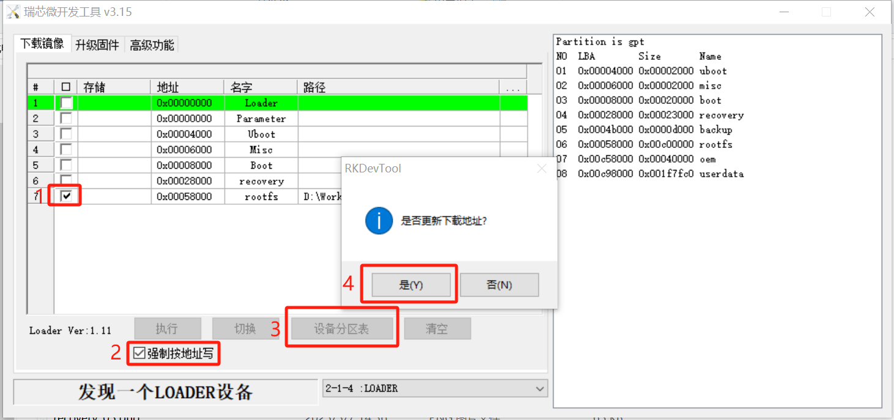

* 点击"确定"，完成读取分区表

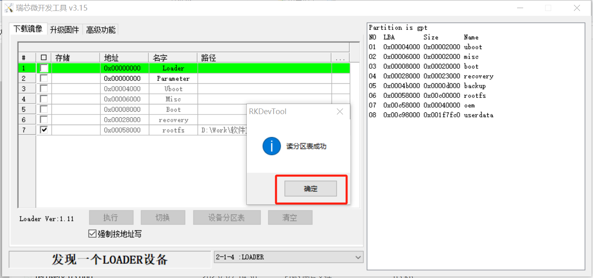

* 点击"执行"按钮进行rootfs烧录，烧录成功右边会显示下载完成

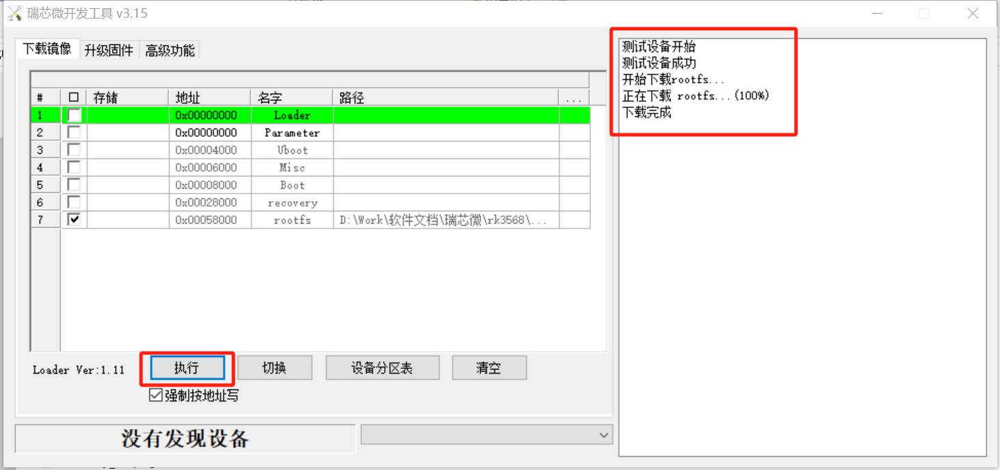

完整烧录
~~~~~~~~

* 点击进入"升级固件"界面

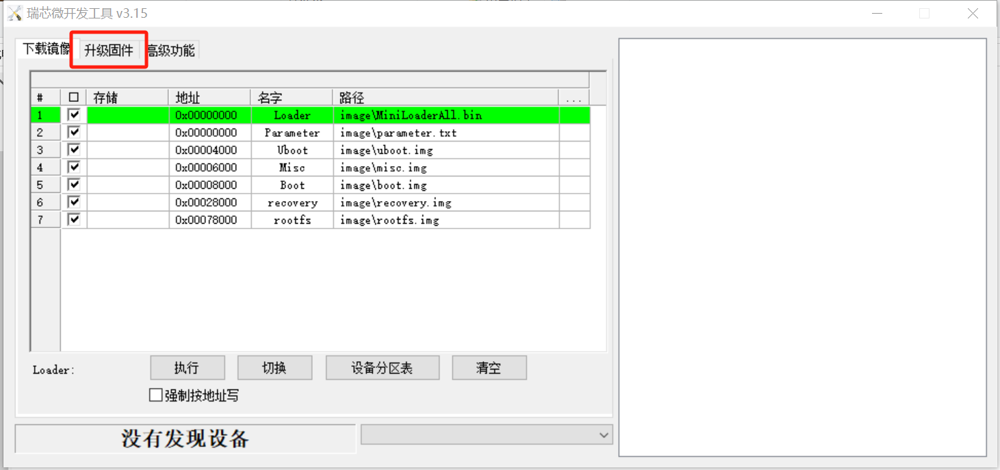

* 点击"固件"按钮，然后选择相应的img镜像文件

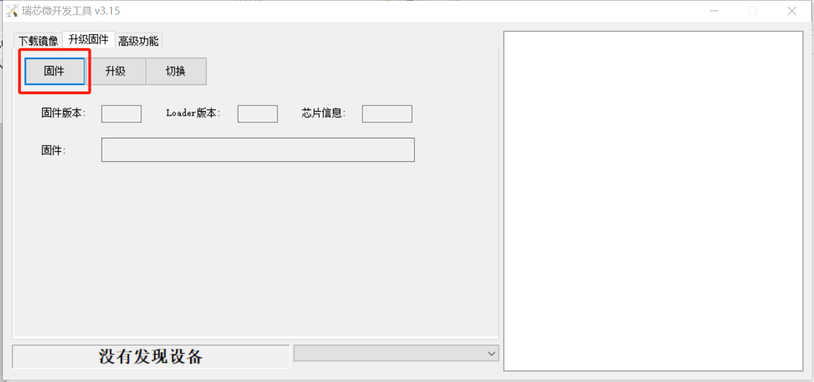

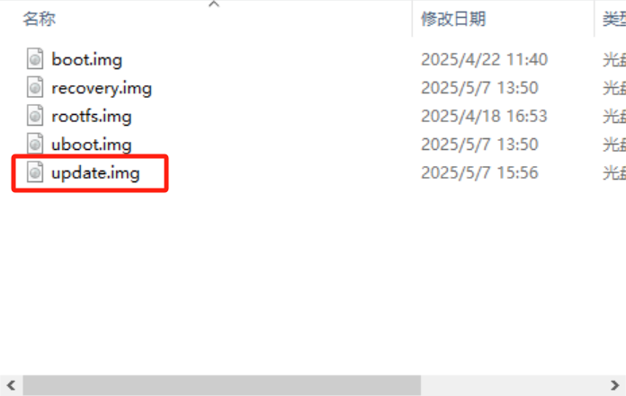

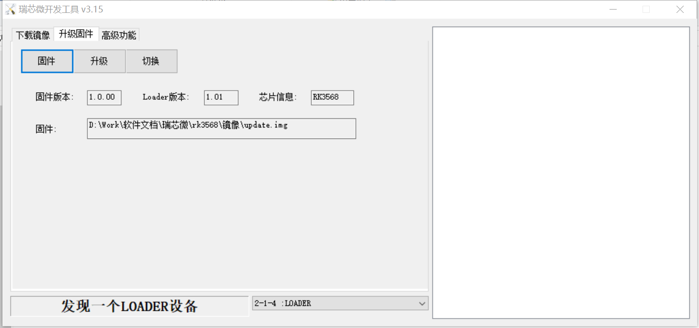

* 开发板的Type-C接口U4（对照丝印图确定按键）接上烧录线，按住开发板VOL+按键(对照丝印图确定按键)，再给开发板上电，上电3秒左右可看到开发板进入了download模式

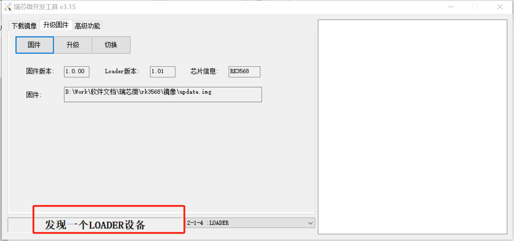

* 点击"升级"按钮进行刷机，刷成功右边显示成功字符

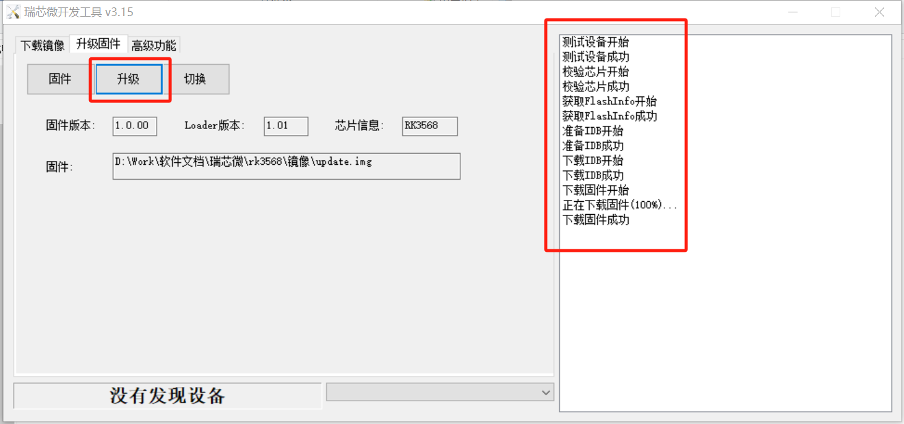

* 烧录完成后，开发板系统会自动重启。
