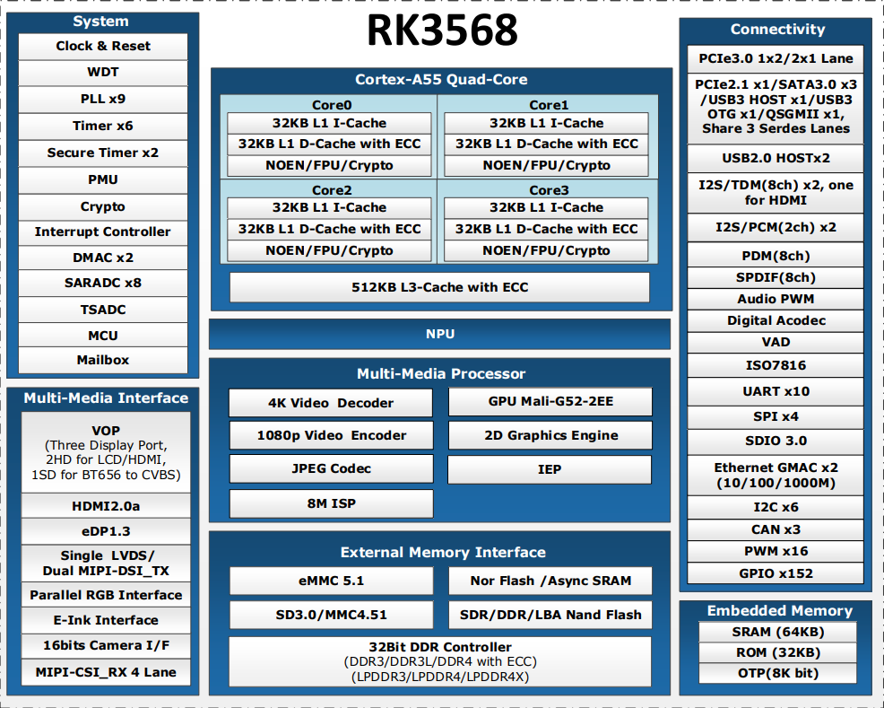

.. raw:: html

   

平台介绍
========

产品简介
--------

瑞芯微RK3568是瑞芯微电子于2021年正式推出的中高端通用嵌入式SoC芯片，专为物联网、边缘计算、工业控制及多媒体处理等场景打造，是前一代经典产品RK3399的迭代升级款。

目标应用
--------

工业控制
~~~~~~~~

1.工业自动化：可用于工业自动化生产线中的控制器、人机界面（HMI）等设备，实现对生产过程的精确控制和监控，能快速处理各种传感器数据和控制指令，确保生产线高效稳定运行。

2.智能工厂：在智能工厂的建设中，RK3568 可作为边缘计算节点，对工厂内的各种数据进行实时分析和处理，实现设备的智能运维、生产流程的优化以及质量检测等功能，提高工厂的生产效率和管理水平。

智能家居
~~~~~~~~

1.智能音箱：凭借其强大的音频处理能力，RK3568 可以为智能音箱提供清晰、流畅的语音交互体验，支持语音唤醒、语音识别、音乐播放等功能，同时还能与其他智能家居设备进行联动控制。

2.智能家电：可应用于智能电视、空调、冰箱等家电设备中，实现智能化的操作和管理。例如，使智能电视具备更流畅的视频播放效果、更智能的语音控制功能，以及与其他智能家居设备的互联互通能力。

物联网设备
~~~~~~~~~~

1.智能网关：作为物联网设备的核心枢纽，RK3568 能够连接多种不同类型的传感器和设备，实现协议转换、数据汇聚和传输等功能，为物联网系统提供稳定、高效的连接服务。

2.智能监控：在智能监控领域，可用于网络摄像机、视频监控终端等设备，支持高清视频编码和解码，实现实时监控、智能分析（如人脸识别、行为分析等）功能，保障安全监控的高效性和准确性。

消费电子
~~~~~~~~

1.平板电脑：为平板电脑提供强劲的性能支持，能够满足用户在日常办公、娱乐、学习等方面的需求，如流畅运行办公软件、观看高清视频、玩轻度游戏等。

2.电子书阅读器：RK3568 可以为电子书阅读器提供良好的显示效果和流畅的翻页体验，同时支持多种电子书格式的解码和阅读功能，满足用户的阅读需求。

主要特点
--------

* 高性能处理器：四核Cortex-A55，主频最高2.0GHz，集成NEON协处理器  
* 强大图形处理能力：Mali-G52 GPU，OpenGL ES 3.2，OpenCL 2.0，Vulkan 1.0   

* AI运算能力：集成1TOPS NPU，支持TensorFlow、Caffe、MXNet、PyTorch、ONNX等AI框架部署

* 丰富显示接口：HDMI2.0，eDP，MIPI-DSI，LVDS，RGB，支持双屏异显及4K视频输出

* 丰富外设接口：USB2.0，USB3.0，SATA3.0， PCIe，UART，SPI，I2C，CAN（如硬件支持）

* 低功耗设计：支持动态调频调压（DVFS）及多种休眠模式

* 安全特性：支持Secure Boot，AES，RSA，ECC加密算法

处理器框图
----------

处理器特性
----------

.. raw:: html

   

.. raw:: html

   

+----+----------+--------------------------------------------------+
|     .. centered:: 详细参数                                       |
+====+==========+==================================================+
| 1  | CPU      | 四核64位Cortex-A55，主频最高2.0GHz               |
+----+----------+--------------------------------------------------+
| 2  | GPU      | ARM G52 2EE                                      |
+    +          +--------------------------------------------------+
|    |          | 支持OpenGL ES 1.1/2.0/3.2,OpenCL 2.0，Vulkan 1.1 |
+    +          +--------------------------------------------------+
|    |          | 内嵌高性能2D加速硬件                             |
+----+----------+--------------------------------------------------+
| 3  | NPU      | 支持1T算力                                       |
+----+----------+--------------------------------------------------+
| 4  | 多媒体   | 支持4K 60fps H.265/H.264/VP9视频解码             |
+    +          +--------------------------------------------------+
|    |          | 支持1080P 60fps H.265/H.264视频编码              |
+    +          +--------------------------------------------------+
|    |          | 支持8M ISP，支持HDR                              |
+----+----------+--------------------------------------------------+
| 5  | 显示     | 支持多屏异显                                     |
+    +          +--------------------------------------------------+
|    |          | 支持eDp/HDMI2.0/MIPI/LVDS/24bit RGB/EBC          |
+----+----------+--------------------------------------------------+
| 6  | 接口     | 支持USB2.0/USB3.0/PCIE3.0/PCIE2.1/SATA3.0/QSGMII |
+----+----------+--------------------------------------------------+