.. raw:: html

   

硬件开发指导
============

开发板原理图设计说明
--------------------

按模块分小节，包括模块介绍、性能、指标、参数、原理。

原理设计注意事项，CheckList。

PCB设计注意事项，CheckList。

ESD、EMC、EMI设计注意事项。

电源设计：电流回路、电流大小。

核心板引脚原理图
~~~~~~~~~~~~~~~~

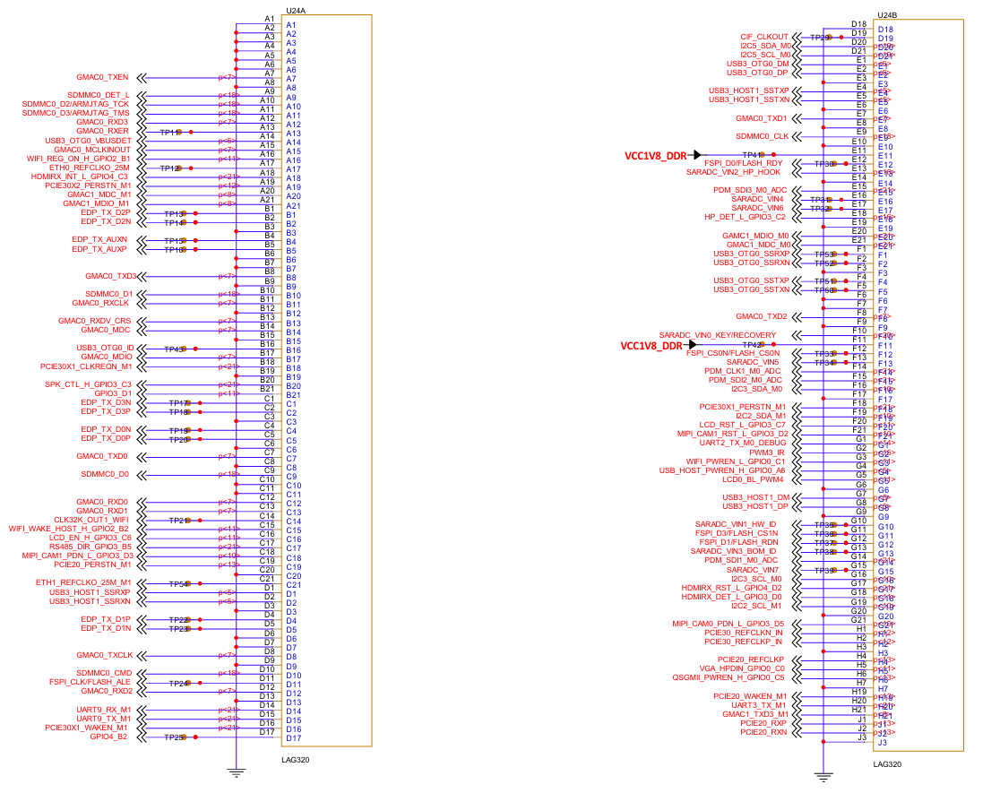

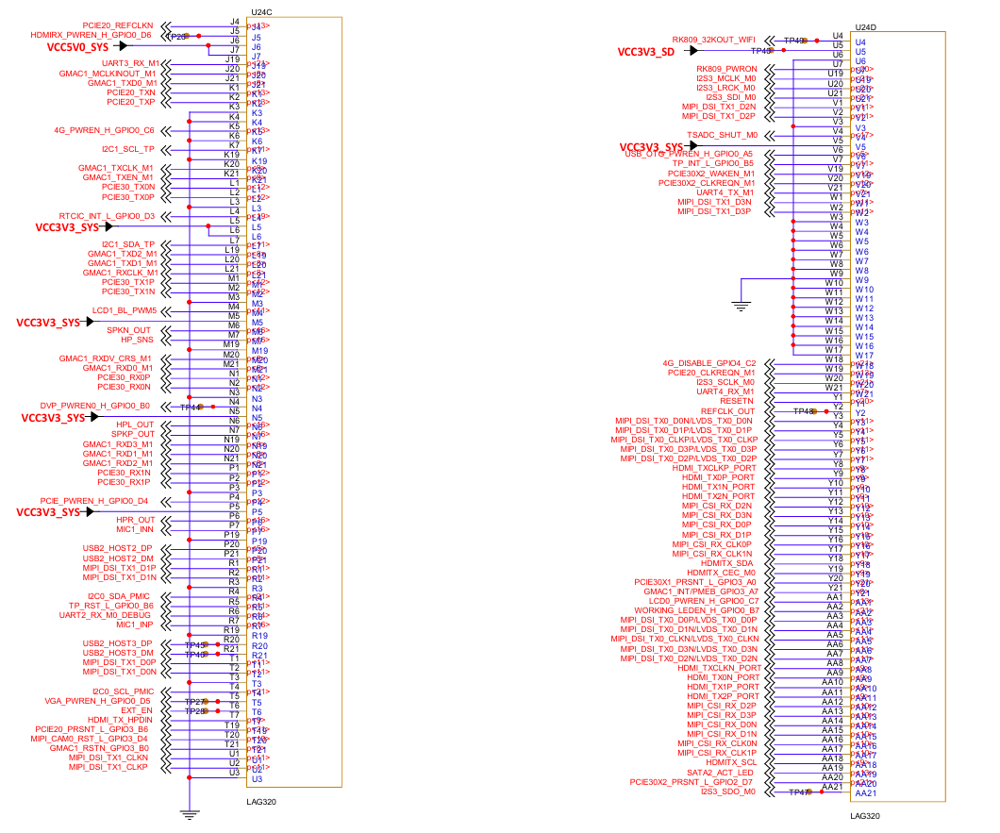

开发板40Pin引脚定义
-------------------

40Pin引脚原理图
~~~~~~~~~~~~~~~

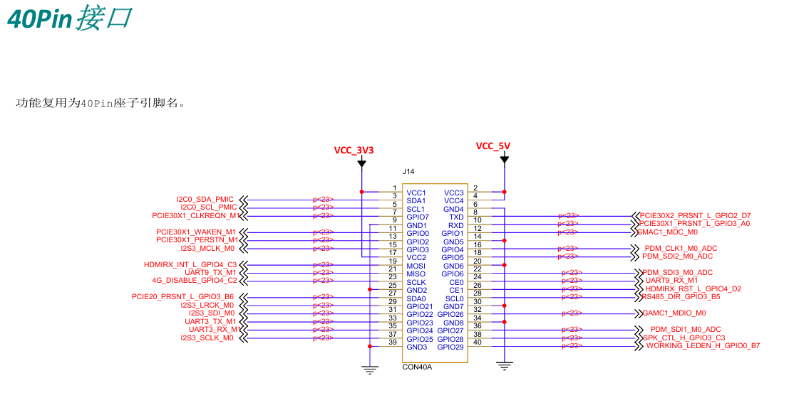

底板原理图
----------

电源管理
~~~~~~~~

底板电源为直流 5V 电源，由 DC-005 插座插入，J15 是电源插座。然后经过磁珠CBW322513U121T转成核心板需要的 5v 输入，VCC_5V会由 SY8113B 转成底板需要的3.3v以及核心板需要的3.3V。

电源输入的原理图如下图所示，其中，5V_DC信号为DC接口的电源输入，其后级型号为自恢复保险丝1812L300MR，用于过载保护，跳闸电流为5A。开发板的电源系统采用瑞芯微RK809-5芯片，配合外围的BUCK、LDO电路，给RK3568主控、DDR、 eMMC和相关的功能外设设备提供稳定的电源。

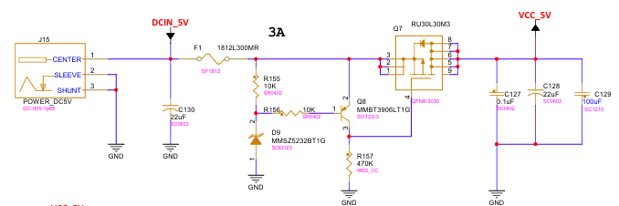

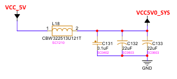

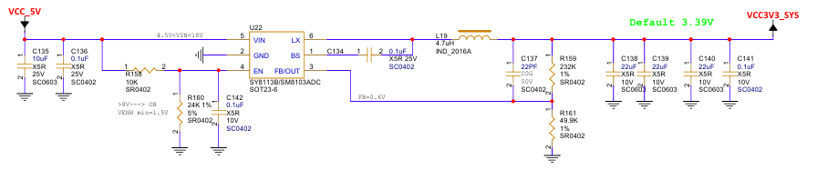

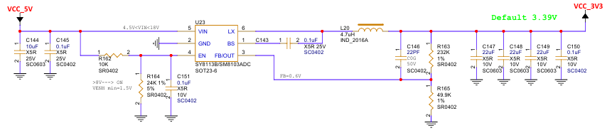

按键电路
~~~~~~~~

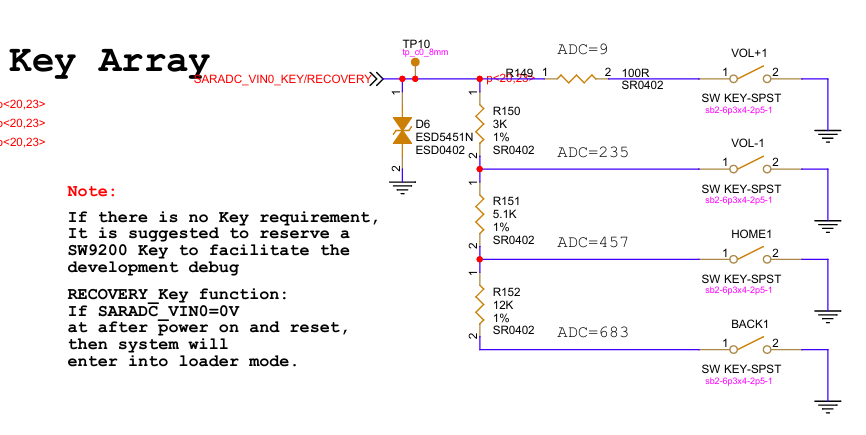

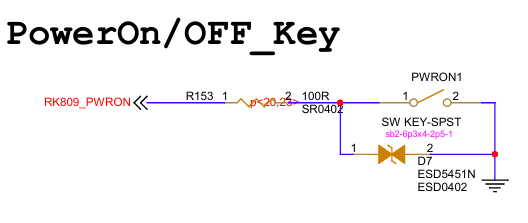

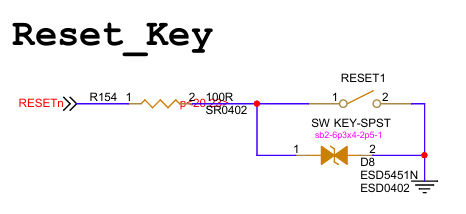

按钮 PCB 如下图所示:

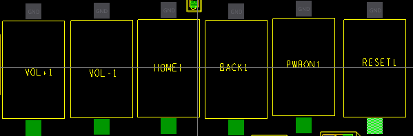

TF Card电路
~~~~~~~~~~~

TF 卡槽位于主板正面，为自弹式TF卡座，最大支持512G的MicroSD卡(TF卡)，支持系统启动与 存储。当TF卡作为系统启动卡，系统运行过程中，切勿随意拔插TF卡。

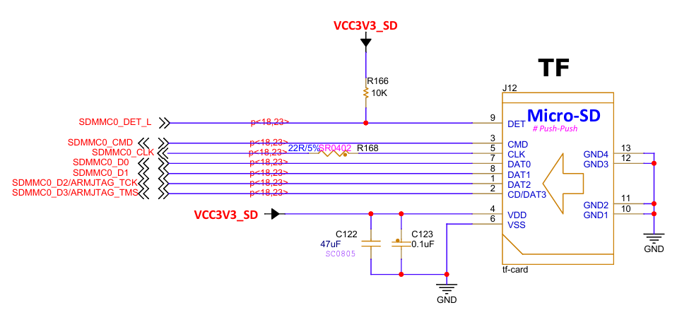

SIM电路
~~~~~~~

SIM卡槽位于主板正面，支持的SIM卡尺寸为NanoSIM，其信号线直接与MINI PCI-E接口相连，SIM卡支持移动、联通、电信，需要搭配MINIPCI-E接口的4G/5G模块才能实现 4G/5G通讯功能。

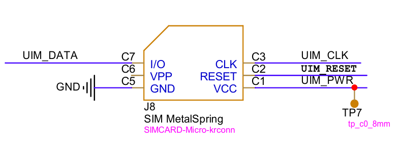

以太网电路
~~~~~~~~~~

开发板引出两个RJ45接口，分别由独立的PHY芯片 RTL8211F-CG 控制，支持10/100/1000Mbps 数据传输速率。板载的RJ45接口有两个LED指示灯，由PHY芯片来控制。

ETH0部分原理图如下图所示：

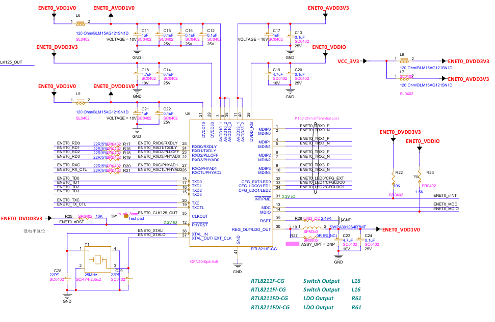

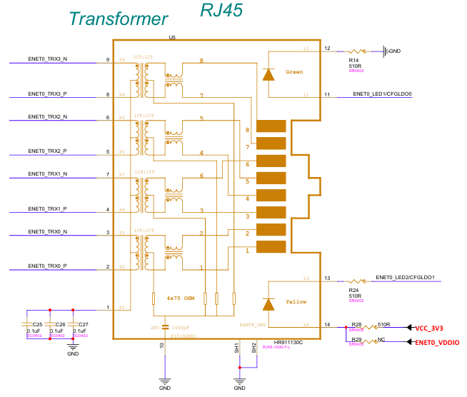

USB3.0/2.0电路
~~~~~~~~~~~~~~

RK3568芯片内置一个USB3.0OTG控制器、两个USB2.0HOST控制器和一个USB3.0HOST控制器。 一路USB3.0OTG中的USB3_OTG0_DP和USB3_OTG0_DM连接到了板载Type-COTG接口，速率 为USB2.0，可作为固件下载端口用于Emmc烧录。

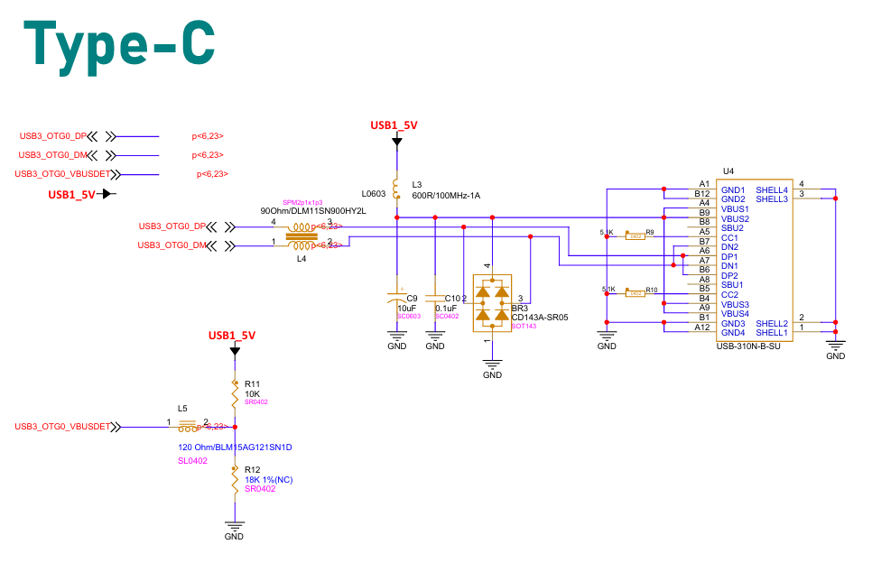

一路USB3.0HOST1信号连接到了板载USB3.0接口（内芯为蓝色）；板载USB3.0接口为USB3.2 Gen1，相当于USB3.1Gen1和USB3.0，最高数据速率可达5Gbps，并向下兼容USB2.0。

一路USB2.0HOST控制器USB2_HOST2信号连接到了与USB3.0接口同一组的USB2.0接口上。剩 下的一路USB2.0HOST3则连接到了板载的MINIPCI-E接口上。板载USB2.0接口支持高速(480Mbps)、 全速(12Mbps)和低速(1.5Mbps)3种模式，系统会根据插入的设备自动选择合适的模式。

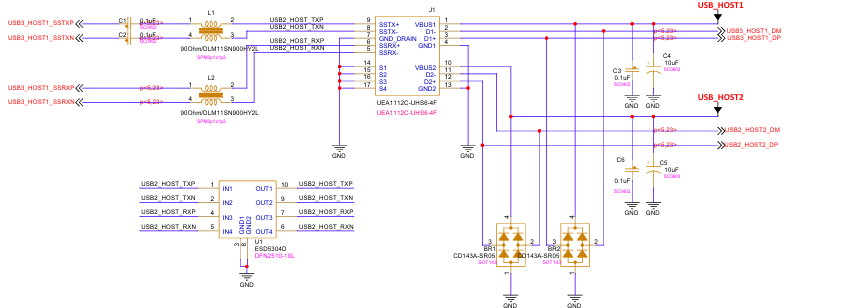

MIPI DSI电路
~~~~~~~~~~~~

开发板的MIPIDSI接口共两个，都处于主板正面，分别为J5和J6。接口使用的是30Pin的FPC排座，支持视频输出和触摸，支持双MIPI屏同时工作，单MIPI模式 最高支持分辨率为1920x1080@60fps。

MIPIDSI接口原理图如图所示:

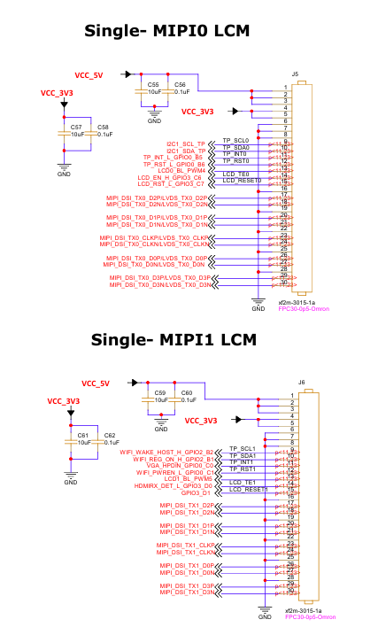

HDMI TX电路
~~~~~~~~~~~

RK3568芯片支持HDMI2.0，并向下兼容HDMI1.4，最大支持4K@60Hz， 支持视频输出和音频输出。开发板搭载的立式标准HDMI接口，可通过双头HDMI转接线，直接与搭载标准HDMI接口的显示器连接。

HDMI TX接口原理图如图所示:

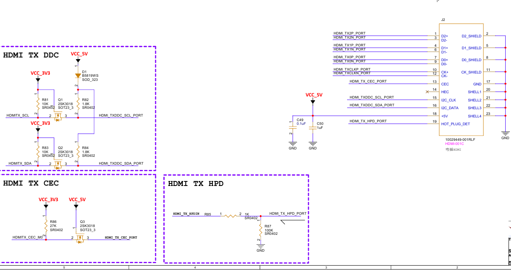

Audio电路
~~~~~~~~~

3.5mm耳机接口、SPK喇叭接口位于主板正面USB座旁边。音频的输入/输出功能通过核心板的电源芯片PMICRK809-5实现。

板载的3.5mm耳机接口支持音频的输入/输出，为耳机输出+麦克风输入2合1接口，可以连接有线 耳机，也可以通过AUX线连接功放。SPK接口规格为XH2.54-2P，可用来连接2.54mm接口8欧1W的 小喇叭。

耳机接口和SPK接口外围电路如下图所示：

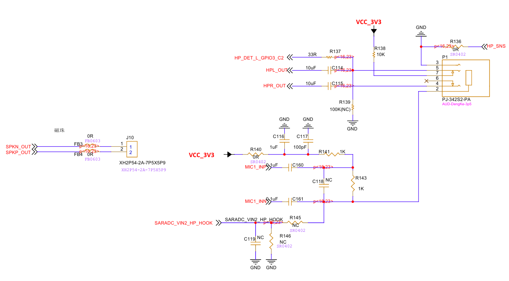

其中，HPL_OUT为耳机左声道音频输出信号，HPR_OUT 为右声道音频输出信号，HP_SNS为耳机参考地，MIC1_INP为麦克风负信号输入，MIC1_INN为麦克风 正信号输入，SARADC_VIN2_HP_HOOK为耳机线控检测信号，SPKN_OUT为扬声器（喇叭）音频负输出， SPKP_OUT为扬声器（喇叭）音频正输出。

MINIPCI-E电路
~~~~~~~~~~~~~

M2-B接口位于开发板背面，M2-B的pcie类型:PCIe2.0x1，最高支持5Gbps数据速率； 可配合全高或半高的WIFI网卡、4G/5G模块使用。

当M2-B接口接网卡模块时，走的是pcie协议；当该接口接4G/5G模块时，虽然物理连接接口为M2-B，实际走的是usb协议。

M2-B电路连接如下图所示:

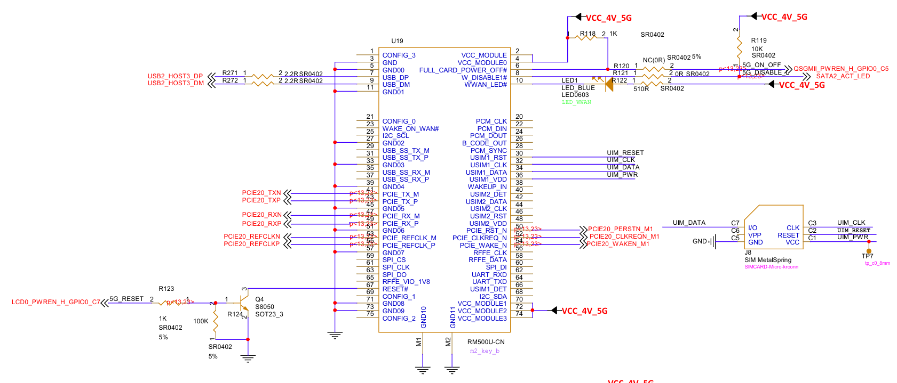

Debug调试串口电路
~~~~~~~~~~~~~~~~~

开发底板板载1个串口，CON4为USB TO UART0调试串口。

开发板底板通过沁恒微电子(WCH)的CH340T芯片将UART0转换为Type-C连接器(CON4) 引出，作为系统调试串口使用。CH340T使用来自Type-C数据线的5V（网络名： VDD_5V_VBUS）外部供电。

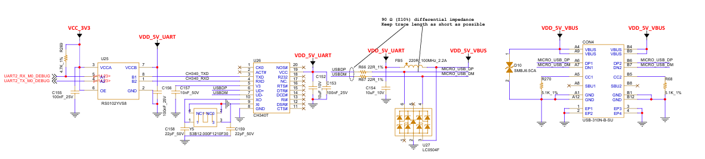

设计注意事项：

底板设计时，建议采用RS0102YVS8(U9)电平转换隔离方案，以避免调试串口RX 端在底板上电前提前带电，向核心板引脚灌输电流，导致系统无法启动。

CPU引脚UART2_RX_M0_DEBUG、UART2_TX_M0_DEBUG电平均为3.3V，请勿使用5V电平接口的调试工具直接连接，否则将导致CPU损坏。

注意USB信号需做90ohm差分阻抗匹配。

ESD器件需靠近连接器Type-C接口布局，走线经过ESD后连接至CH340T。

FAN电路
~~~~~~~

开发板预留了一个2Pin 2.54mm规格的5V风扇供电接口，可通过TSADC_SHUT_M0（GPIO0_A1_z）信号控制2SK3018 MOS管的导通状态，从而控制 BSS84 MOS管的导通，实现风扇的开关控制。

FAN风扇驱动原理图如下图所示：

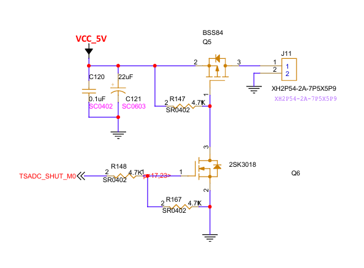

RTC电路
~~~~~~~

开发板预留了2Pin 2.54mm规格的RTC电池接口，可用于连接外部RTC电池，以实现更精准计时和更低功耗。

RTC接口原理图如下图所示：

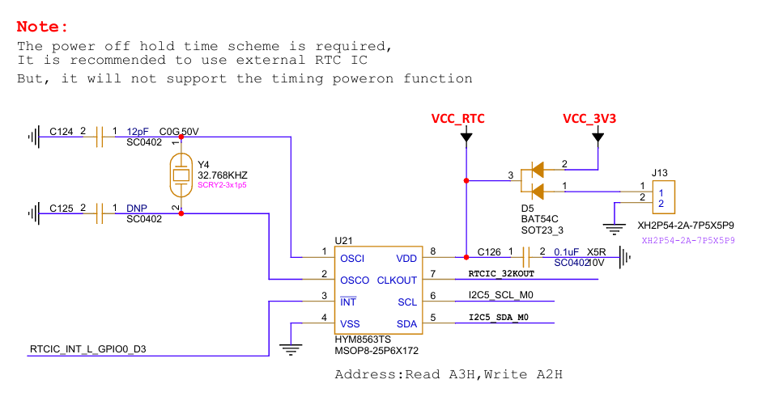

IR 电路
~~~~~~~

IR 红外接收头为IR1，采用的是IRM_3638红外遥控接收头，IR红外的接收信号由PWM3_IR引脚接收。

如下图所示：

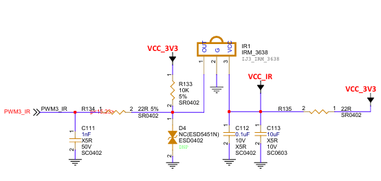

MIPI CSI电路
~~~~~~~~~~~~

开发板板载了两个摄像头接口，接口规格为24Pin0.5mm间距的FPC插座，仅支持连接mipi 摄像头。

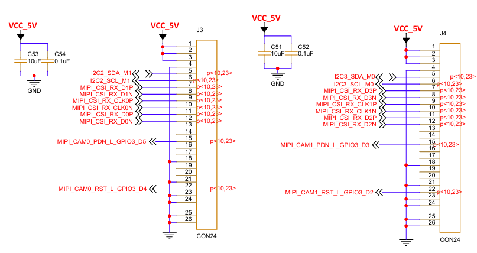

M2电路
~~~~~~

开发板板载了一个M2接口，位于主板背面，连接器类型为M2_NGFF_M_KEY。

在M2接口电路设计中，采用了扩频时钟发生器芯片PI6C557-03BLE。PI6C557-03BLE是符合PCI Express®3.0 和以太网要求的扩频时钟发生器，其连接原理图如下图所示，其中PI6C557-03BLE芯片扩展出了两路时钟，一路给了PCIE30_REFCLKP_IN和 PCIE30_REFCLKN_IN，另一路给了 PCIE30_REFCLKP_CON和 PCIE30_REFCLKN_CON。

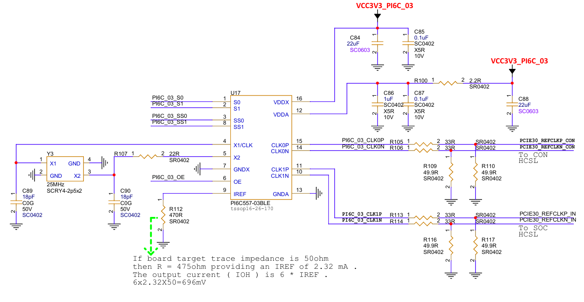

M2接口的电路原理图如下图所示：

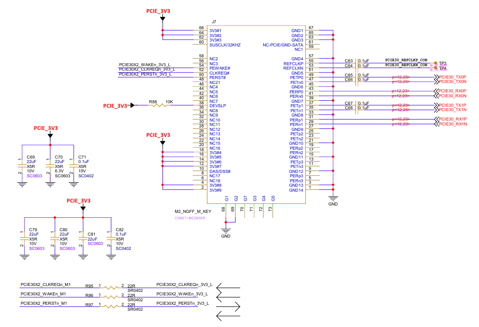

M2接口可用来连接2280、2260规格M.Key接口的NVME固态硬盘。

