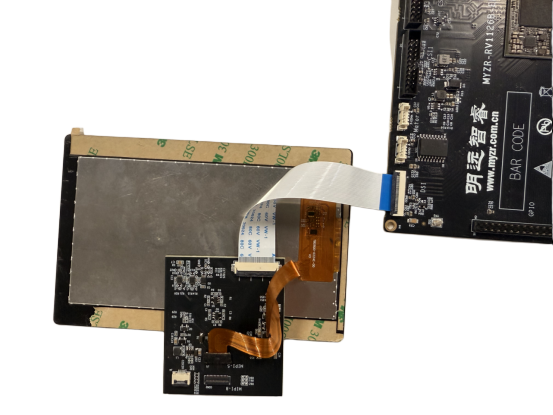
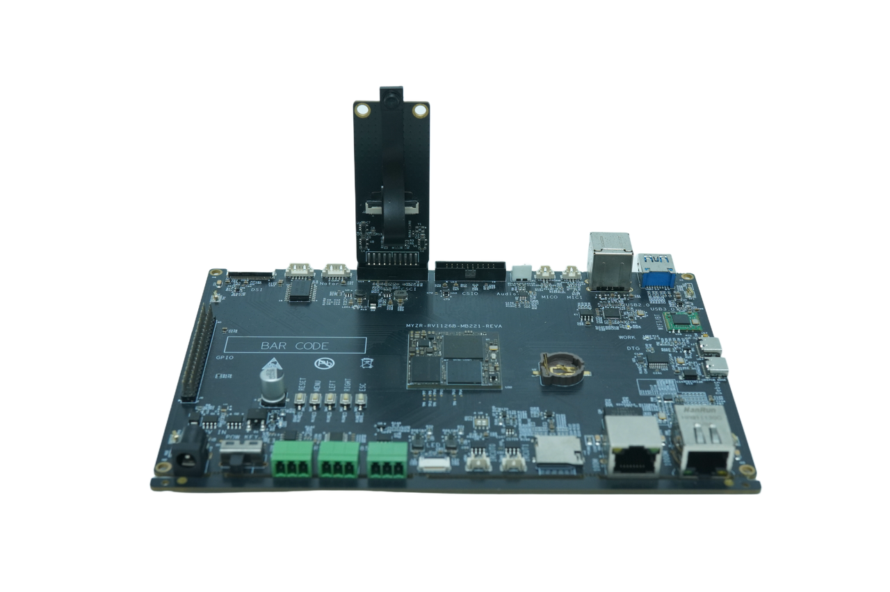

.. raw:: html

   

Boot Manual
===========

Development Board Connection
----------------------------

Preparation
-----------

.. raw:: html

   

.. raw:: html

   

+-------------------------------------+-----------------------------------+
| Check Development Board Accessories                                     |
+=====================================+===================================+
| Core Board                          | 1 piece                           |
+-------------------------------------+-----------------------------------+
| Base Board                          | 1 piece                           |
+-------------------------------------+-----------------------------------+
| Power Supply                        | 1 unit, 12V                       |
+-------------------------------------+-----------------------------------+
| Programming Cable                   | 1, USB male-to-male               |
+-------------------------------------+-----------------------------------+
| Serial Cable                        | 1, 5Pin to dual DB9               |
+-------------------------------------+-----------------------------------+
| Network Cable                       | 1                                 |
+-------------------------------------+-----------------------------------+
| HDMI Cable                          | 1                                 |
+-------------------------------------+-----------------------------------+
| FPC Cable                           | 1, nPin, same-side/different-side |
+-------------------------------------+-----------------------------------+
| Display                             | 1, resolution, size               |
+-------------------------------------+-----------------------------------+
| Camera                              | 1, model, interface               |
+-------------------------------------+-----------------------------------+

Display Connection Notes
~~~~~~~~~~~~~~~~~~~~~~~~

* Please strictly follow the display connection diagram shown. The interface has no foolproof design.

* Reversed connection will damage the display and board.

RV1126B Development Board 5-inch MIPI Touch Display Connection Diagram

MIPI CSI Camera Connection
^^^^^^^^^^^^^^^^^^^^^^^^^^

OV5695 camera directly connects to development board, supports dual cameras.

RV1126B Development Board Camera Connection Diagram

Check Power Switch
~~~~~~~~~~~~~~~~~~

Set the development board power switch "POW_KEY" to "OFF" position to ensure the power is disconnected.

Serial Port Settings
~~~~~~~~~~~~~~~~~~~~

.. raw:: html

   

.. raw:: html

   

+-----------+-----------+-----------+--------+
| Baud Rate | Data Bits | Stop Bits | Parity |
+===========+===========+===========+========+
| 115200    | 8bit      | 1bit      | none   |
+-----------+-----------+-----------+--------+

TTL Serial Module Connection
~~~~~~~~~~~~~~~~~~~~~~~~~~~~

The development board has no DIP switches.

Programming Cable Connection
~~~~~~~~~~~~~~~~~~~~~~~~~~~~

Connect one end of the Type-C cable to OTG port, and the other end to the computer's rear USB port.

Power Cable Connection
~~~~~~~~~~~~~~~~~~~~~~

Connect one end of the 12V-2A power adapter to the development board's "CON1", and the other end to the mains (220V AC) socket.

Boot Development Board
----------------------

Power On Development Board
~~~~~~~~~~~~~~~~~~~~~~~~~~

Set the development board power switch "POW_KEY" to "ON" position to turn on the power.

Interpretation of Boot Messages
-------------------------------

U-Boot Messages:
~~~~~~~~~~~~~~~~

After powering on, you can see the boot messages output on the serial terminal software.

.. code-block:: shell

   U-Boot 2017.09-250620-dirty # (Oct 22 2025 - 06:29:19 +0000)
   Model: Rockchip RV1126B Evaluation board
   MPIDR: 0x0
   PreSerial: 0, raw, 0x20810000
   DRAM:  2 GiB
   Sysmem: init
   Relocation Offset: 7d962000
   Relocation fdt: bb7fa9b0 - bb7fecf0
   CR: M/C/I
   Using default environment
   DM: v2

The boot message "U-Boot 2017.09-250620-dirty # (Oct 22 2025 - 06:29:19 +0000)" contains:

【U-Boot Version】: 2017.09-250620-dirty;

【U-Boot Compilation Time】: Oct 22 2025 - 06:29:19 +0000.

Kernel Messages:
~~~~~~~~~~~~~~~~

.. code-block:: shell

   Linux version 6.1.11 (wanglk@myzr-u2204) (aarch64-none-linux-gnu-gcc (GNU
   Toolchain for the A-profile Architecture 10.3-2021.07 (arm-10.29)) 10.3.1
   20210621, GNU ld (GNU Toolchain for the A-profile Architecture 10.3-2021.07
   (arm-10.29)) 2.36.1.20210621) #2 SMP Wed Oct 22 06:32:38 UTC 2025 [
   1.182031] random: crng init done[    1.185182] Machine model: Rockchip RV1126B
   EVB1 V10 Board

The boot message contains:

【Kernel Version】: Linux-6.1.11;

【GCC Version for Kernel Compilation】: 10.3.1;

【Kernel Compilation Time】: Wed Oct 22 06:32:38 UTC 2025

Development Board Login
-----------------------

After system boot completes, the development board will automatically log in. No username or password required.

Note: You can set or change the password using the "passwd" command after login.

Serial Login
~~~~~~~~~~~~

.. code-block:: shell

   # Connect computer and board using TTL module. Insert TYPE-C cable and power on.
   # Username is root, no password, press Enter to login.
   [    1.572164] iommu: Default domain type: Translated
   [    1.572180] iommu: DMA domain TLB invalidation policy: strict mode
   [    1.572438] SCSI subsystem initialized
   [    1.572718] mc: Linux media interface: v0.10
   [    1.572754] videodev: Linux video capture interface: v2.00
   [    1.572806] pps_core: LinuxPPS API ver. 1 registered
   [    1.572811] pps_core: Software ver. 5.3.6 - Copyright 2005-2007 Rodolfo
   Giometti <giometti@linux.it>
   [    1.572822] PTP clock support registered
   [    1.572848] EDAC MC: Ver: 3.0.0
   [    1.575043] Advanced Linux Sound Architecture Driver Initialized.
   [    1.575754] rockchip-cpuinfo cpuinfo: SoC                : 11262b01
   [    1.575763] rockchip-cpuinfo cpuinfo: Serial                :
   7958ea63213e669b
   [    1.581401] NET: Registered PF_INET protocol family
   [    1.583437] NET: Registered PF_UNIX/PF_LOCAL protocol family
   [    1.585357] rockchip-thermal 20bb0000.tsadc: width=0x333726e3, bias=0x3e,
   offset=0x963f
   [    1.585539] thermal thermal_zone0: power_allocator: sustainable_power will
   be estimated
   [    1.585721] rockchip-thermal 20bb0000.tsadc: tsadc is probed successfully!
   [    2.085370] squashfs: version 4.0 (2009/01/31) Phillip Lougher
   [    2.085815] Key type id_legacy registered
   [    2.085820] ntfs: driver 2.1.32 [Flags: R/O].
   [    2.085938] jffs2: version 2.2. (NAND) © 2001-2006 Red Hat, Inc.
   [    2.086100] fuse: init (API version 7.38)
   [    2.086293] SGI XFS with security attributes, no debug enabled
   [    2.114147] NET: Registered PF_ALG protocol family
   [    2.114160] Key type asymmetric registered
   [    2.114165] Asymmetric key parser 'x509' registered
   [    2.114206] io scheduler mq-deadline registered
   [    2.114211] io scheduler kyber registered
   [    2.115434] rockchip-csi2-dphy-hw 21c40000.csi2-dphy0-hw: csi2 dphy hw
   probe successfully!
   [    2.115508] rockchip-csi2-dphy-hw 21c50000.csi2-dphy1-hw: csi2 dphy hw
   probe successfully!
   [    2.115906] rockchip-csi2-dphy csi2-dphy0: csi2 dphy0 probe successfully!
   [    2.116151] rockchip-csi2-dphy csi2-dphy3: csi2 dphy3 probe successfully!
   [    2.127588] rk-dma 20b80000.dma-controller: NR_LCH-48 NR_PCH-2 PCH_BUF-
   128x16Bytes AXI_LEN-16 ADDR-32Bits V1.1
   [    2.129953] (NULL device *): Lowpower RKDMA: NR_LCH-4 NR_PCH-1 PCH_BUF-
   4x8Bytes AXI_LEN-16 ADDR-32Bits V1.1
   [    2.131920] rockchip-system-monitor rockchip-system-monitor: system monitor
   probe
   [    2.147018] rockchip-drm display-subsystem: bound 22150000.vop (ops
   0xffffffc0095fe868)
   [    4.674432] rkaiisp rkaiisp-vir0: rkaiisp driver version: v00.01.01
   [    4.675812] rkcif rkcif-mipi-lvds: rkcif driver version: v00.02.00
   [    4.677231] rkcif rkcif-mipi-lvds2: rkcif driver version: v00.02.00
   [    4.682779] rkisp rkisp-vir0: rkisp driver version: v03.01.00
   [    4.683833] rkisp rkisp-vir1: rkisp driver version: v03.01.00
   [    4.686689] rkvpss_hw 21d20000.vpss: failed to get cru reset
   [    4.686988] rkvpss rkvpss-vir0: rkvpss driver version: v00.01.00
   [    4.687825] rkvpss rkvpss-vir1: rkvpss driver version: v00.01.00
   [    4.710060] NET: Registered PF_INET6 protocol family
   [    4.710705] In-situ OAM (IOAM) with IPv6
   [    4.710749] NET: Registered PF_PACKET protocol family
   [    4.710760] NET: Registered PF_KEY protocol family
   [    4.710790] NET: Registered PF_CAN protocol family
   [    4.722518] rga2 209f0000.rga: probe successfully, irq = 61,
   hw_version:4.1.34669
   [    4.722726] rga: IOMMU binding successfully, default mapping core[0x4]
   [    4.722891] rga: Module initialized. v1.3.10
   [    4.792004] RKNPU 22000000.npu: RKNPU: rknpu iommu is enabled, using iommu
   mode
   [    4.792445] RKNPU 22000000.npu: RKNPU: Initialized RKNPU driver: v0.9.8 for
   20240828
   [    4.799093] Mali:
   [    4.799096] Mali device driver loaded
   [12:00:04.821] OS: Linux, 6.1.141, #14 SMP Tue May 19 03:55:16 UTC 2026,
   aarch64

ADB Connection Login
~~~~~~~~~~~~~~~~~~~~

.. code-block:: shell

   # Connect to development board via Type-C OTG port
   C:\Users\MYZR>adb shell
   root@rv1126b-buildroot:/#

SSH Login via Network Cable
~~~~~~~~~~~~~~~~~~~~~~~~~~~

.. code-block:: shell

   # Connect network cable, IP is obtained automatically
   # Click Connect, username is root, press Enter to login, as follows:
   Connecting to 192.168.128.137:22...
   Connection established.
   To escape to local shell, press 'Ctrl+Alt+]'.
   WARNING! The remote SSH server rejected X11 forwarding request.
   root@rv1126b-buildroot:~#