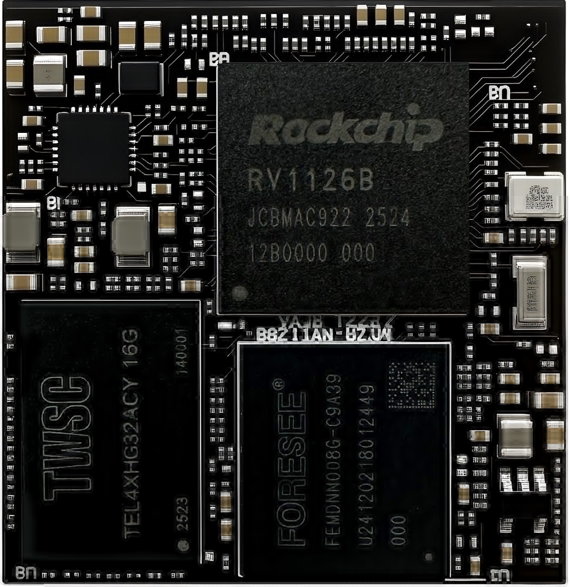
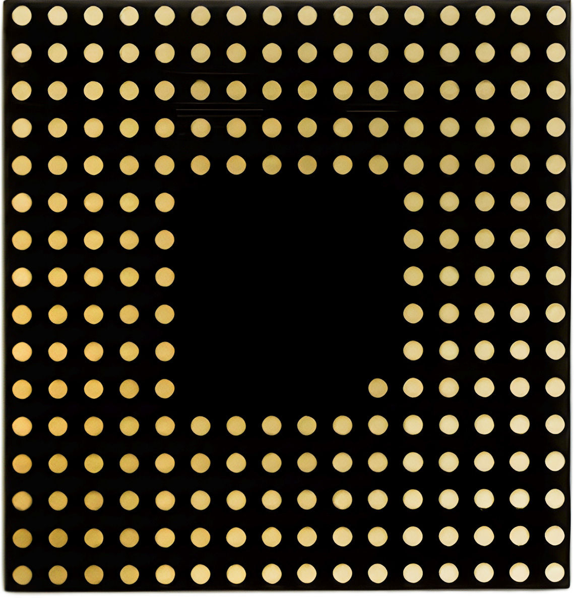
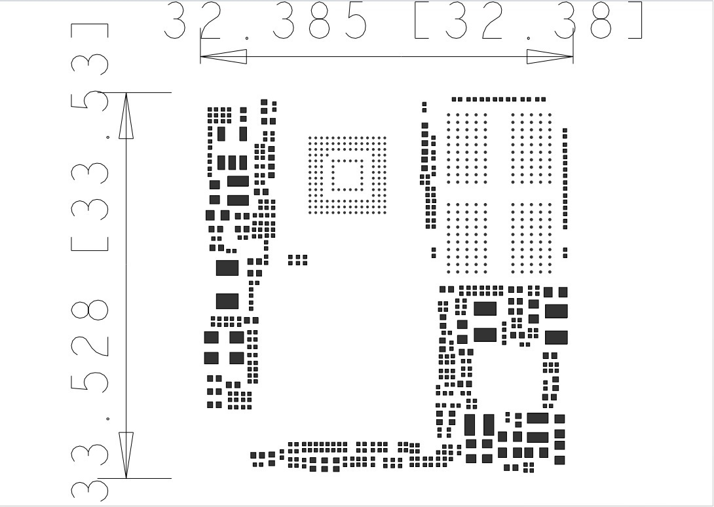
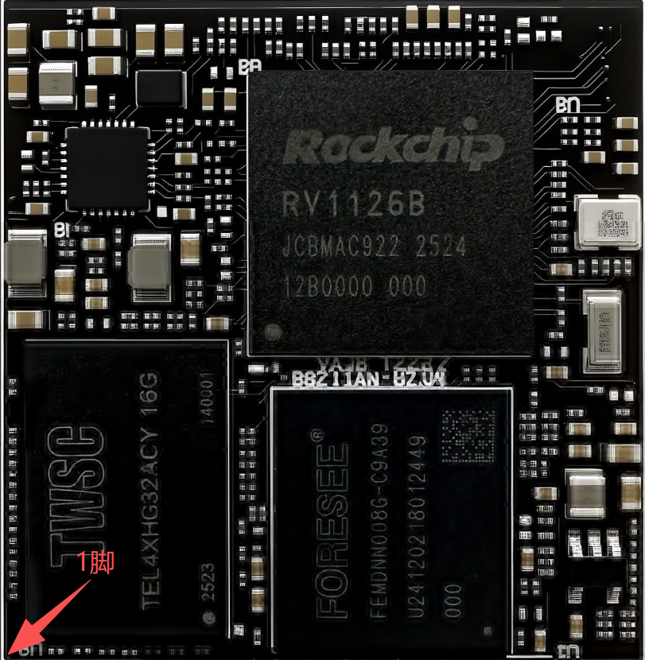
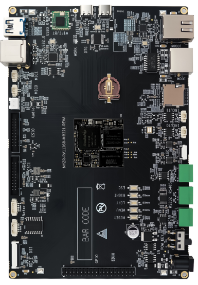
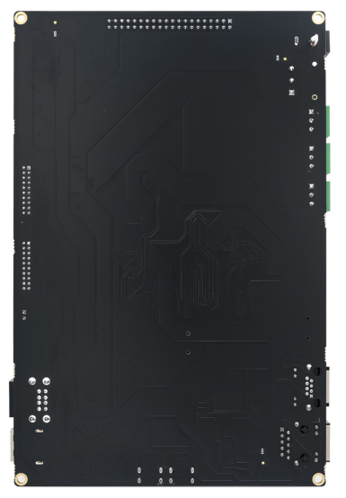
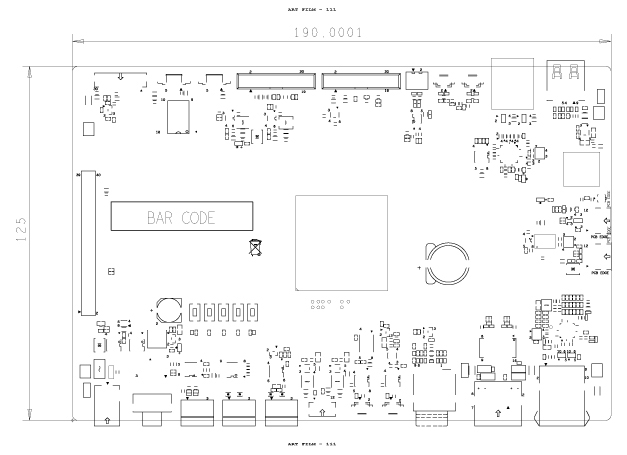
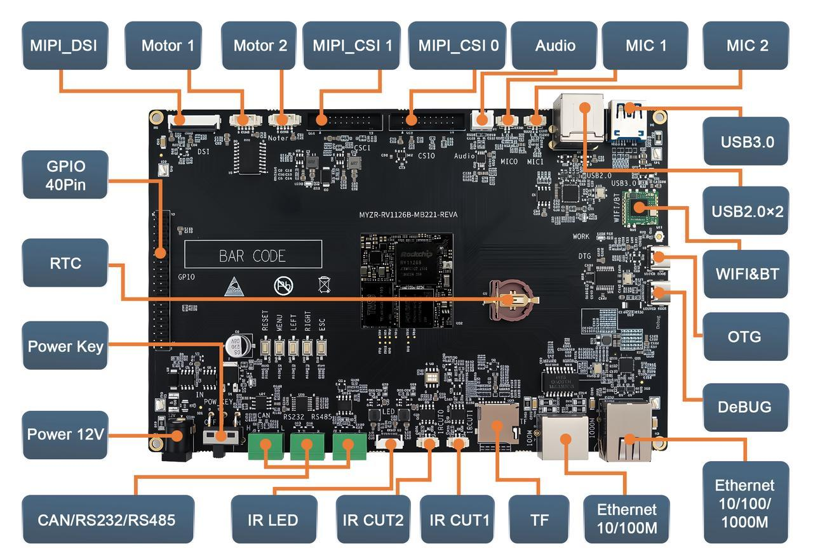

.. raw:: html

   

产品介绍
====

核心板介绍
-----

硬件资源
~~~~

MYZR-RV1126B核心板基于RV1126B处理器开发,集成主控所需DDR内存、Flash存储、电源与时钟等基础电路,可直接作为整机主控模块使用。

处理器内部集成:

* 四核ARM Cortex-A53CPU (主频1.5GHz)+300MHzRISC-VMCU ,兼顾主算力与低功耗实时调度

* 自研3TOPSNPU ,适配多精度量化、Transformer优化,可运行2B以内大模型

* 独立AI-ISP图像处理单元,搭配AIRemosaic、6-DOF硬件防抖、多目全景拼接引擎

* AOV3.0低功耗音频处理单元,集成板载AudioCodec音频编解码器

* 4路Sensor视频输入模块、MIPI/RGB显示输出模块

* DDR高速控制器、内置百兆以太网PHY

* 国密安全加密引擎,搭载TrustZone、Keyladder密钥管理系统

* USB3.0及各类通用片上外设资源

核心板规格
-----

.. raw:: html

   

.. raw:: html

   

+----+----------+----------------------------------------------+
|   核心板规格                                                 |
+====+==========+==============================================+
| 1  | 型号     | MYZR-RV1126B-LB221                           |
+----+----------+----------------------------------------------+
| 2  | 尺寸     | 33.0mm × 32.0mm                              |
+----+----------+----------------------------------------------+
| 3  | PCB      | 10层2阶盲埋沉金工艺设计 LGA 221pin           |
+----+----------+----------------------------------------------+
| 4  | 内存     | LPDDR4X 2/4/8GByte                           |
+----+----------+----------------------------------------------+
| 5  | 存储     | eMMC 8/16/32/64GB                            |
+----+----------+----------------------------------------------+
| 6  | 启动方式 | SPINOR、NAND、SD卡、eMMC、USB、UART多途径启动|
+----+----------+----------------------------------------------+

核心板正反图
~~~~~~

.. raw:: html

   

   

**MYZR-RV1126B核心板正面图**

.. raw:: html

   

   

**MYZR-RV1126B核心板反面图**

核心板尺寸图
~~~~~~

核心板尺寸机械图【33.53mm×32.38mm】

核心板命名规则及可选配置
~~~~~~~~~~~~

.. raw:: html

   

.. raw:: html

   

+---------------+---------------------------+-------------------------------+-------------+------------+
| 核心板型号    |                            命名规则                                                  |
+===============+===========================+===============================+=============+============+
|               | MYZR                      | RV1126B                       | LB/EK       | 221        |
+               +---------------------------+-------------------------------+-------------+------------+
|               | 明远智睿                  | MPU主控型号                   | LB【核心板】| 核心板引脚 |
+               +---------------------------+-------------------------------+-------------+------------+
|               |                           | RV1126B【商业级】             | EK【开发板】|            |
+               +---------------------------+-------------------------------+-------------+------------+
| MYZR-RV1126B  |                           | RV1126BJ【工业级】            |             |            |
+               +---------------------------+-------------------------------+-------------+------------+
|               |                            可选配置                                                  |
+               +---------------------------+-------------------------------+-------------+------------+
|               | 内存:LPDDR4X 2/4/8GByte                                                              |
+               +---------------------------+-------------------------------+-------------+------------+
|               |                            存储:8/16/32/64GByte eMMC                                 |
+               +---------------------------+-------------------------------+-------------+------------+
|               |                            例:MYZR-RV1126B-LB221-2G-8G                               |
+---------------+---------------------------+-------------------------------+-------------+------------+ 

接口资源
~~~~

注:表中参数为硬件设计或CPU理论值

.. raw:: html

   

.. raw:: html

   

+------------+-------------+-------------------+--------------------------------------------------+
|            | 接口规格    | 最大可配置接口数  | 描述                                             |
+============+=============+===================+==================================================+
|            | Ethernet    | 1                 | 1路以太网控制器，支持RGMII/RMII，速率10/100/1000 |
+            +-------------+-------------------+--------------------------------------------------+
|            | USB2.0      | 2                 | 1路USB2.0 Host、1路USB2.0 OTG，最高传输速率480M  |
+            +-------------+-------------------+--------------------------------------------------+
|            | UART        | 9                 | 6路UART接口，最高波特率4Mbps，除UART2外其余支持  |
+            +-------------+-------------------+--------------------------------------------------+
|            | SPI         | 3                 | 2路通用SPI+1路专用FSPI，每路支持主从模式         |
+            +-------------+-------------------+--------------------------------------------------+
| 通讯接口   | I2C         | 9                 | 6路I2C接口，支持7bit/10bit地址，最高速率1Mbps    |
+            +-------------+-------------------+--------------------------------------------------+
|            | CAN         | 1                 | 1路CAN接口，支持标准帧、扩展帧及CANFD            |
+            +-------------+-------------------+--------------------------------------------------+
|            | PWM         | 13                | 内置12路通用PWM加1路音频专用PWM                  |
+            +-------------+-------------------+--------------------------------------------------+
|            | ADC         | 8                 | 6路10位SARADC与2路温度检测TSADC                  |
+            +-------------+-------------------+--------------------------------------------------+
|            | I2S         | 3                 | 3路I2S音频接口，最高192KHz采样率                 |
+------------+-------------+-------------------+--------------------------------------------------+
|            | SDIO        | 1                 | 1路SDIO3.0接口，支持SD3.0，MMC4.51               |
+            +-------------+-------------------+--------------------------------------------------+
| 外部存储   | eMMC        | 1                 | 1路eMMC4.51接口，支持1/4/8bit总线，HS200模式     |
+            +-------------+-------------------+--------------------------------------------------+
|            | FSPI        | 1                 | 1路FSPI接口，支持x1/x2/x4四线模式，2路片选       |
+            +-------------+-------------------+--------------------------------------------------+
|            | NAND Flash  | 1                 | 1路异步NAND Flash接口，8bit数据总线，硬件ECC     |
+------------+-------------+-------------------+--------------------------------------------------+
|            | CSI_MIPI    | 2                 | 2路MIPI CSI图像输入接口，单路最高4通道           |
+            +-------------+-------------------+--------------------------------------------------+
| 多媒体     | DSI_MIPI    | 1                 | 支持1路4Lane的DSI_MIPI接口，最大分辨率1920×1080  |
+            +-------------+-------------------+--------------------------------------------------+
|            | LVDS        | 2                 | 2路4通道LVDS视频输入接口，与MIPI CSI引脚复用     |
+            +-------------+-------------------+--------------------------------------------------+
|            | RGB         | 1                 | 1路24bit并行RGB显示接口，最高分辨率1920×1080     |
+------------+-------------+-------------------+--------------------------------------------------+
| 系统版本   | buildroot、debian12                                                                |
+------------+-------------+-------------------+--------------------------------------------------+
| 界面       | weston                                                                             |
+------------+-------------+-------------------+--------------------------------------------------+ 

供电模式
~~~~

.. raw:: html

   

.. raw:: html

   

+----------+----------+-----------+-----------+-----------+------+------+
| 功能     | 引脚标号 | 规格-最小 | 规格-典型 | 规格-最大 | 单位 | 备注 |
+==========+==========+===========+===========+===========+======+======+
| 电源供电 | CON1     | 11.8      | 12        | 12.2      | V    | 底   |
+----------+----------+-----------+-----------+-----------+------+------+

工作环境
~~~~

.. raw:: html

   

.. raw:: html

   

+--------+-------+-------+-------+------+------------------+
| 参数   | 最小  | 典型  | 最大  | 单位 | 说明             |
+========+=======+=======+=======+======+==================+
| 商业级 | 0°C   | 25°C  | 70°C  | °C   | 实测0至60°C运行  |
+--------+-------+-------+-------+------+------------------+
| 工业级 | 0°C   | 25°C  | 80°C  | °C   | 实测0至70°C运行  |
+--------+-------+-------+-------+------+------------------+

启动配置
~~~~

* EM M C启动

是否支持快启动及快启时间
~~~~~~~~~~~~

.. raw:: html

   

.. raw:: html

   

+----------+----------+------+
| 项目     | 支持情况 | 时间 |
+==========+==========+======+
| RV1126B  | 不支持   |      |
+----------+----------+------+ 

核心板功耗
~~~~~

.. raw:: html

   

.. raw:: html

   

+---------------------+-----------+---------+-----------+---------+
| 类型                |    待机功耗         |    满载功耗         |
|                     +-----------+---------+-----------+---------+
|                     | 电流      | 功耗    | 电流      | 功耗    |
+=====================+===========+=========+===========+=========+
| MYZR-RV1126B开发板  | 140mA     | 1.680W  | 210mA     | 2.520W  |
+---------------------+-----------+---------+-----------+---------+
| 注:上面数值为电流值(mA),电压为5.0V,满载为全核跑满               |
+---------------------+-----------+---------+-----------+---------+

核心板贴片/安装示意图
~~~~~~~~~~~

信号定义
----

核心板引脚定义

.. raw:: html

   

.. raw:: html

   

.. list-table::
   :widths: auto
   :header-rows: 1

   * - Pin NO.
     - Pin Name
     - 功能描述
   * - A1
     - PWM0_CH1_M0
     - UART1_RX_M0/I2C5_SDA_M0/PWM0_CH1_M0/SPI2AHB_D2/GPIO00\_
   * - A2
     - GPIO0_AO_Z
     - TEST_CLKO_OUT/REF_CLKO_OUT/GPIO0O_AO_Z
   * - A3
     - UART0_TX_DBG
     - JTAG_TCK_M0 /I2C1_SCL_M0 / PWM1_CH2_M0 /UART0_TX_M2 / GPI000
   * - A4
     - UART0_RX_DBG
     - JTAG_TMS_M0/I2C1_SDA_M0/ PWM1_CH3_M0 / UART0_RX_M2/ GPIO00
   * - A5
     - GND
     - 
   * - A6
     - VCC_1V8電
     - 
   * - A7
     - VCC_1V8電
     - 
   * - A8
     - FSPI_DO
     - SAI1_LRCK_M0/FSPI0_D0/GPIO1_B4_U
   * - A9
     - FSPI_CSN
     - SAI1_MCLK_M0 / FSPI1_CSN0_M1/ FSPI0_CSN0 / GPIO1_B0_U
   * - A10
     - FSPI_D2
     - SAI1_LRCK_M0/FSPI0_D2/GPIO1_B2_U
   * - A11
     - IRCUT_A0
     - I2C3_SCL_M2/DSMSCSN3/ETPTP REFCLKPM1/PWM0_CH6_M
   * - A12
     - SDMMC0_VOL_CTRL
     - SPI0_CS1N_M0/FSPI1_D2_M0/GPIO00_A6_U
   * - A13
     - SDMMC0_CMD
     - UART4_TX_M3/UART3_CTSN_M0/ SDMMC0_CMD/GPIO2_A5_D
   * - A14
     - SDMMC0_D2
     - TEST_CLK1_OUT/JTAG_TCK_M1/UART4RTSNM3/ART3_RX_M0/ SDMM
   * - A15
     - SDMMC0_DO
     - I2C0_SDA_M1/UART0_RX_M0/SDMMC0_D0/GPIO2_A0_D
   * - A16
     - SDMMC0_CLK
     - UART4_RX_M3/UART3_RTSN_M0/ SDMMC0_CLK/GPIO2_A4_D
   * - B1
     - ETH_LED_SPD
     - SARADC2ETHXCMM/FHYCMHYD
   * - B2
     - SARADC0_INO_KEY
     - SARADC0INO_KEY
   * - B3
     - RESET
     - RESET
   * - B4
     - SDIO_D1
     - I2C1_SDA_M1/SDMMC1_D1/GPIO3_A3_D
   * - B5
     - GND
     - 
   * - B6
     - VCC_1V8電
     - 
   * - B7
     - FSPI_CLK
     - FSPI0_CLK/GPIO1_B7_D
   * - B8
     - FSPI_D1
     - SAI1_SCLK_M0/FSPI0_D1/GPIO1_B5_U
   * - B9
     - FSPI_D3
     - SAI1_SDI_M0/FSPI0_D3/GPIO1_B6_U
   * - B10
     - IRCUT_B1
     - DSMC_INT2/UART3_CTSN_M1/PWM1SHD3M1/SPI_MISO_M2/VO_LCD
   * - B11
     - IRCUT_B0
     - RCUTO
   * - B12
     - IRCUT_A1
     - DSMC_INT3/UART3 RTSNMP/GCH⊥M1/SPI1_MOSM2/
   * - B13
     - SDMMC0_PWREN
     - SPI0_MOSI_M0/FSPI1_DO_M0/GPIO0O_BO_D
   * - B14
     - SDMMC0_DET
     - PWM1_CH0_M0/SDMMC0_DET/GPIO00_A5_U
   * - B15
     - SDMMC0_D3
     - SDMMC0D3
   * - B16
     - SDMMC0_D1
     - SDMMC0D1
   * - C1
     - ETH_LED_ACT
     - SARADC2_IN6/ETHXCLKMM/WOIFCLKMUTMO6EHYLEDLINK
   * - C2
     - FEPHY_TXN
     - EPHVXN
   * - C3
     - FEPHY_RXP
     - FEPHYRXP
   * - C4
     - FEPHY_TXP
     - FEPHYTXP
   * - C5
     - SDIO_DO
     - I2C1_SCL_M1/SDMMC1_D0/GPIO3_A2_D
   * - C6
     - SDIO_D3
     - SDMMC1_D3/GPIO3_A5_D
   * - C7
     - UART2_TX_BT
     - UART2_TX_M0/GPIO3_B1_D
   * - C8
     - SDIO_D2
     - SDMMC1_D2/GPIO3_A4_D
   * - C9
     - WIFI_WAKE_HOST_3V3
     - SPI0_MISO_M0/FSPI1_D1_M0/GPIO00_B1_D
   * - C10
     - CLK_32K_OUT
     - RTC_32K_OUT/CLK_32K/GPIO00_A2_Z
   * - C11
     - SARADC0_IN1_CDS
     - SARADC0_IN1_CDS
   * - C12
     - SENSOR_INT
     - SENSORINT
   * - C13
     - LED_PWM_IR
     - UART1_CTSN_M0 /PWM0_CH3_M0 / SPI2AHB_D0 /GPIO00_C7_D
   * - C14
     - LED_PWM_WHITE
     - UART1_RTSN_M0 /PWM0_CH2_M0 /SPI2AHB_D1/GPIO00_C6_D
   * - C15
     - I2C2_SDA_SENSOR
     - I2C2_SDA_M0/PWM0_CH5_M0/GPIO00_D1_D
   * - C16
     - I2C2_SCL_SENSOR
     - I2C2_SCL_M0/PWM0_CH4_M0/GPIO00_D0_D
   * - D1
     - GMAC_TXCTL_M1
     - DSMC_D5/ETH_TXCTL_M1/ PWM3CH2_M1/V_CIF_D14_M1/VO_LCDC
   * - D2
     - GPIO3_B2_D
     - FLASH_TRIG_OUT/WMCHOM/AI2SDMO/SAI2_SDO_M0
   * - D3
     - FEPHY_RXN
     - FEPHYRXN
   * - D4
     - FEPHY_TXN
     - FEPHYTXN
   * - D5
     - SDIO_CLK
     - SDMMC1_CLK/GPIO3_AO_D
   * - D6
     - UART2_CTSN_BT
     - UART2_CTSN_M0/GPIO3_A7_D
   * - D7
     - UART2_RTSN_BT
     - UART2_RTSN_M0/GPIO3_A6_D
   * - D8
     - HOST_WAKE_BT
     - SDMMCI_DETN/I2C5_SCL_M1/SA2MGLKMO/SPI_CSN1_M1/UART1
   * - D9
     - WIFI_REG_ON_3V3
     - SPI0_CLK_M0/FSPI1_CLK_M0/GPIO00_B2_D
   * - D10
     - GPIO00_A3_U
     - PWR_CTRLO/GPIO0O_A3_U
   * - D11
     - GMAC_RXCLK_M1
     - DSMC_DO/SAI1_SDI_M2/ETHLRXCLK2M1/PM3CH_M1/V_CIF_HSY
   * - D12
     - GMAC_RXD2_M1
     - GMAC_RXD2_M1
   * - D13
     - GMAC_MDIO_M1
     - DSMC_DQS0 /UART7_RX_M0 /VI_CIF_D13_M1/VO_LCDC_D13 /GPIO5\_
   * - D14
     - GMAC_RXD1_M1
     - DSMC_RESETN/DSMCI1/THMDRGRTSMO/MC
   * - D15
     - GMAC_TXD1_M1
     - DSMC_D7/ETH_TXD1_M1/PWM3_CHS_M1/VI_CIF_D12_M1/VO_LCDC
   * - D16
     - GMAC_TXDO_M1
     - DSMC_CLKP/ETH_TXDO_M1/URT_CISNMI/5M2_CH3M1/V_CIF
   * - E1
     - GPIO3_B5_D
     - FEPHY_EDSPMS/PM2CHMC/2C4SAPMO/SAI2LRCK
   * - E2
     - GPIO3_B3_D
     - PRELIGHT_TRIG_OUT/PWM2_CHIMB/SAI2_SDIO_M0/SPI1_MISO_M
   * - E3
     - GPIO3_B4_D
     - FEPT_LEDESPI1_CLK M1/UART1 RTSN_M1/GPIO3_B4I2_SCEK_M
   * - E4
     - GPIO7_A5_D
     - SAI0_SDO0_M0/DSM_AUD_LP/GPIO7_A5_D
   * - E5
     - GND
     - 
   * - E6
     - GND
     - 
   * - E7
     - UART2_RX_BT
     - UART2_RX_M0/GPIO3_BO_D
   * - E8
     - BT_WAKE_HOST
     - I2C5_SDA_M1/ SAI2_SDI1_M0 /UART1_RX_M1 /GPIO3_B7_D
   * - E9
     - GND
     - 
   * - E10
     - GND
     - 
   * - E11
     - GND
     - 
   * - E12
     - VBAT_RTC
     - 
   * - E13
     - GMAC_RXD3_M1
     - DSMC_D3/SAI1_SDO_M2/ETRXD32M1/PM3CH4_M1/V_CIF_VSYN
   * - E14
     - GEPHY_RST_3V3IO
     - 
   * - E15
     - GMAC_TXCLK_M1
     - DSMC_D1/SA1_LRCKM2/TXCL2MM3CH_M/V_IF_L
   * - E16
     - CLK_OUT_ETHERNET_M1
     - DSMC_D6/ETH_CLK 25MCUT M17/PPM3_CHLM1/V_CIF_D13M
   * - F1
     - GPIO7_A0_D
     - SAI0_SCLK_M0/PWM2_CH4_M1/GPIO7_A0_D
   * - F2
     - GPIO7_A3_D
     - SAI0_LRCK_M0/DSM_AUD_LN/PWM2_CH7_M1/ GPIO7_A3_D
   * - F3
     - I2C4_SDA_M3
     - PDM_CLK0_M0/I2C4_SDA_M3/UART2_CTSN_M1/ GPIO7_A4_D
   * - F4
     - I2C4_SCL_M3
     - PDM_CLK1_M0/I2C4_SCL_M3/ PWM2_CH5_M1/GPIO7_A1_D
   * - F5
     - GND
     - 
   * - F6
     - GND
     - 
   * - F12
     - VBAT_RTC
     - 
   * - F13
     - GMAC_RXDO_M1
     - DSMC_D8/ETH_RXDO_M1/UARTM0/L_CIF_D9_M1/VO_CDC
   * - F14
     - GMAC_RXCTL_M1
     - DSMC_D9 /ETH_RXCTL_M1/UART6TXMO/V_CIFD8_M1/VO_LCDC
   * - F15
     - GMAC_TXD3_M1
     - DSMC_CSN1/ETH_TXD3_M1/UART4_RTNM5AWM2_CH4_M /V_CIF
   * - F16
     - GMAC_MDC_M1
     - DSMC_CLKN /DSMCINT/THMDC M/UR7RTS MO/PM2_CH
   * - G1
     - GPIO7_A0_D
     - SAI0_SCLK_M0/PWM2_CH4_M1/GPIO7_A0_D
   * - G2
     - GPIO7_A6_D
     - SAI0_SDI0_M0/PDM_SDI0_M0/GPIO7_A6_D
   * - G3
     - GPIO7_A7_D
     - SAI0_SDO1_M0 / SAI0_SDI3_M0/ PDM_SDI3_M0/ UART2_RTSN_M1/ GPIO
   * - G4
     - VCC5V0_SYS
     - 
   * - G5
     - GND
     - 
   * - G12
     - VBAT_RTC
     - 
   * - G13
     - USB_DRD_ID
     - USBDRDID
   * - G14
     - USB2_DRD_DP
     - USB2DRDDP
   * - G15
     - USB2_DRD_DM
     - 
   * - G16
     - USB2_DRD_VBUSDET
     - USB2_DRD_VBUSDET
   * - H1
     - VCC5V0_SYS
     - 
   * - H2
     - VCC5V0_SYS
     - 
   * - H3
     - VCC5V0_SYS
     - 
   * - H4
     - VCC5V0_SYS
     - 
   * - H5
     - GND
     - 
   * - H12
     - GND
     - 
   * - H13
     - USB2_HOST_DM
     - USB2HOST_DM
   * - H14
     - USB_DRD_SSTXN
     - USB_DRDSSTXN
   * - H15
     - USB_DRD_SSRXP
     - USB_DRD_SSRXP
   * - H16
     - GMAC_TXD2_M1
     - GMAC_TXD2_M1
   * - J1
     - GPIO6_B7_D
     - SARADC2_IN3/THMCMMICFD15MO/PDM_CLK1_M1/
   * - J2
     - GPIO6_C1_D
     - SARADC2_IN5/ETH_CLK 25MOCHM//GPIFCLKIN_M /UART3_CTS
   * - J3
     - GPIO6_B4_D
     - ETH_MCLK_M0/V_CIF_D12_M0/ PMGL4_M1 / SPI1_CLK_M0/UART7
   * - J4
     - SARADC0_IN2_BOM_ID
     - SARADC0_IN2_BOM_ID
   * - J5
     - SARADC0_IN6
     - SARADC0N6
   * - J12
     - GND
     - 
   * - J13
     - USB2_HOST_DP
     - USB2_HOST_DP
   * - J14
     - USB_DRD_SSTXP
     - USB_DRD_SSTXP
   * - J15
     - USB_DRD_SSRXN
     - USB_DRD_SSRXN
   * - J16
     - USB2_HOST_PWREN_H
     - DSMC_D11/SA2_SDCM/SCLK/ATTSNM/PWM_CH
   * - K1
     - GPIO6_B0_D
     - SARADC2INO/ETHMASM/IFM/SA_S
   * - K2
     - GPIO6_B3_D
     - ETHRXD1_M0/V_CRFCTSMOMMS3M1/SPI1_MISO_M0/
   * - K3
     - SARADC0_IN3
     - SARADC0N3
   * - K4
     - SARADC0_IN5
     - SARADC0N5
   * - K5
     - SARADC0_IN4
     - SARADC0IN4
   * - K12
     - GND
     - 
   * - K13
     - SPK_CTRL
     - PWR_CTRL1/GPIO00_A4_D
   * - K14
     - DSM_AUD_RN
     - SAIO_SDO2_M0/SAIO_SD2/PMMPMO72C1SCL_M3/DSM_AU
   * - K15
     - MIC1_P
     - C1
   * - K16
     - MIC1_N
     - CN
   * - L1
     - GPIO6_B6_D
     - SARADC2_IN2 /VI_CIF_D14_M0 /PDM_SDI1_M1 /UART7_RTSN_M1 / GPIO6
   * - L2
     - GPIO06_B5_D
     - SARADC2_IN1/ ETH_RXCTL_M0 /VI_CIF_D13_M0 / PDM_SDIO_M1/ UART7\_
   * - L3
     - GPIO6_B2_D
     - ETHRXDO_M0/VCRRSMOMMS2M/SPI1_MOSMO/
   * - L4
     - GPIO6_B1_D
     - ETH_TXCTLMO/SAIO_SDVGMO/SIDIM1/PICS
   * - L5
     - SARADC0_IN7_BOOT
     - SARADC0_IN7_BOOT
   * - L12
     - VCCIO_SD
     - 
   * - L13
     - MIPI_CSI_RX0_D2P
     - MIPI_CSIRXOD2P
   * - L14
     - DSM_AUD_RP
     - SAIO_SDO3_M0/SAIO_SDPMMSPMO7C1SDA_M3/DSM_AU
   * - L15
     - MIC0_P
     - CO
   * - L16
     - MIPI_DPHY_CSI_RX0_CLK1N
     - MIPI_DPHY_CSI_RXO_CLKIN
   * - M1
     - GPIO6_C0_D
     - SARADC2HMM/MCVSCSCM/
   * - M2
     - VCC3V3_SYS
     - 
   * - M3
     - VCC_3V3
     - 
   * - M4
     - VCC_3V3
     - 
   * - M5
     - VCC_3V3
     - 
   * - M6
     - GND
     - 
   * - M7
     - GND
     - 
   * - M8
     - GND
     - 
   * - M9
     - VCCIO_SD
     - 
   * - M10
     - VCCIO_SD
     - 
   * - M11
     - VCCIO_SD
     - 
   * - M12
     - VCCIO_SD
     - 
   * - M13
     - MIPI_CSI_RX0_D2N
     - MIPI_CSIRXOD2N
   * - M14
     - MIC0_N
     - 
   * - M15
     - MIC0_N
     - 
   * - M16
     - MIPI_DPHY_CSI_RX0_CLK1P
     - MIPI_DPHY_CSI_RXO_CLK1P
   * - N1
     - GND
     - 
   * - N2
     - GND
     - 
   * - N3
     - GND
     - 
   * - N4
     - VCC_3V3
     - 
   * - N5
     - MIPI_DSI_D0P
     - MIPI_DSI_DOP
   * - N6
     - MIPI_DSI_D0N
     - MIPI_DSI_DON
   * - N7
     - WORK_PWM_LED
     - UART0_RX_M1/PWM2_CH7_M0 / JTAG_TMS_M2/ CAN1_TXD_M0 /GPIO5
   * - N8
     - GPIO5_D4_U
     - I2C2_SCL_M1/FEPHNLL/NKM1/UART3XPM/PMO_CH_M
   * - N9
     - MIPI_RX1_PDN
     - PWM0_CH5_M1 / SPI0_CSN1_M1/ SAI1_MCLK_M1 /UART4_TX_M0 / GPIO4
   * - N10
     - MIPI_MCLK_OUT0
     - CAM_CLKO_OUT/UART5_CTSN_M0/GPIO4_B1_D
   * - N11
     - MIPI_CSI_RX0_D1P
     - MIPI_CSIRXOD1P
   * - N12
     - MIPI_CSI_RX0_D1N
     - MIPICSIXODN
   * - N13
     - MIPI_CSI_RX0_D3P
     - MIPI_CSIRXOD3P
   * - N14
     - MIPI_CSI_RX0_D3N
     - MIPI_CSIRXOD3N
   * - N15
     - MIPI_CSI_RX0_CLK0P
     - MIPI_CSIRXO_CLKOP
   * - N16
     - MIPI_CSI_RX0_CLK0N
     - MIPI_CSIRXO_CLKON
   * - P1
     - MIPI_DSI_D1P
     - MIPI_DSI_DP
   * - P2
     - MIPI_DSI_CLKN
     - MIPI_DSI_CLKN
   * - P3
     - GND
     - 
   * - P4
     - GPIO5_B3_D
     - DSMC_RDYN/ETH_MCLKM1/LARTG_CTSNGMO5WM2_CH1_M1/V_CIF
   * - P5
     - TP_INT_L
     - DSMC_D13/SA2SOM/P1MW_CH
   * - P6
     - LCD_PWREN_H
     - DSMC_D14/SAI2MCLKM1/PI0CSODM/A4AM/PWM_CH
   * - P7
     - GPIO5_D6_U
     - UART0_TX_M1/ PWM2_CH6_M0 / JTAG_TCK_M2 / CAN1_RXD_M0/ GPIO5
   * - P8
     - GPIO5_D5_U
     - I2C2_SDA_M1/FEPHYLEDSPD_M/ART3 RXM1/PWM1_CH3_M
   * - P9
     - I2C4_SDA_CAM
     - PWM0_CH6_M1/SPI_CSNO_M1/SA14DLM/I2C4_SDA_M2/UART5_T
   * - P10
     - I2C4_SCL_CAM
     - PWM0_CH7_M1/SPI0_CLK_M1/SASDAM1/2C4_SCL_M2/UART5_R
   * - P11
     - I2C3_SCL_CAM
     - SPI0_MOSI_M1/ SAI1_SCLK_M1/I2C3_SCL_M1/ GPIO4_A4_D
   * - P12
     - MIPI_RX0_PDN
     - PWM0_CH4_M1/UART4_RX_M0/GPIO4_A2_D
   * - P13
     - I2C3_SDA_CAM
     - SPI0_MISO_M1/SAI1_LRCK_M1/ I2C3_SDA_M1/ GPIO4_A5_D
   * - P14
     - MIPI_RX0_RST
     - CAM_CLK3_OUT /I2C1_SDA_M2 /UART4_RTSN_M0 /GPIO4_A0_U
   * - P15
     - MIPI_CSI_RX0_D0N
     - MIPI_CSI_RX0_DON
   * - P16
     - MIPI_CSI_RX0_D0P
     - MIPI_CSI_RX0_DOP
   * - R1
     - MIPI_DSI_D1N
     - MIPI_DSI_DN
   * - R2
     - MIPI_DSI_CLKP
     - MIPI_DSI_CLKP
   * - R3
     - MIPI_DSI_D2P
     - MIPI_DSI_D2P
   * - R4
     - MIPI_DSI_D2N
     - MIPI_DSI_D2N
   * - R5
     - LCD_BL_PWM
     - CDBLPWM
   * - R6
     - MOTOR1_D1
     - SARADC1/GMMA
   * - R7
     - MOTOR2_D2
     - SARADC1IN5/ETHTXD2MMCIFD/2C5SDAM3/ART5_CTS
   * - R8
     - MOTOR2_D3
     - SARADC1_IN6 ETH_TXD3_MOV_CI6OUART4_RTSN_M2 PWM_CH
   * - R9
     - MOTOR2_D4
     - SARADC1N/THTMMAS
   * - R10
     - MIPI_CSI_RX1_D0N
     - MIPI_CSIRX1_DON
   * - R11
     - MIPI_CSI_RX1_D0P
     - MIPI_CSIRX1DOP
   * - R12
     - MIPI_RX1_RST
     - CAM_CLK2_OUT /I2C1_SCL_M2 /UART4_CTSN_M0 / GPIO4_A1_U
   * - R13
     - MIPI_DPHY_CSI_RX1_CLK1N
     - MIPI_DPHY_CSI_RX1_CLKIN
   * - R14
     - MIPI_DPHY_CSI_RX1_CLK1P
     - MIPI_DPHY_CSI_RX1_CLK1P
   * - R15
     - MIPI_CSI_RX1_D3N
     - MIPI_CSIRX1_D3N
   * - R16
     - MIPI_CSI_RX1_D3P
     - MIPI_CSIRX1D3P
   * - T1
     - MIPI_DSI_D3P
     - MIPI_DSI_D3P
   * - T2
     - MIPI_DSI_D3N
     - MIPI_DSI_D3N
   * - T3
     - TP_RST_L
     - DSMC_D1/A2SCKMM/M/
   * - T4
     - I2C5_SDA_TP
     - I2C5SDMMCAKM/M/TCTS
   * - T5
     - I2C5_SCL_TP
     - I2C5_SCL_M2/DSMCD/AIDMATCTAM/PWM\_
   * - T6
     - MOTOR2_D1
     - SARADC1IN/T/IAL/SC
   * - T7
     - MOTOR1_D3
     - SARADC1/AMA
   * - T8
     - MOTOR1_D2
     - SAISRDCM//ETHPRECLKTCANTXMMM1
   * - T9
     - MOTOR1_D4
     - SARADC1N/ETACANMHIA
   * - T10
     - MIPI_CSI_RX1_D1P
     - MIPI_CSIRX1_D1P
   * - T11
     - MIPI_CSI_RX1_D1N
     - MIPI_CSIRX1_DIN
   * - T12
     - MIPI_MCLK_OUT1
     - MIPIMCLK_OUT1
   * - T13
     - MIPI_CSI_RX1_D2N
     - MIPI_CSIRX1_D2N
   * - T14
     - MIPI_CSI_RX1_D2P
     - MIPI_CSIRX1D2P
   * - T15
     - MIPI_CSI_RX1_CLKON
     - MIPI_CSI_RX1_CLKON
   * - T16
     - MIPI_CSI_RX1_CLKOP
     - MIPI_CSI_RX1_CLKOP

开发板介绍
-----

开发板正反图片
-------

.. raw:: html

   

   

**开发板正面图**

.. raw:: html

   

   

**开发板反面图**

.. raw:: html

   

   

开发板尺寸机械图
--------

开发板接口图
------

开发板基础参数
-------

.. raw:: html

   

.. raw:: html

   

+------+------------+------------------------+
| 序号 | 项目       | 规格                   |
+======+============+========================+
| 1    | 型号       | MYZR-RV1126B-EK221     |
+------+------------+------------------------+
| 2    | PCB尺寸    | 190mm × 125mm          |
+------+------------+------------------------+
| 3    | PCB层数    | 4层                    |
+------+------------+------------------------+
| 4    | PCB厚度    | 1.6mm                  |
+------+------------+------------------------+
| 5    | PCB颜色    | 黑色                   |
+------+------------+------------------------+
| 6    | 核心板接口 | LGA                    |
+------+------------+------------------------+

开发板标配及可选配件
----------

.. raw:: html

   

.. raw:: html

   

+----------------------+----------------------------+--------------------------+
| 型号                 |                              开发板标配               |
+======================+============================+==========================+
|                      | 开发板×1【内含核心板】     | 网线×1                   |
+                      +----------------------------+--------------------------+
|                      | 12V电源适配器×1            | USB烧录线×1              |
+                      +----------------------------+--------------------------+
| MYZR-RV1126B-EK221   | TTL串口模块×1【赠品】      |                          |
+                      +----------------------------+--------------------------+
|                      | 选配                                                  |
+                      +----------------------------+--------------------------+
|                      |                           OV5695摄像头、5寸MIPI显示屏 |
+----------------------+----------------------------+--------------------------+

开发板搭配MYZR-RV1126B核心板使用,集成开发调试所需的全部常用接口,方便用户进行系统开发与功能验证。

开发板资源
~~~~~

.. raw:: html

   

.. raw:: html

   

+------+--------------------------+--------------------------+--------------------------------+------------+
| 序号 | 接口                     | 功能                     | 接口形式                       | 丝印       |
+======+==========================+==========================+================================+============+
| 1    | 电源                     | 12V IN                   | 3P 直插 DC-005 电源座          | CON1       |
+------+--------------------------+--------------------------+--------------------------------+------------+
| 2    | 工业串口总线接口         | CAN/RS232/RS485          | 3P 3.5mm 插拔式接线端子        | J3、J4、J5 |
+------+--------------------------+--------------------------+--------------------------------+------------+
| 3    | IR LED、IR CUT2、IR CUT1 | 摄像头外设驱动与接口电路 | 12P 0.5mm 卧贴翻盖式 FPC 插座  | CON7       |
+------+--------------------------+--------------------------+--------------------------------+------------+
| 4    | TF                       | SD                       | 9P TF 卡座 (TF-01A)            | U30        |
+------+--------------------------+--------------------------+--------------------------------+------------+
| 5    | Ethernet                 | 10/100M                  | 弯插带灯 RJ45                  | J2         |
+------+--------------------------+--------------------------+--------------------------------+------------+
| 6    | Ethernet                 | 10/100/1000M             | 直插带灯千兆 RJ45 网口         | U20        |
+------+--------------------------+--------------------------+--------------------------------+------------+
| 7    | OTG、DeBUG               | 烧录、调试口             | Type-C 母座 16PIN 2MD          | U5、U6     |
+------+--------------------------+--------------------------+--------------------------------+------------+
| 8    | WIFI&BT                  | WiFi、蓝牙               |                                | U18、U25   |
+------+--------------------------+--------------------------+--------------------------------+------------+
| 9    | USB3.0                   | USB3.0                   | USB3.0 AF 卧贴蓝编带           | USB1       |
+------+--------------------------+--------------------------+--------------------------------+------------+
| 10   | USB2.0                   | USB2.0                   | 双层 USB-A 母弯插              | J1         |
+------+--------------------------+--------------------------+--------------------------------+------------+
| 11   | MIC                      | 麦克风                   | 1.25mm 2P 立贴针座             | CON8、CON9 |
+------+--------------------------+--------------------------+--------------------------------+------------+
| 12   | Audio                    | 喇叭                     | XH2.54 2P 直插针座白色无锁     | P1         |
+------+--------------------------+--------------------------+--------------------------------+------------+
| 13   | MIPI_CSI                 | D-PHY0_RX、D-PHY0_TX     | 2mm 2×10P IDC 简牛针座         | U13、U14   |
+------+--------------------------+--------------------------+--------------------------------+------------+
| 14   | Motor                    | Motor                    | 1.25mm 5P 立贴针座             | CON4、CON5 |
+------+--------------------------+--------------------------+--------------------------------+------------+
| 15   | MIPI_DSI                 | MIPI DSI 显示            | 0.5mm 30P FPC 翻盖下接         | CON6       |
+------+--------------------------+--------------------------+--------------------------------+------------+
| 16   | GPIO 40Pin               | 复用引脚                 | 2.54mm 2×20P 双排直插排针      | J6         |
+------+--------------------------+--------------------------+--------------------------------+------------+
| 17   | RTC                      | 掉电走时                 | CR1220 贴片电池座              | U2         |
+------+--------------------------+--------------------------+--------------------------------+------------+

开发板功耗
~~~~~

.. raw:: html

   

.. raw:: html

   

+---------------------+-----------+---------+-----------+---------+
| 类型                |    待机功耗         |    满载功耗         |
|                     +-----------+---------+-----------+---------+
|                     | 电流      | 功耗    | 电流      | 功耗    |
+=====================+===========+=========+===========+=========+
| MYZR-RV1126B开发板  | 140mA     | 1.680W  | 210mA     | 2.520W  |
+---------------------+-----------+---------+-----------+---------+
| 注:上面数值为电流值(mA),电压为5.0V,满载为全核跑满               |
+---------------------+-----------+---------+-----------+---------+

开发板各模块电路设计说明
------------

1. 电源电路
~~~~~~~

* 输入:12V/2A直流输入,带防反接、过流过压保护与电源指示灯;

* 采用SY8113BADC降压芯片,转出5V(最大3A)、3.3V(最大3A),各路电源就近放置去耦电容。

2. 调试串口UART
~~~~~~~~~~~

* 默认调试口UART0,波特率1.5M ,可直排针或搭配CH340转为USB;

* 信号线串510Ω电阻+TVS防静电,IO电平与供电电源域匹配。

3. 图像采集MIPI-CSI(2路)
~~~~~~~~~~~~~~~~~~~

* 支持双路MIPI摄像头,Sensor电源按需1.2V/1.8V/2.8V,大功耗Sensor选用DCDC供电;

* PWDN、RESET由GPIO控制,I2C同地址摄像头分挂不同总线,接口增加ESD防护。

4. 显示MIPI-DSI/RGB
~~~~~~~~~~~~~~~~~

* MIPI DSI:4Lane,1080P@60Hz,差分线预留共模电感;

* RGB24bit:VCCIO5电源域供电,排线接口串22~100Ω限流电阻+TVS。

5. 以太网
~~~~~~

* 内置百兆FE-PHY,另引出千兆GMAC;

* FE差分收发串5.1Ω、并联110Ω端接电阻;MDIO外接1.5K~1.8K上拉电阻,RJ45配套防雷、隔离电容。

6. 音频模块
~~~~~~~

* 内置两路ADC支持差分麦输入,PDM 接口外接数字麦;

* DSM 差分音频输出必须配套RC低通滤波,SAI做I2S外接Codec。

7. RS232/RS485/CAN
~~~~~~~~~~~~~~~~~~

* 232/485采用电平转换芯片,接口增加ESD防护,3.3V电平;

* CANFD双路,差分总线预留终端匹配电阻,连接器增设防静电器件。

8. USB电路
~~~~~~~~

* USB3.0差分串联0.1μF隔直电容,USB2.0信号线串2Ω电阻;

* 集成USB-HUB芯片,各通路配过流保护。

9. WIFI&BT
~~~~~~~~~~

搭载BL-M8723DU模组,2.4GWiFi+BLE5.0,天线端预留匹配电容。

10. 按键电路
~~~~~~~~

ADC分压式按键(ESC/MENU/LEFT/RIGHT),上电长按按键进入Recover模式。