.. raw:: html

   

刷新固件
====

安装DriverAssitant驱动
------------------

* 从下载的网盘资料中找到RockchipUSB驱动安装包,路径为:3.软件资料-->3.2-工具-->DriverAssitant_v5.11.zip

* 解压DriverAssitant_v5.11.zip后进入DriverAssitant_v5.11文件夹

* 直接双击DriverInstall.exe程序进行驱动安装,安装步骤如下:

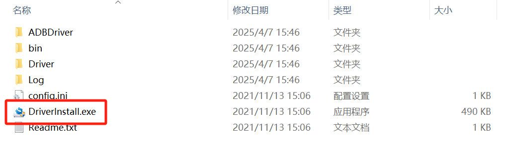

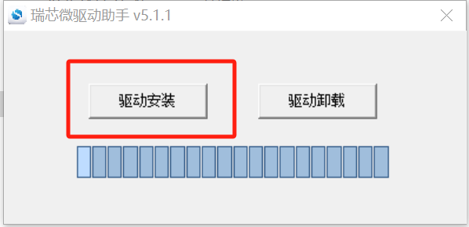

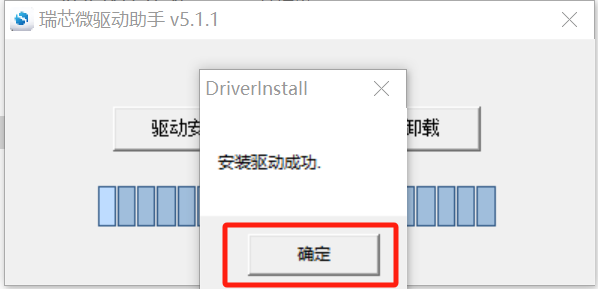

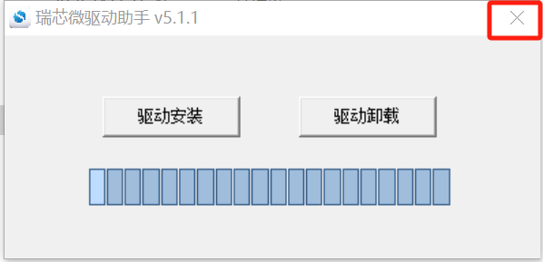

使用RKDevTool工具进行刷机
-----------------

* 从下载的网盘资料中找到RKDevTool驱动安装包,路径为:3.软件资料-->3.2-工具-->RKDevTool_Release_v3.15.zip

* 解压RKDevTool_Release_v3.15.zip后进入RKDevTool_Release_v3.15文件夹

* 双击RKDevTool.exe打开程序

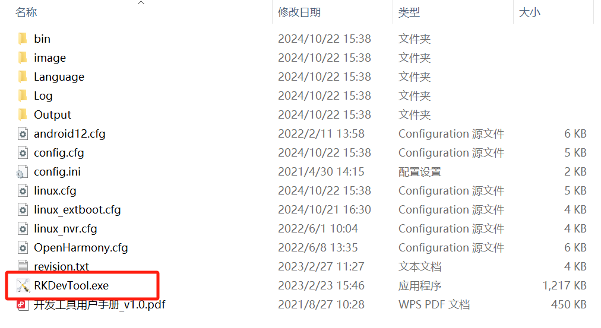

* 点击进入"升级固件"界面

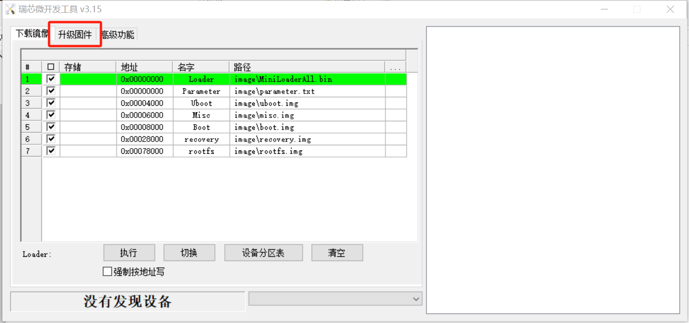

* 点击"固件"按钮,然后选择相应的img镜像文件

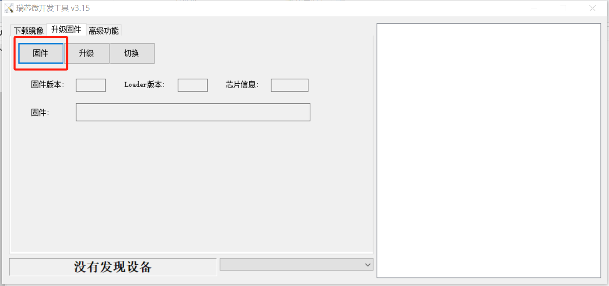

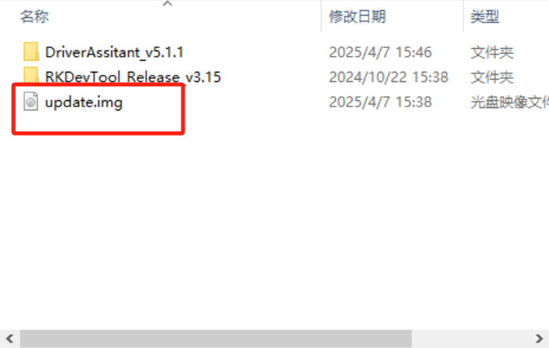

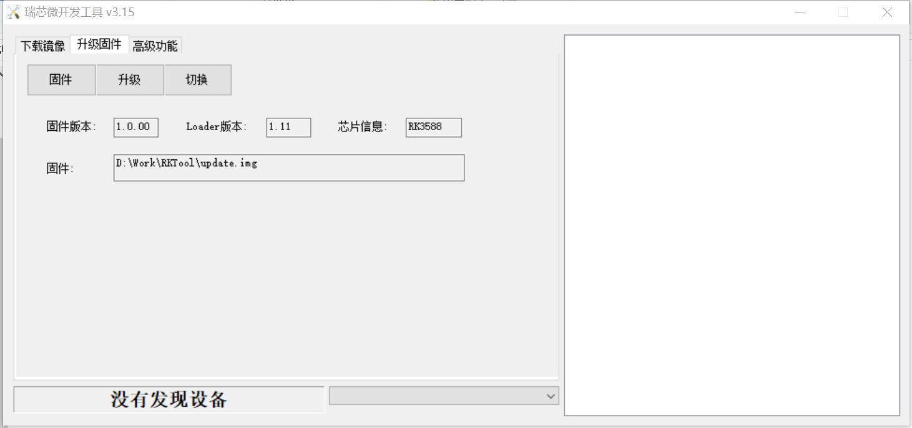

* 开发板接上烧录线,按住开发板SW8按键,再给开发板上电,上电3秒左右可看到开发板进入了download模式

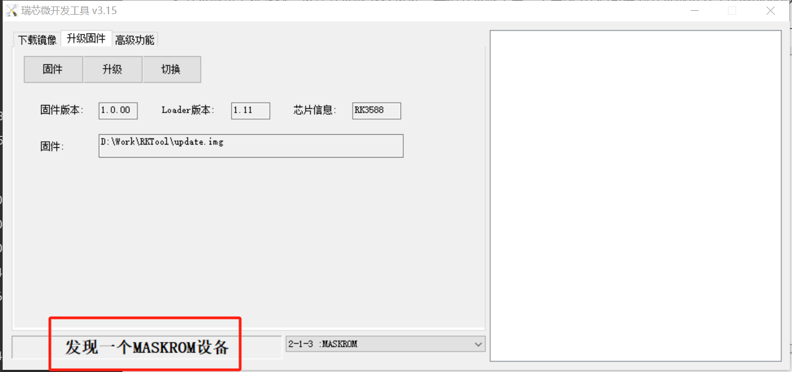

* 点击"升级"按钮进行刷机,刷成功右边显示成功字符

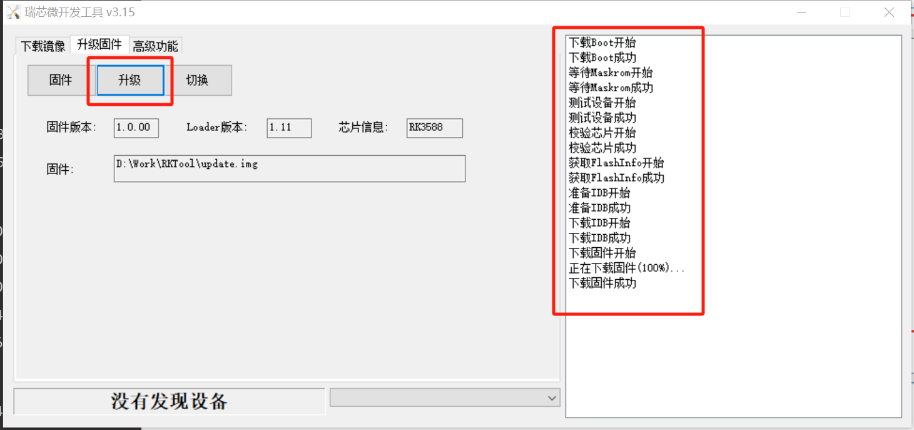

* 烧录完成后,开发板重新上电。
