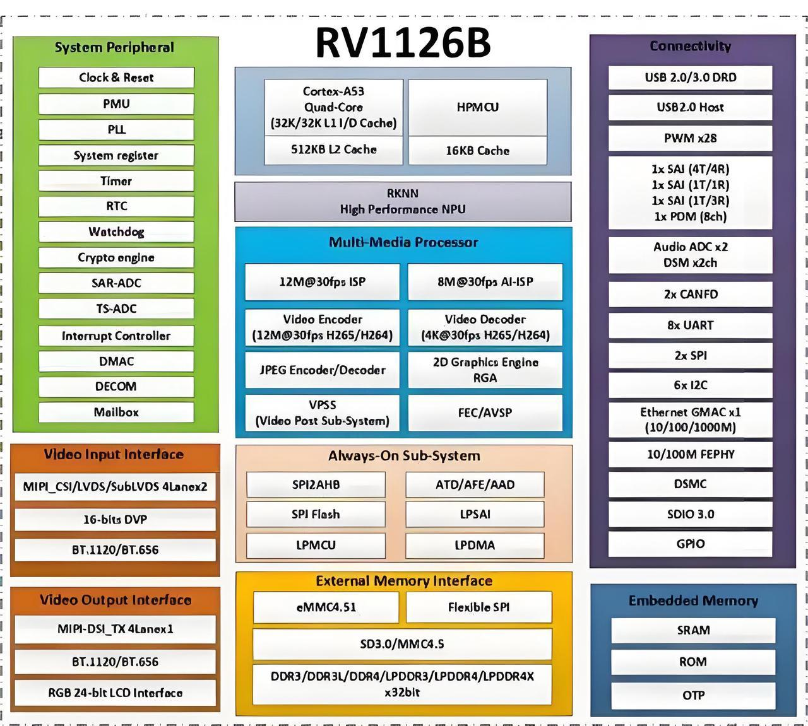

.. raw:: html

   

平台介绍
====

产品简介
----

RV1126B-P是一款面向机器视觉、尤其适配人工智能场景的高性能视觉处理片上系统(SoC)

目标应用
----

智能安防
~~~~

1. 出入口门禁:人脸门禁、小区道闸车牌识别设备

2. 园区安防:厂区/小区视频行为分析摄像头、高空抛物监测相机

3. 超低功耗安防:AOV低功耗声光报警摄像头,机房、楼道7×24h音视频预警摄像机

工业视觉
~~~~

1. 产线质检:电子元件、五金零配件外观缺陷检测设备

2. 工业摄像:AGV巡检机器人双目全景摄像模组、机械臂视觉定位相机

3. 工控配套:PLC视觉辅助检测整机、流水线超广角防抖工业相机

智能车载
~~~~

1. 车载录像:多路全景行车记录仪、大巴/货车车载DVR录像机

2. 驾驶辅助:ADAS前车防撞预警、DM S驾驶员疲劳监测车载摄像头3.特种车辆:工程机械、冷链车车载多路视频监控终端(宽温-40°C~85°C)

服务机器人
~~~~~

1. 仓储物流:仓储搬运AGV机器人环境视觉感知模组、货架货品识别机器人

2. 商用服务:酒店迎宾机器人、商超导购机器人视觉主控

3. 医疗设备:医疗陪护机器人、病房巡检机器人多模态感知主板

边缘计算
~~~~

1. 智慧零售:门店客流统计摄像头、货架商品识别终端

2. 智慧农业:田间病虫害识别相机、养殖环境全天候监测设备

3. 小型边缘终端:社区物联网边缘采集盒、小型站点AI数据处理整机

主要特点
----

算力配置
~~~~

* 四核Cortex-A53处理器,主频1.5GHz,综合性能优于同规格竞品2倍;

* 内置3TOPS自研NPU ,兼容多精度数据与混合量化、Transformer优化,可部署2B及以内大模型、多模态AI模型。

图像成像性能
~~~~~~

* 搭载独立硬件AI-ISP,不占用NPU算力;

* 搭配AIRemosaic实现昼夜自适应成像,暗光画面清晰;

* 最高支持800万@45FPS编码,动态码率优化可节约50%码流;

* 硬件6-DOF防抖+双目/四目全景拼接,防抖与超广角成像能力突出。

超低功耗音频预警
~~~~~~~~

* 搭载AOV3.0技术,自带音频事件唤醒,可识别破碎、异响等异常音源;

* 待机功耗约1mW ,实现全天候不间断音视频侦测。

安全加密特性
~~~~~~

* 内置国密安全引擎,支持SM 2/SM 3/SM 4国密算法;

* 搭配TrustZone隔离、Keyladder密钥管理,实现视频数据、AI模型全链路安全防护。

外设与存储接口
~~~~~~~

* DDR速率升级至3200M T/S,传输效率提升;

* 配备USB3.0、集成百兆以太网PHY与板载音频Codec;

* 可外接4路Sensor,支持多路摄像头同步采集,画面拼接、畸变矫正能力升级。

处理器框图
-----

处理器特性
-----

.. raw:: html

   

.. raw:: html

   

+----+------------+----------------------------------------------------------+
|                 详细参数                                                   |
+====+============+==========================================================+
| 1  | CPU        | 4核ARM Cortex-A53                                        |
+----+------------+----------------------------------------------------------+
| 2  | NPU        | 自研NPU，算力3TOPS                                       |
+----+------------+----------------------------------------------------------+
| 3  | 内存       | 支持32bit的DDR3/DDR3L/LPDDR3/DDR4/LPDDR4内存，还支持     |
|    |            | eMMC 4.51、SPI Flash、Nand                               |
+----+------------+----------------------------------------------------------+
| 4  | 支持模型   | 可流畅运行20亿(2B)参数以内的大语言模型与多模态模型       |
+----+------------+----------------------------------------------------------+
| 5  | ISP        | 专用AI-ISP硬件                                           |
+----+------------+----------------------------------------------------------+
| 6  | 音频处理   | AOV3.0技术                                               |
+----+------------+----------------------------------------------------------+
| 7  | 视频编码   | 最高800万像素@45FPS                                      |
+----+------------+----------------------------------------------------------+
| 8  | 防抖与拼接 | 硬件级6-DOF数字防抖                                      |
+----+------------+----------------------------------------------------------+
| 9  | 安全加密   | 支持SM2/SM3/SM4加密算法，集成TrustZone安全隔离技术       |
+----+------------+----------------------------------------------------------+
| 10 | 外围接口   | USB3.0，Audio Codec，以太网PHY等                         |
+----+------------+----------------------------------------------------------+