.. raw:: html

   

硬件开发指导
======

开发板原理图设计说明
----------

按模块分小节,包括模块介绍、性能、指标、参数、原理。

原理设计注意事项,CheckList。

PCB设计注意事项,CheckList。

ESD、EMC、EMI设计注意事项。

电源设计:电流回路、电流大小。

Debug电路
-------

RV1126BUARTDebug默认选择在PMUIO0域的UART0_RX_M 2/UART0_TX_M 2,默认波特率为1500000bps。

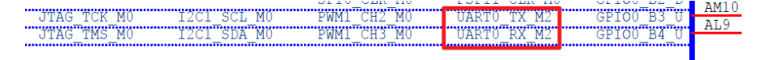

UART接口的使用注意事项:

* SoC端UART接口必须与转换芯片或者外设芯片的IO电平匹配;

* 外部USB转UART的转接芯片,VCCIO供电建议从主板的PMUIO0_VCC3V3电源域取电,避

* 免SOC下电时的电压倒灌;

* 如果需要使用UARTDebug,建议预留2.54排针或测试点,UART的电路如下图所示,串接的510

* ohm电阻不得删减,并增加TVS管,加强抗静电浪涌能力,防止开发过程损坏芯片管脚。

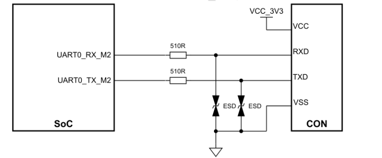

* 或者可以采用CH340T芯片,转为USB信号。

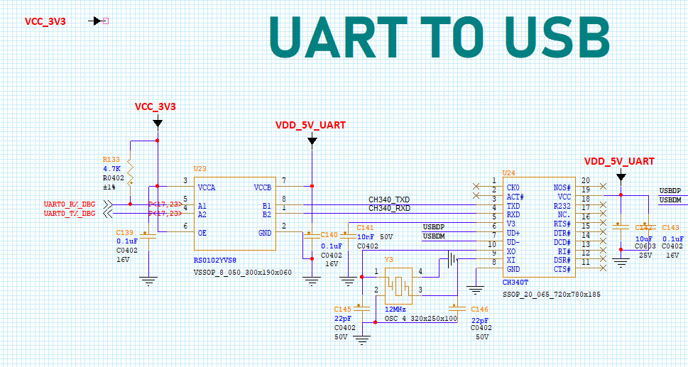

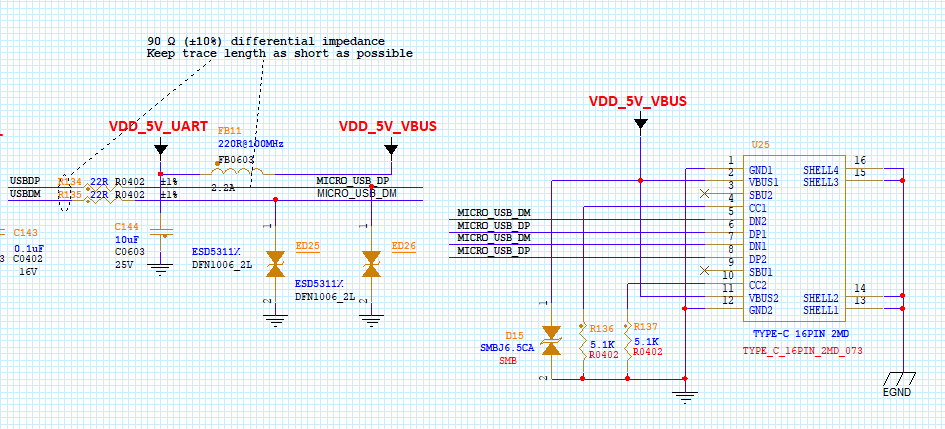

OTG电路
-----

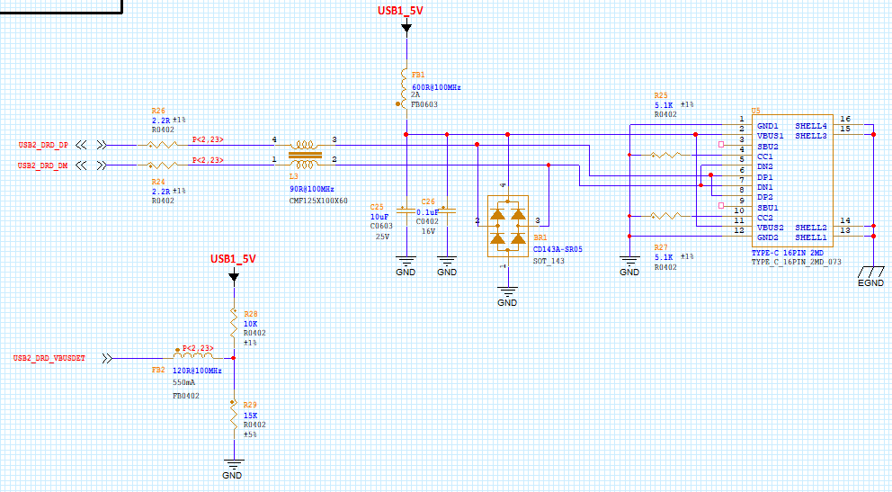

1、请注意接口处加入ESD防护。

2、加入共模滤波,提高信号质量。

电源输入电路
------

1. 12V输入
~~~~~~~~

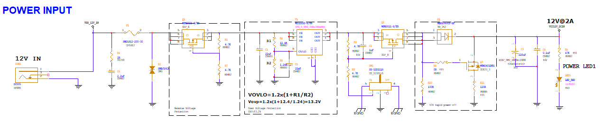

1、此电路具有过压保护,过流保护,防反接。

2、有一个LED电源灯指示。

2. 5V
~~~~~

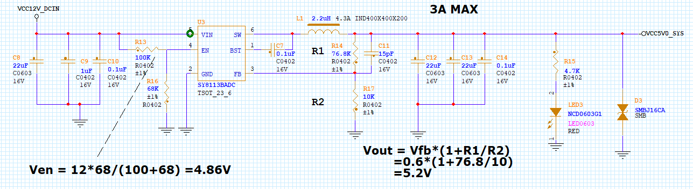

1、使用SY8113BADC的DCDC芯片。

2、最高支持3A电流输出。

3. 3.3V
~~~~~~~

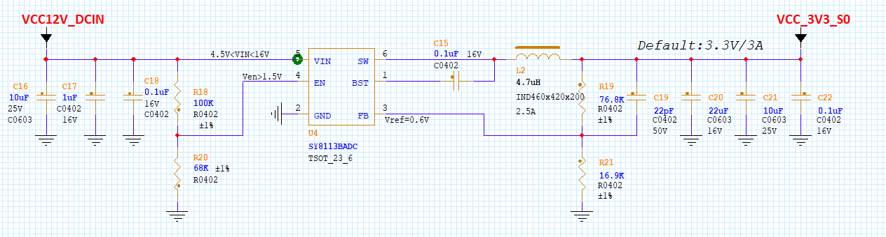

1、使用SY8113BADC的DCDC芯片。

2、最高支持3A电流输出。

USB-HUB电路
---------

1、使用USB2514B芯片。可以一括四路USB。

2、加入过流保护芯片。

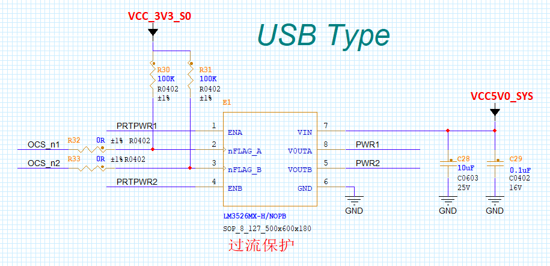

USB3.0
------

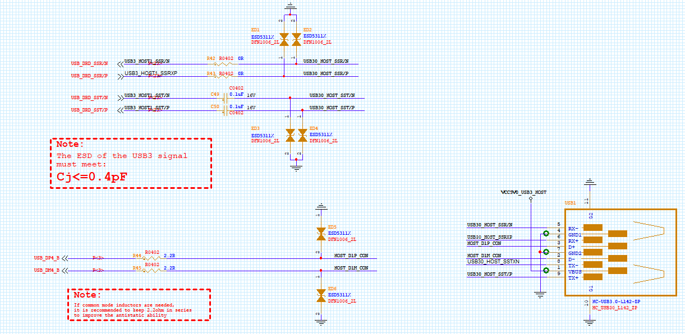

1、USB3.0的信号的TX需要加0.1uF的电容。

2、USB2.0的信号需要串联2.0R电阻。

3、加入了过流保护。

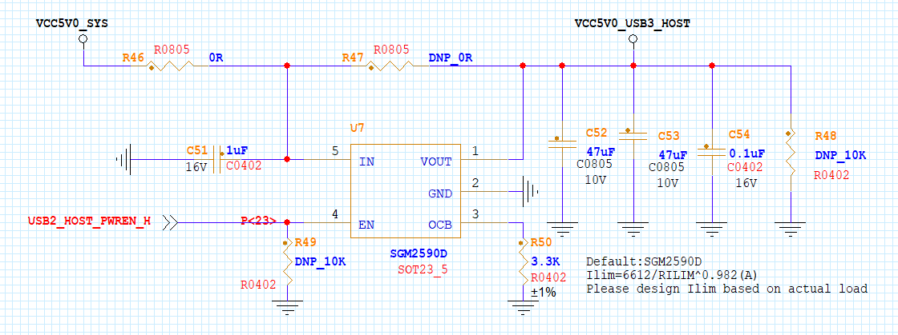

MIPI-CSI
--------

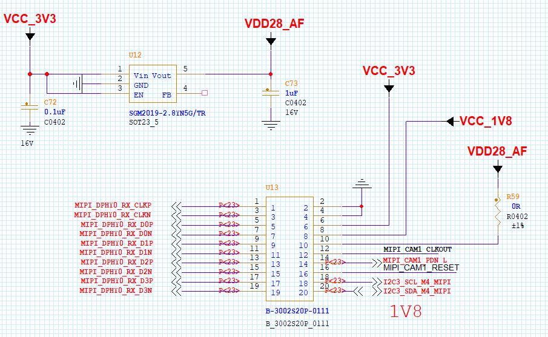

* Camera的DVDD供电有1.2V/1.5V/1.8V等不同情况,请根据Camera的规格书提供准确的电源;

* 有些Camera的DVDD电流比较大(高分辨率模组),超过300mA建议使用DCDC供电;

* 部分Camera的电源有上电时序要求,电源使能管脚请预留RC并根据模组规格书相应调整上电时序;

* 使用CIF接口的Camera时,要注意Camera的DOVDD(IO电源)与SOC端对接的电源域(VCCIO5或者VCCIO6)供电必须用相同的电压;

* ◦◦◦◦使用两个Camera时,可根据需求实际情况电源分开或合并;

* Camera电源的的去耦电容不得删减,必须保留,靠近sensorimage放置;如果Camera模组通过排线与SoC连接,在连接座处也请放置uF级别电容;

* Camera的PWDN信号必须使用GPIO控制,GPIO电平必须和CameraIO电平匹配;

* Camera的Reset/Shutdown信号建议使用GPIO控制,GPIO电平必须和CameraIO电平匹配,

* Reset信号的100nF电容不得删除,靠近座子放置,加强抗静电能力;

* 双摄模式下,如果两个Camera同型号,要注意I2C地址是否可通过SID配置,如果I2C地址固定,那么不能挂在同一组I2C总线上,需要单独连接。

* Camera的MCLK可以从以下时钟源获取:

  * VI_CIF_CLKOUT

  * REF_CLK0_OUT

  * CAM _CLK0_OUT/CAM _CLK1_OUT/CAM _CLK2_OUT/CAM _CLK3_OUT

  * 注意:时钟的电平必须和CameraIO电平匹配,如果不匹配,必须电平转换或电阻分压使电平匹配;

MIPI-DSI
--------

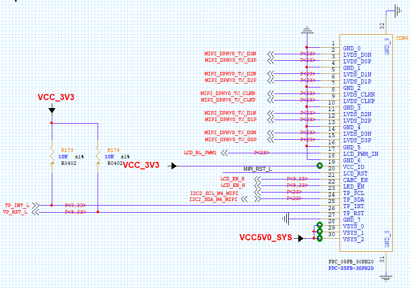

RV1126B有一个MIPIDPHYDSITX,支持MIPIV1.2版本,总共4Lane,通道支持的最大传输速率为1.5Gbps/Lane,最大分辨率支持1920x1080@60Hz。

.. raw:: html

   

.. raw:: html

   

+-------------------------+----------------------------------------------+---------------------------+
| 信号名称                | 布线说明                                     | 功能说明                  |
+=========================+==============================================+===========================+
| MIPI_DPHY_DSI_TX_D0P/N  | 直连，为抑制电磁辐射，建议预留共模电感       | MIPI DSI 数据Lane0输出    |
+-------------------------+----------------------------------------------+---------------------------+
| MIPI_DPHY_DSI_TX_D1P/N  | 直连，为抑制电磁辐射，建议预留共模电感       | MIPI DSI 数据Lane1输出    |
+-------------------------+----------------------------------------------+---------------------------+
| MIPI_DPHY_DSI_TX_D2P/N  | 直连，为抑制电磁辐射，建议预留共模电感       | MIPI DSI 数据Lane2输出    |
+-------------------------+----------------------------------------------+---------------------------+
| MIPI_DPHY_DSI_TX_D3P/N  | 直连，为抑制电磁辐射，建议预留共模电感       | MIPI DSI 时钟输出         |
+-------------------------+----------------------------------------------+---------------------------+
| MIPI_DPHY_DSI_TX_CLKP/N | 直连，为抑制电磁辐射，建议预留共模电感       | MIPI DSI 时钟输出         |
+-------------------------+----------------------------------------------+---------------------------+

MIPIDPHYDSITX接口的设计注意事项:

* 支持1/2/4Lane模式,1Lane默认为D0,2Lane模式默认为D0/D1;

* MIPIDataLane不支持组间对调,需要一一对应;也不支持组内P/N对调;

* 当通过连接器实现板对板连接时,建议串接一定阻值的电阻(2.2ohm,具体以能满足SI测试为准),并预留TVS器件。

LCD
---

RV1126BLCDCTX接口,支持并行24bitRGB模式、16bitBT.1120模式、8bitBT.656模式以及MCU 模式,其中,RGB、BT.1120以及BT.656的分辨率支持如下:

* 24bitRGB模式:最大输出分辨率可达1920x1080@60Hz;

* 16bitBT.1120模式:最大输出分辨率可达1920x1080@60Hz;

* 8bitBT.656模式:最大分辨率为720x576@60Hz支持PAL和NTSC;

LCDCTX接口的信号连接如下图所示:

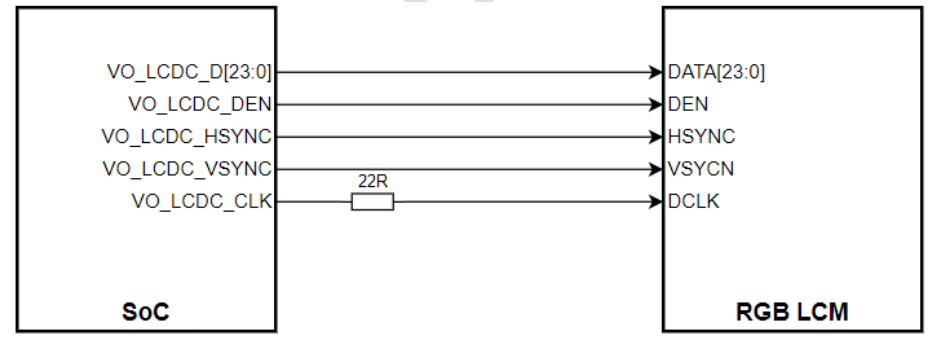

LCDCTX接口的设计注意事项:

* 这些并行信号输出接口电源域为VCCIO5供电,实际产品设计中,需要根据外设的实际IO供电要求(1.8Vor3.3V)选择对应的供电,必须保持一致;

* 当通过连接器实现板对板连接时,建议串接一定阻值的电阻(22ohm-100ohm之间,具体以能满足SI测试为准),并预留TVS器件。

* 为提高并行信号输出接口性能,VCCIO5电源的去耦电容不得删除,布局时请靠近管脚放置。

音频接口
----

RV1126B提供了丰富的音频接口能力与资源,共提供了3组SAI接口、1组PDM 接口、1组DSM 接口、2组AudioADC,以及2组ASRC处理单元。

RV1126B音频子系统框图如下,包括了对外/对内接口相关信息:

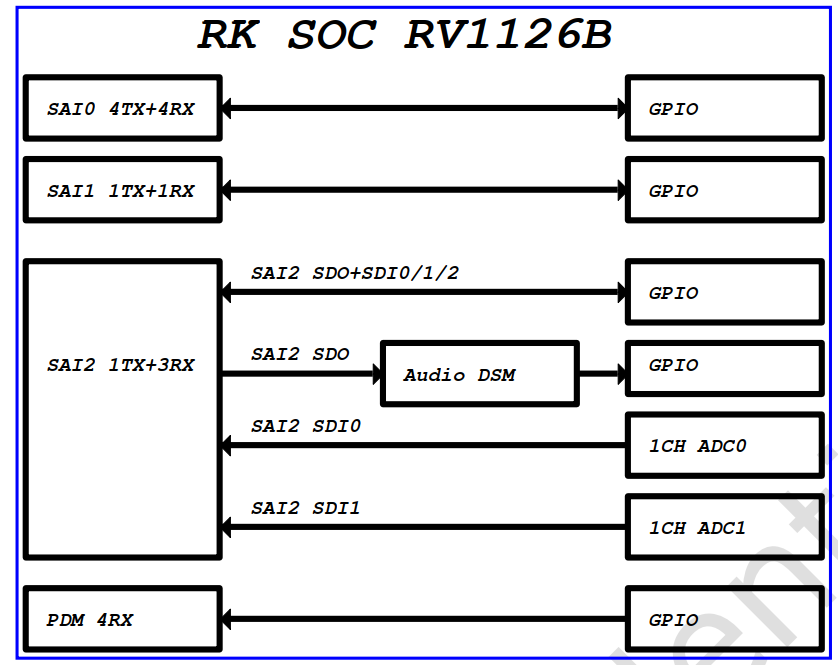

音频设计上需要注意:

* SAI0、SAI1和SAI2最大可以拼接成6TXlane+8RXlane;

* SAI2_SDO可以内部选择连接到AudioDSM 接口,或者直接接到GPIO上,二者只能选择其一;

* SAI2_SDI0可以内部选择连接到AudioADC0接口,或者直接接到GPIO上,二者只能选择其一;

* SAI2_SDI1可以内部选择连接到AudioADC1接口,或者直接接到GPIO上,二者只能选择其一;

* 若AudioDSM 、AudioADC0/1接口都已经有使用了,SAI2接口输入请选择SDI2;

* SAI0、SAI1、SAI2的MCLK不仅支持输出,同时也支持输入,输入模式下可以给PDM 、DSM 、AudioADC0/1,以及SAI接口自身时钟源,例如:SAI0_MCLK可以给PDM 、DSM 、AudioADC0/1、SAI0提供时钟源,SAI1_MCLK可以给SAI1提供时钟源,SAI2_MCLK可以给SAI2提供时钟源;

* 若SAI作为SLAVE,则不需要接MCLK输入。

RV1126B总共提供了3组SAI接口,SAI接口的全称为串行音频接口(SerialAudioInterface),是一种用于数字音频数据通信的串行接口,支持广泛的音频协议,支持PCM 、I2S和TDM 等标准格式,可满足单声道、立体声以及多声道音频传输。作为应用最广泛的数字音频接口,SAI可用于音频

ADC、音频DAC、音频Codec、DSP等外设的通讯,也可为视频输入/输出接口提供集成的音频输入与输出支持。RV1126B的SAI接口具有如下特性:

* 支持8至32bits的位宽,包括常见的如32bits、24bits、16bits;

* 支持高至128通道(slots);

* 支持单声道(M ono)模式;

* 主模式(M aster)、从模式(Slave)下的TX/RX,SCLK设计速率上限为25M ;

SAI0支持4TXLanes+4RXLanes,SAI1支持1TXLanes+1RXLanes,SAI2支持1TXLanes+3RXLanes,这里的TX代表输出数据线SDOx、RX代表输入数据线SDIx。每根TX或RX包含2个通道,数据线的采样率上限可按如下计算:IOrate/(slots*width),slots为通道数、width为位宽,典型采样率参考计算如下,其余采样率可进行参考配置

.. raw:: html

   

.. raw:: html

   

.. list-table::
   :widths: auto
   :header-rows: 1

   * - 模式(Mode)
     - 通道数(Slots)
     - 位宽(Width)
     - LRCK采样率(Sample Rate)
     - SCLK速率
   * - I2S
     - 2
     - 32
     - 16 kHz
     - 1.024 MHz
   * - I2S
     - 2
     - 32
     - 44.1 kHz
     - 2.8224 MHz
   * - I2S
     - 2
     - 32
     - 48 kHz
     - 3.072 MHz
   * - TDM8
     - 8
     - 32
     - 16 kHz
     - 4.096 MHz
   * - TDM8
     - 8
     - 32
     - 44.1 kHz
     - 11.2896 MHz
   * - TDM8
     - 8
     - 32
     - 48 kHz
     - 12.288 MHz
   * - TDM16
     - 16
     - 32
     - 16 kHz
     - 8.192 MHz
   * - TDM16
     - 16
     - 32
     - 44.1 kHz
     - 22.5792 MHz
   * - TDM16
     - 16
     - 32
     - 48 kHz
     - 24.576 MHz

述为理论计算值,实际速率还受IO信号质量、走线时延等因素影响,请注意设计中相关时钟、信号的分配、优化走线。

根据接口设计差异,不同SAI接口的使用速率有如下区别:

.. raw:: html

   

.. raw:: html

   

.. list-table::
   :widths: auto
   :header-rows: 1

   * - 模式(Mode)
     - 最高SCLK速率 (SCLK Rate)
   * - SAIO
     - 13 MHz
   * - SAI1
     - 25 MHz
   * - SAI2
     - 25 MHz

SAI0接口包含独立的4TXLanes和4RXLanes,对于输出数据线SDOx和输入数据SDIx,同时参考一组位/帧时钟SCLK/LRCK。

SAI0接口支持主从工作模式,软件可配置。SAI0提供了一种灵活的兼容性配置模式,可以自定义LRCK、DATA的帧格式,从而实现对绝大多数I2S、PCM 与TDM 的兼容;同时,还提供了3种I2S格式(常规、左对齐、右对齐)、以及earlyPCM 格式的直接配置。

该组SAI引脚复用在2个不同的电源域,SAI0_M0复用在VCCIO7,SAI0_M1复用在VCCIO6,2处复用不能同时使用,每次只能用其中一组。不同的数据线SDOx或SDIx均可在内部进行remap重新配置顺序,例如可以间隔抽取使用SDO1+SDO3组合成2lanes进行使用。

设计中,需要核对SAI外设的IO电平,使其匹配对应的IO电源域供电。

SAI0接口的匹配设计如下表所示:

.. raw:: html

   

.. raw:: html

   

.. list-table::
   :widths: auto
   :header-rows: 1

   * - 信号
     - 默认上下拉
     - 连接方式
     - 描述 (芯片端)
   * - SAIO_MCLK_M0
     - 下拉
     - 串联22ohm电阻
     - SAI系统时钟输出
   * - SAIO_SCLK_M0
     - 下拉
     - 串联22ohm电阻
     - SAI连续串行时钟,位
   * - SAIO_LRCK_M0
     - 下拉
     - 串联22ohm电阻
     - SAI帧时钟,用于声道
   * - SAIO_SDOO_M0
     - 下拉
     - 直连
     - SAI串行输出数据线
   * - SAI0_SDO1_M0/SAI0_SDI3_M0
     - 下拉
     - 直连
     - SAI串行输出数据线1/SAI串行
   * - SAI0_SDO2_M0/SAI0_SDI2_M0
     - 下拉
     - 直连
     - SAI串行输出数据线2/SAI串行
   * - SAI0_SDO3_M0/SAI0_SDI1_M0
     - 下拉
     - 直连
     - SAI串行输出数据线3/SAI串行
   * - SAIO_SDI0_M0
     - 下拉
     - 直连
     - SAI串行输入数据线
   * - SAIO_MCLK_M1
     - 下拉
     - 串联22ohm电阻
     - SAI系统时钟输出
   * - SAI0_SCLK_M1
     - 下拉
     - 串联22ohm电阻
     - SAI连续串行时钟,位
   * - SAIO_LRCK_M1
     - 下拉
     - 串联22ohm电阻
     - SAI帧时钟,用于声道
   * - SAI0_SDO0_M1
     - 下拉
     - 直连
     - SAI串行输出数据线
   * - SAI0_SDO1_M1/SAI0_SDI3_M1
     - 下拉
     - 直连
     - SAI串行输出数据线1/SAI串行
   * - SAI0_SDO2_M1/SAI0_SDI2_M1
     - 下拉
     - 直连
     - SAI串行输出数据线2/SAI串行
   * - SAI0_SDO3_M1/SAI0_SDI1_M1
     - 下拉
     - 直连
     - SAI串行输出数据线3/SAI串行
   * - SAIO_SDI0_M1
     - 下拉
     - 直连
     - SAI串行输入数据线

* PDM 数字音频接口

RV1126B总共提供了1组8通道的PDM 接口,PDM 接口的全称为脉冲密度调制(PulseDensityModulation),通常用于接入数字麦克风,或者通过PDM 接口的模拟音频ADC对模拟麦克风进行录音,采样率通常使用16kHz、48kHz或8kHz,部分有超声要求的产品则需要用到96kHz采样率。

两组PDM 都工作在主接收模式(masterreceivemode,即RV1126B提供PDM 时钟、接收数据),支持8通道输入能力,16至32bits的位宽,最高到192kHz的采样率。

下图是PDM 接口的数据格式,PDM _DATA由Data(R)和Data(L)组成,PDM 是1bit采样接口,分别在CLK的上升沿、下降沿采样这两个Data(L)和Data(R),即每根PDM _SDIx数据线可传输2个声道的音频数据。因此,1组PDM 的四根SDIx数据线可以满足最多接入8个麦克风的需求(或6个麦克风+2个回采声道,共8声道)。

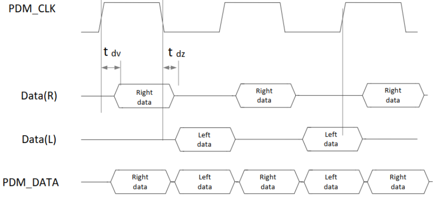

常见的采样率与PDM _CLK的对应关系如下表,在硬件调测时可以对照进行参考。时钟信号的质量对PDM 录音质量有直接影响,因此在PLL分频时候,需要使用小数PLL+整数分频的方式。

.. raw:: html

   

.. raw:: html

   

.. list-table::
   :widths: auto
   :header-rows: 1

   * - PDM_CLK频率
     - 采样率
   * - 3.072MHz
     - 12kHz, 24kHz, 48kHz, 96kHz, 192kHz
   * - 2.8224MHz
     - 11.025kHz, 22.05kHz, 44.1kHz, 88.2kHz, 176.4kHz
   * - 2.048MHz
     - 8kHz, 16kHz, 32kHz, 64kHz, 128kHz

PDM 引脚复用在2个不同的电源域,PDM _M0复用在VCCIO7,PDM _M1复用在VCCIO6,相关复用情况见下表。2处复用不能同时使用,每次只能用其中一组。需要核对PDM 外设的IO电平,使其匹配对应的IO电源域供电。

.. raw:: html

   

.. raw:: html

   
   
+-----+-----+--------+----------------------+
| PDM | M0  | VCCIO7 | CLK0+CLK1+SDI0/1/2/3 |
+-----+-----+--------+----------------------+
| PDM | M1  | VCCIO6 | CLK0+CLK1+SDI0/1/2/3 |
+-----+-----+--------+----------------------+

为改善PCB走线对时钟的影响,提供了两个同源同相的PDM 时钟,PDM _CLK0和PDM _CLK1,可以任意搭配PDM _SDIx数据线使用,具体产品设计中,应结合外设连接情况、产品结构、PCB走线情况进行合理、灵活的分配,避免单一时钟连接多MIC输入情况下,走线长分支、且多负载对信号质量的影响大。

PDM 接口的匹配设计如下表所示:

.. raw:: html

   

.. raw:: html

   

.. list-table::
   :widths: auto
   :header-rows: 1

   * - 信号
     - 默认上下拉
     - 连接方式
     - 描述(芯片端)
   * - PDM_CLK0_M0
     - 下拉
     - 串联22ohm电阻
     - PDM时钟输出
   * - PDM_CLK1_M0
     - 下拉
     - 串联22ohm电阻
     - PDM时钟输出
   * - PDM_SDI0_M0
     - 下拉
     - 直连
     - PDM输入
   * - PDM_SDI1_M0
     - 下拉
     - 直连
     - PDM输入
   * - PDM_SDI2_M0
     - 下拉
     - 直连
     - PDM输入
   * - PDM_SDI3_M0
     - 下拉
     - 直连
     - PDM输入
   * - PDM_CLK0_M1
     - 下拉
     - 串联22ohm电阻
     - PDM时钟输出
   * - PDM_CLK1_M1
     - 上拉
     - 串联22ohm电阻
     - PDM时钟输出
   * - PDM_SDI0_M1
     - 下拉
     - 直连
     - PDM输入
   * - PDM_SDI1_M1
     - 上拉
     - 直连
     - PDM输入
   * - PDM_SDI2_M1
     - 上拉
     - 直连
     - PDM输入
   * - PDM_SDI3_M1
     - 上拉
     - 直连
     - PDM输入

PDM 接口的设计注意事项:

* 为提高PDM 接口性能,对应VCCIO电源域的去耦电容不得删除,布局时请靠近管脚放置;

* 当通过连接器实现板对板连接时,建议时钟/控制/信号都串接一定阻值的电阻(22ohm-100ohm之间,具体以能满足SI测试为准),并预留TVS器件。

DSM音频接口

DSM 音频(DigitalSignalM odulator)指的是将音频PCM 数据进行直接比特流数字编码(DirectStreamDigital)转换输出的1bit信号流数据,在需要音频输出的设计中,接口输出的数字信号,经过一阶RC低通滤波处理后得到模拟音频信号输出。DSM 原理如下图所示:

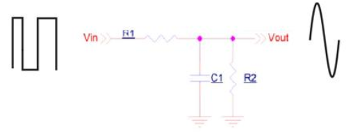

DSM 音频是一种低成本的音频输出方案,对于有音质需求的场景,还是建议外挂音频Codec或DAC实现音频输出。下表为200Kohm负载下,DSM 音频差分输出的音频指标:

.. raw:: html

   

.. raw:: html

   

.. list-table::
   :widths: auto
   :header-rows: 1

   * - 测试项
     - 测试条件
     - 输出信号幅度
     - FS=8KHz
     - FS=16KHz
     - FS=44.1KHz
   * - RMS Level(Vrms)
     - N/A
     - 0dBFS
     - 2.037
     - 2.037
     - 2.037
   * - THD+N(dB)
     - PF=20KHz, HPF=20Hz
     - -3dBFS
     - -72.505
     - -72.888
     - -75.047
   * - SNR(dB)
     - 0dBFS/Noise
     - 94.825
     - 95.035
     - 97.508
     - 97.115
   * - DR(dB)
     - 0dBFS/-60dBFS
     - 77.637
     - 77.732
     - 82.259
     - 84.261
   * - Noise(uVrms)
     - N/A
     - 67.12
     - 64.95
     - 62.37
     - 62.79

该组接口提供了两对差分输出,可满足立体声需求。接口的详细介绍和RC低通滤波参数计算,可参考文档《DSM AUDIO音频接口电路设计》。

* DSM 输出RC滤波电路不能删除;

* 音频时钟信号的质量对DSM 输出质量有直接影响,因此在PLL分频时候,需要使用小数PLL+整数分频的方式;

* PCB走线以及地的处理对DSM 输出质量有直接影响,请按照PCB设计建议走线;

* 差分音频输出不能拆成2路单端音频输出使用,且不建议使用单端模式,音频质量差;

* SAI2_SDO在内部连接到DSM 模块,因此当DSM 模块使用时,外部SAI2SDO不可使用;

DSM 接口的匹配设计如下表所示:

.. raw:: html

   

.. raw:: html

   

.. list-table::
   :widths: auto
   :header-rows: 1

   * - 信号及复用情况
     - 默认上下拉
     - 连接方式
     - 描述(芯片端)
   * - DSM_AUD_LP
     - 下拉
     - 串接RC低通滤波
     - DSM输出左声道正
   * - DSM_AUD_LN
     - 下拉
     - 串接RC低通滤波
     - DSM输出左声道负
   * - DSM_AUD_RP
     - 下拉
     - 串接RC低通滤波
     - DSM输出右声道正
   * - DSM_AUD_RN
     - 下拉
     - 串接RC低通滤波
     - DSM输出右声道负

DSM 音频接口的设计注意事项:

* 为提高接口性能,对应VCCIO电源域的去耦电容不得删除,布局时请靠近管脚放置;

* 当通过连接器实现板对板连接时,建议时钟/控制/信号都串接一定阻值的电阻(22ohm-100ohm之间,具体以能满足SI测试为准),并预留TVS器件。

AU DIOADC音频接口

RV1126B内置2个AUDIOADC,均支持差分MIC输入,使用时请注意:

MIC差分输入参考电路如下图:

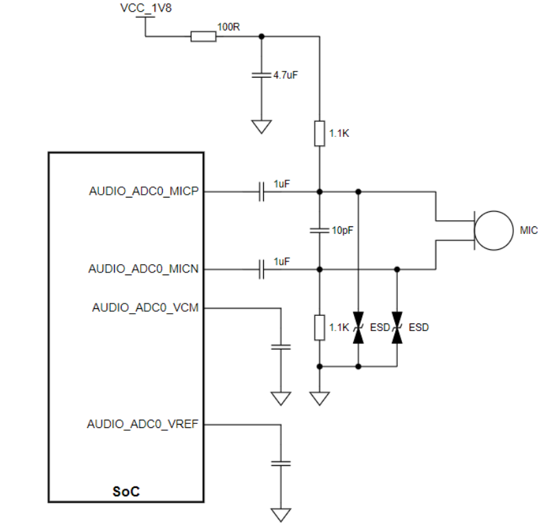

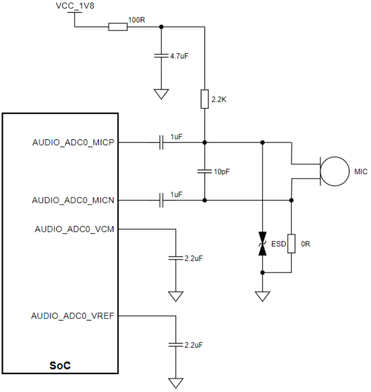

AudioADC接口的设计注意事项:

* MIC的差分输入不能拆成两路单端输入使用;

* AUDIO_ADC_VCM 是AudioADCPHY的共模电压管脚,电压0.8V,外接对地2.2uF电容,不得更改电容值,布局时靠近SOC芯片管脚放置;

* AUDIO_ADC_VREF是AudioADCPHY的参考电压引脚,电压1.6V,外接对地2.2uF电容,不得更改电容值,布局时靠近SOC芯片管脚放置;

* AUDIO_ADC_AVDD_1V8给AUDIOADC0/1模块供电,去耦电容要靠近SOC芯片管脚放置。

* ADDIO_ADC_MIC的输入接口均可做为LINEIN或者MIC_IN的输入通道,如果输入设备为无源MIC,则需要提供1.8V的偏置电压。如果输入设备为有源输入,则不需要。

* MIC输入的耦合电容容值推荐1uF或以上,布局时靠近SOC芯片管脚放置;

* MIC输入的偏置电压,预留RC改善电源噪声,阻值为100ohm,容值为4.7uF;

ASRC异步采样率转换器模块

ASRC(AsynchronousSampleRateConverter)没有具体的硬件IO接口形式,但其对实际产品中的音频方案设计、兼容性、同步和实时等功能有极大影响,因此在本节进行介绍。

在音频系统中,ASRC通常用于将音频数据从一个采样率转换到另一个采样率,或者将基于不同时钟的“不同步的相同采样率”数据进行转换。因此,可以将ASRC模块看作是SAI、PDM 等音频接口的中间件。通过引用ASRC,可以使不同采样率、不同步时钟的设备或接口保持音频通信的连贯性和稳定性。

RV1126B提供了2个ASRC模块,覆盖了对外和对内的音频模块,其支持的采样率范围从8kHz到384kHz,典型的如下表。提供从1比8(下转换)到8比1(上转换)的转换范围。

.. raw:: html

   

.. raw:: html

   

+------------------------------------------------------------+
| ASRC模块典型输入/输出采样率                                |
+============================================================+
| 8kHz, 16kHz, 32kHz, 64kHz, 128kHz                          |
+------------------------------------------------------------+
| 12kHz, 24kHz, 48kHz, 96kHz, 192kHz, 384kHz                 |
+------------------------------------------------------------+
| 11.025kHz, 22.05kHz, 44.1kHz, 88.2kHz, 176.4kHz, 352.8kHz  |
+------------------------------------------------------------+

* 音频外设的设计参考

本章节对于常用的音频外设场景,给出了连接建议,用户可参考使用。

RV1126B可以通过SAI信号,连接音频DAC或CODEC(如RK730)实现模拟输出,再通过音频功放实现功率放大驱动喇叭,如下图所示:

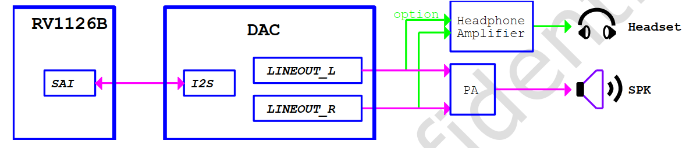

对于低成本方案的喇叭放音需求,可以使用RV1126B的DSM 滤波输出,再通过音频功放实现功率放大驱动喇叭,如下图所示:

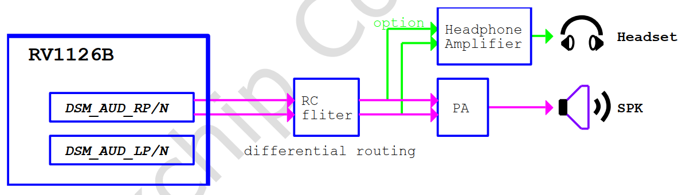

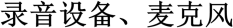

对于录音的需求,有以下几种实现方式:

1、使用内置ACODEC的差分ADC实现模拟信号输入;

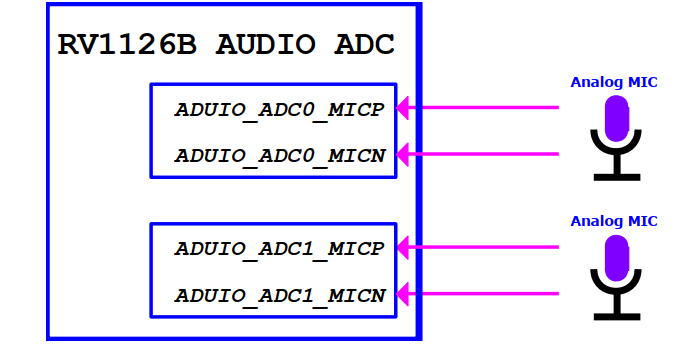

2、PDM 接口连接PDM 麦,或者使用SAI/I2S/PDM 接口的ADC,外接模拟MIC来实现;

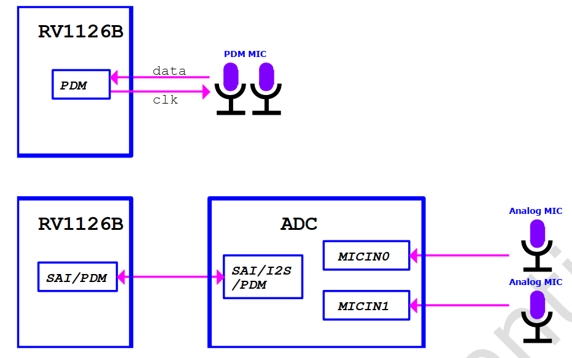

3、使用Codec(如RK730)来实现相关功能,如下图所示;

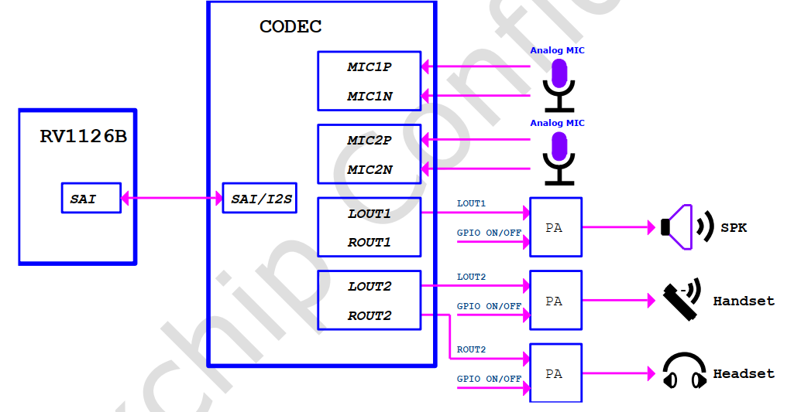

RGMII/RMII接口
------------

GMAC复用在两处不同的电源域,GMAC_M0复用在VCCIO6电源域,GMAC_M1复用在VCCIO5电源域。

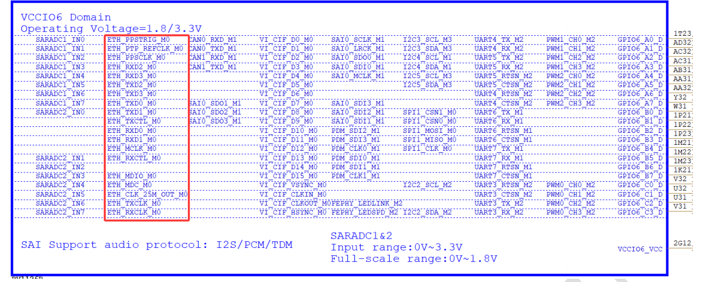

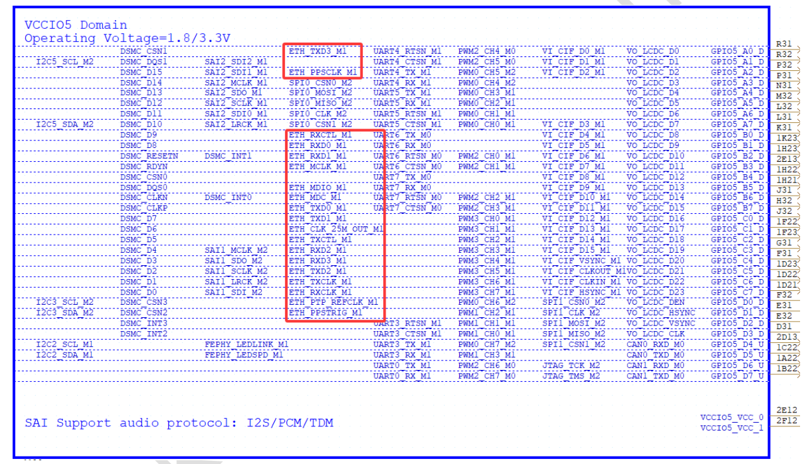

1、两路以太网都采用3.3V的电平。

为提高RGM II/RMII接口性能,所在电源域的VCCIOx_VCC电源的去耦电容不得删除,布局时

请靠近管脚放置。

* ETH_CLK_25M _OUT_M x需在RV1126B端预留串接0ohm电阻,根据实际测试情况调整电阻值来提高信号质量。

* TXD0~TXD3,TXCLK,TXCTL需在RV1126B端预留串接0ohm电阻,根据实际测试情况调整电阻值来提高信号质量。

* RXD0~RXD3,RXCLK,RXCTL需在PHY端串接22ohm电阻,以提高信号质量。

RGM II/RMII接口的匹配设计如下表所示:

.. raw:: html

   

.. raw:: html

   

.. list-table::
   :widths: auto
   :header-rows: 1

   * - 信号
     - 10类型(SOC端)
     - 连接方式
     - RGMII接口
     - 信号描述
     - RMII接口
   * - ETH_TXD[3: 0]_Mx
     - 输出
     - 预留串接0ohm电阻,靠 近SOC端
     - RGMII_TXD[3: 0]
     - 数据发送
     - RMII_TXD[1: 0]
   * - ETH_TXCLK_Mx
     - 输出
     - 预留串接0ohm电阻,靠 近SOC端
     - RGMII TXCLK
     - 数据发送参考时钟
     - 
   * - ETH_TXCTL_Mx
     - 输出
     - 预留串接0ohm电阻,靠 近SOC端
     - RGMII TXCTL
     - 升沿) 和数据发送
     - RMII_TXEN
   * - ETH_RXD[3:0]_Mx
     - 输入
     - 串接22ohm电阻,靠近 PHY端
     - RGMII_RXD[3:0]
     - 数据接收
     - RMII_RXD[1: 0]
   * - ETH_RXCLK_Mx
     - 输入
     - 串接22ohm电阻,靠近 PHY端
     - RGMII_RXCLK
     - 数据接收参考时钟
     - 
   * - ETH_RXCTL_Mx
     - 输入
     - 串接22ohm电阻,靠近 PHY端
     - RGMI_RXCTL
     - 升沿)和接收错误
     - RMII_RXCTL
   * - ETH_MCLK_Mx
     - 输入/输出
     - 0ohm电阻,靠近SOc端 输入模式:串接22ohm
     - RGMII MCLKIN 125M
     - PHY送125MHz给MAC, 可选
     - RMII_MCLKIN50Mor RMII_MCLKOUT50M
   * - E1H_CLK_25M_O UT_Mx
     - 输出
     - 预留串接0ohm电阻,靠 近SOC端
     - E1H_CLKX_25M\_ OUT Mx
     - RV1126B提供25MHz时 钟替代PHY晶体
     - ETH_CLK_25M_OU T_Mx
   * - ETH_MDC_Mx
     - 输出
     - 预留串接0ohm电阻,靠 近SOC端
     - RGMII_MDC
     - 管理数据时钟
     - RMII_MDC
   * - ETH_MDIO_Mx
     - 输入/输出
     - 外部上拉1.5K-1.8Kohm 电阻
     - RGMII_MDIO
     - 管理数据输出/输入
     - RMII_MDIO

当通过连接器实现板对板连接时,建议串接一定阻值的电阻(22ohm-100ohm之间,具体以能满足SI测试为准),并预留TVS器件。

* RGMII/RMII接口连接示意图

RGM IIGEPHY工作时钟使用外置25MHz晶体

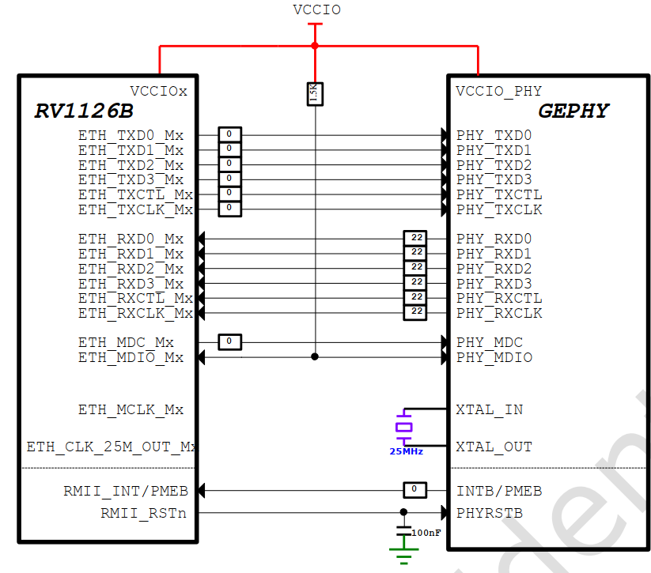

RGM IIGEPHY工作时钟使用RV1126B提供的25MHz

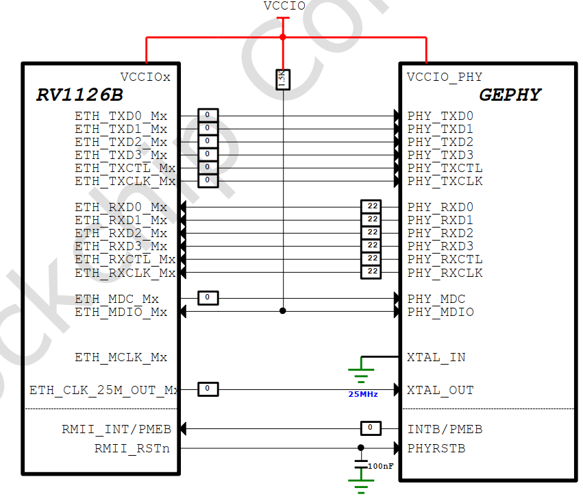

RMIIRMIIFEPHY工作时钟使用25MHz晶体,ETH_MCLK_Mx采用输出模式,当RMII接口的参考时钟,FEPHY的TXCLK需要配置为输入模式

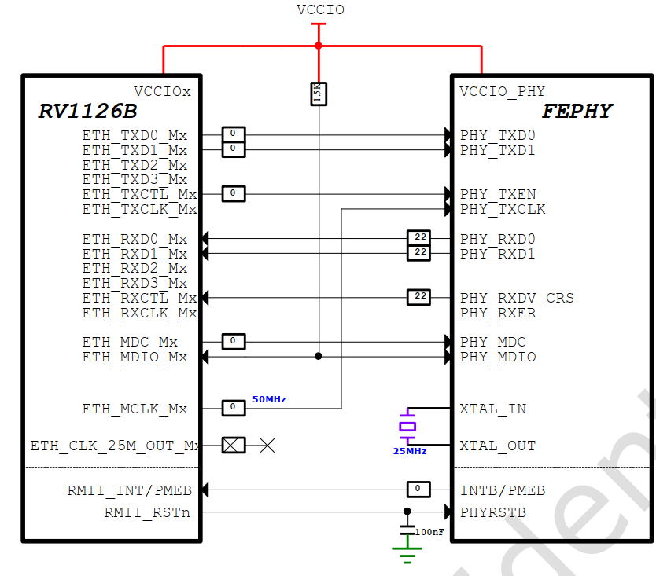

RMII使用SOC提供的25MHz替代FEPHY晶体,ETH_MCLK_Mx采用输出模式,当RMII接口的参考时钟,FEPHY的TXCLK需要配置为输入模式

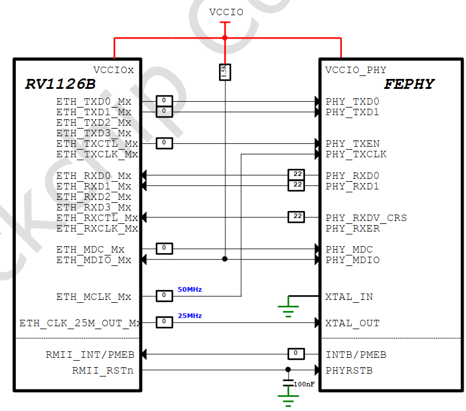

FEPHY工作时钟使用外置25MHz晶体,ETHx_MCLK_Mx采用输入模式,RMII接口的参考时钟由FEPHY提供,FEPHY的TXCLK需要配置为输出模式

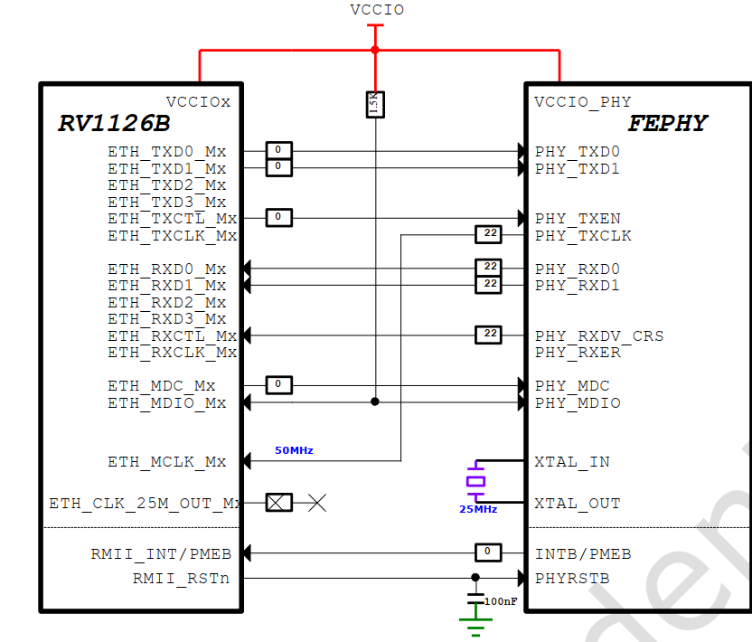

RMII使用SOC提供的25MHz替代FEPHY晶体,ETH_MCLK_Mx采用输入模式,RMII接口的参考时钟由FEPHY提供,FEPHY的TXCLK需要配置为输出模式

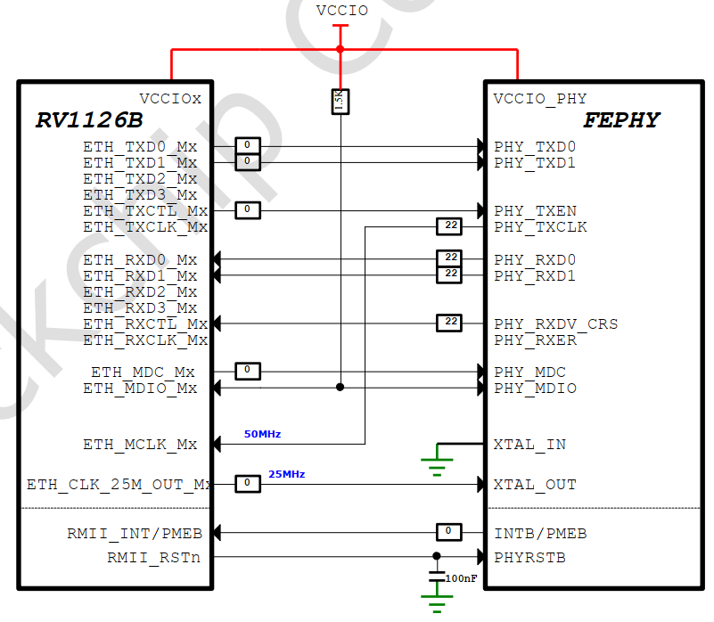

RGM II/RMII接口的设计注意事项:

  * 在RGM II模式下,RV1126B芯片内部TX/RX时钟路径集成了delayline,支持调整;参考图默认配置是:TXCLK与data之间时序由MAC来控制,RXCLK与data之间时序由PHY来控制(如使用**8211F/FI即RXCLK默认开启2nsdelay,其它PHY要注意这个配置)

  * EthernetPHY的Reset信号需要用GPIO来控制,GPIO电平必须和PHYIO电平匹配,靠近PHY管脚必须增加100nF电容,加强抗静电能力,注意:**8211F/FI的复位管脚只支持3.3V电平。

  * **8211F/FI的INTB/PM EB为开漏输出,外部必须增加上拉电阻。

  * PHY使用外置晶体时,晶体电容请根据实际使用的晶体的负载电容值选择,控制频偏在+/-20ppm以内。

  * **8211F/FI的RSET管脚外接电阻为2.49Kohm精度为1%,不得随意修改。

  * PHY的初始化硬件配置必须和实际需求匹配。

  * MDIO必须外部加上拉电阻,推荐1.5-1.8Kohm,上拉电源必须和IO电源保持一致。

  * 变压器中心抽头的连接必须按参考各EthernetPHY厂家的参考设计,因为不同的PHY厂家会有不同的连接方式。

  * 1000pF隔离电容建议采用高压安规电容,有足够大的电气间隙保证雷击的安全性。

  * 网络变压器高压侧的75ohm电阻建议采用0805以上的封装。

  * 雷击防护等级达到4KV以上需要增加防雷管,普通的隔离变压器只能满足2KV等级要求。

  * 如果有雷击差分测试要求,M DI差分对间需要增加TVS管。

  * 务必确认RJ45封装和原理图是否一致,RJ45有分Tabdown和Tabup,信号顺序刚好是相反,如果使用**8211F/FI建议采用Tabdown,M DI顺序是顺的。

* FEPHY接口

RV1126B内置的FEPHY,可以实现百兆以太网功能,同一时间与GMAC_M0/GMAC_M1只能选择其中之一进行使用。

FEPHY接口的信号连接如下图所示:

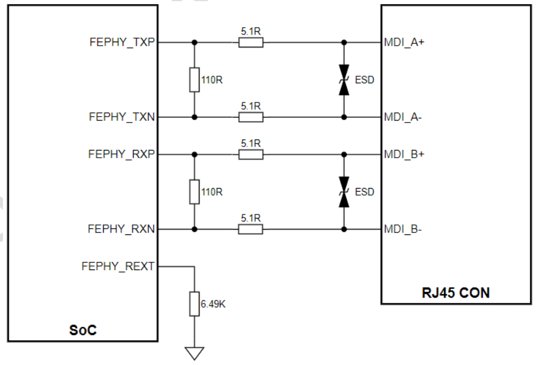

FEPHY接口的设计注意事项:
 
  * 为提高性能,FEPHY各路电源的去耦电容不得删除,布局时请靠近管脚放置;
  
  * FEPHY输出支持TX/RX对调,支持组内P/N对调,可根据PCB走线情况做适当调整;

  * 差分信号FEPHY_TXP/N之间和差分信号FEPHY_RXP/N之间,需要并联110ohm端接电阻,靠近SoC端放置,不得删除;

  * FEPHY_TXP/N、FEPHY_RXP/N串联5.1ohm电阻,靠近变压器端放置,可以提高抗浪涌能力;

  * 变压器中心抽头的1nF,容值不得修改,靠近变压器放置;

FEPHY接口的匹配设计如下表所示

.. raw:: html

   

.. raw:: html

   

.. list-table::
   :widths: auto
   :header-rows: 1

   * - 信号
     - 连接方式
     - 描述 (芯片端)
   * - FEPHY_TXP/N
     - 差分对间并联110ohm电阻,靠近SoC端;单端信号串联5.1ohm电阻 靠近变压器端
     - 数据发送差分对信号
   * - FEPHY_RXP/N
     - 差分对间并联110ohm电阻,靠近SoC端;单端信号串联5.1ohm电阻 靠近变压器端
     - 数据接收差分对信号
   * - FEPHY_EXTR
     - 串接6.49Kohm1%精密电阻接地,靠近引l脚放置
     - 参考电阻

UART接口
------

RV1126B芯片拥有8个UART控制器,支持以下功能:

⚫支持全双工和半双工通信模式;

⚫均包含两个64字节的FIFO用于数据接收和传输;

⚫传输速率最高4Mbps;

⚫支持可编程波特率,支持非整数时钟分频器;

⚫支持基于中断或基于DM A的模式;

⚫支持5-8位宽度传输;

⚫ UART1~7支持RS485自动收发功能。

⚫ UART0默认为烧录、打印串口

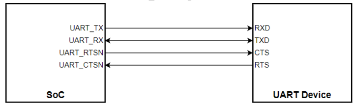

考虑不同产品应用灵活性,8个UART分别复用在几个不同的电源域,用后缀M0/M1/M 2/M 3区分不同复用位置。M0/M1/M 2/M 3不能同时使用,分配时只能选择其中一组,不能有些信号选择M0,有些选择M1,有些选择M 2,这个功能不支持。8个UART中只有UART0不带流控功能,其余UART1~7均带流控功能。

RV1126BUART接口分布情况:

.. raw:: html

   

.. raw:: html

   

.. list-table::
   :widths: auto
   :header-rows: 1

   * - UART编号
     - 复用情况
     - 复用电源域
   * - UART0(Default DebugUart)
     - M0,M1,M2
     - MO:VCCIO2M1:VCCIO5M2:PMUI00
   * - UART1
     - M0, M1
     - MO:PMUIO1M1:VCCI03
   * - UART2
     - M0, M1
     - MO: VCCIO3M1: VCCIO7
   * - UART3
     - MO,M1,M2
     - M0: VCCIO2M1: VCCIO5M2:VCCI06
   * - UART4
     - MO,M1,M2,M3
     - MO:VCCIO4M1: VCCIO5M2:VCCIO6M3
   * - UART5
     - MO,M1,M2
     - MO: VCCI04M1: VCCIO5M2: VCCI06
   * - UART6
     - MO,M1
     - MO:VCCIO5M1:VCCI06
   * - UART7
     - M0,M1
     - MO:VCCI05 M1:VCCI06

UART接口的设计注意事项:

* 根据UART外设的IO电平,调整对应的电源域供电,必须保持一致;

* 注意SoC与UARTdevice连接时,TX/RX的方向;

* 当通过连接器实现板对板连接时,建议串接一定阻值的电阻(22ohm-100ohm之间,具体以能满足SI测试为准),并预留TVS器件。

RS232
-----

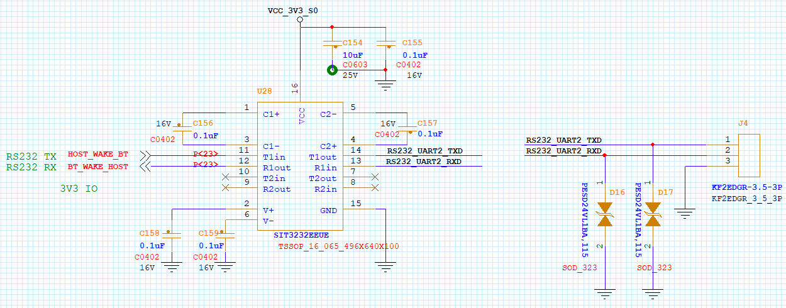

1、注意接口处加ESD防护。

2、注意串口的电平为3.3V。

RS485
-----

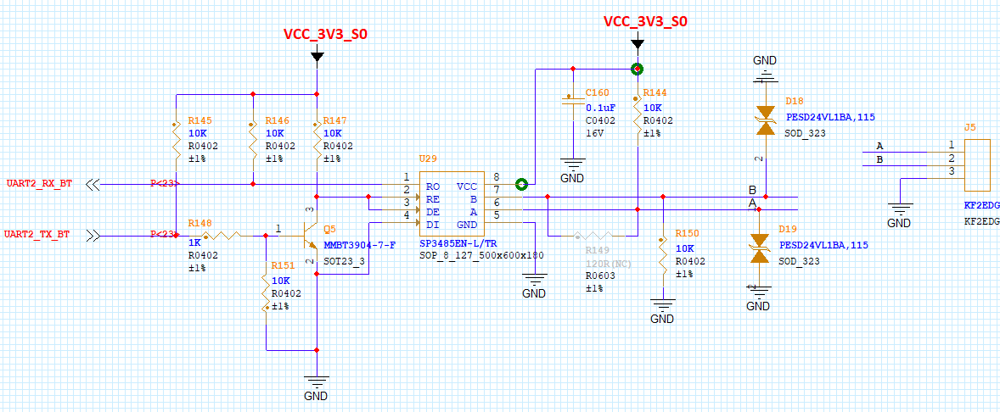

1、注意接口处加ESD防护。

2、注意串口的电平为3.3V。

CAN
---

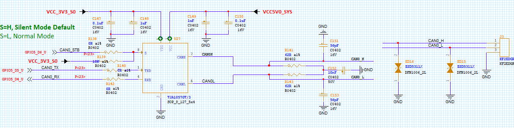

RV1126B芯片拥有2个CAN控制器,支持以下功能:

* 支持传统CAN和经优化后的CANFD,传输速率为1、2和5Mbps(可以有条件的支持最高8Mbps的速率,但是8M 的速率对信号质量、环路延时要求高,需要客户自行保证);

* 支持发送或接收标准帧;

* 支持发送或接收扩展帧考虑不同产品应用灵活性,2个CAN分别复用在几个不同的电源域,用后缀M0/M1区分不同复用位置。IOM UX_M0/M1不能同时使用,分配时只能选择其中一组,例如:选择了CAN_M0,就不能再选择CAN_M1。

CAN接口的信号连接如下图所示:

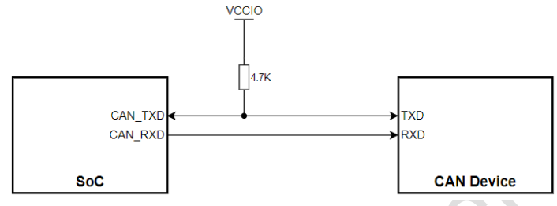

CAN接口的设计注意事项:

* 根据CAN外设的IO电平,调整对应的电源域供电,必须保持一致。

* 当通过连接器实现板对板连接时,建议串接一定阻值的电阻(22ohm-100ohm之间,具体以能满足SI测试为准),并预留TVS器件。

I2C
---

RV1126B芯片拥有6个I2C控制器,支持以下功能:

* 支持I2C总线主模式,不支持从模式;

* 最高支持软件可编程时钟频率和传输速率达1M bit/s;

* 支持7位和10位寻址模式。

考虑不同产品应用灵活性,6个I2C分别复用在几个不同的电源域,用后缀M0/M1/M 2/M 3区分不同复用位置。IOM UX_M0/M1/M 2/M 3不能同时使用,分配时只能选择其中一组,例如:不能选择了I2C1_M0,又选择了I2C1_M1、I2C1_M 2或I2C1_M3。

I2C接口的信号连接如下图所示:

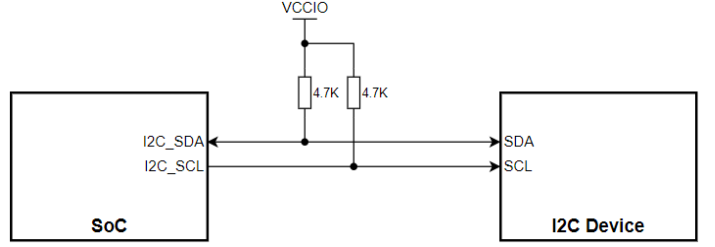

I2C接口分布情况如下表:

.. raw:: html

   

.. raw:: html

   

.. list-table::
   :widths: auto
   :header-rows: 1

   * - I2C编号
     - 复用情况
     - 复用电源域
   * - I2C0
     - M0,M1
     - M0:PMUIO1M1:VCCIO2
   * - I2C1
     - M0,M1,M2,M3
     - MO:PMUI00M1:VCCIO3M2:VCCIO4M3:VCCI07
   * - I2C2
     - M0,M1,M2
     - M0:PMUIO1M1:VCCI05M2:VCCI06
   * - I2C3
     - M0,M1,M2,M3
     - M0:PMUIO1M1: VCCIO4M2:VCCIO5M3:VCCI06
   * - I2C4
     - MO,M1,M2,M3
     - MO:VCCIO3M1:VCCIO6M2:VCCIO4M3:VCCI07
   * - I2C5
     - M0,M1,M2,M3
     - MO:PMUIO1M1:VCCIO3M2:VCCI05M3:VCCI06

I2C接口的匹配设计如下表所示:

.. raw:: html

   

.. raw:: html

   

.. list-table::
   :widths: auto
   :header-rows: 1

   * - 信号
     - 连接方式
     - 描述 (芯片端)
   * - I2Cx_SCL
     - 直连
     - I2C时钟
   * - I2Cx_SDA
     - 直连
     - I2C数据输出/输入

I2C接口的设计注意事项:

* 根据I2C外设的IO电平,调整对应的电源域供电,必须保持电平一致;

* I2C信号SCL、SDA需要外接上拉电阻,根据总线负载不同,选择不同阻值的电阻,推荐接2.2-4.7kohm上拉电阻。

* I2C总线上各设备地址不要冲突,上拉电源必须和GPIO电源域电源保持一致。

* 当通过连接器实现板对板连接时,建议串接一定阻值的电阻(22ohm-100ohm之间,具体以能满足SI测试为准),并预留TVS器件。

SPI
---

.. raw:: html

   

.. raw:: html

   

.. list-table::
   :widths: auto
   :header-rows: 1

   * - SPI编号
     - 复用情况
     - 复用电源域
   * - SPI0
     - M0,M1,M2
     - MO:PMUIO0M1:VCCIO4N
   * - SPI1
     - M0,M1,M2
     - M0:VCCIO6M1:VCCIO3N

根据SPI外设的IO电平,调整对应的电源域供电,必须保持一致。SPI接口的匹配设计如下表所示:

.. raw:: html

   

.. raw:: html

   

.. list-table::
   :widths: auto
   :header-rows: 1

   * - 信号
     - 连接方式
     - 描述 (芯片端)
   * - SPIx_CLK
     - 直连
     - SPI时钟
   * - SPIx_MOSI
     - 直连
     - SPI数据输出(Master)
   * - SPIx_MISO
     - 直连
     - SPI数据输入(Master)
   * - SPIx_CS0
     - 直连
     - SPI片选0
   * - SPIx_CS1
     - 直连
     - SPI片选1

SPI接口的设计注意事项:

当通过连接器实现板对板连接时,建议串接一定阻值的电阻(22ohm-100ohm之间,具体以能满足SI测试为准),并预留TVS器件。

根据接口设计差异,不同SPI接口的使用速率有如下区别:

.. raw:: html

   

.. raw:: html

   

.. list-table::
   :widths: auto
   :header-rows: 1

   * - 接口
     - 最高CLK速率 ( CLK Rate)
   * - SPI1_M1
     - 50MHz
   * - SPI0_M0
     - 24MHz
   * - SPI0_M1/SPI0_M2SPI1_M0/SPI1_M2
     - 20MHz

PWM
---

RV1126B芯片集成了4个独立的PWM 控制器,最多支持28个PWM 通道。PWM0控制器有8个通道,分别是PWM0_CH0~PWM0_CH7,PWM1控制器有4个通道,分别是PWM1_CH0~PWM1_CH3,PWM 2控制器有8个通道,分别是PWM 2_CH0~PWM 2_CH7,PWM 3控制器有8个通道,分别是PWM 3_CH0~PWM 3_CH7。

PWM 控制器均支持以下功能:

* 支持捕获模式;

* 支持连续模式或一次性模式;

* 每个通道都有两种时钟输入可选,一个是从晶振输入的固定频率,一个是从PLL总线分频,频率可配置的;

不同PWM 控制器的功能差异如下:

* 波形发生器可以通过硬件实现呼吸灯功能,不消耗CPU ;

* IR输入可以实现红外输入;

* 双相计数器常用于多电机控制,如扫地机;

.. raw:: html

   

.. raw:: html

   

+-----------------------------------------+----------------------------------+----------------------------------+---------------------------------------+----------------------------------+
| 功能                                    | PWM0_8CH                         | PWM1_4CH                         | PWM2_8CH                              | PWM3_8                           |
+=========================================+==================================+==================================+=======================================+==================================+
| 波形发生器                              | NO                               | NO                               | 8个通道都支持，共享查找表(深度768)    | NO                               |
|                                         |                                  |                                  | 举例:1路768粒度;3路256粒度;6路128粒度 |                                  |
+-----------------------------------------+----------------------------------+----------------------------------+---------------------------------------+----------------------------------+
| IR输入                                  | NO                               | 只支持1个，可在PWM1_CH0~3任意配置| NO                                    | NO                               |
+-----------------------------------------+----------------------------------+----------------------------------+---------------------------------------+----------------------------------+
| IR输出                                  | NO                               | NO                               | NO                                    | NO                               |
+-----------------------------------------+----------------------------------+----------------------------------+---------------------------------------+----------------------------------+
| 双相计数器                              | 支持4路双相计数器(只用单相,也可  | NO                               | 支持4路双相计数器(只用单相,也可       | 支持4路双相计数器，可用作频率计  |
|                                         | 用作频率计,支持频率20M)          |                                  | 用作频率计,支持频率20M)               | CH0+CH4/CH1+CH5/CH2+CH6/CH3+CH7  |
|                                         | CH0+CH4/CH1+CH5/CH2+CH6/CH3+CH7  |                                  | CH0+CH4/CH1+CH5/CH2+CH6/CH3+CH7       | 组成四路双相计数器               |
+-----------------------------------------+----------------------------------+----------------------------------+---------------------------------------+----------------------------------+
| 全局控制模式(支持多通道配置的同步更新)  | YES                              | YES                              | YES                                   | YES                              |
+-----------------------------------------+----------------------------------+----------------------------------+---------------------------------------+----------------------------------+
| 输出偏移模式(PWM输出波形偏移指定的时间) | YES                              | YES                              | YES                                   | YES                              |
+-----------------------------------------+----------------------------------+----------------------------------+---------------------------------------+----------------------------------+

考虑不同产品应用灵活性,28个PWM 通道分别复用在几个不同的电源域,用后缀M0/M1/M 2区分不同复用位置。IOM UX_M0/M1/M 2不能同时使用,分配时只能选择其中一组,例如:选择了PWM _CH0_M0,就不能再选择PWM _CH0_M1或其它PWM _CH0_M*。

RV1126BPWM 接口分布情况如下表所示:

.. raw:: html

   

.. raw:: html

   

.. list-table::
   :widths: auto
   :header-rows: 1

   * - PWM编号
     - 复用情况
     - 复用电源域
   * - PWM0_CH0~3
     - M0,M1,M2
     - MO:PMUIO1M1:VCCI05M2:VCCI06
   * - PWM0_CH4~7
     - M0,M1,M2
     - MO:PMUIO1M1:VCCIO4M2:VCCI05
   * - PWM1_CH0~3
     - MO,M1,M2
     - MO:PMUIO0M1: VCCI05M2:VCCI06
   * - PWM2_CH0~3
     - MO,M1,M2
     - MO:VCCIO3M1:VCCIO5M2:VCCI06
   * - PWM2_CH4~7
     - MO, M1
     - MO:VCCIO5M1:VCCI07
   * - PWM3_CH0~7
     - M0,M1
     - MO: VCCIO1 M1: VCCI05

PWM 接口的设计注意事项:

* 根据PWM 外设的IO电平,调整对应的电源域供电,必须保持电平一致。

* 当通过连接器实现板对板连接时,建议串接一定阻值的电阻(22ohm-100ohm之间,具体以能满足SI测试为准),并预留TVS器件。

* 当红外接收头信号输入时,需要注意以下:

◦◦◦◦◦◦◦◦◦待机下,要支持红外接收头唤醒,而且考虑低功耗(即LOGIC_DVDD电源断电方案),只能选择PWM1_CH0~3当红外接收头输入;

红外接收头的电源需要使用PMUIO1_VCC引脚的供电电压;

红外接收头的电源需要22-100ohm电阻和10uF以上电容进行RC滤波;

红外接收头默认采用38KHz,如果换成其它频率软件需要相应稍调;

红外接收头输出电平必须和RV1126BIO电平匹配;

红外接收头输出脚建议串22ohm电阻并对1nF电容,再连接到RV1126B,加强抗静电浪涌能力。

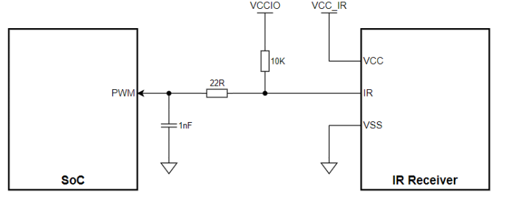

红外接收头布局时,应远离无线模块天线,如Wi-Fi天线,以免无线传输数据时,影响红外信号接收。

红外接收头布局应避开板上LED光源直射,避免LED闪烁频率影响红外接收。

IR信号建议全程包地处理,无法包地处理,建议和其它信号间隔:≥2倍线宽。

WIFI&BT
-------

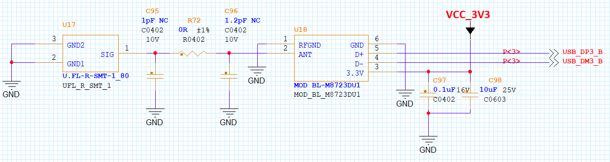

1、使用的BL-8723DU 模块。

2、支持2.4GWIFI和5.0蓝牙。

按键
---

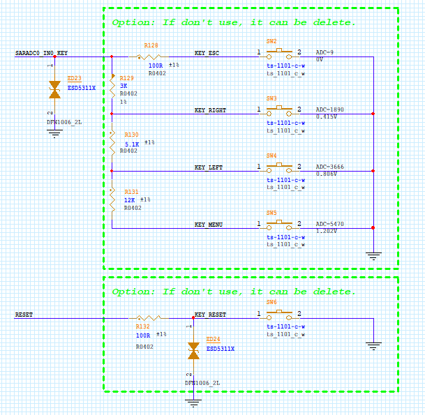

开发板使用SARADC_IN0(ESC/RECOVERY、MENU 、LEFT、RIGHT)作为按键检测口,支持13位分辨率。4个ADCKEY按键可以通过软件自行配置用途。

上电时按住按键可以进入RECOVERY模式。

排针
---

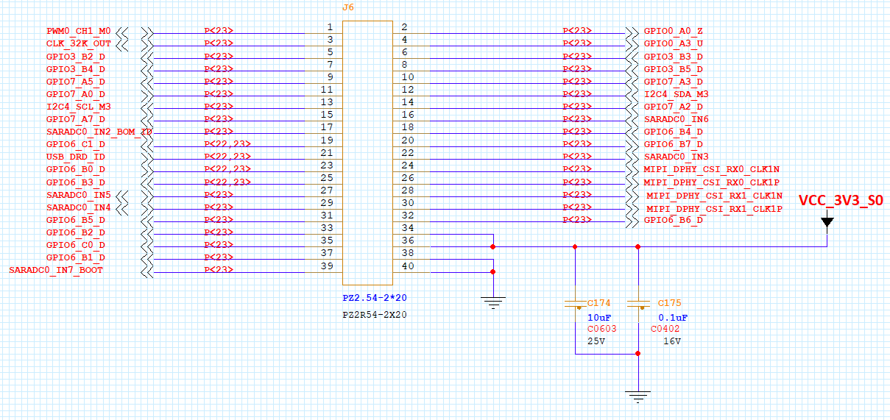

1.40Pin的排针。

2. 有GPIO、I2C、ADC。
