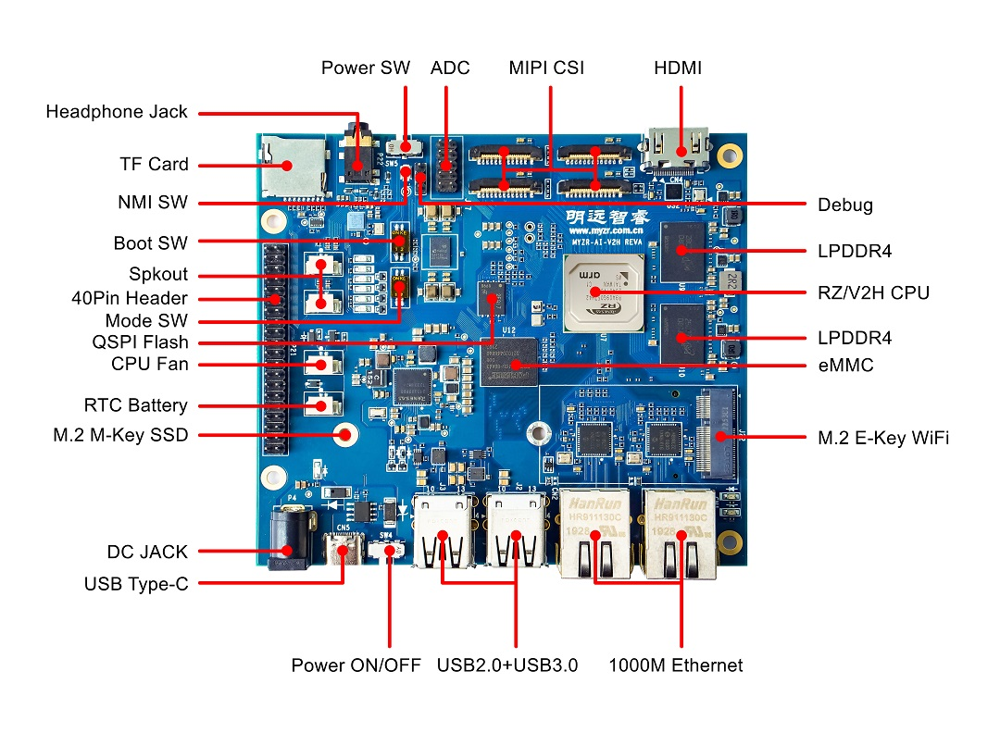

Datasheet
=========

Interfaces
----------

Tech Specs
----------

+----------------------+---------------------------------------------------------------------------+
| Item                 | Description                                                               |
+======================+===========================================================================+
| SoC                  | Renesas RZ/V2H                                                            |
+----------------------+---------------------------------------------------------------------------+
| CPU                  | Quad 64-bit Arm® Cortex®-A55 Application processing (up to 1.8 GHz)       |
+                      +                                                                           +
|                      | Dual 32-bit Arm® Cortex®-R8 Real-time processing (up to 800 MHz)          |
+                      +                                                                           +
|                      | 32-bit Arm® Cortex®-M33 System management processing (up to 200 MHz)      |
+----------------------+---------------------------------------------------------------------------+
| GPU (option)         | Arm® Mali™-G31, One single-pixel shader core                              |
+                      +                                                                           +
|                      | OpenGL ES™ 1.1, 2.0, and 3.2 supported                                    |
+                      +                                                                           +
|                      | OpenCL 2.0 full profile supported                                         |
+----------------------+---------------------------------------------------------------------------+
| AI accelerator       | Up to 8 dense TOPS                                                        |
+                      +                                                                           +
|                      | Up to 80 sparse TOPS                                                      |
+                      +                                                                           +
|                      |                                                                           |
+----------------------+---------------------------------------------------------------------------+
| ISP (option)         | Arm® Mali™-C55, 1 unit, supporting 4K                                     |
+                      +                                                                           +
|                      | Maximum pixel rate: 630 Mpixels/s                                         |
+                      +                                                                           +
|                      | Supports input formats: RAW8, 10, 12, 14, 16, 20                          |
+                      +                                                                           +
|                      | Supports output formats: YUV422, YUV420, RGB                              |
+                      +                                                                           +
|                      |                                                                           |
+----------------------+---------------------------------------------------------------------------+
| ISU                  | Input image size (max): 4096 × 4096                                       |
+                      +                                                                           +
|                      | Output image size (max): 4096 × 4096                                      |
+                      +                                                                           +
|                      | Supports color format conversion (YCbCr422, YcbCr420, RGB)                |
+----------------------+---------------------------------------------------------------------------+
| Video Codec          | H.264/H.265 codec module                                                  |
+                      +                                                                           +
|                      | Support for encoding and decoding                                         |
+                      +                                                                           +
|                      | Maximum size: 1920×1080@60fps(H.264), 3840×2160@30fps(H.265)              |
+----------------------+---------------------------------------------------------------------------+
| System RAM           | 6 Mbytes (with ECC)                                                       |
+----------------------+---------------------------------------------------------------------------+
| DDR                  | LPDDR4, 4GB/8GB/16GB                                                      |
+----------------------+---------------------------------------------------------------------------+
| Storage (Onboard)    | SPI Flash, 64MB SPI Flash for Bootloader                                  |
+                      +                                                                           +
|                      | eMMC, 8GB/16GB/32GB                                                       |
+                      +                                                                           +
|                      |                                                                           |
+----------------------+---------------------------------------------------------------------------+
| Storage (Extend)     | M.2 M Key Connector: Support 2280 NVMe SSD(2-lane PCIe 3.0)               |
+                      +                                                                           +
|                      | TF Card Slot: Support TF Cards with SD / SDHC / SDXC                      |
+                      +                                                                           +
|                      |                                                                           |
+----------------------+---------------------------------------------------------------------------+
| Camera               | 4x 4 lanes MIPI CSI-2                                                     |
+                      +                                                                           +
|                      | Maximum bandwidth: 2.1 Gbps per lane                                      |
+                      +                                                                           +
|                      | Support for the throughput up to 4K RAW12 60 fps                          |
+----------------------+---------------------------------------------------------------------------+
| Display              | 1x Standard HDMI, supporting up to 1080p@60fps                            |
+----------------------+---------------------------------------------------------------------------+
| Audio                | 1x 4‐ring 3.5mm Headphone Jack with mic input, 2x Spkout                  |
+----------------------+---------------------------------------------------------------------------+
| USB                  | 2x USB3.2 Host                                                            |
+                      +                                                                           +
|                      | 2x USB2.0 Host                                                            |
+                      +                                                                           +
|                      |                                                                           |
+----------------------+---------------------------------------------------------------------------+
| Ethernet             | 2x 10M/100M/1000M Ethernet port                                           |
+----------------------+---------------------------------------------------------------------------+
| Wireless             | M.2 E Key Connector: Support 2242 WiFi module                             |
+----------------------+---------------------------------------------------------------------------+
| Miscellaneous        | 1x Debug                                                                  |
+                      +                                                                           +
|                      | 1x CPU Fan (5V)                                                           |
+                      +                                                                           +
|                      | 1x RTC Battery                                                            |
+                      +                                                                           +
|                      | 8x ADC (12 bits, Conversion rate up to 2.5 Msps)                          |
+                      +                                                                           +
|                      |                                                                           |
+----------------------+---------------------------------------------------------------------------+
| Extended Header      | UART, up to 9x                                                            |
+                      +                                                                           +
|                      | CAN, up to 4x                                                             |
+                      +                                                                           +
|                      | IIC, up to 10x                                                            |
+                      +                                                                           +
|                      | SPI, up to 2x                                                             |
+                      +                                                                           +
|                      | SSI, up to 2x                                                             |
+                      +                                                                           +
|                      | SPDIF, up to 3x                                                           |
+                      +                                                                           +
|                      | PWM, up to 14x                                                            |
+                      +                                                                           +
|                      | DMAC, up to 3x                                                            |
+                      +                                                                           +
|                      | GPIO, up to 28x                                                           |
+----------------------+---------------------------------------------------------------------------+
| Power                | 1x DC Jack                                                                |
+                      +                                                                           +
|                      | 1x USB Type-C                                                             |
+                      +                                                                           +
|                      |                                                                           |
+----------------------+---------------------------------------------------------------------------+
| Software             | Linux 5.10                                                                |
+                      +                                                                           +
|                      | ROS2                                                                      |
+                      +                                                                           +
|                      |                                                                           |
+----------------------+---------------------------------------------------------------------------+
| Operating Conditions | 0°C ~ +70°C                                                               |
+                      +                                                                           +
|                      | -40°C ~ +85°C                                                             |
+                      +                                                                           +
|                      | −40°C to +125°C                                                           |
+----------------------+---------------------------------------------------------------------------+
| Dimension            | 115mm x 104mm                                                             |
+----------------------+---------------------------------------------------------------------------+
